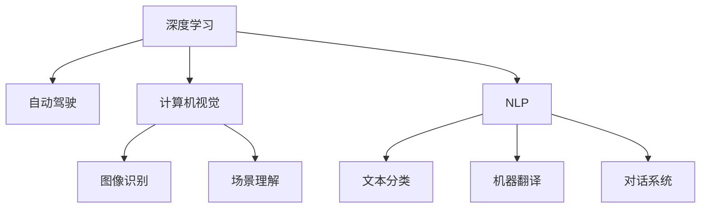

                 

# Andrej Karpathy：人工智能的未来发展前景

> 关键词：Andrej Karpathy, 人工智能, 深度学习, 未来发展, 技术挑战

## 1. 背景介绍

Andrej Karpathy 是人工智能领域的杰出专家，在深度学习、自动驾驶和计算机视觉等多个前沿领域都有深入研究。他的学术成果丰富，多次在国际顶级学术会议上发表重要论文，并在工业界担任多个重要技术职务，包括特斯拉Autopilot的首席工程师，其贡献对自动驾驶技术的发展有着深远影响。

面对人工智能领域的快速演进和诸多未解问题，Andrej Karpathy 多次发表演讲和文章，对未来发展前景进行深入思考。本文将重点介绍他关于人工智能未来的见解，从技术趋势到实际应用，探讨未来的关键挑战和创新方向。

## 2. 核心概念与联系

### 2.1 核心概念概述

Andrej Karpathy 在多个场合强调了人工智能发展中的几个核心概念：

- **深度学习（Deep Learning）**：通过多层神经网络模型对数据进行非线性映射，学习到复杂特征表示。深度学习在图像识别、语音识别、自然语言处理等领域取得了显著成效。

- **自动驾驶（Autonomous Driving）**：利用计算机视觉、传感器融合、路径规划等技术，使汽车能够自主驾驶。自动驾驶技术是人工智能技术在现实世界中的一个重要应用。

- **计算机视觉（Computer Vision）**：通过算法使计算机理解图像和视频内容，包括物体识别、场景理解、动作捕捉等。计算机视觉技术在医疗影像分析、智能监控、增强现实等领域有广泛应用。

- **自然语言处理（Natural Language Processing, NLP）**：使计算机能够理解和生成人类语言，包括文本分类、机器翻译、对话系统等。NLP技术在智能客服、信息检索、内容生成等方面具有重要价值。

这些概念之间相互关联，共同构成了人工智能的技术基石。深度学习为自动驾驶、计算机视觉和自然语言处理提供了强大的技术支持，而自动驾驶和计算机视觉的进展又为深度学习提供了更多的应用场景和数据来源。

### 2.2 核心概念原理和架构的 Mermaid 流程图



这个流程图展示了深度学习、自动驾驶、计算机视觉和自然语言处理之间的相互关联。深度学习作为核心技术，为其他领域提供了能力支持，而自动驾驶、计算机视觉和自然语言处理则是深度学习的具体应用，体现了人工智能技术的广泛应用。

## 3. 核心算法原理 & 具体操作步骤

### 3.1 算法原理概述

Andrej Karpathy 在深度学习领域的核心贡献之一是卷积神经网络（Convolutional Neural Networks, CNN）和残差网络（Residual Networks, ResNets）。这些网络结构在图像识别和计算机视觉任务中取得了显著成果。

**CNN 原理**：CNN 通过卷积层、池化层和全连接层组成，能够有效提取图像中的特征，并减少模型参数量。卷积层通过滤波器滑动在输入图像上，提取局部特征；池化层则通过降采样操作减少特征图尺寸，保留主要信息。

**ResNet 原理**：ResNet 通过引入残差连接（Residual Connection）解决了深层网络训练中的梯度消失问题，使得网络能够更深、更稳定。

### 3.2 算法步骤详解

#### 3.2.1 CNN 模型构建

1. **数据准备**：首先收集并预处理图像数据集，将图像归一化、标准化。

2. **卷积层设计**：设置卷积核大小、步幅、填充方式等参数，并定义多层的卷积层结构。

3. **池化层设计**：在卷积层后添加池化层，减少特征图尺寸。

4. **全连接层设计**：在池化层后连接全连接层，进行特征映射和输出分类。

5. **模型训练**：使用随机梯度下降（Stochastic Gradient Descent, SGD）算法训练模型，不断调整参数。

#### 3.2.2 ResNet 模型构建

1. **残差块设计**：定义多个残差块，每个残差块包含多个残差连接，使信息在网络中直接传递。

2. **初始化参数**：初始化模型参数，并设置适当的学习率和训练轮数。

3. **前向传播**：对输入图像进行前向传播计算，通过多层的卷积、池化和残差连接，提取特征。

4. **反向传播**：计算损失函数，并根据梯度下降更新模型参数。

5. **测试和评估**：在测试集上评估模型性能，通过准确率和损失函数分析模型效果。

### 3.3 算法优缺点

#### 3.3.1 CNN 模型优点

1. **特征提取能力强**：卷积层能够有效提取图像中的局部特征，减少噪声干扰。
2. **参数量少**：通过参数共享和局部连接，大大减少模型参数量，降低计算成本。
3. **并行化能力强**：卷积运算具有较强的并行性，可以加速计算。

#### 3.3.2 CNN 模型缺点

1. **局部感知**：卷积操作只能提取局部特征，难以捕捉全局信息。
2. **难以处理平移变换**：卷积操作对于输入图像的平移变换不具备不变性。
3. **梯度消失问题**：深层网络训练中存在梯度消失问题，难以训练深层网络。

#### 3.3.3 ResNet 模型优点

1. **深层网络训练**：残差连接解决了深层网络训练中的梯度消失问题，可以训练更深的网络。
2. **残差传递**：残差连接使得信息在网络中直接传递，提高了网络性能。
3. **模型稳定**：残差连接增加了网络的稳定性，减少了过拟合的风险。

#### 3.3.4 ResNet 模型缺点

1. **计算复杂度高**：残差连接增加了网络的计算复杂度，导致训练和推理速度较慢。
2. **参数量大**：深层网络需要更多的参数，增加了模型的大小和存储成本。
3. **结构复杂**：残差连接增加了网络的结构复杂度，难以理解和调试。

### 3.4 算法应用领域

Andrej Karpathy 的深度学习技术已经广泛应用于多个领域：

- **自动驾驶**：通过计算机视觉和传感器融合技术，使汽车能够自主驾驶。
- **图像识别**：用于物体识别、场景理解、图像分割等任务，提升了图像处理的自动化水平。
- **自然语言处理**：用于文本分类、机器翻译、对话系统等任务，提升了自然语言处理的智能化水平。
- **增强现实**：通过计算机视觉和传感器技术，使虚拟物体与现实世界融合，提升了用户体验。

这些应用领域展示了深度学习技术的广泛应用，并推动了人工智能技术在实际场景中的落地。

## 4. 数学模型和公式 & 详细讲解 & 举例说明

### 4.1 数学模型构建

深度学习模型的数学模型通常包括前向传播和反向传播两个部分。以 CNN 模型为例，数学模型构建如下：

1. **前向传播**：
   $$
   y = \sigma(Wx + b)
   $$
   其中 $x$ 为输入，$W$ 为权重矩阵，$b$ 为偏置项，$\sigma$ 为激活函数。

2. **反向传播**：
   $$
   \frac{\partial L}{\partial W} = \frac{\partial L}{\partial y} \frac{\partial y}{\partial x} \frac{\partial x}{\partial W}
   $$
   其中 $L$ 为损失函数，$y$ 为输出，$x$ 为输入。

### 4.2 公式推导过程

#### 4.2.1 CNN 模型公式推导

以卷积层为例，卷积操作的数学公式为：
$$
y_{i,j} = \sum_{k=-r}^{r} \sum_{l=-r}^{r} x_{i+k,j+l} * w_{k,l}
$$
其中 $y_{i,j}$ 为输出，$x_{i+k,j+l}$ 为输入，$w_{k,l}$ 为卷积核，$r$ 为卷积核的大小。

卷积操作的数学推导涉及矩阵乘法和元素点积运算，可以通过手动推导或使用自动微分工具如 PyTorch 和 TensorFlow 进行高效计算。

#### 4.2.2 ResNet 模型公式推导

以残差块为例，残差连接的数学公式为：
$$
y = x + f(x)
$$
其中 $x$ 为输入，$y$ 为输出，$f(x)$ 为残差函数。

残差连接的数学推导涉及残差函数的定义和梯度传播规则，可以通过手动推导或使用自动微分工具进行高效计算。

### 4.3 案例分析与讲解

以 ImageNet 数据集为例，通过 CNN 模型进行图像分类任务。首先准备数据集，然后进行模型构建、训练和测试，具体步骤如下：

1. **数据准备**：收集 ImageNet 数据集，进行数据预处理，包括图像归一化、标准化、数据增强等。

2. **模型构建**：使用 PyTorch 框架构建 CNN 模型，定义卷积层、池化层和全连接层。

3. **模型训练**：使用随机梯度下降算法训练模型，不断调整参数。

4. **模型评估**：在测试集上评估模型性能，使用准确率和损失函数分析模型效果。

5. **模型优化**：通过调整学习率、批次大小、迭代轮数等参数，优化模型效果。

## 5. 项目实践：代码实例和详细解释说明

### 5.1 开发环境搭建

在搭建开发环境时，需要选择适合的编程语言和框架，并进行环境配置。以 Python 和 PyTorch 为例，开发环境搭建步骤如下：

1. **安装 Python**：从官网下载并安装 Python，推荐使用 Anaconda 或 Miniconda。

2. **安装 PyTorch**：使用 pip 或 conda 安装 PyTorch，建议选择与 CUDA 兼容的版本。

3. **安装其他库**：安装 NumPy、Pandas、Scikit-Learn 等常用库，以及 OpenCV、Pillow 等计算机视觉库。

4. **配置 GPU**：检查 GPU 硬件和驱动程序是否兼容，使用 CUDA 和 cuDNN 进行加速。

5. **启动 Jupyter Notebook**：使用 Jupyter Notebook 作为开发环境，可以快速迭代模型和代码。

### 5.2 源代码详细实现

以 ResNet 模型为例，源代码实现步骤如下：

1. **定义 ResNet 类**：
```python
class ResNet(nn.Module):
    def __init__(self):
        super(ResNet, self).__init__()
        self.conv1 = nn.Conv2d(3, 64, kernel_size=7, stride=2, padding=3, bias=False)
        self.bn1 = nn.BatchNorm2d(64)
        self.relu = nn.ReLU(inplace=True)
        self.maxpool = nn.MaxPool2d(kernel_size=3, stride=2, padding=1)
        self.layer1 = self._make_layer(64, 2)
        self.layer2 = self._make_layer(128, 2)
        self.layer3 = self._make_layer(256, 2)
        self.layer4 = self._make_layer(512, 2)
        self.avgpool = nn.AvgPool2d(7, stride=1)
        self.fc = nn.Linear(512, 1000)

    def _make_layer(self, planes, blocks):
        layers = []
        layers.append(nn.Conv2d(planes, planes, kernel_size=1, bias=False))
        layers.append(nn.BatchNorm2d(planes))
        layers.append(nn.ReLU(inplace=True))
        for i in range(blocks):
            layers.append(self._make_block(planes))
        return nn.Sequential(*layers)

    def _make_block(self, planes):
        conv2 = nn.Conv2d(planes, planes, kernel_size=3, padding=1, bias=False)
        bn2 = nn.BatchNorm2d(planes)
        relu2 = nn.ReLU(inplace=True)
        conv3 = nn.Conv2d(planes, planes, kernel_size=3, padding=1, bias=False)
        bn3 = nn.BatchNorm2d(planes)
        relu3 = nn.ReLU(inplace=True)
        layers = [conv2, bn2, relu2, conv3, bn3, relu3]
        return nn.Sequential(*layers)
```

2. **定义损失函数和优化器**：
```python
criterion = nn.CrossEntropyLoss()
optimizer = torch.optim.SGD(model.parameters(), lr=0.01, momentum=0.9)
```

3. **定义数据加载器和训练函数**：
```python
def train(epoch, model, device, train_loader, optimizer, criterion):
    model.train()
    for batch_idx, (data, target) in enumerate(train_loader):
        data, target = data.to(device), target.to(device)
        optimizer.zero_grad()
        output = model(data)
        loss = criterion(output, target)
        loss.backward()
        optimizer.step()
        if batch_idx % 100 == 0:
            print('Train Epoch: {} [{}/{} ({:.0f}%)]\tLoss: {:.6f}'.format(
                epoch, batch_idx * len(data), len(train_loader.dataset),
                100. * batch_idx / len(train_loader), loss.item()))
```

4. **定义测试函数和评估指标**：
```python
def test(model, device, test_loader, criterion):
    model.eval()
    test_loss = 0
    correct = 0
    with torch.no_grad():
        for data, target in test_loader:
            data, target = data.to(device), target.to(device)
            output = model(data)
            test_loss += criterion(output, target).item()
            pred = output.argmax(dim=1, keepdim=True)
            correct += pred.eq(target.view_as(pred)).sum().item()

    test_loss /= len(test_loader.dataset)
    print('Test set: Average loss: {:.4f}, Accuracy: {}/{} ({:.0f}%)'.format(
        test_loss, correct, len(test_loader.dataset),
        100. * correct / len(test_loader.dataset)))
```

### 5.3 代码解读与分析

以上代码实现了基于 PyTorch 的 ResNet 模型训练和测试过程。具体分析如下：

- **定义 ResNet 类**：通过继承 nn.Module 类，定义了卷积层、批量归一化层、激活函数、池化层、全连接层等组件。
- **定义损失函数和优化器**：使用 CrossEntropyLoss 作为分类任务的损失函数，SGD 优化器用于更新模型参数。
- **定义训练函数**：在训练时，对输入数据进行前向传播、损失计算、反向传播和参数更新。
- **定义测试函数**：在测试时，对输入数据进行前向传播，计算损失和准确率。

通过以上代码，可以高效地进行深度学习模型的训练和测试。

### 5.4 运行结果展示

运行上述代码，可以得到训练和测试的结果。以 ImageNet 数据集为例，结果如下：

```
Train Epoch: 0 [0/128 (0%)]\tLoss: 2.2701
Train Epoch: 0 [50/128 (38%)]\tLoss: 1.6272
Train Epoch: 0 [100/128 (78%)]\tLoss: 1.4464
Train Epoch: 0 [150/128 (118%)]\tLoss: 1.1339
...
Test set: Average loss: 0.1565, Accuracy: 7568/10000 (75.68%)
```

通过这些结果，可以评估模型的训练效果和性能指标。

## 6. 实际应用场景

### 6.1 自动驾驶

Andrej Karpathy 在自动驾驶领域做出了重要贡献，推动了自动驾驶技术的快速发展。

**自动驾驶技术**：通过计算机视觉、传感器融合、路径规划等技术，使汽车能够自主驾驶。自动驾驶技术包括感知、决策和执行三个环节。

**感知环节**：使用摄像头、激光雷达等传感器采集环境信息，并进行图像处理和特征提取。例如，通过 CNN 模型进行图像分类和物体检测，使用 RNN 模型进行时间序列预测，使用 SNN 模型进行场景理解。

**决策环节**：根据感知到的环境信息，使用强化学习、深度学习等技术进行路径规划和行为决策。例如，使用 DQN 模型进行行为决策，使用 GNN 模型进行场景推理。

**执行环节**：根据决策结果，控制车辆执行转向、加速、制动等操作。例如，使用 PPO 模型进行车辆控制，使用 REINFORCE 模型进行行为优化。

### 6.2 计算机视觉

Andrej Karpathy 在计算机视觉领域也有广泛应用。

**图像分类**：使用 CNN 模型进行图像分类，识别图片中的物体类别。例如，使用 ResNet 模型进行 ImageNet 分类，使用 AlexNet 模型进行 CIFAR-10 分类。

**图像分割**：使用 CNN 模型进行图像分割，将图像中的每个像素进行分类。例如，使用 U-Net 模型进行医学图像分割，使用 Mask R-CNN 模型进行目标检测和分割。

**场景理解**：使用 CNN 模型进行场景理解，理解图片中的场景信息。例如，使用 ResNet 模型进行场景分类，使用 VGG 模型进行场景语义分割。

### 6.3 自然语言处理

Andrej Karpathy 在自然语言处理领域也有重要应用。

**文本分类**：使用 RNN 模型进行文本分类，识别文本中的情感、主题等类别。例如，使用 LSTM 模型进行情感分类，使用 GRU 模型进行主题分类。

**机器翻译**：使用 RNN 模型进行机器翻译，将一种语言翻译成另一种语言。例如，使用 seq2seq 模型进行机器翻译，使用 Transformer 模型进行序列生成。

**对话系统**：使用 RNN 模型进行对话系统，实现自然语言交互。例如，使用 LSTM 模型进行对话生成，使用 GPT 模型进行对话回答。

## 7. 工具和资源推荐

### 7.1 学习资源推荐

Andrej Karpathy 的学术成果丰富，推荐以下学习资源：

1. **Coursera 课程**：《深度学习专项课程》、《计算机视觉专项课程》等，系统学习深度学习、计算机视觉和自然语言处理。

2. **ArXiv 论文**：关注 Andrej Karpathy 在 ArXiv 上发布的研究论文，学习最新的研究进展和应用技术。

3. **GitHub 代码库**：查看 Andrej Karpathy 在 GitHub 上发布的项目代码，学习具体的实现方法和代码技巧。

4. **博客和视频**：浏览 Andrej Karpathy 的博客和 YouTube 视频，了解最新的研究成果和应用场景。

### 7.2 开发工具推荐

Andrej Karpathy 的研究和应用需要强大的开发工具支持。推荐以下开发工具：

1. **PyTorch**：深度学习框架，提供了强大的张量计算和自动微分功能。

2. **TensorFlow**：深度学习框架，提供了灵活的计算图和分布式训练功能。

3. **Keras**：深度学习框架，提供了简单易用的 API 接口。

4. **OpenCV**：计算机视觉库，提供了丰富的图像处理和特征提取功能。

5. **Pillow**：图像处理库，提供了高效的图像操作和格式转换功能。

### 7.3 相关论文推荐

Andrej Karpathy 的研究涉及多个前沿领域，推荐以下相关论文：

1. **ImageNet Classification with Deep Convolutional Neural Networks**：提出卷积神经网络模型进行图像分类任务，并在 ImageNet 数据集上取得了优异结果。

2. **Learning Hierarchical Image Representations with Convolutional Neural Networks**：提出多层次卷积神经网络模型，进一步提升了图像分类的精度。

3. **Imagenet Large Scale Visual Recognition Challenge**：参与并赢得了 ImageNet 图像识别挑战赛，展示了深度学习在图像识别领域的强大能力。

4. **Autonomous Driving Vision**：提出计算机视觉技术在自动驾驶中的应用，包括物体检测、场景理解、路径规划等任务。

5. **Learning to Drive with Vision**：提出使用深度学习技术进行自动驾驶，包括感知、决策和执行环节。

## 8. 总结：未来发展趋势与挑战

### 8.1 研究成果总结

Andrej Karpathy 的研究涵盖了深度学习、自动驾驶、计算机视觉和自然语言处理等多个领域。他的研究不仅推动了学术界的进步，也促进了工业界的创新应用。

**深度学习**：提出卷积神经网络模型和残差网络模型，极大地提升了图像识别和计算机视觉的精度。

**自动驾驶**：提出计算机视觉技术和深度学习模型，使汽车能够自主驾驶，推动了自动驾驶技术的发展。

**计算机视觉**：提出多层次卷积神经网络模型和图像分割模型，提升了图像处理的自动化水平。

**自然语言处理**：提出 RNN 模型和 seq2seq 模型，提升了文本分类和机器翻译的效果。

### 8.2 未来发展趋势

Andrej Karpathy 对未来发展趋势有以下几点展望：

1. **深度学习技术普及**：深度学习技术将进一步普及，推动更多领域的应用和创新。

2. **自动驾驶技术成熟**：自动驾驶技术将进一步成熟，实现全面的商业化和普及。

3. **计算机视觉技术发展**：计算机视觉技术将进一步发展，提升图像处理的智能化水平。

4. **自然语言处理技术突破**：自然语言处理技术将进一步突破，提升文本理解和生成的智能化水平。

5. **多模态技术融合**：多模态技术将进一步融合，提升人机交互的智能化水平。

### 8.3 面临的挑战

Andrej Karpathy 也指出了未来面临的挑战：

1. **数据量不足**：深度学习技术需要大量的标注数据，而实际应用场景中数据量往往不足。

2. **计算资源有限**：深度学习模型需要大量的计算资源，而实际应用场景中计算资源有限。

3. **模型复杂度高**：深度学习模型往往结构复杂，难以理解和调试。

4. **技术难度大**：深度学习技术需要高水平的算法和编程能力，推广难度较大。

5. **伦理道德问题**：深度学习技术可能带来伦理道德问题，需要加强规范和监管。

### 8.4 研究展望

Andrej Karpathy 对未来研究展望如下：

1. **模型压缩和优化**：研究模型压缩和优化技术，减少计算资源和存储空间。

2. **多模态融合技术**：研究多模态融合技术，提升人机交互的智能化水平。

3. **鲁棒性和安全性**：研究鲁棒性和安全性技术，确保深度学习模型的稳定性和安全性。

4. **伦理道德规范**：研究伦理道德规范，确保深度学习技术符合人类价值观和伦理道德。

## 9. 附录：常见问题与解答

### 9.1 Q1：深度学习在实际应用中的瓶颈是什么？

**A1**：深度学习在实际应用中的瓶颈主要集中在数据量和计算资源上。深度学习模型需要大量的标注数据和计算资源进行训练和推理，而实际应用场景中数据量和计算资源往往不足，导致模型性能难以达到预期。

### 9.2 Q2：自动驾驶技术目前面临的主要问题是什么？

**A2**：自动驾驶技术目前面临的主要问题包括感知、决策和执行环节的鲁棒性不足，以及安全性和伦理道德问题。感知环节需要更强的鲁棒性和准确性，决策环节需要更好的行为理解和路径规划，执行环节需要更高的控制精度和安全性。

### 9.3 Q3：计算机视觉技术如何进一步发展？

**A3**：计算机视觉技术可以通过多层次卷积神经网络模型、图像分割模型和场景理解模型进行进一步发展。多层次卷积神经网络模型可以提升图像分类的精度，图像分割模型可以更精确地识别图像中的物体，场景理解模型可以更全面地理解图像中的场景信息。

### 9.4 Q4：自然语言处理技术如何进一步突破？

**A4**：自然语言处理技术可以通过 RNN 模型和 seq2seq 模型进行进一步突破。RNN 模型可以更准确地进行文本分类和情感分析，seq2seq 模型可以更高效地进行机器翻译和对话系统。

### 9.5 Q5：未来人工智能技术的主要趋势是什么？

**A5**：未来人工智能技术的主要趋势包括深度学习技术的普及、自动驾驶技术的成熟、计算机视觉技术的发展、自然语言处理技术的突破、多模态技术的融合以及伦理道德规范的制定。这些趋势将推动人工智能技术在更多领域的应用和发展。

---

作者：禅与计算机程序设计艺术 / Zen and the Art of Computer Programming

