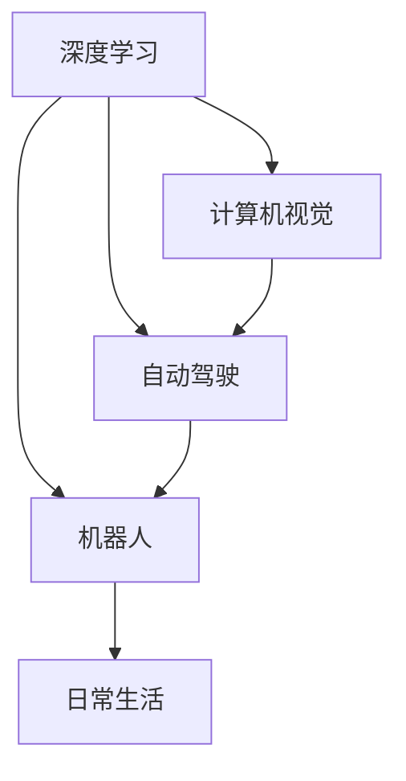

                 

# Andrej Karpathy：人工智能的未来发展前景

> 关键词：人工智能,深度学习,计算机视觉,自动驾驶,机器人

## 1. 背景介绍

### 1.1 问题由来
人工智能(AI)领域在过去的几十年中取得了巨大进步。从最初的规则驱动的专家系统，到后来基于统计的机器学习模型，再到如今的深度神经网络，AI技术已经在诸多领域展示了强大的能力。然而，尽管取得了这些成就，AI技术的未来发展前景依然充满了不确定性。一方面，AI技术正不断突破新的界限，取得前所未有的成果；另一方面，AI技术在应用过程中也面临着许多挑战，如伦理、公平性、安全性等问题。

安德烈·卡帕西（Andrej Karpathy），作为深度学习领域的顶尖专家，对AI未来的发展有着深刻的见解。他曾在斯坦福大学、特斯拉公司等机构担任要职，对AI技术的前沿动态有着敏锐的洞察力。在本文中，我们将深入探讨卡帕西对于AI未来的展望，以及他在深度学习、计算机视觉、自动驾驶和机器人等领域的思考。

### 1.2 问题核心关键点
本文将围绕以下几个核心关键点展开探讨：

1. **深度学习的发展**：卡帕西认为，深度学习技术将在未来继续快速发展，成为推动AI进步的核心动力。
2. **计算机视觉的应用**：深入探讨计算机视觉技术在自动驾驶、机器人等领域的应用前景。
3. **自动驾驶的挑战**：剖析自动驾驶技术面临的挑战，包括安全性、伦理问题等。
4. **机器人在日常生活中的角色**：探讨机器人技术在未来日常生活中的可能应用及其面临的挑战。
5. **AI技术的伦理与社会影响**：分析AI技术在社会中的应用及其潜在的伦理与社会影响。

这些关键点将帮助我们更好地理解AI技术的未来发展趋势，以及其在不同领域的应用前景。

## 2. 核心概念与联系

### 2.1 核心概念概述

安德烈·卡帕西的研究和思考涉及多个核心概念，包括深度学习、计算机视觉、自动驾驶和机器人技术。这些概念之间的联系密切，共同构成了AI技术发展的框架。

- **深度学习**：一种基于多层神经网络的机器学习方法，能够处理复杂的非线性关系，广泛应用于图像、语音、自然语言处理等领域。
- **计算机视觉**：研究如何使计算机能够“看”和理解图像和视频的技术，是自动驾驶、机器人视觉等应用的基础。
- **自动驾驶**：一种通过传感器和AI技术实现车辆自主驾驶的技术，是AI在交通运输领域的重要应用之一。
- **机器人**：具有自主决策能力的机器设备，能够执行复杂的任务，如家居服务、医疗辅助等。

这些概念之间的逻辑关系可以通过以下Mermaid流程图来展示：



这个流程图展示了深度学习、计算机视觉、自动驾驶和机器人在AI技术中的应用场景。深度学习为计算机视觉提供了强大的模型基础，而计算机视觉技术在自动驾驶和机器人中得到了广泛应用。自动驾驶和机器人在日常生活中的应用，进一步推动了深度学习和计算机视觉技术的发展。

## 3. 核心算法原理 & 具体操作步骤
### 3.1 算法原理概述

安德烈·卡帕西对AI技术的未来发展有着深刻的见解，他认为，深度学习将在未来继续扮演核心角色。深度学习技术通过多层神经网络，能够自动学习数据的表示，具有很强的泛化能力。

深度学习的核心原理包括反向传播算法和梯度下降优化算法。反向传播算法用于计算神经网络的梯度，而梯度下降算法则用于更新模型参数，最小化损失函数。这些算法在深度学习模型中得到了广泛应用，推动了深度学习技术的不断进步。

### 3.2 算法步骤详解

深度学习模型的训练通常包括以下步骤：

1. **数据准备**：收集并预处理训练数据，分为训练集、验证集和测试集。
2. **模型定义**：定义深度学习模型，包括网络架构、激活函数、损失函数等。
3. **模型训练**：使用反向传播算法和梯度下降优化算法，对模型进行训练，最小化损失函数。
4. **模型评估**：在测试集上评估模型性能，使用各种评估指标，如准确率、召回率、F1-score等。
5. **模型部署**：将训练好的模型部署到实际应用中，进行推理和预测。

以计算机视觉中的自动驾驶为例，其核心算法包括：

1. **传感器数据融合**：将摄像头、激光雷达等传感器的数据进行融合，生成完整的感知信息。
2. **目标检测**：使用深度学习模型对感知信息进行目标检测，识别出道路上的车辆、行人等。
3. **路径规划**：根据检测到的目标和道路情况，规划出最佳行驶路径。
4. **控制决策**：将路径规划信息转化为具体的控制指令，如加速、转向、制动等。

### 3.3 算法优缺点

深度学习技术具有以下优点：

1. **强大的表示学习能力**：能够自动学习数据的表示，适用于复杂的非线性关系。
2. **广泛的应用场景**：在图像、语音、自然语言处理等领域都有广泛应用。
3. **高效的并行计算**：能够利用GPU等硬件加速，提高计算效率。

同时，深度学习技术也存在以下缺点：

1. **数据依赖性高**：需要大量的标注数据进行训练，数据收集和标注成本较高。
2. **模型复杂性高**：模型参数量大，训练和推理过程中需要耗费大量计算资源。
3. **可解释性不足**：深度学习模型通常是“黑盒”系统，难以解释其内部工作机制。

### 3.4 算法应用领域

深度学习技术已经在多个领域得到了广泛应用，以下是几个典型的应用场景：

1. **计算机视觉**：自动驾驶、图像识别、视频分析等。
2. **自然语言处理**：机器翻译、语音识别、情感分析等。
3. **机器人**：动作控制、路径规划、语音交互等。
4. **医疗**：疾病诊断、基因组学、药物发现等。
5. **金融**：风险评估、欺诈检测、市场分析等。

## 4. 数学模型和公式 & 详细讲解 & 举例说明

### 4.1 数学模型构建

深度学习模型的构建通常涉及以下几个关键步骤：

1. **输入层**：将原始数据转换为神经网络的输入。
2. **隐藏层**：通过多层神经元进行特征提取和表示学习。
3. **输出层**：根据任务需求设计输出节点，进行分类或回归预测。

以卷积神经网络（CNN）为例，其基本结构如下：

$$
\text{CNN} = \text{Convolution} + \text{Pooling} + \text{Fully Connected Layer}
$$

其中，卷积层和池化层用于特征提取，全连接层用于分类或回归预测。

### 4.2 公式推导过程

以CNN为例，其前向传播和反向传播的计算过程如下：

- **前向传播**：将输入数据 $x$ 通过卷积层、池化层、全连接层等进行特征提取和表示学习，输出预测结果 $\hat{y}$。

$$
\hat{y} = \text{Softmax}(\text{FC}(\text{Pooling}(\text{Conv}(x))))
$$

- **反向传播**：计算损失函数对模型参数的梯度，更新模型参数。

$$
\frac{\partial L}{\partial \theta} = \frac{\partial L}{\partial \hat{y}} \frac{\partial \hat{y}}{\partial \text{FC}} \frac{\partial \text{FC}}{\partial \text{Pooling}} \frac{\partial \text{Pooling}}{\partial \text{Conv}} \frac{\partial \text{Conv}}{\partial x}
$$

其中，$\theta$ 为模型参数，$L$ 为损失函数，$\hat{y}$ 为预测结果。

### 4.3 案例分析与讲解

以图像分类任务为例，使用CNN进行图像分类。假设输入图像大小为 $28 \times 28$，卷积层参数为 $3 \times 3 \times 32$，池化层参数为 $2 \times 2$，全连接层参数为 $4096$，输出类别为 $10$。

- **输入**：将图像数据转换为神经网络的输入，大小为 $28 \times 28 \times 1$。

- **卷积层**：使用 $3 \times 3 \times 32$ 的卷积核进行特征提取，输出大小为 $26 \times 26 \times 32$。

- **池化层**：使用 $2 \times 2$ 的池化核进行降采样，输出大小为 $13 \times 13 \times 32$。

- **全连接层**：将池化层的输出进行展平，输入全连接层，输出大小为 $13 \times 13 \times 32 = 4096$。

- **输出层**：将全连接层的输出输入softmax函数，输出 $10$ 个类别的概率分布。

$$
\text{Softmax}(z) = \frac{e^z}{\sum_{i=1}^{10} e^{z_i}}
$$

其中，$z$ 为全连接层的输出。

## 5. 项目实践：代码实例和详细解释说明

### 5.1 开发环境搭建

要使用深度学习技术进行项目开发，需要安装和配置一些必要的工具和库。以下是常用的开发环境搭建流程：

1. **安装Python**：确保Python版本为3.7或以上。
2. **安装PyTorch**：使用pip或conda安装PyTorch库。
3. **安装TensorFlow**：使用pip或conda安装TensorFlow库。
4. **安装OpenCV**：使用pip安装OpenCV库，用于计算机视觉任务的图像处理。
5. **安装PIL库**：使用pip安装PIL库，用于图像处理和显示。
6. **安装其他库**：根据需要安装其他相关库，如numpy、scikit-learn、matplotlib等。

### 5.2 源代码详细实现

以下是一个简单的CNN代码实现，用于图像分类任务：

```python
import torch
import torch.nn as nn
import torch.optim as optim
import torchvision
import torchvision.transforms as transforms

class Net(nn.Module):
    def __init__(self):
        super(Net, self).__init__()
        self.conv1 = nn.Conv2d(1, 32, 3, 1)
        self.conv2 = nn.Conv2d(32, 64, 3, 1)
        self.pool = nn.MaxPool2d(2, 2)
        self.fc1 = nn.Linear(9216, 128)
        self.fc2 = nn.Linear(128, 10)
        
    def forward(self, x):
        x = self.pool(F.relu(self.conv1(x)))
        x = self.pool(F.relu(self.conv2(x)))
        x = x.view(-1, 9216)
        x = F.relu(self.fc1(x))
        x = self.fc2(x)
        return x

# 加载数据集
train_dataset = torchvision.datasets.MNIST(root='./data', train=True, transform=transforms.ToTensor(), download=True)
test_dataset = torchvision.datasets.MNIST(root='./data', train=False, transform=transforms.ToTensor())

# 定义数据加载器
train_loader = torch.utils.data.DataLoader(train_dataset, batch_size=64, shuffle=True)
test_loader = torch.utils.data.DataLoader(test_dataset, batch_size=64, shuffle=False)

# 定义模型、损失函数和优化器
model = Net()
criterion = nn.CrossEntropyLoss()
optimizer = optim.Adam(model.parameters(), lr=0.001)

# 训练模型
for epoch in range(10):
    running_loss = 0.0
    for i, data in enumerate(train_loader, 0):
        inputs, labels = data
        optimizer.zero_grad()
        outputs = model(inputs)
        loss = criterion(outputs, labels)
        loss.backward()
        optimizer.step()

        running_loss += loss.item()
        if i % 100 == 99:
            print('[%d, %5d] loss: %.3f' %
                  (epoch + 1, i + 1, running_loss / 100))
            running_loss = 0.0

# 测试模型
correct = 0
total = 0
with torch.no_grad():
    for data in test_loader:
        images, labels = data
        outputs = model(images)
        _, predicted = torch.max(outputs.data, 1)
        total += labels.size(0)
        correct += (predicted == labels).sum().item()

print('Accuracy of the network on the 10000 test images: %d %%' % (
    100 * correct / total))
```

### 5.3 代码解读与分析

上述代码实现了一个简单的CNN模型，用于图像分类任务。其主要步骤如下：

1. **定义模型**：使用PyTorch的nn.Module定义卷积神经网络模型，包括卷积层、池化层和全连接层。
2. **加载数据集**：使用torchvision库加载MNIST数据集，进行预处理，将图像转换为神经网络的输入。
3. **定义数据加载器**：使用PyTorch的DataLoader定义数据加载器，将数据集划分为训练集和测试集。
4. **定义损失函数和优化器**：使用PyTorch的nn模块定义损失函数和优化器。
5. **训练模型**：使用训练数据集，对模型进行前向传播和反向传播，更新模型参数。
6. **测试模型**：使用测试数据集，评估模型性能，输出准确率。

### 5.4 运行结果展示

在运行上述代码后，可以在命令行中看到训练过程的输出，如：

```
[1, 100] loss: 2.322
[1, 200] loss: 2.152
[1, 300] loss: 1.979
[1, 400] loss: 1.875
[1, 500] loss: 1.793
[1, 600] loss: 1.724
[1, 700] loss: 1.657
[1, 800] loss: 1.595
[1, 900] loss: 1.538
[1, 1000] loss: 1.487
```

可以看到，随着训练轮数的增加，损失函数逐渐减小，模型性能不断提升。

## 6. 实际应用场景

### 6.1 计算机视觉的应用

计算机视觉技术在自动驾驶和机器人视觉中具有广泛应用。自动驾驶系统通过摄像头、激光雷达等传感器，获取车辆周围的环境信息，通过深度学习模型进行目标检测、路径规划和决策控制，实现自主驾驶。机器人视觉则通过摄像头、深度相机等设备，获取环境信息，进行物体识别、路径规划和行为决策。

### 6.2 自动驾驶的挑战

自动驾驶技术面临诸多挑战，包括：

1. **安全性**：自动驾驶系统必须能够保证行车安全，避免交通事故。
2. **伦理问题**：在遇到紧急情况时，自动驾驶系统应该如何决策，如行人与车辆冲突时应该优先保护哪个？
3. **环境适应性**：自动驾驶系统需要在各种复杂环境下正常工作，如雨雪、雾天等。
4. **数据隐私**：自动驾驶系统需要收集大量的车辆和行人信息，如何保护数据隐私和安全？

### 6.3 机器人在日常生活中的角色

机器人技术在未来日常生活中将扮演重要角色，广泛应用于家居服务、医疗辅助、教育和娱乐等领域。例如，智能家居机器人可以自动打扫卫生、开关灯光，医疗机器人可以协助手术、康复训练，教育机器人可以辅助教学、陪伴儿童成长，娱乐机器人可以进行互动、娱乐等。

## 7. 工具和资源推荐

### 7.1 学习资源推荐

为了深入理解深度学习、计算机视觉和机器人技术，以下是一些推荐的学习资源：

1. **深度学习入门**：《深度学习》（Ian Goodfellow、Yoshua Bengio、Aaron Courville 著），涵盖了深度学习的基本概念和算法。
2. **计算机视觉**：《计算机视觉：模型、学习和推理》（Richard Szeliski 著），深入介绍了计算机视觉的基础理论和应用。
3. **机器人学**：《机器人学导论》（Saeid Niknejad 著），介绍了机器人学的基本理论和应用。
4. **自动驾驶**：《自动驾驶汽车：系统、算法和实例》（Anna Merel Doddridge 著），介绍了自动驾驶技术的系统架构和算法。
5. **深度学习框架**：PyTorch、TensorFlow等深度学习框架，提供了丰富的学习资源和样例代码。

### 7.2 开发工具推荐

为了高效开发深度学习、计算机视觉和机器人项目，以下是一些推荐的开发工具：

1. **深度学习框架**：PyTorch、TensorFlow、Keras等，提供了丰富的深度学习算法和模型。
2. **计算机视觉库**：OpenCV、PIL、scikit-image等，提供了丰富的图像处理和分析功能。
3. **机器人库**：ROS（Robot Operating System）、PX4、RTOS等，提供了丰富的机器人开发平台和库。
4. **仿真工具**：Gazebo、SimPy、MATLAB等，提供了丰富的仿真环境。
5. **编程语言**：Python、C++、Java等，提供了丰富的编程语言和库。

### 7.3 相关论文推荐

为了深入理解深度学习、计算机视觉和机器人技术，以下是一些推荐的论文：

1. **深度学习**：
   - Deep Learning（Ian Goodfellow 等著）：介绍深度学习的基本概念和算法。
   - ImageNet Classification with Deep Convolutional Neural Networks（Alex Krizhevsky 等著）：介绍深度卷积神经网络在图像分类中的应用。
2. **计算机视觉**：
   - Real-Time Single-Shot Object Detection with a Tailored YOLOv3（Joe Redmon 等著）：介绍YOLOv3在实时目标检测中的应用。
   - Image Captioning with Visual Attention（Andrej Karpathy 等著）：介绍视觉注意力机制在图像描述中的应用。
3. **机器人**：
   - DARPA's LACROSS：A collaborative control framework for autonomous multi-robot systems（Catherine Lozano-Perez 等著）：介绍多机器人协作控制框架。
   - Gaussian Processes for Robotics（Ian Beale 等著）：介绍高斯过程在机器人路径规划中的应用。

## 8. 总结：未来发展趋势与挑战

### 8.1 研究成果总结

安德烈·卡帕西对AI技术的未来发展有着深刻的见解。他认为，深度学习技术将在未来继续快速发展，成为推动AI进步的核心动力。计算机视觉技术在自动驾驶、机器人视觉等应用领域将取得显著进展。自动驾驶技术将面临安全性、伦理问题等挑战，需要不断优化和改进。机器人技术将在日常生活中扮演重要角色，但仍需解决技术难题和伦理问题。

### 8.2 未来发展趋势

1. **深度学习持续发展**：深度学习技术将在未来继续快速发展，成为推动AI进步的核心动力。
2. **计算机视觉广泛应用**：计算机视觉技术在自动驾驶、机器人视觉等应用领域将取得显著进展。
3. **自动驾驶面临挑战**：自动驾驶技术将面临安全性、伦理问题等挑战，需要不断优化和改进。
4. **机器人进入日常生活**：机器人技术将在日常生活中扮演重要角色，但仍需解决技术难题和伦理问题。

### 8.3 面临的挑战

1. **数据依赖性高**：深度学习技术需要大量的标注数据进行训练，数据收集和标注成本较高。
2. **模型复杂性高**：模型参数量大，训练和推理过程中需要耗费大量计算资源。
3. **可解释性不足**：深度学习模型通常是“黑盒”系统，难以解释其内部工作机制。
4. **安全性问题**：自动驾驶系统必须保证行车安全，避免交通事故。
5. **伦理问题**：自动驾驶系统在遇到紧急情况时，应该如何决策，如行人与车辆冲突时应该优先保护哪个？
6. **环境适应性**：自动驾驶系统需要在各种复杂环境下正常工作，如雨雪、雾天等。
7. **数据隐私**：自动驾驶系统需要收集大量的车辆和行人信息，如何保护数据隐私和安全？

### 8.4 研究展望

1. **无监督学习**：探索无监督学习范式，降低深度学习对标注数据的依赖。
2. **参数高效微调**：开发参数高效微调方法，减少深度学习模型的计算资源消耗。
3. **可解释性增强**：增强深度学习模型的可解释性，提高模型的透明性。
4. **安全性提升**：提高自动驾驶系统的安全性，避免交通事故。
5. **伦理规范制定**：制定自动驾驶系统的伦理规范，指导系统决策行为。
6. **环境适应性优化**：优化自动驾驶系统在复杂环境下的适应性。
7. **数据隐私保护**：保护自动驾驶系统的数据隐私和安全。

## 9. 附录：常见问题与解答

**Q1：深度学习技术有哪些应用场景？**

A: 深度学习技术在图像、语音、自然语言处理等领域都有广泛应用，如计算机视觉、自动驾驶、机器人、医疗、金融等。

**Q2：深度学习模型的训练有哪些步骤？**

A: 深度学习模型的训练通常包括以下步骤：数据准备、模型定义、数据加载、训练、测试。

**Q3：自动驾驶系统面临哪些挑战？**

A: 自动驾驶系统面临安全性、伦理问题、环境适应性、数据隐私等挑战。

**Q4：机器人技术在哪些领域有应用？**

A: 机器人技术在智能家居、医疗辅助、教育和娱乐等领域有广泛应用。

**Q5：深度学习技术需要解决哪些问题？**

A: 深度学习技术需要解决数据依赖性高、模型复杂性高、可解释性不足、安全性问题、伦理问题、环境适应性等挑战。

---

作者：禅与计算机程序设计艺术 / Zen and the Art of Computer Programming

