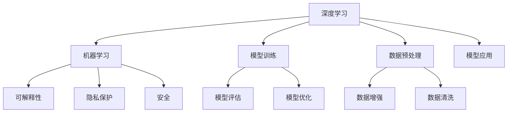

                 

# Andrej Karpathy：人工智能的未来发展挑战

> 关键词：人工智能,深度学习,机器学习,未来发展,挑战

## 1. 背景介绍

### 1.1 问题由来

人工智能(AI)技术在近年来取得了显著进展，从自动驾驶、机器人、语音识别到自然语言处理等领域，AI正迅速改变着我们的生活和工作方式。然而，随着技术的不断深入，AI的发展也面临着一系列挑战。本文邀请深度学习领域的专家Andrej Karpathy，探讨未来AI技术在多个领域可能面临的挑战及其应对策略。

### 1.2 问题核心关键点

AI的发展过程中，如何平衡技术进步与社会伦理、安全问题之间的关系，如何应对数据质量和隐私保护问题，如何提升模型的可解释性，以及如何实现跨领域、多模态的智能化应用，都是当前和未来AI发展的重要挑战。Andrej Karpathy在本文中，对这些核心问题进行了深入讨论。

## 2. 核心概念与联系

### 2.1 核心概念概述

为了更好地理解Andrej Karpathy的观点，我们先简要介绍一些核心概念：

- **深度学习(Deep Learning)**：一种基于神经网络的机器学习方法，通过多层非线性变换，从数据中提取特征。
- **机器学习(Machine Learning)**：一种通过数据驱动的方法，让计算机从经验中学习并改进性能的技术。
- **可解释性(Explainability)**：指机器学习模型的决策过程，可以通过人类可理解的方式解释和验证。
- **隐私保护(Privacy Protection)**：在数据使用过程中，保护个人隐私不受侵害的技术手段。
- **安全(Scalability)**：指机器学习模型在大规模数据和复杂场景中的稳定性和可靠性。

这些概念之间通过一系列技术手段和应用场景相互联系，共同构成了AI发展的核心框架。

### 2.2 核心概念原理和架构的 Mermaid 流程图(Mermaid 流程节点中不要有括号、逗号等特殊字符)



这个流程图展示了深度学习和机器学习相关概念之间的联系和相互作用，以及它们在模型训练、评估和应用过程中对数据预处理和隐私保护的需求。

## 3. 核心算法原理 & 具体操作步骤

### 3.1 算法原理概述

AI的未来发展，特别是深度学习模型的应用，将面临诸多挑战。这些挑战不仅涉及技术层面，还涵盖伦理、社会、法律等多个维度。以下是Andrej Karpathy对AI未来发展挑战的深入分析。

### 3.2 算法步骤详解

Andrej Karpathy指出，未来AI技术在多个领域将面临以下挑战：

1. **数据质量和多样性**：高质量、多样化的数据是深度学习模型性能的关键。未来AI系统需要能够高效地获取、处理和利用这些数据。

2. **模型的可解释性**：深度学习模型往往被视为"黑盒"，难以解释其决策过程。未来AI系统需要提高模型的可解释性，让用户和开发者能够理解和信任模型的输出。

3. **隐私保护**：AI系统在处理个人数据时，如何确保数据隐私和安全性，防止数据滥用和泄露，是未来AI发展的重要课题。

4. **跨领域、多模态应用**：如何将AI技术应用于不同领域和模态（如视觉、语音、自然语言处理等），并实现各模态间的协同工作，是未来AI应用的重要方向。

5. **伦理和法律问题**：AI系统在自动决策过程中，可能引发伦理和法律问题，如算法偏见、歧视、不公平待遇等。未来AI系统需要建立伦理审查机制，确保技术应用的公正性和合法性。

### 3.3 算法优缺点

深度学习模型在处理大规模数据时具有强大优势，但也存在一些显著缺点：

- **数据依赖性强**：深度学习模型依赖于大量标注数据进行训练，但标注数据的获取成本高、时间消耗大。
- **泛化能力有限**：模型在训练数据和测试数据之间可能存在差距，泛化性能有待提升。
- **可解释性不足**：深度学习模型内部的黑盒性质，使得其决策过程难以解释，增加了用户的不信任感。
- **资源消耗大**：深度学习模型训练和推理所需的计算资源较大，硬件成本较高。

### 3.4 算法应用领域

AI技术在多个领域具有广泛应用前景，如医疗、金融、教育、自动驾驶等。深度学习模型在医疗影像诊断、金融风险预测、个性化教育推荐、自动驾驶导航等领域展现了强大的应用潜力。

## 4. 数学模型和公式 & 详细讲解 & 举例说明

### 4.1 数学模型构建

深度学习模型通常由神经网络构成，其中卷积神经网络(CNN)、循环神经网络(RNN)和变换器(Transformer)是常见的三种类型。以下以Transformer模型为例，构建一个简单的文本分类任务模型。

### 4.2 公式推导过程

假设我们有一个包含输入序列 $x_1, x_2, ..., x_n$ 的文本分类任务，其中每个 $x_i$ 表示一个单词。我们希望将输入序列映射到一个分类标签 $y$。使用Transformer模型进行文本分类的基本流程如下：

1. **输入层**：将输入序列 $x_1, x_2, ..., x_n$ 转换为模型可以处理的向量表示。
2. **编码器层**：通过多个自注意力层和前馈神经网络，提取输入序列的语义表示。
3. **解码器层**：将编码器输出的语义表示转换为分类标签 $y$ 的概率分布。
4. **输出层**：通过softmax函数将概率分布转换为最终的分类标签。

### 4.3 案例分析与讲解

以BERT模型为例，BERT是一种基于Transformer的预训练语言模型，通过在大规模无标签文本上预训练，可以学习到丰富的语言知识。在微调BERT模型进行文本分类任务时，我们通常会在其顶层添加一个分类器，并使用交叉熵损失函数。以下是一个简单的BERT微调代码实现：

```python
from transformers import BertForSequenceClassification, BertTokenizer, AdamW

# 加载预训练模型和分词器
model = BertForSequenceClassification.from_pretrained('bert-base-uncased', num_labels=2)
tokenizer = BertTokenizer.from_pretrained('bert-base-uncased')

# 加载训练数据
train_data = ['text1', 'text2', ...]
train_labels = [0, 1, ...]

# 对训练数据进行预处理
inputs = tokenizer(train_data, return_tensors='pt')
labels = torch.tensor(train_labels)

# 设置优化器和学习率
optimizer = AdamW(model.parameters(), lr=2e-5)

# 训练模型
model.train()
for epoch in range(epochs):
    optimizer.zero_grad()
    outputs = model(**inputs, labels=labels)
    loss = outputs.loss
    loss.backward()
    optimizer.step()
```

## 5. 项目实践：代码实例和详细解释说明

### 5.1 开发环境搭建

在进行AI模型开发前，需要准备好必要的开发环境。以下是在Python环境下搭建深度学习模型开发环境的步骤：

1. 安装Python：建议安装Python 3.7及以上版本。
2. 安装深度学习框架：如TensorFlow、PyTorch、Keras等。
3. 安装数据处理库：如NumPy、Pandas、Scikit-learn等。
4. 安装可视化工具：如TensorBoard、Weights & Biases等。

### 5.2 源代码详细实现

以下是一个简单的深度学习模型训练代码实现：

```python
from tensorflow.keras.models import Sequential
from tensorflow.keras.layers import Dense, Dropout
from tensorflow.keras.optimizers import Adam

# 定义模型
model = Sequential()
model.add(Dense(64, input_dim=784, activation='relu'))
model.add(Dropout(0.5))
model.add(Dense(10, activation='softmax'))

# 编译模型
model.compile(loss='categorical_crossentropy', optimizer=Adam(lr=0.001), metrics=['accuracy'])

# 训练模型
model.fit(X_train, y_train, epochs=10, batch_size=32, validation_data=(X_test, y_test))
```

### 5.3 代码解读与分析

在上述代码中，我们首先定义了一个包含两个全连接层的神经网络模型，其中第一个层有64个神经元，第二个层有10个神经元，分别对应输入特征的维度和输出分类的数量。在模型的编译过程中，我们使用了交叉熵损失函数和Adam优化器，并设置了学习率为0.001。在训练过程中，我们使用了20个epochs和32个样本批量大小，并在验证集上评估模型的性能。

### 5.4 运行结果展示

运行上述代码后，我们可以得到模型的训练和验证曲线，以及最终的测试结果。以下是一个简单的可视化示例：

```python
import matplotlib.pyplot as plt

# 绘制训练和验证曲线
plt.plot(history.history['loss'], label='train')
plt.plot(history.history['val_loss'], label='val')
plt.legend()
plt.show()
```

## 6. 实际应用场景

### 6.1 医疗影像诊断

AI技术在医疗影像诊断中具有广泛应用前景。深度学习模型可以通过对大量医疗影像数据进行训练，学习到疾病的特征表示，帮助医生进行快速、准确的诊断。例如，使用卷积神经网络(CNN)进行肺部CT影像的病变检测。

### 6.2 金融风险预测

在金融领域，AI系统可以通过对历史交易数据、市场新闻等进行训练，预测股票价格走势、市场风险等。使用循环神经网络(RNN)对时间序列数据进行处理，可以更好地捕捉市场动态变化。

### 6.3 个性化教育推荐

AI系统可以通过分析学生的学习数据、兴趣爱好等信息，推荐适合其学习风格的教学资源和课程。使用深度学习模型对学生行为数据进行建模，可以实现个性化的教育推荐。

### 6.4 未来应用展望

未来AI技术将在更多领域展现其强大的应用潜力。在智慧城市、智能制造、无人驾驶等领域，AI技术将发挥重要作用，提升社会生产力和生活水平。然而，在享受技术带来的便利的同时，我们也需要警惕其潜在风险，如数据隐私泄露、算法偏见等问题。

## 7. 工具和资源推荐

### 7.1 学习资源推荐

为了深入理解AI技术的原理和应用，以下是一些推荐的学习资源：

1. Coursera深度学习课程：由Andrew Ng教授开设的深度学习课程，涵盖了深度学习的基本概念和前沿技术。
2. Deep Learning Specialization：由Andrew Ng教授主持的深度学习专项课程，包括多个子课程，深入讲解深度学习模型和应用。
3. Kaggle竞赛平台：参加Kaggle机器学习竞赛，通过实际项目积累经验和解决实际问题。

### 7.2 开发工具推荐

以下是一些常用的AI开发工具：

1. Jupyter Notebook：一个交互式编程环境，适合进行数据探索和模型调试。
2. Google Colab：一个基于Jupyter Notebook的云环境，免费提供GPU资源。
3. TensorFlow：一个流行的深度学习框架，支持多种模型和应用场景。
4. PyTorch：一个灵活的深度学习框架，易于使用和扩展。
5. TensorBoard：一个可视化工具，用于监测和调试深度学习模型的训练过程。

### 7.3 相关论文推荐

以下是一些经典的AI技术论文，推荐阅读：

1. Deep Learning：Ian Goodfellow等人撰写的深度学习教材，全面介绍了深度学习的基本概念和应用。
2. ImageNet Classification with Deep Convolutional Neural Networks：Alex Krizhevsky等人撰写的论文，展示了深度卷积神经网络在图像分类任务中的强大能力。
3. Attention is All You Need：Google Research团队撰写的论文，提出了Transformer模型，开启了自注意力机制在深度学习中的应用。

## 8. 总结：未来发展趋势与挑战

### 8.1 研究成果总结

AI技术在过去几十年中取得了显著进展，深度学习模型在多个领域展现了强大的应用潜力。然而，AI技术的发展也面临着诸多挑战，如数据质量和多样性、模型的可解释性、隐私保护、跨领域应用、伦理和法律问题等。

### 8.2 未来发展趋势

未来AI技术的发展趋势包括：

1. **更加多样化的数据获取和处理**：AI系统需要能够高效地获取、处理和利用各种类型的数据，以提高模型的性能。
2. **更高水平的模型可解释性**：提高模型的可解释性，使得用户和开发者能够理解和信任模型的输出。
3. **更加强大的跨领域应用**：将AI技术应用于不同领域和模态，实现各模态间的协同工作。
4. **更加严格的伦理和法律审查**：建立伦理审查机制，确保AI技术的公正性和合法性。

### 8.3 面临的挑战

AI技术在发展过程中，面临的挑战包括：

1. **数据质量和多样性不足**：高质量、多样化的数据获取成本高、时间消耗大。
2. **模型可解释性不足**：深度学习模型内部的黑盒性质，使得其决策过程难以解释。
3. **隐私保护问题**：AI系统在处理个人数据时，如何确保数据隐私和安全性。
4. **跨领域应用难度大**：将AI技术应用于不同领域和模态，实现各模态间的协同工作，仍需进一步研究和探索。
5. **伦理和法律问题**：AI系统在自动决策过程中，可能引发伦理和法律问题。

### 8.4 研究展望

未来AI技术的研究展望包括：

1. **更加高效的模型训练和推理**：开发更加高效的模型训练和推理方法，提高AI系统的计算效率。
2. **更加多样化的应用场景**：将AI技术应用于更多领域和模态，实现跨领域的智能化应用。
3. **更加严格的伦理和法律监管**：建立伦理审查机制，确保AI技术的公正性和合法性。
4. **更加灵活的数据处理和融合**：提高AI系统对不同类型数据的多样化和灵活处理能力。

## 9. 附录：常见问题与解答

**Q1: 深度学习模型在训练过程中如何进行正则化？**

A: 深度学习模型在训练过程中，可以使用L1、L2正则化、Dropout等技术进行正则化，避免过拟合现象。

**Q2: 如何提高深度学习模型的泛化能力？**

A: 提高深度学习模型的泛化能力，可以使用数据增强、迁移学习等技术，或者对模型进行模型蒸馏，提取泛化性能更好的子模型。

**Q3: 深度学习模型在实际应用中如何处理不平衡数据？**

A: 深度学习模型在处理不平衡数据时，可以使用重采样、过采样、欠采样等技术，或者使用Focal Loss等损失函数。

**Q4: 深度学习模型在推理过程中如何加速？**

A: 深度学习模型在推理过程中，可以使用模型剪枝、量化加速等技术，提高模型的推理速度和效率。

**Q5: 深度学习模型在训练过程中如何防止梯度消失？**

A: 深度学习模型在训练过程中，可以使用残差连接、批归一化、残差网络等技术，防止梯度消失和梯度爆炸现象。

---

作者：禅与计算机程序设计艺术 / Zen and the Art of Computer Programming

