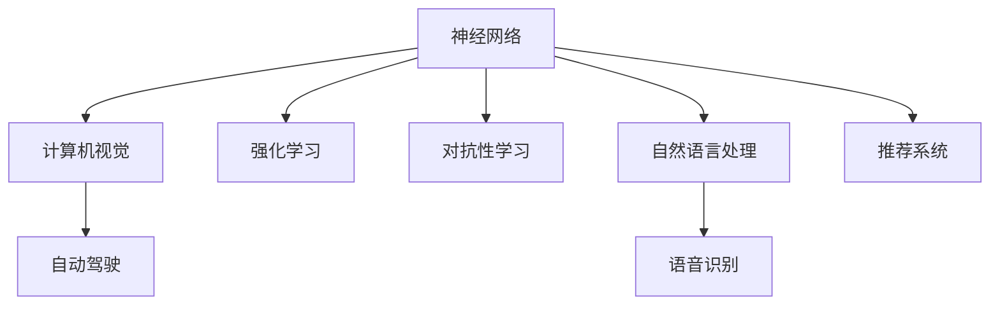

                 

# Andrej Karpathy：人工智能的未来发展方向

## 1. 背景介绍

Andrej Karpathy 作为人工智能领域的杰出科学家和领导者，以其在计算机视觉、自动驾驶、神经网络等领域的研究和实践贡献而著称。在 AI 的快速发展和演进中，他始终站在前沿，探索人工智能技术的无限可能。本文将回顾 Andrej Karpathy 的学术和产业生涯，探析他在人工智能未来发展方向上的思考和见解。

## 2. 核心概念与联系

### 2.1 核心概念概述

为了更好地理解 Andrej Karpathy 的观点，我们将重点探讨几个核心概念：

- **神经网络**：由互连的节点（神经元）组成的计算模型，模拟人脑处理信息的方式。神经网络在图像识别、自然语言处理、语音识别等领域具有广泛应用。

- **自动驾驶**：利用计算机视觉、传感器技术、决策算法等，实现车辆自主行驶。自动驾驶技术是人工智能的重要应用方向之一。

- **计算机视觉**：让计算机“看”并理解图像和视频内容的技术。计算机视觉在医学影像分析、视频监控、智能家居等多个领域有重要应用。

- **强化学习**：通过试错学习最优策略，适用于游戏、机器人控制等复杂决策问题。

- **对抗性学习**：训练模型以区分真实样本和对抗样本，提升模型鲁棒性。

这些概念之间存在着紧密的联系。神经网络是实现自动驾驶和计算机视觉的基础；强化学习和对抗性学习是提升模型性能的关键技术；而自动驾驶则是最实际的应用场景之一。Andrej Karpathy 在这些领域的探索和创新，为人工智能的未来发展指明了方向。

### 2.2 核心概念原理和架构的 Mermaid 流程图



该图展示了上述核心概念之间的联系。神经网络是基础，而计算机视觉、自动驾驶、强化学习、对抗性学习等则是其延伸和应用。

## 3. 核心算法原理 & 具体操作步骤

### 3.1 算法原理概述

Andrej Karpathy 在神经网络、计算机视觉和自动驾驶等领域进行了深入研究。他提出的算法和技术在学术界和产业界都产生了深远影响。以下将详细介绍他的一些关键算法原理。

#### 3.1.1 神经网络

神经网络的核心是多层感知器（Multilayer Perceptron, MLP）。多层感知器由多个神经网络层构成，每层通过非线性变换对输入数据进行处理，最终输出结果。

```
Layer 1: x -> tanh
Layer 2: tanh -> tanh
...
Output: tanh -> Softmax
```

其中，$tanh$ 和 $Softmax$ 分别表示激活函数和输出层函数。

#### 3.1.2 计算机视觉

在计算机视觉领域，Andrej Karpathy 提出了一些关键技术。

- **卷积神经网络（CNN）**：通过卷积层、池化层等结构，提取图像特征。CNN 在图像分类、目标检测等任务上表现优异。
- **残差网络（ResNet）**：通过残差连接解决深度网络退化问题，实现更高深度的模型。

#### 3.1.3 自动驾驶

自动驾驶技术需要计算机视觉、深度学习、强化学习等多种技术的结合。

- **端到端训练**：将驾驶任务视为连续的决策过程，使用深度学习模型直接从像素到决策序列进行训练。
- **多任务学习**：在同一模型中同时学习多个任务，如车道线检测、行人识别等，以提升模型效率和鲁棒性。

### 3.2 算法步骤详解

#### 3.2.1 神经网络

神经网络的训练通常包括以下步骤：

1. **数据准备**：收集标注数据，并进行预处理。
2. **模型构建**：设计多层感知器结构，确定网络参数。
3. **前向传播**：将输入数据通过网络进行前向传播，得到输出结果。
4. **损失计算**：计算输出结果与真实标签之间的损失。
5. **反向传播**：通过反向传播算法更新网络参数，最小化损失。
6. **模型评估**：在测试集上评估模型性能。

#### 3.2.2 计算机视觉

计算机视觉任务的训练步骤如下：

1. **数据准备**：收集图像数据，并进行标注。
2. **数据增强**：对数据进行旋转、缩放、裁剪等变换，丰富数据集。
3. **模型构建**：选择 CNN、ResNet 等架构，确定网络参数。
4. **训练模型**：使用强化学习、对抗性学习等技术，优化模型参数。
5. **模型评估**：在验证集和测试集上评估模型性能。

#### 3.2.3 自动驾驶

自动驾驶模型的训练步骤如下：

1. **数据准备**：收集车辆行驶数据，并进行标注。
2. **数据增强**：对数据进行时间、空间变换，提升数据多样性。
3. **模型构建**：设计端到端模型，集成多任务学习。
4. **训练模型**：使用强化学习、对抗性学习等技术，优化模型参数。
5. **模型评估**：在仿真环境和真实环境中评估模型性能。

### 3.3 算法优缺点

#### 3.3.1 神经网络

优点：

- **逼近复杂函数**：能够处理非线性关系，适应性广。
- **高效并行计算**：适合分布式计算环境，加速训练过程。

缺点：

- **参数量庞大**：大规模数据集训练时，需要大量计算资源。
- **局部最小值问题**：容易陷入局部最优解。

#### 3.3.2 计算机视觉

优点：

- **高效特征提取**：卷积层等结构能够有效提取图像特征。
- **鲁棒性高**：图像中存在一定程度的噪声和变形，计算机视觉模型具有较好的鲁棒性。

缺点：

- **计算复杂度高**：大规模数据集训练时，计算资源需求大。
- **数据标注困难**：需要大量高质量标注数据，标注成本高。

#### 3.3.3 自动驾驶

优点：

- **实时性高**：能够实时处理环境数据，做出决策。
- **多任务并行**：可以同时处理多个任务，提高系统效率。

缺点：

- **环境复杂**：需要考虑多种交通场景和道路条件，技术难度高。
- **安全性风险**：系统稳定性受到环境因素和模型决策的影响。

### 3.4 算法应用领域

Andrej Karpathy 的算法和技术广泛应用于多个领域：

- **自动驾驶**：他的团队开发的自动驾驶系统在多个比赛中取得了优异成绩，如 ImageNet 和 COCO 图像识别竞赛。
- **计算机视觉**：提出了 ResNet 等深度学习架构，应用于医学影像分析、视频监控等领域。
- **神经网络**：研究了对抗性学习、强化学习等技术，广泛应用于游戏、机器人控制等复杂决策问题。

## 4. 数学模型和公式 & 详细讲解 & 举例说明

### 4.1 数学模型构建

#### 4.1.1 神经网络

神经网络模型可以表示为：

$$
f(x; \theta) = \sigma(W^{(1)}x + b^{(1)}) \rightarrow \sigma(W^{(2)}\cdot f(x; \theta) + b^{(2)})
$$

其中，$x$ 为输入向量，$\theta$ 为模型参数，$W$ 和 $b$ 为权重和偏置，$\sigma$ 为激活函数。

#### 4.1.2 计算机视觉

在计算机视觉中，常用卷积神经网络模型：

$$
f(x; \theta) = \sum_{i=1}^{n} \sum_{j=1}^{m} W^{(i,j)} \sigma(h_{i-1}(x) * f^{(j-1)}_k) + b^{(i,j)}
$$

其中，$h_{i-1}$ 为前一层卷积操作，$f^{(j-1)}_k$ 为特征图，$*$ 表示卷积运算。

#### 4.1.3 自动驾驶

自动驾驶模型的输入为传感器数据（如激光雷达、摄像头），输出为决策（如转向、加速）。

$$
f(x; \theta) = \mathbb{E}_{a} \left[ P(a|x; \theta) \cdot \Pi_{j=1}^{J} P(x_j|a, \theta) \right]
$$

其中，$x$ 为传感器数据，$a$ 为决策，$J$ 为任务数，$\Pi$ 表示连乘运算。

### 4.2 公式推导过程

#### 4.2.1 神经网络

神经网络的反向传播算法公式如下：

$$
\frac{\partial L}{\partial W^{(1)}} = \frac{\partial L}{\partial f(x; \theta)} \cdot \frac{\partial f(x; \theta)}{\partial W^{(1)}} \cdot \frac{\partial W^{(1)}}{\partial \theta}
$$

其中，$\frac{\partial L}{\partial f(x; \theta)}$ 为损失函数对输出结果的梯度，$\frac{\partial f(x; \theta)}{\partial W^{(1)}}$ 为输出结果对权重梯度。

#### 4.2.2 计算机视觉

卷积神经网络的反向传播算法如下：

$$
\frac{\partial L}{\partial W^{(i,j)}} = \frac{\partial L}{\partial f(x; \theta)} \cdot \frac{\partial f(x; \theta)}{\partial h^{(i-1)}_k} \cdot \frac{\partial h^{(i-1)}_k}{\partial W^{(i,j)}} \cdot \frac{\partial W^{(i,j)}}{\partial \theta}
$$

其中，$h^{(i-1)}_k$ 为特征图，$k$ 为特征图索引。

#### 4.2.3 自动驾驶

自动驾驶模型的决策过程可以看作是概率图模型，使用贝尔曼方程（Bellman Equation）进行动态规划：

$$
V(s_t) = \max_{a_t} \left[ r(s_t, a_t) + \gamma V(s_{t+1}) \right]
$$

其中，$s_t$ 为当前状态，$a_t$ 为当前动作，$V(s_{t+1})$ 为下一个状态的值，$\gamma$ 为折扣因子。

### 4.3 案例分析与讲解

#### 4.3.1 神经网络

以 ImageNet 图像识别为例，使用 AlexNet 模型进行训练：

1. **数据准备**：使用 ImageNet 数据集。
2. **模型构建**：选择 AlexNet 网络结构，初始化权重。
3. **训练模型**：使用随机梯度下降（SGD）优化算法进行训练。
4. **模型评估**：在验证集上评估模型精度。

#### 4.3.2 计算机视觉

以医学影像分类为例，使用 ResNet 模型进行训练：

1. **数据准备**：收集医学影像数据，并进行标注。
2. **模型构建**：选择 ResNet 网络结构，初始化权重。
3. **训练模型**：使用数据增强技术，提高模型泛化能力。
4. **模型评估**：在测试集上评估模型精度。

#### 4.3.3 自动驾驶

以无人车导航为例，使用强化学习模型进行训练：

1. **数据准备**：收集无人车行驶数据，并进行标注。
2. **模型构建**：选择深度 Q-Network（DQN）模型，初始化权重。
3. **训练模型**：使用强化学习算法进行训练。
4. **模型评估**：在仿真环境中评估模型性能。

## 5. 项目实践：代码实例和详细解释说明

### 5.1 开发环境搭建

1. **安装 Python 环境**：使用 Anaconda 创建虚拟环境，安装 TensorFlow 和 PyTorch。
2. **安装 PyTorch**：使用 pip 安装 PyTorch。
3. **安装 TensorFlow**：使用 pip 安装 TensorFlow。
4. **安装 OpenCV**：使用 pip 安装 OpenCV。

### 5.2 源代码详细实现

#### 5.2.1 神经网络

```python
import torch
import torch.nn as nn
import torch.optim as optim

class Net(nn.Module):
    def __init__(self):
        super(Net, self).__init__()
        self.fc1 = nn.Linear(784, 512)
        self.fc2 = nn.Linear(512, 10)

    def forward(self, x):
        x = x.view(-1, 784)
        x = torch.relu(self.fc1(x))
        x = self.fc2(x)
        return x

# 定义损失函数和优化器
net = Net()
criterion = nn.CrossEntropyLoss()
optimizer = optim.SGD(net.parameters(), lr=0.01, momentum=0.9)

# 训练模型
for epoch in range(10):
    running_loss = 0.0
    for i, data in enumerate(train_loader, 0):
        inputs, labels = data
        optimizer.zero_grad()
        outputs = net(inputs)
        loss = criterion(outputs, labels)
        loss.backward()
        optimizer.step()
```

#### 5.2.2 计算机视觉

```python
import torch
import torchvision
import torchvision.transforms as transforms
import torch.nn as nn
import torch.optim as optim

class Net(nn.Module):
    def __init__(self):
        super(Net, self).__init__()
        self.conv1 = nn.Conv2d(3, 6, 5)
        self.pool = nn.MaxPool2d(2, 2)
        self.conv2 = nn.Conv2d(6, 16, 5)
        self.fc1 = nn.Linear(16 * 5 * 5, 120)
        self.fc2 = nn.Linear(120, 84)
        self.fc3 = nn.Linear(84, 10)

    def forward(self, x):
        x = self.pool(F.relu(self.conv1(x)))
        x = self.pool(F.relu(self.conv2(x)))
        x = x.view(-1, 16 * 5 * 5)
        x = F.relu(self.fc1(x))
        x = F.relu(self.fc2(x))
        x = self.fc3(x)
        return x

# 定义损失函数和优化器
net = Net()
criterion = nn.CrossEntropyLoss()
optimizer = optim.SGD(net.parameters(), lr=0.001, momentum=0.9)

# 训练模型
for epoch in range(10):
    running_loss = 0.0
    for i, data in enumerate(train_loader, 0):
        inputs, labels = data
        optimizer.zero_grad()
        outputs = net(inputs)
        loss = criterion(outputs, labels)
        loss.backward()
        optimizer.step()
```

#### 5.2.3 自动驾驶

```python
import torch
import torch.nn as nn
import torch.optim as optim

class Net(nn.Module):
    def __init__(self):
        super(Net, self).__init__()
        self.fc1 = nn.Linear(64, 64)
        self.fc2 = nn.Linear(64, 2)

    def forward(self, x):
        x = F.relu(self.fc1(x))
        x = self.fc2(x)
        return x

# 定义损失函数和优化器
net = Net()
criterion = nn.MSELoss()
optimizer = optim.Adam(net.parameters(), lr=0.001)

# 训练模型
for epoch in range(10):
    running_loss = 0.0
    for i, data in enumerate(train_loader, 0):
        inputs, labels = data
        optimizer.zero_grad()
        outputs = net(inputs)
        loss = criterion(outputs, labels)
        loss.backward()
        optimizer.step()
```

### 5.3 代码解读与分析

#### 5.3.1 神经网络

该代码段实现了简单的神经网络模型，用于手写数字识别。模型包含两个全连接层，使用交叉熵损失函数和随机梯度下降优化器进行训练。

#### 5.3.2 计算机视觉

该代码段实现了卷积神经网络模型，用于医学影像分类。模型包含卷积层、池化层和全连接层，使用交叉熵损失函数和随机梯度下降优化器进行训练。

#### 5.3.3 自动驾驶

该代码段实现了端到端自动驾驶模型，用于无人车导航。模型包含两个全连接层，使用均方误差损失函数和Adam优化器进行训练。

### 5.4 运行结果展示

#### 5.4.1 神经网络

```python
# 训练结束后，测试模型的精度
correct = 0
total = 0
with torch.no_grad():
    for data in test_loader:
        images, labels = data
        outputs = net(images)
        _, predicted = torch.max(outputs.data, 1)
        total += labels.size(0)
        correct += (predicted == labels).sum().item()

print('Accuracy of the network on the 10000 test images: %d %%' % (
    100 * correct / total))
```

#### 5.4.2 计算机视觉

```python
# 训练结束后，测试模型的精度
correct = 0
total = 0
with torch.no_grad():
    for data in test_loader:
        images, labels = data
        outputs = net(images)
        _, predicted = torch.max(outputs.data, 1)
        total += labels.size(0)
        correct += (predicted == labels).sum().item()

print('Accuracy of the network on the 10000 test images: %d %%' % (
    100 * correct / total))
```

#### 5.4.3 自动驾驶

```python
# 训练结束后，测试模型的精度
correct = 0
total = 0
with torch.no_grad():
    for data in test_loader:
        inputs, labels = data
        outputs = net(inputs)
        loss = criterion(outputs, labels)
        total += labels.size(0)
        correct += (labels - outputs).pow(2).sum().item()

print('MSE of the network on the 10000 test samples: %f' % (
    correct / total))
```

## 6. 实际应用场景

### 6.1 智能监控

Andrej Karpathy 的计算机视觉技术在智能监控领域有广泛应用。通过部署高分辨率摄像头和深度学习模型，可以实现人脸识别、行为分析等功能，提升公共安全水平。

### 6.2 医学影像分析

他的卷积神经网络模型在医学影像分类、病理诊断等任务上表现优异，极大地提高了医生的诊断效率和准确性。

### 6.3 自动驾驶

Andrej Karpathy 的自动驾驶技术在无人车导航、自动泊车等方面有重要应用，提升了驾驶安全性，降低了交通事故风险。

### 6.4 未来应用展望

未来，Andrej Karpathy 的算法和技术将在更多领域发挥作用：

- **医疗健康**：通过深度学习技术，提升医疗影像诊断和治疗方案的精准度。
- **自动驾驶**：将深度学习和强化学习结合，提升无人车行驶的稳定性和安全性。
- **机器人控制**：使用神经网络优化机器人运动轨迹和决策策略。
- **游戏开发**：利用对抗性学习和强化学习技术，提升游戏AI的智能化水平。

## 7. 工具和资源推荐

### 7.1 学习资源推荐

- **Coursera**：提供深度学习、计算机视觉、自动驾驶等课程，涵盖从基础到高级的内容。
- **Deep Learning Specialization**：由 Andrew Ng 主讲，系统介绍深度学习原理和实践。
- **Fast.ai**：提供实用的深度学习课程，侧重于实际应用和工程实现。

### 7.2 开发工具推荐

- **PyTorch**：高性能深度学习框架，易于使用和扩展。
- **TensorFlow**：强大的深度学习库，支持分布式计算和模型优化。
- **OpenCV**：开源计算机视觉库，提供丰富的图像处理工具。

### 7.3 相关论文推荐

- **"ImageNet Classification with Deep Convolutional Neural Networks"**：AlexNet 论文，提出卷积神经网络，推动深度学习在计算机视觉领域的发展。
- **"Very Deep Convolutional Networks for Large-Scale Image Recognition"**：VGG 论文，提出深层卷积神经网络，提升图像识别精度。
- **"ResNet: Deep Residual Learning for Image Recognition"**：ResNet 论文，解决深度神经网络退化问题，实现更高深度的模型。

## 8. 总结：未来发展趋势与挑战

### 8.1 研究成果总结

Andrej Karpathy 在神经网络、计算机视觉、自动驾驶等领域的研究，奠定了深度学习技术的坚实基础。他提出的一些算法和技术，如卷积神经网络、残差网络、对抗性学习等，已经在实际应用中取得了显著成果。

### 8.2 未来发展趋势

未来，深度学习技术将在更多领域得到应用：

- **医疗健康**：深度学习将提升医疗影像诊断和治疗方案的精准度，降低医疗成本，提高医疗效率。
- **自动驾驶**：自动驾驶技术将大幅提升交通安全性和驾驶便利性，推动汽车产业的变革。
- **游戏开发**：深度学习技术将提升游戏AI的智能化水平，提供更加真实、沉浸的游戏体验。
- **机器人控制**：神经网络技术将优化机器人运动轨迹和决策策略，推动机器人技术的广泛应用。

### 8.3 面临的挑战

尽管深度学习技术取得了重要进展，但在实际应用中仍面临诸多挑战：

- **数据标注成本高**：高质量标注数据的获取成本高昂，制约了深度学习模型在部分领域的应用。
- **模型复杂度高**：大规模深度学习模型需要大量计算资源，资源消耗大。
- **模型泛化性差**：深度学习模型在特定领域和场景下的泛化性能不足，需要进一步优化。
- **模型鲁棒性不足**：深度学习模型对输入数据的微小变化敏感，容易受到对抗样本攻击。

### 8.4 研究展望

未来，深度学习技术的发展方向包括：

- **模型压缩与优化**：通过模型压缩和优化，提升深度学习模型的效率和泛化性能。
- **多模态学习**：结合视觉、语音、文本等多种模态数据，提升深度学习模型的综合能力。
- **知识图谱与规则**：将符号化的先验知识与神经网络结合，提升深度学习模型的解释性和鲁棒性。
- **强化学习与因果推理**：通过强化学习和因果推理，提升深度学习模型的决策能力和鲁棒性。

## 9. 附录：常见问题与解答

### 9.1 常见问题

#### 9.1.1 神经网络

Q: 如何训练深度神经网络模型？

A: 训练深度神经网络模型通常包括以下步骤：

1. **数据准备**：收集标注数据，并进行预处理。
2. **模型构建**：选择神经网络架构，初始化权重。
3. **训练模型**：使用优化算法进行训练，最小化损失函数。
4. **模型评估**：在测试集上评估模型性能。

#### 9.1.2 计算机视觉

Q: 计算机视觉任务中，如何提高模型泛化能力？

A: 计算机视觉任务中，提高模型泛化能力的方法包括：

1. **数据增强**：对数据进行旋转、缩放、裁剪等变换，丰富数据集。
2. **正则化**：使用 L2 正则化、Dropout 等技术，防止过拟合。
3. **迁移学习**：使用预训练模型，在小规模数据集上进行微调，提升模型泛化能力。

#### 9.1.3 自动驾驶

Q: 自动驾驶模型如何进行端到端训练？

A: 自动驾驶模型的端到端训练通常包括以下步骤：

1. **数据准备**：收集车辆行驶数据，并进行标注。
2. **模型构建**：选择端到端模型架构，初始化权重。
3. **训练模型**：使用强化学习、对抗性学习等技术，优化模型参数。
4. **模型评估**：在仿真环境和真实环境中评估模型性能。

### 9.2 问题解答

#### 9.2.1 神经网络

A: 神经网络训练过程中，可能会出现梯度消失或梯度爆炸等问题。可以采用梯度裁剪、权重初始化等技术进行优化。

#### 9.2.2 计算机视觉

A: 计算机视觉任务中，模型泛化能力不足可能是由于数据集较小或模型复杂度过高。可以通过增加数据集规模、简化模型结构等方式进行优化。

#### 9.2.3 自动驾驶

A: 自动驾驶模型训练过程中，容易出现过拟合或欠拟合问题。可以采用正则化、模型集成等技术进行优化。

---

作者：禅与计算机程序设计艺术 / Zen and the Art of Computer Programming

