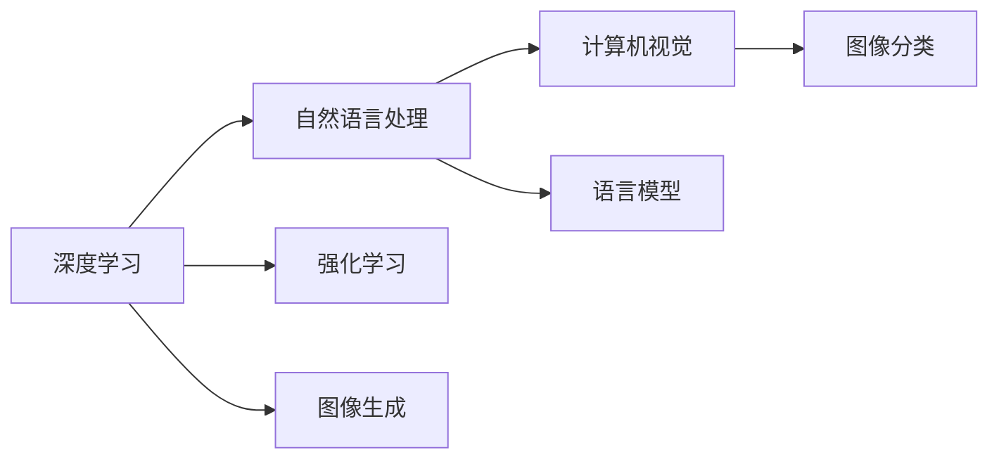

                 

# Andrej Karpathy：人工智能的未来发展机遇

> 关键词：Andrej Karpathy, 人工智能, 深度学习, 未来发展, 机遇

## 1. 背景介绍

### 1.1 问题由来

Andrej Karpathy 是全球知名的人工智能专家，斯坦福大学计算机科学教授，同时也是深度学习领域的权威和先驱。他的工作主要集中在计算机视觉、自然语言处理和强化学习等方面，对推动深度学习技术的进步做出了重要贡献。

近年来，随着人工智能技术的快速发展和广泛应用，深度学习、自然语言处理、计算机视觉等领域呈现出令人瞩目的进展。然而，尽管取得了这些成就，人工智能仍然面临着诸多挑战和不确定性。Andrej Karpathy 作为深度学习领域的领军人物，对人工智能的未来发展有着深刻的见解和思考。

### 1.2 问题核心关键点

本文将围绕 Andrej Karpathy 对于人工智能未来发展的预测和思考，深入探讨其关于未来机遇的分析和建议。主要关注以下几个核心问题：

- 深度学习的当前状态和未来趋势
- 人工智能在各领域的应用机遇和挑战
- 如何应对人工智能面临的技术和社会挑战
- 人工智能对人类社会的深远影响

通过这些问题的分析，可以更全面地了解 Andrej Karpathy 对于人工智能未来发展的独到见解。

## 2. 核心概念与联系

### 2.1 核心概念概述

Andrej Karpathy 的观点主要基于他对深度学习、自然语言处理、计算机视觉等领域的深入研究和实践。本文将详细探讨这些核心概念及其相互联系，以便更好地理解 Karpathy 的观点和建议。

- **深度学习**：一种基于神经网络的机器学习技术，通过多层次的特征提取和抽象，实现复杂模式的识别和预测。
- **自然语言处理**：使计算机能够理解、解析和生成人类语言的技术，包括文本分类、语言模型、机器翻译等任务。
- **计算机视觉**：使计算机能够“看”和理解图像、视频等视觉数据的技术，包括图像分类、目标检测、图像生成等任务。
- **强化学习**：一种通过与环境互动，不断调整策略以最大化奖励的机器学习方法，广泛应用于游戏、机器人等领域。

### 2.2 核心概念原理和架构的 Mermaid 流程图



这个流程图展示了深度学习在自然语言处理、计算机视觉和强化学习等领域的应用，以及各领域内部的具体任务。通过这些任务的完成，可以构建更为复杂和高级的人工智能系统。

## 3. 核心算法原理 & 具体操作步骤

### 3.1 算法原理概述

Andrej Karpathy 认为，深度学习技术在未来将继续保持其主导地位，并在多个领域取得重大突破。深度学习之所以能够取得这些成就，主要是因为其强大的特征提取和泛化能力，以及大数据和计算资源的支撑。

在未来，深度学习将进一步融合多模态信息，如图像、视频、语音等，实现更全面、更深入的认知智能。同时，深度学习还将结合强化学习等技术，实现更高效的决策和控制。

### 3.2 算法步骤详解

具体来说，未来深度学习的发展将遵循以下步骤：

1. **数据收集和预处理**：通过大规模数据收集和预处理，构建高质量的数据集，为深度学习提供丰富的训练材料。
2. **模型设计**：根据具体任务设计合适的深度学习模型，包括卷积神经网络、循环神经网络、变压器等。
3. **训练和优化**：使用GPU/TPU等高性能设备，对模型进行训练，并使用梯度下降等优化算法进行参数调整。
4. **模型评估和调优**：通过验证集和测试集对模型进行评估，并根据评估结果进行调优，提高模型性能。
5. **模型部署和应用**：将训练好的模型部署到实际应用中，如计算机视觉中的图像分类、自然语言处理中的文本分类等。

### 3.3 算法优缺点

深度学习技术的优点在于其强大的泛化能力和自适应性，可以处理复杂的非线性关系。缺点在于其需要大量数据和计算资源，容易过拟合，且模型的可解释性不足。

### 3.4 算法应用领域

深度学习技术已经在计算机视觉、自然语言处理、语音识别等领域取得了广泛应用，并逐步向医疗、金融、教育等领域扩展。未来，深度学习将进一步渗透到更多领域，提升各行业的智能化水平。

## 4. 数学模型和公式 & 详细讲解 & 举例说明

### 4.1 数学模型构建

深度学习模型的构建通常基于神经网络结构，如卷积神经网络（CNN）、循环神经网络（RNN）和变压器（Transformer）等。以变压器为例，其结构如图1所示。


### 4.2 公式推导过程

以变压器模型为例，其核心公式包括自注意力机制和前向传播过程。自注意力机制的计算公式为：

$$
\text{Attention}(Q,K,V) = \text{softmax}(\frac{QK^T}{\sqrt{d_k}})V
$$

其中，$Q$、$K$、$V$分别表示查询、键、值向量，$d_k$为键向量的维度。前向传播过程的计算公式为：

$$
\text{FFN}(x) = \text{GELU}(\text{Linear}(x)) + x
$$

其中，$\text{GELU}$为Gaussian Error Linear Units激活函数，$\text{Linear}$为线性变换。

### 4.3 案例分析与讲解

以图像分类任务为例，可以使用卷积神经网络对图像进行特征提取和分类。具体步骤如下：

1. **数据准备**：收集并预处理图像数据集，分为训练集、验证集和测试集。
2. **模型构建**：使用PyTorch等框架构建卷积神经网络模型，包括卷积层、池化层、全连接层等。
3. **训练模型**：在训练集上使用随机梯度下降等优化算法训练模型，并使用验证集进行调优。
4. **评估模型**：在测试集上评估模型性能，计算准确率、召回率等指标。
5. **应用模型**：将训练好的模型应用于实际图像分类任务中。

## 5. 项目实践：代码实例和详细解释说明

### 5.1 开发环境搭建

使用Python和PyTorch搭建深度学习项目环境，具体步骤如下：

1. 安装Python和PyTorch：
```bash
pip install torch torchvision transformers
```

2. 安装其他依赖包：
```bash
pip install numpy scipy matplotlib
```

3. 创建虚拟环境：
```bash
python -m venv venv
source venv/bin/activate
```

### 5.2 源代码详细实现

以下是一个简单的图像分类项目的代码实现，以识别手写数字为例：

```python
import torch
import torchvision
from torchvision import datasets, transforms
from torch.utils.data import DataLoader
from torchvision.models import ResNet
from torch import nn, optim

# 数据预处理
transform = transforms.Compose([
    transforms.ToTensor(),
    transforms.Normalize((0.5,), (0.5,))
])

train_dataset = datasets.MNIST(root='./data', train=True, download=True, transform=transform)
test_dataset = datasets.MNIST(root='./data', train=False, download=True, transform=transform)

# 模型构建
model = ResNet(18, num_classes=10)

# 定义损失函数和优化器
criterion = nn.CrossEntropyLoss()
optimizer = optim.SGD(model.parameters(), lr=0.001, momentum=0.9)

# 训练模型
for epoch in range(10):
    train_loader = DataLoader(train_dataset, batch_size=64, shuffle=True)
    for inputs, labels in train_loader:
        optimizer.zero_grad()
        outputs = model(inputs)
        loss = criterion(outputs, labels)
        loss.backward()
        optimizer.step()
    
    val_loader = DataLoader(test_dataset, batch_size=64, shuffle=False)
    with torch.no_grad():
        val_loss = 0
        correct = 0
        total = 0
        for inputs, labels in val_loader:
            outputs = model(inputs)
            _, predicted = torch.max(outputs.data, 1)
            val_loss += criterion(outputs, labels).item()
            total += labels.size(0)
            correct += (predicted == labels).sum().item()
        print(f'Epoch {epoch+1}, Loss: {val_loss/len(val_loader):.4f}, Accuracy: {correct/total:.4f}')
```

### 5.3 代码解读与分析

该代码实现了一个简单的卷积神经网络模型，用于手写数字识别任务。具体步骤如下：

1. **数据预处理**：使用torchvision库中的transforms模块对数据进行预处理，包括转换为张量并进行归一化。
2. **模型构建**：使用ResNet模型作为基础架构，并通过nn模块添加全连接层和损失函数。
3. **训练模型**：使用DataLoader模块加载训练数据，并在模型上训练10个epoch。
4. **评估模型**：在测试数据集上评估模型性能，计算损失和准确率。

## 6. 实际应用场景

### 6.1 计算机视觉

计算机视觉是深度学习的重要应用领域之一，广泛应用于图像分类、目标检测、图像生成等任务。未来，计算机视觉技术将在自动驾驶、医疗影像分析、工业检测等领域发挥重要作用。

### 6.2 自然语言处理

自然语言处理技术将深度学习应用于文本分类、机器翻译、语音识别等任务。未来，自然语言处理技术将在智能客服、智能翻译、情感分析等场景中发挥更大的作用。

### 6.3 强化学习

强化学习技术将深度学习应用于游戏、机器人等场景，通过与环境互动不断优化策略，实现自主决策和控制。未来，强化学习技术将在自动驾驶、机器人导航等领域取得更大突破。

### 6.4 未来应用展望

Andrej Karpathy 认为，未来深度学习技术将与多模态信息融合，实现更全面、更深入的认知智能。同时，强化学习等技术也将与深度学习结合，实现更高效的决策和控制。未来，人工智能将在医疗、金融、教育等领域发挥更大的作用，提升各行业的智能化水平。

## 7. 工具和资源推荐

### 7.1 学习资源推荐

1. **《Deep Learning》书籍**：Ian Goodfellow等著，深入介绍了深度学习的基本概念和应用，是深度学习领域的经典教材。
2. **Deep Learning Specialization**：Coursera上的深度学习课程，由Andrew Ng主讲，涵盖深度学习的各个方面。
3. **PyTorch官方文档**：PyTorch的官方文档，提供了丰富的教程和样例，适合初学者和进阶者学习。
4. **arXiv预印本**：最新的人工智能研究论文发布平台，涵盖深度学习、自然语言处理、计算机视觉等领域的最新进展。

### 7.2 开发工具推荐

1. **PyTorch**：深度学习领域的开源框架，支持动态计算图，易于调试和优化。
2. **TensorFlow**：Google开源的深度学习框架，适合大规模工程应用。
3. **TensorBoard**：TensorFlow配套的可视化工具，用于监控和调试深度学习模型。
4. **Weights & Biases**：模型训练的实验跟踪工具，方便记录和对比模型训练结果。
5. **Jupyter Notebook**：交互式的Python开发环境，支持Python代码和LaTeX公式的混合使用。

### 7.3 相关论文推荐

1. **ImageNet大规模视觉识别挑战**：Alex Krizhevsky等，展示了深度学习在图像分类任务上的突破性进展。
2. **Attention is All You Need**：Ashish Vaswani等，提出了Transformer结构，奠定了现代自然语言处理的基础。
3. **Playing Atari with Deep Reinforcement Learning**：Volodymyr Mnih等，展示了深度强化学习在游戏领域的应用。

## 8. 总结：未来发展趋势与挑战

### 8.1 研究成果总结

Andrej Karpathy 的研究成果涵盖了深度学习、自然语言处理、计算机视觉等多个领域，推动了人工智能技术的发展。他在图像分类、语音识别、机器人控制等方面的贡献，显著提升了人工智能系统的性能和应用效果。

### 8.2 未来发展趋势

1. **深度学习的发展**：深度学习将在未来继续保持其主导地位，并与其他技术如强化学习、自然语言处理等融合，实现更全面、更深入的认知智能。
2. **多模态信息融合**：未来深度学习将结合图像、视频、语音等多模态信息，实现更全面、更深入的认知智能。
3. **跨领域应用**：人工智能将在医疗、金融、教育等领域发挥更大的作用，提升各行业的智能化水平。
4. **技术融合与创新**：深度学习将与其他技术如知识图谱、因果推理等结合，实现更高效、更智能的决策和控制。

### 8.3 面临的挑战

1. **数据隐私和安全**：深度学习模型依赖大量数据进行训练，如何保护数据隐私和安全是一个重要问题。
2. **模型可解释性**：深度学习模型的黑盒特性使其难以解释，如何提高模型的可解释性是一个挑战。
3. **算法偏见**：深度学习模型可能学习到数据中的偏见，如何消除偏见是一个重要问题。
4. **计算资源**：深度学习模型需要大量计算资源进行训练和推理，如何降低计算成本是一个挑战。

### 8.4 研究展望

未来，人工智能技术将在更多领域发挥作用，推动各行业的智能化进程。同时，也需要应对数据隐私、模型可解释性、算法偏见等挑战，确保人工智能技术的可持续发展。通过技术创新和规范制定，相信人工智能技术将在未来取得更大的突破。

## 9. 附录：常见问题与解答

**Q1: 深度学习是否会取代人类智能？**

A: 深度学习在特定领域和任务上可以超越人类智能，但在通用智能和创造性方面仍然有局限性。人类智能具有更高的灵活性和创造力，在未来，深度学习和人类智能将相互补充，共同推动人工智能技术的发展。

**Q2: 深度学习如何应对数据隐私和安全问题？**

A: 深度学习模型依赖大量数据进行训练，如何保护数据隐私和安全是一个重要问题。可以通过差分隐私、联邦学习等技术，在保证数据隐私的前提下进行模型训练。

**Q3: 如何提高深度学习模型的可解释性？**

A: 深度学习模型的黑盒特性使其难以解释，如何提高模型的可解释性是一个挑战。可以通过可视化、特征提取等技术，辅助理解模型的决策过程。

**Q4: 如何应对深度学习算法的偏见？**

A: 深度学习模型可能学习到数据中的偏见，如何消除偏见是一个重要问题。可以通过数据清洗、模型调整等技术，减少算法的偏见。

**Q5: 如何降低深度学习模型的计算成本？**

A: 深度学习模型需要大量计算资源进行训练和推理，如何降低计算成本是一个挑战。可以通过模型压缩、量化等技术，降低模型的计算需求。

---

作者：禅与计算机程序设计艺术 / Zen and the Art of Computer Programming

