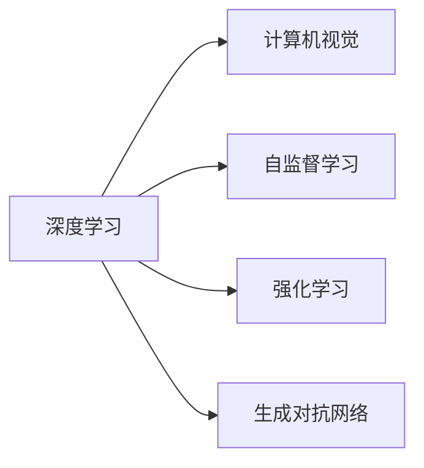

                 

# Andrej Karpathy：人工智能的未来发展机遇

## 1. 背景介绍

**Andrej Karpathy** 是人工智能领域的翘楚，其深度学习和计算机视觉方面的工作为行业树立了标杆。在人工智能的未来发展前景上，Karpathy 提出了许多富有洞察力的观点。以下，我们将重点阐述他在人工智能技术演进、发展趋势、技术壁垒及未来机遇等方面的深入见解。

## 2. 核心概念与联系

**2.1 核心概念概述**

Andrej Karpathy 强调了以下几个核心概念：

- **深度学习 (Deep Learning)**：一种利用多层神经网络进行复杂数据分析和模式识别的机器学习方法。
- **计算机视觉 (Computer Vision)**：涉及如何让计算机理解、解释和处理图像、视频等视觉数据的科学。
- **自监督学习 (Self-Supervised Learning)**：一种无需人工标注数据，通过模型自身的预测能力来学习表示数据的算法。
- **强化学习 (Reinforcement Learning)**：利用奖励信号指导模型行为，通过与环境的交互逐步优化策略的机器学习方法。
- **生成对抗网络 (Generative Adversarial Networks, GANs)**：一种通过两个神经网络竞争生成高质量图像等内容的模型。

**2.2 核心概念原理和架构的 Mermaid 流程图**



## 3. 核心算法原理 & 具体操作步骤

### 3.1 算法原理概述

Karpathy 提出，深度学习是未来人工智能发展的重要基石。深度学习通过多层次的神经网络，能自动从数据中提取复杂的特征，从而实现高效的数据处理和模式识别。例如，在计算机视觉领域，卷积神经网络 (CNN) 能够通过卷积层提取图像的局部特征，并通过池化层进行特征压缩，最终使用全连接层进行分类。

**3.2 算法步骤详解**

1. **数据准备**：收集和标注大量高质量的数据，用于训练深度学习模型。数据可以是图像、文本、音频等，需要覆盖多变的场景和变化。
2. **模型设计**：选择合适的深度学习架构，如 CNN、RNN、Transformer 等，并设计模型的输入和输出层。
3. **模型训练**：通过反向传播算法更新模型参数，最小化损失函数。训练过程中需进行数据增强、正则化等优化措施。
4. **模型评估**：使用测试集对模型进行评估，常用的指标有准确率、精确率、召回率等。
5. **模型部署**：将训练好的模型部署到实际应用场景中，进行实时处理和预测。

### 3.3 算法优缺点

**优点**：
- **自动化特征提取**：深度学习能自动从数据中提取高级特征，减少了人工特征工程的需要。
- **高度泛化能力**：在大规模数据集上训练的模型能较好地泛化到新数据上。
- **应用广泛**：深度学习在图像识别、自然语言处理、语音识别等多个领域都有广泛应用。

**缺点**：
- **计算资源需求高**：训练深度模型需要大量计算资源和存储空间。
- **过拟合风险**：模型复杂度高可能导致过拟合，需进行正则化和数据增强等措施。
- **可解释性差**：深度模型通常被视为“黑盒”，难以解释其内部决策过程。

### 3.4 算法应用领域

Andrej Karpathy 认为，深度学习技术在未来将广泛应用于以下领域：

- **自动驾驶**：用于实时环境感知和决策制定的计算机视觉和强化学习技术。
- **医疗影像分析**：利用深度学习技术对医学影像进行自动分析，提高诊断准确性。
- **自然语言处理**：用于语言生成、翻译、问答等任务的自然语言处理模型。
- **游戏智能**：通过强化学习使计算机游戏玩家具备人类水平的智能。
- **机器人控制**：利用深度学习和强化学习使机器人具备环境适应能力和任务执行能力。

## 4. 数学模型和公式 & 详细讲解

### 4.1 数学模型构建

以图像分类为例，深度学习模型的数学模型可以表示为：

$$
\text{Model} = f_{\theta}(x) = W_{out} \sigma(W_{hidden} \sigma(W_{conv} x + b_{conv})) + b_{hidden} + b_{out}
$$

其中，$f_{\theta}$ 为模型函数，$x$ 为输入图像，$W_{out}$、$W_{hidden}$ 和 $W_{conv}$ 为模型权重，$\sigma$ 为激活函数。

### 4.2 公式推导过程

以多层感知器 (MLP) 为例，计算损失函数：

$$
L = \frac{1}{N} \sum_{i=1}^N ||f_{\theta}(x_i) - y_i||^2
$$

其中，$N$ 为样本数量，$y_i$ 为标签，$f_{\theta}(x_i)$ 为模型预测值。

通过反向传播算法计算梯度：

$$
\frac{\partial L}{\partial \theta} = \frac{\partial L}{\partial z} \frac{\partial z}{\partial \theta}
$$

其中，$\frac{\partial L}{\partial z}$ 为输出层损失对隐藏层输出 $z$ 的导数。

### 4.3 案例分析与讲解

以卷积神经网络 (CNN) 为例，CNN 的结构如图：


CNN 的卷积层通过可学习的卷积核进行特征提取，池化层用于减小特征图的尺寸，全连接层进行分类。通过多个卷积层和池化层的交替堆叠，CNN 能够提取不同尺度的图像特征。

## 5. 项目实践：代码实例和详细解释说明

### 5.1 开发环境搭建

搭建深度学习开发环境一般需要以下步骤：

1. 安装 Python 和相关依赖，如 NumPy、Pandas、SciPy 等。
2. 安装深度学习框架，如 TensorFlow、PyTorch 等。
3. 安装深度学习库，如 Keras、Scikit-learn、OpenCV 等。
4. 安装 GPU 驱动和 CUDA 等 GPU 计算库。

### 5.2 源代码详细实现

以下是一个简单的图像分类模型实现，以使用 Keras 为例：

```python
from keras.models import Sequential
from keras.layers import Conv2D, MaxPooling2D, Flatten, Dense

model = Sequential()
model.add(Conv2D(32, (3, 3), activation='relu', input_shape=(32, 32, 3)))
model.add(MaxPooling2D((2, 2)))
model.add(Conv2D(64, (3, 3), activation='relu'))
model.add(MaxPooling2D((2, 2)))
model.add(Conv2D(128, (3, 3), activation='relu'))
model.add(MaxPooling2D((2, 2)))
model.add(Flatten())
model.add(Dense(128, activation='relu'))
model.add(Dense(10, activation='softmax'))

model.compile(optimizer='adam', loss='categorical_crossentropy', metrics=['accuracy'])
model.fit(X_train, y_train, epochs=10, batch_size=32, validation_data=(X_test, y_test))
```

### 5.3 代码解读与分析

上述代码中，首先定义了一个包含多个卷积层、池化层和全连接层的序列模型。然后通过编译函数指定了优化器、损失函数和评估指标，并使用 fit 函数对模型进行训练。最后，使用 validation_data 参数指定了验证集，以监控模型在未见过的数据上的表现。

### 5.4 运行结果展示

模型训练完毕后，使用 test 函数对模型进行测试，以评估模型性能：

```python
test_loss, test_acc = model.evaluate(X_test, y_test, verbose=2)
print('Test accuracy:', test_acc)
```

## 6. 实际应用场景

### 6.1 自动驾驶

自动驾驶系统需要处理复杂的城市环境，通过计算机视觉和强化学习技术，自动驾驶车辆能够实时感知周围环境，并做出安全的行驶决策。

### 6.2 医疗影像分析

深度学习模型能够自动分析医学影像，如 X 光片、CT 扫描等，以帮助医生快速识别异常，提高诊断准确率。

### 6.3 自然语言处理

自然语言处理技术，如机器翻译、语音识别、文本摘要等，使计算机具备了自然语言理解和生成能力。

### 6.4 游戏智能

利用强化学习技术，计算机游戏玩家能够进行高级决策，并具备人类水平的智能。

## 7. 工具和资源推荐

### 7.1 学习资源推荐

- **深度学习基础**：《深度学习》（Goodfellow 等著），全面介绍深度学习的理论基础和应用场景。
- **计算机视觉**：《计算机视觉：算法与应用》（Richard Szeliski 著），详细介绍计算机视觉的核心算法和应用。
- **强化学习**：《强化学习：一种现代方法》（Sutton 和 Barto 著），详细讲解强化学习的原理和算法。
- **生成对抗网络**：《生成对抗网络》（Ian Goodfellow 等著），详细介绍 GAN 的理论和实践。

### 7.2 开发工具推荐

- **TensorFlow**：谷歌开发的深度学习框架，支持大规模分布式训练和部署。
- **PyTorch**：Facebook 开发的深度学习框架，灵活性高，易于开发和调试。
- **Keras**：高层次的深度学习库，易于上手，适用于快速原型开发。
- **Jupyter Notebook**：交互式编程环境，便于代码编写和共享。

### 7.3 相关论文推荐

- **ImageNet 分类**：《ImageNet 分类与深度卷积神经网络》（Alex Krizhevsky 等著），介绍 ImageNet 数据集和卷积神经网络在图像分类中的应用。
- **自然语言处理**：《语言模型与深度学习》（Yoshua Bengio 等著），详细介绍自然语言处理任务及其深度学习方法。
- **强化学习**：《人类行为与强化学习》（Richard S. Sutton 等著），详细讲解强化学习的理论和实践。
- **生成对抗网络**：《一种学习表示的方法》（Ian Goodfellow 等著），介绍 GAN 的原理和应用。

## 8. 总结：未来发展趋势与挑战

### 8.1 研究成果总结

深度学习技术已经在多个领域取得了显著进展，未来仍有许多研究方向值得关注：

- **自监督学习**：无需大量标注数据，通过模型自身的预测能力来学习表示数据。
- **迁移学习**：在已有模型基础上，快速适应新任务，减少数据和计算资源投入。
- **多模态学习**：结合图像、音频、文本等多模态数据，提升模型的感知能力和理解力。

### 8.2 未来发展趋势

未来，深度学习技术将继续拓展其应用范围和深度：

- **自动化和智能化**：深度学习将进一步自动化，减少人工干预。
- **模型压缩和优化**：通过模型压缩和量化等技术，提升深度学习的部署效率。
- **多模态融合**：结合多模态数据，提升深度学习系统的感知能力和理解力。

### 8.3 面临的挑战

深度学习技术在发展过程中仍面临诸多挑战：

- **计算资源需求高**：深度学习模型需要大量计算资源和存储空间。
- **数据标注成本高**：大规模深度学习模型需要大量高质量的标注数据。
- **可解释性差**：深度学习模型通常被视为“黑盒”，难以解释其内部决策过程。
- **模型鲁棒性不足**：深度学习模型在面对新数据和噪声时，鲁棒性不足。

### 8.4 研究展望

未来，深度学习研究将向以下几个方向突破：

- **自监督学习**：通过无标注数据进行训练，减少对标注数据的依赖。
- **少样本学习**：在少量样本上进行训练，提升模型泛化能力。
- **模型压缩和优化**：通过模型压缩和量化等技术，提升深度学习的部署效率。
- **多模态融合**：结合多模态数据，提升深度学习系统的感知能力和理解力。
- **可解释性**：通过可解释性方法，增强深度学习的透明性和可信度。

## 9. 附录：常见问题与解答

**Q1: 深度学习模型的训练需要多长时间？**

A: 深度学习模型的训练时间取决于模型规模、数据量、计算资源等因素。通常，在合理配置资源的情况下，训练一个中等规模的深度学习模型需要数天到数周的时间。

**Q2: 深度学习模型在训练过程中如何进行正则化？**

A: 深度学习模型在训练过程中，通常使用 L2 正则、Dropout、Early Stopping 等方法进行正则化，防止过拟合。L2 正则通过限制模型权重的范数，Dropout 通过随机丢弃部分神经元，Early Stopping 通过监控验证集性能，及时停止训练。

**Q3: 如何提升深度学习模型的泛化能力？**

A: 提升深度学习模型的泛化能力可以通过以下方法：
- 数据增强：通过随机变换、数据合成等方式扩充训练集。
- 模型集成：使用多个模型进行集成，减小模型方差。
- 少样本学习：通过迁移学习和无监督学习等方法，在少量样本上进行训练。

**Q4: 深度学习模型如何应用于实际业务场景？**

A: 深度学习模型应用于实际业务场景需要以下步骤：
- 数据准备：收集和标注业务相关的数据。
- 模型设计：选择适合业务场景的深度学习模型。
- 模型训练：使用标注数据训练深度学习模型。
- 模型评估：使用测试集评估模型性能。
- 模型部署：将训练好的模型部署到实际应用中。

---

作者：禅与计算机程序设计艺术 / Zen and the Art of Computer Programming

