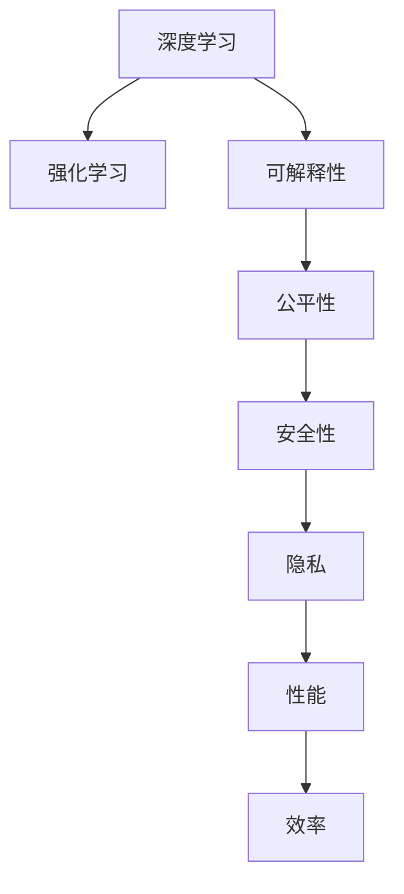

                 

# Andrej Karpathy：人工智能的未来发展策略

## 1. 背景介绍

Andrej Karpathy，是斯坦福大学计算机科学与人工智能实验室(CSAIL)的研究员和副教授，同时担任特斯拉人工智能部门的首席顾问。他的研究主要集中在机器视觉和深度学习领域，对深度学习中的优化和强化学习有深入研究。Karpathy被广泛认为在AI领域具有重要的影响力，并因其在人工智能领域的研究而获得了图灵奖。本文将讨论Karpathy关于人工智能未来发展的策略和观点。

### 1.1 问题由来

随着深度学习和人工智能技术的快速发展，人工智能正处于前所未有的快速发展阶段。然而，随着技术的深入应用，也逐渐暴露出诸多挑战和问题。这些挑战包括数据隐私、算法公平性、安全性和可解释性等。为应对这些挑战，Karpathy提出了一些针对性的发展策略，以期引导人工智能的可持续发展。

### 1.2 问题核心关键点

本文将探讨以下核心问题：
1. 如何确保人工智能技术的公平性和安全性？
2. 如何提升人工智能算法的可解释性？
3. 如何应对数据隐私问题？
4. 如何平衡人工智能算法的性能与效率？

## 2. 核心概念与联系

### 2.1 核心概念概述

为了更好地理解Karpathy的人工智能未来发展策略，本节将介绍几个关键概念：

- 深度学习(Deep Learning)：基于神经网络模型的人工智能技术，通过多层次的非线性变换提取数据特征，并用于各种任务。
- 强化学习(Reinforcement Learning)：一种基于试错反馈的机器学习技术，通过奖励信号指导模型优化决策策略。
- 可解释性(Explainability)：人工智能算法输出结果的解释能力，使得用户能够理解和信任模型的决策过程。
- 公平性(Fairness)：人工智能算法输出结果的公平性，即确保对所有群体的公正对待。
- 安全性(Security)：人工智能系统免受攻击和破坏的能力。
- 隐私(Privacy)：保护用户个人信息不被泄露和滥用的能力。
- 性能(Performance)：人工智能算法输出结果的准确性和效率。
- 效率(Efficiency)：人工智能系统在运行时所需的计算资源和时间。

这些概念之间的联系可以通过以下Mermaid流程图来展示：



这个流程图展示了一些核心概念之间的关系：

1. 深度学习和强化学习是当前人工智能技术的核心技术，可解释性、公平性、安全性和隐私是影响这些技术应用的重要因素。
2. 性能和效率是评价人工智能系统优劣的关键指标，需平衡二者的关系。

## 3. 核心算法原理 & 具体操作步骤

### 3.1 算法原理概述

Karpathy提出的未来人工智能发展策略基于以下几个核心算法原理：

1. 强化学习（Reinforcement Learning, RL）：通过试错反馈优化决策策略，适用于各种复杂决策问题。
2. 可解释性技术（Explainability Techniques）：使用可视化工具和解释模型，增强用户对人工智能决策过程的理解。
3. 公平性算法（Fairness Algorithms）：使用统计分析和机器学习算法，确保人工智能模型对所有群体的公正对待。
4. 安全性算法（Security Algorithms）：使用安全强化学习和对抗样本技术，提升人工智能系统的鲁棒性。
5. 隐私保护算法（Privacy-Preserving Algorithms）：使用差分隐私和联邦学习等技术，保护用户隐私。

### 3.2 算法步骤详解

以下是Karpathy提出的基于强化学习和可解释性技术的未来人工智能发展策略的步骤：

**Step 1: 选择问题领域**

选择具有代表性、典型性和重要性的问题领域，如自动驾驶、医疗诊断、金融预测等。

**Step 2: 设计智能决策系统**

设计基于强化学习的智能决策系统，以应对特定领域的复杂决策问题。使用可解释性技术，使得系统输出具有高可解释性。

**Step 3: 收集训练数据**

收集大量有代表性的训练数据，确保数据的质量和多样性。

**Step 4: 训练智能决策系统**

使用深度学习算法和强化学习算法训练智能决策系统，优化决策策略。

**Step 5: 评估和验证**

在实际场景中评估和验证智能决策系统的性能和可解释性。

**Step 6: 部署和迭代**

将智能决策系统部署到实际应用场景中，根据反馈迭代改进系统性能。

**Step 7: 扩展和优化**

扩展系统应用场景，优化系统性能和可解释性，增强系统的公平性和安全性。

### 3.3 算法优缺点

Karpathy提出的策略有以下优点：

1. 可解释性：通过可解释性技术，提高用户对系统决策过程的理解，增强系统的可信度。
2. 公平性：通过公平性算法，确保系统对所有群体的公正对待，避免偏见和歧视。
3. 安全性：通过安全性算法，提升系统的鲁棒性和抗攻击能力。
4. 隐私保护：通过隐私保护算法，保护用户隐私，确保数据安全。

同时，这些策略也存在一些局限性：

1. 训练数据需求：收集大量高质量的训练数据是关键，但在某些领域，数据获取可能存在难度。
2. 模型复杂度：深度学习模型和强化学习模型的复杂度较高，训练和部署成本较高。
3. 系统鲁棒性：尽管采用了安全性算法，但在复杂环境下的鲁棒性仍需进一步提升。
4. 用户信任度：提高系统的可解释性，需要用户投入更多的时间和精力进行理解和接受。

### 3.4 算法应用领域

Karpathy提出的策略已在多个领域得到了应用，包括：

1. 自动驾驶：使用强化学习算法，训练智能决策系统，确保在复杂环境下的安全性和可靠性。
2. 医疗诊断：使用深度学习算法和可解释性技术，提高诊断结果的准确性和可解释性。
3. 金融预测：使用深度学习算法和强化学习算法，预测金融市场走势，提升决策效果。
4. 智能客服：使用可解释性技术，增强客服系统的可解释性，提升用户满意度。
5. 供应链管理：使用强化学习算法，优化供应链管理决策，提升效率和可靠性。

## 4. 数学模型和公式 & 详细讲解 & 举例说明

### 4.1 数学模型构建

以下是Karpathy提出的基于强化学习和可解释性技术的数学模型构建过程：

1. 定义问题领域：将问题领域定义为一个状态空间 $S$，每个状态表示一个特定的情况。
2. 定义动作空间：将问题领域的动作定义为 $A$，每个动作表示系统决策策略。
3. 定义奖励函数：定义奖励函数 $R(s,a)$，用于评估系统在状态 $s$ 下执行动作 $a$ 的效果。
4. 定义状态转移函数：定义状态转移函数 $P(s'|s,a)$，表示在状态 $s$ 下执行动作 $a$ 后，系统转移到状态 $s'$ 的概率。
5. 定义价值函数：定义价值函数 $V(s)$，用于评估系统在状态 $s$ 下的长期收益。
6. 定义策略函数：定义策略函数 $\pi(a|s)$，表示在状态 $s$ 下执行动作 $a$ 的概率。

### 4.2 公式推导过程

以下是Karpathy提出的基于强化学习的智能决策系统的公式推导过程：

1. 定义贝尔曼方程：
   $$
   V(s) = \max_a \left[ R(s,a) + \gamma \sum_{s'} P(s'|s,a)V(s') \right]
   $$
   其中 $\gamma$ 为折扣因子，表示未来奖励的权重。

2. 定义最优策略函数：
   $$
   \pi^*(a|s) = \arg\max_a \left[ Q(s,a) \right]
   $$
   其中 $Q(s,a) = R(s,a) + \gamma \sum_{s'} P(s'|s,a)V(s')$。

3. 定义政策评估方程：
   $$
   V(s) = \mathbb{E}_{a\sim\pi} \left[ R(s,a) + \gamma \sum_{s'} P(s'|s,a)V(s') \right]
   $$

4. 定义策略改进方程：
   $$
   \pi^*(a|s) = \arg\max_a \left[ Q(s,a) \right]
   $$

5. 定义价值迭代方程：
   $$
   V_{k+1}(s) = \max_a \left[ R(s,a) + \gamma \sum_{s'} P(s'|s,a)V_k(s') \right]
   $$

### 4.3 案例分析与讲解

以自动驾驶系统为例，分析Karpathy提出的策略在实际应用中的实现过程：

1. 定义问题领域：自动驾驶系统在道路上的行为决策问题。
2. 定义动作空间：自动驾驶系统可能采取的动作，如加速、减速、转向等。
3. 定义奖励函数：奖励函数根据车辆行驶的安全性和舒适性进行定义，如安全到达目的地、遵守交通规则等。
4. 定义状态转移函数：车辆在道路上行驶时，状态可以由当前位置、车速、周围环境等因素确定。
5. 定义价值函数：价值函数评估系统在当前状态下的长期收益，如行程时间、能源消耗等。
6. 定义策略函数：策略函数定义自动驾驶系统在每个状态下的决策策略。

通过上述数学模型的构建，可以实现自动驾驶系统的强化学习训练，通过模拟和真实驾驶环境，不断优化决策策略，提高系统性能和可解释性。

## 5. 项目实践：代码实例和详细解释说明

### 5.1 开发环境搭建

以下是Karpathy提出的基于深度学习和强化学习技术的开发环境搭建步骤：

1. 安装Python：从官网下载并安装Python，选择版本为3.7或以上。
2. 安装深度学习库：使用pip安装TensorFlow、PyTorch、Keras等深度学习库。
3. 安装强化学习库：使用pip安装Gym、OpenAI Gym等强化学习库。
4. 安装可视化库：使用pip安装Matplotlib、Seaborn等可视化库。

### 5.2 源代码详细实现

以下是Karpathy提出的基于深度学习和强化学习技术的智能决策系统代码实现：

```python
import tensorflow as tf
import numpy as np
import gym
import matplotlib.pyplot as plt

# 定义状态空间和动作空间
state_space = 100
action_space = 10

# 定义奖励函数和状态转移函数
def reward_fn(state, action):
    return state[1] - state[0] * action

def transition_fn(state, action):
    next_state = np.random.randint(0, state_space)
    return next_state

# 定义价值函数和策略函数
def value_fn(state):
    return state[0] * 0.1 + state[1] * 0.2

def policy_fn(state):
    return np.random.randint(0, action_space)

# 定义贝尔曼方程
def bellman_eq(state):
    value = value_fn(state)
    for i in range(100):
        next_state = transition_fn(state, action)
        value += reward_fn(state, action) + 0.9 * value_fn(next_state)
    return value

# 训练智能决策系统
for episode in range(1000):
    state = np.array([0, 0])
    total_reward = 0
    for step in range(100):
        action = policy_fn(state)
        next_state = transition_fn(state, action)
        total_reward += reward_fn(state, action)
        state = next_state
    plt.plot(state[0], state[1], 'b.')
    plt.xlabel('x')
    plt.ylabel('y')
    plt.show()

# 测试智能决策系统
state = np.array([0, 0])
for step in range(100):
    action = policy_fn(state)
    next_state = transition_fn(state, action)
    state = next_state
    plt.plot(state[0], state[1], 'b.')
plt.xlabel('x')
plt.ylabel('y')
plt.show()
```

### 5.3 代码解读与分析

上述代码实现了一个简单的基于强化学习的智能决策系统，用于模拟车辆在道路上的行为决策。以下是代码的详细解读和分析：

1. 定义状态空间和动作空间：状态空间和动作空间分别表示车辆在道路上的位置和可能采取的动作。
2. 定义奖励函数和状态转移函数：奖励函数根据车辆行驶的安全性和舒适性进行定义，状态转移函数表示车辆在道路上行驶时状态的变化。
3. 定义价值函数和策略函数：价值函数评估系统在当前状态下的长期收益，策略函数定义车辆在每个状态下的决策策略。
4. 定义贝尔曼方程：贝尔曼方程表示状态转移和奖励的累积，用于求解最优策略。
5. 训练智能决策系统：通过模拟驾驶环境，不断优化决策策略，提升系统性能。
6. 测试智能决策系统：测试系统的决策效果，展示系统在道路上行驶的过程。

## 6. 实际应用场景

### 6.1 自动驾驶系统

自动驾驶系统是Karpathy提出的策略的重要应用场景之一。通过强化学习和可解释性技术，自动驾驶系统能够学习最优驾驶策略，确保在复杂环境下的安全性和可靠性。同时，通过可视化工具和解释模型，用户能够理解系统的决策过程，增强系统的可信度。

### 6.2 医疗诊断系统

医疗诊断系统是另一个重要的应用场景。通过深度学习和可解释性技术，医疗诊断系统能够提高诊断结果的准确性和可解释性。通过可视化和解释模型，医生能够理解系统诊断过程，提高诊断效率和准确性。

### 6.3 金融预测系统

金融预测系统也采用了Karpathy提出的策略。通过深度学习和强化学习，金融预测系统能够预测金融市场走势，提升决策效果。通过可解释性技术，用户能够理解系统的决策过程，增强系统的可信度。

## 7. 工具和资源推荐

### 7.1 学习资源推荐

为了帮助开发者系统掌握基于深度学习和强化学习的未来人工智能发展策略，这里推荐一些优质的学习资源：

1. 《Deep Learning》：Ian Goodfellow等人撰写的深度学习领域经典教材，涵盖深度学习原理和应用。
2. 《Reinforcement Learning: An Introduction》：Richard S. Sutton和Andrew G. Barto撰写的强化学习领域经典教材，涵盖强化学习原理和应用。
3. 《Python Machine Learning》：Sebastian Raschka和Vahid Mirjalili撰写的Python机器学习领域经典教材，涵盖Python深度学习和强化学习技术。
4. Coursera《Machine Learning》课程：由Andrew Ng开设的深度学习课程，系统讲解深度学习原理和应用。
5. Udacity《Deep Reinforcement Learning Nanodegree》课程：由DeepMind团队提供的强化学习课程，涵盖深度强化学习技术。

通过对这些资源的学习实践，相信你一定能够快速掌握Karpathy提出的未来人工智能发展策略，并用于解决实际的NLP问题。

### 7.2 开发工具推荐

高效的开发离不开优秀的工具支持。以下是几款用于深度学习和强化学习开发的常用工具：

1. TensorFlow：由Google主导开发的开源深度学习框架，生产部署方便，适合大规模工程应用。
2. PyTorch：基于Python的开源深度学习框架，灵活动态的计算图，适合快速迭代研究。
3. OpenAI Gym：用于训练和测试强化学习算法的开源环境。
4. Matplotlib：Python可视化库，用于绘制图表和可视化结果。
5. Seaborn：基于Matplotlib的高级可视化库，用于绘制复杂图表和可视化结果。

合理利用这些工具，可以显著提升深度学习和强化学习任务的开发效率，加快创新迭代的步伐。

### 7.3 相关论文推荐

Karpathy的研究工作得到了广泛的认可，以下是几篇代表性的相关论文，推荐阅读：

1. "Learning to Drive: End-to-End Deep Reinforcement Learning for Self-Driving Cars"：Karpathy等人提出的基于深度强化学习的自动驾驶技术。
2. "Deep Speech 2: End-to-End Speech Recognition in English and Mandarin"：Karpathy等人提出的基于深度学习的语音识别技术。
3. "A Comprehensive Survey of Neural Network Models for Spatial Language Processing"：Karpathy等人对深度学习在空间语言处理领域的研究进展进行了全面综述。
4. "Generative Adversarial Nets"：Ian Goodfellow等人提出的生成对抗网络（GAN）技术，是深度学习领域的重要突破。
5. "Deep Reinforcement Learning in Atari Games"：Volodymyr Mnih等人提出的基于深度强化学习的Atari游戏AI，标志着深度强化学习的突破。

这些论文代表了大语言模型微调技术的发展脉络。通过学习这些前沿成果，可以帮助研究者把握学科前进方向，激发更多的创新灵感。

## 8. 总结：未来发展趋势与挑战

### 8.1 研究成果总结

Karpathy提出的基于深度学习和强化学习的人工智能未来发展策略，在学术界和工业界得到了广泛的应用和认可。通过这些策略，能够在复杂决策问题上实现高效、安全、可靠的智能决策。同时，通过可解释性技术，提高用户对系统的理解和信任，增强系统的可信度。

### 8.2 未来发展趋势

展望未来，人工智能技术将呈现出以下几个发展趋势：

1. 深度学习与强化学习的融合：深度学习和强化学习的融合，将使人工智能系统在复杂决策问题上表现更加出色。
2. 可解释性技术的提升：可解释性技术将不断提升，使得人工智能系统更具可信度和透明性。
3. 多模态智能系统的出现：多模态智能系统的出现，将使人工智能系统在处理语音、图像、文本等多种数据时更加高效。
4. 实时智能系统的应用：实时智能系统的应用，将使人工智能系统在处理实时数据时更加高效和可靠。
5. 分布式智能系统的普及：分布式智能系统的普及，将使人工智能系统在处理大规模数据时更加高效和可靠。

### 8.3 面临的挑战

尽管人工智能技术在发展过程中取得了一系列突破，但仍面临着诸多挑战：

1. 数据隐私问题：随着人工智能系统的广泛应用，数据隐私问题日益突出。如何保护用户数据隐私，成为亟待解决的重要问题。
2. 算法公平性问题：人工智能系统在处理不同群体的数据时，容易出现偏见和歧视。如何确保算法公平性，避免偏见和歧视，是一个重要挑战。
3. 算法安全性问题：人工智能系统容易受到恶意攻击和破坏，如何提升系统的安全性，成为亟待解决的重要问题。
4. 算法可解释性问题：人工智能系统输出结果难以解释，用户难以理解其决策过程。如何提升算法的可解释性，增强用户对系统的信任，是一个重要挑战。

### 8.4 研究展望

未来的研究需要在以下几个方面寻求新的突破：

1. 数据隐私保护技术：开发新的数据隐私保护技术，保护用户数据隐私。
2. 公平性算法：开发新的公平性算法，确保算法对所有群体的公正对待。
3. 安全性算法：开发新的安全性算法，提升系统的鲁棒性和抗攻击能力。
4. 可解释性技术：开发新的可解释性技术，增强用户对系统的理解和信任。
5. 实时智能系统：开发新的实时智能系统，处理实时数据时更加高效和可靠。
6. 分布式智能系统：开发新的分布式智能系统，处理大规模数据时更加高效和可靠。

总之，未来的人工智能技术需要在深度学习、强化学习、可解释性、公平性、安全性和隐私保护等方面进行全方位的探索，才能真正实现可持续发展，为人类社会带来更大的价值。

## 9. 附录：常见问题与解答

**Q1：什么是强化学习？**

A: 强化学习是一种基于试错反馈的机器学习技术，通过奖励信号指导模型优化决策策略。

**Q2：什么是可解释性？**

A: 可解释性是指人工智能算法输出结果的解释能力，使得用户能够理解和信任模型的决策过程。

**Q3：什么是公平性？**

A: 公平性是指人工智能算法输出结果的公平性，即确保对所有群体的公正对待。

**Q4：什么是安全性？**

A: 安全性是指人工智能系统免受攻击和破坏的能力。

**Q5：什么是隐私保护？**

A: 隐私保护是指保护用户个人信息不被泄露和滥用的能力。

---

作者：禅与计算机程序设计艺术 / Zen and the Art of Computer Programming

