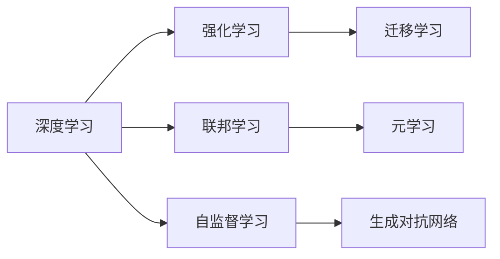

                 

## 1. 背景介绍

Andrej Karpathy，作为人工智能领域的权威专家，对人工智能的未来发展趋势有着深刻的见解。他认为，尽管当前AI技术取得了巨大的进步，但未来仍面临诸多挑战和机遇。本文将基于Karpathy的视角，探讨AI技术在多个领域的发展趋势及其潜在的影响。

## 2. 核心概念与联系

### 2.1 核心概念概述

为了更好地理解人工智能的发展趋势，我们需要明确几个核心概念：

- **深度学习(Deep Learning)**：一种基于神经网络的机器学习方法，能够自动学习并提取数据的特征表示，广泛应用于图像识别、语音识别、自然语言处理等领域。
- **强化学习(Reinforcement Learning)**：一种通过奖励机制训练智能体在环境中的行为选择的学习方式，适用于复杂决策场景。
- **迁移学习(Transfer Learning)**：将在一个任务上学习到的知识迁移到另一个相关任务上，以减少训练时间和提高性能。
- **联邦学习(Federated Learning)**：一种分布式机器学习方法，能够在保护数据隐私的前提下，从多个数据源联合学习模型。
- **元学习(Meta-Learning)**：一种学习学习的方法，通过学习如何快速适应新任务，实现更高效的模型训练。
- **自监督学习(Self-Supervised Learning)**：利用数据的隐含关系进行训练，无需大量标注数据，提高数据利用率。
- **生成对抗网络(Generative Adversarial Networks, GANs)**：由生成器和判别器组成的博弈过程，用于生成逼真的数据样本。

这些概念之间的联系可以总结如下：



这些概念共同构成了人工智能技术的核心，涵盖了从数据驱动学习到模型主动学习，从局部优化到全局优化的各个方面。

## 3. 核心算法原理 & 具体操作步骤

### 3.1 算法原理概述

Karpathy认为，未来人工智能的发展将遵循以下几个关键原理：

1. **多模态融合**：将文本、图像、语音等多种信息源结合起来，提高AI系统的感知和理解能力。
2. **自监督学习**：利用数据中的隐含关系进行训练，无需大量标注数据，提高数据利用率。
3. **生成对抗网络**：通过生成器和判别器的博弈过程，生成逼真的数据样本，弥补标注数据的不足。
4. **强化学习**：通过奖励机制训练智能体，适应复杂的决策场景，提高模型的自主性和智能性。
5. **元学习**：学习如何快速适应新任务，实现更高效的模型训练，提升模型的泛化能力。
6. **联邦学习**：在保护数据隐私的前提下，联合多个数据源训练模型，提高模型的泛化能力。

### 3.2 算法步骤详解

基于上述原理，人工智能的发展大致可以分为以下几个步骤：

1. **数据收集**：收集多模态、大规模、高质量的数据，为深度学习和生成对抗网络提供丰富的训练样本。
2. **预处理和增强**：对数据进行预处理和增强，提高数据的多样性和泛化能力。
3. **模型训练**：使用深度学习、生成对抗网络和强化学习等技术进行模型训练，提升模型的性能和泛化能力。
4. **微调与优化**：在实际应用场景中，对模型进行微调和优化，提高模型的适应性和鲁棒性。
5. **部署与应用**：将训练好的模型部署到实际应用中，进行大规模的工业级测试和验证，提升模型的实际应用效果。

### 3.3 算法优缺点

人工智能的发展既有其显著的优点，也面临诸多挑战：

**优点**：
- **泛化能力**：基于深度学习和大数据训练的模型具有强大的泛化能力，能够在不同场景下表现出色。
- **自动学习**：无需人工干预，通过大量数据训练，能够自动学习特征表示，提高模型的自主性和智能性。
- **多模态融合**：能够融合多种信息源，提升系统的感知和理解能力。

**挑战**：
- **数据依赖**：需要大规模、高质量的数据进行训练，数据获取和标注成本高昂。
- **模型复杂性**：模型规模庞大，训练和推理复杂，需要强大的计算资源。
- **过拟合问题**：模型容易过拟合，尤其是训练数据不足时。
- **解释性不足**：深度学习模型通常被称为“黑盒”，难以解释模型的内部工作机制。
- **伦理与安全问题**：模型可能产生偏见、歧视性输出，给实际应用带来安全隐患。

### 3.4 算法应用领域

基于上述原理，人工智能技术在多个领域具有广泛的应用前景：

1. **医疗**：通过图像识别、自然语言处理等技术，辅助医生进行疾病诊断和治疗。
2. **金融**：通过强化学习、生成对抗网络等技术，进行风险评估、投资决策等。
3. **自动驾驶**：通过深度学习、多模态融合等技术，实现自动驾驶和智能交通管理。
4. **智能制造**：通过强化学习、联邦学习等技术，提升生产效率和资源利用率。
5. **智能家居**：通过多模态融合、自监督学习等技术，提升家居系统的智能性和互动性。
6. **教育**：通过自然语言处理、生成对抗网络等技术，实现个性化教育和学习推荐。

## 4. 数学模型和公式 & 详细讲解 & 举例说明

### 4.1 数学模型构建

以深度学习中的卷积神经网络(CNN)为例，构建数学模型：

设输入为 $x \in \mathbb{R}^{n}$，卷积核为 $k \in \mathbb{R}^{n \times n \times n}$，输出为 $y \in \mathbb{R}^{m}$。卷积操作定义为：

$$
y_i = \sum_{j=1}^{n} k_{i,j} \cdot x_{j}
$$

其中 $k_{i,j}$ 表示卷积核中第 $i$ 行、第 $j$ 列的权重。

### 4.2 公式推导过程

以卷积神经网络的反向传播算法为例，推导损失函数对权重 $k$ 的梯度：

设损失函数为 $L$，对输出 $y$ 的平方误差进行求解：

$$
L = \frac{1}{2} \sum_{i=1}^{m} (y_i - t_i)^2
$$

其中 $t$ 为真实标签。

反向传播算法将损失函数的梯度传递回网络中，求得权重 $k$ 的梯度：

$$
\frac{\partial L}{\partial k} = \frac{\partial L}{\partial y} \cdot \frac{\partial y}{\partial k}
$$

其中 $\frac{\partial y}{\partial k}$ 表示卷积操作的梯度，可以通过卷积层的参数更新公式求解。

### 4.3 案例分析与讲解

以图像分类任务为例，分析深度学习模型的应用：

假设输入为 $28 \times 28$ 的灰度图像，输出为10个类别的概率分布。通过卷积层、池化层、全连接层等操作，得到最终的输出结果。在训练过程中，使用交叉熵损失函数进行优化，通过反向传播算法更新模型参数。

在测试过程中，将新图像输入模型，通过softmax函数得到每个类别的概率分布，选择概率最大的类别作为预测结果。

## 5. 项目实践：代码实例和详细解释说明

### 5.1 开发环境搭建

为了进行深度学习模型的训练和测试，需要搭建相应的开发环境。以下是Python环境配置的步骤：

1. 安装Anaconda：从官网下载并安装Anaconda，用于创建独立的Python环境。
2. 创建并激活虚拟环境：
```bash
conda create -n deep_learning python=3.8 
conda activate deep_learning
```

3. 安装深度学习框架：
```bash
conda install tensorflow=2.3 pytorch=1.7.0 torchvision=0.8.2 
conda install pytorch-lightning
```

4. 安装TensorBoard：
```bash
pip install tensorboard
```

5. 安装其他必要的库：
```bash
pip install numpy scipy matplotlib scikit-learn tensorflow_datasets
```

完成上述步骤后，即可在`deep_learning`环境中开始深度学习模型的开发。

### 5.2 源代码详细实现

以下是一个简单的卷积神经网络模型实现，用于图像分类任务：

```python
import tensorflow as tf
from tensorflow.keras import layers

class CNNModel(tf.keras.Model):
    def __init__(self):
        super(CNNModel, self).__init__()
        self.conv1 = layers.Conv2D(32, (3, 3), activation='relu')
        self.pool1 = layers.MaxPooling2D((2, 2))
        self.conv2 = layers.Conv2D(64, (3, 3), activation='relu')
        self.pool2 = layers.MaxPooling2D((2, 2))
        self.flatten = layers.Flatten()
        self.fc1 = layers.Dense(128, activation='relu')
        self.fc2 = layers.Dense(10, activation='softmax')
    
    def call(self, inputs):
        x = self.conv1(inputs)
        x = self.pool1(x)
        x = self.conv2(x)
        x = self.pool2(x)
        x = self.flatten(x)
        x = self.fc1(x)
        return self.fc2(x)

# 构建模型
model = CNNModel()

# 编译模型
model.compile(optimizer=tf.keras.optimizers.Adam(learning_rate=0.001),
              loss=tf.keras.losses.SparseCategoricalCrossentropy(from_logits=True),
              metrics=['accuracy'])

# 训练模型
model.fit(train_dataset, epochs=10, validation_data=val_dataset)
```

### 5.3 代码解读与分析

以上代码实现了简单的卷积神经网络模型，用于图像分类任务。具体分析如下：

- **模型构建**：定义了两个卷积层、两个池化层、一个全连接层和一个输出层，用于提取图像特征并进行分类。
- **模型编译**：使用Adam优化器，交叉熵损失函数，以及准确率指标进行模型编译。
- **模型训练**：使用训练数据集和验证数据集对模型进行训练，迭代10个epoch。

通过分析代码，可以更好地理解卷积神经网络模型的构建和训练过程。

### 5.4 运行结果展示

训练完成后，使用测试数据集对模型进行测试，并输出模型在测试集上的准确率：

```python
test_loss, test_acc = model.evaluate(test_dataset)
print(f'Test accuracy: {test_acc:.2f}%')
```

## 6. 实际应用场景

### 6.4 未来应用展望

未来，人工智能将在更多领域得到应用，以下是一些具有潜力的场景：

1. **自动驾驶**：通过多模态融合、强化学习等技术，实现自动驾驶和智能交通管理，提升交通安全性和效率。
2. **智慧医疗**：通过深度学习、自然语言处理等技术，辅助医生进行疾病诊断和治疗，提升医疗服务质量。
3. **智能制造**：通过强化学习、联邦学习等技术，提升生产效率和资源利用率，实现智能制造和个性化定制。
4. **智能家居**：通过多模态融合、自监督学习等技术，提升家居系统的智能性和互动性，实现智慧家居。
5. **教育**：通过自然语言处理、生成对抗网络等技术，实现个性化教育和学习推荐，提升教育效果。

## 7. 工具和资源推荐

### 7.1 学习资源推荐

为了帮助开发者系统掌握深度学习技术，以下是一些优质的学习资源：

1. **《深度学习》教材**：Ian Goodfellow等著，系统介绍了深度学习的基本概念、原理和应用。
2. **CS231n《卷积神经网络》课程**：斯坦福大学开设的计算机视觉课程，有Lecture视频和配套作业，适合入门计算机视觉领域。
3. **CS224n《自然语言处理》课程**：斯坦福大学开设的自然语言处理课程，涵盖NLP的基本概念和经典模型。
4. **《TensorFlow实战》书籍**：介绍TensorFlow的各项功能和使用技巧，适合实战开发。
5. **Kaggle竞赛平台**：通过参与Kaggle竞赛，积累实战经验和数据处理能力。

### 7.2 开发工具推荐

为了提高深度学习模型的开发效率，以下是一些常用的开发工具：

1. **TensorFlow**：由Google主导开发的深度学习框架，生产部署方便，适合大规模工程应用。
2. **PyTorch**：基于Python的开源深度学习框架，灵活动态的计算图，适合快速迭代研究。
3. **Jupyter Notebook**：免费提供的交互式编程环境，适合数据探索和模型验证。
4. **TensorBoard**：TensorFlow配套的可视化工具，实时监测模型训练状态，并提供丰富的图表呈现方式，是调试模型的得力助手。
5. **Weights & Biases**：模型训练的实验跟踪工具，可以记录和可视化模型训练过程中的各项指标，方便对比和调优。

### 7.3 相关论文推荐

以下是一些深度学习领域的重要论文，推荐阅读：

1. **ImageNet Classification with Deep Convolutional Neural Networks**：Alex Krizhevsky等著，提出了深度卷积神经网络，在ImageNet数据集上取得了显著的性能提升。
2. **Deep Residual Learning for Image Recognition**：Kaiming He等著，提出了残差连接，解决了深度网络训练中的梯度消失问题。
3. **Attention is All You Need**：Ashish Vaswani等著，提出了Transformer模型，开启了NLP领域的预训练大模型时代。
4. **Adversarial Examples in the Physical World**：Ian Goodfellow等著，研究了对抗样本对模型鲁棒性的影响，提出防御方法。
5. **A Survey of Few-shot Learning Techniques**：Youngsik Kim等著，全面介绍了Few-shot学习技术，涵盖样本增强、模型微调等方面。

## 8. 总结：未来发展趋势与挑战

### 8.1 研究成果总结

深度学习技术经过多年的发展，已经在图像识别、语音识别、自然语言处理等领域取得了显著的成就。未来，随着多模态融合、自监督学习、生成对抗网络等技术的进一步发展，深度学习将更加强大和智能。

### 8.2 未来发展趋势

未来，人工智能的发展趋势包括以下几个方面：

1. **多模态融合**：将文本、图像、语音等多种信息源结合起来，提高AI系统的感知和理解能力。
2. **自监督学习**：利用数据中的隐含关系进行训练，无需大量标注数据，提高数据利用率。
3. **生成对抗网络**：通过生成器和判别器的博弈过程，生成逼真的数据样本，弥补标注数据的不足。
4. **强化学习**：通过奖励机制训练智能体，适应复杂的决策场景，提高模型的自主性和智能性。
5. **元学习**：学习如何快速适应新任务，实现更高效的模型训练，提升模型的泛化能力。
6. **联邦学习**：在保护数据隐私的前提下，联合多个数据源训练模型，提高模型的泛化能力。

### 8.3 面临的挑战

尽管深度学习技术取得了显著的进展，但也面临诸多挑战：

1. **数据依赖**：需要大规模、高质量的数据进行训练，数据获取和标注成本高昂。
2. **模型复杂性**：模型规模庞大，训练和推理复杂，需要强大的计算资源。
3. **过拟合问题**：模型容易过拟合，尤其是训练数据不足时。
4. **解释性不足**：深度学习模型通常被称为“黑盒”，难以解释模型的内部工作机制。
5. **伦理与安全问题**：模型可能产生偏见、歧视性输出，给实际应用带来安全隐患。

### 8.4 研究展望

为了应对上述挑战，未来需要在以下几个方面进行深入研究：

1. **数据增强与合成**：开发更多数据增强和合成技术，提高数据的多样性和泛化能力。
2. **模型压缩与优化**：研究模型压缩和优化技术，减小模型规模，提高计算效率。
3. **对抗样本与鲁棒性**：研究对抗样本生成与防御技术，提高模型的鲁棒性和泛化能力。
4. **可解释性与透明性**：开发可解释性技术，解释模型的内部工作机制，提高模型的透明性和可信度。
5. **隐私保护与伦理设计**：设计隐私保护机制，确保数据和模型安全，避免偏见和歧视性输出。

## 9. 附录：常见问题与解答

**Q1：深度学习与传统机器学习有什么区别？**

A: 深度学习是一种基于神经网络的机器学习方法，能够自动学习并提取数据的特征表示，而传统机器学习需要手动设计特征。深度学习通常需要更多的数据和计算资源，但能够处理更复杂的任务。

**Q2：什么是生成对抗网络(GANs)？**

A: 生成对抗网络由生成器和判别器两个组件组成。生成器尝试生成逼真的样本，判别器则尝试区分生成样本和真实样本。通过博弈过程，生成器不断改进生成能力，生成逼真的样本。

**Q3：如何应对深度学习中的过拟合问题？**

A: 过拟合可以通过数据增强、正则化、Dropout等技术进行缓解。数据增强可以增加数据的多样性，正则化和Dropout可以减少模型复杂度，避免过拟合。

**Q4：深度学习的未来发展方向是什么？**

A: 深度学习的未来发展方向包括多模态融合、自监督学习、生成对抗网络、强化学习、元学习、联邦学习等。这些技术能够提高模型的感知和理解能力，提升模型的泛化能力和鲁棒性。

通过深入理解深度学习技术的原理和应用，我们可以更好地把握未来发展的趋势，应对挑战，实现更多创新。

