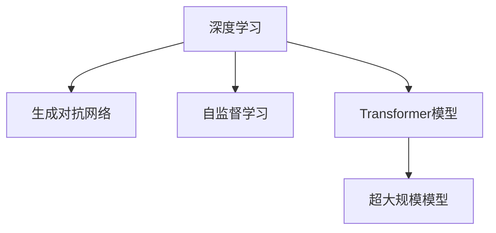
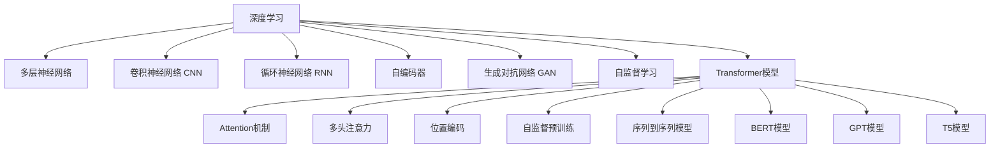

                 

# Andrej Karpathy：人工智能的未来趋势

> 关键词：人工智能,深度学习,深度强化学习,自监督学习,生成对抗网络,Transformer模型,超大规模模型

## 1. 背景介绍

### 1.1 问题由来

Andrej Karpathy是深度学习领域的知名专家，其工作涉及深度强化学习、自监督学习、生成对抗网络等领域，并发表了众多前沿论文，影响了深度学习的发展方向。本文将深度学习作为主要主题，通过对Karpathy工作的回顾，展望未来AI技术的发展趋势。

### 1.2 问题核心关键点

本文将重点关注以下几个关键点：

1. **深度学习技术的发展历程**。回顾深度学习从早期研究到现代应用的演进过程。
2. **当前深度学习中的主要研究方向**。包括生成对抗网络、自监督学习、Transformer模型等。
3. **未来AI技术的预测与展望**。基于现有研究，预测未来AI技术可能的发展方向和趋势。
4. **人工智能的伦理和社会影响**。探讨AI技术对社会的影响，及其面临的伦理挑战。

## 2. 核心概念与联系

### 2.1 核心概念概述

为更好地理解深度学习，本节将介绍几个密切相关的核心概念：

- **深度学习**：一种利用多层神经网络逼近复杂非线性关系的学习方式。通过深度神经网络，可以从原始数据中提取高层次的抽象特征。
- **生成对抗网络**：一种由生成器和判别器两个模型组成的对抗性训练方法，可用于生成逼真的图像、视频等数据。
- **自监督学习**：一种无需标签，通过自监督任务（如掩码语言模型、自回归预测等）进行模型训练的方法。
- **Transformer模型**：一种基于自注意力机制的神经网络架构，特别适用于处理序列数据，如自然语言处理中的句子表示。
- **超大规模模型**：指参数数量达到数十亿的深度学习模型，如GPT-3、BERT等。

这些概念之间的关系可以通过以下Mermaid流程图来展示：



这个流程图展示了深度学习与相关技术之间的联系。

### 2.2 核心概念原理和架构的 Mermaid 流程图



## 3. 核心算法原理 & 具体操作步骤

### 3.1 算法原理概述

深度学习算法主要包括前向传播、反向传播和优化算法三部分。其核心思想是通过大量标注数据进行模型训练，使得模型能够学习到数据的统计特征，从而在未标注数据上表现出色。

### 3.2 算法步骤详解

1. **数据预处理**：将原始数据转化为模型可以处理的形式，如将图像转换为张量，将文本转换为向量表示。
2. **前向传播**：将输入数据通过模型，得到预测结果。
3. **损失函数计算**：计算预测结果与真实标签之间的差距。
4. **反向传播**：通过链式法则，计算损失函数对每个参数的梯度。
5. **参数更新**：使用优化算法（如梯度下降）更新模型参数，最小化损失函数。

### 3.3 算法优缺点

深度学习的优点在于其强大的数据拟合能力，可以处理复杂的非线性关系。缺点包括需要大量标注数据、模型训练时间长、难以解释模型决策过程等。

### 3.4 算法应用领域

深度学习广泛应用在图像识别、自然语言处理、语音识别、推荐系统等领域。生成对抗网络在图像生成、视频生成等领域有显著应用。自监督学习通过无标签数据进行预训练，减少对标注数据的依赖。Transformer模型在序列数据处理中表现出色。超大规模模型如BERT、GPT-3等，在大规模文本处理、自然语言生成等领域取得突破性进展。

## 4. 数学模型和公式 & 详细讲解 & 举例说明

### 4.1 数学模型构建

深度学习模型的数学模型通常基于神经网络。以多层感知器为例，其模型可以表示为：

$$
f(x) = \sum_{i=1}^n w_i f_{i-1}(x) + b_i
$$

其中，$w_i$ 为权重，$b_i$ 为偏置，$f_{i-1}(x)$ 为第 $i-1$ 层的输出。

### 4.2 公式推导过程

以卷积神经网络（CNN）为例，其卷积操作的公式可以表示为：

$$
f(x) = \sum_{i=0}^{k-1} w_i \star x + b
$$

其中，$w_i$ 为卷积核，$x$ 为输入特征图，$\star$ 表示卷积操作。

### 4.3 案例分析与讲解

以生成对抗网络（GAN）为例，其包含生成器和判别器两个模型。生成器的目标是通过噪声生成逼真的图像，判别器的目标是将生成图像与真实图像区分开来。通过对抗训练，生成器可以生成越来越逼真的图像。

## 5. 项目实践：代码实例和详细解释说明

### 5.1 开发环境搭建

1. **安装Python和PyTorch**：
```bash
pip install torch torchvision torchaudio
```

2. **安装TensorFlow**：
```bash
pip install tensorflow
```

3. **安装Keras**：
```bash
pip install keras
```

### 5.2 源代码详细实现

以下是一个简单的卷积神经网络（CNN）模型的代码实现：

```python
import torch
import torch.nn as nn
import torch.optim as optim

class CNN(nn.Module):
    def __init__(self):
        super(CNN, self).__init__()
        self.conv1 = nn.Conv2d(3, 16, 3, 1)
        self.conv2 = nn.Conv2d(16, 32, 3, 1)
        self.fc1 = nn.Linear(32 * 28 * 28, 10)

    def forward(self, x):
        x = self.conv1(x)
        x = nn.functional.relu(x)
        x = self.conv2(x)
        x = nn.functional.relu(x)
        x = nn.functional.max_pool2d(x, 2)
        x = x.view(-1, 32 * 28 * 28)
        x = self.fc1(x)
        return nn.functional.softmax(x, dim=1)

# 加载数据集
train_dataset = torchvision.datasets.CIFAR10(root='./data', train=True, download=True)
test_dataset = torchvision.datasets.CIFAR10(root='./data', train=False, download=True)

# 定义模型、优化器和损失函数
model = CNN()
optimizer = optim.SGD(model.parameters(), lr=0.001, momentum=0.9)
criterion = nn.CrossEntropyLoss()

# 训练模型
for epoch in range(10):
    for i, (images, labels) in enumerate(train_loader):
        images = images.to(device)
        labels = labels.to(device)
        optimizer.zero_grad()
        outputs = model(images)
        loss = criterion(outputs, labels)
        loss.backward()
        optimizer.step()
```

### 5.3 代码解读与分析

- **数据加载**：使用`torchvision`库加载CIFAR-10数据集。
- **模型定义**：定义一个简单的卷积神经网络，包括两个卷积层和一个全连接层。
- **优化器和损失函数**：使用随机梯度下降（SGD）和交叉熵损失函数进行训练。
- **模型训练**：通过循环迭代训练数据，使用优化器更新模型参数，并计算损失函数。

### 5.4 运行结果展示

运行上述代码，可以得到模型在测试集上的准确率。

## 6. 实际应用场景

### 6.1 智能推荐系统

深度学习在推荐系统中得到广泛应用。以协同过滤为例，通过分析用户行为数据，推荐系统可以预测用户可能喜欢的物品，并进行个性化推荐。

### 6.2 图像识别

卷积神经网络（CNN）在图像识别领域表现出色。通过多层的卷积和池化操作，CNN可以学习图像的特征，并进行分类或检测。

### 6.3 自然语言处理

Transformer模型在自然语言处理领域取得突破性进展。通过自注意力机制，Transformer可以处理序列数据，如句子表示、文本分类等任务。

### 6.4 未来应用展望

未来，深度学习将在更多领域得到应用，如自动驾驶、医疗诊断、金融预测等。生成对抗网络将进一步推动图像生成、视频生成等领域的发展。自监督学习将减少对标注数据的依赖，提升模型的泛化能力。Transformer模型将进一步优化，处理更大规模的序列数据。

## 7. 工具和资源推荐

### 7.1 学习资源推荐

1. **深度学习入门书籍**：《深度学习》（Goodfellow et al., 2016）。
2. **深度学习框架教程**：TensorFlow、PyTorch、Keras等框架的官方文档和教程。
3. **在线课程**：Coursera、Udacity、edX等平台的深度学习课程。

### 7.2 开发工具推荐

1. **PyTorch**：基于Python的深度学习框架，适用于快速迭代研究。
2. **TensorFlow**：由Google主导开发的深度学习框架，生产部署方便。
3. **Keras**：高层深度学习API，简单易用，适合初学者。

### 7.3 相关论文推荐

1. **生成对抗网络**："Generative Adversarial Nets" (Goodfellow et al., 2014)。
2. **自监督学习**："Unsupervised Representation Learning with Deep Convolutional Generative Adversarial Networks" (Makhzani et al., 2015)。
3. **Transformer模型**："Attention is All You Need" (Vaswani et al., 2017)。

## 8. 总结：未来发展趋势与挑战

### 8.1 研究成果总结

深度学习技术在过去十年中取得了巨大的突破，广泛应用于各个领域。生成对抗网络、自监督学习、Transformer模型等技术在图像生成、序列数据处理等方面表现出色。未来，深度学习将继续发展，提升模型的泛化能力，减少对标注数据的依赖。

### 8.2 未来发展趋势

1. **模型规模**：超大规模模型将进一步增大，提高模型的泛化能力和性能。
2. **迁移学习**：通过迁移学习，模型可以在更少的标注数据上进行训练。
3. **自监督学习**：自监督学习将进一步发展，提升模型的泛化能力。
4. **模型解释性**：研究如何提高模型的可解释性，增强其可信度和安全性。
5. **多模态学习**：探索多模态数据的融合，提升模型的综合处理能力。

### 8.3 面临的挑战

1. **数据稀缺**：许多任务缺乏足够的标注数据，限制了模型的性能。
2. **模型复杂度**：超大规模模型的训练和推理成本较高，需要更多的计算资源。
3. **模型可解释性**：深度学习模型难以解释其决策过程，影响其应用范围。
4. **伦理和社会影响**：深度学习技术可能带来隐私、安全等问题，需要加强监管。

### 8.4 研究展望

未来，深度学习技术将继续发展和完善，提升模型的性能和应用范围。同时，研究者需要关注模型的可解释性和安全性，确保其应用符合伦理和社会价值观。

## 9. 附录：常见问题与解答

**Q1: 什么是深度学习？**

A: 深度学习是一种基于多层神经网络的机器学习技术，通过学习数据中的复杂非线性关系，进行模式识别和预测。

**Q2: 深度学习的优缺点有哪些？**

A: 优点包括强大的数据拟合能力，适用于复杂任务。缺点包括需要大量标注数据、模型训练时间长、难以解释模型决策过程等。

**Q3: 如何提升深度学习的泛化能力？**

A: 可以通过自监督学习、迁移学习、正则化等方法提升模型的泛化能力。

**Q4: 深度学习在未来有哪些应用前景？**

A: 深度学习将在自动驾驶、医疗诊断、金融预测等领域得到广泛应用，提升这些领域的智能化水平。

**Q5: 深度学习如何与生成对抗网络结合？**

A: 生成对抗网络可以用于生成逼真的数据，提升数据集的多样性和质量，从而提升深度学习模型的性能。

---

作者：禅与计算机程序设计艺术 / Zen and the Art of Computer Programming

