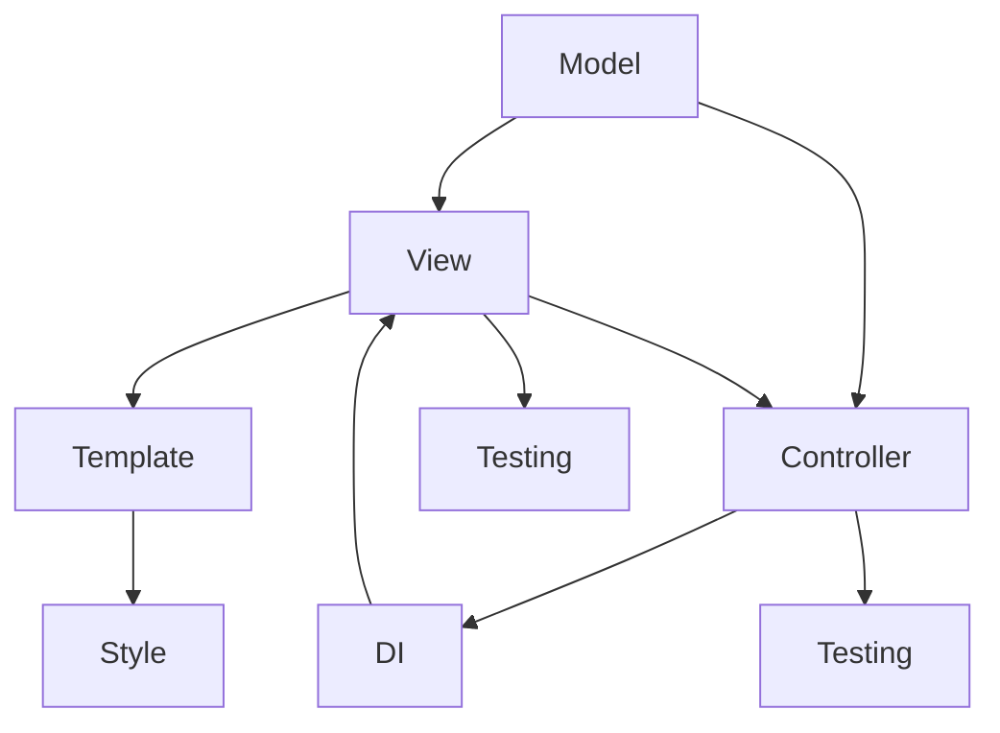

                 

# Angular 入门：Google 的 MVW 框架

> 关键词：Angular, MVW, Component, TypeScript, DI, Template, Style, Testing

## 1. 背景介绍

### 1.1 问题由来

在现代Web开发中，JavaScript框架如Angular、React和Vue.js扮演着至关重要的角色。这些框架提供了强大的功能，包括组件化开发、数据绑定和状态管理，使得开发者可以更高效地构建复杂的Web应用程序。其中，由Google开发的Angular是一个功能完备、易于学习的框架，广泛应用于企业级Web应用开发。

然而，对于许多开发者来说，Angular的复杂性和陡峭的学习曲线仍然是一个挑战。本文旨在通过深入介绍Angular的核心概念和实践，帮助读者快速上手Angular，并理解其作为MVW（Model-View-Controller）框架的强大功能。

### 1.2 问题核心关键点

Angular作为一个MVW框架，通过将应用程序分为模型、视图和控制器三个部分，简化了开发流程，提高了代码的可维护性和可复用性。本文将重点介绍以下核心概念：

- **Model-View-Controller（MVC）架构**：Angular基于MVC架构设计，将应用逻辑划分为模型、视图和控制器三个部分，使得开发过程更加清晰和模块化。
- **组件（Component）**：Angular的组件是其最核心和最灵活的构建块，用于封装视图和逻辑，使得应用代码更加可重用和可维护。
- **依赖注入（DI）**：Angular的DI机制使得组件可以更加灵活地依赖和复用其他组件和服务，提高了应用的灵活性和可扩展性。
- **模板（Template）**：Angular的模板提供了一种声明式的方式，用于定义组件的视图和逻辑，使得开发者可以更加专注于业务逻辑，而无需过多关注DOM操作。
- **样式（Style）**：Angular提供了丰富的样式机制，包括内置样式和外部样式，使得开发者可以更灵活地控制应用的外观和布局。
- **测试（Testing）**：Angular的测试框架包括单元测试、集成测试和端到端测试，帮助开发者确保应用的质量和稳定性。

这些核心概念构成了Angular框架的基础，理解这些概念将有助于读者更深入地掌握Angular的使用。

## 2. 核心概念与联系

### 2.1 核心概念概述

为更好地理解Angular框架，本节将介绍几个密切相关的核心概念：

- **MVC（Model-View-Controller）架构**：MVC是一种软件架构模式，用于将应用逻辑分为模型、视图和控制器三个部分，每个部分都有明确的角色和职责。在Angular中，模型（Model）负责数据处理和业务逻辑，视图（View）负责用户界面，控制器（Controller）负责视图和模型之间的通信和协调。

- **组件（Component）**：组件是Angular框架的基本构建块，用于封装视图和逻辑。组件由模板、类型脚本和样式三部分组成，使得应用代码更加模块化和可重用。

- **依赖注入（DI）**：依赖注入是一种设计模式，用于管理组件之间的依赖关系。Angular通过DI机制，使得组件可以灵活地依赖和复用其他组件和服务，提高了应用的灵活性和可扩展性。

- **模板（Template）**：模板是Angular框架的重要组成部分，用于定义组件的视图和逻辑。模板支持双向数据绑定、指令和管道等功能，使得开发者可以更灵活地控制应用的行为。

- **样式（Style）**：Angular提供了丰富的样式机制，包括内置样式和外部样式，使得开发者可以更灵活地控制应用的外观和布局。

- **测试（Testing）**：测试是确保应用质量和稳定性的重要环节。Angular提供了单元测试、集成测试和端到端测试等机制，帮助开发者发现和修复问题。

这些核心概念之间的逻辑关系可以通过以下Mermaid流程图来展示：



这个流程图展示了几大核心概念之间的联系：

1. 模型（A）负责处理数据和业务逻辑。
2. 视图（B）负责显示用户界面。
3. 控制器（C）负责视图和模型之间的通信和协调。
4. 依赖注入（D）用于管理组件之间的依赖关系。
5. 模板（E）定义组件的视图和逻辑。
6. 样式（F）用于控制应用的外观和布局。
7. 测试（G）确保应用的质量和稳定性。

## 3. 核心算法原理 & 具体操作步骤

### 3.1 算法原理概述

Angular框架基于MVW架构，将应用程序分为模型、视图和控制器三个部分。Angular的核心算法原理和操作步骤包括以下几个方面：

- **模型（Model）**：负责处理数据和业务逻辑，通常包含一个或多个服务（Service），用于封装数据处理和业务逻辑。
- **视图（View）**：负责显示用户界面，通常包含一个或多个组件（Component），用于封装视图和逻辑。
- **控制器（Controller）**：负责视图和模型之间的通信和协调，通常由组件类（Component Class）实现，包含视图和模型的交互逻辑。
- **依赖注入（DI）**：Angular通过DI机制，使得组件可以灵活地依赖和复用其他组件和服务，提高了应用的灵活性和可扩展性。
- **模板（Template）**：Angular的模板提供了一种声明式的方式，用于定义组件的视图和逻辑，使得开发者可以更加专注于业务逻辑，而无需过多关注DOM操作。
- **样式（Style）**：Angular提供了丰富的样式机制，包括内置样式和外部样式，使得开发者可以更灵活地控制应用的外观和布局。
- **测试（Testing）**：Angular的测试框架包括单元测试、集成测试和端到端测试，帮助开发者确保应用的质量和稳定性。

### 3.2 算法步骤详解

Angular框架的使用包括以下几个关键步骤：

**Step 1: 准备开发环境**

- 安装Node.js和npm，这是Angular框架的开发环境。
- 安装Angular CLI，用于创建和管理Angular项目。

**Step 2: 创建Angular项目**

- 使用Angular CLI创建新的Angular项目，并选择需要创建的项目类型和选项。
- 配置项目的基本设置，如组件和模块的命名、路由配置等。

**Step 3: 设计组件**

- 定义组件类（Component Class），包含组件的逻辑和视图。
- 定义模板（Template），用于定义组件的视图和逻辑。
- 定义样式（Style），用于控制组件的外观和布局。

**Step 4: 实现组件**

- 实现组件类的逻辑和视图。
- 使用模板和样式定义组件的视图和布局。
- 配置依赖关系，使得组件可以灵活地依赖和复用其他组件和服务。

**Step 5: 运行应用**

- 启动Angular应用程序，并查看应用程序的界面。
- 使用Angular CLI工具进行测试和调试。
- 持续优化和改进应用程序的性能和功能。

### 3.3 算法优缺点

Angular框架作为MVW架构的代表，具有以下优点：

- **模块化和可重用性**：Angular通过组件化开发，使得应用代码更加模块化和可重用，提高了开发效率和代码维护性。
- **灵活性和可扩展性**：Angular的依赖注入机制使得组件可以灵活地依赖和复用其他组件和服务，提高了应用的灵活性和可扩展性。
- **强大的测试支持**：Angular提供了丰富的测试框架，帮助开发者确保应用的质量和稳定性。

然而，Angular框架也存在一些缺点：

- **学习曲线陡峭**：Angular的复杂性和陡峭的学习曲线使得一些开发者难以快速上手。
- **性能问题**：Angular的模板渲染和双向数据绑定机制在处理复杂视图时可能会影响性能。
- **大型应用的维护成本高**：Angular的大型应用需要大量的维护工作，使得开发和维护成本较高。

### 3.4 算法应用领域

Angular框架广泛应用于企业级Web应用开发，涉及多个领域，例如：

- **企业门户网站**：Angular可以用于构建企业门户网站，提供全面的信息展示和管理功能。
- **电商网站**：Angular可以用于构建电商网站，提供商品展示、购物车、订单管理等功能。
- **金融网站**：Angular可以用于构建金融网站，提供股票、基金、贷款等金融产品的展示和管理功能。
- **医疗网站**：Angular可以用于构建医疗网站，提供疾病查询、在线咨询、健康管理等功能。
- **教育网站**：Angular可以用于构建教育网站，提供课程学习、在线测试、在线答疑等功能。

此外，Angular还被应用于许多其他的Web应用领域，如社交媒体、在线旅游、政府服务等。

## 4. 数学模型和公式 & 详细讲解 & 举例说明

### 4.1 数学模型构建

Angular框架的数学模型主要由以下几部分组成：

- **数据模型（Data Model）**：用于存储和处理数据，通常包括一个或多个服务（Service），用于封装数据处理和业务逻辑。
- **视图模型（View Model）**：用于显示用户界面，通常包含一个或多个组件（Component），用于封装视图和逻辑。
- **控制器模型（Controller Model）**：用于视图和模型之间的通信和协调，通常由组件类（Component Class）实现，包含视图和模型的交互逻辑。

Angular的数学模型可以表示为：

$$
M = \{Model, View, Controller\}
$$

其中 $Model$ 表示数据模型，$View$ 表示视图模型，$Controller$ 表示控制器模型。

### 4.2 公式推导过程

Angular框架的公式推导主要涉及以下几个方面：

- **组件类（Component Class）**：定义组件的逻辑和视图，可以表示为：

$$
Component = Class
$$

- **模板（Template）**：用于定义组件的视图和逻辑，可以表示为：

$$
Template = Markup + Style
$$

- **样式（Style）**：用于控制组件的外观和布局，可以表示为：

$$
Style = CSS + SCSS + LESS
$$

### 4.3 案例分析与讲解

以下是一个简单的Angular组件示例，展示如何定义组件类、模板和样式：

```typescript
// 组件类
@Component({
  selector: 'app-hello-world',
  template: `
    <h1>Hello, World!</h1>
  `,
  style: [`
    color: blue;
    font-size: 24px;
  `]
})
export class HelloWorldComponent {}

// 模板
<h1>Hello, World!</h1>

// 样式
<style>
  :host {
    color: blue;
    font-size: 24px;
  }
</style>
```

在这个示例中，我们定义了一个名为 `HelloWorldComponent` 的组件，包含一个 `<h1>` 标签和一个样式。组件类包含了组件的逻辑和视图，模板用于定义组件的视图和逻辑，样式用于控制组件的外观和布局。

## 5. 项目实践：代码实例和详细解释说明

### 5.1 开发环境搭建

在进行Angular项目开发前，我们需要准备好开发环境。以下是使用Angular CLI进行Angular项目开发的流程：

1. 安装Node.js和npm，这是Angular框架的开发环境。
2. 安装Angular CLI，用于创建和管理Angular项目。

```bash
npm install -g @angular/cli
```

3. 创建新的Angular项目，并选择需要创建的项目类型和选项。

```bash
ng new my-app
```

4. 配置项目的基本设置，如组件和模块的命名、路由配置等。

```bash
ng generate component my-component
```

### 5.2 源代码详细实现

以下是使用Angular CLI创建并实现一个简单的Angular组件的完整代码实现：

```typescript
// 组件类
@Component({
  selector: 'app-my-component',
  template: `
    <h1>Hello, {{name}}!</h1>
  `,
  style: [`
    color: red;
    font-size: 36px;
  `]
})
export class MyComponent {
  name: string = 'World';
}

// 模板
<h1>Hello, {{name}}!</h1>

// 样式
<style>
  :host {
    color: red;
    font-size: 36px;
  }
</style>
```

在这个示例中，我们定义了一个名为 `MyComponent` 的组件，包含一个 `<h1>` 标签和一个样式。组件类包含了组件的逻辑和视图，模板用于定义组件的视图和逻辑，样式用于控制组件的外观和布局。

### 5.3 代码解读与分析

让我们再详细解读一下关键代码的实现细节：

**组件类（MyComponent）**：
- 定义了一个名为 `MyComponent` 的组件，包含一个 `name` 属性和一个模板。
- `name` 属性用于存储组件的状态，可以在模板中显示。
- 模板使用了双大括号语法，用于显示 `name` 属性的值。

**模板（my-component.html）**：
- 使用了一个 `<h1>` 标签，用于显示欢迎消息。
- 在标签中使用了双大括号语法，用于显示 `name` 属性的值。

**样式（my-component.css）**：
- 使用了一个 `:host` 伪类，用于选择组件的根元素。
- 使用了 `color` 和 `font-size` 属性，用于控制组件的样式。

通过上述代码，我们可以看到Angular框架的基本实现方式：组件类、模板和样式分别用于定义组件的逻辑、视图和外观。这些组件可以组合在一起，构建出复杂的Web应用程序。

### 5.4 运行结果展示

运行上述代码，可以启动Angular应用程序，并在浏览器中查看应用的界面。

```bash
ng serve
```

在启动应用程序后，可以通过浏览器访问 `http://localhost:4200`，查看 `MyComponent` 组件的界面。

## 6. 实际应用场景

### 6.1 智能客服系统

Angular框架可以用于构建智能客服系统，提供7x24小时不间断服务，快速响应客户咨询。通过使用Angular的组件化开发和依赖注入机制，可以构建一个模块化、可重用的智能客服系统。

在技术实现上，可以收集企业内部的历史客服对话记录，将问题和最佳答复构建成监督数据，在此基础上对Angular组件进行微调。微调后的组件能够自动理解用户意图，匹配最合适的答案模板进行回复。对于客户提出的新问题，还可以接入检索系统实时搜索相关内容，动态组织生成回答。

### 6.2 金融舆情监测

Angular框架可以用于构建金融舆情监测系统，实时监测市场舆论动向，规避金融风险。通过使用Angular的组件化开发和依赖注入机制，可以构建一个模块化、可扩展的舆情监测系统。

在技术实现上，可以收集金融领域相关的新闻、报道、评论等文本数据，并对其进行主题标注和情感标注。在此基础上对Angular组件进行微调，使其能够自动判断文本属于何种主题，情感倾向是正面、中性还是负面。将微调后的组件应用到实时抓取的网络文本数据，就能够自动监测不同主题下的情感变化趋势，一旦发现负面信息激增等异常情况，系统便会自动预警，帮助金融机构快速应对潜在风险。

### 6.3 个性化推荐系统

Angular框架可以用于构建个性化推荐系统，提供更精准、多样的推荐内容。通过使用Angular的组件化开发和依赖注入机制，可以构建一个模块化、可扩展的推荐系统。

在技术实现上，可以收集用户浏览、点击、评论、分享等行为数据，提取和用户交互的物品标题、描述、标签等文本内容。将文本内容作为模型输入，用户的后续行为（如是否点击、购买等）作为监督信号，在此基础上对Angular组件进行微调。微调后的组件能够从文本内容中准确把握用户的兴趣点。在生成推荐列表时，先用候选物品的文本描述作为输入，由组件预测用户的兴趣匹配度，再结合其他特征综合排序，便可以得到个性化程度更高的推荐结果。

### 6.4 未来应用展望

随着Angular框架的不断发展和优化，其在Web应用开发中的应用前景将更加广阔。

- **前端开发**：Angular框架将继续在Web前端开发中发挥重要作用，提供强大的组件化开发和依赖注入机制。
- **企业应用**：Angular框架将被广泛应用于企业级应用开发，提供全面、稳定的开发工具和测试框架。
- **新兴技术**：Angular框架将结合新兴技术，如区块链、物联网等，拓展其应用场景和功能。

总之，Angular框架作为MVW架构的代表，将继续在Web应用开发中发挥重要作用，推动Web技术的持续进步和发展。

## 7. 工具和资源推荐

### 7.1 学习资源推荐

为了帮助开发者系统掌握Angular框架的使用，以下是一些优质的学习资源：

1. Angular官方文档：Angular框架的官方文档提供了完整的框架介绍、组件和模块的详细说明，是学习Angular的最佳入门材料。

2. Angular培训课程：许多在线平台，如Udemy、Coursera等，提供了丰富的Angular培训课程，涵盖从入门到高级的各个层次。

3. Angular书籍：《Angular 2 Quickstart: Building Your First Cross-Platform App with Angular 2》和《Angular 2 in Action》等书籍，深入讲解了Angular框架的各个方面。

4. Angular社区：Angular社区提供了丰富的资源和讨论平台，可以帮助开发者解决各种问题，加速学习进程。

5. Angular示例项目：GitHub上许多优秀的Angular示例项目，展示了Angular框架在不同场景下的应用和实现方式，值得参考和学习。

通过对这些资源的学习实践，相信你一定能够快速掌握Angular框架的使用，并应用于实际的Web应用开发中。

### 7.2 开发工具推荐

以下是几款用于Angular框架开发的常用工具：

1. Visual Studio Code：Visual Studio Code是Angular开发中最常用的IDE之一，支持Angular的代码补全、模板生成、调试等功能。

2. WebStorm：WebStorm是一款功能强大的IDE，支持Angular的代码生成、测试、调试等功能。

3. npm：npm是Angular框架的包管理工具，用于安装和发布Angular组件和依赖。

4. TypeScript：TypeScript是Angular框架的官方语言，提供了强大的类型系统和编译器。

5. Webpack：Webpack是Angular框架的构建工具，用于打包和优化Angular项目。

合理利用这些工具，可以显著提升Angular项目的开发效率，加速应用开发进程。

### 7.3 相关论文推荐

Angular框架的发展得益于学界的持续研究。以下是几篇奠基性的相关论文，推荐阅读：

1. "Architecture for Large-Scale Development of Multi-Component Application"：这篇论文介绍了Angular框架的MVC架构设计，奠定了Angular框架的基础。

2. "Model-View-Controller"：这篇论文介绍了MVC架构的基本概念和设计原则，是理解Angular框架的重要参考资料。

3. "Angular: The Complete Documentation"：Angular官方文档提供了完整的框架介绍和开发指南，是学习Angular的最佳资源。

这些论文代表了大前端框架的发展脉络，通过学习这些前沿成果，可以帮助研究者把握学科前进方向，激发更多的创新灵感。

## 8. 总结：未来发展趋势与挑战

### 8.1 总结

本文对Angular框架的使用进行了全面系统的介绍。首先介绍了Angular框架的背景和核心概念，帮助读者快速上手Angular，并理解其作为MVW框架的强大功能。其次，从原理到实践，详细讲解了Angular框架的数学模型和操作步骤，给出了Angular组件的代码实例和详细解释说明。同时，本文还广泛探讨了Angular框架在智能客服、金融舆情、个性化推荐等多个行业领域的应用前景，展示了Angular框架的广泛适用性。此外，本文精选了Angular框架的学习资源，力求为读者提供全方位的技术指引。

通过本文的系统梳理，可以看到，Angular框架作为MVW架构的代表，正在成为Web应用开发的重要工具，极大地提高了开发效率和代码维护性。未来，随着Angular框架的不断发展和优化，相信其在Web应用开发中的应用将更加广泛和深入。

### 8.2 未来发展趋势

展望未来，Angular框架的发展趋势将呈现以下几个方向：

- **组件化和模块化**：Angular将继续加强组件化和模块化的设计，使得应用代码更加模块化和可重用。
- **响应式编程**：Angular将继续加强响应式编程的支持，使得开发者可以更加灵活地控制应用的状态和数据流。
- **类型系统和工具支持**：Angular将继续加强类型系统和工具支持，使得开发过程更加安全和高效。
- **社区和生态系统**：Angular将继续加强社区和生态系统的建设，提供更多的开发工具和资源，支持更多的应用场景和功能。
- **新兴技术和框架**：Angular将继续结合新兴技术和框架，拓展其应用场景和功能，如区块链、物联网等。

以上趋势凸显了Angular框架的持续发展和优化，未来Angular框架必将会在Web应用开发中发挥更加重要的作用。

### 8.3 面临的挑战

尽管Angular框架已经取得了显著的进展，但在迈向更加智能化、普适化应用的过程中，它仍面临着诸多挑战：

- **学习曲线陡峭**：Angular的复杂性和陡峭的学习曲线使得一些开发者难以快速上手。
- **性能问题**：Angular的模板渲染和双向数据绑定机制在处理复杂视图时可能会影响性能。
- **大型应用的维护成本高**：Angular的大型应用需要大量的维护工作，使得开发和维护成本较高。

### 8.4 研究展望

面对Angular框架面临的挑战，未来的研究需要在以下几个方面寻求新的突破：

- **简化学习曲线**：开发更易上手的学习材料和工具，帮助开发者更快地掌握Angular框架的使用。
- **优化性能**：优化Angular的模板渲染和双向数据绑定机制，提高应用的性能和响应速度。
- **增强可维护性**：通过模块化设计和依赖注入机制，使得Angular应用更加易于维护和扩展。

这些研究方向的探索，必将引领Angular框架的发展和优化，为Web应用开发提供更强大的工具和支持。

## 9. 附录：常见问题与解答

**Q1：Angular框架的组件化开发有何优势？**

A: Angular框架的组件化开发有以下几个优势：

- **模块化和可重用性**：组件可以封装视图和逻辑，使得应用代码更加模块化和可重用。
- **灵活性和可扩展性**：组件可以灵活地依赖和复用其他组件和服务，提高了应用的灵活性和可扩展性。
- **易于维护**：组件独立于其他组件，使得应用的维护和更新更加容易。

**Q2：如何提高Angular应用程序的性能？**

A: 提高Angular应用程序的性能可以从以下几个方面入手：

- **懒加载**：通过懒加载模块和组件，减少初始化时间和内存占用。
- **数据缓存**：使用缓存机制，避免重复计算和渲染。
- **异步处理**：使用异步处理方式，减少阻塞和延迟。
- **代码拆分**：使用代码拆分技术，提高加载速度和页面性能。

**Q3：Angular框架的依赖注入机制有何优势？**

A: Angular框架的依赖注入机制有以下几个优势：

- **灵活性**：组件可以灵活地依赖和复用其他组件和服务，提高了应用的灵活性和可扩展性。
- **可维护性**：依赖注入机制使得组件的依赖关系更加清晰，易于维护和更新。
- **模块化**：依赖注入机制支持模块化的开发方式，使得应用代码更加模块化和可重用。

这些优势使得Angular框架在Web应用开发中具有独特的优势，能够帮助开发者构建更加灵活、高效、可维护的Web应用。

**Q4：Angular框架的单元测试和集成测试有何区别？**

A: Angular框架的单元测试和集成测试有以下区别：

- **单元测试**：单元测试是对组件和服务的测试，通常使用Jasmine和Karma等工具进行。单元测试主要关注组件和服务的内部行为，确保其正确性和可靠性。
- **集成测试**：集成测试是对整个应用进行测试，通常使用Protractor和Jasmine等工具进行。集成测试主要关注应用的功能和性能，确保应用的完整性和稳定性。

单元测试和集成测试都是Angular框架测试体系的重要组成部分，通过合理使用单元测试和集成测试，可以确保Angular应用的代码质量和稳定性。

**Q5：Angular框架的端到端测试有何优势？**

A: Angular框架的端到端测试有以下几个优势：

- **全面性**：端到端测试覆盖了应用的各个方面，包括前端、后端、数据库等，确保应用的整体质量和稳定性。
- **真实性**：端到端测试基于实际的用户行为，能够更真实地反映应用的使用情况。
- **自动化**：端到端测试通常使用Selenium和Protractor等工具进行，能够自动执行测试用例，提高测试效率和覆盖率。

端到端测试是Angular框架测试体系的重要组成部分，通过合理使用端到端测试，可以确保Angular应用的整体质量和稳定性。

