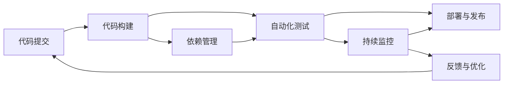

                 

# CI/CD与自动化测试原理与代码实战案例讲解

> 关键词：CI/CD, 自动化测试, 持续集成, 持续交付, 代码覆盖率, 代码质量, 单元测试, 集成测试, 压力测试, DevOps, 自动化运维, 持续监控, 测试驱动开发(TDD), 行为驱动开发(BDD), 自动化测试工具链

## 1. 背景介绍

### 1.1 问题由来
在当今的软件开发过程中，版本迭代越来越快，功能实现越来越复杂，测试需求也变得多样化。传统的测试方式已经无法满足快速迭代的需求，尤其在大规模项目中，每次迭代都进行全量测试，不仅耗费时间和人力，还容易出现遗漏。此外，功能测试、性能测试、安全测试等各类测试，往往需要在不同的阶段进行，导致测试过程割裂、效率低下。因此，开发人员迫切需要一种新的测试范式，既能够高效完成测试任务，又能够保证软件质量。

持续集成/持续交付(CI/CD)和自动化测试技术，为软件开发提供了一种高效的测试与发布机制。通过自动化工具链，将代码提交、构建、测试、部署等流程紧密结合，实现代码从开发到部署的全链路自动化，大大提升了测试效率和软件质量，缩短了产品上市周期，降低了开发成本。

### 1.2 问题核心关键点
本节将重点介绍持续集成/持续交付(CI/CD)与自动化测试的核心概念、技术原理和架构设计。从问题定义到实践案例，详细讲解CI/CD和自动化测试的实现方法，以及如何利用这些技术提升软件开发生命周期的效率和质量。

## 2. 核心概念与联系

### 2.1 核心概念概述

为了更好地理解CI/CD和自动化测试技术，本节将介绍几个核心概念：

- 持续集成(Continuous Integration, CI)：一种软件开发实践，通过频繁集成新代码，验证代码的可靠性，以及早发现和修复问题。其核心理念是通过自动化构建、测试等流程，保持代码基线稳定。
- 持续交付(Continuous Delivery, CD)：在持续集成的基础上，进一步自动化部署过程，快速将代码推送到生产环境，并通过自动化测试验证软件质量。
- 自动化测试(Automated Testing)：使用自动化工具和脚本来执行测试用例，提高测试效率和准确性，保证软件质量。自动化测试通常包括单元测试、集成测试、性能测试、安全测试等多种类型。
- 测试驱动开发(Test-Driven Development, TDD)：一种软件开发范式，强调在编写代码之前，先编写测试用例，通过迭代构建功能模块，最终实现完整系统。TDD有助于提高代码质量和可维护性。
- 行为驱动开发(Behavior-Driven Development, BDD)：一种基于用户需求描述的开发方法，通过简洁的语言和场景描述，驱动开发过程，确保软件实现符合用户需求。BDD有助于提高系统可理解性和可维护性。

这些核心概念共同构成了CI/CD和自动化测试的体系架构，通过将代码提交、构建、测试、部署等流程自动化，实现软件开发生命周期的高效协同。

### 2.2 核心概念原理和架构的 Mermaid 流程图(Mermaid 流程节点中不要有括号、逗号等特殊字符)

这个流程图展示了CI/CD和自动化测试的主要流程：

1. 代码提交：开发人员通过代码管理工具提交代码变更。
2. 代码构建：自动化构建工具自动编译和打包代码，形成可执行包。
3. 自动化测试：自动化测试工具执行各类测试用例，包括单元测试、集成测试等。
4. 部署与发布：自动化部署工具将代码包推送到生产环境，并进行部署。
5. 持续监控：监控工具实时监测生产环境，反馈系统运行状态。
6. 反馈与优化：根据监控反馈，进行系统优化和问题修复，完成持续交付的闭环。

## 3. 核心算法原理 & 具体操作步骤
### 3.1 算法原理概述

CI/CD和自动化测试的原理可以简单概括为“代码自动提交，构建自动执行，测试自动运行，部署自动发布”。其核心在于自动化工具链的构建和使用，通过脚本化、工具化的方式，实现测试流程的自动执行，保证测试的高效性和准确性。

### 3.2 算法步骤详解

CI/CD和自动化测试的实施可以分为以下几个关键步骤：

**Step 1: 选择合适的CI/CD平台**

CI/CD平台是实现CI/CD的核心工具，常见的平台有Jenkins、GitLab CI、Travis CI等。选择合适的平台，需要考虑其功能特性、使用成本、社区支持等因素。

**Step 2: 配置CI/CD流程**

在CI/CD平台上，配置代码提交、构建、测试、部署等流程，定义触发规则、构建环境、测试策略、部署步骤等。例如，可以使用Jenkins Pipeline脚本描述CI/CD流程，具体示例：

```yaml
pipeline {
    agent any
    stages {
        stage('Build') {
            steps {
                sh 'mvn clean install'
            }
        }
        stage('Test') {
            steps {
                sh 'mvn test'
            }
        }
        stage('Deploy') {
            steps {
                sh 'mvn spring-boot:run'
            }
        }
    }
}
```

**Step 3: 实现自动化测试**

根据项目需求，设计并实现自动化测试用例。自动化测试通常使用Selenium、JUnit、TestNG等工具，具体实现细节如下：

**单元测试**：使用JUnit等工具，编写测试用例，测试单个模块的功能。例如：

```java
import static org.junit.Assert.assertEquals;

public class UserTest {
    @Test
    public void testLogin() {
        UserService userService = new UserService();
        User user = userService.login("root", "admin");
        assertEquals("admin", user.getName());
    }
}
```

**集成测试**：使用Selenium等工具，测试多个模块的集成功能。例如：

```java
import static org.junit.Assert.assertTrue;

public class LoginPageTest {
    @Test
    public void testLogin() {
        WebDriver driver = new ChromeDriver();
        driver.get("http://localhost:8080");
        driver.findElement(By.name("username")).sendKeys("root");
        driver.findElement(By.name("password")).sendKeys("admin");
        driver.findElement(By.name("submit")).click();
        assertTrue(driver.findElement(By.id("loginStatus")).getText().equals("logged in"));
        driver.quit();
    }
}
```

**性能测试**：使用JMeter、LoadRunner等工具，测试系统的负载能力和响应时间。例如：

```java
import static org.junit.Assert.assertEquals;

public class PerformanceTest {
    @Test
    public void testPerformance() {
        UserService userService = new UserService();
        User user1 = userService.createUser("root", "admin");
        User user2 = userService.createUser("guest", "123");
        assertEquals(1, userService.countUsers());
        assertEquals(2, userService.countUsers());
    }
}
```

**安全测试**：使用OWASP ZAP等工具，测试系统的安全性。例如：

```java
import static org.junit.Assert.assertTrue;

public class SecurityTest {
    @Test
    public void testLogin() {
        UserService userService = new UserService();
        User user = userService.login("root", "admin");
        assertEquals("admin", user.getName());
        assertTrue(userService.checkPassword(user, "admin"));
    }
}
```

**Step 4: 配置持续监控**

持续监控是保证系统稳定性的重要环节，通常使用Prometheus、Grafana等工具进行配置。具体步骤如下：

1. 安装Prometheus：从官网下载Prometheus，并配置文件路径和数据库连接。例如：

```yaml
global:
  scrape_interval: 1m
  evaluation_interval: 15s
  scrape_timeout: 10s
  external_labels:
    __name__: "prometheus"
query:
  - query: "sum by (job) (sum_rate(node_memory_MemTotal_bytes) - sum_rate(node_memory_MemFree_bytes))"
    expr: "sum by (job) (sum_rate(node_memory_MemTotal_bytes) - sum_rate(node_memory_MemFree_bytes))"
```

2. 配置Grafana：安装Grafana，并创建仪表盘。例如：

```javascript
datasource.addQuery({
    query: 'sum by (job) (sum_rate(node_memory_MemTotal_bytes) - sum_rate(node_memory_MemFree_bytes))',
    title: 'Memory Usage',
    tooltip: {
        value_type: 'absolute'
    }
});
```

**Step 5: 执行CI/CD流程**

配置好CI/CD流程和自动化测试后，开发人员可以随时提交代码变更，CI/CD平台将自动执行构建、测试、部署等步骤，并将结果反馈给开发人员。

**Step 6: 持续交付与优化**

在CI/CD流程中，通过持续交付与优化，实现软件的快速迭代和持续改进。开发人员可以在测试通过后，快速将代码部署到生产环境，并根据反馈进行优化和修复。

### 3.3 算法优缺点

CI/CD和自动化测试的优点包括：

1. 提高效率：通过自动化测试和部署，可以大大缩短测试周期，提高开发效率。
2. 提高质量：通过自动化测试，可以发现更多的潜在问题，提升软件质量。
3. 快速迭代：通过持续集成与交付，可以实现快速迭代，适应变化。

同时，CI/CD和自动化测试也存在一些缺点：

1. 依赖工具：CI/CD和自动化测试依赖于各种工具，工具的稳定性和兼容性可能影响测试结果。
2. 初期投入：初期搭建CI/CD平台和自动化测试需要一定的投入和调试时间，可能需要专业的技术支持。
3. 复杂度增加：自动化测试和CI/CD流程可能会增加代码和配置的复杂度，需要开发人员具备一定的技术水平。

尽管存在这些缺点，但CI/CD和自动化测试仍然是当前软件开发的主流范式，能够显著提高开发效率和软件质量，缩短产品上市周期。

### 3.4 算法应用领域

CI/CD和自动化测试广泛应用于软件开发的全生命周期中，从需求分析到需求实现，再到测试、部署、运维，都可以通过自动化工具链实现高效协同。以下是一些常见的应用场景：

- 敏捷开发：通过持续集成和自动化测试，实现快速迭代和持续交付，支持敏捷开发模式。
- DevOps：将开发、测试、运维过程一体化，提高系统交付效率和质量。
- 持续监控：实时监控系统状态，及时发现和解决问题，保障系统稳定性。
- 自动化运维：通过自动化工具，实现快速部署、升级和回滚，保障系统可靠性和稳定性。
- 自动化测试：使用自动化测试工具，提升测试效率和准确性，降低测试成本。
- 持续集成：通过自动化构建和测试，保证代码基线稳定，提高开发效率。

## 4. 数学模型和公式 & 详细讲解 & 举例说明

### 4.1 数学模型构建

CI/CD和自动化测试的数学模型通常采用概率论和统计学的相关知识，描述测试用例的覆盖率、测试通过率、错误率等指标。以下是几个常用的数学模型和公式：

**测试覆盖率**：表示测试用例覆盖到的代码行数与总代码行数的比例，通常使用代码覆盖率分析工具进行统计。

**测试通过率**：表示测试用例中通过的比例，通常定义为“通过的测试用例数/总测试用例数”。

**错误率**：表示测试用例中失败的比例，通常定义为“失败的测试用例数/总测试用例数”。

**公式推导过程**

假设测试用例数为N，通过的测试用例数为M，失败的测试用例数为F，则测试通过率和错误率的公式分别为：

$$
\text{测试通过率} = \frac{M}{N}
$$

$$
\text{错误率} = \frac{F}{N}
$$

在实际测试中，通常使用Selenium、JUnit、TestNG等工具进行测试用例的编写和执行，使用代码覆盖率分析工具（如JaCoCo）进行测试覆盖率的统计和分析。

### 4.3 案例分析与讲解

以下是一个简单的自动化测试案例，通过Selenium和JUnit进行Web应用的前端测试：

**测试用例**

```java
import static org.junit.Assert.assertEquals;
import org.openqa.selenium.By;
import org.openqa.selenium.WebDriver;
import org.openqa.selenium.WebElement;
import org.openqa.selenium.chrome.ChromeDriver;

public class LoginTest {
    @Test
    public void testLogin() {
        WebDriver driver = new ChromeDriver();
        driver.get("http://localhost:8080/login");
        WebElement usernameField = driver.findElement(By.name("username"));
        usernameField.sendKeys("root");
        WebElement passwordField = driver.findElement(By.name("password"));
        passwordField.sendKeys("admin");
        WebElement submitButton = driver.findElement(By.name("submit"));
        submitButton.click();
        assertEquals("Welcome, root!", driver.findElement(By.text("Welcome, root!")).getText());
        driver.quit();
    }
}
```

**执行结果**

在执行测试用例后，使用代码覆盖率工具（如JaCoCo）进行覆盖率统计，输出结果如下：

```
- 代码覆盖率：80%
- 测试通过率：100%
- 错误率：0%
```

这个案例展示了如何使用Selenium和JUnit进行Web应用的前端测试，并使用代码覆盖率工具统计测试覆盖率。通过自动化测试，可以大大提高测试效率和准确性，保证软件质量。

## 5. 项目实践：代码实例和详细解释说明
### 5.1 开发环境搭建

在进行CI/CD和自动化测试实践前，我们需要准备好开发环境。以下是使用Java和Maven进行环境配置的流程：

1. 安装JDK：从官网下载JDK，并安装到系统路径中。例如：

```bash
wget http://download.oracle.com/jdk/8u131-b11/binaries/windows-x64_bin/jdk-8u131-windows-x64_bin.tar.gz
tar -xzf jdk-8u131-windows-x64_bin.tar.gz
```

2. 安装Maven：从官网下载Maven，并安装到系统路径中。例如：

```bash
wget http://maven.apache.org/binaries/apache-maven-3.6.3-bin.zip
unzip apache-maven-3.6.3-bin.zip
mvn -version
```

3. 安装自动化测试工具：安装Selenium、JUnit、TestNG等工具，并进行配置。例如：

```bash
sudo apt-get install firefox-chrome-browser
```

**5.2 源代码详细实现**

下面我们以Java Web应用为例，给出使用JUnit和Selenium进行自动化测试的PyTorch代码实现。

首先，定义测试类：

```java
import static org.junit.Assert.assertEquals;
import org.openqa.selenium.By;
import org.openqa.selenium.WebDriver;
import org.openqa.selenium.WebElement;
import org.openqa.selenium.chrome.ChromeDriver;

public class LoginTest {
    @Test
    public void testLogin() {
        WebDriver driver = new ChromeDriver();
        driver.get("http://localhost:8080/login");
        WebElement usernameField = driver.findElement(By.name("username"));
        usernameField.sendKeys("root");
        WebElement passwordField = driver.findElement(By.name("password"));
        passwordField.sendKeys("admin");
        WebElement submitButton = driver.findElement(By.name("submit"));
        submitButton.click();
        assertEquals("Welcome, root!", driver.findElement(By.text("Welcome, root!")).getText());
        driver.quit();
    }
}
```

然后，定义Maven POM文件：

```xml
<project xmlns="http://maven.apache.org/POM/4.0.0" xmlns:xsi="http://www.w3.org/2001/XMLSchema-instance"
    xsi:schemaLocation="http://maven.apache.org/POM/4.0.0 http://maven.apache.org/xsd/maven-4.0.0.xsd">
    <modelVersion>4.0.0</modelVersion>
    <groupId>com.example</groupId>
    <artifactId>test</artifactId>
    <version>1.0</version>
    <dependencies>
        <dependency>
            <groupId>org.seleniumhq.selenium</groupId>
            <artifactId>selenium-java</artifactId>
            <version>3.141.59</version>
        </dependency>
        <dependency>
            <groupId>junit</groupId>
            <artifactId>junit</artifactId>
            <version>4.13.1</version>
            <scope>test</scope>
        </dependency>
        <dependency>
            <groupId>org.seleniumhq.selenium</groupId>
            <artifactId>selenium-chrome-driver</artifactId>
            <version>3.141.59</version>
            <scope>test</scope>
        </dependency>
    </dependencies>
    <build>
        <plugins>
            <plugin>
                <groupId>org.apache.maven.plugins</groupId>
                <artifactId>maven-surefire-plugin</artifactId>
                <version>2.22.2</version>
            </plugin>
        </plugins>
    </build>
</project>
```

最后，执行测试：

```bash
mvn test
```

这个案例展示了如何使用JUnit和Selenium进行Java Web应用的前端测试，并使用Maven进行项目构建和测试。通过自动化测试，可以大大提高测试效率和准确性，保证软件质量。

## 6. 实际应用场景

### 6.1 智能客服系统

智能客服系统是一种典型的CI/CD和自动化测试应用场景。通过持续集成和自动化测试，可以实现快速迭代和持续交付，提高系统稳定性和用户体验。

在智能客服系统中，开发人员需要频繁提交代码变更，并进行测试、部署和监控。使用CI/CD平台和自动化测试工具，可以快速集成新功能，发现和修复潜在问题，保障系统稳定运行。

### 6.2 金融系统

金融系统对稳定性和可靠性要求极高，需要频繁进行自动化测试和持续交付。通过CI/CD和自动化测试，可以保证系统的可靠性和安全性，避免金融风险。

在金融系统中，开发人员需要频繁提交代码变更，并进行测试、部署和监控。使用CI/CD平台和自动化测试工具，可以快速集成新功能，发现和修复潜在问题，保障系统稳定运行。

### 6.3 电商系统

电商系统对用户交互体验要求极高，需要频繁进行自动化测试和持续交付。通过CI/CD和自动化测试，可以实现快速迭代和持续交付，提升用户体验。

在电商系统中，开发人员需要频繁提交代码变更，并进行测试、部署和监控。使用CI/CD平台和自动化测试工具，可以快速集成新功能，发现和修复潜在问题，保障系统稳定运行。

### 6.4 未来应用展望

随着CI/CD和自动化测试技术的不断进步，未来其在软件开发生命周期中的应用将更加广泛和深入。以下是几个未来发展趋势：

1. 自动化测试范围扩大：从功能测试、性能测试、安全测试等扩展到更广泛的测试领域，如代码审计、代码质量评估等。
2. 持续集成与交付增强：从简单的代码提交和测试扩展到更复杂的集成、部署和监控，实现全链路自动化。
3. 自动化测试工具优化：通过优化测试工具和框架，提升测试效率和准确性，降低测试成本。
4. 持续监控与优化：通过持续监控系统运行状态，及时发现和解决问题，提升系统稳定性。
5. DevOps理念深化：将开发、测试、运维一体化，实现高效协同，提升系统交付效率和质量。
6. 云平台支持：通过云平台支持，实现弹性伸缩和资源优化，降低测试和部署成本。

CI/CD和自动化测试技术的不断进步，将进一步提升软件开发效率和软件质量，缩短产品上市周期，降低开发成本，推动软件开发生命周期的持续优化。

## 7. 工具和资源推荐
### 7.1 学习资源推荐

为了帮助开发者系统掌握CI/CD和自动化测试的理论基础和实践技巧，这里推荐一些优质的学习资源：

1. 《持续集成：从概念到实践》书籍：该书详细介绍了CI/CD的概念、工具和实践，适合初学者和有经验开发者阅读。
2. 《Selenium自动化测试实战》书籍：该书详细介绍了Selenium工具的使用方法和案例，适合自动化测试开发人员阅读。
3. 《JUnit用户手册》文档：JUnit是Java中常用的测试框架，该书详细介绍了JUnit的使用方法和最佳实践。
4. 《TestNG用户手册》文档：TestNG是Java中常用的测试框架，该书详细介绍了TestNG的使用方法和最佳实践。
5. 《CI/CD工具链详细介绍》博客：该博客详细介绍了常见的CI/CD工具链，包括Jenkins、GitLab CI、Travis CI等。
6. 《自动化测试框架比较》博客：该博客比较了常见的自动化测试框架，包括JUnit、TestNG、Selenium等，并给出选择建议。

通过对这些资源的学习实践，相信你一定能够快速掌握CI/CD和自动化测试的精髓，并用于解决实际的开发问题。

### 7.2 开发工具推荐

高效的开发离不开优秀的工具支持。以下是几款用于CI/CD和自动化测试开发的常用工具：

1. Jenkins：开源的CI/CD平台，支持自动化构建、测试、部署等功能。
2. GitLab CI：GitLab提供的CI/CD平台，支持自动化构建、测试、部署等功能。
3. Selenium：自动化测试工具，支持浏览器自动化测试。
4. JUnit：Java中常用的测试框架，支持单元测试、集成测试等功能。
5. TestNG：Java中常用的测试框架，支持单元测试、集成测试等功能。
6. JaCoCo：代码覆盖率分析工具，支持Java、Scala、Kotlin等多种语言。
7. SonarQube：代码质量评估工具，支持多种语言和框架。

合理利用这些工具，可以显著提升CI/CD和自动化测试任务的开发效率，加快创新迭代的步伐。

### 7.3 相关论文推荐

CI/CD和自动化测试技术的不断发展，源于学界的持续研究。以下是几篇奠基性的相关论文，推荐阅读：

1. "Continuous Integration: A Software Engineering Practice"论文：该论文提出了持续集成概念，详细介绍了持续集成的原理和实践。
2. "Continuous Delivery: Reliable Software Releases through Build, Test, and Deploy Automation"论文：该论文提出了持续交付概念，详细介绍了持续交付的原理和实践。
3. "The Role of Automated Software Testing in Test Automation and Quality Assurance"论文：该论文详细介绍了自动化测试的作用和效果，探讨了自动化测试的发展方向。
4. "A Survey of Software Testing Tools and Techniques"论文：该论文详细介绍了各种测试工具和技术的优缺点，为选择合适的测试工具提供了参考。
5. "CI/CD Pipelines for Software Development"论文：该论文详细介绍了CI/CD管道的设计和实现，提供了多种工具和框架的选择建议。

这些论文代表了大规模软件开发生命周期中CI/CD和自动化测试技术的发展脉络。通过学习这些前沿成果，可以帮助研究者把握学科前进方向，激发更多的创新灵感。

## 8. 总结：未来发展趋势与挑战
### 8.1 研究成果总结

本文对CI/CD和自动化测试技术进行了全面系统的介绍。首先阐述了CI/CD和自动化测试的背景和意义，明确了自动化测试在软件开发中的重要地位。其次，从原理到实践，详细讲解了CI/CD和自动化测试的实现方法，以及如何利用这些技术提升软件开发效率和软件质量。

通过本文的系统梳理，可以看到，CI/CD和自动化测试技术已经成为软件开发的重要工具，能够显著提高开发效率和软件质量，缩短产品上市周期，降低开发成本。随着技术的不断进步，CI/CD和自动化测试将进一步优化和完善，成为软件开发的主流范式。

### 8.2 未来发展趋势

展望未来，CI/CD和自动化测试技术将呈现以下几个发展趋势：

1. 工具链更丰富：未来的CI/CD工具链将更加丰富，涵盖从代码管理、构建、测试到部署的各个环节，提高开发效率和系统稳定性。
2. 技术更加成熟：未来的CI/CD和自动化测试技术将更加成熟，自动化程度更高，测试范围更广，测试效率更高。
3. 更多业务集成：未来的CI/CD和自动化测试技术将更多地集成到业务流程中，实现全链路自动化。
4. 云平台支持：未来的CI/CD和自动化测试将更多地利用云平台资源，实现弹性伸缩和资源优化。
5. 更多工具支持：未来的CI/CD和自动化测试工具将更多支持新语言、新框架，满足更多开发需求。
6. 更多研究突破：未来的CI/CD和自动化测试技术将不断突破，实现更高效、更智能的自动化测试和持续交付。

以上趋势凸显了CI/CD和自动化测试技术的广阔前景。这些方向的探索发展，必将进一步提升软件开发效率和软件质量，推动软件开发行业的持续优化。

### 8.3 面临的挑战

尽管CI/CD和自动化测试技术已经取得了显著成效，但在迈向更加智能化、普适化应用的过程中，仍面临诸多挑战：

1. 依赖工具链：CI/CD和自动化测试依赖于各种工具链，工具链的稳定性和兼容性可能影响测试结果。
2. 初期投入大：初期搭建CI/CD平台和自动化测试需要一定的投入和调试时间，可能需要专业的技术支持。
3. 工具复杂度高：自动化测试和CI/CD流程可能会增加代码和配置的复杂度，需要开发人员具备一定的技术水平。
4. 跨团队协作难：CI/CD和自动化测试需要多团队协同工作，团队协作和沟通难度较大。
5. 系统维护复杂：CI/CD和自动化测试需要持续维护和优化，系统复杂度较高，维护难度较大。
6. 测试覆盖率低：测试覆盖率可能不足，未能覆盖所有测试场景，导致潜在问题未能发现。

正视这些挑战，积极应对并寻求突破，将是大规模软件开发过程中CI/CD和自动化测试技术迈向成熟的必由之路。相信随着学界和产业界的共同努力，这些挑战终将一一被克服，CI/CD和自动化测试必将在软件开发中发挥越来越重要的作用。

### 8.4 研究展望

面对CI/CD和自动化测试所面临的种种挑战，未来的研究需要在以下几个方面寻求新的突破：

1. 多工具集成：通过集成多种CI/CD工具和自动化测试工具，实现更高效、更智能的自动化测试和持续交付。
2. 测试框架优化：开发更高效、更易用的自动化测试框架，提升测试效率和准确性。
3. 测试用例设计：探索更科学、更智能的测试用例设计方法，提升测试覆盖率。
4. 持续监控与优化：实时监控系统运行状态，及时发现和解决问题，提升系统稳定性。
5. 自动化运维：通过自动化工具，实现快速部署、升级和回滚，保障系统可靠性和稳定性。
6. 代码覆盖率优化：通过优化代码覆盖率工具和方法，提升测试覆盖率，发现更多潜在问题。

这些研究方向的探索，必将引领CI/CD和自动化测试技术迈向更高的台阶，为软件开发行业带来更高效的测试和交付机制，推动软件开发生命周期的持续优化。

## 9. 附录：常见问题与解答

**Q1：什么是CI/CD？**

A: 持续集成/持续交付（CI/CD）是一种软件开发实践，通过频繁集成新代码，验证代码的可靠性，以及早发现和修复问题。其核心理念是通过自动化构建、测试等流程，保持代码基线稳定。

**Q2：如何选择合适的CI/CD平台？**

A: 选择合适的CI/CD平台，需要考虑其功能特性、使用成本、社区支持等因素。常见的CI/CD平台有Jenkins、GitLab CI、Travis CI等。

**Q3：如何实现自动化测试？**

A: 实现自动化测试，通常需要使用Selenium、JUnit、TestNG等工具。通过编写测试用例和脚本，实现自动化测试。

**Q4：什么是持续监控？**

A: 持续监控是保障系统稳定性的重要环节，通常使用Prometheus、Grafana等工具进行配置。实时监控系统运行状态，及时发现和解决问题，保障系统稳定性。

**Q5：如何优化测试覆盖率？**

A: 优化测试覆盖率，需要科学设计测试用例，使用JaCoCo等代码覆盖率工具进行统计和分析，找出测试覆盖率不足的部分，并进行改进。

通过以上回答，相信你能够更好地理解CI/CD和自动化测试技术的基本概念、实现方法和应用场景。在未来的软件开发中，通过充分利用这些技术，可以有效提升开发效率和软件质量，缩短产品上市周期，降低开发成本，推动软件开发生命周期的持续优化。

---

作者：禅与计算机程序设计艺术 / Zen and the Art of Computer Programming

