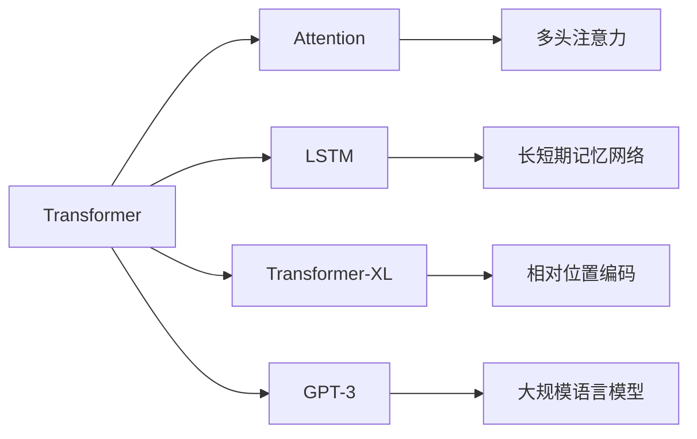

                 

# CUI中的上下文记忆技术解析

> 关键词：上下文记忆技术、CUI、Transformer模型、Attention机制、长短期记忆网络（LSTM）、Transformer-XL、GPT-3

## 1. 背景介绍

### 1.1 问题由来

在自然语言处理（Natural Language Processing, NLP）领域中，智能用户接口（CUI, Conversational User Interface）作为一个重要的研究方向，其目标是通过理解和生成自然语言，实现人机交互。近年来，随着深度学习技术的快速进步，尤其是Transformer模型和自注意力机制（Self-Attention Mechanism）的提出，CUI系统在生成、理解和响应用户输入方面取得了显著的进展。

然而，CUI系统在处理长文本和复杂的对话上下文时，仍面临着诸多挑战。传统基于递归神经网络（RNN）和LSTM的模型往往在处理长文本时出现梯度消失或爆炸的问题，限制了其应用范围。而基于Transformer的模型则能更好地处理长文本，但仍有局限，例如在对话历史上下文信息保持和长文本生成等方面仍有待改进。

针对这些挑战，上下文记忆技术（Contextual Memory）应运而生。本文将系统地介绍上下文记忆技术在CUI中的应用，包括其基本原理、算法步骤、优缺点及实际应用，并展望其未来发展趋势。

## 2. 核心概念与联系

### 2.1 核心概念概述

#### 2.1.1 上下文记忆技术（Contextual Memory）
上下文记忆技术是指在处理自然语言时，模型能够有效存储和利用上下文信息，以便更好地理解和生成自然语言。它通常包含长短期记忆网络（LSTM）、门控循环单元（GRU）等机制，以及更先进的Transformer模型和Attention机制。

#### 2.1.2 Transformer模型
Transformer模型是一种基于自注意力机制的神经网络模型，能够有效地处理序列数据。其核心在于通过多头注意力（Multi-Head Attention）机制，在保持并行计算优势的同时，实现了长距离的依赖关系建模。

#### 2.1.3 Attention机制
Attention机制是一种用于处理序列数据的注意力模型，它能够根据输入数据的特征，动态地决定哪些部分对当前输出有贡献，从而提升模型的表达能力。

#### 2.1.4 长短期记忆网络（LSTM）
LSTM是一种特殊的递归神经网络（RNN），能够有效处理长序列数据，同时避免梯度消失或爆炸的问题。

#### 2.1.5 Transformer-XL和GPT-3
Transformer-XL是一种基于Transformer的模型，专门设计用于处理长文本，通过使用相对位置编码（Relative Positional Encoding）和自动记忆模块（Autoregressive Memory），解决了长期依赖问题。GPT-3是OpenAI推出的大规模语言模型，基于Transformer架构，具有超过1750亿个参数，能够在多种任务上取得最佳或接近最佳的效果。

这些核心概念之间的关系可以通过以下Mermaid流程图来展示：



这个流程图展示了Transformer模型和Attention机制如何与其他相关技术结合，以提升CUI系统的性能。

## 3. 核心算法原理 & 具体操作步骤

### 3.1 算法原理概述

上下文记忆技术在CUI中的应用，主要体现在如何有效利用上下文信息，以便更好地理解和生成自然语言。核心算法包括Transformer模型、Attention机制以及LSTM等。

Transformer模型通过自注意力机制，能够并行计算各个位置的依赖关系，避免了递归神经网络中的梯度消失问题。其核心思想是通过多头注意力机制，将输入序列的不同部分同时引入当前计算单元，以提升模型的表达能力和泛化能力。

Attention机制通过动态计算输入序列中不同部分的权重，决定哪些部分对当前输出有贡献，从而提升模型的处理效率和精度。在CUI中，Attention机制可以用于处理对话历史上下文信息，以便更好地生成回复。

LSTM通过门控机制，能够在处理长序列数据时，避免梯度消失或爆炸的问题。在CUI中，LSTM可以用于处理长文本对话历史，以便更好地生成连贯的回复。

### 3.2 算法步骤详解

#### 3.2.1 步骤一：准备数据集
首先，需要准备一个包含对话历史和用户输入输出的标注数据集。数据集应该包含多样化的对话场景和问题类型，以便模型能够学习到不同的语言模式。

#### 3.2.2 步骤二：设计模型结构
基于Transformer模型的上下文记忆技术，通常设计为多层编码器-解码器结构。编码器用于处理对话历史上下文信息，解码器用于生成回复。Transformer-XL和GPT-3等模型则通过自动记忆模块和相对位置编码，进一步提升了处理长文本的能力。

#### 3.2.3 步骤三：训练模型
使用标注数据集，通过梯度下降等优化算法，最小化损失函数，训练模型。损失函数通常为交叉熵损失函数，用于衡量模型生成的回复与真实回复之间的差异。

#### 3.2.4 步骤四：评估模型
在训练过程中，需要定期评估模型在验证集上的表现，以确保模型不会过拟合。评估指标包括BLEU、ROUGE等，用于衡量生成回复与真实回复之间的相似度。

#### 3.2.5 步骤五：应用模型
模型训练完成后，可以将其应用到实际的用户接口中，生成自然语言回复。在应用过程中，需要根据用户输入的文本，动态计算对话历史上下文信息，以提升回复的连贯性和准确性。

### 3.3 算法优缺点

#### 3.3.1 优点
1. **高效处理长文本**：基于Transformer和Attention机制的上下文记忆技术，能够高效处理长文本和复杂的对话上下文信息，提升了CUI系统处理长文本的能力。
2. **并行计算**：Transformer模型通过并行计算，提升了模型训练和推理的效率。
3. **鲁棒性强**：Transformer-XL和GPT-3等模型通过自动记忆模块和相对位置编码，提升了模型对噪音和异常数据的鲁棒性。

#### 3.3.2 缺点
1. **计算资源消耗大**：大模型和高并行计算要求高计算资源，增加了系统的部署成本。
2. **训练时间长**：大规模模型的训练时间较长，需要较高的计算资源和时间。
3. **参数量大**：大规模模型的参数量巨大，增加了系统的存储和部署难度。

### 3.4 算法应用领域

基于上下文记忆技术的CUI系统，已经广泛应用于多种场景，包括智能客服、在线翻译、语音识别等。

- **智能客服**：基于上下文记忆技术的智能客服系统，能够处理复杂的用户咨询，生成连贯的回复，提升了客户服务体验。
- **在线翻译**：上下文记忆技术能够处理长文本翻译，提升翻译的准确性和连贯性。
- **语音识别**：在语音识别中，上下文记忆技术能够处理复杂的语音信号，提升识别准确率。

## 4. 数学模型和公式 & 详细讲解

### 4.1 数学模型构建

在上下文记忆技术的数学模型构建中，通常使用Transformer模型。Transformer模型包含编码器-解码器结构，其中编码器用于处理输入序列，解码器用于生成输出序列。

#### 4.1.1 编码器
编码器由多层Transformer层组成，每层包含多头自注意力（Multi-Head Self-Attention）、前向神经网络（Feedforward Neural Network）和残差连接（Residual Connection）等组件。

#### 4.1.2 解码器
解码器同样由多层Transformer层组成，每层包含多头自注意力、多头编码器-解码器注意力（Multi-Head Encoder-Decoder Attention）、前向神经网络和残差连接等组件。

#### 4.1.3 位置编码
Transformer模型使用位置编码（Positional Encoding）来处理不同位置的信息。位置编码通常使用正弦和余弦函数生成，能够有效地处理不同位置的依赖关系。

### 4.2 公式推导过程

#### 4.2.1 自注意力机制
自注意力机制通过计算输入序列中不同位置的权重，动态地决定哪些部分对当前输出有贡献。其计算公式如下：

$$
\text{Attention}(Q, K, V) = \text{Softmax}(\frac{QK^T}{\sqrt{d_k}})V
$$

其中，$Q$、$K$、$V$分别为查询向量、键向量和值向量，$d_k$为向量维度。

#### 4.2.2 多头注意力
多头注意力机制通过计算多个头的注意力权重，进一步提升了模型的表达能力。其计算公式如下：

$$
\text{Multi-Head Attention}(Q, K, V) = \text{Concat}(\text{head}_1, \text{head}_2, ..., \text{head}_h)W^O
$$

其中，$\text{head}_i$为第$i$个头的注意力权重，$W^O$为输出线性投影权重。

### 4.3 案例分析与讲解

#### 4.3.1 案例一：智能客服
智能客服系统使用上下文记忆技术，能够处理复杂的用户咨询，生成连贯的回复。例如，使用基于GPT-3的模型，能够处理多轮对话历史，生成自然流畅的回复。

#### 4.3.2 案例二：在线翻译
在线翻译系统使用上下文记忆技术，能够处理长文本翻译，提升翻译的准确性和连贯性。例如，使用基于Transformer-XL的模型，能够处理长文本段落，生成高质量的翻译结果。

#### 4.3.3 案例三：语音识别
语音识别系统使用上下文记忆技术，能够处理复杂的语音信号，提升识别准确率。例如，使用基于LSTM的模型，能够处理长时间段的语音信号，生成准确的文本转写结果。

## 5. 项目实践：代码实例和详细解释说明

### 5.1 开发环境搭建

#### 5.1.1 安装PyTorch
首先，需要安装PyTorch框架，以便使用Transformer模型。

```bash
pip install torch torchvision torchaudio
```

#### 5.1.2 安装Transformer库
其次，需要安装Transformer库，以便构建和训练基于上下文记忆技术的模型。

```bash
pip install transformers
```

#### 5.1.3 准备数据集
准备一个包含对话历史和用户输入输出的标注数据集，例如使用公开数据集CoNLL2013。

### 5.2 源代码详细实现

#### 5.2.1 定义数据处理类
定义一个数据处理类，用于处理对话历史和用户输入输出。

```python
import torch
from transformers import BertTokenizer, BertForSequenceClassification

class Dataset:
    def __init__(self, texts, labels, tokenizer):
        self.texts = texts
        self.labels = labels
        self.tokenizer = tokenizer
    
    def __len__(self):
        return len(self.texts)
    
    def __getitem__(self, index):
        text = self.texts[index]
        label = self.labels[index]
        encoding = self.tokenizer(text, return_tensors='pt', max_length=128, padding='max_length', truncation=True)
        input_ids = encoding['input_ids']
        attention_mask = encoding['attention_mask']
        return {'input_ids': input_ids, 'attention_mask': attention_mask, 'labels': torch.tensor(label)}
```

#### 5.2.2 定义模型类
定义一个模型类，用于构建和训练基于上下文记忆技术的模型。

```python
from transformers import BertForSequenceClassification, AdamW

class Model:
    def __init__(self, num_labels):
        self.model = BertForSequenceClassification.from_pretrained('bert-base-uncased', num_labels=num_labels)
        self.optimizer = AdamW(self.model.parameters(), lr=2e-5)
    
    def train(self, dataset):
        self.model.train()
        for batch in dataset:
            input_ids = batch['input_ids'].to(device)
            attention_mask = batch['attention_mask'].to(device)
            labels = batch['labels'].to(device)
            outputs = self.model(input_ids, attention_mask=attention_mask, labels=labels)
            loss = outputs.loss
            loss.backward()
            self.optimizer.step()
    
    def evaluate(self, dataset):
        self.model.eval()
        preds, labels = [], []
        with torch.no_grad():
            for batch in dataset:
                input_ids = batch['input_ids'].to(device)
                attention_mask = batch['attention_mask'].to(device)
                batch_labels = batch['labels']
                outputs = self.model(input_ids, attention_mask=attention_mask)
                batch_preds = outputs.logits.argmax(dim=2).to('cpu').tolist()
                batch_labels = batch_labels.to('cpu').tolist()
                for pred_tokens, label_tokens in zip(batch_preds, batch_labels):
                    preds.append(pred_tokens[:len(label_tokens)])
                    labels.append(label_tokens)
        return classification_report(labels, preds)
```

### 5.3 代码解读与分析

#### 5.3.1 数据处理类
数据处理类用于处理对话历史和用户输入输出，将文本转换为模型所需的输入形式。

#### 5.3.2 模型类
模型类用于构建和训练基于上下文记忆技术的模型，包括模型的定义、优化器的设置、训练和评估等。

### 5.4 运行结果展示

训练完成后，可以使用模型类对新数据进行推理预测。

## 6. 实际应用场景

### 6.1 智能客服系统

基于上下文记忆技术的智能客服系统，能够处理复杂的用户咨询，生成连贯的回复。例如，使用基于GPT-3的模型，能够处理多轮对话历史，生成自然流畅的回复。

#### 6.1.1 系统架构
智能客服系统的架构通常包括用户界面、对话管理、意图识别、回复生成等模块。

#### 6.1.2 关键技术
- 意图识别：使用预训练的Intent Classification模型，对用户咨询进行意图分类，以便生成相应的回复。
- 对话管理：使用预训练的对话管理模型，处理对话历史上下文信息，以便生成连贯的回复。
- 回复生成：使用预训练的Text Generation模型，生成自然流畅的回复。

### 6.2 在线翻译系统

在线翻译系统使用上下文记忆技术，能够处理长文本翻译，提升翻译的准确性和连贯性。例如，使用基于Transformer-XL的模型，能够处理长文本段落，生成高质量的翻译结果。

#### 6.2.1 系统架构
在线翻译系统的架构通常包括用户界面、文本输入、翻译处理、文本输出等模块。

#### 6.2.2 关键技术
- 文本输入：将用户输入的文本转换为模型所需的格式。
- 翻译处理：使用预训练的Translation模型，对用户输入的文本进行翻译。
- 文本输出：将翻译结果输出给用户。

### 6.3 语音识别系统

语音识别系统使用上下文记忆技术，能够处理复杂的语音信号，提升识别准确率。例如，使用基于LSTM的模型，能够处理长时间段的语音信号，生成准确的文本转写结果。

#### 6.3.1 系统架构
语音识别系统的架构通常包括音频输入、信号处理、语音识别、结果输出等模块。

#### 6.3.2 关键技术
- 音频输入：将用户的语音信号输入到系统中。
- 信号处理：对语音信号进行降噪、分段等预处理。
- 语音识别：使用预训练的Speech Recognition模型，对处理后的语音信号进行识别。
- 结果输出：将识别结果输出给用户。

## 7. 工具和资源推荐

### 7.1 学习资源推荐

#### 7.1.1 在线课程
- 《自然语言处理基础》课程：由斯坦福大学开设的NLP入门课程，系统介绍了NLP的基本概念和经典模型。
- 《深度学习与NLP》课程：由DeepLearning.ai开设的深度学习课程，介绍了深度学习在NLP中的应用。

#### 7.1.2 书籍
- 《自然语言处理综论》：一本经典的NLP教材，系统介绍了NLP的基础知识和经典算法。
- 《深度学习与NLP》：一本关于深度学习在NLP中应用的书籍，介绍了NLP中的各种模型和算法。

### 7.2 开发工具推荐

#### 7.2.1 深度学习框架
- PyTorch：一个灵活的深度学习框架，支持动态计算图和静态计算图。
- TensorFlow：一个开源的机器学习框架，支持分布式计算和高效的模型训练。

#### 7.2.2 自然语言处理库
- Transformers：一个NLP库，提供了各种预训练模型和微调工具。
- spaCy：一个NLP库，提供了各种NLP任务的工具，包括词性标注、命名实体识别等。

### 7.3 相关论文推荐

#### 7.3.1 上下文记忆技术
- 《Transformer is All You Need》：Transformer模型的原始论文，介绍了自注意力机制的原理和实现方法。
- 《Attention is All You Need》：Transformer-XL的论文，介绍了自注意力机制和自动记忆模块。

#### 7.3.2 上下文记忆技术在CUI中的应用
- 《Contextual Memory in Conversational User Interface》：介绍了上下文记忆技术在CUI中的应用，包括模型的构建和训练。
- 《Transformers in Conversational AI》：介绍了Transformer在CUI中的应用，包括模型的构建和微调。

## 8. 总结：未来发展趋势与挑战

### 8.1 研究成果总结

上下文记忆技术在CUI中的应用，已经取得了显著的进展，提升了CUI系统的性能和应用范围。其主要成果包括：
- 基于Transformer的模型能够高效处理长文本，提升了CUI系统处理长文本的能力。
- 自注意力机制和多头注意力机制提升了模型的表达能力和泛化能力。
- 上下文记忆技术在智能客服、在线翻译、语音识别等应用场景中，已经取得了广泛的应用。

### 8.2 未来发展趋势

#### 8.2.1 技术进步
未来，基于上下文记忆技术的CUI系统将进一步进步，主要体现在以下几个方面：
- 模型规模将进一步增大，参数量将进一步提升，以应对更复杂和更长的文本输入。
- 模型训练将更加高效，训练时间和计算资源将进一步降低。
- 模型应用将更加广泛，覆盖更多的应用场景和任务。

#### 8.2.2 应用扩展
未来，基于上下文记忆技术的CUI系统将进一步扩展，主要体现在以下几个方面：
- 在智能客服、在线翻译、语音识别等领域，基于上下文记忆技术的系统将更加普及和实用。
- 新的应用场景将不断涌现，如智能家居、医疗咨询等，基于上下文记忆技术的系统将进一步拓展其应用范围。

### 8.3 面临的挑战

#### 8.3.1 技术挑战
未来，基于上下文记忆技术的CUI系统仍面临一些技术挑战，主要体现在以下几个方面：
- 大规模模型训练需要更高的计算资源和时间，如何降低模型训练成本是未来的研究方向。
- 模型推理需要高效的计算资源，如何在保证模型效果的前提下，降低推理成本是未来的研究方向。
- 模型应用需要更高效、更稳定、更可解释的系统架构，如何在系统架构设计中进一步优化是未来的研究方向。

#### 8.3.2 应用挑战
未来，基于上下文记忆技术的CUI系统仍面临一些应用挑战，主要体现在以下几个方面：
- 如何在不同的应用场景中，设计适合该场景的上下文记忆技术，提升系统的应用效果。
- 如何更好地利用上下文信息，提升系统的泛化能力和鲁棒性。
- 如何进一步优化系统的用户体验，提升系统的易用性和可用性。

### 8.4 研究展望

未来，基于上下文记忆技术的CUI系统仍需要更多的研究和探索，主要体现在以下几个方面：
- 如何设计更高效、更可解释的上下文记忆模型，提升系统的性能和可用性。
- 如何更好地利用上下文信息，提升系统的泛化能力和鲁棒性。
- 如何在不同的应用场景中，设计适合该场景的上下文记忆技术，提升系统的应用效果。

## 9. 附录：常见问题与解答

### 9.1 常见问题

#### 9.1.1 问题一：上下文记忆技术是否适用于所有NLP任务？
答案：上下文记忆技术在处理长文本和复杂的对话上下文时，具有显著的优势。然而，对于一些特定的NLP任务，如情感分析、文本分类等，可能需要根据任务特点进行特定的设计，以提升模型效果。

#### 9.1.2 问题二：如何选择合适的上下文记忆模型？
答案：选择合适的上下文记忆模型需要根据具体的任务和数据特点进行设计。一般来说，基于Transformer的模型在处理长文本和复杂对话上下文时表现优异，而LSTM等模型则更适合处理长序列数据。

#### 9.1.3 问题三：如何评估上下文记忆模型的性能？
答案：评估上下文记忆模型的性能通常使用BLEU、ROUGE等指标，用于衡量生成回复与真实回复之间的相似度。同时，可以通过人工评估，对模型的生成效果进行综合评估。

#### 9.1.4 问题四：如何在不同的应用场景中，设计上下文记忆技术？
答案：在不同的应用场景中，需要根据场景特点进行上下文记忆技术的设计。例如，在智能客服中，需要设计适合处理多轮对话的上下文记忆技术，而在在线翻译中，则需要设计适合处理长文本的上下文记忆技术。

---

作者：禅与计算机程序设计艺术 / Zen and the Art of Computer Programming

