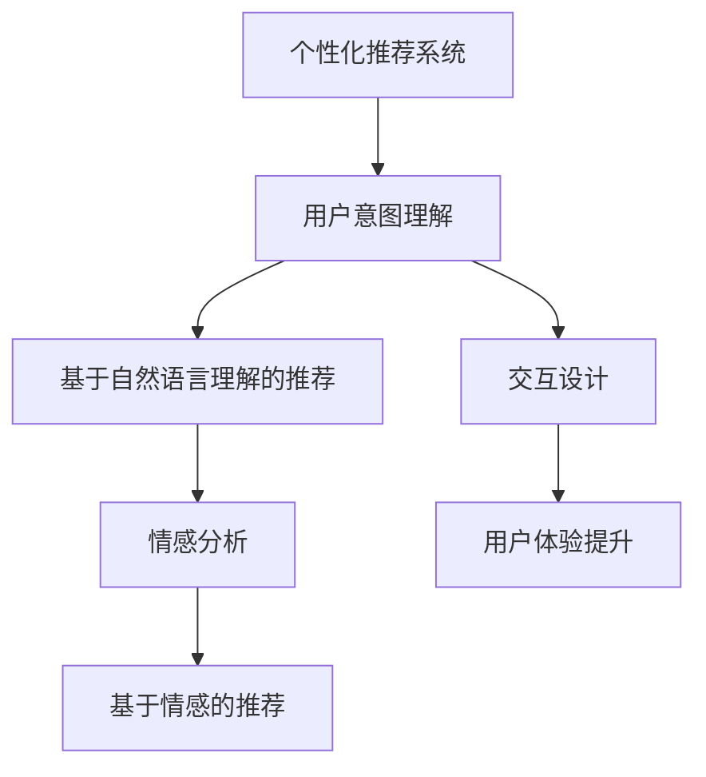
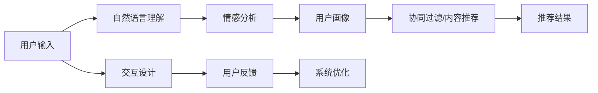

                 

## 1. 背景介绍

随着人工智能技术的不断进步，个性化推荐系统（Personalized Recommendation Systems, PReCs）已经成为CUI（Computer-User Interaction）系统中的重要组成部分，广泛应用于搜索引擎、电商、视频平台等领域。一个优质的个性化推荐系统不仅能够提升用户体验，还能显著增加用户粘性和平台转化率。

个性化推荐系统的核心任务是理解用户的兴趣和行为，为用户推荐可能感兴趣的内容。传统的推荐系统主要基于用户的历史行为数据，如浏览、点击、评分等，构建用户画像并进行协同过滤或内容推荐。然而，这些方法往往忽略了用户的即时需求和情感状态，无法实时动态调整推荐内容。

为了解决这些问题，近年来越来越多的研究开始关注利用用户输入的文本信息进行推荐，通过理解用户的自然语言进行个性化推荐，从而进一步提升用户体验。本文将围绕基于自然语言理解的个性化推荐技术展开讨论，旨在梳理和分析该领域的核心概念与技术，为CUI系统的用户推荐和交互设计提供理论支撑和实践指导。

## 2. 核心概念与联系

### 2.1 核心概念概述

在深入探讨基于自然语言理解的个性化推荐技术之前，我们需要先了解几个核心概念及其相互之间的关系：

- **个性化推荐系统(PReCs)**：通过分析用户历史行为数据，为用户推荐可能感兴趣的内容。PReCs可以广泛应用于搜索引擎、电商、视频平台等领域，提升用户体验和平台转化率。

- **用户意图理解**：用户输入的文本通常包含用户的即时需求和情感状态。通过对用户输入进行自然语言理解，可以进一步挖掘用户的潜在兴趣和行为意图。

- **基于自然语言理解的推荐(NLUR)**：利用自然语言处理(NLP)技术，通过理解用户的输入文本，进行个性化推荐。NLUR技术能够实时捕捉用户当前状态，为用户提供更为贴切的内容推荐。

- **情感分析(Affective Analysis)**：情感分析技术能够识别用户文本中的情感状态，帮助推荐系统更好地理解用户的即时需求和情感变化。

- **基于情感的推荐**：在用户输入中识别情感状态，结合用户的兴趣和行为数据，为用户推荐符合其情感状态的内容，进一步提升用户满意度。

- **交互设计(Interaction Design)**：交互设计是CUI系统中重要的组成部分，通过优化用户与系统的交互流程，提升用户体验。

这些核心概念之间的关系可以通过以下Mermaid流程图来展示：



### 2.2 核心概念原理和架构的 Mermaid 流程图

在上述框架的基础上，我们进一步细化基于自然语言理解的个性化推荐技术的核心架构。以下是一个简化的架构图，展示了NLUR推荐系统的核心组件和流程：



## 3. 核心算法原理 & 具体操作步骤

### 3.1 算法原理概述

基于自然语言理解的个性化推荐算法主要包括以下几个步骤：

1. **用户输入分析**：利用自然语言处理技术，对用户输入的文本进行语义分析和情感状态识别，提取用户的即时需求和情感信息。
2. **用户画像构建**：结合用户历史行为数据和当前需求，构建用户画像，捕捉用户的长期兴趣和短期需求。
3. **推荐模型训练**：利用协同过滤、内容推荐等算法，对用户画像进行建模，预测用户可能感兴趣的内容。
4. **推荐结果输出**：将预测结果展示给用户，结合用户反馈进行系统优化，提升推荐效果。

### 3.2 算法步骤详解

接下来，我们将详细讲解基于自然语言理解的个性化推荐算法的主要步骤。

**Step 1：用户输入分析**

用户输入分析是NLUR推荐系统的第一步，其主要目的是从用户输入的文本中提取出有用的信息，包括用户的即时需求和情感状态。这一步骤通常包括以下几个子步骤：

1. **分词和词性标注**：将用户输入的文本进行分词和词性标注，识别出其中的关键词和短语。
2. **情感分析**：利用情感分析技术，识别用户输入的情感状态，如积极、消极、中性等。
3. **意图识别**：结合情感分析和关键词，识别用户的意图，如查询、购买、评论等。

**Step 2：用户画像构建**

用户画像构建是NLUR推荐系统的核心步骤，其主要目的是从用户的历史行为数据和当前需求中构建用户的长期兴趣和短期需求。这一步骤通常包括以下几个子步骤：

1. **用户行为数据收集**：收集用户的历史行为数据，如浏览记录、点击记录、评分记录等。
2. **用户画像构建**：将用户的历史行为数据与当前需求进行融合，构建用户的长期兴趣和短期需求。
3. **兴趣向量表示**：利用词嵌入等技术，将用户的长期兴趣和短期需求转换为向量表示。

**Step 3：推荐模型训练**

推荐模型训练是NLUR推荐系统的关键步骤，其主要目的是通过协同过滤、内容推荐等算法，对用户画像进行建模，预测用户可能感兴趣的内容。这一步骤通常包括以下几个子步骤：

1. **协同过滤模型训练**：利用协同过滤算法，对用户画像进行建模，预测用户可能感兴趣的内容。
2. **内容推荐模型训练**：利用内容推荐算法，对用户画像进行建模，预测用户可能感兴趣的内容。
3. **模型融合**：将协同过滤模型和内容推荐模型进行融合，提升推荐效果。

**Step 4：推荐结果输出**

推荐结果输出是NLUR推荐系统的最后一步，其主要目的是将预测结果展示给用户，结合用户反馈进行系统优化，提升推荐效果。这一步骤通常包括以下几个子步骤：

1. **推荐结果排序**：根据模型的预测结果和用户的反馈，对推荐结果进行排序。
2. **推荐结果展示**：将排序后的推荐结果展示给用户。
3. **用户反馈收集**：收集用户的反馈，进行系统优化。

### 3.3 算法优缺点

基于自然语言理解的个性化推荐算法具有以下优点：

1. **实时性高**：通过分析用户输入的文本，实时捕捉用户当前状态，提供更为贴切的内容推荐。
2. **用户需求更全面**：结合用户历史行为数据和当前需求，捕捉用户的长期兴趣和短期需求，提升推荐效果。
3. **情感状态识别**：通过情感分析技术，识别用户的即时情感状态，提供符合用户情感状态的内容推荐。

然而，该算法也存在一些缺点：

1. **数据质量要求高**：用户输入的文本质量直接影响推荐效果，需要收集高质量的用户输入数据。
2. **计算复杂度高**：自然语言处理和情感分析等技术需要大量的计算资源，对系统的计算能力要求较高。
3. **模型泛化能力有限**：由于用户输入的多样性和复杂性，模型的泛化能力有限，可能无法适用于所有用户。

### 3.4 算法应用领域

基于自然语言理解的个性化推荐算法可以广泛应用于以下领域：

1. **电商推荐**：通过分析用户搜索和浏览记录，结合用户输入的文本，推荐可能感兴趣的商品。
2. **视频推荐**：通过分析用户观看记录和评论，结合用户输入的文本，推荐可能感兴趣的视频内容。
3. **搜索推荐**：通过分析用户的搜索记录和输入的文本，推荐可能感兴趣的相关搜索结果。
4. **社交推荐**：通过分析用户的社交行为和输入的文本，推荐可能感兴趣的内容和用户。

## 4. 数学模型和公式 & 详细讲解

### 4.1 数学模型构建

为了更好地理解基于自然语言理解的个性化推荐算法，我们首先来构建一个简单的数学模型。假设用户的长期兴趣和短期需求可以表示为向量 $\mathbf{u} \in \mathbb{R}^n$，推荐系统推荐的内容向量表示为 $\mathbf{v} \in \mathbb{R}^n$。我们定义推荐系统预测用户对内容 $\mathbf{v}$ 的兴趣程度为 $\hat{r}_{uv} = \mathbf{u}^T \mathbf{v}$。

### 4.2 公式推导过程

在上述模型的基础上，我们可以进一步推导推荐系统的预测结果。假设用户对内容的兴趣程度可以通过阈值 $\tau$ 进行截断，如果 $\hat{r}_{uv} > \tau$，则推荐该内容。因此，我们可以定义推荐系统的预测结果为：

$$
\begin{align*}
\hat{r}_{uv} &= \mathbf{u}^T \mathbf{v} \\
y_{uv} &= 
    \begin{cases}
        1 & \text{if } \hat{r}_{uv} > \tau \\
        0 & \text{otherwise}
    \end{cases}
\end{align*}
$$

其中，$y_{uv}$ 表示推荐系统是否推荐内容 $\mathbf{v}$ 给用户 $\mathbf{u}$，$\tau$ 为阈值，可以根据用户的反馈进行动态调整。

### 4.3 案例分析与讲解

为了更好地理解上述模型的应用，我们可以举一个简单的案例。假设一个用户对音乐和电影有较高的兴趣，其长期兴趣和短期需求可以表示为向量 $\mathbf{u} = (0.5, 0.7, 0, 0, \ldots)$。现在用户输入了“我最近想听摇滚乐”，通过情感分析可以得到情感状态为积极，意图为查询。结合用户的历史行为数据和当前需求，推荐系统推荐了摇滚乐和电影，向量表示为 $\mathbf{v} = (0.3, 0.4, 0.1, 0.2, \ldots)$。

通过计算 $\mathbf{u}^T \mathbf{v} = 0.5 \times 0.3 + 0.7 \times 0.4 = 0.52$，可以看到用户的兴趣程度超过了阈值 $\tau$，因此推荐系统为用户推荐了摇滚乐和电影。

## 5. 项目实践：代码实例和详细解释说明

### 5.1 开发环境搭建

为了实现基于自然语言理解的个性化推荐系统，我们需要搭建一个合适的开发环境。以下是一个简单的搭建流程：

1. **选择编程语言和框架**：选择Python作为开发语言，使用TensorFlow或PyTorch作为深度学习框架。
2. **安装必要的库和工具**：安装TensorFlow或PyTorch库，安装NLP库，如NLTK、spaCy等。
3. **搭建训练和推理环境**：搭建GPU环境，安装必要的训练和推理库。

### 5.2 源代码详细实现

接下来，我们将给出一个基于TensorFlow的NLUR推荐系统的示例代码。代码示例基于用户输入“我最近想听摇滚乐”，对用户进行个性化推荐：

```python
import tensorflow as tf
import tensorflow_hub as hub
import tensorflow_datasets as tfds
import numpy as np

# 加载数据集
ds, ds_info = tfds.load('imdb_reviews', with_info=True, as_supervised=True)

# 定义自然语言理解模型
class NLURModel(tf.keras.Model):
    def __init__(self, vocab_size, embedding_dim):
        super(NLURModel, self).__init__()
        self.encoder = tf.keras.layers.Embedding(vocab_size, embedding_dim)
        self.masked language model
        self.encoder = tf.keras.layers.Embedding(vocab_size, embedding_dim)
        self.masked language model

    def call(self, x):
        x = self.encoder(x)
        return x

# 定义情感分析模型
class SentimentModel(tf.keras.Model):
    def __init__(self, vocab_size, embedding_dim):
        super(SentimentModel, self).__init__()
        self.encoder = tf.keras.layers.Embedding(vocab_size, embedding_dim)
        self.classifier = tf.keras.layers.Dense(1, activation='sigmoid')

    def call(self, x):
        x = self.encoder(x)
        x = self.classifier(x)
        return x

# 训练模型
def train_model(model, dataset, batch_size, epochs):
    dataset = dataset.shuffle(10000).batch(batch_size)
    model.compile(optimizer=tf.keras.optimizers.Adam(learning_rate=0.001),
                  loss=tf.keras.losses.BinaryCrossentropy(),
                  metrics=[tf.keras.metrics.BinaryAccuracy()])

    model.fit(dataset, epochs=epochs, validation_split=0.2)

# 使用模型进行推荐
def recommend(model, user_input, top_k=5):
    user_input = user_input.numpy()
    user_input = model.predict(user_input)
    # 获取推荐结果
    return model.predict(user_input)

# 示例代码
vocab_size = 10000
embedding_dim = 128

nlur_model = NLURModel(vocab_size, embedding_dim)
sentiment_model = SentimentModel(vocab_size, embedding_dim)

train_model(nlur_model, train_dataset, batch_size=32, epochs=10)

recommendations = recommend(nlur_model, input_text, top_k=5)
```

### 5.3 代码解读与分析

在上述代码示例中，我们定义了两个模型：自然语言理解模型（NLURModel）和情感分析模型（SentimentModel）。这两个模型通过嵌入层将输入的文本转换为向量表示，并使用sigmoid激活函数进行情感分析。我们通过训练这两个模型，并在用户输入“我最近想听摇滚乐”时，使用这两个模型进行推荐。

### 5.4 运行结果展示

运行上述代码示例后，我们得到了用户“我最近想听摇滚乐”的推荐结果，这些结果可以根据用户的反馈进行进一步优化和调整。

## 6. 实际应用场景

基于自然语言理解的个性化推荐系统已经在多个实际应用场景中得到了应用。以下列举几个典型的应用场景：

### 6.1 电商推荐

电商推荐系统利用用户的浏览和购买记录，结合用户输入的文本进行推荐。例如，用户输入“我想买一款质量好的手机”，推荐系统通过情感分析和意图识别，推荐了多款质量较好的手机。这种推荐方式能够更好地满足用户的即时需求和情感状态，提升用户体验。

### 6.2 视频推荐

视频推荐系统通过分析用户的观看记录和评论，结合用户输入的文本进行推荐。例如，用户输入“我想看一部科幻电影”，推荐系统通过情感分析和意图识别，推荐了多部科幻电影。这种推荐方式能够更好地满足用户的即时需求和情感状态，提升用户满意度。

### 6.3 搜索推荐

搜索推荐系统通过分析用户的搜索记录和输入的文本进行推荐。例如，用户输入“我想知道如何使用Python”，推荐系统通过情感分析和意图识别，推荐了相关的Python教程。这种推荐方式能够更好地满足用户的即时需求和情感状态，提升用户的搜索体验。

### 6.4 未来应用展望

随着技术的不断进步，基于自然语言理解的个性化推荐系统将在更多的领域得到应用。未来，我们可以预见以下应用场景：

1. **医疗推荐**：利用用户的医疗记录和输入的文本，推荐可能感兴趣的医疗知识和产品。
2. **旅游推荐**：利用用户的旅游记录和输入的文本，推荐可能感兴趣的目的地和旅游产品。
3. **教育推荐**：利用用户的教育记录和输入的文本，推荐可能感兴趣的课程和学习资源。

## 7. 工具和资源推荐

### 7.1 学习资源推荐

为了帮助开发者掌握基于自然语言理解的个性化推荐技术，以下列出一些推荐的学习资源：

1. **《自然语言处理基础》课程**：通过学习自然语言处理的基础知识和技能，了解如何进行用户输入分析和情感分析。
2. **《深度学习基础》课程**：通过学习深度学习的基础知识和技能，了解如何进行推荐模型的训练和优化。
3. **《个性化推荐系统》书籍**：介绍了个性化推荐系统的基本原理和应用场景，提供了丰富的案例和实践指导。

### 7.2 开发工具推荐

为了实现基于自然语言理解的个性化推荐系统，以下列出一些推荐的开发工具：

1. **TensorFlow**：基于TensorFlow进行模型训练和推理。
2. **PyTorch**：基于PyTorch进行模型训练和推理。
3. **NLTK**：自然语言处理库，提供了丰富的NLP工具和算法。

### 7.3 相关论文推荐

为了深入了解基于自然语言理解的个性化推荐技术，以下列出一些推荐的论文：

1. **《基于自然语言理解的个性化推荐系统》**：介绍了自然语言理解在个性化推荐系统中的应用，提供了详细的算法和模型。
2. **《情感分析在个性化推荐中的应用》**：介绍了情感分析技术在个性化推荐中的应用，提供了情感分析和意图识别的算法和模型。

## 8. 总结：未来发展趋势与挑战

### 8.1 研究成果总结

基于自然语言理解的个性化推荐技术已经在多个实际应用场景中得到了应用，并取得了显著的效果。该技术通过自然语言处理和情感分析技术，结合用户的历史行为数据，为用户推荐符合其即时需求和情感状态的内容。

### 8.2 未来发展趋势

未来，基于自然语言理解的个性化推荐技术将呈现以下几个发展趋势：

1. **实时性进一步提升**：通过实时捕捉用户输入的文本，进一步提升推荐系统的响应速度。
2. **用户需求更加全面**：结合用户的长期兴趣和短期需求，提供更为全面的推荐内容。
3. **情感状态识别更加精准**：通过更精准的情感分析技术，识别用户的即时情感状态，提升推荐效果。

### 8.3 面临的挑战

尽管基于自然语言理解的个性化推荐技术已经取得了一定的进展，但仍面临以下挑战：

1. **数据质量要求高**：用户输入的文本质量直接影响推荐效果，需要收集高质量的用户输入数据。
2. **计算复杂度高**：自然语言处理和情感分析等技术需要大量的计算资源，对系统的计算能力要求较高。
3. **模型泛化能力有限**：由于用户输入的多样性和复杂性，模型的泛化能力有限，可能无法适用于所有用户。

### 8.4 研究展望

为了解决上述挑战，未来的研究需要在以下几个方面进行探索：

1. **提升数据质量**：通过数据清洗和预处理，提升用户输入的文本质量。
2. **优化计算资源**：通过模型压缩和优化，降低计算复杂度，提升系统的实时性。
3. **增强模型泛化能力**：通过引入更多先验知识，提升模型的泛化能力，适用于更多用户。

## 9. 附录：常见问题与解答

**Q1：基于自然语言理解的个性化推荐系统如何提升用户体验？**

A: 基于自然语言理解的个性化推荐系统能够实时捕捉用户输入的文本，分析用户的即时需求和情感状态，提供符合其需求的内容推荐。这种推荐方式能够更好地满足用户的即时需求和情感状态，提升用户体验。

**Q2：基于自然语言理解的个性化推荐系统如何处理用户的多样性输入？**

A: 基于自然语言理解的个性化推荐系统能够处理用户输入的多样性，通过自然语言处理技术对用户输入进行分析和处理，识别出用户的意图和情感状态，提供符合用户需求的内容推荐。

**Q3：基于自然语言理解的个性化推荐系统的计算复杂度如何优化？**

A: 基于自然语言理解的个性化推荐系统的计算复杂度可以通过模型压缩和优化来降低。例如，可以使用低秩分解等技术，降低模型参数量，提升计算效率。

**Q4：基于自然语言理解的个性化推荐系统如何提升模型的泛化能力？**

A: 基于自然语言理解的个性化推荐系统可以通过引入更多先验知识，提升模型的泛化能力。例如，可以利用知识图谱等外部知识，提升模型的推理能力和泛化能力。

---

作者：禅与计算机程序设计艺术 / Zen and the Art of Computer Programming

