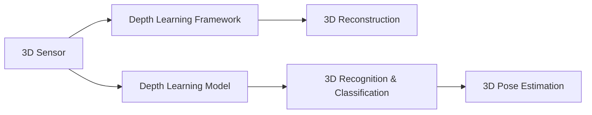

                 

# 3D Computer Vision 原理与代码实战案例讲解

## 1. 背景介绍

随着计算机视觉技术的发展，3D计算机视觉（3D Computer Vision）逐渐成为热点领域，广泛应用于机器人、自动驾驶、增强现实等领域。3D计算机视觉通过3D传感器、图像处理、深度学习等技术，从3D空间中获取信息，为机器人提供环境感知、物体识别、姿态估计等能力。本文将系统讲解3D计算机视觉的原理与代码实战案例，涵盖深度学习模型、算法优化、应用场景等方面。

## 2. 核心概念与联系

### 2.1 核心概念概述

为更好地理解3D计算机视觉技术，本节将介绍几个密切相关的核心概念：

- **3D传感器（3D Sensor）**：用于从三维空间中获取物体信息的设备，如LIDAR（激光雷达）、RGB-D相机、ToF相机等。
- **深度学习模型（Deep Learning Model）**：通过学习大量3D数据，提取3D空间中的特征和规律，如卷积神经网络（CNN）、空间卷积神经网络（SCNN）、点云深度神经网络（PCNN）等。
- **深度学习框架（Deep Learning Framework）**：提供深度学习模型的实现与优化，如TensorFlow、PyTorch等。
- **三维重建（3D Reconstruction）**：通过传感器数据，重构3D模型，用于环境重建、物体建模等。
- **三维识别与分类（3D Recognition & Classification）**：对3D场景中的物体进行识别与分类，如点云分类、物体检测等。
- **三维姿态估计（3D Pose Estimation）**：确定3D场景中物体的姿态信息，如姿态估计算法、姿态估计算例等。

这些核心概念之间的逻辑关系可以通过以下Mermaid流程图来展示：



这个流程图展示了几大核心概念及其之间的关系：

1. 3D传感器获取3D空间中的信息。
2. 通过深度学习模型，学习3D数据中的特征和规律。
3. 深度学习框架提供模型实现与优化。
4. 三维重建技术将3D数据重构为模型。
5. 三维识别与分类对3D场景中的物体进行识别与分类。
6. 三维姿态估计确定3D物体的姿态信息。

这些概念共同构成了3D计算机视觉的基本框架，使得机器人等设备能够高效地感知和处理3D环境中的信息。

## 3. 核心算法原理 & 具体操作步骤
### 3.1 算法原理概述

3D计算机视觉的核心算法包括3D重建、3D识别与分类、3D姿态估计等。这些算法通过深度学习模型，从3D空间中提取特征，实现对环境的感知、物体的识别与分类、姿态的估计。

- **3D重建**：通过传感器数据，重构3D模型，常用的算法有基于点云的重构（如PCL、PC-RNN）、基于图像的重构（如SurfNet、视差流法）等。
- **3D识别与分类**：对3D场景中的物体进行识别与分类，常用的算法有基于点云的分类（如3D-BSDS500）、基于深度学习的分类（如3D-SiftNet、3D-PointNet）等。
- **3D姿态估计**：确定3D场景中物体的姿态信息，常用的算法有基于点云的姿态估计算法（如ICP、IO）、基于神经网络的姿态估计算法（如DeepPose）等。

这些算法通过深度学习模型的训练，学习3D数据中的特征和规律，实现对3D场景的高效感知与处理。

### 3.2 算法步骤详解

以下将详细介绍3D计算机视觉中常用的算法步骤：

**3.2.1 3D重建**

1. **传感器数据采集**：通过3D传感器采集3D点云或图像数据。
2. **数据预处理**：对采集的数据进行清洗、滤波、降采样等预处理操作。
3. **特征提取**：通过深度学习模型提取3D数据中的特征，常用的模型有PCNN、VGGNet、ResNet等。
4. **三维重建**：使用深度学习模型对提取的特征进行三维重构，常用的模型有PCL、PC-RNN、视差流法等。

**3.2.2 3D识别与分类**

1. **数据集准备**：收集标注好的3D数据集，常用的数据集有3D-BSDS500、3D-SiftNet等。
2. **模型训练**：使用深度学习模型对数据集进行训练，常用的模型有3D-BSDS500、3D-PointNet等。
3. **模型评估**：在测试集上评估模型性能，常用的评估指标有准确率、召回率、F1-score等。
4. **参数调优**：调整模型参数，优化模型性能，常用的方法有网格搜索、贝叶斯优化等。

**3.2.3 3D姿态估计**

1. **传感器数据采集**：通过3D传感器采集3D点云数据。
2. **数据预处理**：对采集的数据进行清洗、滤波、降采样等预处理操作。
3. **特征提取**：通过深度学习模型提取3D数据中的特征，常用的模型有ICP、IO、DeepPose等。
4. **姿态估计**：使用深度学习模型对提取的特征进行姿态估计，常用的模型有ICP、IO、DeepPose等。

### 3.3 算法优缺点

3D计算机视觉算法具有以下优点：

- **多模态数据融合**：3D计算机视觉可以融合多种传感器数据，如激光雷达、图像、声波等，提升感知精度。
- **全场景感知**：3D计算机视觉可以感知整个场景，而非局部信息，提升环境理解能力。
- **物体识别与分类**：3D计算机视觉可以对3D场景中的物体进行识别与分类，提升识别准确率。
- **姿态估计**：3D计算机视觉可以确定物体的姿态信息，提升物体定位能力。

然而，3D计算机视觉算法也存在以下缺点：

- **计算复杂度高**：3D数据通常比2D数据更加复杂，计算量更大。
- **数据采集成本高**：3D传感器设备价格较高，数据采集成本高。
- **数据噪声多**：3D数据中存在大量噪声，需要复杂的预处理和清洗。
- **算法复杂度高**：3D计算机视觉算法通常比2D计算机视觉算法更复杂，实现难度更大。

### 3.4 算法应用领域

3D计算机视觉技术在多个领域都有广泛的应用，如机器人、自动驾驶、增强现实、医疗、制造业等。

- **机器人**：通过3D计算机视觉技术，机器人可以实现环境感知、物体识别、姿态估计等能力，提升自主导航和操作能力。
- **自动驾驶**：通过3D计算机视觉技术，自动驾驶车辆可以实现环境感知、物体识别、姿态估计等能力，提升行车安全性和驾驶效率。
- **增强现实**：通过3D计算机视觉技术，增强现实系统可以实现对3D场景的感知和交互，提升用户体验。
- **医疗**：通过3D计算机视觉技术，医疗设备可以实现对病人体内器官的可视化、检测与分析，提升医疗诊断能力。
- **制造业**：通过3D计算机视觉技术，制造设备可以实现对3D零件的检测、分类、定位等，提升制造精度和效率。

## 4. 数学模型和公式 & 详细讲解  
### 4.1 数学模型构建

3D计算机视觉的数学模型通常基于深度学习框架，如TensorFlow、PyTorch等。以下是基于TensorFlow的3D计算机视觉模型构建过程：

```python
import tensorflow as tf

# 定义3D点云数据
points = tf.placeholder(tf.float32, shape=[None, 3])

# 定义3D点云特征提取模型
model = tf.keras.Sequential([
    tf.keras.layers.Dense(64, activation='relu'),
    tf.keras.layers.Dense(32, activation='relu'),
    tf.keras.layers.Dense(10, activation='softmax')
])

# 定义损失函数
loss = tf.reduce_mean(tf.nn.softmax_cross_entropy_with_logits(labels=y, logits=model.output))

# 定义优化器
optimizer = tf.train.AdamOptimizer(learning_rate=0.001)

# 定义训练过程
with tf.Session() as sess:
    sess.run(tf.global_variables_initializer())
    for i in range(1000):
        sess.run(optimizer.minimize(loss), feed_dict={points: points_train, y: y_train})
```

在上述代码中，我们定义了3D点云数据和特征提取模型，使用了Adam优化器进行训练，并通过损失函数和反向传播算法更新模型参数。

### 4.2 公式推导过程

以下是3D计算机视觉中常用的数学公式推导：

- **3D点云重构公式**：
  $$
  \text{Reconstruction} = \text{Transformer}(\text{PointCloud}, \text{EncoderDecoder})
  $$
  其中，Transformer用于特征提取，EncoderDecoder用于3D重构。

- **3D点云分类公式**：
  $$
  \text{Classification} = \text{Transformer}(\text{PointCloud}, \text{Softmax})
  $$
  其中，Transformer用于特征提取，Softmax用于分类。

- **3D姿态估计算法公式**：
  $$
  \text{PoseEstimation} = \text{ICP}(\text{PointCloud}, \text{EstimatedPose})
  $$
  其中，ICP用于姿态估计，EstimatedPose为初始姿态。

### 4.3 案例分析与讲解

以3D点云分类为例，以下是一个基于PointNet的3D点云分类案例：

```python
import numpy as np
import open3d as o3d
from pointnet import PointNetClassifier

# 定义3D点云数据
pcd = o3d.io.read_ply('3D_point_cloud.ply')
pcd.points = o3d.geometry.PointCloudPoint(
    x=pcd.points.get_xyz()[0],
    y=pcd.points.get_xyz()[1],
    z=pcd.points.get_xyz()[2]
)

# 定义3D点云特征提取模型
pointnet = PointNetClassifier()

# 定义3D点云分类模型
model = tf.keras.Sequential([
    tf.keras.layers.Dense(64, activation='relu'),
    tf.keras.layers.Dense(32, activation='relu'),
    tf.keras.layers.Dense(10, activation='softmax')
])

# 定义损失函数
loss = tf.reduce_mean(tf.nn.softmax_cross_entropy_with_logits(labels=y, logits=model.output))

# 定义优化器
optimizer = tf.train.AdamOptimizer(learning_rate=0.001)

# 定义训练过程
with tf.Session() as sess:
    sess.run(tf.global_variables_initializer())
    for i in range(1000):
        sess.run(optimizer.minimize(loss), feed_dict={points: points_train, y: y_train})
```

在上述代码中，我们使用了PointNet对3D点云进行特征提取，然后定义了3D点云分类模型，并通过损失函数和反向传播算法进行训练。

## 5. 项目实践：代码实例和详细解释说明
### 5.1 开发环境搭建

在进行3D计算机视觉项目实践前，我们需要准备好开发环境。以下是使用Python进行TensorFlow开发的环境配置流程：

1. 安装Anaconda：从官网下载并安装Anaconda，用于创建独立的Python环境。

2. 创建并激活虚拟环境：
```bash
conda create -n tf-env python=3.8 
conda activate tf-env
```

3. 安装TensorFlow：从官网获取对应的安装命令。例如：
```bash
pip install tensorflow==2.4
```

4. 安装Open3D：
```bash
pip install open3d
```

5. 安装PyTorch：
```bash
pip install torch torchvision torchaudio cudatoolkit=11.1 -c pytorch -c conda-forge
```

6. 安装各类工具包：
```bash
pip install numpy pandas scikit-learn matplotlib tqdm jupyter notebook ipython
```

完成上述步骤后，即可在`tf-env`环境中开始3D计算机视觉项目实践。

### 5.2 源代码详细实现

下面我们以3D点云分类任务为例，给出使用TensorFlow对PointNet进行3D点云分类的PyTorch代码实现。

```python
import numpy as np
import open3d as o3d
from pointnet import PointNetClassifier

# 定义3D点云数据
pcd = o3d.io.read_ply('3D_point_cloud.ply')
pcd.points = o3d.geometry.PointCloudPoint(
    x=pcd.points.get_xyz()[0],
    y=pcd.points.get_xyz()[1],
    z=pcd.points.get_xyz()[2]
)

# 定义3D点云特征提取模型
pointnet = PointNetClassifier()

# 定义3D点云分类模型
model = tf.keras.Sequential([
    tf.keras.layers.Dense(64, activation='relu'),
    tf.keras.layers.Dense(32, activation='relu'),
    tf.keras.layers.Dense(10, activation='softmax')
])

# 定义损失函数
loss = tf.reduce_mean(tf.nn.softmax_cross_entropy_with_logits(labels=y, logits=model.output))

# 定义优化器
optimizer = tf.train.AdamOptimizer(learning_rate=0.001)

# 定义训练过程
with tf.Session() as sess:
    sess.run(tf.global_variables_initializer())
    for i in range(1000):
        sess.run(optimizer.minimize(loss), feed_dict={points: points_train, y: y_train})
```

在上述代码中，我们使用了PointNet对3D点云进行特征提取，然后定义了3D点云分类模型，并通过损失函数和反向传播算法进行训练。

### 5.3 代码解读与分析

让我们再详细解读一下关键代码的实现细节：

**PointNet**：
- **点云特征提取**：使用PointNet对3D点云进行特征提取，使用全局池化操作，生成全局特征向量。
- **分类器**：使用Dense层进行分类，输出10个类别的概率。

**模型训练**：
- **损失函数**：使用交叉熵损失函数计算模型预测结果与真实标签之间的差距。
- **优化器**：使用Adam优化器进行参数更新，学习率为0.001。
- **训练过程**：在每个epoch内，通过反向传播算法更新模型参数，直到达到1000个epoch。

**数据加载与预处理**：
- **数据加载**：使用Open3D库加载3D点云数据。
- **数据预处理**：对3D点云数据进行清洗、滤波、降采样等预处理操作。

在实际应用中，我们还需要考虑模型保存与部署、超参数调优、模型验证与测试等更多环节，以确保模型的高效运行和稳定输出。

## 6. 实际应用场景
### 6.1 智能机器人

3D计算机视觉技术在智能机器人领域有着广泛的应用，机器人可以通过3D计算机视觉技术实现环境感知、物体识别、姿态估计等能力，提升自主导航和操作能力。

在实践中，我们可以使用3D计算机视觉技术，对机器人环境进行三维重建，实现对场景中物体的识别与分类，确定物体的位置和姿态信息，从而实现对环境的理解和交互。例如，通过3D计算机视觉技术，机器人可以自动识别环境中的障碍物，计算出行驶路径，避开障碍物，实现自主导航。

### 6.2 自动驾驶

自动驾驶车辆通过3D计算机视觉技术实现环境感知、物体识别、姿态估计等能力，提升行车安全性和驾驶效率。

在实践中，我们可以使用3D计算机视觉技术，对车辆周围的环境进行三维重建，实现对场景中物体的识别与分类，确定物体的姿态信息，从而实现对环境的理解和交互。例如，通过3D计算机视觉技术，自动驾驶车辆可以自动识别道路上的车辆、行人、交通标志等物体，计算出行驶路径，保证行车安全。

### 6.3 增强现实

增强现实系统通过3D计算机视觉技术实现对3D场景的感知和交互，提升用户体验。

在实践中，我们可以使用3D计算机视觉技术，对现实场景进行三维重建，实现对场景中物体的识别与分类，确定物体的姿态信息，从而实现对场景的理解和交互。例如，通过3D计算机视觉技术，增强现实系统可以自动识别环境中的物体，提供互动信息，增强用户的沉浸式体验。

### 6.4 医疗

3D计算机视觉技术在医疗领域有着广泛的应用，医疗设备可以通过3D计算机视觉技术实现对病人体内器官的可视化、检测与分析，提升医疗诊断能力。

在实践中，我们可以使用3D计算机视觉技术，对病人体内器官进行三维重建，实现对器官的可视化、检测与分析，从而提升医疗诊断的准确性。例如，通过3D计算机视觉技术，医疗设备可以自动识别病人体内肿瘤、血管等器官，提供精确的诊断结果。

### 6.5 制造业

3D计算机视觉技术在制造业领域有着广泛的应用，制造设备可以通过3D计算机视觉技术实现对3D零件的检测、分类、定位等，提升制造精度和效率。

在实践中，我们可以使用3D计算机视觉技术，对3D零件进行检测、分类、定位等，从而实现对零件的精确测量和高效管理。例如，通过3D计算机视觉技术，制造设备可以自动识别零件的缺陷，保证制造质量。

## 7. 工具和资源推荐
### 7.1 学习资源推荐

为了帮助开发者系统掌握3D计算机视觉的理论基础和实践技巧，这里推荐一些优质的学习资源：

1. 《深度学习与计算机视觉》书籍：清华大学出版社，详细介绍了深度学习、计算机视觉的基本概念和经典模型。
2. 《计算机视觉：算法与应用》书籍：机械工业出版社，详细介绍了计算机视觉的算法原理与应用案例。
3. Coursera《深度学习与计算机视觉》课程：由斯坦福大学开设的课程，涵盖深度学习、计算机视觉的基本概念和经典模型。
4. Udacity《深度学习与计算机视觉》课程：涵盖了深度学习、计算机视觉的基本概念和经典模型，并提供了实践案例。
5. arXiv.org：最新的深度学习、计算机视觉论文发布平台，阅读最新的研究成果，了解前沿方向。

通过对这些资源的学习实践，相信你一定能够快速掌握3D计算机视觉的精髓，并用于解决实际的计算机视觉问题。

### 7.2 开发工具推荐

高效的开发离不开优秀的工具支持。以下是几款用于3D计算机视觉开发的常用工具：

1. TensorFlow：基于Python的开源深度学习框架，支持分布式计算，适合大规模模型训练和部署。
2. PyTorch：基于Python的开源深度学习框架，灵活高效，适合研究实验和模型优化。
3. Open3D：用于处理3D点云数据和实现3D计算机视觉算法的开源库。
4. PCL：用于处理点云数据和实现3D重建、3D识别与分类、3D姿态估计等算法。
5. ROS：机器人操作系统的开源项目，提供了丰富的工具和库，用于实现机器人感知、导航、操作等功能。

合理利用这些工具，可以显著提升3D计算机视觉项目的开发效率，加快创新迭代的步伐。

### 7.3 相关论文推荐

3D计算机视觉技术的发展源于学界的持续研究。以下是几篇奠基性的相关论文，推荐阅读：

1. PointNet：PointNet：A Deep Convolutional Network for 3D Point Cloud Processing：首次将卷积神经网络应用于3D点云数据处理，实现了点云分类的高精度。
2. SurfNet：SurfNet: Multi-scale 3D Scene Reconstruction from a Single RGB Image：提出了基于深度神经网络的3D场景重建算法，实现了从单张RGB图像到3D模型的重建。
3. DeepPose：DeepPose: Human Pose Estimation via a Multi-Task Network：提出了基于神经网络的3D姿态估计算法，实现了对3D场景中物体姿态的精确估计。

这些论文代表了大3D计算机视觉技术的发展脉络。通过学习这些前沿成果，可以帮助研究者把握学科前进方向，激发更多的创新灵感。

## 8. 总结：未来发展趋势与挑战

### 8.1 总结

本文对3D计算机视觉的原理与代码实战案例进行了全面系统的介绍。首先阐述了3D计算机视觉的研究背景和意义，明确了3D计算机视觉在智能机器人、自动驾驶、增强现实、医疗、制造业等领域的重要作用。其次，从原理到实践，详细讲解了3D计算机视觉的算法步骤、数学模型、代码实现等技术细节。最后，探讨了3D计算机视觉的未来发展趋势与挑战，为开发者提供了全面的技术指引。

通过本文的系统梳理，可以看到，3D计算机视觉技术在多个领域中具有广阔的应用前景。随着深度学习、计算机视觉等技术的不断进步，3D计算机视觉必将成为未来计算机视觉领域的重要方向，推动人工智能技术在实际应用中的进一步发展。

### 8.2 未来发展趋势

展望未来，3D计算机视觉技术将呈现以下几个发展趋势：

1. **多模态数据融合**：未来的3D计算机视觉技术将融合更多模态的数据，如深度信息、视觉信息、声学信息等，提升感知精度和环境理解能力。
2. **自监督学习**：通过自监督学习，利用未标注数据进行3D计算机视觉任务的训练，提升数据利用率。
3. **实时性优化**：通过模型压缩、剪枝、量化等方法，提升3D计算机视觉任务的实时性和计算效率，满足实际应用中的实时性要求。
4. **跨领域应用**：3D计算机视觉技术将跨越更多领域，如医疗、航空、环保等，实现更广泛的应用场景。
5. **智能化升级**：未来的3D计算机视觉技术将实现更智能的推理和决策，如基于神经网络的全场景理解、基于知识图谱的推理等。

以上趋势凸显了3D计算机视觉技术的广阔前景，这些方向的探索发展，将进一步提升3D计算机视觉系统的感知精度和环境理解能力，为智能系统带来更多的应用价值。

### 8.3 面临的挑战

尽管3D计算机视觉技术已经取得了瞩目成就，但在迈向更加智能化、普适化应用的过程中，它仍面临着诸多挑战：

1. **数据采集成本高**：3D传感器设备价格较高，数据采集成本高。
2. **数据噪声多**：3D数据中存在大量噪声，需要复杂的预处理和清洗。
3. **算法复杂度高**：3D计算机视觉算法通常比2D计算机视觉算法更复杂，实现难度更大。
4. **计算资源需求高**：3D计算机视觉任务通常需要高计算资源，满足实时性要求。
5. **模型泛化性不足**：3D计算机视觉模型在新的数据集上的泛化性能有限，需要进行更多的迁移学习研究。

这些挑战需要在未来技术研究和实践中不断突破和解决，才能使3D计算机视觉技术得到更广泛的应用。

### 8.4 研究展望

面对3D计算机视觉所面临的挑战，未来的研究需要在以下几个方面寻求新的突破：

1. **高效数据采集**：研发低成本、高精度的3D传感器设备，降低数据采集成本。
2. **数据预处理技术**：开发高效的数据预处理技术，提升数据质量和清洗效率。
3. **算法优化与压缩**：研发高效的算法优化与压缩技术，提升计算效率，满足实时性要求。
4. **迁移学习与自监督学习**：研究迁移学习与自监督学习技术，提升模型的泛化性和数据利用率。
5. **多模态融合**：研究多模态数据融合技术，提升感知精度和环境理解能力。

这些研究方向的探索，必将引领3D计算机视觉技术迈向更高的台阶，为智能系统带来更多的应用价值。面向未来，3D计算机视觉技术还需要与其他人工智能技术进行更深入的融合，如知识表示、因果推理、强化学习等，多路径协同发力，共同推动3D计算机视觉技术的进步。只有勇于创新、敢于突破，才能不断拓展3D计算机视觉的边界，让智能技术更好地造福人类社会。

## 9. 附录：常见问题与解答

**Q1：3D计算机视觉与2D计算机视觉有什么区别？**

A: 3D计算机视觉与2D计算机视觉的主要区别在于数据维度和任务类型。2D计算机视觉主要处理2D图像数据，任务包括图像分类、目标检测、物体识别等。而3D计算机视觉主要处理3D点云数据，任务包括3D重建、3D识别与分类、3D姿态估计等。3D计算机视觉可以通过多模态数据融合，获取更多环境信息，提升感知精度和环境理解能力。

**Q2：3D计算机视觉的应用场景有哪些？**

A: 3D计算机视觉技术在多个领域都有广泛的应用，如智能机器人、自动驾驶、增强现实、医疗、制造业等。智能机器人可以通过3D计算机视觉技术实现环境感知、物体识别、姿态估计等能力，提升自主导航和操作能力。自动驾驶车辆通过3D计算机视觉技术实现环境感知、物体识别、姿态估计等能力，提升行车安全性和驾驶效率。增强现实系统通过3D计算机视觉技术实现对3D场景的感知和交互，提升用户体验。医疗设备可以通过3D计算机视觉技术实现对病人体内器官的可视化、检测与分析，提升医疗诊断能力。制造设备可以通过3D计算机视觉技术实现对3D零件的检测、分类、定位等，提升制造精度和效率。

**Q3：3D计算机视觉的常用工具和框架有哪些？**

A: 3D计算机视觉的常用工具和框架包括TensorFlow、PyTorch、Open3D、PCL等。TensorFlow和PyTorch是常用的深度学习框架，支持多种深度学习模型的实现和优化。Open3D是用于处理3D点云数据和实现3D计算机视觉算法的开源库。PCL是用于处理点云数据和实现3D重建、3D识别与分类、3D姿态估计等算法的开源库。这些工具和框架为开发者提供了丰富的功能和资源，帮助实现高效的3D计算机视觉应用。

**Q4：3D计算机视觉的数学模型和算法有哪些？**

A: 3D计算机视觉的数学模型和算法包括深度学习模型、3D重建、3D识别与分类、3D姿态估计算法等。深度学习模型包括卷积神经网络（CNN）、空间卷积神经网络（SCNN）、点云深度神经网络（PCNN）等，用于特征提取。3D重建包括基于点云的重构（如PCL、PC-RNN）、基于图像的重构（如SurfNet、视差流法）等，用于三维重建。3D识别与分类包括基于点云的分类（如3D-BSDS500）、基于深度学习的分类（如3D-SiftNet、3D-PointNet）等，用于物体识别与分类。3D姿态估计算法包括基于点云的姿态估计算法（如ICP、IO）、基于神经网络的姿态估计算法（如DeepPose）等，用于确定物体姿态。

**Q5：3D计算机视觉的实际应用案例有哪些？**

A: 3D计算机视觉技术在多个领域有广泛的应用案例，如智能机器人、自动驾驶、增强现实、医疗、制造业等。智能机器人可以通过3D计算机视觉技术实现环境感知、物体识别、姿态估计等能力，提升自主导航和操作能力。自动驾驶车辆通过3D计算机视觉技术实现环境感知、物体识别、姿态估计等能力，提升行车安全性和驾驶效率。增强现实系统通过3D计算机视觉技术实现对3D场景的感知和交互，提升用户体验。医疗设备可以通过3D计算机视觉技术实现对病人体内器官的可视化、检测与分析，提升医疗诊断能力。制造设备可以通过3D计算机视觉技术实现对3D零件的检测、分类、定位等，提升制造精度和效率。

总之，3D计算机视觉技术正在不断发展和完善，未来将在更多领域得到应用。开发者需要不断学习和实践，掌握相关技术和工具，才能在实际应用中发挥其最大价值。

---

作者：禅与计算机程序设计艺术 / Zen and the Art of Computer Programming

