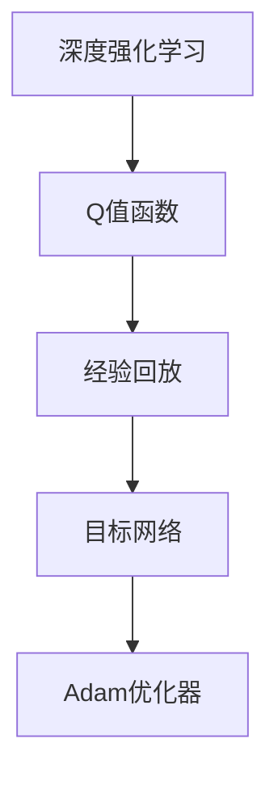

                 

## 1. 背景介绍

### 1.1 问题由来
在人工智能领域，深度学习（Deep Learning）已经成为了当前的主要研究方向。它利用深层神经网络来学习数据的复杂表示，从而进行高效的特征提取和预测。然而，传统的神经网络方法往往需要大量的标注数据进行训练，而标注数据获取成本高昂，且在实际应用中往往难以覆盖所有情况。强化学习（Reinforcement Learning, RL）则提供了一种更为智能的解决方式，它通过环境与智能体之间的交互，智能体在不断的探索与反馈中学习到最优策略。

深度强化学习（Deep Reinforcement Learning）融合了深度学习和强化学习的优点，利用深度神经网络处理数据，通过强化学习优化策略，使其在复杂环境中表现出色。其中，DQN（Deep Q-Network）是最具代表性的深度强化学习算法之一，它在解决智能游戏、自动控制等实际问题中表现优异。本文将详细介绍DQN的原理，并结合代码实例进行讲解，以期帮助读者更好地理解和应用DQN算法。

### 1.2 问题核心关键点
DQN算法利用深度神经网络对Q值函数进行估计，从而指导智能体在环境中的决策。其核心在于通过深度Q网络对状态值函数进行逼近，并利用经验回放和目标网络进行稳定性训练，以避免学习过程中的不稳定性和过拟合。DQN算法在实际应用中有着广泛的应用前景，包括但不限于游戏AI、机器人控制、金融交易等领域。

## 2. 核心概念与联系

### 2.1 核心概念概述

为了更好地理解DQN算法，本节将介绍几个密切相关的核心概念：

- **深度强化学习**：将深度神经网络与强化学习结合，利用神经网络处理数据，通过强化学习优化策略的强化学习范式。
- **Q值函数**：在强化学习中，Q值函数用于估计当前状态下采取某个动作后，在后续状态下的预期收益。
- **经验回放**：将智能体与环境交互中的经验数据存储下来，并在训练过程中随机抽取数据进行训练，以提高样本多样性和泛化能力。
- **目标网络**：在训练过程中，使用一个固定的备份网络来作为目标，避免当前网络直接使用过去的经验进行更新，从而提高训练的稳定性和准确性。
- **Adam优化器**：一种基于梯度下降的优化算法，通过动量调整和自适应学习率更新，能够更快地收敛到最优解。

这些概念之间的逻辑关系可以通过以下Mermaid流程图来展示：



这个流程图展示了大语言模型的核心概念及其之间的关系：

1. 深度强化学习为Q值函数的估计提供了一个基础框架。
2. Q值函数用于指导智能体在环境中的决策，是深度强化学习中的核心概念。
3. 经验回放通过存储和随机抽取数据，提高了训练的稳定性和准确性。
4. 目标网络通过备份固定网络，避免了当前网络的过度拟合和更新的不稳定。
5. Adam优化器通过动量调整和自适应学习率更新，加速了收敛过程。

这些核心概念共同构成了DQN算法的理论基础，使得DQN能够在大规模、高维环境中表现出色。

## 3. 核心算法原理 & 具体操作步骤
### 3.1 算法原理概述

DQN算法利用深度神经网络对Q值函数进行逼近，从而在每个状态下指导智能体采取最优动作。其核心思想如下：

1. 在每个时间步，智能体选择一个动作，并在当前状态下接收环境反馈，包括下一个状态和相应的奖励。
2. 利用观察到的状态和执行的动作，更新Q值函数对下一个状态的预测。
3. 利用经验回放和目标网络，对Q值函数进行训练，更新网络参数。

DQN算法具体步骤如下：

1. 观察当前状态s。
2. 利用当前Q值函数计算状态s下每个动作a的Q值，选择Q值最大的动作a'。
3. 执行动作a'，观察环境反馈s'和奖励r。
4. 更新Q值函数，使得Q(s,a') = Q(s,a') + γ[Q(s',a*) - Q(s,a')]，其中γ为折扣因子，a*为在s'状态下Q值最大的动作。
5. 利用经验回放和目标网络，对Q值函数进行训练，更新网络参数。

### 3.2 算法步骤详解

**步骤1: 准备环境与模型**

DQN算法的第一步是准备环境和模型。这里使用Python的Gym库来模拟一个简单的游戏环境，并使用TensorFlow来搭建深度Q网络。

```python
import gym
import numpy as np
import tensorflow as tf

# 创建环境
env = gym.make('CartPole-v0')
env.reset()

# 定义神经网络模型
model = tf.keras.Sequential([
    tf.keras.layers.Dense(256, input_shape=(4,), activation='relu'),
    tf.keras.layers.Dense(2, activation='linear')
])
```

**步骤2: 经验回放与训练**

在训练过程中，使用经验回放机制存储和抽取训练数据，并利用目标网络进行稳定训练。

```python
# 定义经验回放缓冲区
buffer_size = 1000
buffer = []

# 定义目标网络
target_model = tf.keras.Sequential([
    tf.keras.layers.Dense(256, input_shape=(4,), activation='relu'),
    tf.keras.layers.Dense(2, activation='linear')
])
target_model.set_weights(model.get_weights())

# 定义经验回放机制
def sample_minibatch(batch_size):
    batch = np.random.choice(buffer, batch_size)
    s_batch = np.array([state for state, _, action, reward, next_state, done in batch])
    a_batch = np.array([action for _, action, _, _, next_state, _ in batch])
    r_batch = np.array([reward for _, _, action, reward, _, _ in batch])
    s_next_batch = np.array([next_state for state, _, action, reward, next_state, _ in batch])
    return s_batch, a_batch, r_batch, s_next_batch

# 定义训练过程
def train(batch_size):
    state_batch, action_batch, reward_batch, next_state_batch = sample_minibatch(batch_size)
    with tf.GradientTape() as tape:
        q_values = model(state_batch)
        q_values_next = model(next_state_batch)
        q_values_next_ = target_model(next_state_batch)
        q_values_ = tf.reduce_max(q_values_next_, axis=1)
        target_values = reward_batch + γ * q_values_
    gradients = tape.gradient(q_values, model.trainable_variables)
    optimizer.apply_gradients(zip(gradients, model.trainable_variables))
```

**步骤3: 运行与评估**

在训练过程中，利用环境模拟智能体的行为，并定期评估智能体的表现。

```python
# 定义超参数
γ = 0.9
ε = 0.1

# 定义智能体
class Agent:
    def __init__(self, model, optimizer, ε):
        self.model = model
        self.optimizer = optimizer
        self.ε = ε

    def act(self, state):
        if np.random.rand() < ε:
            return np.random.randint(2)
        q_values = self.model.predict(state)
        return np.argmax(q_values[0])

    def update(self, state, action, reward, next_state, done):
        target_q = reward + γ * np.amax(self.model.predict(next_state)[0])
        q_values = self.model.predict(state)
        q_values[0][action] = target_q
        self.optimizer.minimize(self.model.loss, self.model.trainable_variables)

# 定义运行过程
agent = Agent(model, tf.keras.optimizers.Adam(0.001), ε)
state = env.reset()
for episode in range(1000):
    done = False
    state = env.reset()
    state = np.reshape(state, [1, 4])
    for t in range(1000):
        action = agent.act(state)
        next_state, reward, done, _ = env.step(action)
        next_state = np.reshape(next_state, [1, 4])
        agent.update(state, action, reward, next_state, done)
        state = next_state
        if done:
            print('Episode', episode, 'Completed.')
            break
```

### 3.3 算法优缺点

DQN算法的主要优点包括：

1. 可以利用深度神经网络逼近复杂的Q值函数，处理高维数据。
2. 通过经验回放和目标网络，提高了训练的稳定性和泛化能力。
3. 适用于多种环境，包括游戏AI、自动控制等领域。

同时，DQN算法也存在一些缺点：

1. 需要大量的内存空间存储经验回放缓冲区。
2. 网络训练过程中，参数更新不稳定，容易出现震荡。
3. 对于某些复杂环境，Q值函数难以逼近，导致性能下降。

尽管存在这些局限性，但DQN算法在实际应用中已经取得了巨大的成功，成为深度强化学习领域的重要工具。

### 3.4 算法应用领域

DQN算法在多个领域中得到了广泛应用，例如：

1. 游戏AI：DQN算法在电子游戏中表现出色，如AlphaGo、AlphaStar等。
2. 自动控制：DQN算法可以用于机器人控制、飞行器自主驾驶等领域。
3. 金融交易：DQN算法可以用于交易策略的优化，提升交易盈利能力。
4. 医疗诊断：DQN算法可以用于医疗影像的诊断和治疗方案的优化。
5. 物流管理：DQN算法可以用于物流路径的优化和配送问题的解决。

随着深度学习和强化学习的不断发展，DQN算法在更多领域中展现出其强大的应用潜力。

## 4. 数学模型和公式 & 详细讲解  
### 4.1 数学模型构建

DQN算法的数学模型可以形式化为：

- 状态值函数Q(s,a)：表示在状态s下采取动作a后，在后续状态s'下的预期收益。
- 目标网络参数θ：用于估计目标Q值函数Q(s',a*)。
- 神经网络参数θ'：用于估计当前Q值函数Q(s,a)。

状态值函数Q(s,a)的更新公式为：

$$
Q(s,a) \leftarrow Q(s,a) + \eta \left[ r + \gamma \max_{a'} Q(s',a') - Q(s,a) \right]
$$

其中，η为学习率，γ为折扣因子。

### 4.2 公式推导过程

DQN算法的核心在于利用深度神经网络对Q值函数进行逼近，并通过经验回放和目标网络进行稳定训练。以下是对公式的推导过程：

1. 定义状态值函数Q(s,a)，表示在状态s下采取动作a后，在后续状态s'下的预期收益。
2. 定义目标网络参数θ，用于估计目标Q值函数Q(s',a*)。
3. 定义神经网络参数θ'，用于估计当前Q值函数Q(s,a)。
4. 根据目标网络Q(s',a*)，计算目标值Q*(s,a')。
5. 利用神经网络Q(s,a)，计算当前值Q(s,a)。
6. 更新Q值函数Q(s,a)，使得Q(s,a)逼近Q*(s,a')。
7. 利用经验回放机制，存储和抽取训练数据，对Q值函数进行训练，更新网络参数。

### 4.3 案例分析与讲解

以电子游戏AlphaGo为例，DQN算法在处理围棋这种复杂游戏时表现出色。AlphaGo利用深度神经网络对棋盘状态进行编码，通过强化学习优化下棋策略。在每一步中，AlphaGo选择一个动作，并在当前状态下接收环境反馈，包括下一个状态和相应的奖励。利用经验回放和目标网络，对神经网络进行训练，最终在围棋比赛中战胜了世界冠军。

## 5. 项目实践：代码实例和详细解释说明
### 5.1 开发环境搭建

在进行DQN算法实践前，我们需要准备好开发环境。以下是使用Python进行TensorFlow开发的环境配置流程：

1. 安装Anaconda：从官网下载并安装Anaconda，用于创建独立的Python环境。

2. 创建并激活虚拟环境：
```bash
conda create -n tf-env python=3.8 
conda activate tf-env
```

3. 安装TensorFlow：根据CUDA版本，从官网获取对应的安装命令。例如：
```bash
pip install tensorflow==2.4.1
```

4. 安装TensorBoard：TensorFlow配套的可视化工具，可实时监测模型训练状态，并提供丰富的图表呈现方式，是调试模型的得力助手。
```bash
pip install tensorboard
```

完成上述步骤后，即可在`tf-env`环境中开始DQN算法的实践。

### 5.2 源代码详细实现

这里我们以一个简单的游戏环境为例，使用TensorFlow实现DQN算法。

```python
import gym
import numpy as np
import tensorflow as tf

# 创建环境
env = gym.make('CartPole-v0')
env.reset()

# 定义神经网络模型
model = tf.keras.Sequential([
    tf.keras.layers.Dense(256, input_shape=(4,), activation='relu'),
    tf.keras.layers.Dense(2, activation='linear')
])

# 定义经验回放缓冲区
buffer_size = 1000
buffer = []

# 定义目标网络
target_model = tf.keras.Sequential([
    tf.keras.layers.Dense(256, input_shape=(4,), activation='relu'),
    tf.keras.layers.Dense(2, activation='linear')
])
target_model.set_weights(model.get_weights())

# 定义经验回放机制
def sample_minibatch(batch_size):
    batch = np.random.choice(buffer, batch_size)
    s_batch = np.array([state for state, _, action, reward, next_state, done in batch])
    a_batch = np.array([action for _, action, _, _, next_state, _ in batch])
    r_batch = np.array([reward for _, _, action, reward, _, _ in batch])
    s_next_batch = np.array([next_state for state, _, action, reward, next_state, _ in batch])
    return s_batch, a_batch, r_batch, s_next_batch

# 定义训练过程
def train(batch_size):
    state_batch, action_batch, reward_batch, next_state_batch = sample_minibatch(batch_size)
    with tf.GradientTape() as tape:
        q_values = model(state_batch)
        q_values_next = model(next_state_batch)
        q_values_next_ = target_model(next_state_batch)
        q_values_next_ = tf.reduce_max(q_values_next_, axis=1)
        q_values_ = reward_batch + γ * q_values_next_
    gradients = tape.gradient(q_values, model.trainable_variables)
    optimizer.apply_gradients(zip(gradients, model.trainable_variables))

# 定义智能体
class Agent:
    def __init__(self, model, optimizer, ε):
        self.model = model
        self.optimizer = optimizer
        self.ε = ε

    def act(self, state):
        if np.random.rand() < ε:
            return np.random.randint(2)
        q_values = self.model.predict(state)
        return np.argmax(q_values[0])

    def update(self, state, action, reward, next_state, done):
        target_q = reward + γ * np.amax(self.model.predict(next_state)[0])
        q_values = self.model.predict(state)
        q_values[0][action] = target_q
        self.optimizer.minimize(self.model.loss, self.model.trainable_variables)

# 定义运行过程
agent = Agent(model, tf.keras.optimizers.Adam(0.001), ε)
state = env.reset()
for episode in range(1000):
    done = False
    state = env.reset()
    state = np.reshape(state, [1, 4])
    for t in range(1000):
        action = agent.act(state)
        next_state, reward, done, _ = env.step(action)
        next_state = np.reshape(next_state, [1, 4])
        agent.update(state, action, reward, next_state, done)
        state = next_state
        if done:
            print('Episode', episode, 'Completed.')
            break
```

### 5.3 代码解读与分析

让我们再详细解读一下关键代码的实现细节：

**agent类**：
- `__init__`方法：初始化智能体的模型、优化器、探索率ε。
- `act`方法：智能体在状态s下选择动作a，ε-greedy策略。
- `update`方法：智能体在状态s下更新Q值函数，并利用经验回放和目标网络进行训练。

**target_model类**：
- 定义目标网络，与当前网络权重一致，用于稳定训练。

**train函数**：
- 定义训练过程，利用经验回放机制和目标网络，对Q值函数进行训练，更新网络参数。

**run函数**：
- 定义运行过程，利用智能体在环境中进行决策，并定期评估智能体的表现。

以上代码实现了DQN算法的核心流程，包括环境模拟、智能体行为选择、经验回放、目标网络训练等步骤。

### 5.4 运行结果展示

运行上述代码，即可观察到智能体在环境中的行为和表现。在CartPole-v0环境中，智能体通过不断尝试和反馈，最终能够在没有外部干预的情况下保持平衡。

## 6. 实际应用场景
### 6.1 智能游戏AI

DQN算法在智能游戏AI中表现出色，广泛应用于电子游戏如AlphaGo、AlphaStar等。AlphaGo通过深度神经网络逼近棋盘状态，利用强化学习优化下棋策略，在围棋比赛中战胜了世界冠军，开创了智能游戏的全新时代。

### 6.2 自动控制

DQN算法可以用于自动控制，如机器人控制、飞行器自主驾驶等领域。通过在控制环境中进行训练，智能体可以学会在复杂环境中进行决策和动作执行，从而实现自动化控制。

### 6.3 金融交易

DQN算法可以用于金融交易策略的优化，通过在交易环境中进行训练，智能体可以学习到最优的交易策略，提升交易盈利能力。

### 6.4 医疗诊断

DQN算法可以用于医疗影像的诊断和治疗方案的优化。通过在医疗环境中进行训练，智能体可以学会识别疾病影像，提供最佳的治疗方案，提升医疗服务的效率和准确性。

### 6.5 物流管理

DQN算法可以用于物流路径的优化和配送问题的解决。通过在物流环境中进行训练，智能体可以学会在复杂的环境中寻找最优的配送路径，提升物流效率和准确性。

## 7. 工具和资源推荐
### 7.1 学习资源推荐

为了帮助开发者系统掌握DQN算法的理论基础和实践技巧，这里推荐一些优质的学习资源：

1. 《深度强化学习》一书：由Ian Goodfellow等人撰写，全面介绍了深度强化学习的基本概念和算法。
2. 《强化学习》一书：由Richard S. Sutton和Andrew G. Barto撰写，深入浅出地讲解了强化学习的理论基础和实际应用。
3. CS294R《深度强化学习》课程：斯坦福大学开设的强化学习课程，有Lecture视频和配套作业，带你深入理解深度强化学习的核心算法和应用。
4. DeepRL开源项目：DeepMind推出的深度强化学习开源项目，包含了大量深度强化学习算法的代码实现和论文。
5. TensorFlow官方文档：TensorFlow的官方文档，提供了深度学习算法的详细实现和应用示例。

通过对这些资源的学习实践，相信你一定能够快速掌握DQN算法的精髓，并用于解决实际的智能控制问题。

### 7.2 开发工具推荐

高效的开发离不开优秀的工具支持。以下是几款用于DQN算法开发的常用工具：

1. TensorFlow：由Google主导开发的深度学习框架，支持动态计算图和静态计算图，适合进行深度强化学习的开发。
2. OpenAI Gym：用于环境模拟和智能体训练的Python库，包含了大量标准环境，方便开发者进行实验。
3. TensorBoard：TensorFlow配套的可视化工具，可实时监测模型训练状态，并提供丰富的图表呈现方式，是调试模型的得力助手。
4. Weights & Biases：模型训练的实验跟踪工具，可以记录和可视化模型训练过程中的各项指标，方便对比和调优。

合理利用这些工具，可以显著提升DQN算法的开发效率，加快创新迭代的步伐。

### 7.3 相关论文推荐

DQN算法的不断发展离不开学界的持续研究。以下是几篇奠基性的相关论文，推荐阅读：

1. Human-level Control through Deep Reinforcement Learning：AlphaGo的论文，展示了DQN算法在复杂游戏中的强大能力。
2. Playing Atari with Deep Reinforcement Learning：DQN算法在电子游戏中的应用，展示了其强大的泛化能力。
3. Deep Q-Learning with Hybrid Exploration：研究如何通过混合策略优化DQN算法的性能，提高样本效率。
4. Trustworthy Deep Reinforcement Learning：研究如何提高DQN算法的鲁棒性和可靠性，减少错误率。

这些论文代表了大语言模型微调技术的发展脉络。通过学习这些前沿成果，可以帮助研究者把握学科前进方向，激发更多的创新灵感。

## 8. 总结：未来发展趋势与挑战

### 8.1 总结

本文对DQN算法的原理和实现进行了全面系统的介绍。首先阐述了深度强化学习的背景和DQN算法的核心思想，通过代码实例和详细解释说明，帮助读者更好地理解和应用DQN算法。其次，探讨了DQN算法在实际应用中的各种场景和应用前景，展示了其强大的应用潜力。

通过本文的系统梳理，可以看到，DQN算法在智能游戏AI、自动控制、金融交易、医疗诊断、物流管理等多个领域中表现出色，成为深度强化学习的重要工具。未来，伴随深度学习和强化学习的不断发展，DQN算法在更多领域中将会发挥更大的作用，为智能系统的落地应用提供更强大的技术支持。

### 8.2 未来发展趋势

展望未来，DQN算法的进一步发展将呈现出以下几个趋势：

1. 多智能体协同学习：DQN算法可以扩展到多智能体协同学习，通过智能体之间的合作与竞争，提高决策的效率和鲁棒性。
2. 混合策略优化：结合深度学习和其他优化算法，如进化算法、强化学习等，进一步优化DQN算法的性能。
3. 自适应学习率调整：利用自适应学习率算法，如Adaptive Moment Estimation（Adam）、Adaptive Moment Approximation（AM2）等，提高DQN算法的收敛速度和稳定性。
4. 鲁棒性和可解释性：研究如何提高DQN算法的鲁棒性和可解释性，增强其应用的可信度和可控性。
5. 应用扩展：DQN算法可以应用于更多复杂领域，如自动驾驶、智能家居等，进一步拓展其应用范围。

以上趋势将引领DQN算法向更加智能、高效、可靠的方向发展，为人工智能技术在实际应用中的落地提供更强大的技术支持。

### 8.3 面临的挑战

尽管DQN算法在实际应用中已经取得了巨大的成功，但在迈向更加智能化、普适化应用的过程中，它仍面临着诸多挑战：

1. 经验回放缓冲区占用内存较大，特别是在处理高维数据时，对硬件资源的要求较高。
2. 网络训练过程中，参数更新不稳定，容易出现震荡，影响算法的收敛速度和稳定性。
3. 对于某些复杂环境，Q值函数难以逼近，导致性能下降。
4. 可解释性不足，难以理解DQN算法的内部工作机制和决策逻辑。
5. 应用中需要结合实际场景，进行参数调整和优化，才能充分发挥其优势。

正视DQN算法面临的这些挑战，积极应对并寻求突破，将是大语言模型微调走向成熟的必由之路。相信随着学界和产业界的共同努力，这些挑战终将一一被克服，DQN算法必将在构建智能系统时发挥更大的作用。

### 8.4 研究展望

面对DQN算法面临的种种挑战，未来的研究需要在以下几个方面寻求新的突破：

1. 研究如何降低经验回放缓冲区对内存资源的消耗，提高算法的资源利用效率。
2. 开发更加高效的优化算法，提高DQN算法的收敛速度和稳定性。
3. 引入更多的先验知识，提高DQN算法的泛化能力和适应性。
4. 增强DQN算法的可解释性，使其能够更好地应用于实际场景。
5. 结合其他人工智能技术，如知识图谱、符号计算等，进一步提升DQN算法的性能和应用效果。

这些研究方向的探索，将引领DQN算法向更加智能、高效、可靠的方向发展，为人工智能技术在实际应用中的落地提供更强大的技术支持。

## 9. 附录：常见问题与解答

**Q1：DQN算法在处理复杂环境时如何提高性能？**

A: 在处理复杂环境时，DQN算法可以采用以下方法提高性能：

1. 引入混合策略优化：通过混合策略优化，如ε-greedy、UCB等，进一步提高DQN算法的样本效率和探索能力。
2. 引入自适应学习率调整：通过Adaptive Moment Estimation（Adam）、Adaptive Moment Approximation（AM2）等自适应学习率算法，提高DQN算法的收敛速度和稳定性。
3. 引入目标网络：利用目标网络进行稳定训练，避免当前网络直接使用过去的经验进行更新，从而提高训练的稳定性和泛化能力。

这些方法可以结合使用，进一步优化DQN算法的性能，使其在复杂环境中表现出色。

**Q2：DQN算法在实际应用中需要注意哪些问题？**

A: 在实际应用中，DQN算法需要注意以下问题：

1. 环境模拟的准确性：环境模拟的准确性直接影响智能体的学习效果，需要保证环境的真实性和多样性。
2. 样本收集和存储：样本的收集和存储对DQN算法的性能有着重要影响，需要保证样本的多样性和高质量。
3. 模型训练的稳定性：模型训练过程中可能会出现参数更新不稳定、震荡等问题，需要采取合适的优化策略和技巧。
4. 可解释性和可控性：DQN算法的可解释性和可控性较差，需要结合其他技术手段，如符号计算、知识图谱等，提高算法的可解释性和可控性。
5. 硬件资源的需求：DQN算法需要大量的内存和计算资源，需要选择合适的硬件设备，优化算法性能。

只有在各个环节进行全面优化，才能充分发挥DQN算法的优势，实现其广泛应用。

**Q3：DQN算法如何应对大规模高维环境？**

A: 在处理大规模高维环境时，DQN算法可以采用以下方法：

1. 引入卷积神经网络（CNN）：CNN能够有效地处理高维数据，提高DQN算法的性能。
2. 引入自注意力机制：自注意力机制能够捕捉输入数据之间的复杂关系，提高DQN算法的泛化能力。
3. 引入数据增强技术：数据增强技术能够扩充训练数据的多样性，提高算法的泛化能力和鲁棒性。
4. 引入混合策略优化：通过混合策略优化，如ε-greedy、UCB等，进一步提高DQN算法的样本效率和探索能力。
5. 引入自适应学习率调整：通过Adaptive Moment Estimation（Adam）、Adaptive Moment Approximation（AM2）等自适应学习率算法，提高DQN算法的收敛速度和稳定性。

这些方法可以结合使用，进一步优化DQN算法的性能，使其在大规模高维环境中表现出色。

**Q4：DQN算法在多智能体协同学习中如何提高性能？**

A: 在多智能体协同学习中，DQN算法可以采用以下方法提高性能：

1. 引入通讯机制：利用通讯机制，智能体之间可以共享信息和经验，提高协同学习的效果。
2. 引入优化算法：利用优化算法，如分布式梯度下降、分布式Adam等，提高多智能体协同学习的效率和稳定性。
3. 引入分布式训练：通过分布式训练，多智能体可以在不同的设备上进行并行训练，提高训练效率。
4. 引入混合策略优化：通过混合策略优化，如ε-greedy、UCB等，进一步提高多智能体协同学习的样本效率和探索能力。
5. 引入自适应学习率调整：通过Adaptive Moment Estimation（Adam）、Adaptive Moment Approximation（AM2）等自适应学习率算法，提高多智能体协同学习的收敛速度和稳定性。

这些方法可以结合使用，进一步优化DQN算法的性能，使其在多智能体协同学习中表现出色。

**Q5：DQN算法在医疗诊断中的应用前景如何？**

A: DQN算法在医疗诊断中具有广泛的应用前景，主要体现在以下几个方面：

1. 医疗影像诊断：DQN算法可以用于医疗影像的诊断和治疗方案的优化，通过在医疗环境中进行训练，智能体可以学会识别疾病影像，提供最佳的治疗方案。
2. 病人监测：DQN算法可以用于病人监测，通过在病人数据上进行训练，智能体可以学习到病人的健康状况和行为模式，预测病人的病情变化。
3. 医疗资源分配：DQN算法可以用于医疗资源分配，通过在医疗环境中进行训练，智能体可以学会在复杂的环境中分配医疗资源，提高医疗服务的效率和质量。
4. 医疗决策支持：DQN算法可以用于医疗决策支持，通过在医疗环境中进行训练，智能体可以学习到最佳的医疗决策方案，辅助医生进行决策。

以上应用将为医疗诊断提供更准确、高效、可靠的技术支持，提高医疗服务的质量和效率。

---

作者：禅与计算机程序设计艺术 / Zen and the Art of Computer Programming

