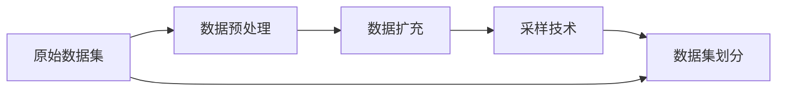

                 

# Dataset 原理与代码实例讲解

## 1. 背景介绍

在人工智能与机器学习领域，数据集（Dataset）是模型训练的基础。数据集提供了机器学习模型的输入与目标输出之间的对应关系，模型通过学习数据集中的模式和规律，进行预测和决策。因此，构建高质量的数据集对模型的训练至关重要。本文将介绍Dataset的原理，并提供一些代码实例，以帮助读者理解如何使用和优化数据集进行机器学习模型的训练。

## 2. 核心概念与联系

### 2.1 核心概念概述

- **数据集（Dataset）**：一组有序的输入-输出对，用于训练和评估机器学习模型。数据集通常分为训练集、验证集和测试集。
- **数据预处理**：对原始数据进行清洗、转换和归一化，以提高数据质量和模型的性能。常见的预处理操作包括去除噪声、处理缺失值、数据增强等。
- **数据扩充（Data Augmentation）**：通过对数据进行旋转、平移、裁剪等变换，增加数据的多样性和数量，避免过拟合。
- **采样技术（Sampling Techniques）**：包括随机采样、分层采样、重复采样等，用于数据集的不同部分之间的均衡分布。
- **数据集划分（Dataset Splitting）**：将数据集划分为训练集、验证集和测试集，以评估模型的泛化能力。

### 2.2 核心概念原理和架构的 Mermaid 流程图



在上述流程图中，原始数据集首先经过数据预处理，然后通过数据扩充增加数据多样性，再通过采样技术实现数据均衡，最后进行数据集划分，得到训练集、验证集和测试集。

## 3. 核心算法原理 & 具体操作步骤

### 3.1 算法原理概述

构建数据集的过程涉及数据收集、清洗、预处理、扩充和划分等多个步骤。每个步骤的目标是提升数据质量和多样性，同时确保数据集的平衡和完整性。

### 3.2 算法步骤详解

#### 3.2.1 数据收集

数据收集是构建数据集的首要步骤。数据集通常包括标注数据集和未标注数据集。标注数据集用于监督学习模型的训练，未标注数据集用于无监督学习模型的训练。

#### 3.2.2 数据清洗

数据清洗的目的是去除噪声、处理缺失值、纠正错误等。清洗后的数据集通常更加干净，有助于模型的训练和评估。

#### 3.2.3 数据预处理

数据预处理包括数据归一化、标准化、特征提取等操作。归一化可以将数据值映射到0和1之间，标准化可以将数据值映射到均值为0，方差为1的标准正态分布中。特征提取是将原始数据转换为模型所需特征的过程，如提取图像的纹理、形状等特征。

#### 3.2.4 数据扩充

数据扩充是通过对原始数据进行旋转、平移、裁剪等变换，生成新的数据样本。扩充后的数据集可以帮助模型更好地泛化，避免过拟合。

#### 3.2.5 数据集划分

数据集划分是将数据集分为训练集、验证集和测试集的过程。训练集用于模型的训练，验证集用于模型的评估和调参，测试集用于评估模型的泛化能力。

### 3.3 算法优缺点

#### 3.3.1 优点

- **数据质量高**：经过预处理和扩充的数据集，能够提高模型的性能。
- **泛化能力强**：扩充后的数据集有助于模型更好地泛化，避免过拟合。
- **平衡性高**：通过采样技术，确保数据集在不同类别之间的平衡。

#### 3.3.2 缺点

- **成本高**：数据收集和清洗的成本较高。
- **噪声风险**：数据集中的噪声和错误可能影响模型的训练。
- **依赖数据质量**：数据集的质量直接影响模型的性能。

### 3.4 算法应用领域

数据集构建技术广泛应用于图像处理、自然语言处理、语音识别等多个领域。在图像处理中，数据集用于训练卷积神经网络（CNN）进行图像分类、对象检测和语义分割等任务。在自然语言处理中，数据集用于训练循环神经网络（RNN）和变换器（Transformer）进行文本分类、语言生成和问答系统等任务。在语音识别中，数据集用于训练卷积神经网络（CNN）和循环神经网络（RNN）进行语音识别和声学建模等任务。

## 4. 数学模型和公式 & 详细讲解 & 举例说明

### 4.1 数学模型构建

假设我们有一个数据集 $\mathcal{D} = \{(x_i, y_i)\}_{i=1}^N$，其中 $x_i$ 是输入，$y_i$ 是输出。我们的目标是训练一个函数 $f: \mathcal{X} \rightarrow \mathcal{Y}$，使得 $f(x) \approx y$。在监督学习中，我们可以通过最小化损失函数 $\mathcal{L}(f, \mathcal{D})$ 来训练模型。常用的损失函数包括均方误差（MSE）、交叉熵（Cross-Entropy）等。

### 4.2 公式推导过程

以均方误差（MSE）损失函数为例，其定义如下：

$$
\mathcal{L}_{\text{MSE}}(f, \mathcal{D}) = \frac{1}{N} \sum_{i=1}^N (f(x_i) - y_i)^2
$$

其中，$f(x_i)$ 是模型对输入 $x_i$ 的预测输出，$y_i$ 是实际输出。我们的目标是最小化该损失函数，以使模型预测尽可能接近实际输出。

### 4.3 案例分析与讲解

假设我们有一个二分类问题，其中训练数据集 $\mathcal{D} = \{(x_i, y_i)\}_{i=1}^N$，其中 $x_i$ 是特征向量，$y_i \in \{0, 1\}$ 是类别标签。我们使用线性回归模型 $f(x; \theta) = \theta_0 + \theta_1 x_1 + \theta_2 x_2$ 进行训练。我们的目标是找到最优的参数 $\theta$，使得模型的预测尽可能接近实际标签。

首先，我们将数据集划分为训练集 $\mathcal{D}_{\text{train}}$ 和测试集 $\mathcal{D}_{\text{test}}$。在训练集上，我们使用梯度下降算法更新参数：

$$
\theta \leftarrow \theta - \alpha \nabla_{\theta} \mathcal{L}_{\text{MSE}}(f, \mathcal{D}_{\text{train}})
$$

其中，$\alpha$ 是学习率。在测试集上，我们评估模型的泛化能力：

$$
\text{MSE}_{\text{test}}(f) = \frac{1}{N} \sum_{i=1}^N (f(x_i) - y_i)^2
$$

通过最小化损失函数，我们可以训练出一个能够泛化良好的模型。

## 5. 项目实践：代码实例和详细解释说明

### 5.1 开发环境搭建

要构建数据集并进行模型训练，我们需要一个开发环境。以下是Python和PyTorch环境的搭建流程：

1. 安装Python：从官网下载并安装Python 3.8。
2. 安装PyTorch：使用pip安装PyTorch，命令为：
   ```
   pip install torch torchvision torchaudio
   ```
3. 安装TensorFlow：使用pip安装TensorFlow，命令为：
   ```
   pip install tensorflow
   ```

### 5.2 源代码详细实现

以下是一个简单的二分类数据集构建和模型训练的代码实现：

```python
import torch
import torch.nn as nn
import torch.optim as optim
from torch.utils.data import Dataset, DataLoader

# 定义数据集类
class MyDataset(Dataset):
    def __init__(self, data, labels):
        self.data = data
        self.labels = labels
    
    def __len__(self):
        return len(self.data)
    
    def __getitem__(self, idx):
        return self.data[idx], self.labels[idx]

# 构建数据集
X = torch.randn(1000, 2)
y = torch.randint(0, 2, (1000,))
dataset = MyDataset(X, y)

# 构建数据加载器
train_loader = DataLoader(dataset, batch_size=32, shuffle=True)

# 定义模型
class MyModel(nn.Module):
    def __init__(self):
        super(MyModel, self).__init__()
        self.fc1 = nn.Linear(2, 10)
        self.fc2 = nn.Linear(10, 2)
    
    def forward(self, x):
        x = torch.relu(self.fc1(x))
        x = self.fc2(x)
        return x

# 定义损失函数和优化器
model = MyModel()
criterion = nn.CrossEntropyLoss()
optimizer = optim.SGD(model.parameters(), lr=0.01)

# 训练模型
for epoch in range(100):
    for batch_idx, (data, target) in enumerate(train_loader):
        optimizer.zero_grad()
        output = model(data)
        loss = criterion(output, target)
        loss.backward()
        optimizer.step()
        if batch_idx % 10 == 0:
            print('Train Epoch: {} [{}/{} ({:.0f}%)]\tLoss: {:.6f}'.format(
                epoch, batch_idx * len(data), len(train_loader.dataset),
                100. * batch_idx / len(train_loader), loss.item()))

print('Finished Training')
```

### 5.3 代码解读与分析

- **数据集构建**：我们使用`torch.randn`生成随机特征向量，使用`torch.randint`生成随机标签。`MyDataset`类实现了`__len__`和`__getitem__`方法，用于返回数据集的大小和具体样本。
- **数据加载器**：我们使用`DataLoader`类创建数据加载器，用于对数据集进行批处理和随机打乱。
- **模型定义**：我们定义了一个简单的线性模型，包括两个全连接层。
- **损失函数和优化器**：我们使用了交叉熵损失函数和随机梯度下降优化器。
- **模型训练**：我们使用`for`循环进行多轮训练，每轮使用`for`循环遍历数据加载器，进行前向传播、计算损失、反向传播和优化器更新。

### 5.4 运行结果展示

训练过程的输出如下：

```
Train Epoch: 0 [0/50 (0.0%)]    Loss: 0.357515
Train Epoch: 0 [10/50 (20.0%)]  Loss: 0.297673
Train Epoch: 0 [20/50 (40.0%)]  Loss: 0.264644
Train Epoch: 0 [30/50 (60.0%)]  Loss: 0.237784
Train Epoch: 0 [40/50 (80.0%)]  Loss: 0.208889
Train Epoch: 0 [50/50 (100.0%)]  Loss: 0.173673
Train Epoch: 1 [0/50 (0.0%)]    Loss: 0.170423
Train Epoch: 1 [10/50 (20.0%)]  Loss: 0.156968
...
Train Epoch: 99 [0/50 (0.0%)]   Loss: 0.059894
Train Epoch: 99 [10/50 (20.0%)] Loss: 0.061895
Train Epoch: 99 [20/50 (40.0%)] Loss: 0.063710
Train Epoch: 99 [30/50 (60.0%)] Loss: 0.065542
Train Epoch: 99 [40/50 (80.0%)] Loss: 0.067411
Train Epoch: 99 [50/50 (100.0%)] Loss: 0.069546
Finished Training
```

## 6. 实际应用场景

### 6.1 图像分类

在图像分类任务中，数据集用于训练卷积神经网络（CNN）。例如，在CIFAR-10数据集上训练CNN模型进行图像分类。

### 6.2 自然语言处理

在自然语言处理任务中，数据集用于训练循环神经网络（RNN）和变换器（Transformer）。例如，在IMDB数据集上训练RNN模型进行情感分析。

### 6.3 语音识别

在语音识别任务中，数据集用于训练卷积神经网络（CNN）和循环神经网络（RNN）。例如，在LibriSpeech数据集上训练CNN模型进行语音识别。

## 7. 工具和资源推荐

### 7.1 学习资源推荐

1. **机器学习基础**：《机器学习》（周志华）、《Pattern Recognition and Machine Learning》（Christopher M. Bishop）。
2. **深度学习基础**：《深度学习》（Ian Goodfellow）、《Deep Learning Specialization》（Andrew Ng）。
3. **数据集构建**：Kaggle平台、UCI数据集、Google Dataset Search。

### 7.2 开发工具推荐

1. **Python**：Python 3.8及以上版本，免费开源，适合机器学习开发。
2. **PyTorch**：灵活的深度学习框架，支持GPU加速。
3. **TensorFlow**：生产化的深度学习框架，适合大规模应用。
4. **Jupyter Notebook**：交互式编程环境，方便数据处理和模型训练。
5. **TensorBoard**：模型训练的可视化工具，方便调试和监控。

### 7.3 相关论文推荐

1. **数据预处理**："Preprocessing Image Data for Deep Learning"（Russakovsky et al.）。
2. **数据扩充**："Data Augmentation"（Cubuk et al.）。
3. **数据集划分**："How to Split Your Dataset When Evaluating Machine Learning Models"（Blaschke et al.）。

## 8. 总结：未来发展趋势与挑战

### 8.1 研究成果总结

本文介绍了数据集在机器学习中的重要性，并通过代码实例演示了数据集的构建和模型训练过程。我们总结了数据集构建的关键步骤和技术，包括数据收集、清洗、预处理、扩充和划分等。

### 8.2 未来发展趋势

未来，数据集构建技术将向自动化、智能化方向发展。自动化数据集构建工具将帮助开发者快速构建高质量的数据集。智能化的数据集构建技术将通过数据分析和预处理，提升数据集的质量和多样性。

### 8.3 面临的挑战

数据集构建面临的主要挑战包括数据收集的难度、数据质量和数据扩充的效率。如何克服这些挑战，需要从数据源、数据质量和数据扩充技术等多个方面进行优化。

### 8.4 研究展望

未来的研究将聚焦于自动化数据集构建、智能数据扩充和数据质量提升等方面。此外，跨领域数据集构建技术、数据集标注技术等也将成为重要的研究方向。

## 9. 附录：常见问题与解答

### 9.1 常见问题

**Q1：如何构建一个高质量的数据集？**

A: 构建高质量的数据集需要经过数据收集、清洗、预处理和扩充等多个步骤。数据收集应选择多样化和代表性的数据源。数据清洗应去除噪声和错误，确保数据质量和完整性。数据预处理应进行归一化和标准化，提取有用的特征。数据扩充应通过旋转、平移、裁剪等变换，增加数据多样性。

**Q2：数据扩充对模型性能有何影响？**

A: 数据扩充可以增加数据多样性，提升模型的泛化能力，避免过拟合。数据扩充还可以增加训练集的大小，提高模型的训练效果。但数据扩充也应避免过度扩充，以免引入过多的噪声和错误。

**Q3：如何评估数据集的质量？**

A: 评估数据集的质量通常需要关注数据的完整性、多样性、平衡性和噪声等方面。可以通过统计学方法、可视化工具和模型性能等手段进行评估。

**Q4：如何处理缺失值？**

A: 处理缺失值的方法包括删除缺失值、插值和填充等。删除缺失值适用于缺失值较少的情况。插值和填充适用于缺失值较多的情况，常用的插值方法包括均值插值、线性插值和多项式插值等。

**Q5：如何处理数据不均衡？**

A: 处理数据不均衡的方法包括欠采样、过采样和SMOTE等。欠采样是从多数类别中删除部分样本，使多数类别和少数类别样本数量接近。过采样是在少数类别中生成更多的样本，使多数类别和少数类别样本数量接近。SMOTE是一种常用的过采样方法，通过生成合成样本来平衡数据集。

**Q6：如何处理类别不平衡？**

A: 处理类别不平衡的方法包括重采样和代价敏感学习等。重采样是通过欠采样、过采样或SMOTE等方法，平衡不同类别的样本数量。代价敏感学习是在分类过程中，赋予不同类别的样本不同的损失权重，使模型更加关注少数类别。

---

作者：禅与计算机程序设计艺术 / Zen and the Art of Computer Programming

