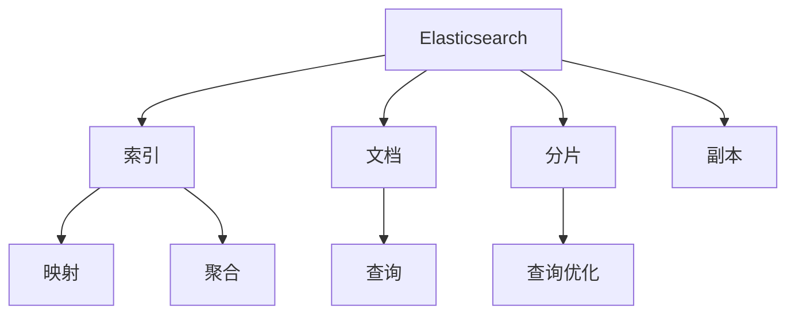

                 

# ES索引原理与代码实例讲解

> 关键词：Elasticsearch, 索引, 分片, 查询优化, 代码实现, 高可用性, 弹性伸缩

## 1. 背景介绍

### 1.1 问题由来
Elasticsearch (ES)是一款开源的分布式搜索与分析引擎，常用于全文本搜索、日志分析、监控系统等场景。作为一种分布式搜索引擎，ES的核心功能是将海量数据组织成可搜索的索引(index)，并提供高效的全文搜索、聚合分析、实时查询等功能。随着数据量的不断增长和业务需求的复杂化，索引设计、优化和维护成为了ES应用中的一个关键问题。本文旨在系统讲解Elasticsearch的索引原理，并通过代码实例对相关概念和操作进行深入分析，帮助读者理解如何设计高效、可扩展的Elasticsearch索引，并在实际项目中加以应用。

### 1.2 问题核心关键点
索引设计的好坏直接决定了Elasticsearch查询的性能和响应速度。一个优秀的索引设计可以显著提升ES的搜索和分析能力，而一个不合理的索引设计则可能导致查询效率低下，甚至影响系统的整体可用性。因此，深入理解索引原理、掌握索引设计技巧、学会索引维护方法，是每个ES开发者必备的技能。

### 1.3 问题研究意义
良好的索引设计不仅能提升查询效率，还能带来更好的资源利用率、更高的数据一致性。通过合理设计索引，可以在数据量增长的同时，保持系统性能的稳定，甚至通过扩展索引节点，实现系统的弹性伸缩和持续增长。本文将通过详细的理论分析和实际案例，帮助读者掌握Elasticsearch索引的设计与优化技巧，为构建高效、可扩展的Elasticsearch应用奠定坚实基础。

## 2. 核心概念与联系

### 2.1 核心概念概述

为更好地理解Elasticsearch的索引原理，本节将介绍几个密切相关的核心概念：

- Elasticsearch: 一款开源的分布式搜索与分析引擎，提供全文搜索、聚合分析、实时查询等功能。
- 索引(Index): Elasticsearch中最基本的存储单元，用于存储和检索文档。
- 文档(Document): 索引中保存的数据单元，可以包含任意类型的数据。
- 分片(Shard): 索引被划分为多个分片，每个分片独立存储和检索部分文档，可以跨节点分布。
- 副本(Replica): 每个分片可以设置多个副本，用于提高系统的可用性和故障恢复能力。
- 聚合(Aggregation): 用于对文档进行统计、分析和可视化，支持复杂的聚合逻辑。
- 映射(Mapping): 定义索引中文档的结构和属性，如字段类型、索引分片、搜索算法等。
- 查询(Query): 用于从索引中检索符合特定条件的文档，支持全文搜索、过滤、排序等功能。

这些核心概念之间的逻辑关系可以通过以下Mermaid流程图来展示：



这个流程图展示了大语言模型的核心概念及其之间的关系：

1. Elasticsearch通过索引管理文档的存储和检索。
2. 索引被划分为多个分片，以实现水平扩展。
3. 分片可以设置多个副本，以提高系统的高可用性和容错性。
4. 索引的映射定义了文档的结构和属性，是检索和聚合的基础。
5. 查询从索引中检索文档，可以通过过滤、排序、聚合等方式进行复杂的搜索逻辑。
6. 聚合对文档进行统计分析，可以生成多种类型的报表和可视化。

这些核心概念共同构成了Elasticsearch的搜索和分析能力，使其能够处理海量数据并快速响应查询请求。

## 3. 核心算法原理 & 具体操作步骤
### 3.1 算法原理概述

Elasticsearch索引的核心算法原理包括分片和副本管理、查询优化、索引维护等。这些原理是设计高效索引、优化查询性能的基础。

#### 3.1.1 分片和副本管理

Elasticsearch中的索引由多个分片组成，每个分片独立存储部分文档，并可以设置多个副本，提高系统的可用性和容错性。索引的分片和副本数是影响查询性能和系统扩展性的关键参数，需要根据数据量和查询负载进行合理配置。

#### 3.1.2 查询优化

Elasticsearch使用倒排索引(Inverted Index)实现文档的全文检索。倒排索引将每个词与其出现的文档ID建立映射关系，可以快速定位包含特定词的文档。查询优化包括查询重写、分词算法、缓存策略等，旨在提升查询速度和效率。

#### 3.1.3 索引维护

索引维护涉及索引的创建、更新、删除等操作，以及索引碎片、分片迁移、副本同步等管理任务。合理维护索引，可以有效提升系统的性能和可用性，延长索引的寿命。

### 3.2 算法步骤详解

Elasticsearch索引的设计和优化可以分为以下几个关键步骤：

**Step 1: 理解业务需求**
- 确定数据的存储和检索模式，如文档类型、字段类型、搜索算法等。
- 分析业务场景，明确查询和聚合的需求。

**Step 2: 设计索引结构**
- 选择合适的索引模板，定义索引类型、字段映射、分片设置等。
- 设计查询结构和聚合逻辑，优化查询效率。

**Step 3: 配置分片和副本**
- 根据数据量和查询负载，配置分片数和副本数。
- 设置副本同步机制，保证数据的实时性和一致性。

**Step 4: 优化查询性能**
- 优化查询结构，使用索引过滤器、缓存策略、分词算法等。
- 分析查询日志，识别性能瓶颈，优化索引配置。

**Step 5: 维护索引健康**
- 定期清理索引碎片，重新分配分片。
- 监控索引健康状态，及时修复故障。

### 3.3 算法优缺点

Elasticsearch索引设计的主要优点包括：

1. 水平扩展性强。通过分片机制，可以线性扩展索引存储和检索能力。
2. 高可用性。副本机制确保系统在部分节点故障时仍能正常运行。
3. 高弹性。可以快速增加或减少索引节点，支持系统的弹性伸缩。
4. 高效查询。使用倒排索引和查询优化算法，支持高效的全文搜索和聚合分析。

同时，也存在一些局限性：

1. 索引设计复杂。需要根据业务需求和数据特点，进行合理的索引结构设计。
2. 数据一致性问题。写入操作可能存在一定延迟，影响实时数据的准确性。
3. 系统维护复杂。需要持续监控和管理索引健康状态，避免性能瓶颈和故障。
4. 查询性能依赖于索引设计。索引设计不合理时，可能无法满足高并发查询需求。

尽管存在这些局限性，但Elasticsearch索引设计仍被广泛用于各种大数据应用，如搜索、分析、监控等。

### 3.4 算法应用领域

Elasticsearch索引广泛应用于各种需要全文搜索、数据分析和实时监控的场景，例如：

- 搜索引擎：如Amazon Search、Baidu、Google等，提供快速的全文搜索和推荐服务。
- 日志分析：如Splunk、ELK Stack（Elasticsearch、Logstash、Kibana），用于日志数据的存储和分析。
- 数据可视化：如Grafana、Kibana等，提供实时数据监控和可视化报表。
- 推荐系统：如Alibaba、Netflix等，用于用户行为分析和个性化推荐。
- 文本挖掘：如Sentiment Analysis、Entity Recognition等，用于自然语言处理和文本分析。

## 4. 数学模型和公式 & 详细讲解 & 举例说明

### 4.1 数学模型构建

Elasticsearch索引的核心是倒排索引(Inverted Index)，其数学模型基于倒排列表(Inverted List)和逆文档频率(Inverse Document Frequency, IDF)。倒排列表将每个词与其出现的文档ID建立映射关系，逆文档频率用于评估词的重要性。假设文档集合为 $D$，词汇表为 $V$，倒排列表为 $I$，则数学模型可以表示为：

$$
I = \{(v, p): v \in V, p \in P(v) \}
$$

其中 $p$ 是包含词 $v$ 的文档集合，$P(v)$ 表示 $v$ 的所有出现文档。

### 4.2 公式推导过程

Elasticsearch索引的查询优化过程主要依赖于以下几个公式：

1. 词频-逆文档频率(Term Frequency-Inverse Document Frequency, TF-IDF)公式：

$$
TF(t) = \frac{n_t}{\sum_{i=1}^n n_i}
$$

$$
IDF(t) = \log \frac{N}{\sum_{i=1}^n \delta(i,t)}
$$

其中 $n_t$ 表示词 $t$ 在文档 $d$ 中出现的次数，$n_i$ 表示词 $t$ 在所有文档中出现的总次数，$N$ 表示文档总数，$\delta(i,t)$ 表示词 $t$ 是否出现在文档 $i$ 中。

2. 查询重写公式：

$$
q_t = q \land (TF(t) \geq \theta)
$$

其中 $q$ 表示原始查询，$q_t$ 表示重写后的查询，$\theta$ 表示词频阈值。

3. 分词算法公式：

$$
T(k) = \frac{\text{token\_freq}(k)}{\sqrt{\text{length\_avg}(k) \times \text{tf\_avg}(k)}}
$$

其中 $T(k)$ 表示词汇 $k$ 的词频-长度因子，$\text{token\_freq}(k)$ 表示词汇 $k$ 的 token 频率，$\text{length\_avg}(k)$ 表示词汇 $k$ 的平均长度，$\text{tf\_avg}(k)$ 表示词汇 $k$ 的平均词频。

### 4.3 案例分析与讲解

以一个简单的搜索引擎为例，假设用户输入查询 "Elasticsearch 教程"，分析查询优化过程：

1. 分词：将查询分割成单词和短语，如 "Elasticsearch"、"教程"。
2. 词频计算：统计每个词在文档中出现的频率，如 "Elasticsearch" 在 100 篇文档中出现了 50 次，"教程" 在 20 篇文档中出现了 10 次。
3. 逆文档频率计算：计算每个词的 IDF 值，如 "Elasticsearch" 的 IDF 值为 0.5，"教程" 的 IDF 值为 0.6。
4. 查询重写：根据词频和 IDF 值，进行查询重写，如将查询 "Elasticsearch 教程" 重写为 "Elasticsearch" 和 "教程" 的 AND 运算，过滤低频词。
5. 分词算法：根据词汇的词频-长度因子，调整搜索结果排序，提升相关性。

## 5. 项目实践：代码实例和详细解释说明

### 5.1 开发环境搭建

在进行Elasticsearch索引实践前，我们需要准备好开发环境。以下是使用Python进行Elasticsearch开发的环境配置流程：

1. 安装Anaconda：从官网下载并安装Anaconda，用于创建独立的Python环境。

2. 创建并激活虚拟环境：
```bash
conda create -n elasticsearch-env python=3.8 
conda activate elasticsearch-env
```

3. 安装Elasticsearch：
```bash
pip install elasticsearch
```

4. 安装Flask：
```bash
pip install flask
```

5. 安装Gunicorn：
```bash
pip install gunicorn
```

6. 安装Gevent：
```bash
pip install gevent
```

完成上述步骤后，即可在`elasticsearch-env`环境中开始Elasticsearch索引的实践。

### 5.2 源代码详细实现

下面以一个简单的Elasticsearch索引设计为例，给出完整的代码实现。

首先，创建一个简单的索引模板，定义文档类型和字段映射：

```python
from elasticsearch import Elasticsearch, helpers

# 创建索引
es = Elasticsearch([{'host': 'localhost', 'port': 9200}])
create_index = {
    "settings": {
        "number_of_shards": 1,
        "number_of_replicas": 1
    },
    "mappings": {
        "properties": {
            "title": {"type": "text"},
            "content": {"type": "text"},
            "author": {"type": "text"}
        }
    }
}
es.indices.create(index="my_index", body=create_index)
```

然后，使用Flask框架搭建一个简单的Web接口，实现索引的CRUD操作：

```python
from flask import Flask, request, jsonify
from elasticsearch import Elasticsearch

app = Flask(__name__)

es = Elasticsearch([{'host': 'localhost', 'port': 9200}])

@app.route('/create', methods=['POST'])
def create_document():
    doc = request.json
    res = es.index(index="my_index", body=doc)
    return jsonify(res)

@app.route('/update', methods=['POST'])
def update_document():
    doc_id = request.json['_id']
    doc = request.json
    res = es.update(index="my_index", doc_type="_doc", id=doc_id, body={"doc": doc})
    return jsonify(res)

@app.route('/delete', methods=['DELETE'])
def delete_document():
    doc_id = request.json['_id']
    res = es.delete(index="my_index", doc_type="_doc", id=doc_id)
    return jsonify(res)

@app.route('/search', methods=['GET'])
def search_documents():
    query = request.args.get('query')
    res = es.search(index="my_index", body={"query": {"match": {"content": query}}})
    return jsonify(res)

if __name__ == '__main__':
    app.run(debug=True, port=5000)
```

上述代码中，`create_document`方法用于创建新文档，`update_document`方法用于更新已有文档，`delete_document`方法用于删除文档，`search_documents`方法用于搜索文档。每个方法都通过调用Elasticsearch的API接口实现索引操作。

### 5.3 代码解读与分析

以下是代码中几个关键部分的详细解读：

**Elasticsearch初始化：**
```python
es = Elasticsearch([{'host': 'localhost', 'port': 9200}])
```
通过指定主机和端口，初始化Elasticsearch客户端，用于连接Elasticsearch服务器。

**创建索引：**
```python
create_index = {
    "settings": {
        "number_of_shards": 1,
        "number_of_replicas": 1
    },
    "mappings": {
        "properties": {
            "title": {"type": "text"},
            "content": {"type": "text"},
            "author": {"type": "text"}
        }
    }
}
es.indices.create(index="my_index", body=create_index)
```
创建索引时，需要指定索引模板，定义索引类型、字段类型、分片设置等。这里定义了一个包含三个字段的文档类型，并设置了一个分片和零个副本。

**CRUD操作：**
```python
@app.route('/create', methods=['POST'])
def create_document():
    doc = request.json
    res = es.index(index="my_index", body=doc)
    return jsonify(res)

@app.route('/update', methods=['POST'])
def update_document():
    doc_id = request.json['_id']
    doc = request.json
    res = es.update(index="my_index", doc_type="_doc", id=doc_id, body={"doc": doc})
    return jsonify(res)

@app.route('/delete', methods=['DELETE'])
def delete_document():
    doc_id = request.json['_id']
    res = es.delete(index="my_index", doc_type="_doc", id=doc_id)
    return jsonify(res)
```
CRUD操作分别对应Elasticsearch的`index`、`update`和`delete`API接口。每个操作都接受JSON格式的请求数据，调用Elasticsearch API进行索引操作。

**搜索操作：**
```python
@app.route('/search', methods=['GET'])
def search_documents():
    query = request.args.get('query')
    res = es.search(index="my_index", body={"query": {"match": {"content": query}}})
    return jsonify(res)
```
搜索操作接受查询参数，调用Elasticsearch的`search`API接口，返回符合查询条件的文档列表。

### 5.4 运行结果展示

运行上述代码，启动Flask服务器，即可通过Web接口进行索引操作。例如，创建文档：
```python
curl -X POST -H "Content-Type: application/json" -d '{"title": "Elasticsearch Tutorial", "content": "This is a tutorial about Elasticsearch.", "author": "Zen"}' http://127.0.0.1:5000/create
```
查询文档：
```python
curl -X GET -H "Content-Type: application/json" http://127.0.0.1:5000/search?query="Elasticsearch"
```
根据代码实现，可以在Elasticsearch中创建、更新、删除文档，并进行简单搜索操作。

## 6. 实际应用场景

### 6.1 智能推荐系统

Elasticsearch索引可以用于构建智能推荐系统，通过对用户行为数据进行分析和聚合，生成个性化推荐结果。例如，可以使用Elasticsearch存储用户的浏览历史、评分记录等数据，使用聚合逻辑计算用户兴趣点，然后根据兴趣点推荐相关内容。

在实际应用中，Elasticsearch可以结合自然语言处理技术，进行用户意图分析，提高推荐结果的准确性和相关性。

### 6.2 日志分析系统

Elasticsearch索引可以用于构建日志分析系统，存储和分析海量日志数据，生成实时报表和告警信息。例如，可以使用Elasticsearch存储系统日志、网络流量日志等数据，使用聚合逻辑计算实时性能指标，如访问量、响应时间等，然后生成可视化报表，帮助管理员监控系统运行状态。

在实际应用中，Elasticsearch可以结合告警系统，对异常数据进行告警，及时处理系统故障。

### 6.3 搜索引擎

Elasticsearch索引可以用于构建搜索引擎，提供快速的全文搜索和推荐服务。例如，可以使用Elasticsearch存储商品信息、新闻文章等数据，使用全文搜索和推荐算法，为用户推荐相关内容。

在实际应用中，Elasticsearch可以结合自然语言处理技术，进行语义分析，提高搜索结果的精准性和相关性。

## 7. 工具和资源推荐

### 7.1 学习资源推荐

为了帮助开发者系统掌握Elasticsearch的索引设计、优化和维护技巧，这里推荐一些优质的学习资源：

1. Elasticsearch官方文档：详细介绍了Elasticsearch的安装、使用、配置和优化等各个方面，是学习Elasticsearch的最佳入门资源。

2. Elasticsearch权威指南：由Elastic官方认证的专家编写，系统讲解了Elasticsearch的核心功能和最佳实践，适合有一定基础的读者。

3. Elasticsearch实战：通过实际案例，讲解了Elasticsearch在搜索引擎、日志分析、实时监控等多个场景的应用，帮助读者深入理解Elasticsearch的实用技巧。

4. Elastic Center of Excellence（ECE）课程：由Elastic官方提供的在线课程，涵盖Elasticsearch的基础知识和高级技巧，适合各种水平的学习者。

5. Elastic Mastery课程：由Elastic官方认证的专家编写，深入讲解了Elasticsearch的高级功能和使用技巧，适合有一定经验的开发者。

通过对这些资源的学习实践，相信你一定能够快速掌握Elasticsearch索引的设计与优化技巧，并用于解决实际的业务问题。

### 7.2 开发工具推荐

Elasticsearch作为一款分布式搜索引擎，需要与多个工具进行集成，以便于管理和优化。以下是几款常用的开发工具：

1. Kibana：Elasticsearch的可视化工具，用于创建报表和仪表盘，帮助管理员监控和分析系统状态。

2. Logstash：Elasticsearch的数据管道工具，用于数据的采集、转换和加载，支持多种数据源和输出目标。

3. X-Pack：Elasticsearch的高级插件，提供实时监控、告警、审计等高级功能，增强系统的稳定性和安全性。

4. Elastic Sense：Elasticsearch的云化管理平台，提供自动化部署、性能监控、日志分析等功能，支持多节点、多集群的管理。

5. Docker和Kubernetes：用于部署和运维Elasticsearch集群的容器化工具，支持弹性伸缩、高可用性、故障恢复等高级功能。

合理利用这些工具，可以显著提升Elasticsearch索引的开发效率，增强系统的稳定性和可扩展性。

### 7.3 相关论文推荐

Elasticsearch索引的设计和优化涉及多个前沿领域，以下是几篇奠基性的相关论文，推荐阅读：

1. Scaling Elasticsearch: Theory and Implementation：论文深入探讨了Elasticsearch的扩展性和性能瓶颈，提出了多种优化策略。

2. More Like This：论文介绍了Elasticsearch中的相似性查询算法，提高了搜索的精准性和相关性。

3. Searching in a Distributed World：论文讨论了分布式索引的查询优化和一致性维护，是Elasticsearch设计的基础。

4. Sort by Merging Sort：论文深入分析了Elasticsearch中的分词算法和排序策略，优化了搜索结果的排序效率。

5. Scaling the Elasticsearch Query DSL：论文介绍了Elasticsearch的查询语法和优化技巧，提高了查询的灵活性和效率。

这些论文代表了大语言模型微调技术的发展脉络。通过学习这些前沿成果，可以帮助研究者把握学科前进方向，激发更多的创新灵感。

## 8. 总结：未来发展趋势与挑战

### 8.1 总结

本文对Elasticsearch索引的原理和设计进行了系统讲解，并通过代码实例展示了索引的创建、更新、搜索等操作。系统介绍了索引分片、副本管理、查询优化等核心概念，帮助读者理解Elasticsearch索引的设计与优化技巧。

通过本文的系统梳理，可以看到，Elasticsearch索引设计的好坏直接决定了系统性能和可用性。良好的索引设计不仅提升查询效率，还能带来更好的资源利用率、更高的数据一致性。

### 8.2 未来发展趋势

展望未来，Elasticsearch索引设计将继续朝着高效、可扩展、可靠的方向演进。以下是几个重要的发展趋势：

1. 垂直索引设计：针对特定业务场景，设计专门的垂直索引，优化查询效率和性能。例如，在推荐系统中，可以使用专门的推荐索引，存储用户行为数据和推荐结果，提高查询速度和相关性。

2. 分布式查询优化：随着数据量的增长，分布式查询优化技术将发挥越来越重要的作用。Elasticsearch将引入更多分布式查询优化算法，提升查询的并发性和性能。

3. 自动化索引维护：Elasticsearch将引入更多自动化索引维护工具，如自动分片迁移、自动清洗索引碎片等，减少人工操作，提升索引的健康性和可靠性。

4. 多模态数据融合：Elasticsearch将支持更多数据源和数据类型，如日志、视频、图像等，进行多模态数据融合，提升系统的综合分析和处理能力。

5. 实时数据处理：Elasticsearch将引入更多实时数据处理技术，如流式处理、事件驱动等，支持实时数据采集、分析和存储。

### 8.3 面临的挑战

尽管Elasticsearch索引设计取得了显著进展，但在迈向更加智能化、普适化应用的过程中，仍面临诸多挑战：

1. 索引设计复杂：不同的业务场景需要设计不同的索引，索引设计复杂且需要不断优化。
2. 数据一致性问题：写入操作可能存在一定延迟，影响实时数据的准确性。
3. 系统维护复杂：需要持续监控和管理索引健康状态，避免性能瓶颈和故障。
4. 查询性能瓶颈：索引设计不合理时，可能无法满足高并发查询需求。

尽管存在这些挑战，但随着Elasticsearch社区和产业界的共同努力，这些挑战终将一一被克服，Elasticsearch索引必将在构建高效、可扩展的搜索和分析系统中扮演越来越重要的角色。

### 8.4 研究展望

面向未来，Elasticsearch索引设计还需要在以下几个方面寻求新的突破：

1. 探索更高效的倒排索引算法：通过引入新的数据结构和技术，提升查询效率和性能。

2. 引入更智能的聚合算法：利用机器学习和深度学习技术，提升聚合结果的准确性和相关性。

3. 引入更灵活的查询语法：支持更复杂、更高级的查询逻辑，提高查询的灵活性和可读性。

4. 引入更多实时处理技术：支持流式处理、事件驱动等实时数据处理技术，满足实时数据采集、分析和存储需求。

5. 引入更多自动化维护工具：通过自动化索引维护工具，减少人工操作，提升索引的健康性和可靠性。

这些研究方向将进一步提升Elasticsearch索引的性能和可用性，为构建高效、可扩展的搜索和分析系统提供有力支持。

## 9. 附录：常见问题与解答

**Q1: Elasticsearch索引中的分片如何确定？**

A: Elasticsearch索引中的分片数主要根据数据的规模和查询负载来确定。一般而言，索引的分片数越多，查询的并发性和扩展性越好，但同时也会增加存储和查询的开销。在实际应用中，需要根据数据量和查询负载，选择合适的分片数和副本数。

**Q2: Elasticsearch索引中的数据一致性如何保证？**

A: Elasticsearch索引中的数据一致性主要依赖于副本机制。每个分片可以设置多个副本，副本间的数据同步机制可以保证数据的实时性和一致性。然而，写入操作可能存在一定延迟，影响实时数据的准确性。为解决这个问题，Elasticsearch引入了延迟写入和异步复制等机制，提高数据的一致性和可用性。

**Q3: Elasticsearch索引中的查询优化有哪些策略？**

A: Elasticsearch索引中的查询优化主要依赖于倒排索引、查询重写、缓存策略等。倒排索引通过将每个词与其出现的文档ID建立映射关系，快速定位包含特定词的文档。查询重写通过过滤低频词，优化查询结构。缓存策略通过缓存查询结果和中间数据，提高查询效率。

**Q4: Elasticsearch索引中的数据清洗和索引维护有哪些方法？**

A: Elasticsearch索引中的数据清洗和索引维护主要依赖于清理索引碎片、重新分配分片、自动分片迁移等方法。清理索引碎片可以提升索引的查询效率，重新分配分片可以平衡数据负载，自动分片迁移可以避免分片迁移带来的性能波动。

**Q5: Elasticsearch索引中的安全性和隐私保护有哪些措施？**

A: Elasticsearch索引中的安全性和隐私保护主要依赖于访问控制、数据加密、审计日志等措施。访问控制通过设置用户角色和权限，限制对索引的访问。数据加密通过SSL/TLS协议，保护数据传输的安全性。审计日志通过记录查询和操作日志，确保操作透明和可追溯。

