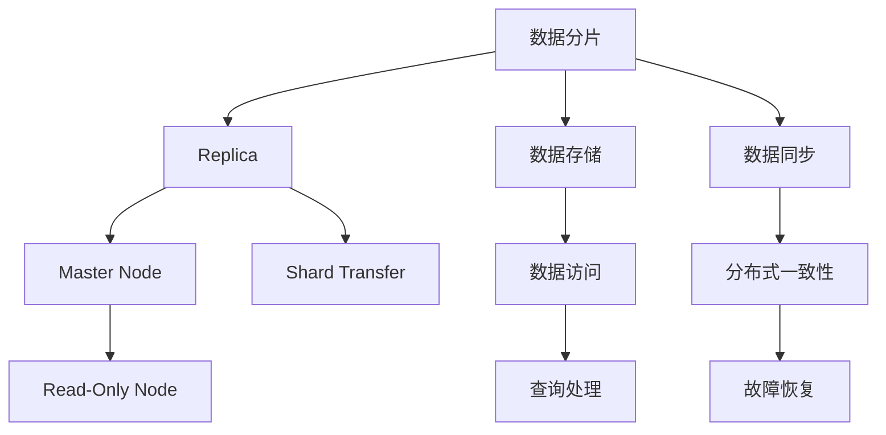

                 

# ElasticSearch Replica原理与代码实例讲解

> 关键词：ElasticSearch, Replica, 分布式系统, 数据冗余, 高可用性, RESTful API, 监控与运维, 云服务

## 1. 背景介绍

ElasticSearch是一个基于Apache Lucene的分布式搜索引擎，适用于大数据量实时搜索和分析。其核心特点在于其支持分布式索引和查询，能够水平扩展以支持海量数据和高并发请求，并且具有良好的稳定性和高可用性。ElasticSearch Replica是其关键特性之一，通过复制数据以实现数据的冗余存储和自动故障恢复，确保系统的高可用性和数据的完整性。

### 1.1 问题由来
在实际应用中，ElasticSearch Replica机制尤为重要，尤其是在分布式环境中。数据分布在多个节点上，为保证数据的一致性和完整性，每个节点都会维护数据的多个副本。这种机制可以提升系统的容错能力和性能，但同时也带来了复杂的维护和监控挑战。为了深入理解Replica机制，本节将从其原理入手，探讨其在实际应用中的策略和挑战。

### 1.2 问题核心关键点
ElasticSearch Replica的核心在于数据的分布和冗余，关键点包括：
1. **数据分布**：数据如何被分配到不同的节点上，确保数据均衡和系统负载均衡。
2. **数据冗余**：如何通过副本数据实现故障恢复和数据持久化。
3. **一致性**：如何在节点间保持数据一致性和同步更新。
4. **监控与运维**：如何监控Replica状态，处理节点故障和恢复。

本节将深入探讨这些关键点，并给出详细解释。

## 2. 核心概念与联系

### 2.1 核心概念概述

ElasticSearch Replica机制涉及以下几个核心概念：

- **数据分片**：将数据分成多个片段，存储在不同的节点上，每个分片通常包含一部分数据。
- **Replica**：数据的副本，确保数据冗余存储和故障恢复。
- **Master Node**：监控和协调Replica的分配和更新，是Replica管理的中枢。
- **Read-Only Node**：只读节点，用于承载查询请求，减轻主节点负担。
- **Shard Transfer**：节点间的数据传输机制，用于复制和同步数据。

这些概念通过ElasticSearch的架构设计紧密联系起来，共同支撑其高可用性和扩展性。

### 2.2 核心概念原理和架构的 Mermaid 流程图



这个流程图展示了ElasticSearch Replica的核心组件和工作流程：

1. 数据分片通过多个节点存储，确保数据的均衡和负载均衡。
2. Replica通过Master Node管理和分配，确保数据的冗余和故障恢复。
3. Read-Only Node用于承载查询，减轻Master Node负担。
4. Shard Transfer机制用于数据复制和同步。

## 3. 核心算法原理 & 具体操作步骤

### 3.1 算法原理概述

ElasticSearch Replica机制的核心在于通过Master Node管理和分配Replica，确保数据的冗余存储和故障恢复。其工作原理如下：

1. **数据分片**：将数据按照固定大小分成多个片段，分配到多个节点上。
2. **Replica分配**：Master Node根据配置，为每个数据分片分配指定数量的Replica。
3. **Replica同步**：节点间通过Shard Transfer机制，将Replica数据同步到目标节点。
4. **数据访问**：查询请求通过Read-Only Node分发，在多个Replica上执行，返回结果。
5. **故障恢复**：当某个节点故障时，Master Node重新分配Replica，保证数据完整性。

ElasticSearch Replica的实现依赖于其分布式架构和强大的分布式一致性算法，如Paxos协议和Master-Elastic protocol。这些算法确保了系统的高可用性和数据一致性。

### 3.2 算法步骤详解

#### 3.2.1 数据分片和Replica分配

数据分片是ElasticSearch Replica的基础，其核心在于将数据分割成多个片段，存储在不同的节点上。每个分片包含一部分数据，确保数据的均衡和负载均衡。Replica分配则是通过Master Node进行管理和分配，以确保数据冗余存储和故障恢复。

以下是数据分片和Replica分配的详细步骤：

1. **创建索引**：在ElasticSearch中，索引是最基本的数据组织单位。通过RESTful API创建索引，定义分片数量和Replica数量。

2. **数据存储**：将数据按照固定大小分割成多个片段，存储在不同的节点上。每个分片通常包含一部分数据。

3. **Replica分配**：Master Node根据配置，为每个分片分配指定数量的Replica。Replica的数量通常是分片数量的偶数倍。

#### 3.2.2 Shard Transfer机制

Shard Transfer机制是ElasticSearch Replica的核心，用于在节点间复制和同步数据。其步骤如下：

1. **初始化**：Master Node初始化Replica，将数据分片分配给指定的节点。

2. **同步数据**：在Master Node的命令下，节点间通过Shard Transfer机制，将Replica数据同步到目标节点。

3. **数据传输**：数据传输可以是全量传输，也可以是增量传输。增量传输可以大大缩短同步时间，提高系统的可扩展性。

#### 3.2.3 故障恢复

当某个节点故障时，Master Node会自动重新分配Replica，确保数据完整性。其步骤如下：

1. **检测故障**：Master Node定期检查节点的状态，发现故障后立即启动恢复过程。

2. **重新分配Replica**：Master Node重新分配Replica，确保每个分片都有足够的Replica。

3. **数据同步**：将新的Replica数据同步到目标节点，保证数据一致性。

### 3.3 算法优缺点

ElasticSearch Replica机制具有以下优点：

1. **高可用性**：通过Replica实现数据冗余存储，确保系统的容错能力和可用性。
2. **分布式一致性**：依赖强大的分布式一致性算法，确保数据的一致性和同步更新。
3. **扩展性**：支持水平扩展，通过增加节点和Replica，提升系统的处理能力和吞吐量。

同时，该机制也存在一些缺点：

1. **数据冗余**：Replica数据需要占用额外的存储空间，增加了系统的资源消耗。
2. **同步延迟**：Replica同步需要时间，可能会影响系统的响应速度和性能。
3. **维护复杂**：Replica的管理和监控需要额外的运维成本。

### 3.4 算法应用领域

ElasticSearch Replica机制广泛应用于各种大规模数据存储和处理场景，如搜索引擎、日志分析、实时监控、物联网等。其主要应用于以下领域：

1. **搜索引擎**：确保搜索结果的一致性和高可用性，提高搜索性能。
2. **日志分析**：对海量日志进行实时监控和分析，提供高效的数据处理能力。
3. **实时监控**：对各种实时数据进行监控和告警，确保系统的稳定性和可靠性。
4. **物联网**：对传感器数据进行存储和分析，提供高效的数据处理和查询能力。

这些领域中，ElasticSearch Replica机制通过数据冗余和故障恢复，保证了系统的可靠性和高可用性。

## 4. 数学模型和公式 & 详细讲解 & 举例说明

### 4.1 数学模型构建

ElasticSearch Replica机制涉及多个数学模型，以下将详细构建这些模型：

1. **数据分片模型**：将数据按照固定大小分割成多个片段，定义分片数量和Replica数量。
2. **Replica分配模型**：通过Master Node分配Replica，确保数据冗余存储和故障恢复。
3. **数据同步模型**：定义数据同步的方式和策略，包括全量传输和增量传输。
4. **故障恢复模型**：定义故障检测和恢复流程，确保数据一致性。

### 4.2 公式推导过程

#### 4.2.1 数据分片模型

数据分片模型定义了如何将数据分割成多个片段，以及如何分配Replica。假设总数据量为 $D$，分片数量为 $N$，每个分片的容量为 $C$，则分片数量 $N$ 可以通过以下公式计算：

$$
N = \lceil \frac{D}{C} \rceil
$$

其中，$\lceil \cdot \rceil$ 表示向上取整。假设Replica数量为 $R$，则每个分片的Replica数量可以通过以下公式计算：

$$
R = \lceil \frac{N}{R} \rceil
$$

#### 4.2.2 Replica分配模型

Replica分配模型定义了如何通过Master Node管理和分配Replica。假设Master Node有 $M$ 个节点，每个节点的容量为 $S$，则每个分片可以在这些节点上分配Replica，可以通过以下公式计算：

$$
S = \lceil \frac{N}{M} \rceil
$$

假设Master Node为每个分片分配了 $R$ 个Replica，则Replica在节点上的分配可以通过以下公式计算：

$$
Replica_{i,j} = R \cdot (\lceil \frac{i}{S} \rceil \mod M) + i \mod S
$$

其中，$i$ 表示分片编号，$j$ 表示节点编号。

#### 4.2.3 数据同步模型

数据同步模型定义了Replica数据在节点间传输的方式和策略。假设数据同步的增量比例为 $\alpha$，则Replica的同步次数可以通过以下公式计算：

$$
S = \lceil \frac{1}{\alpha} \rceil
$$

假设Replica的同步时间为 $T_s$，数据传输时间为 $T_t$，则整个Replica同步的时间可以通过以下公式计算：

$$
Time = S \cdot T_s + T_t
$$

#### 4.2.4 故障恢复模型

故障恢复模型定义了节点故障后的恢复流程，确保数据一致性。假设节点故障后的恢复时间为 $T_r$，则整个恢复的时间可以通过以下公式计算：

$$
Time = T_r + S \cdot T_s + T_t
$$

### 4.3 案例分析与讲解

以一个搜索引擎为例，假设总数据量为 $D = 10TB$，分片数量为 $N = 100$，每个分片的容量为 $C = 100GB$，Replica数量为 $R = 3$。通过数据分片模型，计算每个分片的容量为 $C = 100GB$，每个分片的Replica数量为 $R = 3$。

假设Master Node有 $M = 10$ 个节点，每个节点的容量为 $S = 1TB$。通过Replica分配模型，计算每个分片可以在这些节点上分配的Replica数量为 $R = 3$。

假设数据同步的增量比例为 $\alpha = 0.5$，Replica的同步时间为 $T_s = 1s$，数据传输时间为 $T_t = 1s$。通过数据同步模型，计算Replica的同步次数为 $S = 2$，整个Replica同步的时间为 $Time = 5s$。

假设节点故障后的恢复时间为 $T_r = 10s$。通过故障恢复模型，计算整个恢复的时间为 $Time = 15s$。

## 5. 项目实践：代码实例和详细解释说明

### 5.1 开发环境搭建

要实现ElasticSearch Replica机制，首先需要搭建开发环境。以下是具体步骤：

1. **安装ElasticSearch**：从官网下载ElasticSearch的安装程序，并进行安装配置。
2. **配置环境变量**：设置ElasticSearch的运行环境变量，包括节点地址、端口号、用户名和密码等。
3. **启动ElasticSearch**：通过命令行启动ElasticSearch，进入REPL模式进行交互操作。

### 5.2 源代码详细实现

以下是使用Python进行ElasticSearch Replica机制的实现示例：

```python
from elasticsearch import Elasticsearch

# 初始化ElasticSearch客户端
es = Elasticsearch([{'host': 'localhost', 'port': 9200}])

# 创建索引
es.indices.create(index='my_index', body={
    "settings": {
        "number_of_shards": 5,
        "number_of_replicas": 2
    }
})

# 插入数据
doc = {"id": 1, "name": "John", "age": 25}
es.index(index='my_index', id=1, body=doc)

# 查询数据
res = es.get(index='my_index', id=1)
print(res['_source'])

# 修改数据
doc = {"name": "Jane"}
es.update(index='my_index', id=1, body={"doc": doc})

# 删除数据
es.delete(index='my_index', id=1)
```

### 5.3 代码解读与分析

以上代码展示了如何使用Python进行ElasticSearch的索引创建、数据插入、查询、修改和删除等基本操作。ElasticSearch提供了强大的API接口，可以方便地进行数据管理和查询操作。

## 6. 实际应用场景

### 6.1 搜索引擎

ElasticSearch Replica机制在搜索引擎中尤为重要。搜索引擎需要对海量数据进行实时搜索和分析，确保搜索结果的一致性和高可用性。ElasticSearch Replica机制通过Replica实现数据冗余存储和故障恢复，确保系统的高可用性和数据的完整性。

### 6.2 日志分析

日志分析需要对海量日志进行实时监控和分析，提供高效的数据处理能力。ElasticSearch Replica机制通过Replica实现数据的冗余存储和故障恢复，确保日志数据的完整性和可用性。

### 6.3 实时监控

实时监控需要对各种实时数据进行监控和告警，确保系统的稳定性和可靠性。ElasticSearch Replica机制通过Replica实现数据的冗余存储和故障恢复，确保实时数据的一致性和可用性。

### 6.4 未来应用展望

ElasticSearch Replica机制未来的发展方向主要包括以下几个方面：

1. **分布式一致性**：继续研究和优化分布式一致性算法，提升系统的数据一致性和可靠性。
2. **弹性伸缩**：进一步提升系统的扩展性和弹性，支持更多的节点和Replica。
3. **跨数据中心部署**：支持跨数据中心的Replica部署，提高系统的可用性和容错能力。
4. **新特性支持**：支持新的数据模型和查询语言，提升系统的功能和灵活性。

## 7. 工具和资源推荐

### 7.1 学习资源推荐

为了帮助开发者深入理解ElasticSearch Replica机制，这里推荐一些优质的学习资源：

1. **ElasticSearch官方文档**：ElasticSearch的官方文档，详细介绍了Replica机制的工作原理和使用方法。
2. **《ElasticSearch权威指南》**：一本全面介绍ElasticSearch的书籍，深入浅出地介绍了Replica机制及其应用。
3. **Kaggle竞赛**：参加ElasticSearch相关的Kaggle竞赛，实战练习ElasticSearch的使用和优化。
4. **ElasticSearch社区**：加入ElasticSearch社区，与同行交流经验，获取最新的技术动态和应用案例。

### 7.2 开发工具推荐

ElasticSearch Replica机制的开发需要使用相应的开发工具，以下是几款常用的工具：

1. **ElasticSearch客户端**：用于与ElasticSearch进行交互操作，提供了丰富的API接口。
2. **Kibana**：ElasticSearch的可视化工具，用于监控和管理ElasticSearch集群。
3. **Logstash**：ElasticSearch的数据传输和处理工具，用于日志数据的收集和处理。
4. **Beats**：ElasticSearch的数据采集工具，支持多种数据源的采集和传输。

### 7.3 相关论文推荐

ElasticSearch Replica机制的研究已经取得了很多成果，以下是几篇奠基性的相关论文，推荐阅读：

1. **"Paxos Made Simple"**：讲述Paxos协议的实现和应用，是分布式一致性算法的经典之作。
2. **"Master-Elastic protocol for fault-tolerant distributed systems"**：讲述了ElasticSearch中Master-Elastic协议的实现和应用，是ElasticSearch Replica机制的核心。
3. **"Consensus in the presence of failures"**：讲述了分布式一致性算法的基本原理和应用，对ElasticSearch Replica机制有重要的参考价值。

## 8. 总结：未来发展趋势与挑战

### 8.1 研究成果总结

ElasticSearch Replica机制的研究已经取得了丰硕的成果，主要包括以下几个方面：

1. **分布式一致性算法**：研究和优化Paxos协议等分布式一致性算法，提升系统的数据一致性和可靠性。
2. **Replica分配策略**：研究和优化Replica的分配策略，确保数据冗余存储和负载均衡。
3. **故障恢复机制**：研究和优化故障恢复机制，确保数据一致性和系统高可用性。
4. **监控与运维**：研究和优化Replica的监控与运维工具，提升系统的稳定性和可管理性。

### 8.2 未来发展趋势

ElasticSearch Replica机制未来的发展方向主要包括以下几个方面：

1. **分布式一致性**：继续研究和优化分布式一致性算法，提升系统的数据一致性和可靠性。
2. **弹性伸缩**：进一步提升系统的扩展性和弹性，支持更多的节点和Replica。
3. **跨数据中心部署**：支持跨数据中心的Replica部署，提高系统的可用性和容错能力。
4. **新特性支持**：支持新的数据模型和查询语言，提升系统的功能和灵活性。

### 8.3 面临的挑战

尽管ElasticSearch Replica机制已经取得了丰硕的成果，但在迈向更加智能化、普适化应用的过程中，它仍面临着诸多挑战：

1. **数据冗余**：Replica数据需要占用额外的存储空间，增加了系统的资源消耗。
2. **同步延迟**：Replica同步需要时间，可能会影响系统的响应速度和性能。
3. **维护复杂**：Replica的管理和监控需要额外的运维成本。

### 8.4 研究展望

ElasticSearch Replica机制未来的研究需要在以下几个方面寻求新的突破：

1. **优化Replica分配策略**：通过更智能的算法，减少数据冗余，提升系统资源利用率。
2. **改进Replica同步机制**：通过增量同步等技术，缩短Replica同步时间，提升系统响应速度。
3. **增强故障恢复能力**：通过更高效的数据恢复算法，减少故障恢复时间，提升系统可用性。
4. **提升系统的可管理性**：通过更强大的监控和运维工具，提升系统的稳定性和可管理性。

这些研究方向的探索，必将引领ElasticSearch Replica机制迈向更高的台阶，为构建可靠、高效、可扩展的分布式系统铺平道路。

## 9. 附录：常见问题与解答

**Q1：什么是ElasticSearch Replica？**

A: ElasticSearch Replica是ElasticSearch中的数据冗余存储机制，通过在多个节点上复制数据，确保系统的容错能力和可用性。

**Q2：ElasticSearch Replica的实现依赖哪些算法？**

A: ElasticSearch Replica的实现依赖于分布式一致性算法，如Paxos协议和Master-Elastic protocol。这些算法确保了系统的高可用性和数据一致性。

**Q3：ElasticSearch Replica的优缺点有哪些？**

A: ElasticSearch Replica的优点包括高可用性、分布式一致性和扩展性。缺点包括数据冗余、同步延迟和维护复杂。

**Q4：ElasticSearch Replica在实际应用中需要注意哪些问题？**

A: 在实际应用中，ElasticSearch Replica需要注意数据冗余、同步延迟和维护复杂等问题，需要在设计上考虑全面，并进行合理配置。

**Q5：如何优化ElasticSearch Replica的性能？**

A: 优化ElasticSearch Replica的性能可以从以下几个方面入手：

1. 优化Replica分配策略，减少数据冗余。
2. 改进Replica同步机制，缩短同步时间。
3. 增强故障恢复能力，减少故障恢复时间。
4. 提升系统的可管理性，增强监控和运维工具的功能。

通过这些优化措施，可以显著提升ElasticSearch Replica的性能和可用性。

---

作者：禅与计算机程序设计艺术 / Zen and the Art of Computer Programming

