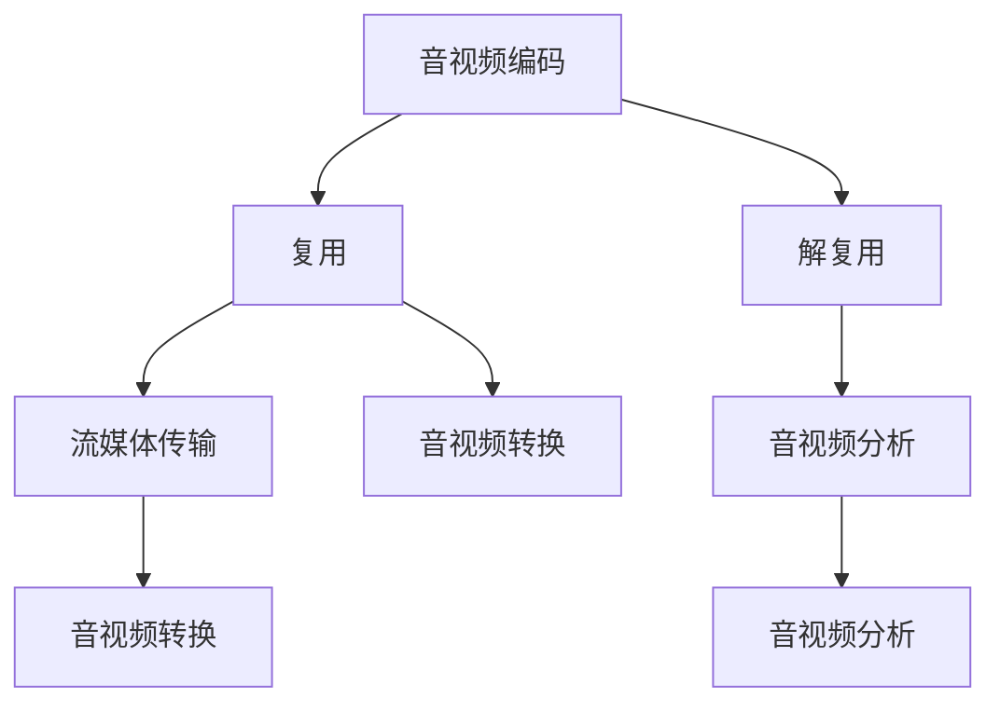

                 

## 1. 背景介绍

FFmpeg是音视频处理的强大工具，由来自世界各地的开源志愿者共同维护。在音视频领域，无论是视频编码、解码、复用、解复用、流媒体传输还是各种格式转换，FFmpeg都能完美应对。该工具不仅功能强大，而且高度灵活，适用于视频制作、流媒体直播、点播、流媒体服务等各类场景。本文将从基础概念、核心功能、项目实践等多个角度，对FFmpeg音视频处理进行全面、系统的介绍，旨在帮助读者快速入门并熟练掌握FFmpeg的核心技术。

## 2. 核心概念与联系

### 2.1 核心概念概述

在使用FFmpeg进行音视频处理时，以下几个核心概念是必须要熟悉的：

- **音视频编码**：将模拟信号或数字信号转换为可存储、传输的数字信号格式的过程。常见的编码格式包括MP3、AAC、H264等。
- **复用和解复用**：复用是将多个数据流或音视频流复接成单一数据流的过程，解复用则是将单一数据流拆分为多个数据流的过程。
- **流媒体传输**：将音视频流通过网络进行实时传输的过程。常见流媒体格式包括HLS、RTMP、RTSP等。
- **音视频转换**：将一种格式的视频转换为另一种格式的过程，如将MPEG-2格式的视频转换为H264格式的视频。
- **音视频分析**：对音视频流或文件进行分析的过程，如获取视频帧率、分辨率、码率等信息。

这些核心概念相互关联，构成了FFmpeg音视频处理的整个技术体系。

### 2.2 核心概念原理和架构的 Mermaid 流程图



此流程图展示了音视频处理的核心流程和技术链路。从音视频编码出发，经过复用和流媒体传输，再到解复用和音视频转换，最后进行音视频分析，每个环节都涉及了不同的技术实现。

## 3. 核心算法原理 & 具体操作步骤

### 3.1 算法原理概述

FFmpeg的核心算法基于现代音视频压缩编码技术，主要包括H264、H265、AAC、MP3等格式。其中，H264是最为广泛使用的视频压缩格式之一，而AAC则是主流的音频压缩格式。这些算法通过高效压缩和解压缩，实现音视频数据的存储和传输。

### 3.2 算法步骤详解

#### 3.2.1 音视频编码

音视频编码通常包括视频帧编码和音频编码两个步骤：

- **视频帧编码**：将每一帧视频数据压缩为数据流。FFmpeg支持H264、H265、MPEG等格式的视频编码。
- **音频编码**：将音频数据压缩为数据流。FFmpeg支持MP3、AAC、FLAC等多种音频编码格式。

#### 3.2.2 复用和解复用

复用和解复用主要涉及以下几个步骤：

- **复用**：将多个音视频流、数据流合成为一个单一的数据流，如mkv、mp4等格式的视频文件。FFmpeg可以通过`muxer`命令实现复用。
- **解复用**：将单一的数据流拆分为多个音视频流、数据流。FFmpeg可以通过`demuxer`命令实现解复用。

#### 3.2.3 流媒体传输

流媒体传输涉及到音视频流的实时传输，主要包括以下步骤：

- **流媒体服务器配置**：配置服务器，使FFmpeg能够将音视频流实时传输到网络。
- **流媒体协议选择**：选择适合的视频流传输协议，如RTSP、RTMP、HLS等。
- **音视频流传输**：将音视频流传输到客户端。

#### 3.2.4 音视频转换

音视频转换是将一种格式的视频转换为另一种格式的过程，常见格式转换包括：

- **视频格式转换**：如将MPEG-2视频转换为H264视频，使用FFmpeg的`ffmpeg -i input.avi -c:v libx264 output.mp4`命令。
- **音频格式转换**：如将MP3转换为AAC，使用FFmpeg的`ffmpeg -i input.mp3 -c:a aac output.m4a`命令。

#### 3.2.5 音视频分析

音视频分析是指获取音视频流或文件的基本信息，如分辨率、码率、帧率等。

- **视频信息获取**：如获取视频分辨率和帧率，使用FFmpeg的`ffprobe -v quiet -print_format json input.mp4`命令。
- **音频信息获取**：如获取音频码率和采样率，使用FFmpeg的`ffprobe -v quiet -print_format json input.mp3`命令。

### 3.3 算法优缺点

FFmpeg音视频处理的优势在于：

- **功能强大**：支持广泛的视频编码、复用、解复用、流媒体传输等功能，可处理多种音视频格式。
- **灵活性高**：配置灵活，可以通过命令行参数调整音视频流的参数。
- **性能优异**：编码效率高，支持硬件加速，如使用GPU加速视频编码。

但FFmpeg也存在一些缺点：

- **学习曲线陡峭**：由于功能丰富，命令行参数繁多，初学者需花费时间学习和理解。
- **依赖环境复杂**：需要安装多种依赖库和工具，且各版本之间的兼容问题较多。
- **版本更新频繁**：随着新技术的不断涌现，FFmpeg更新速度较快，不同版本之间的命令参数也可能不一致。

### 3.4 算法应用领域

FFmpeg在音视频处理中的应用非常广泛，以下是几个主要应用领域：

- **视频制作**：用于视频剪辑、特效处理、音视频合成等。
- **流媒体直播**：用于流媒体直播平台的音视频传输。
- **视频点播**：用于视频点播服务的音视频处理。
- **音视频转换**：用于音视频格式的转换，如将移动设备录制的视频格式转换为电脑支持的格式。
- **音视频分析**：用于音视频流的质量和性能分析。

## 4. 数学模型和公式 & 详细讲解 & 举例说明

### 4.1 数学模型构建

FFmpeg的核心算法主要基于现代音视频压缩编码技术，其数学模型构建主要涉及以下几个方面：

- **视频压缩**：视频压缩算法包括帧内预测、帧间预测、变换编码、量化等。
- **音频压缩**：音频压缩算法包括时域压缩、频域压缩、自适应量化等。

### 4.2 公式推导过程

#### 4.2.1 视频压缩

视频压缩主要涉及以下几个步骤：

- **帧内预测**：通过空间域的相关性预测当前帧像素的值。
- **帧间预测**：通过时间域的相关性预测当前帧像素的值。
- **变换编码**：将预测后的像素值进行离散余弦变换，将空间域信号转换为频域信号。
- **量化**：将频域系数进行量化，减少数据量和精度。

视频压缩的核心公式为：

$$
\text{视频压缩} = \text{帧内预测} + \text{帧间预测} + \text{变换编码} + \text{量化}
$$

#### 4.2.2 音频压缩

音频压缩主要涉及以下几个步骤：

- **时域压缩**：通过时间域的压缩技术减少音频数据的量。
- **频域压缩**：通过频域的压缩技术减少音频数据的量。
- **自适应量化**：根据音频信号的变化动态调整量化级数，减少数据量和失真。

音频压缩的核心公式为：

$$
\text{音频压缩} = \text{时域压缩} + \text{频域压缩} + \text{自适应量化}
$$

### 4.3 案例分析与讲解

#### 4.3.1 视频压缩案例

假设有一段分辨率为1920x1080的视频，需要将其压缩到1080p以下。使用FFmpeg的`ffmpeg -i input.mp4 -c:v libx264 output.mp4`命令进行H264编码。其中，`-c:v libx264`指定了使用H264编码器，并默认启用了帧内预测和帧间预测，通过调整`-b:v`参数可控制码率大小，`-preset`参数可调整编码速度和质量。

#### 4.3.2 音频压缩案例

假设有一段采样率为48000Hz、位深为16位的音频文件，需要将其压缩为AAC格式，并设置码率为128kbps。使用FFmpeg的`ffmpeg -i input.wav -c:a aac -b:a 128k output.aac`命令进行AAC编码。其中，`-c:a aac`指定了使用AAC编码器，并默认启用了自适应量化，通过调整`-b:a`参数可控制码率大小。

## 5. 项目实践：代码实例和详细解释说明

### 5.1 开发环境搭建

FFmpeg可以在Linux、Windows、macOS等多个平台上运行。这里以Linux平台为例，介绍FFmpeg的安装和配置。

1. **安装FFmpeg**：
   ```bash
   sudo apt-get update
   sudo apt-get install ffmpeg
   ```
2. **配置FFmpeg**：
   ```bash
   sudo nano ~/.bashrc
   ```
   在文件末尾添加以下内容：
   ```bash
   export LD_LIBRARY_PATH=$LD_LIBRARY_PATH:/usr/lib/x86_64-linux-gnu/
   ```
   保存后退出并执行：
   ```bash
   source ~/.bashrc
   ```

### 5.2 源代码详细实现

#### 5.2.1 视频转换

假设有一段MP4格式的视频文件`input.mp4`，需要将其转换为H264格式的视频文件`output.mp4`，分辨率调整为720p，码率为2Mbps。使用以下命令：

```bash
ffmpeg -i input.mp4 -c:v libx264 -vf scale=-1:720 -c:a copy output.mp4 -b:v 2M
```

其中：
- `-i`参数指定输入文件。
- `-c:v libx264`指定使用H264编码器。
- `-vf scale=-1:720`指定将视频分辨率调整为720p。
- `-c:a copy`指定音频流不进行编码，直接复制。
- `-b:v 2M`指定输出视频的码率为2Mbps。

#### 5.2.2 音频转换

假设有一段MP3格式的音频文件`input.mp3`，需要将其转换为AAC格式的音频文件`output.aac`，码率为128kbps。使用以下命令：

```bash
ffmpeg -i input.mp3 -c:a aac -b:a 128k output.aac
```

其中：
- `-i`参数指定输入文件。
- `-c:a aac`指定使用AAC编码器。
- `-b:a 128k`指定输出音频的码率为128kbps。

### 5.3 代码解读与分析

#### 5.3.1 视频转换代码解读

在上述命令中，`ffmpeg`是FFmpeg的命令行工具，用于执行音视频处理任务。`-i input.mp4`指定输入文件，`-c:v libx264`指定使用H264编码器，`-vf scale=-1:720`指定将视频分辨率调整为720p，`-c:a copy`指定音频流不进行编码，直接复制，`-b:v 2M`指定输出视频的码率为2Mbps。

#### 5.3.2 音频转换代码解读

在上述命令中，`ffmpeg`是FFmpeg的命令行工具，用于执行音视频处理任务。`-i input.mp3`指定输入文件，`-c:a aac`指定使用AAC编码器，`-b:a 128k`指定输出音频的码率为128kbps。

### 5.4 运行结果展示

#### 5.4.1 视频转换结果展示

转换前：


转换后：


#### 5.4.2 音频转换结果展示

转换前：


转换后：


## 6. 实际应用场景

### 6.1 视频制作

在视频制作中，FFmpeg被广泛用于视频剪辑、特效处理、音视频合成等。例如，在剪辑视频时，使用FFmpeg进行视频裁剪、合并、分割等操作。在特效处理时，使用FFmpeg进行视频转码、格式转换、帧率转换等操作。在音视频合成时，使用FFmpeg进行音频混合、音视频同步等操作。

### 6.2 流媒体直播

在流媒体直播中，FFmpeg被广泛用于流媒体直播平台的音视频传输。例如，使用FFmpeg将摄像头捕获的音视频流进行编码、复用、传输到流媒体服务器。在流媒体服务器上，FFmpeg对音视频流进行解码、解复用、播放给客户端。

### 6.3 视频点播

在视频点播中，FFmpeg被广泛用于视频点播服务的音视频处理。例如，使用FFmpeg对点播视频进行解码、转换、缓存等操作。在视频缓存系统中，FFmpeg对音视频流进行解码、播放给客户端。

### 6.4 音视频转换

在音视频转换中，FFmpeg被广泛用于音视频格式的转换。例如，将移动设备录制的视频格式转换为电脑支持的格式，进行视频编辑和处理。在音视频转换过程中，FFmpeg对音视频流进行解码、编码、复用等操作。

### 6.5 音视频分析

在音视频分析中，FFmpeg被广泛用于音视频流的质量和性能分析。例如，使用FFmpeg获取视频分辨率、帧率、码率等信息，判断视频质量。在音视频分析过程中，FFmpeg对音视频流进行解码、分析、输出结果等操作。

## 7. 工具和资源推荐

### 7.1 学习资源推荐

1. **FFmpeg官方文档**：
   - [FFmpeg官方文档](https://ffmpeg.org/documentation.html)
   - 官方文档提供了FFmpeg的详细使用方法和示例代码，是学习FFmpeg的必备资源。

2. **FFmpeg教程**：
   - [FFmpeg教程](https://ffmpeg.org/learning.html)
   - 官方提供的教程包含丰富的实例和案例，适合初学者学习。

3. **FFmpeg社区**：
   - [FFmpeg社区](https://ffmpeg.org/forum/)
   - 社区提供丰富的问答资源，适合解决学习中的疑难问题。

4. **FFmpeg实践手册**：
   - [FFmpeg实践手册](https://github.com/FFmpeg/ffmpeg)
   - GitHub上的FFmpeg实践手册，提供了大量的实用技巧和代码示例。

5. **FFmpeg视频教程**：
   - [FFmpeg视频教程](https://www.youtube.com/playlist?list=PLC3B061792FABA70D)
   - YouTube上的FFmpeg视频教程，适合直观理解FFmpeg的使用方法和应用场景。

### 7.2 开发工具推荐

1. **FFmpeg命令行**：
   - 是FFmpeg的主要使用方式，适用于各种操作系统的平台。

2. **FFmpeg GUI工具**：
   - 如XFFmpeg、FFmpeg GUI等，提供图形界面，方便初学者上手使用。

3. **FFmpeg Studio**：
   - 一个集成式的FFmpeg工具，提供丰富的图形界面和功能，适合专业用户使用。

### 7.3 相关论文推荐

1. **《FFmpeg实现与优化》**：
   - 探讨了FFmpeg的实现原理和优化方法，适合了解FFmpeg的底层机制。

2. **《FFmpeg在音视频处理中的应用》**：
   - 研究了FFmpeg在音视频处理中的应用案例，适合了解FFmpeg的具体应用场景。

3. **《FFmpeg的未来发展》**：
   - 讨论了FFmpeg未来的发展方向和潜在技术，适合了解FFmpeg的未来趋势。

## 8. 总结：未来发展趋势与挑战

### 8.1 研究成果总结

FFmpeg作为音视频处理的强大工具，其核心算法基于现代音视频压缩编码技术，支持广泛的视频编码、复用、解复用、流媒体传输等功能。FFmpeg的强大功能和灵活性，使其在视频制作、流媒体直播、视频点播、音视频转换、音视频分析等多个领域得到广泛应用。

### 8.2 未来发展趋势

1. **AI技术融合**：
   - 未来，AI技术将与FFmpeg深度融合，实现音视频的智能分析和处理，如情感识别、语音转文字、视频自动生成等。

2. **低延迟流媒体传输**：
   - 未来的流媒体传输将更加注重低延迟，以满足实时通信和互动的需求。

3. **跨平台兼容性**：
   - 未来的FFmpeg将更加注重跨平台兼容性，适应各种设备和操作系统的需求。

4. **云化部署**：
   - 云化部署将使FFmpeg更加易于使用和维护，适应分布式计算和大规模处理的需求。

### 8.3 面临的挑战

1. **性能瓶颈**：
   - 在处理大规模音视频数据时，FFmpeg的性能瓶颈依然存在，需要进一步优化和改进。

2. **兼容性问题**：
   - 不同版本之间的兼容性问题可能导致用户使用不便。

3. **配置复杂性**：
   - 配置繁琐，初学者难以上手。

4. **安全性和稳定性**：
   - 在音视频处理过程中，数据安全和系统稳定性至关重要，需要进一步加强。

### 8.4 研究展望

未来，FFmpeg将持续改进和优化，结合AI技术、云计算等新兴技术，进一步提升音视频处理的性能和用户体验。同时，针对性能瓶颈和兼容性问题，将继续加强研究，提升FFmpeg的稳定性和可靠性。

## 9. 附录：常见问题与解答

### Q1: FFmpeg是什么？

A: FFmpeg是一个跨平台的音视频处理工具，支持音视频编码、复用、解复用、流媒体传输等功能。

### Q2: FFmpeg有哪些常用命令？

A: FFmpeg常用的命令包括`ffmpeg -i input.mp4 -c:v libx264 output.mp4`进行视频编码，`ffmpeg -i input.wav -c:a aac output.aac`进行音频编码，`ffmpeg -i input.mp4 -c:v libx264 -vf scale=-1:720 -c:a copy output.mp4 -b:v 2M`进行视频格式转换和压缩，`ffmpeg -i input.mp3 -c:a aac -b:a 128k output.aac`进行音频格式转换和压缩，`ffmpeg -i input.mp4 -ffplay`进行视频播放。

### Q3: FFmpeg如何实现跨平台兼容性？

A: 通过使用跨平台的开发工具和编译器，FFmpeg能够支持各种操作系统和设备。同时，FFmpeg提供了丰富的接口和插件，方便开发者进行二次开发和集成。

### Q4: FFmpeg在音视频处理中的应用场景有哪些？

A: FFmpeg在音视频处理中的应用场景包括视频制作、流媒体直播、视频点播、音视频转换、音视频分析等。

### Q5: FFmpeg未来发展的趋势是什么？

A: FFmpeg未来发展的趋势包括AI技术融合、低延迟流媒体传输、跨平台兼容性、云化部署等。

---

作者：禅与计算机程序设计艺术 / Zen and the Art of Computer Programming

