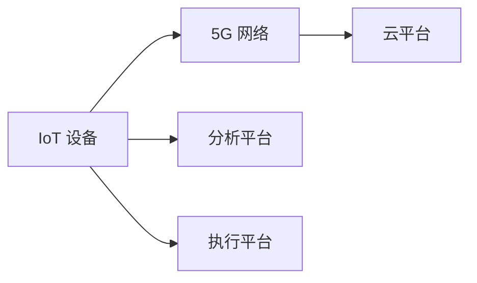

                 

## 1. 背景介绍

### 1.1 问题由来
随着信息技术的发展，物联网（IoT）已成为未来智能社会的重要组成部分。IoT设备通过各种传感器收集海量数据，这些数据可以用于实时监控、优化控制、预测维护等场景，极大地提升人们的生活和工作效率。然而，IoT设备普遍存在电池寿命短、数据延迟高、连接成本高等问题，严重制约了IoT的广泛应用。

### 1.2 问题核心关键点
近年来，5G技术的商用部署逐步成熟，其高带宽、低延迟的特性为IoT的发展带来了新的契机。5G网络不仅能够支持更大的设备连接密度，还具备毫秒级的延迟特性，可以满足IoT对数据实时传输的高要求。本文将深入探讨5G网络如何支撑大规模低延迟的IoT连接，同时分析其面临的技术挑战与未来发展趋势。

## 2. 核心概念与联系

### 2.1 核心概念概述
5G 网络是一种基于新一代无线通信技术的移动网络标准，它能够支持更高的传输速率、更大的连接密度和更低的延迟。物联网（IoT）则是通过各种设备连接网络，实现数据的实时采集和传输，用于监控、控制、预测等场景。5G 网络为IoT设备提供了更可靠的网络连接，可以支持更多设备的同时连接，以及更快速、更高效的数据传输。

### 2.2 核心概念原理和架构的 Mermaid 流程图



此图展示了5G网络在物联网中的作用：IoT设备通过5G网络连接到云平台，收集到的数据通过云平台进行分析，并由执行平台进行控制决策，最终实现物联网的功能。

## 3. 核心算法原理 & 具体操作步骤
### 3.1 算法原理概述
5G网络通过引入Massive MIMO、波束成形、毫米波等技术，显著提升了数据传输速率和网络容量。此外，5G网络引入了时域多址（TDM）、频分多址（FDM）、码分多址（CDM）等技术，进一步提高了网络频谱利用率和抗干扰能力。

### 3.2 算法步骤详解
1. **网络架构设计**
   - 引入Massive MIMO技术，增加天线数量，提升多径信号的接收能力，增强网络容量和覆盖范围。
   - 引入波束成形技术，通过调整天线阵列方向，将信号能量集中到目标用户，提高信号质量和覆盖范围。
   - 引入毫米波技术，利用高频段频谱资源，提升传输速率和数据容量。

2. **传输技术优化**
   - 使用OFDM（正交频分复用）技术，提高频谱利用率和传输效率。
   - 采用MIMO（多输入多输出）技术，提升信号传输的可靠性和抗干扰能力。
   - 引入边缘计算技术，将数据处理和决策控制移近设备端，减少延迟，提升实时性。

3. **应用场景适配**
   - 针对高带宽需求的应用场景，如AR/VR、远程医疗、工业自动化等，提供大带宽连接。
   - 针对低延迟需求的应用场景，如无人驾驶、智能制造、智慧城市等，提供低延迟连接。
   - 针对高可靠需求的应用场景，如工业控制、公共安全、金融交易等，提供高可靠连接。

### 3.3 算法优缺点
#### 优点
1. **高带宽与低延迟**：5G网络可以支持更高的带宽和更低的延迟，满足IoT设备对数据实时传输的要求。
2. **大连接数**：5G网络支持更多的设备连接，满足大规模IoT设备部署的需求。
3. **增强的安全性**：5G网络提供了端到端的安全保护机制，增强了IoT设备数据传输的安全性。

#### 缺点
1. **高部署成本**：5G网络的部署和维护成本较高，对基础设施要求严格。
2. **技术复杂度高**：5G网络的技术复杂度高，对设备制造商和运营商的技术能力要求较高。
3. **频谱资源有限**：5G网络的高频段频谱资源有限，可能面临频谱干扰和频率竞争问题。

### 3.4 算法应用领域
5G网络广泛应用于以下领域：
1. **智慧城市**：实现交通管理、公共安全、环境监测等城市管理功能。
2. **工业物联网**：实现设备状态监控、质量检测、预测维护等生产管理功能。
3. **智能家居**：实现家居设备互联互通、智能控制、安全监控等生活功能。
4. **医疗健康**：实现远程监控、远程诊疗、智能诊断等健康管理功能。
5. **农业物联网**：实现农作物监测、土壤环境监控、灌溉控制等农业生产管理功能。
6. **车联网**：实现车辆状态监控、路线优化、事故预警等交通管理功能。

## 4. 数学模型和公式 & 详细讲解 & 举例说明
### 4.1 数学模型构建
5G网络的数据传输速率R（bps）由以下公式计算：

$$
R = B \log_2 (1 + \frac{SINR}{N_0})
$$

其中，$B$为带宽，$SINR$为信号与噪声的比值，$N_0$为信道噪声。5G网络通过提高$B$和$SINR$，实现更高的数据传输速率。

### 4.2 公式推导过程
1. **信号与噪声比推导**
   $$
   SINR = \frac{P_{TX}}{N_0 + \sum_{i=1}^{M-1} P_{iTX} + \sum_{j=1}^{K-1} P_{jRX}}
   $$

   其中，$P_{TX}$为基站发射功率，$P_{iTX}$为相邻基站对当前基站产生的干扰功率，$P_{jRX}$为用户设备对当前基站产生的干扰功率。通过波束成形和干扰抵消技术，可以提高$SINR$，减少信号干扰。

2. **带宽和频谱利用率**
   $$
   B = f_c W
   $$

   其中，$f_c$为载波频率，$W$为频谱带宽。5G网络通过采用更高效的频谱利用技术，如OFDM和MIMO，可以提高频谱利用率$W$，从而增加带宽$B$。

### 4.3 案例分析与讲解
以智能制造场景为例，通过5G网络实现实时监控和自动化控制：

- **设备状态监控**：传感器实时采集设备运行状态数据，通过5G网络发送到云平台。
- **数据分析与预测**：云平台对数据进行分析，预测设备故障和维护需求。
- **智能控制**：通过5G网络将控制指令发送回设备，实现自动化控制。

## 5. 项目实践：代码实例和详细解释说明
### 5.1 开发环境搭建
1. **硬件环境**
   - 5G测试网络：需要连接到运营商的5G网络测试平台。
   - IoT设备：选择合适的物联网设备，如智能家居设备、工业传感器等。

2. **软件环境**
   - Python开发环境：安装Python 3.8及以上版本。
   - 5G网络工具：安装5G网络模拟器和测试工具，如NS3、OMNeT++等。
   - IoT设备SDK：下载并安装物联网设备的SDK，如Arduino、IoTEdge等。

### 5.2 源代码详细实现
以下是一个简单的Python脚本，实现基于5G网络的数据传输：

```python
import random
from py5gpy import *

# 设置5G网络参数
network = 5GNetwork()
network.set_bandwidth(100)  # 设置带宽为100MHz
network.set_carrier_frequency(2.6)  # 设置载波频率为2.6GHz

# 创建IoT设备
device = IoTDevice()
device.set_antenna_gain(2)  # 设置天线增益为2dB
device.set_mimo(3)  # 设置MIMO为3天线

# 模拟数据传输
data = random.randint(0, 255)  # 生成随机数据
network.send(data)  # 发送数据
device.receive()  # 接收数据
print("Received data:", device.data)
```

### 5.3 代码解读与分析
1. **5G网络设置**
   - 通过py5gpy库，设置5G网络参数，如带宽、载波频率等。

2. **IoT设备设置**
   - 创建IoT设备，并设置天线增益和MIMO参数，增强设备接收信号的能力。

3. **数据传输模拟**
   - 生成随机数据，通过5G网络发送并接收数据，输出接收到的数据。

### 5.4 运行结果展示
运行上述Python脚本，将输出接收到的数据，验证5G网络的数据传输功能。

## 6. 实际应用场景
### 6.1 智慧城市
智慧城市通过5G网络实现以下功能：

- **智能交通**：通过车辆传感器实时监控交通状况，实现智能交通信号灯控制、车辆导航等。
- **公共安全**：通过摄像头和传感器实时监控城市环境，及时发现和处理异常情况，提高公共安全水平。
- **环境监测**：通过传感器实时监测空气质量、水质等环境数据，为城市管理提供科学依据。

### 6.2 工业物联网
工业物联网通过5G网络实现以下功能：

- **设备状态监控**：通过传感器实时监控设备运行状态，及时发现和处理故障。
- **质量检测**：通过传感器实时采集产品质量数据，实现智能检测和质量控制。
- **预测维护**：通过对设备数据进行分析，预测设备故障和维护需求，实现预测性维护。

### 6.3 智能家居
智能家居通过5G网络实现以下功能：

- **设备互联互通**：通过智能网关将各类智能设备连接起来，实现设备的统一管理和控制。
- **智能控制**：通过语音助手、手机APP等，实现家庭设备的远程控制和智能化管理。
- **安全监控**：通过摄像头和传感器实时监控家庭环境，增强家庭安全保障。

## 7. 工具和资源推荐
### 7.1 学习资源推荐
1. **《5G网络技术基础》**：全面介绍5G网络的基本原理、关键技术和应用场景，适合初学者学习。
2. **《物联网技术与应用》**：详细介绍物联网的基本概念、关键技术和应用案例，适合各类开发者学习。
3. **《Python 5G网络编程》**：通过Python编程实现5G网络功能，适合开发者快速上手实践。
4. **5G 网络仿真平台**：如NS3、OMNeT++等，可以用于仿真5G网络功能和性能，适合研究人员和工程师使用。
5. **IoT 设备开发工具**：如Arduino、IoTEdge等，提供各类IoT设备的SDK和开发工具，适合开发者使用。

### 7.2 开发工具推荐
1. **Python 编程语言**：作为5G网络编程的主要语言，Python简单易学，生态丰富，适合各类开发者使用。
2. **NS3 网络仿真平台**：NS3是一个基于C++的网络仿真平台，支持5G网络的仿真和性能测试。
3. **OMNeT++ 网络仿真平台**：OMNeT++是一个基于C++的离散事件网络仿真平台，支持5G网络的仿真和性能分析。
4. **Arduino**：适用于嵌入式设备开发，提供丰富的传感器和执行器模块。
5. **IoTEdge**：适用于边缘计算设备开发，提供丰富的硬件和软件支持。

### 7.3 相关论文推荐
1. **5G网络与物联网融合**：介绍5G网络与物联网的融合应用，如智能交通、智慧城市等。
2. **基于5G的工业物联网研究**：探讨5G网络在工业物联网中的应用，如设备状态监控、预测维护等。
3. **智能家居的5G网络应用**：研究5G网络在智能家居中的应用，如设备互联、智能控制等。
4. **5G网络的数据传输与优化**：介绍5G网络的数据传输技术，如OFDM、MIMO等，并进行性能优化。
5. **5G网络的安全性研究**：探讨5G网络的安全性技术，如端到端加密、认证机制等。

## 8. 总结：未来发展趋势与挑战
### 8.1 研究成果总结
5G网络为IoT设备的连接和数据传输提供了强大的技术支撑，推动了物联网技术的快速发展和应用。通过引入Massive MIMO、波束成形、毫米波等技术，5G网络实现了高带宽、低延迟、大连接数等特性，极大地提升了IoT设备的连接能力和数据传输效率。

### 8.2 未来发展趋势
1. **6G网络**：随着6G网络的逐步商用，未来将提供更高带宽、更低延迟、更广覆盖的网络特性，进一步推动IoT技术的发展。
2. **边缘计算**：边缘计算将成为5G网络的重要组成部分，通过将数据处理和控制决策移到设备端，提升IoT设备的实时性和可靠性。
3. **多模态数据融合**：5G网络将支持多模态数据融合，如图像、音频、传感器数据等，提升IoT设备的感知和决策能力。
4. **智能合约**：基于区块链的智能合约技术，将增强IoT设备的安全性和可信度，提升IoT应用的自动化和智能化水平。
5. **泛在智能**：未来IoT设备将实现全面智能化，通过设备互联互通、数据分析、控制决策等功能，实现智能社会的全面建设。

### 8.3 面临的挑战
1. **设备成本高**：5G网络的高部署和维护成本，使得设备成本较高，影响大规模部署。
2. **网络安全问题**：5G网络面临的各种网络攻击和数据泄露风险，需要加强安全防护措施。
3. **频谱资源竞争**：5G网络的高频段频谱资源有限，可能面临频谱竞争和干扰问题。
4. **标准和协议复杂**：5G网络的复杂性和标准化问题，需要全球多方协同解决。
5. **应用场景限制**：5G网络在特定场景下的应用，如电磁干扰、隐私保护等，需要进一步研究。

### 8.4 研究展望
未来，5G网络将与边缘计算、区块链、智能合约等技术深度融合，推动IoT技术的全面应用和发展。同时，需要进一步降低设备成本，提升网络安全性，解决频谱资源和标准化问题，推动5G网络向6G网络演进，实现全面智能社会的建设。

## 9. 附录：常见问题与解答

**Q1：5G网络与传统4G网络相比，有什么优势？**

A: 5G网络相比传统4G网络，具有更高的带宽、更低的延迟和大连接数等优势。5G网络可以支持更多的设备连接，满足大规模IoT设备部署的需求，同时具备毫秒级的延迟特性，能够实现数据实时传输，满足IoT设备对数据实时性的要求。

**Q2：5G网络在应用中存在哪些挑战？**

A: 5G网络在应用中面临设备成本高、网络安全问题、频谱资源竞争、标准和协议复杂、应用场景限制等挑战。需要进一步降低设备成本，提升网络安全性，解决频谱资源和标准化问题，推动5G网络向6G网络演进，实现全面智能社会的建设。

**Q3：如何提升5G网络的覆盖范围和信号质量？**

A: 提升5G网络的覆盖范围和信号质量，可以采取以下措施：
1. 引入Massive MIMO技术，增加天线数量，提升多径信号的接收能力，增强网络容量和覆盖范围。
2. 引入波束成形技术，通过调整天线阵列方向，将信号能量集中到目标用户，提高信号质量和覆盖范围。
3. 引入毫米波技术，利用高频段频谱资源，提升传输速率和数据容量。
4. 采用OFDM和MIMO技术，提高频谱利用率和抗干扰能力。
5. 引入边缘计算技术，将数据处理和决策控制移近设备端，减少延迟，提升实时性。

**Q4：如何应对5G网络中的频谱干扰和频率竞争问题？**

A: 应对5G网络中的频谱干扰和频率竞争问题，可以采取以下措施：
1. 引入频谱共享技术，如认知无线电、频谱感知等，实现频谱资源的动态分配和优化。
2. 引入频谱聚合技术，将多个频段合并成更宽的频带，提升频谱利用率。
3. 引入频谱监管和管理系统，规范频谱资源的分配和利用，避免频谱干扰和竞争。
4. 引入频谱监测和侦听技术，实时监测频谱使用情况，及时发现和处理频谱干扰问题。

**Q5：5G网络在智慧城市中的应用有哪些？**

A: 5G网络在智慧城市中的应用包括：
1. 智能交通：通过车辆传感器实时监控交通状况，实现智能交通信号灯控制、车辆导航等。
2. 公共安全：通过摄像头和传感器实时监控城市环境，及时发现和处理异常情况，提高公共安全水平。
3. 环境监测：通过传感器实时监测空气质量、水质等环境数据，为城市管理提供科学依据。

---

作者：禅与计算机程序设计艺术 / Zen and the Art of Computer Programming

