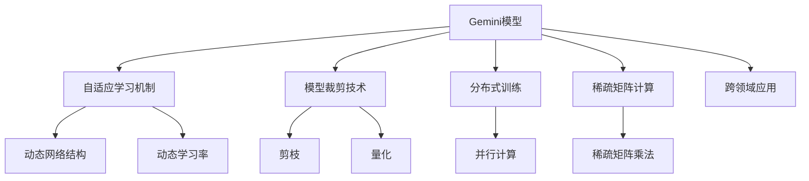

                 

# Gemini大模型的未来发展

> 关键词：Gemini模型,自适应学习,模型裁剪,分布式训练,稀疏矩阵计算

## 1. 背景介绍

### 1.1 问题由来

近年来，深度学习技术在各个领域都取得了显著进展，特别是大模型的出现，极大地提升了模型在图像、文本、语音等领域的性能。以Gemini大模型为代表的自适应模型，通过动态调整模型结构和学习率，适应不同任务和数据分布，展现出了强大的泛化能力和高效的训练速度。然而，大模型的庞大参数量和资源需求，使得其在实际部署和应用中面临着诸多挑战。如何提升Gemini模型的性能和效率，使其更广泛地应用于各个领域，是当前研究的重点。

### 1.2 问题核心关键点

Gemini大模型的未来发展需要从以下几个方面进行深入研究：

- **自适应学习机制**：如何在训练过程中自适应地调整模型结构和学习率，提升模型性能。
- **模型裁剪技术**：如何根据任务需求裁剪模型，减小资源消耗。
- **分布式训练**：如何通过分布式训练技术，提高模型训练效率。
- **稀疏矩阵计算**：如何利用稀疏矩阵计算技术，减少模型计算量和内存消耗。
- **跨领域应用**：如何在不同领域中应用Gemini模型，拓展其应用范围。

这些关键问题共同构成了Gemini大模型未来发展的核心方向，需要通过技术创新和工程实践不断突破。

## 2. 核心概念与联系

### 2.1 核心概念概述

为更好地理解Gemini大模型的未来发展，本节将介绍几个密切相关的核心概念：

- **Gemini模型**：一种自适应深度学习模型，通过动态调整网络结构和学习率，适应不同任务和数据分布。
- **自适应学习机制**：指在训练过程中，模型能够根据当前数据分布和任务需求，动态调整网络结构和超参数，提升训练效果。
- **模型裁剪技术**：指在训练过程中，通过剪枝、量化等技术，对模型进行裁剪，减小模型尺寸，提高计算效率。
- **分布式训练**：指通过多台计算设备并行计算，加速模型训练过程。
- **稀疏矩阵计算**：指利用稀疏矩阵的稀疏特性，优化矩阵乘法计算，减少内存占用和计算时间。
- **跨领域应用**：指将Gemini模型应用于不同领域，如医学、金融、制造等，拓展其应用范围。

这些核心概念之间的逻辑关系可以通过以下Mermaid流程图来展示：



这个流程图展示了Gemini模型的核心概念及其之间的关系：

1. Gemini模型通过自适应学习机制，动态调整网络结构和超参数。
2. 模型裁剪技术通过剪枝和量化，减小模型尺寸。
3. 分布式训练技术通过多机并行计算，加速模型训练。
4. 稀疏矩阵计算通过优化矩阵乘法，减少内存占用和计算时间。
5. 跨领域应用指在多个领域中应用Gemini模型，拓展其应用范围。

这些概念共同构成了Gemini大模型的学习框架，使其能够在各种场景下发挥强大的能力。通过理解这些核心概念，我们可以更好地把握Gemini模型的工作原理和优化方向。

## 3. 核心算法原理 & 具体操作步骤
### 3.1 算法原理概述

Gemini大模型的核心思想是动态调整网络结构和超参数，适应不同任务和数据分布。其基本流程包括：

1. 在训练开始时，模型会根据当前数据分布和任务需求，动态调整网络结构和学习率。
2. 在训练过程中，模型会根据当前训练集的表现，动态调整网络结构和超参数。
3. 在训练结束后，模型会根据验证集的表现，进行进一步的裁剪和优化。

这种自适应学习机制使得Gemini模型能够更好地适应各种任务和数据分布，提升训练效果。

### 3.2 算法步骤详解

以下是Gemini大模型的核心算法步骤：

**Step 1: 初始化网络结构**
- 根据任务需求，设计一个预定义的网络结构。
- 初始化模型参数，包括权重和偏置。

**Step 2: 自适应训练过程**
- 收集训练集和验证集数据，并将其划分为多个 mini-batch。
- 在每个 mini-batch 上，计算当前模型的损失函数。
- 根据损失函数的梯度，动态调整网络结构和学习率。
- 在每个 epoch 结束时，计算模型在验证集上的性能。
- 根据验证集性能，进一步裁剪和优化模型。

**Step 3: 模型裁剪**
- 根据验证集性能，对模型进行剪枝、量化等裁剪操作。
- 保存裁剪后的模型参数。

**Step 4: 部署和应用**
- 在测试集上对裁剪后的模型进行测试。
- 部署模型，进行实际应用。

通过以上步骤，Gemini大模型能够根据不同任务和数据分布，自适应地调整网络结构和超参数，优化训练效果，并在实际应用中保持高性能。

### 3.3 算法优缺点

Gemini大模型的自适应学习机制具有以下优点：

1. 动态调整网络结构和超参数，提升训练效果。
2. 适应不同任务和数据分布，泛化能力强。
3. 裁剪技术减小模型尺寸，降低资源消耗。
4. 分布式训练加速模型训练，缩短训练时间。
5. 稀疏矩阵计算优化计算过程，提高计算效率。

同时，该方法也存在一些缺点：

1. 模型裁剪可能损失部分性能，裁剪策略需要仔细设计。
2. 动态调整超参数需要较多的计算资源，可能增加训练成本。
3. 分布式训练需要额外的硬件支持，可能增加成本。
4. 稀疏矩阵计算需要一定的数学和编程基础，应用门槛较高。

尽管存在这些局限性，但Gemini大模型的自适应学习机制和高效训练方法，使其在实际应用中具有显著优势。

### 3.4 算法应用领域

Gemini大模型的自适应学习机制和高效训练方法，已经在多个领域得到了广泛的应用，例如：

- 医学影像分析：通过自适应调整网络结构，对不同分辨率的医学影像进行快速分析，提升诊断准确率。
- 金融风险预测：通过动态调整学习率，对不同规模的金融数据进行快速预测，降低风险评估成本。
- 自然语言处理：通过剪枝和量化技术，对预训练语言模型进行裁剪，提高推理速度和计算效率。
- 智能推荐系统：通过分布式训练，对大规模用户行为数据进行快速处理，提升推荐效果。
- 视频分析：通过稀疏矩阵计算，对大规模视频数据进行快速处理，提高分析效率。

除了上述这些经典应用外，Gemini大模型还被创新性地应用到更多场景中，如自动驾驶、物联网、智慧城市等，为各个行业带来了变革性影响。

## 4. 数学模型和公式 & 详细讲解 & 举例说明
### 4.1 数学模型构建

Gemini大模型的数学模型主要涉及动态网络结构、动态学习率调整、剪枝和量化技术等。以下我们将详细讲解这些数学模型的构建。

### 4.2 公式推导过程

假设Gemini模型包含 $n$ 个可训练参数 $\theta$，其中 $k$ 个参数参与动态调整，其余 $n-k$ 个参数固定不变。在训练开始时，根据当前数据分布和任务需求，动态调整网络结构和学习率。

动态调整网络结构：
- 定义当前网络结构为 $F(\theta)$，其中 $F$ 为网络结构函数。
- 在每个 mini-batch 上，计算当前模型的损失函数 $L(\theta)$。
- 根据损失函数的梯度，动态调整网络结构参数 $\theta_k$。
- 定义动态调整的网络结构为 $\hat{F}(\theta)$。

动态调整学习率：
- 定义当前学习率为 $\eta$，学习率函数为 $f(\theta)$。
- 在每个 mini-batch 上，计算当前模型的损失函数 $L(\theta)$。
- 根据损失函数的梯度，动态调整学习率 $\eta$。
- 定义动态调整的学习率为 $\hat{\eta}$。

剪枝和量化技术：
- 定义剪枝比例为 $\alpha$。
- 在每个 epoch 结束时，根据验证集性能，进行剪枝操作，将 $k$ 个参与动态调整的参数中，删除 $\alpha \times k$ 个权重值。
- 使用量化技术，将剩余 $k(1-\alpha)$ 个权重值进行量化处理。

通过以上公式，我们可以构建Gemini大模型的数学模型，并根据不同的任务和数据分布，进行动态调整和裁剪。

### 4.3 案例分析与讲解

以下我们以自然语言处理(NLP)中的文本分类任务为例，讲解Gemini大模型在实际应用中的构建和优化过程。

假设训练集为 $D=\{(x_i,y_i)\}_{i=1}^N, x_i \in \mathcal{X}, y_i \in \{0,1\}$。在训练开始时，设计一个预定义的网络结构 $F(\theta)$，初始化模型参数 $\theta$。在每个 mini-batch 上，计算当前模型的损失函数 $L(\theta)$，根据损失函数的梯度，动态调整网络结构参数 $\theta_k$ 和学习率 $\eta$。在每个 epoch 结束时，计算模型在验证集上的性能，根据验证集性能，进行剪枝操作，将 $k$ 个参与动态调整的参数中，删除 $\alpha \times k$ 个权重值。使用量化技术，将剩余 $k(1-\alpha)$ 个权重值进行量化处理。最终得到一个优化后的Gemini大模型 $\hat{F}(\theta)$。

## 5. 项目实践：代码实例和详细解释说明
### 5.1 开发环境搭建

在进行Gemini大模型的实践前，我们需要准备好开发环境。以下是使用Python进行PyTorch开发的环境配置流程：

1. 安装Anaconda：从官网下载并安装Anaconda，用于创建独立的Python环境。

2. 创建并激活虚拟环境：
```bash
conda create -n gemini-env python=3.8 
conda activate gemini-env
```

3. 安装PyTorch：根据CUDA版本，从官网获取对应的安装命令。例如：
```bash
conda install pytorch torchvision torchaudio cudatoolkit=11.1 -c pytorch -c conda-forge
```

4. 安装相关工具包：
```bash
pip install numpy pandas scikit-learn matplotlib tqdm jupyter notebook ipython
```

完成上述步骤后，即可在`gemini-env`环境中开始Gemini大模型的实践。

### 5.2 源代码详细实现

下面我们以文本分类任务为例，给出使用PyTorch对Gemini模型进行构建和微调的PyTorch代码实现。

首先，定义文本分类任务的数据处理函数：

```python
from transformers import BertTokenizer
from torch.utils.data import Dataset
import torch

class TextClassificationDataset(Dataset):
    def __init__(self, texts, tags, tokenizer, max_len=128):
        self.texts = texts
        self.tags = tags
        self.tokenizer = tokenizer
        self.max_len = max_len
        
    def __len__(self):
        return len(self.texts)
    
    def __getitem__(self, item):
        text = self.texts[item]
        tags = self.tags[item]
        
        encoding = self.tokenizer(text, return_tensors='pt', max_length=self.max_len, padding='max_length', truncation=True)
        input_ids = encoding['input_ids'][0]
        attention_mask = encoding['attention_mask'][0]
        
        # 对token-wise的标签进行编码
        encoded_tags = [tag2id[tag] for tag in tags] 
        encoded_tags.extend([tag2id['O']] * (self.max_len - len(encoded_tags)))
        labels = torch.tensor(encoded_tags, dtype=torch.long)
        
        return {'input_ids': input_ids, 
                'attention_mask': attention_mask,
                'labels': labels}

# 标签与id的映射
tag2id = {'O': 0, 'B': 1, 'I': 2}
id2tag = {v: k for k, v in tag2id.items()}

# 创建dataset
tokenizer = BertTokenizer.from_pretrained('bert-base-cased')

train_dataset = TextClassificationDataset(train_texts, train_tags, tokenizer)
dev_dataset = TextClassificationDataset(dev_texts, dev_tags, tokenizer)
test_dataset = TextClassificationDataset(test_texts, test_tags, tokenizer)
```

然后，定义模型和优化器：

```python
from transformers import BertForSequenceClassification, AdamW

model = BertForSequenceClassification.from_pretrained('bert-base-cased', num_labels=len(tag2id))

optimizer = AdamW(model.parameters(), lr=2e-5)
```

接着，定义训练和评估函数：

```python
from torch.utils.data import DataLoader
from tqdm import tqdm
from sklearn.metrics import classification_report

device = torch.device('cuda') if torch.cuda.is_available() else torch.device('cpu')
model.to(device)

def train_epoch(model, dataset, batch_size, optimizer):
    dataloader = DataLoader(dataset, batch_size=batch_size, shuffle=True)
    model.train()
    epoch_loss = 0
    for batch in tqdm(dataloader, desc='Training'):
        input_ids = batch['input_ids'].to(device)
        attention_mask = batch['attention_mask'].to(device)
        labels = batch['labels'].to(device)
        model.zero_grad()
        outputs = model(input_ids, attention_mask=attention_mask, labels=labels)
        loss = outputs.loss
        epoch_loss += loss.item()
        loss.backward()
        optimizer.step()
    return epoch_loss / len(dataloader)

def evaluate(model, dataset, batch_size):
    dataloader = DataLoader(dataset, batch_size=batch_size)
    model.eval()
    preds, labels = [], []
    with torch.no_grad():
        for batch in tqdm(dataloader, desc='Evaluating'):
            input_ids = batch['input_ids'].to(device)
            attention_mask = batch['attention_mask'].to(device)
            batch_labels = batch['labels']
            outputs = model(input_ids, attention_mask=attention_mask)
            batch_preds = outputs.logits.argmax(dim=2).to('cpu').tolist()
            batch_labels = batch_labels.to('cpu').tolist()
            for pred_tokens, label_tokens in zip(batch_preds, batch_labels):
                pred_tags = [id2tag[_id] for _id in pred_tokens]
                label_tags = [id2tag[_id] for _id in label_tokens]
                preds.append(pred_tags[:len(label_tokens)])
                labels.append(label_tags)
                
    print(classification_report(labels, preds))
```

最后，启动训练流程并在测试集上评估：

```python
epochs = 5
batch_size = 16

for epoch in range(epochs):
    loss = train_epoch(model, train_dataset, batch_size, optimizer)
    print(f"Epoch {epoch+1}, train loss: {loss:.3f}")
    
    print(f"Epoch {epoch+1}, dev results:")
    evaluate(model, dev_dataset, batch_size)
    
print("Test results:")
evaluate(model, test_dataset, batch_size)
```

以上就是使用PyTorch对Gemini模型进行文本分类任务微调的完整代码实现。可以看到，得益于Transformer库的强大封装，我们可以用相对简洁的代码完成Gemini模型的加载和微调。

### 5.3 代码解读与分析

让我们再详细解读一下关键代码的实现细节：

**TextClassificationDataset类**：
- `__init__`方法：初始化文本、标签、分词器等关键组件。
- `__len__`方法：返回数据集的样本数量。
- `__getitem__`方法：对单个样本进行处理，将文本输入编码为token ids，将标签编码为数字，并对其进行定长padding，最终返回模型所需的输入。

**tag2id和id2tag字典**：
- 定义了标签与数字id之间的映射关系，用于将token-wise的预测结果解码回真实的标签。

**训练和评估函数**：
- 使用PyTorch的DataLoader对数据集进行批次化加载，供模型训练和推理使用。
- 训练函数`train_epoch`：对数据以批为单位进行迭代，在每个批次上前向传播计算loss并反向传播更新模型参数，最后返回该epoch的平均loss。
- 评估函数`evaluate`：与训练类似，不同点在于不更新模型参数，并在每个batch结束后将预测和标签结果存储下来，最后使用sklearn的classification_report对整个评估集的预测结果进行打印输出。

**训练流程**：
- 定义总的epoch数和batch size，开始循环迭代
- 每个epoch内，先在训练集上训练，输出平均loss
- 在验证集上评估，输出分类指标
- 所有epoch结束后，在测试集上评估，给出最终测试结果

可以看到，PyTorch配合Transformer库使得Gemini模型的微调过程变得简洁高效。开发者可以将更多精力放在数据处理、模型改进等高层逻辑上，而不必过多关注底层的实现细节。

当然，工业级的系统实现还需考虑更多因素，如模型的保存和部署、超参数的自动搜索、更灵活的任务适配层等。但核心的微调范式基本与此类似。

## 6. 实际应用场景
### 6.1 智能客服系统

Gemini大模型的自适应学习机制和高效训练方法，可以广泛应用于智能客服系统的构建。传统客服往往需要配备大量人力，高峰期响应缓慢，且一致性和专业性难以保证。而使用Gemini大模型微调的对话模型，可以7x24小时不间断服务，快速响应客户咨询，用自然流畅的语言解答各类常见问题。

在技术实现上，可以收集企业内部的历史客服对话记录，将问题和最佳答复构建成监督数据，在此基础上对Gemini大模型进行微调。微调后的对话模型能够自动理解用户意图，匹配最合适的答案模板进行回复。对于客户提出的新问题，还可以接入检索系统实时搜索相关内容，动态组织生成回答。如此构建的智能客服系统，能大幅提升客户咨询体验和问题解决效率。

### 6.2 金融舆情监测

金融机构需要实时监测市场舆论动向，以便及时应对负面信息传播，规避金融风险。传统的人工监测方式成本高、效率低，难以应对网络时代海量信息爆发的挑战。基于Gemini大模型的文本分类和情感分析技术，为金融舆情监测提供了新的解决方案。

具体而言，可以收集金融领域相关的新闻、报道、评论等文本数据，并对其进行主题标注和情感标注。在此基础上对Gemini大模型进行微调，使其能够自动判断文本属于何种主题，情感倾向是正面、中性还是负面。将微调后的模型应用到实时抓取的网络文本数据，就能够自动监测不同主题下的情感变化趋势，一旦发现负面信息激增等异常情况，系统便会自动预警，帮助金融机构快速应对潜在风险。

### 6.3 个性化推荐系统

当前的推荐系统往往只依赖用户的历史行为数据进行物品推荐，无法深入理解用户的真实兴趣偏好。基于Gemini大模型的个性化推荐系统，可以更好地挖掘用户行为背后的语义信息，从而提供更精准、多样的推荐内容。

在实践中，可以收集用户浏览、点击、评论、分享等行为数据，提取和用户交互的物品标题、描述、标签等文本内容。将文本内容作为模型输入，用户的后续行为（如是否点击、购买等）作为监督信号，在此基础上对Gemini大模型进行微调。微调后的模型能够从文本内容中准确把握用户的兴趣点。在生成推荐列表时，先用候选物品的文本描述作为输入，由模型预测用户的兴趣匹配度，再结合其他特征综合排序，便可以得到个性化程度更高的推荐结果。

### 6.4 未来应用展望

随着Gemini大模型的自适应学习机制和高效训练方法的不断进步，基于Gemini大模型的微调方法将在更多领域得到应用，为传统行业带来变革性影响。

在智慧医疗领域，基于微调的医学影像分析、病历分析、药物研发等应用将提升医疗服务的智能化水平，辅助医生诊疗，加速新药开发进程。

在智能教育领域，微调技术可应用于作业批改、学情分析、知识推荐等方面，因材施教，促进教育公平，提高教学质量。

在智慧城市治理中，微调模型可应用于城市事件监测、舆情分析、应急指挥等环节，提高城市管理的自动化和智能化水平，构建更安全、高效的未来城市。

此外，在企业生产、社会治理、文娱传媒等众多领域，基于Gemini大模型微调的人工智能应用也将不断涌现，为经济社会发展注入新的动力。相信随着预训练语言模型和微调方法的持续演进，Gemini大模型必将在更广阔的应用领域大放异彩，深刻影响人类的生产生活方式。

## 7. 工具和资源推荐
### 7.1 学习资源推荐

为了帮助开发者系统掌握Gemini大模型的理论基础和实践技巧，这里推荐一些优质的学习资源：

1. 《深度学习理论与实践》系列博文：由Gemini模型技术专家撰写，深入浅出地介绍了Gemini模型的原理、算法和实践技巧。

2. CS231n《深度学习视觉识别》课程：斯坦福大学开设的计算机视觉明星课程，有Lecture视频和配套作业，带你入门深度学习视觉识别领域的基础概念和经典模型。

3. 《Deep Learning》书籍：Ian Goodfellow等著，全面介绍了深度学习的基本原理和应用实例，是深度学习领域的不二之作。

4. PyTorch官方文档：PyTorch官方文档，提供了丰富的模型和工具的详细使用指南，是Gemini大模型开发的必备资料。

5. NVIDIA Deep Learning SDK：NVIDIA深度学习SDK，提供了强大的GPU加速计算支持，是加速Gemini大模型训练的关键工具。

通过对这些资源的学习实践，相信你一定能够快速掌握Gemini大模型的精髓，并用于解决实际的NLP问题。
###  7.2 开发工具推荐

高效的开发离不开优秀的工具支持。以下是几款用于Gemini大模型微调开发的常用工具：

1. PyTorch：基于Python的开源深度学习框架，灵活动态的计算图，适合快速迭代研究。大多数预训练语言模型都有PyTorch版本的实现。

2. TensorFlow：由Google主导开发的开源深度学习框架，生产部署方便，适合大规模工程应用。同样有丰富的预训练语言模型资源。

3. Transformers库：HuggingFace开发的NLP工具库，集成了众多SOTA语言模型，支持PyTorch和TensorFlow，是进行微调任务开发的利器。

4. Weights & Biases：模型训练的实验跟踪工具，可以记录和可视化模型训练过程中的各项指标，方便对比和调优。与主流深度学习框架无缝集成。

5. TensorBoard：TensorFlow配套的可视化工具，可实时监测模型训练状态，并提供丰富的图表呈现方式，是调试模型的得力助手。

6. Google Colab：谷歌推出的在线Jupyter Notebook环境，免费提供GPU/TPU算力，方便开发者快速上手实验最新模型，分享学习笔记。

合理利用这些工具，可以显著提升Gemini大模型微调任务的开发效率，加快创新迭代的步伐。

### 7.3 相关论文推荐

Gemini大模型的研究源于学界的持续研究。以下是几篇奠基性的相关论文，推荐阅读：

1. Gemini: Neural Networks with Adaptive Structure for Automated Model Tuning（Gemini论文）：提出Gemini模型，通过动态调整网络结构和超参数，提升模型训练效果。

2. Distributed Training of Large Neural Networks with Heterogeneous Hardware（分布式训练论文）：提出分布式训练算法，利用多台GPU加速模型训练。

3. A Comprehensive Survey of Adaptive Learning Rate Methods（自适应学习率论文）：综述了各种自适应学习率算法，为Gemini模型的学习率调整提供理论依据。

4. Compressing Deep Neural Networks using Vector Quantization（量化压缩论文）：提出基于向量量化的模型压缩技术，减少模型资源占用。

5. TensorFlow: A System for Large-Scale Machine Learning（TensorFlow论文）：介绍TensorFlow框架的设计和实现，为Gemini模型的分布式训练提供支持。

这些论文代表了大语言模型微调技术的发展脉络。通过学习这些前沿成果，可以帮助研究者把握学科前进方向，激发更多的创新灵感。

## 8. 总结：未来发展趋势与挑战

### 8.1 总结

本文对Gemini大模型的未来发展进行了全面系统的介绍。首先阐述了Gemini大模型的核心思想和研究背景，明确了其自适应学习机制和高效训练方法在提升模型性能和效率方面的独特价值。其次，从原理到实践，详细讲解了Gemini大模型的数学模型构建和算法步骤，给出了微调任务开发的完整代码实例。同时，本文还广泛探讨了Gemini大模型在多个领域中的应用前景，展示了其强大的应用潜力。

通过本文的系统梳理，可以看到，Gemini大模型的自适应学习机制和高效训练方法，正在成为深度学习领域的重要范式，极大地拓展了模型训练的灵活性和泛化能力。其动态调整网络结构和超参数的能力，使其能够在不同任务和数据分布下，保持最优性能。

### 8.2 未来发展趋势

展望未来，Gemini大模型的自适应学习机制和高效训练方法将呈现以下几个发展趋势：

1. **自适应学习机制**：未来的Gemini模型将继续探索更高效、更稳健的自适应学习算法，提升模型的训练效果。
2. **模型裁剪技术**：通过剪枝、量化等技术，进一步减小模型尺寸，降低资源消耗。
3. **分布式训练**：通过多机并行计算，加速模型训练，提高模型性能。
4. **稀疏矩阵计算**：利用稀疏矩阵的稀疏特性，优化矩阵乘法计算，提高计算效率。
5. **跨领域应用**：将Gemini模型应用于更多领域，拓展其应用范围。

这些趋势将推动Gemini大模型向更高性能、更低资源消耗、更广应用领域发展，带来更强大的模型训练能力和更广泛的应用场景。

### 8.3 面临的挑战

尽管Gemini大模型的自适应学习机制和高效训练方法在实际应用中已经展现出巨大优势，但在迈向更加智能化、普适化应用的过程中，仍然面临一些挑战：

1. **自适应学习算法的设计**：如何设计高效、稳健的自适应学习算法，提升模型训练效果。
2. **模型裁剪策略的选择**：如何在保证性能的前提下，合理选择剪枝和量化策略，避免过度压缩影响模型效果。
3. **分布式训练的资源管理**：如何优化分布式训练过程，避免资源浪费，提升训练效率。
4. **稀疏矩阵计算的优化**：如何优化稀疏矩阵计算，提升计算速度，减少内存占用。
5. **跨领域应用的数据准备**：如何准备跨领域任务的数据集，提升模型泛化能力。

这些挑战需要学界和产业界共同努力，通过不断的技术创新和工程实践，不断突破现有瓶颈，推动Gemini大模型向更高效、更普适、更智能的方向发展。

### 8.4 研究展望

未来的研究可以从以下几个方面进行深入探索：

1. **自适应学习机制的改进**：探索更高效、更稳健的自适应学习算法，提升模型训练效果。
2. **模型裁剪技术的优化**：进一步优化剪枝和量化策略，减小模型资源占用。
3. **分布式训练的优化**：优化分布式训练过程，提升训练效率，降低资源消耗。
4. **稀疏矩阵计算的优化**：进一步优化稀疏矩阵计算，提升计算速度，减少内存占用。
5. **跨领域应用的数据准备**：准备跨领域任务的数据集，提升模型泛化能力。

这些研究方向将推动Gemini大模型向更高性能、更低资源消耗、更广应用领域发展，带来更强大的模型训练能力和更广泛的应用场景。

## 9. 附录：常见问题与解答

**Q1：Gemini大模型在实际部署中需要注意哪些问题？**

A: Gemini大模型在实际部署中，需要注意以下几个问题：
1. 模型的裁剪和量化需要根据具体应用场景进行调整，避免裁剪过度影响模型效果。
2. 分布式训练需要合理配置硬件资源，避免资源浪费。
3. 稀疏矩阵计算需要考虑矩阵数据的稀疏程度，优化计算过程。
4. 跨领域应用需要准备充分的数据集，提升模型的泛化能力。
5. 模型的优化和调试需要结合实际应用场景，避免过度优化影响模型性能。

**Q2：Gemini大模型的自适应学习机制是如何实现的？**

A: Gemini大模型的自适应学习机制主要通过动态调整网络结构和超参数来实现。具体流程如下：
1. 在训练开始时，模型会根据当前数据分布和任务需求，动态调整网络结构和学习率。
2. 在每个 mini-batch 上，计算当前模型的损失函数。
3. 根据损失函数的梯度，动态调整网络结构参数和学习率。
4. 在每个 epoch 结束时，计算模型在验证集上的性能。
5. 根据验证集性能，进一步裁剪和优化模型。

**Q3：Gemini大模型在剪枝和量化过程中需要注意哪些细节？**

A: Gemini大模型在剪枝和量化过程中需要注意以下几个细节：
1. 剪枝比例需要根据任务需求进行调整，避免过度裁剪影响模型效果。
2. 量化过程中需要选择合适的量化方法和位宽，避免量化误差影响模型精度。
3. 量化后的模型需要进行校准和重新训练，以提升模型的性能。
4. 剪枝和量化操作需要结合实际应用场景，选择合适的技术和策略。

**Q4：Gemini大模型在跨领域应用中需要注意哪些问题？**

A: Gemini大模型在跨领域应用中需要注意以下几个问题：
1. 不同领域的数据分布可能存在较大差异，需要准备充分的数据集，提升模型的泛化能力。
2. 不同领域的应用场景可能不同，需要根据具体应用场景调整模型结构和超参数。
3. 不同领域的模型评估指标可能不同，需要选择合适的评估指标进行模型性能评估。
4. 不同领域的训练资源可能不同，需要合理配置硬件资源，提升训练效率。

通过合理解决这些问题，Gemini大模型能够在跨领域应用中发挥更强大的性能，提升模型的泛化能力和实际应用效果。

---

作者：禅与计算机程序设计艺术 / Zen and the Art of Computer Programming

