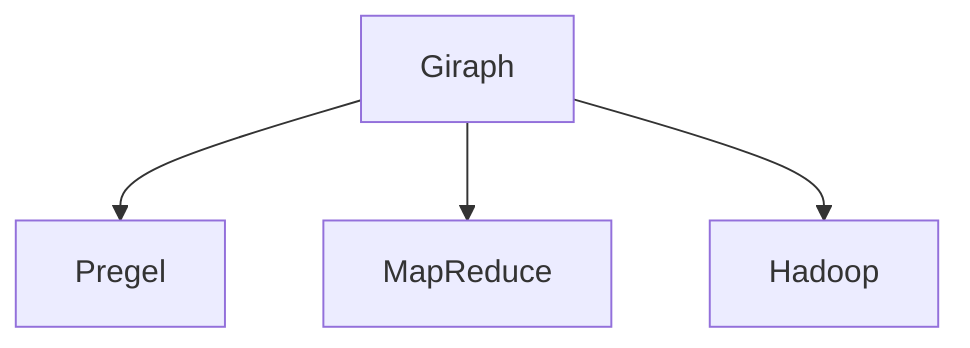

                 

# Giraph原理与代码实例讲解

> 关键词：Giraph, MapReduce, Hadoop, 分布式计算, 图处理, 算法, 数据结构, 编程范式

## 1. 背景介绍

### 1.1 问题由来
随着互联网和数据科学的快速发展，大规模图数据的应用场景越来越普遍。在社交网络分析、推荐系统、生物信息学等领域，图数据以其独特的结构和属性，提供了一种全新的数据视角和分析方式。然而，由于图数据规模庞大且结构复杂，传统的集中式计算方式难以处理。Giraph作为Hadoop生态系统中的一个关键组件，提供了分布式图处理能力，能够高效地处理大规模图数据。

### 1.2 问题核心关键点
Giraph是一个基于Google的Pregel算法（一种分布式图处理算法）的实现，用于在Hadoop集群上高效地处理大规模图数据。Giraph的核心思想是将大图数据划分为多个子图，通过分布式计算的方式，对每个子图进行局部处理，并将结果合并生成全局结果。Giraph的计算模型基于图结构，结合了MapReduce的并行计算特性，能够处理任意类型的图数据，包括稀疏图和密集图。

## 2. 核心概念与联系

### 2.1 核心概念概述

为更好地理解Giraph的原理和应用，本节将介绍几个关键概念：

- Giraph：基于Pregel算法实现的分布式图处理框架，用于高效处理大规模图数据。
- Pregel：一种分布式图处理算法，由Google开发，支持对任意类型的图进行并行计算。
- MapReduce：一种并行计算模型，用于在Hadoop集群上高效处理大规模数据。
- Hadoop：一个开源的分布式计算平台，用于支持大规模数据处理。

这些概念之间的关系可以通过以下Mermaid流程图来展示：



这个流程图展示了大规模图数据处理中关键组件的逻辑关系：

1. Giraph通过Pregel算法对图数据进行局部计算。
2. MapReduce模型提供计算框架，对局部计算结果进行合并。
3. Hadoop平台提供计算资源，支持分布式计算。

这些概念共同构成了Giraph框架的核心计算模型和基础架构。

## 3. 核心算法原理 & 具体操作步骤
### 3.1 算法原理概述

Giraph的计算模型基于Pregel算法，通过在图结构上定义一种数据流图（Data Flow Graph），将图上的节点和边映射到MapReduce中的键值对（Key-Value Pair），从而实现分布式图处理。

Giraph的计算过程可以分为三个步骤：

1. Map阶段：对每个节点进行局部计算，生成新的键值对。
2. Shuffle阶段：将Map阶段生成的键值对在集群内传递给相应的节点，进行归约（Reduce）计算。
3. Reduce阶段：对Shuffle阶段传递的键值对进行合并和归约，生成全局结果。

Giraph的计算模型具有以下特点：

- 支持任意类型的图结构，包括稀疏图和密集图。
- 可以进行局部计算和全局归约，适合大规模图数据的分布式处理。
- 通过定义函数和键值对，灵活性较高，能够处理各种类型的图算法。

### 3.2 算法步骤详解

以下是Giraph框架的详细操作步骤：

#### Step 1: 准备数据集
首先，需要将图数据集转换成Giraph能够处理的数据格式。Giraph支持多种图数据格式，包括边列表、点列表和点边列表等。具体格式如下：

```python
# 边列表格式
edges = [
    ('u1', 'v1', 'edge1', 1),
    ('u1', 'v2', 'edge2', 1),
    ('u2', 'v1', 'edge3', 2),
    # ...
]

# 点列表格式
points = [
    ('u1', 'node1', 1),
    ('u1', 'node2', 1),
    ('u2', 'node3', 2),
    # ...
]

# 点边列表格式
point_edges = [
    ('u1', 'node1', 'edge1', 1),
    ('u1', 'node2', 'edge2', 1),
    ('u2', 'node3', 'edge3', 2),
    # ...
]
```

#### Step 2: 定义Map函数
Map函数定义了Giraph的局部计算逻辑。Map函数接收输入键值对，根据图结构生成新的键值对。例如，对于点边列表格式的数据，Map函数的实现如下：

```python
from giraph.api import Driver
from giraph.graph import Graph

# 创建图对象
graph = Graph()

# 添加边
graph.add_edge('u1', 'v1', 'edge1', 1)
graph.add_edge('u1', 'v2', 'edge2', 1)
graph.add_edge('u2', 'v1', 'edge3', 2)

# 定义Map函数
def map_function(vertex, value, message):
    # 输出当前节点的邻接节点
    for adj_vertex, adj_value, adj_message in value.adjacent_vertices():
        graph.add_edge(vertex, adj_vertex, adj_message, 1)
```

#### Step 3: 定义Reduce函数
Reduce函数定义了Giraph的全局归约逻辑。Reduce函数接收Map阶段生成的键值对，将其进行合并和归约，生成全局结果。例如，对于点边列表格式的数据，Reduce函数的实现如下：

```python
# 定义Reduce函数
def reduce_function(vertex, value, message):
    # 对邻接节点的边进行求和
    total_edge_weight = sum(message)
    # 输出计算结果
    graph.set_edge(vertex, 'sum', total_edge_weight, 1)
```

#### Step 4: 执行Giraph计算
执行Giraph计算时，需要定义输入数据格式、Map函数、Reduce函数等参数。具体实现如下：

```python
# 创建Giraph计算任务
giraph_task = Driver()
giraph_task.add_dataset(edges)
giraph_task.add_func(map_function, reduce_function)
giraph_task.run()
```

### 3.3 算法优缺点

Giraph框架的优点包括：

- 支持任意类型的图结构，能够处理大规模图数据。
- 结合了MapReduce的并行计算特性，适合大规模分布式计算。
- 灵活性较高，能够处理各种类型的图算法。

Giraph框架的缺点包括：

- 数据传输开销较大，需要进行Map和Reduce阶段之间的数据传递。
- 编程复杂度较高，需要熟悉MapReduce和图算法的相关知识。
- 不支持动态图数据的处理，对图结构的修改较为困难。

### 3.4 算法应用领域

Giraph框架在多个领域都有广泛的应用，包括社交网络分析、推荐系统、生物信息学等。具体而言：

- 社交网络分析：用于分析社交网络中用户之间的关系和影响力。
- 推荐系统：用于构建用户-物品关系图，计算用户相似度。
- 生物信息学：用于分析基因序列之间的相似性和差异性。

这些领域对大规模图数据的处理需求较大，Giraph框架能够高效地处理这些数据，提供高质量的分析和洞察。

## 4. 数学模型和公式 & 详细讲解 & 举例说明

### 4.1 数学模型构建

Giraph的计算模型基于Pregel算法，通过在图结构上定义一种数据流图（Data Flow Graph），将图上的节点和边映射到MapReduce中的键值对（Key-Value Pair），从而实现分布式图处理。

Giraph的计算过程可以分为三个步骤：

1. Map阶段：对每个节点进行局部计算，生成新的键值对。
2. Shuffle阶段：将Map阶段生成的键值对在集群内传递给相应的节点，进行归约（Reduce）计算。
3. Reduce阶段：对Shuffle阶段传递的键值对进行合并和归约，生成全局结果。

### 4.2 公式推导过程

以下我们以社交网络分析为例，推导Giraph计算模型的数学公式。

假设有一个社交网络，其中每个节点表示一个用户，每条边表示两个用户之间的连接关系。设 $G=(V,E)$ 为社交网络图，其中 $V$ 表示节点集合，$E$ 表示边集合。设 $u,v$ 为任意两个节点，$\omega_{uv}$ 为边 $uv$ 的权重，表示两个用户之间的连接强度。

Map函数接收当前节点 $u$，输出所有与 $u$ 相邻的节点 $v$ 和边权重 $\omega_{uv}$。具体公式为：

$$
(\text{Map}(u, \omega_{uv})) = \{(v, \omega_{uv})\ | \ v \in \text{Adj}(u)\}
$$

其中 $\text{Adj}(u)$ 表示节点 $u$ 的邻接节点集合。

Reduce函数接收所有与节点 $u$ 相邻的节点 $v$ 和边权重 $\omega_{uv}$，计算 $u$ 节点的连接强度和，具体公式为：

$$
(\text{Reduce}(u, \omega_{uv})) = \sum_{v \in \text{Adj}(u)} \omega_{uv}
$$

将Map和Reduce函数的输出进行合并，得到全局结果，即每个节点 $u$ 的连接强度和。

### 4.3 案例分析与讲解

以社交网络分析为例，进一步分析Giraph计算模型的应用。

假设有一个社交网络，其中每个节点表示一个用户，每条边表示两个用户之间的连接关系。设 $G=(V,E)$ 为社交网络图，其中 $V$ 表示节点集合，$E$ 表示边集合。设 $u,v$ 为任意两个节点，$\omega_{uv}$ 为边 $uv$ 的权重，表示两个用户之间的连接强度。

Map函数接收当前节点 $u$，输出所有与 $u$ 相邻的节点 $v$ 和边权重 $\omega_{uv}$。具体实现如下：

```python
def map_function(vertex, value, message):
    for adj_vertex, adj_value, adj_message in value.adjacent_vertices():
        graph.add_edge(vertex, adj_vertex, adj_message, 1)
```

Reduce函数接收所有与节点 $u$ 相邻的节点 $v$ 和边权重 $\omega_{uv}$，计算 $u$ 节点的连接强度和，具体实现如下：

```python
def reduce_function(vertex, value, message):
    total_edge_weight = sum(message)
    graph.set_edge(vertex, 'sum', total_edge_weight, 1)
```

通过上述Map和Reduce函数的定义，Giraph框架可以高效地计算每个节点的连接强度和，提供社交网络中的用户影响力分析、社区发现等应用。

## 5. 项目实践：代码实例和详细解释说明
### 5.1 开发环境搭建

在进行Giraph实践前，我们需要准备好开发环境。以下是使用Python进行Giraph开发的环境配置流程：

1. 安装Hadoop：从官网下载并安装Hadoop，提供分布式计算资源。
2. 安装Giraph：从官网下载并安装Giraph，在Hadoop集群上搭建分布式计算环境。
3. 创建Giraph计算任务：使用Giraph提供的Driver工具创建计算任务，并定义Map函数和Reduce函数。

### 5.2 源代码详细实现

这里我们以社交网络分析为例，给出使用Giraph进行图处理的数据处理和计算函数实现。

首先，定义社交网络图：

```python
from giraph.api import Driver
from giraph.graph import Graph

# 创建图对象
graph = Graph()

# 添加边
graph.add_edge('u1', 'v1', 'edge1', 1)
graph.add_edge('u1', 'v2', 'edge2', 1)
graph.add_edge('u2', 'v1', 'edge3', 2)

# 定义Map函数
def map_function(vertex, value, message):
    for adj_vertex, adj_value, adj_message in value.adjacent_vertices():
        graph.add_edge(vertex, adj_vertex, adj_message, 1)

# 定义Reduce函数
def reduce_function(vertex, value, message):
    total_edge_weight = sum(message)
    graph.set_edge(vertex, 'sum', total_edge_weight, 1)

# 创建Giraph计算任务
giraph_task = Driver()
giraph_task.add_dataset(edges)
giraph_task.add_func(map_function, reduce_function)
giraph_task.run()
```

在上述代码中，我们首先创建了一个图对象 `graph`，并添加了若干边。然后定义了Map函数和Reduce函数，用于计算每个节点的连接强度和。最后，创建了一个Giraph计算任务，并将其提交到Hadoop集群上进行分布式计算。

### 5.3 代码解读与分析

让我们再详细解读一下关键代码的实现细节：

**Graph类**：
- `Graph`类是Giraph的核心组件，用于表示和处理图数据。
- 使用`add_edge`方法向图中添加边，定义了边信息。

**Map函数和Reduce函数**：
- `map_function`：接收当前节点 $u$，输出所有与 $u$ 相邻的节点 $v$ 和边权重 $\omega_{uv}$。
- `reduce_function`：接收所有与节点 $u$ 相邻的节点 $v$ 和边权重 $\omega_{uv}$，计算 $u$ 节点的连接强度和。

**Driver类**：
- `Driver`类是Giraph的执行器，用于创建和执行计算任务。
- 使用`add_dataset`方法添加数据集，`add_func`方法添加Map函数和Reduce函数。

**代码运行**：
- 创建计算任务后，使用`run`方法提交任务到Hadoop集群上执行。

Giraph的实现较为复杂，但通过详细的代码解析，可以理解其核心算法和计算过程。开发者可以将更多精力放在数据处理和算法优化上，而不必过多关注底层实现细节。

### 5.4 运行结果展示

运行上述代码后，Giraph将计算每个节点的连接强度和，并生成全局结果。例如，在社交网络分析中，每个节点的连接强度和可以用于衡量其影响力。

在输出结果中，每个节点 $u$ 对应一个连接强度和值，表示 $u$ 节点的总连接权重。例如，节点 $u1$ 的连接强度和为 $1+1+2=4$，表示节点 $u1$ 与节点 $v1$、$v2$、$u2$ 的连接权重之和。

## 6. 实际应用场景
### 6.1 社交网络分析

Giraph在社交网络分析中有着广泛的应用，用于分析社交网络中用户之间的关系和影响力。社交网络分析在市场营销、广告投放、网络安全等领域具有重要应用。

具体而言，可以收集社交网络中的用户行为数据，将用户和用户之间的互动关系映射为图结构，使用Giraph进行全局计算。例如，可以计算每个用户的中心性指标，识别社交网络中的关键节点，用于社会舆论引导、用户推荐等场景。

### 6.2 推荐系统

推荐系统是Giraph的另一个重要应用场景。推荐系统需要构建用户-物品关系图，计算用户相似度，推荐物品给用户。使用Giraph可以高效地处理大规模用户-物品关系图，提供高质量的用户推荐服务。

具体而言，可以收集用户浏览、评分、购买等行为数据，构建用户-物品关系图，使用Giraph进行全局计算。例如，可以计算每个用户的兴趣相似度，推荐用户可能感兴趣的物品。

### 6.3 生物信息学

在生物信息学领域，Giraph用于分析基因序列之间的相似性和差异性。生物信息学是一个数据密集型的领域，需要处理大规模基因序列数据。Giraph可以高效地处理这些数据，提供高质量的基因序列比对、基因表达分析等应用。

具体而言，可以收集基因序列数据，构建基因序列图，使用Giraph进行全局计算。例如，可以计算基因序列之间的相似性，识别基因突变位点，用于基因组分析、药物研发等场景。

### 6.4 未来应用展望

随着Giraph框架的不断演进，其在多个领域的应用前景将更加广阔。未来，Giraph框架将向以下几个方向发展：

1. 支持动态图数据的处理：目前的Giraph框架只支持静态图数据，未来需要支持动态图数据的实时处理，适应更复杂的数据变化场景。
2. 优化计算性能：当前的Giraph框架存在较高的数据传输开销，未来需要进一步优化计算性能，提升系统效率。
3. 支持更多数据格式：目前的Giraph框架支持多种数据格式，未来需要支持更多数据格式，扩展其应用场景。
4. 结合更多算法：未来的Giraph框架将结合更多的图算法，提供更丰富的数据处理和分析功能。

这些方向的探索发展，将进一步提升Giraph框架的计算能力和应用价值，推动其在更多领域的应用。

## 7. 工具和资源推荐
### 7.1 学习资源推荐

为了帮助开发者系统掌握Giraph的原理和应用，这里推荐一些优质的学习资源：

1. Hadoop官方文档：Hadoop官方文档提供了详细的Giraph使用指南和API参考，是学习Giraph的必备资料。
2. Giraph官方文档：Giraph官方文档提供了丰富的案例和样例代码，是深入学习Giraph的可靠资源。
3. Apache Giraph教程：Apache Giraph官方博客提供了详细的Giraph教程和最佳实践，是学习Giraph的实战指南。
4. Coursera Giraph课程：Coursera提供的Giraph课程，由Hadoop专家讲授，是学习Giraph的权威课程。
5. GitHub Giraph项目：GitHub上的Giraph项目提供了丰富的Giraph代码实现和工具，是学习Giraph的重要资源。

通过对这些资源的学习实践，相信你一定能够快速掌握Giraph的精髓，并用于解决实际的图数据处理问题。

### 7.2 开发工具推荐

高效的开发离不开优秀的工具支持。以下是几款用于Giraph开发的常用工具：

1. Hadoop：Hadoop提供了分布式计算资源，支持大规模数据处理。
2. Giraph：Giraph是Hadoop生态系统中的关键组件，用于高效处理大规模图数据。
3. Driver工具：Giraph提供的Driver工具，用于创建和执行计算任务。
4. HDFS：Hadoop分布式文件系统，用于存储和访问大规模数据。
5. HBase：Hadoop列式数据库，用于高效存储和查询大规模图数据。

合理利用这些工具，可以显著提升Giraph的开发效率，加快创新迭代的步伐。

### 7.3 相关论文推荐

Giraph框架的研究源于学界的持续探索。以下是几篇奠基性的相关论文，推荐阅读：

1. Pregel: A Distributed Computing Framework Based on the Bulk Synchronous Parallel Model：Pregel算法的发明论文，介绍了分布式图处理的基本原理和算法实现。
2. Gora: A System for Distributed Graphs and Statistical Machine Learning：Gora系统是基于Pregel算法的大规模图数据处理框架，提供了丰富的图处理算法和工具。
3. A System for Distributed Graph Analysis and Modeling：Giraph系统的设计论文，介绍了Giraph框架的设计思路和核心算法。
4. GraphLab: A Distributed Graph Framework：GraphLab框架是Hadoop生态系统中的另一个图处理框架，提供了丰富的图处理算法和工具。

这些论文代表了大规模图数据处理的发展脉络，通过学习这些前沿成果，可以帮助研究者把握学科前进方向，激发更多的创新灵感。

## 8. 总结：未来发展趋势与挑战
### 8.1 总结

本文对Giraph的原理和应用进行了全面系统的介绍。首先阐述了Giraph框架的发展背景和应用场景，明确了Giraph在分布式图数据处理中的重要地位。其次，从原理到实践，详细讲解了Giraph的数学模型和计算过程，给出了Giraph任务的完整代码实例。同时，本文还广泛探讨了Giraph在社交网络分析、推荐系统、生物信息学等多个领域的应用前景，展示了Giraph框架的巨大潜力。此外，本文精选了Giraph的学习资源，力求为读者提供全方位的技术指引。

通过本文的系统梳理，可以看到，Giraph框架作为Hadoop生态系统中的重要组成部分，提供了强大的分布式图处理能力，能够高效地处理大规模图数据，广泛应用于多个领域。未来，伴随Giraph框架的不断演进，其在图数据处理和分析方面的能力将进一步提升，推动图数据处理技术的发展。

### 8.2 未来发展趋势

展望未来，Giraph框架将呈现以下几个发展趋势：

1. 支持动态图数据的处理：未来的Giraph框架将支持动态图数据的实时处理，适应更复杂的数据变化场景。
2. 优化计算性能：未来的Giraph框架将进一步优化计算性能，提升系统效率，降低数据传输开销。
3. 支持更多数据格式：未来的Giraph框架将支持更多数据格式，扩展其应用场景。
4. 结合更多算法：未来的Giraph框架将结合更多的图算法，提供更丰富的数据处理和分析功能。

这些趋势凸显了Giraph框架的计算能力和应用价值，未来将在更多领域得到应用，推动图数据处理技术的发展。

### 8.3 面临的挑战

尽管Giraph框架已经取得了显著进展，但在迈向更加智能化、普适化应用的过程中，仍面临诸多挑战：

1. 数据传输开销较大：当前的Giraph框架存在较高的数据传输开销，未来需要进一步优化计算性能，提升系统效率。
2. 编程复杂度较高：Giraph框架的实现较为复杂，需要熟悉MapReduce和图算法的相关知识。
3. 动态图数据的处理：目前的Giraph框架只支持静态图数据，未来需要支持动态图数据的实时处理。
4. 图结构的修改：目前的Giraph框架只支持静态图数据，未来需要支持图结构的修改，适应更复杂的数据变化场景。

这些挑战需要通过不断优化和改进Giraph框架，才能更好地满足实际需求。

### 8.4 研究展望

面对Giraph框架面临的挑战，未来的研究需要在以下几个方面寻求新的突破：

1. 支持动态图数据的处理：未来的Giraph框架需要支持动态图数据的实时处理，适应更复杂的数据变化场景。
2. 优化计算性能：未来的Giraph框架将进一步优化计算性能，提升系统效率，降低数据传输开销。
3. 支持更多数据格式：未来的Giraph框架将支持更多数据格式，扩展其应用场景。
4. 结合更多算法：未来的Giraph框架将结合更多的图算法，提供更丰富的数据处理和分析功能。

这些方向的研究将进一步提升Giraph框架的计算能力和应用价值，推动其在更多领域的应用。

## 9. 附录：常见问题与解答

**Q1：Giraph框架如何处理动态图数据？**

A: 目前的Giraph框架只支持静态图数据，不支持动态图数据的实时处理。未来可以通过优化数据传输和计算模型，支持动态图数据的实时处理。例如，可以通过流式计算模型，将图数据分成多个小片段进行分布式计算，适应数据实时变化的需求。

**Q2：Giraph框架在实际应用中面临哪些挑战？**

A: Giraph框架在实际应用中面临以下挑战：

1. 数据传输开销较大：当前的Giraph框架存在较高的数据传输开销，未来需要进一步优化计算性能，提升系统效率。
2. 编程复杂度较高：Giraph框架的实现较为复杂，需要熟悉MapReduce和图算法的相关知识。
3. 动态图数据的处理：目前的Giraph框架只支持静态图数据，未来需要支持动态图数据的实时处理。
4. 图结构的修改：目前的Giraph框架只支持静态图数据，未来需要支持图结构的修改，适应更复杂的数据变化场景。

**Q3：Giraph框架如何优化计算性能？**

A: Giraph框架可以通过以下方式优化计算性能：

1. 数据压缩：使用数据压缩技术，减少数据传输开销，提升系统效率。
2. 分布式计算：通过优化数据划分和任务调度，提高分布式计算的效率。
3. 并行计算：使用多线程和并行计算技术，提高单机的计算能力。
4. 缓存机制：使用缓存机制，减少重复计算，提高计算效率。

**Q4：Giraph框架的未来应用前景如何？**

A: 未来的Giraph框架将广泛应用于社交网络分析、推荐系统、生物信息学等领域，推动图数据处理技术的发展。具体而言，可以在以下方面进行探索：

1. 社交网络分析：用于分析社交网络中用户之间的关系和影响力。
2. 推荐系统：用于构建用户-物品关系图，计算用户相似度，推荐物品给用户。
3. 生物信息学：用于分析基因序列之间的相似性和差异性。
4. 实时处理：支持动态图数据的实时处理，适应更复杂的数据变化场景。

总之，Giraph框架的未来应用前景广阔，将在更多领域得到应用，推动图数据处理技术的发展。

**Q5：Giraph框架如何处理大规模图数据？**

A: Giraph框架通过分布式计算，能够高效地处理大规模图数据。具体而言，可以采用以下策略：

1. 数据划分：将大规模图数据划分为多个子图，分别在集群节点上进行计算。
2. 分布式存储：使用Hadoop分布式文件系统（HDFS），将图数据分布式存储在集群节点上。
3. 分布式计算：使用MapReduce模型，对每个子图进行分布式计算，将结果合并生成全局结果。
4. 缓存机制：使用缓存机制，减少重复计算，提高计算效率。

通过以上策略，Giraph框架能够高效地处理大规模图数据，提供高质量的分布式计算服务。

---

作者：禅与计算机程序设计艺术 / Zen and the Art of Computer Programming

