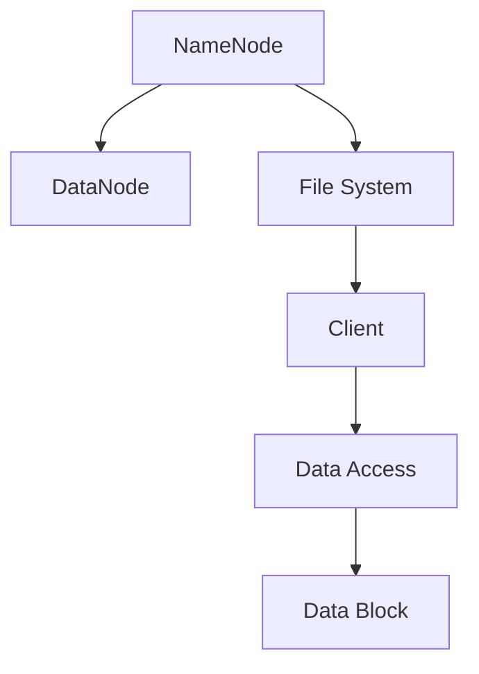

                 

# HDFS 原理与代码实例讲解

> 关键词：Hadoop, Distributed File System, MapReduce, Block, NameNode, DataNode, File System

## 1. 背景介绍

### 1.1 问题由来
随着大数据时代的到来，传统的单节点存储系统已难以应对海量数据的存储需求。为了解决这一问题，Hadoop应运而生，它是一个开源的、分布式的大数据处理框架，旨在解决数据存储和处理的可扩展性问题。Hadoop的核心组成部分是分布式文件系统HDFS（Hadoop Distributed File System）和并行计算框架MapReduce。其中，HDFS负责存储海量数据，MapReduce负责处理这些数据。本文将从HDFS的原理出发，讲解其核心设计思想，并通过代码实例演示HDFS的基本操作，帮助读者深入理解其工作机制。

## 2. 核心概念与联系

### 2.1 核心概念概述

HDFS（Hadoop Distributed File System）是Hadoop框架的核心组成部分之一，负责存储大规模分布式数据。它基于谷歌文件系统的设计思想，采用主从架构，由一个主节点（NameNode）和多个从节点（DataNode）组成。NameNode负责管理整个文件系统的命名空间和文件块的位置信息，DataNode负责存储实际的数据块。HDFS采用块（Block）为基本存储单位，每个块大小默认为64MB或128MB。通过块的复制和冗余存储，HDFS实现了数据的容错性和可靠性。

HDFS采用了多层级的文件系统命名空间，类似于UNIX文件系统，支持目录和文件的创建、删除、重命名等基本操作。用户可以通过HDFS的客户端与文件系统进行交互，执行文件的操作。

### 2.2 核心概念原理和架构的 Mermaid 流程图



## 3. 核心算法原理 & 具体操作步骤
### 3.1 算法原理概述

HDFS的原理可以总结为以下几个方面：

1. 主从架构：HDFS采用主从架构，NameNode负责全局命名空间的管理和文件的元数据操作，DataNode负责数据的实际存储。

2. 块存储：HDFS以块为基本存储单位，每个块大小默认为64MB或128MB，块之间默认无顺序，随机存取。

3. 容错设计：HDFS通过块的冗余存储，实现数据的容错性和可靠性。每个块默认有3个副本，分布在不同的DataNode上。

4. 元数据管理：NameNode维护整个文件系统的命名空间和文件块的位置信息，客户端通过与NameNode通信，获取文件操作所需的信息。

### 3.2 算法步骤详解

HDFS的基本操作包括文件创建、文件打开、数据写入、数据读取等。这里以文件创建和数据写入为例，演示HDFS的操作流程。

1. 文件创建：客户端向NameNode发送创建文件的请求，NameNode分配文件ID，并将文件元数据信息写入NameNode的内存中。同时，NameNode为文件分配数据块，并将这些块的位置信息发送给DataNode。DataNode在收到位置信息后，将块数据存储在本地的磁盘上。

2. 数据写入：客户端向NameNode发送写入数据的请求，NameNode根据文件元数据信息，将数据块的位置信息发送给DataNode。DataNode接收到位置信息后，将数据写入对应的块中。如果块已满，DataNode会自动扩容。如果块损坏，DataNode会向NameNode报告，NameNode会重新分配块的位置，并将数据复制到一个新的块中。

### 3.3 算法优缺点

HDFS的优势在于：

1. 高容错性：通过块的冗余存储，实现数据的容错性和可靠性。

2. 高可靠性：元数据集中存储在NameNode上，可以通过快照和日志，实现数据的备份和恢复。

3. 可扩展性：HDFS可以水平扩展，支持存储数PB级的数据。

HDFS的缺点在于：

1. 延迟较高：由于数据需要跨越多个节点存储和读取，因此延迟较高。

2. 响应时间较长：由于文件系统的操作需要在多个节点上同步，因此响应时间较长。

3. 不适合小文件存储：由于每个块默认大小较大，因此不适合存储小文件。

### 3.4 算法应用领域

HDFS广泛应用于大规模数据存储和处理场景，如数据仓库、大数据分析、科学研究等领域。其广泛应用于分布式存储和计算环境，支持大规模数据的存储和处理。

## 4. 数学模型和公式 & 详细讲解 & 举例说明

### 4.1 数学模型构建

HDFS的数学模型可以简单描述为：

1. 文件系统命名空间：文件系统以树状结构表示，每个节点表示一个文件或目录，包含文件或目录的名称、大小、权限等信息。

2. 文件块：文件被分成多个块，每个块大小为64MB或128MB，块之间无顺序，随机存取。

3. 数据冗余：每个块默认有3个副本，分布在不同的DataNode上。

### 4.2 公式推导过程

以文件块的冗余存储为例，假设一个块大小为64MB，共需要存储2个块，每个块有3个副本，则每个块的副本数量为：

$$
3 = \frac{2}{1}
$$

### 4.3 案例分析与讲解

假设一个100GB的文件被分成10个块，每个块大小为10MB，每个块有3个副本。如果其中一个副本损坏，则可以通过其他副本进行恢复。

## 5. 项目实践：代码实例和详细解释说明
### 5.1 开发环境搭建

HDFS的开发环境搭建需要安装Java、Hadoop等软件。这里以Linux系统为例，演示HDFS的安装和配置。

1. 安装Java：

```bash
sudo apt-get update
sudo apt-get install openjdk-8-jdk
```

2. 安装Hadoop：

```bash
sudo apt-get install hadoop-hdfs-hadoop
```

3. 配置环境变量：

```bash
export HADOOP_HOME=/usr/local/hadoop-2.7.0
export PATH=$HADOOP_HOME/bin:$PATH
```

### 5.2 源代码详细实现

这里演示如何通过HDFS客户端创建一个文件，并写入数据。

1. 创建文件：

```bash
hdfs dfs -mkdir /user/hadoop
hdfs dfs -mkdir /user/hadoop/input
hdfs dfs -mkdir /user/hadoop/output
```

2. 向文件写入数据：

```bash
echo "Hello HDFS!" > /user/hadoop/input/file.txt
hdfs dfs -appendfile /user/hadoop/input/file.txt /user/hadoop/output/file.txt
```

### 5.3 代码解读与分析

- `hdfs dfs -mkdir`：创建文件或目录。
- `hdfs dfs -appendfile`：将文件追加到另一个文件或目录中。

## 6. 实际应用场景

### 6.1 大规模数据存储

HDFS广泛应用于大规模数据存储场景，如数据仓库、大数据分析、科学研究等领域。例如，某科学研究机构需要存储数十TB的气象数据，可以通过HDFS实现数据的分布式存储和处理。

### 6.2 分布式计算

HDFS与MapReduce框架结合使用，可以实现大规模数据的分布式计算。例如，某公司需要对大规模的日志数据进行数据分析，可以使用MapReduce框架对数据进行处理，将处理结果存储到HDFS中。

### 6.3 数据备份与恢复

HDFS的元数据集中存储在NameNode上，可以通过快照和日志，实现数据的备份和恢复。例如，某公司需要备份其重要的数据文件，可以使用HDFS的快照功能，实现数据的快速备份。

### 6.4 未来应用展望

未来，HDFS将继续在分布式存储和计算领域发挥重要作用。随着技术的不断发展，HDFS将更加注重数据处理的速度和效率，同时，将进一步提高系统的容错性和可靠性。

## 7. 工具和资源推荐
### 7.1 学习资源推荐

1. Hadoop官方文档：Hadoop官方文档提供了详细的HDFS安装和配置指导，以及使用HDFS进行数据存储和处理的方法。

2. HDFS实战指南：该书详细介绍了HDFS的原理和应用，适合初学者和进阶者阅读。

3. Hadoop Cookbook：该书提供了大量的HDFS操作示例，适合实战练习。

4. HDFS教程：该书提供了HDFS的基本操作和高级技巧，适合HDFS开发者阅读。

### 7.2 开发工具推荐

1. Hadoop客户端工具：Hadoop客户端工具支持通过命令行操作HDFS，方便进行文件系统的操作。

2. Hadoop可视化界面：Hadoop可视化界面可以直观地展示HDFS文件系统的命名空间和数据块信息，适合进行系统监控和调试。

3. Hadoop监控工具：Hadoop监控工具可以实时监控HDFS的运行状态，适合进行系统故障排除和性能优化。

### 7.3 相关论文推荐

1. Hadoop: A Distributed File System：Hadoop论文介绍了HDFS的基本原理和设计思想。

2. Data Management in HDFS：该论文详细介绍了HDFS的文件存储和访问机制。

3. Hadoop MapReduce：该论文介绍了Hadoop MapReduce框架的基本原理和实现方法。

4. HDFS容错机制：该论文详细介绍了HDFS的容错机制和实现方法。

## 8. 总结：未来发展趋势与挑战

### 8.1 研究成果总结

HDFS作为Hadoop框架的核心组成部分，广泛应用于大规模数据存储和处理场景。其通过主从架构和块存储实现了数据的容错性和可靠性，为大规模数据处理提供了强大的支持。

### 8.2 未来发展趋势

未来，HDFS将进一步提高数据处理的速度和效率，同时，将更加注重系统的容错性和可靠性。HDFS将与其他大数据处理技术进行更深层次的整合，支持更复杂的数据处理场景。

### 8.3 面临的挑战

1. 延迟较高：由于数据需要跨越多个节点存储和读取，因此延迟较高。

2. 响应时间较长：由于文件系统的操作需要在多个节点上同步，因此响应时间较长。

3. 不适合小文件存储：由于每个块默认大小较大，因此不适合存储小文件。

### 8.4 研究展望

未来，HDFS将继续在分布式存储和计算领域发挥重要作用。随着技术的不断发展，HDFS将更加注重数据处理的速度和效率，同时，将进一步提高系统的容错性和可靠性。

## 9. 附录：常见问题与解答

**Q1：HDFS和传统的文件系统有什么不同？**

A: HDFS采用了主从架构，支持大规模数据的分布式存储和处理。与传统的文件系统相比，HDFS具有更高的可扩展性和容错性。

**Q2：如何优化HDFS的性能？**

A: 可以通过以下方法优化HDFS的性能：

1. 增加DataNode节点：增加DataNode节点可以提高数据处理的速度。

2. 调整块大小：根据数据的特点，调整块的容量大小，可以提高数据的存储效率。

3. 优化块副本：根据数据的访问频率，调整块副本的数量，可以提高数据的访问速度。

**Q3：HDFS适合存储什么类型的数据？**

A: HDFS适合存储大规模、非结构化的数据，如日志文件、图片、视频等。

**Q4：HDFS的读写速度受什么因素影响？**

A: HDFS的读写速度受以下因素影响：

1. 数据块的大小：块越大，读写速度越快。

2. 块副本的数量：块副本越多，容错性越好，但读写速度会降低。

3. 网络带宽：网络带宽越大，读写速度越快。

**Q5：如何实现HDFS的备份和恢复？**

A: 可以通过以下方法实现HDFS的备份和恢复：

1. 快照：可以使用HDFS的快照功能，快速备份数据。

2. 日志：可以使用HDFS的日志功能，实现数据的备份和恢复。

总之，HDFS作为一个强大的分布式文件系统，为大规模数据存储和处理提供了强大的支持。通过对HDFS原理的深入理解，读者可以更好地进行HDFS开发和优化，提高系统的性能和可靠性。

