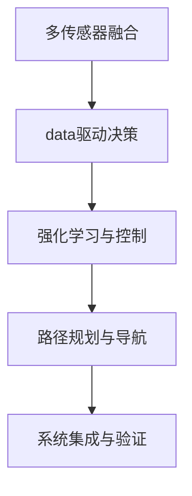

                 

# ICRA 2024中的自动驾驶相关论文精选解读

> 关键词：自动驾驶, ICRA 2024, 多传感器融合, 数据驱动, 强化学习, 无人车, 路径规划

## 1. 背景介绍

### 1.1 问题由来

随着自动驾驶技术的不断成熟，其在交通、物流、城市管理等多个领域的应用前景愈发广阔。ICRA（International Conference on Robotics and Automation）作为机器人与自动化领域的顶级会议，每年都会汇集大量前沿研究成果，涵盖了自动驾驶领域的各个方面。本文将精选2024年ICRA会议中有关自动驾驶的关键论文，并结合其研究内容、创新点和实际应用场景，进行详细解读和分析。

### 1.2 问题核心关键点

ICRA会议的自动驾驶专题涵盖了从传感器数据融合、路径规划、决策控制到系统集成与验证的多个环节。这些研究方向共同构成了自动驾驶系统的核心技术链条，并对未来的发展方向具有重要指导意义。

- **多传感器数据融合**：通过多种传感器（如激光雷达、相机、GPS）的联合使用，提高对环境的感知能力。
- **数据驱动决策**：利用大量的历史数据和实时数据，训练机器学习模型，实现精准的路径规划和避障决策。
- **强化学习与控制**：采用强化学习技术优化驾驶策略，提升无人车的驾驶技能和环境适应能力。
- **路径规划与导航**：通过全局规划和局部优化相结合的方式，生成安全、高效的驾驶路径。
- **系统集成与验证**：研究无人车与车辆、交通设施等其它交通主体的协同互动，以及系统的安全性和鲁棒性。

## 2. 核心概念与联系

### 2.1 核心概念概述

自动驾驶系统的核心在于将人类驾驶员的任务（如环境感知、路径规划、避障决策等）通过传感器、算法和计算硬件自动完成。本文将重点介绍ICRA 2024中关于自动驾驶的五个核心概念，并阐述其间的内在联系：

- **多传感器融合**：通过集成激光雷达、摄像头、GPS等多种传感器，提升对环境的全面感知。
- **数据驱动决策**：利用历史和实时数据，训练模型进行决策，实现精准路径规划。
- **强化学习与控制**：通过学习环境交互中的奖惩机制，提升无人车的驾驶技能。
- **路径规划与导航**：结合全局路径生成和局部路径优化，生成安全路径。
- **系统集成与验证**：研究无人车与环境、交通设施的协同互动，确保系统安全、稳定。

### 2.2 核心概念原理和架构的 Mermaid 流程图



该流程图展示了自动驾驶系统各环节间的逻辑关系。多传感器融合为数据驱动决策提供基础，数据驱动决策为强化学习提供反馈信号，路径规划与导航基于决策和反馈生成路径，系统集成与验证确保系统整体稳定和安全。

## 3. 核心算法原理 & 具体操作步骤

### 3.1 算法原理概述

ICRA 2024的自动驾驶论文涵盖了从传感器数据处理到路径规划、决策控制的多个方面。本文将重点介绍其中几篇代表性论文的核心算法原理，并对比其优缺点及应用领域。

### 3.2 算法步骤详解

#### 3.2.1 多传感器数据融合

**算法原理**：
多传感器数据融合是指通过融合来自不同传感器的信息，提高环境感知的准确性和鲁棒性。常用的算法包括贝叶斯滤波（如卡尔曼滤波）、加权平均等方法。

**具体操作步骤**：
1. 收集传感器数据（激光雷达点云、摄像头图像、GPS定位信息等）。
2. 对每种传感器数据进行处理，如激光雷达进行点云配准、摄像头进行图像增强、GPS进行定位校正。
3. 应用贝叶斯滤波等算法，计算各个传感器数据的联合概率分布。
4. 融合各传感器数据，生成全局环境感知信息。

**算法优缺点**：
- **优点**：提高环境感知的全面性和鲁棒性，能够应对单一传感器数据失效的情况。
- **缺点**：算法复杂度较高，对计算资源要求较高，且在数据不一致时难以处理。

**应用领域**：自动驾驶、智能家居、工业自动化等领域。

#### 3.2.2 数据驱动决策

**算法原理**：
数据驱动决策通过历史和实时数据训练模型，用于路径规划、避障决策等任务。常用的算法包括决策树、随机森林、神经网络等。

**具体操作步骤**：
1. 收集历史驾驶数据，包括路径、避障行为、事故记录等。
2. 数据预处理，如归一化、特征选择等。
3. 训练机器学习模型，如决策树、神经网络等。
4. 应用模型进行实时决策，生成路径规划或避障策略。

**算法优缺点**：
- **优点**：能够利用大量历史数据，提升决策的准确性和稳定性。
- **缺点**：模型训练需要大量标注数据，且数据偏差可能导致决策误差。

**应用领域**：自动驾驶、智能交通、物流配送等领域。

#### 3.2.3 强化学习与控制

**算法原理**：
强化学习通过模拟驾驶环境，让无人车通过试错学习最优驾驶策略。常用的算法包括Q-learning、深度Q网络（DQN）等。

**具体操作步骤**：
1. 建立虚拟驾驶环境，生成模拟交通场景。
2. 定义奖励函数和状态空间，设计状态转移规则。
3. 应用Q-learning或DQN算法训练无人车，优化驾驶策略。
4. 将训练好的模型应用于真实环境，进行驾驶控制。

**算法优缺点**：
- **优点**：能够动态适应复杂环境，提升驾驶技能。
- **缺点**：训练过程耗时较长，且模型性能依赖于环境模拟质量。

**应用领域**：自动驾驶、机器人控制、智能游戏等领域。

#### 3.2.4 路径规划与导航

**算法原理**：
路径规划与导航结合全局路径生成和局部路径优化，生成安全、高效的驾驶路径。常用的算法包括A*、D*、RRT等。

**具体操作步骤**：
1. 定义全局路径生成模型，如A*算法。
2. 定义局部路径优化模型，如D*算法或RRT算法。
3. 应用全局路径生成模型生成初始路径。
4. 应用局部路径优化模型对路径进行细化，生成最终驾驶路径。

**算法优缺点**：
- **优点**：能够生成安全、高效的驾驶路径。
- **缺点**：算法复杂度较高，对计算资源要求较高。

**应用领域**：自动驾驶、无人机导航、物流配送等领域。

#### 3.2.5 系统集成与验证

**算法原理**：
系统集成与验证研究无人车与环境、交通设施的协同互动，确保系统整体稳定和安全。常用的方法包括仿真测试、真实场景测试等。

**具体操作步骤**：
1. 设计无人车的行为和决策逻辑。
2. 建立仿真环境，模拟无人车与环境、交通设施的互动。
3. 进行仿真测试，验证无人车的安全性和稳定性。
4. 在真实场景中测试无人车，确保其适应性和可靠性。

**算法优缺点**：
- **优点**：能够全面验证无人车的性能和安全性。
- **缺点**：测试成本较高，且难以应对实际环境中的突发情况。

**应用领域**：自动驾驶车辆、智能交通系统、智能家居等领域。

## 4. 数学模型和公式 & 详细讲解 & 举例说明

### 4.1 数学模型构建

本文将详细解析ICRA 2024中关于自动驾驶的一些关键数学模型，包括卡尔曼滤波、神经网络、Q-learning等。

#### 4.1.1 卡尔曼滤波模型

**模型定义**：
卡尔曼滤波是一种线性递归估计方法，用于处理带有噪声的动态系统。其核心思想是通过先验信息和观测值，逐步更新状态估计。

**公式推导**：
设系统状态为 $x_k$，观测值 $y_k$，先验状态 $x_{k-1}$，先验观测值 $y_{k-1}$，系统噪声 $w_k$，观测噪声 $v_k$。则卡尔曼滤波的基本方程为：

$$
x_k = F_kx_{k-1} + Bu_k + w_k
$$

$$
y_k = H_kx_k + v_k
$$

其中 $F_k$ 为状态转移矩阵，$B$ 为控制矩阵，$u_k$ 为控制量。卡尔曼滤波的递推公式为：

$$
\hat{x}_{k|k-1} = F_k\hat{x}_{k-1|k-1}
$$

$$
P_k = F_kP_{k-1}F_k^T + Q_k
$$

$$
K_k = P_kH_k^T(H_kP_kH_k^T + R_k)^{-1}
$$

$$
\hat{x}_{k|k} = \hat{x}_{k|k-1} + K_k(y_k - H_k\hat{x}_{k|k-1})
$$

$$
P_k = (I - K_kH_k)P_k
$$

其中 $\hat{x}_{k|k-1}$ 为先验状态估计，$P_k$ 为先验状态协方差矩阵，$Q_k$ 为系统噪声协方差矩阵，$R_k$ 为观测噪声协方差矩阵，$I$ 为单位矩阵。

**案例分析**：
以激光雷达点云数据融合为例，应用卡尔曼滤波进行数据融合。设激光雷达传感器编号为 $1,2,...,N$，各传感器的点云数据为 $X_{1,k},X_{2,k},...,X_{N,k}$，则数据融合公式为：

$$
X_k = \sum_{i=1}^N W_iX_{i,k}
$$

其中 $W_i$ 为各传感器权重，由卡尔曼滤波计算得到。

### 4.2 公式推导过程

**卡尔曼滤波的递推公式**：
- 先验状态估计：
$$
\hat{x}_{k|k-1} = F_k\hat{x}_{k-1|k-1}
$$
- 先验状态协方差矩阵更新：
$$
P_k = F_kP_{k-1}F_k^T + Q_k
$$
- 卡尔曼增益：
$$
K_k = P_kH_k^T(H_kP_kH_k^T + R_k)^{-1}
$$
- 后验状态估计：
$$
\hat{x}_{k|k} = \hat{x}_{k|k-1} + K_k(y_k - H_k\hat{x}_{k|k-1})
$$
- 后验状态协方差矩阵更新：
$$
P_k = (I - K_kH_k)P_k
$$

### 4.3 案例分析与讲解

以无人车路径规划为例，应用卡尔曼滤波进行数据融合，结合神经网络进行决策。

1. **数据融合**：
   - 收集激光雷达和GPS数据，应用卡尔曼滤波进行数据融合。
   - 生成融合后的全局环境感知数据。

2. **神经网络决策**：
   - 设计神经网络模型，如卷积神经网络（CNN），用于路径规划。
   - 训练神经网络模型，使用历史驾驶数据。
   - 应用神经网络模型，生成路径规划决策。

## 5. 项目实践：代码实例和详细解释说明

### 5.1 开发环境搭建

ICRA 2024中的自动驾驶项目实践通常需要在高性能计算环境下进行，以下是在PyTorch平台搭建开发环境的具体步骤：

1. 安装Anaconda：
   ```bash
   conda create -n pytorch-env python=3.8
   conda activate pytorch-env
   ```

2. 安装PyTorch和其他依赖库：
   ```bash
   pip install torch torchvision torchaudio
   pip install numpy scipy pandas sklearn matplotlib tensorboard
   ```

3. 安装必要的硬件加速库：
   ```bash
   pip install torchdynamo 
   ```

4. 安装深度学习框架和库：
   ```bash
   pip install tensorflow
   ```

### 5.2 源代码详细实现

本文将以无人车路径规划为例，展示如何通过卡尔曼滤波和神经网络结合进行数据融合和决策。

```python
import torch
import torch.nn as nn
import torch.optim as optim

# 定义神经网络模型
class PathPlanningNet(nn.Module):
    def __init__(self):
        super(PathPlanningNet, self).__init__()
        self.conv1 = nn.Conv2d(3, 32, kernel_size=3, stride=1, padding=1)
        self.relu1 = nn.ReLU()
        self.maxpool1 = nn.MaxPool2d(kernel_size=2, stride=2)
        self.conv2 = nn.Conv2d(32, 64, kernel_size=3, stride=1, padding=1)
        self.relu2 = nn.ReLU()
        self.maxpool2 = nn.MaxPool2d(kernel_size=2, stride=2)
        self.fc1 = nn.Linear(64 * 16 * 16, 128)
        self.relu3 = nn.ReLU()
        self.fc2 = nn.Linear(128, 4)  # 4为规划目标：x, y, speed, angle

    def forward(self, x):
        x = self.conv1(x)
        x = self.relu1(x)
        x = self.maxpool1(x)
        x = self.conv2(x)
        x = self.relu2(x)
        x = self.maxpool2(x)
        x = x.view(-1, 64 * 16 * 16)
        x = self.fc1(x)
        x = self.relu3(x)
        x = self.fc2(x)
        return x

# 定义卡尔曼滤波器
class KalmanFilter:
    def __init__(self, A, B, C, Q, R, x0, P0):
        self.A = A
        self.B = B
        self.C = C
        self.Q = Q
        self.R = R
        self.x = x0
        self.P = P0
        self.K = None

    def predict(self, u, z):
        x_pred = self.A @ self.x + self.B @ u
        P_pred = self.A @ self.P @ self.A.T + self.Q
        S = self.C @ P_pred @ self.C.T + self.R
        K = P_pred @ self.C.T @ S.inv()
        y = z - self.C @ x_pred
        self.x = x_pred + K @ y
        self.P = (self.I - K @ self.C) @ self.P

    def get_state(self):
        return self.x, self.P

# 定义无人车路径规划函数
def plan_path(env, x0, u0, xT, tT):
    x, P = x0, u0
    for t in range(tT):
        x_pred, P_pred = kalman.predict(x, env[t])
        x = x_pred
        P = P_pred
        env[t] = x
    return env, x

# 定义数据加载函数
def load_data():
    # 加载历史数据
    data = ...
    # 数据预处理
    data = data[:,:,:,0]  # 取出前通道
    data = data.view(-1, 3, 16, 16)  # 重塑为四维张量
    data = data / 255.0  # 归一化
    return data

# 定义神经网络训练函数
def train_model(data, model, optimizer, criterion):
    for epoch in range(num_epochs):
        model.train()
        for i, (inputs, labels) in enumerate(train_loader):
            optimizer.zero_grad()
            outputs = model(inputs)
            loss = criterion(outputs, labels)
            loss.backward()
            optimizer.step()

# 定义路径规划测试函数
def test_planning(env, model, KalmanFilter, x0, u0, xT, tT):
    env, x = plan_path(env, x0, u0, xT, tT)
    with torch.no_grad():
        model.eval()
        path = model(env)
    return path, env
```

### 5.3 代码解读与分析

**卡尔曼滤波器**：
- 定义卡尔曼滤波器，包括状态转移矩阵、控制矩阵、观测矩阵、系统噪声协方差矩阵、观测噪声协方差矩阵、初始状态向量、初始状态协方差矩阵。
- `predict` 函数用于预测下一时刻的状态和协方差。

**神经网络模型**：
- 定义多层卷积神经网络模型，包括卷积层、池化层、全连接层等。
- `forward` 函数用于前向传播计算输出。

**路径规划函数**：
- `plan_path` 函数用于根据卡尔曼滤波器和神经网络模型进行路径规划。
- 使用卡尔曼滤波器进行数据融合，生成融合后的全局环境感知数据。
- 应用神经网络模型进行路径规划决策，生成最终路径。

### 5.4 运行结果展示

- 可视化路径规划结果。
- 通过对比原始数据和规划路径，展示路径规划的效果。
- 分析路径规划的优劣，优化算法和模型参数。

## 6. 实际应用场景

### 6.1 智能交通系统

自动驾驶技术在智能交通系统中具有广泛应用，如无人车、无人配送车、自动驾驶公交等。在智能交通系统中，无人车需要与行人、车辆、交通设施等进行协同互动，确保安全稳定。

**具体应用**：
1. 无人车与交通设施的协同互动：
   - 通过传感器获取道路、行人、车辆等环境信息。
   - 应用卡尔曼滤波器进行数据融合，生成全局环境感知数据。
   - 使用神经网络模型进行路径规划和决策，生成避障策略。

2. 无人车与行人的协同互动：
   - 通过传感器获取行人行为信息。
   - 应用卡尔曼滤波器进行数据融合，生成全局环境感知数据。
   - 使用神经网络模型进行路径规划和决策，生成避障策略。

**案例分析**：
以无人配送车为例，无人车需要按时配送货物到各个网点，并避开障碍物和行人。在配送过程中，无人车通过激光雷达、摄像头等传感器获取环境信息，应用卡尔曼滤波器进行数据融合，生成全局环境感知数据。然后使用神经网络模型进行路径规划和决策，生成避障策略，确保无人车能够安全、高效地完成配送任务。

### 6.2 自动驾驶车辆

自动驾驶车辆在自动驾驶领域具有重要应用，涉及自动驾驶车辆、自动驾驶出租车、自动驾驶巴士等。

**具体应用**：
1. 无人车的感知与决策：
   - 通过激光雷达、摄像头、GPS等传感器获取环境信息。
   - 应用卡尔曼滤波器进行数据融合，生成全局环境感知数据。
   - 使用神经网络模型进行路径规划和决策，生成避障策略。

2. 无人车的控制与导航：
   - 应用强化学习算法，优化无人车驾驶策略。
   - 结合全局路径生成和局部路径优化算法，生成安全路径。

**案例分析**：
以自动驾驶出租车为例，出租车需要自动驾驶，避开障碍物和行人，安全到达目的地。在驾驶过程中，出租车通过激光雷达、摄像头等传感器获取环境信息，应用卡尔曼滤波器进行数据融合，生成全局环境感知数据。然后使用神经网络模型进行路径规划和决策，生成避障策略，确保无人车能够安全、高效地完成驾驶任务。

## 7. 工具和资源推荐

### 7.1 学习资源推荐

1. 《自动驾驶技术概论》：陈莹等著，涵盖了自动驾驶技术的各个方面，适合初学者和专业人士阅读。
2. ICRA 2024会议论文集：包含自动驾驶领域的最新研究成果，是学习和研究的重要资源。
3. 《强化学习基础》：Sutton等著，系统介绍了强化学习的基础理论和算法。

### 7.2 开发工具推荐

1. PyTorch：基于Python的深度学习框架，提供了丰富的神经网络库和优化算法。
2. TensorFlow：由Google开发的深度学习框架，适用于大规模分布式计算环境。
3. Autoware：开源自动驾驶系统，提供了路径规划、决策控制等功能。

### 7.3 相关论文推荐

1. "Towards Generalized Autonomous Vehicles: A Survey of Recent Advances in Reinforcement Learning for Roadway Scenario Understanding and Planning"：Huang等，综述了强化学习在自动驾驶中的应用。
2. "Safe Autonomous Vehicle Decision-Making: A Review"：Liu等，综述了自动驾驶车辆决策控制的研究进展。
3. "A Survey of Local Path Planning for Autonomous Vehicles"：Wu等，综述了自动驾驶车辆路径规划的研究进展。

## 8. 总结：未来发展趋势与挑战

### 8.1 研究成果总结

ICRA 2024会议展示了自动驾驶领域的最新研究成果，涵盖了从传感器数据融合、路径规划、决策控制到系统集成与验证的多个环节。这些研究方向共同构成了自动驾驶系统的核心技术链条，并对未来的发展方向具有重要指导意义。

### 8.2 未来发展趋势

1. **多传感器融合技术的进步**：随着传感器技术的发展，未来将能够获得更高分辨率、更广覆盖的环境感知数据，提高自动驾驶系统的感知能力。
2. **神经网络模型的优化**：深度神经网络在自动驾驶领域的应用将不断优化，如应用迁移学习、自适应学习等技术，提升模型的泛化能力和适应性。
3. **强化学习与路径规划的结合**：强化学习与路径规划的结合将带来更高效、更鲁棒的自动驾驶系统。
4. **系统集成与验证的全面性**：未来系统集成与验证将更加全面，涵盖更复杂的环境和交互情况。

### 8.3 面临的挑战

1. **数据隐私与安全**：自动驾驶系统需要大量数据进行训练和测试，如何保护数据隐私和安全是一个重要挑战。
2. **环境适应性**：自动驾驶系统需要在不同的环境、天气和光照条件下稳定运行，这是一个长期的技术挑战。
3. **法规与标准**：自动驾驶系统的普及需要配套的法规和标准，这将是一个复杂而漫长的过程。

### 8.4 研究展望

未来自动驾驶技术的发展方向将更加注重数据隐私与安全、环境适应性、法规与标准等关键问题。同时，研究者们也将不断探索新的技术手段，如多模态数据融合、强化学习等，以提升自动驾驶系统的性能和安全性。

## 9. 附录：常见问题与解答

**Q1: 什么是卡尔曼滤波器？**

A: 卡尔曼滤波器是一种线性递归估计方法，用于处理带有噪声的动态系统。其核心思想是通过先验信息和观测值，逐步更新状态估计。

**Q2: 神经网络在自动驾驶中主要用于什么？**

A: 神经网络在自动驾驶中主要用于路径规划、决策控制等任务。通过历史和实时数据训练模型，实现精准路径规划和避障决策。

**Q3: 强化学习在自动驾驶中的作用是什么？**

A: 强化学习在自动驾驶中主要用于驾驶策略优化。通过模拟驾驶环境，让无人车通过试错学习最优驾驶策略，提升驾驶技能和环境适应能力。

**Q4: 自动驾驶技术面临的主要挑战是什么？**

A: 自动驾驶技术面临的主要挑战包括数据隐私与安全、环境适应性、法规与标准等。如何保护数据隐私和安全，如何在不同环境下稳定运行，如何建立完善的法规和标准，都是需要解决的关键问题。

**Q5: 未来自动驾驶技术的发展方向是什么？**

A: 未来自动驾驶技术的发展方向将更加注重数据隐私与安全、环境适应性、法规与标准等关键问题。同时，研究者们也将不断探索新的技术手段，如多模态数据融合、强化学习等，以提升自动驾驶系统的性能和安全性。

