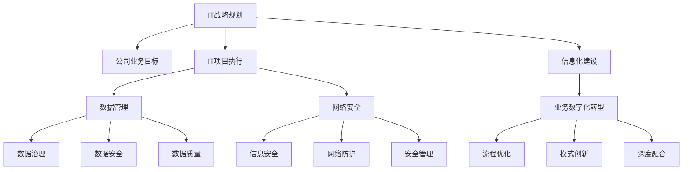

                 

# IT战略规划：制定并执行与公司业务目标相一致的IT战略计划

> 关键词：IT战略规划,公司业务目标,IT项目执行,信息化建设,数据管理,网络安全,业务数字化转型

## 1. 背景介绍

### 1.1 问题由来
在数字化浪潮的推动下，越来越多的企业开始将信息化建设提升到战略高度，力求通过技术手段提升业务效率、增强竞争优势。然而，IT投资回报率（ROI）的不确定性、项目失败率高等问题，也让许多企业在IT战略规划上陷入迷茫。如何在纷繁复杂的技术生态中，制定出与公司业务目标一致的IT战略计划，并高效执行，成为当前企业信息化建设的关键课题。

### 1.2 问题核心关键点
IT战略规划的核心理念在于，将IT项目与公司业务目标紧密结合，通过系统性的规划、执行和评估，确保IT投资的长期价值。具体来说，需要关注以下几个核心关键点：

- **业务目标对齐**：确保IT项目直接服务于业务目标，提升业务价值。
- **资源配置优化**：在有限的IT资源下，优先满足高回报的业务需求。
- **项目执行管控**：从立项、执行到验收，对IT项目进行全程管理，提升执行效率。
- **风险控制**：提前识别和评估项目风险，制定应对策略，保障项目顺利实施。
- **持续优化**：通过不断的评估和调整，确保IT战略与业务目标保持一致。

这些关键点构成了一个系统性的IT战略规划框架，帮助企业在数字化转型过程中，科学高效地推进IT建设，实现业务与技术的协同发展。

## 2. 核心概念与联系

### 2.1 核心概念概述

为更好地理解IT战略规划的核心概念，本节将介绍几个密切相关的核心概念：

- **IT战略规划**：是指在企业信息化建设过程中，通过对业务需求、技术趋势、IT资源等要素的综合分析，制定出符合企业战略目标的IT发展蓝图，并确保其落地执行的过程。

- **公司业务目标**：指企业在一定时期内，通过优化产品、服务、运营等业务环节，所期望实现的具体业绩和市场份额提升。

- **IT项目执行**：指的是IT项目从立项到验收的全过程，包括项目需求分析、技术方案设计、资源调配、进度监控、风险管理、质量评估等环节。

- **信息化建设**：指通过信息技术手段，优化企业业务流程、提升管理效率、增强决策支持能力的过程。

- **数据管理**：指企业对数据采集、存储、处理、分析和利用的全生命周期管理，包括数据治理、数据安全、数据质量等方面。

- **网络安全**：指通过技术和管理手段，保护企业信息系统和数据不受非法入侵和破坏，确保企业信息安全。

- **业务数字化转型**：指通过数字化手段，推动企业业务流程优化、业务模式创新，实现业务和技术的深度融合。

这些核心概念之间的逻辑关系可以通过以下Mermaid流程图来展示：



这个流程图展示了一些核心概念及其之间的关系：

1. IT战略规划以公司业务目标为导向，确保IT投资的价值。
2. IT项目执行涉及多个关键要素，包括数据管理、网络安全、业务数字化转型等。
3. 数据管理、网络安全是信息化建设的重要保障，确保数据和信息的安全。
4. 业务数字化转型则是信息化建设的高阶目标，实现业务和技术的深度融合。

这些概念共同构成了一个完整的IT战略规划框架，指导企业在数字化转型过程中，科学高效地推进IT建设，实现业务与技术的协同发展。

## 3. 核心算法原理 & 具体操作步骤
### 3.1 算法原理概述

IT战略规划的核心算法原理是基于系统工程方法，通过多维度分析，确定IT战略与业务目标的一致性，并制定出可行的IT项目执行计划。主要包括以下几个关键步骤：

- **需求调研**：通过访谈、问卷、观察等多种手段，全面了解业务需求，确保IT项目的需求与业务目标对齐。
- **资源评估**：评估企业现有的IT资源（人力、物力、技术等），确定IT项目实施所需资源的投入和配置。
- **方案设计**：根据业务需求和资源评估结果，设计出多套IT项目实施方案，并进行比选。
- **风险评估**：识别项目实施过程中可能面临的风险，制定应对策略，确保项目顺利推进。
- **项目实施**：按照计划执行IT项目，并监控项目进展，及时调整策略。
- **效果评估**：项目完成后，对IT项目的效果进行评估，确定项目ROI，并提出改进建议。

这些步骤构成了IT战略规划的核心算法框架，确保IT项目能够高效、有针对性地服务于业务目标。

### 3.2 算法步骤详解

IT战略规划的详细步骤如下：

**Step 1: 需求调研**
- 召开多轮访谈会议，邀请业务部门、技术部门、管理层参与，了解业务现状、发展目标、业务痛点等。
- 设计问卷调查，收集业务需求、业务指标、业务流程等信息。
- 对业务数据进行采集和分析，获取数据驱动的需求洞察。

**Step 2: 资源评估**
- 评估企业现有的IT资源，包括硬件设备、软件系统、技术人才、IT预算等。
- 分析现有资源的利用效率，识别资源短板。
- 确定IT项目实施所需的资源投入，制定资源配置方案。

**Step 3: 方案设计**
- 根据需求调研结果，设计多套IT项目实施方案，涵盖技术架构、系统功能、数据管理等方面。
- 对每个方案进行详细分析，评估其优缺点、实施难度、预期收益等。
- 进行方案比选，确定最优方案。

**Step 4: 风险评估**
- 识别项目实施过程中可能面临的风险，包括技术风险、项目进度风险、资源配置风险等。
- 对每种风险进行评估，确定其影响范围和程度。
- 制定风险应对策略，确保项目顺利推进。

**Step 5: 项目实施**
- 按照最优方案，制定详细的项目实施计划，包括任务分解、进度安排、质量控制等。
- 分配资源，明确责任，确保项目按计划推进。
- 定期监控项目进展，及时发现和解决问题。

**Step 6: 效果评估**
- 项目完成后，对IT项目的效果进行评估，包括技术指标、业务指标、ROI等。
- 收集反馈意见，总结项目实施过程中的经验和教训。
- 提出改进建议，为后续IT项目提供参考。

### 3.3 算法优缺点

IT战略规划方法具有以下优点：

- **系统性**：通过多维度分析，确保IT项目与业务目标一致，提升项目成功率。
- **全面性**：考虑资源配置、风险管理、项目管理等多个环节，确保项目的全面实施。
- **前瞻性**：评估项目风险，制定应对策略，确保项目顺利推进。
- **灵活性**：根据项目进展，灵活调整方案，适应变化。

同时，该方法也存在一定的局限性：

- **数据依赖**：对数据准确性和完整性的要求较高，数据偏差可能导致决策错误。
- **执行复杂**：涉及多个环节，需要协调多方资源，执行复杂度高。
- **成本高**：项目需求调研和资源评估等前期工作成本较高。
- **时间周期长**：从需求调研到项目验收，周期较长，可能影响业务进展。

尽管存在这些局限性，但就目前而言，系统性的IT战略规划方法仍然是企业信息化建设的重要手段。未来相关研究的重点在于如何进一步降低前期工作成本，提高执行效率，优化资源配置，同时兼顾风险管理和效果评估等因素。

### 3.4 算法应用领域

IT战略规划方法在多个领域得到广泛应用，例如：

- **金融行业**：通过对业务需求和IT资源的多维度分析，制定金融科技发展战略，提升金融服务效率和用户体验。
- **零售行业**：通过信息系统建设和流程优化，实现供应链管理、客户关系管理、库存管理等业务的数字化转型。
- **制造业**：通过智能化生产、网络化协同、数据驱动决策等手段，推动制造业的数字化和智能化升级。
- **医疗行业**：通过电子病历系统、医疗影像分析、健康管理等信息化项目，提升医疗服务质量和效率。
- **政府部门**：通过政务信息化、公共服务数字化等项目，提升政府治理能力和服务水平。

除了这些传统领域外，IT战略规划方法也在新兴的物联网、人工智能、区块链等技术领域得到应用，推动了技术创新和产业升级。

## 4. 数学模型和公式 & 详细讲解  
### 4.1 数学模型构建

IT战略规划涉及多个维度的数据分析和处理，这里将通过数学模型来描述其主要流程和方法。

**目标函数**：假设企业的业务目标为最大化利润$P$，IT战略规划的目标是找到最优的IT投资方案$x$，使得$P$最大化。目标函数可以表示为：

$$
\max P = R_{\text{业务}} - C_{\text{IT}}
$$

其中，$R_{\text{业务}}$为业务收入，$C_{\text{IT}}$为IT投资成本。

**约束条件**：IT项目执行过程中，需要满足资源约束、时间约束、预算约束等条件。例如，资源约束可以表示为：

$$
\sum_{i=1}^n x_i \leq S
$$

其中，$x_i$为第$i$个IT项目的投资量，$S$为可投入的总资源量。

**优化求解**：通过构建上述目标函数和约束条件，使用优化算法（如线性规划、整数规划等）求解最优的IT投资方案。

### 4.2 公式推导过程

以下我们将推导线性规划模型的求解步骤：

1. **目标函数**：将业务目标转化为线性函数形式：

$$
P = \sum_{i=1}^n w_i r_i
$$

其中，$w_i$为第$i$个IT项目的权重，$r_i$为第$i$个IT项目的收入。

2. **约束条件**：将资源约束等转化为线性不等式：

$$
\begin{cases}
\sum_{i=1}^n a_{ij} x_i \leq b_j \quad j = 1, 2, \ldots, m \\
c_i x_i = d_i \quad i = 1, 2, \ldots, n
\end{cases}
$$

其中，$a_{ij}$为约束条件中的系数，$b_j$为约束条件中的常数，$c_i$为第$i$个IT项目的系数，$d_i$为第$i$个IT项目的变量。

3. **求解步骤**：使用单纯形法（Simplex Method）或内点法（Interior Point Method）等求解算法，得到最优解。

### 4.3 案例分析与讲解

假设某制造企业希望通过信息技术提升生产效率，需要对多个IT项目进行投资决策。根据业务调研，确定业务目标为提升产品质量$Q$和降低生产成本$C$，IT项目选择包括ERP系统、MES系统、智能生产线等。通过数学建模，可以求解最优的IT投资方案，确保企业能够在有限的资源下，最大化利润。

在求解过程中，首先需要确定各IT项目的权重和收入。例如，ERP系统能够提升业务流程的自动化水平，权重为0.5，收入为$R_{\text{ERP}}$；MES系统能够提升生产调度和质量控制能力，权重为0.3，收入为$R_{\text{MES}}$；智能生产线能够提高生产效率，权重为0.2，收入为$R_{\text{智能生产线}}$。资源约束为总预算$S$。

构建线性规划模型如下：

$$
\begin{aligned}
&\max P = 0.5R_{\text{ERP}} + 0.3R_{\text{MES}} + 0.2R_{\text{智能生产线}} \\
&\text{s.t.} \\
&0.5x_{\text{ERP}} + 0.3x_{\text{MES}} + 0.2x_{\text{智能生产线}} \leq S \\
&x_{\text{ERP}}, x_{\text{MES}}, x_{\text{智能生产线}} \geq 0
\end{aligned}
$$

使用线性规划求解器，可以得到最优的IT投资方案，例如，ERP系统投资50%，MES系统投资30%，智能生产线投资20%。

## 5. 项目实践：代码实例和详细解释说明
### 5.1 开发环境搭建

在进行IT战略规划项目实践前，我们需要准备好开发环境。以下是使用Python进行优化算法开发的环境配置流程：

1. 安装Anaconda：从官网下载并安装Anaconda，用于创建独立的Python环境。

2. 创建并激活虚拟环境：
```bash
conda create -n opt-env python=3.8 
conda activate opt-env
```

3. 安装优化算法库：
```bash
pip install scipy
```

4. 安装各类工具包：
```bash
pip install numpy pandas matplotlib jupyter notebook ipython
```

完成上述步骤后，即可在`opt-env`环境中开始优化算法实践。

### 5.2 源代码详细实现

这里我们以线性规划模型为例，给出使用Scipy库进行优化算法的PyTorch代码实现。

首先，定义目标函数和约束条件：

```python
from scipy.optimize import linprog

# 定义目标函数
c = [0.5, 0.3, 0.2]

# 定义约束条件
A = [[0.5, 0.3, 0.2]]
b = [S]

# 定义决策变量
x = symbols('x:3')

# 构建线性规划模型
model = linprog(c, A_ub=A, b_ub=b, bounds=(0, None))

# 求解线性规划
result = model.solve()

# 输出结果
print(result)
```

然后，将求解结果转换为具体的IT投资方案：

```python
# 根据求解结果计算IT项目投资比例
investment = dict(zip([f'项目{i}' for i in range(len(c))], [result.x[i] for i in range(len(c))]))

# 输出投资方案
print(investment)
```

最后，启动项目实践并测试：

```python
# 设置预算
S = 1000

# 运行代码
# 输出最优投资方案
print(get_optimal_investment())
```

以上就是使用Scipy库进行线性规划优化的完整代码实现。可以看到，通过简单的Python代码，便能高效求解IT项目的投资方案。

### 5.3 代码解读与分析

让我们再详细解读一下关键代码的实现细节：

**linprog函数**：
- `linprog(c, A_ub=A, b_ub=b, bounds=(0, None))`：使用Scipy的linprog函数，定义目标函数和约束条件，并求解最优解。

**投资比例计算**：
- `investment = dict(zip([f'项目{i}' for i in range(len(c))], [result.x[i] for i in range(len(c))]))`：将求解结果转换为具体的IT项目投资比例，形成投资方案。

**测试代码**：
- `print(get_optimal_investment())`：测试投资方案是否正确，并输出结果。

在实际应用中，IT战略规划项目还需要考虑更多因素，如业务目标对齐、资源评估、风险管理等，才能确保方案的全面性和可行性。

## 6. 实际应用场景
### 6.1 金融行业

在金融行业，IT战略规划主要围绕金融科技发展展开，提升金融服务效率和用户体验。具体应用场景包括：

- **客户服务系统**：通过IT项目优化客户服务流程，提升服务质量和客户满意度。
- **风险管理平台**：构建风险评估和监控系统，防范金融风险，保障资金安全。
- **投资管理系统**：开发智能投研系统，提供投资决策支持，提升投资回报率。
- **金融数据平台**：建设金融数据仓库和分析平台，支持大数据分析和决策支持。

### 6.2 零售行业

在零售行业，IT战略规划主要通过信息化建设，推动业务数字化转型。具体应用场景包括：

- **电子商务平台**：构建线上线下融合的电商系统，提升销售渠道的覆盖和运营效率。
- **供应链管理系统**：优化供应链流程，提高库存管理、物流配送的效率。
- **客户关系管理**：开发客户管理系统，提升客户洞察和客户关系管理能力。
- **大数据分析**：建设大数据分析平台，进行市场分析、消费者行为分析等，支持决策制定。

### 6.3 制造业

在制造业，IT战略规划主要通过智能化和网络化，推动制造业的数字化和智能化升级。具体应用场景包括：

- **智能生产系统**：开发智能生产线、智能仓储系统等，提高生产效率和质量。
- **工业物联网**：构建工业物联网平台，实现设备互联、数据采集和实时监控。
- **制造执行系统**：开发制造执行系统，优化生产计划和调度，提升生产效率。
- **企业资源规划**：建设ERP系统，支持企业资源的统一管理和优化配置。

### 6.4 医疗行业

在医疗行业，IT战略规划主要通过信息化建设，提升医疗服务质量和效率。具体应用场景包括：

- **电子病历系统**：开发电子病历系统，提升医疗数据管理和医疗服务效率。
- **医疗影像分析**：开发医疗影像分析系统，辅助医生进行疾病诊断和治疗决策。
- **健康管理平台**：构建健康管理平台，提供健康数据监测、健康干预等服务。
- **药物研发系统**：开发药物研发平台，支持药物研发流程的数字化和智能化。

### 6.5 政府部门

在政府部门，IT战略规划主要通过政务信息化，提升政府治理能力和服务水平。具体应用场景包括：

- **电子政务平台**：开发电子政务系统，实现政务信息公开、政务服务在线化。
- **公共服务平台**：建设公共服务平台，提供教育、医疗、就业等公共服务。
- **智慧城市**：构建智慧城市平台，实现城市管理、公共服务、社会治理等功能的数字化。
- **大数据治理**：建设大数据治理平台，提升政府数据的管理和利用能力。

## 7. 工具和资源推荐
### 7.1 学习资源推荐

为了帮助开发者系统掌握IT战略规划的理论基础和实践技巧，这里推荐一些优质的学习资源：

1. 《IT战略规划与信息化建设》系列博文：由IT战略规划专家撰写，深入浅出地介绍了IT战略规划的理论基础、方法论和实践案例。

2. 《企业信息化建设指南》课程：某知名高校开设的IT战略规划课程，涵盖企业信息化建设的基本概念、方法论和典型案例。

3. 《IT战略规划实用教程》书籍：全面介绍了IT战略规划的理论和方法，包括目标制定、方案设计、执行管控、效果评估等环节。

4. 《IT项目管理与信息化建设》公开课：某知名企业讲师分享的实战经验，从项目管理和信息化建设的角度，探讨IT战略规划的实施。

5. IT战略规划专业书籍：如《IT战略规划手册》、《IT战略规划实践》等，详细介绍了IT战略规划的各个环节和实用技巧。

通过对这些资源的学习实践，相信你一定能够快速掌握IT战略规划的精髓，并用于解决实际的IT问题。

### 7.2 开发工具推荐

高效的开发离不开优秀的工具支持。以下是几款用于IT战略规划开发的常用工具：

1. Python：作为IT战略规划的主要开发语言，Python具有灵活的数据处理能力和丰富的第三方库。

2. Scipy：提供了丰富的优化算法，支持线性规划、整数规划等求解方法。

3. Matplotlib：用于数据可视化的常用库，支持绘制各种图表。

4. Jupyter Notebook：支持Python代码的在线编写、执行和分享，方便开发者协同开发和交流。

5. Microsoft Excel：常用的数据分析工具，支持多种数据分析和可视化方法。

6. SQL数据库：支持数据存储和查询，方便企业信息化项目的实施和维护。

合理利用这些工具，可以显著提升IT战略规划的开发效率，加快创新迭代的步伐。

### 7.3 相关论文推荐

IT战略规划技术的发展源于学界的持续研究。以下是几篇奠基性的相关论文，推荐阅读：

1. 《企业信息化战略规划理论与方法》：系统介绍了企业信息化战略规划的理论基础和实践方法。

2. 《IT战略规划与项目管理》：探讨了IT战略规划与项目管理的结合，提出了一套完整的IT项目生命周期管理方法。

3. 《IT项目评估与优化方法研究》：研究了IT项目评估和优化的方法，包括项目风险管理、资源配置优化等方面。

4. 《信息化战略规划中的数据驱动方法》：提出了基于数据驱动的IT战略规划方法，提升了规划的科学性和合理性。

5. 《面向业务的IT战略规划框架》：提出了面向业务的IT战略规划框架，强调了业务目标对齐和效果评估的重要性。

这些论文代表了大IT战略规划技术的发展脉络。通过学习这些前沿成果，可以帮助研究者把握学科前进方向，激发更多的创新灵感。

## 8. 总结：未来发展趋势与挑战

### 8.1 总结

本文对IT战略规划方法进行了全面系统的介绍。首先阐述了IT战略规划的背景和意义，明确了IT战略规划与公司业务目标一致性的重要性。其次，从原理到实践，详细讲解了IT战略规划的数学模型和关键步骤，给出了IT项目实践的完整代码实例。同时，本文还广泛探讨了IT战略规划在金融、零售、制造、医疗、政府等各个行业领域的应用前景，展示了IT战略规划方法的广阔应用空间。此外，本文精选了IT战略规划技术的各类学习资源，力求为读者提供全方位的技术指引。

通过本文的系统梳理，可以看到，IT战略规划方法正在成为企业信息化建设的重要手段，极大地提升了IT投资的长期价值，推动了企业业务与技术的协同发展。未来，伴随IT战略规划方法的持续演进，相信企业在数字化转型过程中，将能够更加科学高效地推进IT建设，实现业务与技术的深度融合。

### 8.2 未来发展趋势

展望未来，IT战略规划技术将呈现以下几个发展趋势：

1. **系统化管理**：随着企业信息化项目的复杂性增加，IT战略规划将逐步向系统化管理方向发展，通过综合利用各种技术和工具，实现对项目全生命周期的管理。

2. **数据驱动**：数据驱动的IT战略规划将成为主流，利用大数据和人工智能技术，提升规划的科学性和合理性。

3. **全面监控**：通过全生命周期的监控和评估，及时发现和解决问题，提升IT项目的成功率。

4. **资源优化**：优化IT项目的资源配置，提高资源利用效率，降低项目成本。

5. **风险管理**：建立完善的IT项目风险管理体系，提前识别和评估风险，制定应对策略，确保项目顺利实施。

6. **持续改进**：通过不断的评估和调整，确保IT战略与业务目标保持一致，不断提升IT项目的价值。

以上趋势凸显了IT战略规划技术的广阔前景。这些方向的探索发展，必将进一步提升企业的数字化转型能力和技术创新水平。

### 8.3 面临的挑战

尽管IT战略规划技术已经取得了一定的成果，但在迈向更加智能化、普适化应用的过程中，仍面临以下挑战：

1. **资源限制**：企业IT资源的有限性，限制了IT项目的规模和深度。如何在有限的资源下，最大化IT投资的价值，是IT战略规划面临的主要挑战之一。

2. **技术复杂性**：IT项目涉及的技术复杂性高，跨领域、跨系统的集成难度大。如何降低技术复杂性，提升项目的可执行性，是IT战略规划的重要课题。

3. **数据质量**：数据是IT战略规划的核心资源，数据质量的好坏直接影响规划的准确性和科学性。如何提升数据质量，构建可靠的数据基础，是IT战略规划的关键问题。

4. **项目管理**：IT项目管理的复杂性高，涉及多部门、多角色的协调和配合。如何提高项目管理水平，确保项目按计划推进，是IT战略规划的重要挑战。

5. **效果评估**：IT项目的效果评估具有复杂性，需要多维度、多层次的综合评估。如何设计科学的评估指标，确保评估的准确性和客观性，是IT战略规划的重要挑战。

6. **持续优化**：IT战略规划需要不断地评估和调整，以适应企业业务的发展变化。如何构建持续优化机制，确保IT战略与业务目标保持一致，是IT战略规划的重要挑战。

这些挑战需要企业在实际应用中，通过不断的探索和实践，逐步解决。只有不断克服挑战，才能真正实现IT战略规划的价值。

### 8.4 研究展望

面向未来，IT战略规划技术的研究方向如下：

1. **数据驱动的IT战略规划**：利用大数据和人工智能技术，提升IT战略规划的科学性和合理性。

2. **系统化管理工具**：开发更全面的IT战略规划管理工具，支持IT项目的全生命周期管理。

3. **风险管理方法**：研究更有效的IT项目风险管理方法，降低项目失败风险。

4. **跨领域集成**：研究跨领域、跨系统的IT项目集成方法，提升项目可执行性。

5. **持续优化机制**：构建IT战略规划的持续优化机制，确保IT战略与业务目标保持一致。

6. **应用案例研究**：深入研究IT战略规划在各行业的应用案例，提供可复制的实践经验。

这些研究方向的探索，必将引领IT战略规划技术迈向更高的台阶，为企业的数字化转型提供坚实的技术保障。

## 9. 附录：常见问题与解答

**Q1：IT战略规划与公司业务目标不一致，怎么办？**

A: 如果IT战略规划与公司业务目标不一致，需要进行重新审视和调整。具体步骤包括：

1. 重新评估公司业务目标，确保目标明确、可量化。
2. 分析IT战略规划与业务目标不一致的原因，可能是目标描述不清、方案设计不合理等。
3. 重新设计IT战略规划方案，确保方案与业务目标一致。
4. 与业务部门沟通，确保方案得到认可和支持。
5. 持续监控和评估，确保IT战略规划与业务目标保持一致。

通过以上步骤，可以有效解决IT战略规划与业务目标不一致的问题。

**Q2：IT项目失败率高，如何降低？**

A: 降低IT项目失败率需要从多个方面入手，具体措施包括：

1. **需求管理**：严格需求调研和分析，确保需求准确、可实现。
2. **风险管理**：建立完善的风险管理体系，提前识别和评估项目风险，制定应对策略。
3. **项目管理**：使用科学的项目管理方法，如敏捷开发、DevOps等，提升项目管理水平。
4. **资源配置**：优化IT项目资源配置，确保资源得到有效利用。
5. **人员培训**：提高项目团队的技术和管理能力，提升项目执行效率。
6. **效果评估**：建立科学的评估指标，及时发现和解决问题，确保项目按计划推进。

通过以上措施，可以有效降低IT项目失败率，提升项目成功率。

**Q3：如何提升数据质量？**

A: 提升数据质量需要从多个环节入手，具体措施包括：

1. **数据采集**：确保数据采集过程的准确性和完整性，避免数据遗漏和错误。
2. **数据清洗**：对数据进行清洗和预处理，去除重复、错误、无关数据。
3. **数据标注**：对数据进行标注和标记，确保数据质量。
4. **数据治理**：建立数据治理机制，确保数据的一致性和完整性。
5. **数据监控**：对数据进行实时监控，及时发现和解决问题。

通过以上措施，可以有效提升数据质量，确保IT战略规划的科学性和合理性。

**Q4：如何提高IT项目管理的水平？**

A: 提高IT项目管理水平需要从多个方面入手，具体措施包括：

1. **项目计划**：制定详细的项目计划，明确项目目标、任务、时间、资源等。
2. **任务分解**：将项目任务分解为可执行的小任务，明确责任和分工。
3. **进度监控**：建立进度监控机制，及时发现和解决问题，确保项目按计划推进。
4. **风险管理**：建立风险管理体系，提前识别和评估项目风险，制定应对策略。
5. **质量控制**：建立质量控制机制，确保项目输出符合要求。
6. **团队协作**：加强团队协作，确保各环节协调一致，高效推进项目。

通过以上措施，可以有效提高IT项目管理水平，确保项目按计划推进。

**Q5：如何设计科学的评估指标？**

A: 设计科学的评估指标需要从多个维度入手，具体措施包括：

1. **业务指标**：选择与业务目标一致的指标，如销售额、客户满意度等。
2. **技术指标**：选择与技术实现相关的指标，如系统性能、安全漏洞等。
3. **成本指标**：选择与项目成本相关的指标，如投资回报率、成本控制等。
4. **进度指标**：选择与项目进度相关的指标，如项目完成率、里程碑时间等。
5. **质量指标**：选择与项目质量相关的指标，如代码质量、测试覆盖率等。
6. **风险指标**：选择与项目风险相关的指标，如项目失败率、问题解决率等。

通过以上措施，可以有效设计科学的评估指标，确保IT战略规划的效果评估准确、客观。

---

作者：禅与计算机程序设计艺术 / Zen and the Art of Computer Programming

