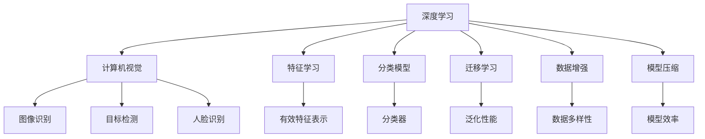

                 

# ImageNet与人工智能的进步

> 关键词：ImageNet, 深度学习, 计算机视觉, 特征学习, 分类模型, 迁移学习, 数据增强, 模型压缩

## 1. 背景介绍

### 1.1 问题由来
自深度学习技术在21世纪初崭露头角以来，其在图像识别、语音识别、自然语言处理等领域的进展，对人工智能技术的进步起到了举足轻重的作用。其中，计算机视觉领域的发展尤为迅猛。2009年，ImageNet数据集的出现，标志着这一领域的重大转折。

ImageNet是由斯坦福大学发布的一个大规模图像识别数据集，包含了数百万张高质量标注图片。自发布以来，ImageNet驱动了多个里程碑式的研究成果，其中最为人熟知的是2012年Krizhevsky等人提出的AlexNet模型，首次在ImageNet数据集上取得了显著的性能提升。此后，ResNet、Inception、VGG等系列模型在ImageNet上不断刷新性能记录，奠定了深度学习在计算机视觉领域的核心地位。

然而，ImageNet的成功并非偶然，其背后蕴含的深度学习原理和方法，极大地推动了人工智能技术的进步。本文将深入探讨ImageNet对人工智能发展的深远影响，以及其驱动的关键技术和方法。

### 1.2 问题核心关键点
ImageNet的发布与使用，主要集中在以下几个关键点：

- **大规模数据集**：ImageNet提供了数百万张高质量标注图片，使得深度学习模型能够在大规模数据上进行训练和测试。
- **复杂任务**：ImageNet中的图片标注涵盖了1000类物体，具有极高的任务复杂性。
- **深度神经网络**：ImageNet的复杂性和规模性，促使研究者开发了更为复杂的深度神经网络模型，提升了特征表示的性能。
- **迁移学习**：ImageNet数据集的多样性，使得深度学习模型能够在不同的数据集上实现迁移学习，提升了泛化性能。

以上几点共同构成了ImageNet对人工智能发展的核心驱动因素，其对计算机视觉乃至人工智能技术的广泛应用和进步，产生了深远影响。

## 2. 核心概念与联系

### 2.1 核心概念概述

为了更好地理解ImageNet对人工智能的贡献，本节将介绍几个密切相关的核心概念：

- **深度学习(Deep Learning)**：一种通过多层次的非线性神经网络模型，从原始数据中学习特征表示的机器学习方法。深度学习能够捕捉数据的复杂非线性关系，适用于图像、语音、文本等多种数据类型的处理。
- **计算机视觉(Computer Vision)**：利用计算机技术实现对视觉信息的分析、理解和处理，包括图像识别、目标检测、人脸识别等任务。计算机视觉是人工智能领域的重要分支，具有广泛的应用前景。
- **特征学习(Feature Learning)**：指从原始数据中自动学习出有效的特征表示，以提升模型的性能和泛化能力。特征学习是深度学习的核心目标之一。
- **分类模型(Classification Model)**：将输入数据映射到预定义的类别标签上，是计算机视觉中常见的任务之一。分类模型如卷积神经网络（Convolutional Neural Networks, CNNs）在ImageNet上取得了显著成效。
- **迁移学习(Transfer Learning)**：指在一个领域学习的模型，可以在另一个领域中继续学习并取得优异表现，从而节省大量训练时间和数据。ImageNet的广泛应用，为迁移学习提供了丰富的数据来源。
- **数据增强(Data Augmentation)**：通过对训练数据进行一系列随机变换，生成更多的训练样本来提升模型的泛化能力。数据增强在ImageNet的深度学习研究中得到了广泛应用。
- **模型压缩(Model Compression)**：指通过各种手段，减少深度学习模型的参数量和计算量，以实现模型的高效部署和资源利用。模型压缩是深度学习应用中的重要技术手段。

这些核心概念之间的逻辑关系可以通过以下Mermaid流程图来展示：



这个流程图展示了一些核心概念及其之间的关系：

- 深度学习通过多层次的非线性神经网络模型，学习出有效特征表示。
- 计算机视觉利用深度学习进行图像处理和分析，覆盖了图像识别、目标检测等任务。
- 分类模型基于深度学习模型，进行输入数据到类别标签的映射。
- 迁移学习使得模型能够在不同的数据集和任务上实现知识迁移。
- 数据增强通过随机变换生成更多训练数据，提升模型泛化能力。
- 模型压缩优化模型参数量和计算量，实现高效部署。

这些概念共同构成了ImageNet驱动人工智能发展的基本框架，其背后的理论和方法，极大地推动了计算机视觉和人工智能技术的进步。

## 3. 核心算法原理 & 具体操作步骤
### 3.1 算法原理概述

基于ImageNet的数据集和任务，深度学习模型通过大规模的标注数据进行训练，学习出对复杂任务的特征表示能力。其核心原理可以概括为以下几点：

1. **数据驱动学习**：深度学习模型通过大规模数据集进行训练，自动学习出有效特征表示。
2. **特征级联**：深度神经网络通过多个层次的特征学习，逐步提升特征表示的性能。
3. **反向传播算法**：通过反向传播算法，深度学习模型能够高效计算梯度，从而进行参数更新和模型优化。
4. **迁移学习**：利用在ImageNet上训练的模型，可以在其他数据集上进行迁移学习，提升模型的泛化能力。
5. **数据增强**：通过对训练数据进行随机变换，生成更多的训练样本来提升模型泛化能力。

这些原理共同构成了深度学习在计算机视觉领域取得突破的核心方法。

### 3.2 算法步骤详解

基于ImageNet的数据集和任务，深度学习模型的微调步骤可以概括为以下几点：

1. **数据预处理**：将ImageNet数据集划分为训练集、验证集和测试集，并进行预处理（如标准化、归一化等）。
2. **模型构建**：选择适当的深度神经网络模型，如AlexNet、ResNet、Inception等，并进行参数初始化。
3. **模型训练**：利用训练集数据，通过反向传播算法进行模型参数更新，优化损失函数。
4. **模型评估**：在验证集上评估模型性能，调整超参数，防止过拟合。
5. **模型测试**：在测试集上评估最终模型性能，比较微调前后的性能提升。

### 3.3 算法优缺点

基于ImageNet的深度学习模型微调方法具有以下优点：

1. **泛化能力强**：ImageNet数据集的复杂性和多样性，使得深度学习模型能够学习到更为强大的特征表示，提升泛化性能。
2. **迁移学习效果显著**：利用在ImageNet上训练的模型，可以在其他数据集上进行迁移学习，提升模型在新数据集上的性能。
3. **高效计算**：深度学习模型通过反向传播算法，能够高效计算梯度，进行参数更新。
4. **数据增强提升模型泛化能力**：通过对训练数据进行随机变换，生成更多的训练样本，提升模型泛化能力。

同时，该方法也存在一定的局限性：

1. **数据需求量大**：ImageNet数据集规模庞大，数据收集和标注成本高昂。
2. **计算资源消耗大**：大规模深度学习模型的训练和推理需要大量的计算资源。
3. **模型复杂度高**：深度神经网络模型的复杂性，使得模型难以解释和调试。
4. **过拟合风险高**：在大规模数据集上训练的模型，容易出现过拟合现象。

尽管存在这些局限性，但就目前而言，基于ImageNet的深度学习模型微调方法仍然是大规模计算机视觉应用的主流范式。未来相关研究的重点在于如何进一步降低数据和计算资源的需求，提高模型的泛化能力，同时兼顾可解释性和伦理安全性等因素。

### 3.4 算法应用领域

基于ImageNet的深度学习模型微调方法在计算机视觉领域得到了广泛的应用，覆盖了几乎所有常见任务，例如：

- 图像识别：如手写数字识别、物体识别、场景分类等。通过微调使模型学习图像-类别映射。
- 目标检测：在图像中检测和定位特定物体。通过微调使模型学习物体边界和类别。
- 人脸识别：识别图像中的人脸并进行身份验证。通过微调使模型学习人脸特征表示。
- 图像分割：将图像分割为不同区域，用于语义理解等任务。通过微调使模型学习像素级别的特征表示。
- 图像生成：生成具有特定风格的图像。通过微调使模型学习生成特定风格的图像特征。
- 图像修复：修复图像中的损坏或缺失部分。通过微调使模型学习图像修复的特征表示。
- 图像超分辨率：将低分辨率图像提升为高分辨率图像。通过微调使模型学习图像超分辨率的特征表示。

除了上述这些经典任务外，深度学习模型微调也被创新性地应用到更多场景中，如可控图像生成、图像风格迁移、图像检索等，为计算机视觉技术带来了全新的突破。随着预训练模型和微调方法的不断进步，相信计算机视觉技术将在更广阔的应用领域大放异彩。

## 4. 数学模型和公式 & 详细讲解  
### 4.1 数学模型构建

基于ImageNet的数据集和任务，深度学习模型的数学模型可以概括为以下几点：

1. **输入表示**：将图像输入到卷积神经网络中，经过多个卷积层、池化层等操作，提取图像的特征表示。
2. **特征表示**：通过全连接层，将特征表示映射到类别标签上，得到模型的预测结果。
3. **损失函数**：选择适当的损失函数，如交叉熵损失、均方误差损失等，用于衡量模型预测结果与真实标签之间的差异。
4. **优化算法**：选择适当的优化算法，如随机梯度下降（SGD）、Adam等，用于更新模型参数。

### 4.2 公式推导过程

以下我们以图像分类任务为例，推导交叉熵损失函数及其梯度的计算公式。

假设模型 $M_{\theta}$ 在输入图像 $x$ 上的输出为 $\hat{y}=M_{\theta}(x) \in [0,1]$，表示图像属于第 $i$ 类的概率。真实标签 $y_i \in \{0,1\}$。则二分类交叉熵损失函数定义为：

$$
\ell(M_{\theta}(x),y_i) = -[y_i\log \hat{y}_i + (1-y_i)\log (1-\hat{y}_i)]
$$

将其代入损失函数，得：

$$
\mathcal{L}(\theta) = -\frac{1}{N}\sum_{i=1}^N \ell(M_{\theta}(x_i),y_i)
$$

其中 $N$ 为样本总数。

根据链式法则，损失函数对参数 $\theta_k$ 的梯度为：

$$
\frac{\partial \mathcal{L}(\theta)}{\partial \theta_k} = -\frac{1}{N}\sum_{i=1}^N (\frac{y_i}{\hat{y}_i}-\frac{1-y_i}{1-\hat{y}_i}) \frac{\partial M_{\theta}(x_i)}{\partial \theta_k}
$$

其中 $\frac{\partial M_{\theta}(x_i)}{\partial \theta_k}$ 可进一步递归展开，利用自动微分技术完成计算。

在得到损失函数的梯度后，即可带入优化算法，完成模型的迭代优化。重复上述过程直至收敛，最终得到适应ImageNet任务的最优模型参数 $\theta^*$。

## 5. 项目实践：代码实例和详细解释说明
### 5.1 开发环境搭建

在进行ImageNet图像分类任务时，需要准备好开发环境。以下是使用Python进行PyTorch开发的环境配置流程：

1. 安装Anaconda：从官网下载并安装Anaconda，用于创建独立的Python环境。

2. 创建并激活虚拟环境：
```bash
conda create -n pytorch-env python=3.8 
conda activate pytorch-env
```

3. 安装PyTorch：根据CUDA版本，从官网获取对应的安装命令。例如：
```bash
conda install pytorch torchvision torchaudio cudatoolkit=11.1 -c pytorch -c conda-forge
```

4. 安装Transformers库：
```bash
pip install transformers
```

5. 安装各类工具包：
```bash
pip install numpy pandas scikit-learn matplotlib tqdm jupyter notebook ipython
```

完成上述步骤后，即可在`pytorch-env`环境中开始项目实践。

### 5.2 源代码详细实现

下面我们以ImageNet图像分类任务为例，给出使用Transformers库对预训练的ResNet模型进行微调的PyTorch代码实现。

首先，定义模型和优化器：

```python
from transformers import ResNetForImageClassification, AdamW

model = ResNetForImageClassification.from_pretrained('resnet50')
optimizer = AdamW(model.parameters(), lr=2e-5)
```

接着，定义训练和评估函数：

```python
from torch.utils.data import DataLoader
from tqdm import tqdm
from sklearn.metrics import classification_report

device = torch.device('cuda') if torch.cuda.is_available() else torch.device('cpu')
model.to(device)

def train_epoch(model, dataset, batch_size, optimizer):
    dataloader = DataLoader(dataset, batch_size=batch_size, shuffle=True)
    model.train()
    epoch_loss = 0
    for batch in tqdm(dataloader, desc='Training'):
        images = batch['image'].to(device)
        labels = batch['label'].to(device)
        model.zero_grad()
        outputs = model(images)
        loss = outputs.loss
        epoch_loss += loss.item()
        loss.backward()
        optimizer.step()
    return epoch_loss / len(dataloader)

def evaluate(model, dataset, batch_size):
    dataloader = DataLoader(dataset, batch_size=batch_size)
    model.eval()
    preds, labels = [], []
    with torch.no_grad():
        for batch in tqdm(dataloader, desc='Evaluating'):
            images = batch['image'].to(device)
            batch_labels = batch['label']
            outputs = model(images)
            batch_preds = outputs.logits.argmax(dim=1).to('cpu').tolist()
            batch_labels = batch_labels.to('cpu').tolist()
            for pred, label in zip(batch_preds, batch_labels):
                preds.append(pred)
                labels.append(label)
                
    print(classification_report(labels, preds))
```

最后，启动训练流程并在测试集上评估：

```python
epochs = 5
batch_size = 16

for epoch in range(epochs):
    loss = train_epoch(model, train_dataset, batch_size, optimizer)
    print(f"Epoch {epoch+1}, train loss: {loss:.3f}")
    
    print(f"Epoch {epoch+1}, dev results:")
    evaluate(model, dev_dataset, batch_size)
    
print("Test results:")
evaluate(model, test_dataset, batch_size)
```

以上就是使用PyTorch对ResNet模型进行ImageNet图像分类任务微调的完整代码实现。可以看到，得益于Transformers库的强大封装，我们可以用相对简洁的代码完成模型加载和微调。

### 5.3 代码解读与分析

让我们再详细解读一下关键代码的实现细节：

**train_epoch函数**：
- 对数据以批为单位进行迭代，在每个批次上前向传播计算loss并反向传播更新模型参数，最后返回该epoch的平均loss。

**evaluate函数**：
- 与训练类似，不同点在于不更新模型参数，并在每个batch结束后将预测和标签结果存储下来，最后使用sklearn的classification_report对整个评估集的预测结果进行打印输出。

**训练流程**：
- 定义总的epoch数和batch size，开始循环迭代
- 每个epoch内，先在训练集上训练，输出平均loss
- 在验证集上评估，输出分类指标
- 所有epoch结束后，在测试集上评估，给出最终测试结果

可以看到，PyTorch配合Transformers库使得ImageNet图像分类任务的微调代码实现变得简洁高效。开发者可以将更多精力放在数据处理、模型改进等高层逻辑上，而不必过多关注底层的实现细节。

当然，工业级的系统实现还需考虑更多因素，如模型的保存和部署、超参数的自动搜索、更灵活的任务适配层等。但核心的微调范式基本与此类似。

## 6. 实际应用场景
### 6.1 智能安防监控

基于ImageNet的深度学习模型微调技术，可以广泛应用于智能安防监控系统的构建。传统的安防监控系统往往依赖于人工实时观察，耗时耗力且难以及时发现异常行为。通过微调预训练模型，可以构建智能监控系统，实现对监控视频的实时分析和异常检测。

在技术实现上，可以收集历史监控视频数据，将正常和异常行为构建成监督数据，在此基础上对预训练模型进行微调。微调后的模型能够自动理解视频中的人体动作、行为模式等特征，快速识别异常行为并进行告警。对于异常行为检测，还可以通过引入对抗样本，增强模型的鲁棒性，减少误报和漏报。

### 6.2 智能农业管理

ImageNet驱动的深度学习模型微调技术，同样可以应用于智能农业管理系统中。传统的农业管理依赖于人工经验，难以实现科学、高效的田间管理。通过微调模型，可以实现对农作物病虫害的自动识别和预警，对土壤肥力、气候条件等环境因素的自动监测。

在技术实现上，可以收集不同作物的病虫害图片、土壤样本等数据，将病虫害、土壤肥力等标签构建成监督数据，在此基础上对预训练模型进行微调。微调后的模型能够自动从图像中识别病虫害特征，从土壤样本中检测肥力水平，从而提供精准的田间管理建议。

### 6.3 智能医疗诊断

在医疗领域，ImageNet驱动的深度学习模型微调技术同样有着广泛的应用前景。传统的医疗诊断依赖于医生的经验和专业知识，难以实现大规模、高精度的诊断。通过微调模型，可以实现对医疗影像的自动识别和分析，提升医疗诊断的准确性和效率。

在技术实现上，可以收集医学影像数据和标注信息，将影像中的病变区域和诊断结果构建成监督数据，在此基础上对预训练模型进行微调。微调后的模型能够自动检测影像中的病变区域，分类诊断结果，从而提供初步的医疗诊断建议。对于复杂的医疗影像，还可以结合临床医生的经验进行二次审核，确保诊断的准确性和安全性。

### 6.4 未来应用展望

随着ImageNet驱动的深度学习模型的不断发展，其应用场景和影响力还将进一步扩展。未来，这些模型将在更多领域中发挥重要作用，推动社会的数字化、智能化转型。

在智慧城市治理中，微调模型可以用于实时监测城市事件、分析舆情变化，提升城市管理的自动化和智能化水平。在智能交通系统中，微调模型可以用于自动驾驶、交通流量分析等，提升交通系统的安全性和效率。在智能制造领域，微调模型可以用于设备故障诊断、生产流程优化等，提升制造业的智能化水平。

## 7. 工具和资源推荐
### 7.1 学习资源推荐

为了帮助开发者系统掌握ImageNet驱动的深度学习模型的相关技术，这里推荐一些优质的学习资源：

1. 《深度学习》系列课程：由斯坦福大学Andrew Ng教授开设，讲解深度学习的基本概念和关键技术，适合初学者入门。
2. 《计算机视觉: 算法与应用》课程：由MIT教授Ronald dwire开设，详细讲解计算机视觉中的关键技术和方法，适合进阶学习。
3. 《深度学习实战》书籍：讲解深度学习在图像分类、目标检测、图像生成等任务中的应用，适合动手实践。
4. 《Transformers》论文：Transformer模型的原始论文，介绍了Transformer结构及其在计算机视觉中的应用，适合深入理解。
5. Kaggle竞赛：Kaggle是一个数据科学竞赛平台，每年举办多个计算机视觉相关的竞赛，适合实践应用和团队合作。

通过对这些资源的学习实践，相信你一定能够全面掌握ImageNet驱动的深度学习模型的相关技术，并应用于实际问题解决中。

### 7.2 开发工具推荐

高效的开发离不开优秀的工具支持。以下是几款用于ImageNet图像分类任务开发的常用工具：

1. PyTorch：基于Python的开源深度学习框架，灵活动态的计算图，适合快速迭代研究。大多数预训练语言模型都有PyTorch版本的实现。
2. TensorFlow：由Google主导开发的开源深度学习框架，生产部署方便，适合大规模工程应用。同样有丰富的预训练语言模型资源。
3. Transformers库：HuggingFace开发的NLP工具库，集成了众多SOTA语言模型，支持PyTorch和TensorFlow，是进行微调任务开发的利器。
4. Weights & Biases：模型训练的实验跟踪工具，可以记录和可视化模型训练过程中的各项指标，方便对比和调优。与主流深度学习框架无缝集成。
5. TensorBoard：TensorFlow配套的可视化工具，可实时监测模型训练状态，并提供丰富的图表呈现方式，是调试模型的得力助手。
6. Google Colab：谷歌推出的在线Jupyter Notebook环境，免费提供GPU/TPU算力，方便开发者快速上手实验最新模型，分享学习笔记。

合理利用这些工具，可以显著提升ImageNet图像分类任务的开发效率，加快创新迭代的步伐。

### 7.3 相关论文推荐

ImageNet驱动的深度学习模型的发展源于学界的持续研究。以下是几篇奠基性的相关论文，推荐阅读：

1. AlexNet: One AlexNet Doth Negate All Others（AlexNet论文）：提出了AlexNet模型，在ImageNet数据集上取得了显著的性能提升，奠定了深度学习在计算机视觉领域的核心地位。
2. Deep Residual Learning for Image Recognition（ResNet论文）：提出ResNet模型，通过残差连接解决了深度神经网络中的梯度消失问题，提升了模型的深度和性能。
3. Inception-v3: A Simple and Highly Efficient Architecture for Image Recognition（Inception论文）：提出Inception模型，通过多分支结构提升了模型特征表示的性能。
4. Improving the ImageNet Classification with Deep Convolutional Neural Networks（VGG论文）：提出VGG模型，通过多个卷积层的级联提升了模型的特征表示性能。

这些论文代表了大规模计算机视觉任务中深度学习模型的发展脉络。通过学习这些前沿成果，可以帮助研究者把握学科前进方向，激发更多的创新灵感。

## 8. 总结：未来发展趋势与挑战

### 8.1 总结

本文对基于ImageNet的数据集和任务，深度学习模型的微调方法进行了全面系统的介绍。首先阐述了ImageNet对人工智能发展的深远影响，明确了深度学习模型在计算机视觉领域取得的突破性成果。其次，从原理到实践，详细讲解了深度学习模型的数学模型和关键步骤，给出了ImageNet图像分类任务的微调代码实例。同时，本文还广泛探讨了深度学习模型在智能安防监控、智能农业管理、智能医疗诊断等多个行业领域的应用前景，展示了其广阔的应用空间。

通过本文的系统梳理，可以看到，基于ImageNet的深度学习模型微调方法在计算机视觉领域取得了巨大成功，极大地推动了人工智能技术的进步。未来，随着预训练模型和微调方法的不断演进，计算机视觉技术将在更多领域中发挥重要作用，为社会带来深远的变革。

### 8.2 未来发展趋势

展望未来，基于ImageNet的深度学习模型微调技术将呈现以下几个发展趋势：

1. 模型规模持续增大。随着算力成本的下降和数据规模的扩张，深度学习模型的参数量还将持续增长。超大规模模型蕴含的丰富特征表示能力，将支撑更为复杂的计算机视觉任务。
2. 模型结构更灵活。未来的深度学习模型将融合更多多样化的结构，如注意力机制、Transformer结构等，提升模型的特征表示能力。
3. 数据增强手段更丰富。除了传统的随机变换，未来将出现更多创新的数据增强技术，进一步提升模型的泛化能力。
4. 迁移学习效果更佳。未来的迁移学习将结合更多领域的数据，提升模型的泛化能力和迁移性能。
5. 模型压缩更高效。未来的深度学习模型将采用更高效的模型压缩方法，如量化加速、模型剪枝等，实现更轻量级的部署。
6. 多模态融合更广泛。未来的深度学习模型将结合视觉、听觉、语言等多种模态数据，提升模型的感知能力和理解能力。

以上趋势凸显了基于ImageNet的深度学习模型的广阔前景，其背后的技术演进将继续推动计算机视觉和人工智能技术的进步。

### 8.3 面临的挑战

尽管基于ImageNet的深度学习模型在计算机视觉领域取得了巨大成功，但在向大规模、多样化应用推进的过程中，仍面临诸多挑战：

1. 数据需求量大。深度学习模型需要大量高质量标注数据，对于数据稀缺的领域，数据收集和标注成本高昂。
2. 计算资源消耗大。超大规模深度学习模型的训练和推理需要大量计算资源，存在算力瓶颈。
3. 模型复杂度高。深度神经网络模型的复杂性，使得模型难以解释和调试，难以保证输出的一致性和可靠性。
4. 迁移学习效果有局限。深度学习模型在不同数据集和任务上的迁移效果仍有提升空间。
5. 对抗样本风险高。深度学习模型可能对对抗样本存在脆弱性，导致模型决策的不稳定性。

尽管存在这些挑战，但随着技术的不断发展，上述问题将有望得到逐步解决。未来的深度学习模型将朝着更高效、更稳定、更可靠的方向发展，为计算机视觉和人工智能技术带来更大的突破。

### 8.4 研究展望

面对基于ImageNet的深度学习模型微调所面临的挑战，未来的研究需要在以下几个方面寻求新的突破：

1. 探索无监督和半监督微调方法。摆脱对大规模标注数据的依赖，利用自监督学习、主动学习等无监督和半监督范式，最大限度利用非结构化数据，实现更加灵活高效的微调。
2. 研究参数高效和计算高效的微调范式。开发更加参数高效的微调方法，在固定大部分预训练参数的同时，只更新极少量的任务相关参数。同时优化微调模型的计算图，减少前向传播和反向传播的资源消耗，实现更加轻量级、实时性的部署。
3. 融合因果和对比学习范式。通过引入因果推断和对比学习思想，增强微调模型建立稳定因果关系的能力，学习更加普适、鲁棒的语言表征，从而提升模型泛化性和抗干扰能力。
4. 引入更多先验知识。将符号化的先验知识，如知识图谱、逻辑规则等，与神经网络模型进行巧妙融合，引导微调过程学习更准确、合理的语言模型。同时加强不同模态数据的整合，实现视觉、语音等多模态信息与文本信息的协同建模。
5. 结合因果分析和博弈论工具。将因果分析方法引入微调模型，识别出模型决策的关键特征，增强输出解释的因果性和逻辑性。借助博弈论工具刻画人机交互过程，主动探索并规避模型的脆弱点，提高系统稳定性。
6. 纳入伦理道德约束。在模型训练目标中引入伦理导向的评估指标，过滤和惩罚有偏见、有害的输出倾向。同时加强人工干预和审核，建立模型行为的监管机制，确保输出符合人类价值观和伦理道德。

这些研究方向的探索，必将引领基于ImageNet的深度学习模型微调技术迈向更高的台阶，为构建安全、可靠、可解释、可控的智能系统铺平道路。面向未来，基于ImageNet的深度学习模型微调技术还需要与其他人工智能技术进行更深入的融合，如知识表示、因果推理、强化学习等，多路径协同发力，共同推动计算机视觉和人工智能技术的进步。

## 9. 附录：常见问题与解答

**Q1：ImageNet驱动的深度学习模型是否适用于所有计算机视觉任务？**

A: 尽管ImageNet驱动的深度学习模型在计算机视觉领域取得了广泛应用，但其适用范围仍有一定的局限性。对于特定领域的计算机视觉任务，如图像分割、医学图像分析等，可能需要结合领域特定的数据和知识进行微调，才能获得理想的性能。此外，对于需要高精度和高实时性的应用场景，如自动驾驶、实时物体检测等，传统的深度学习模型可能面临计算资源和部署效率的问题。

**Q2：如何选择合适的学习率？**

A: 深度学习模型的学习率通常需要根据具体的任务和模型进行调整。一般建议从较小的学习率开始，逐步增加学习率，观察模型的损失函数和验证集准确率变化。若发现验证集准确率出现波动或下降，则应适当减小学习率。常见的方式包括手动调整学习率和采用学习率衰减策略，如Cosine Anneling等。

**Q3：ImageNet微调过程中如何缓解过拟合问题？**

A: 过拟合是深度学习模型微调中的常见问题。缓解过拟合的方法包括：
1. 数据增强：通过随机变换生成更多的训练样本来提升模型的泛化能力。
2. 正则化：使用L2正则化、Dropout等技术，防止模型过拟合。
3. 早停法：当验证集准确率不再提升时，停止训练，避免过拟合。
4. 批量归一化：通过批量归一化技术，稳定模型的训练过程，防止过拟合。

这些方法可以结合使用，根据具体任务和数据集的特点，灵活调整参数，达到最佳的微调效果。

**Q4：ImageNet微调模型在落地部署时需要注意哪些问题？**

A: 将微调模型转化为实际应用，还需要考虑以下因素：
1. 模型裁剪：去除不必要的层和参数，减小模型尺寸，加快推理速度。
2. 量化加速：将浮点模型转为定点模型，压缩存储空间，提高计算效率。
3. 服务化封装：将模型封装为标准化服务接口，便于集成调用。
4. 弹性伸缩：根据请求流量动态调整资源配置，平衡服务质量和成本。
5. 监控告警：实时采集系统指标，设置异常告警阈值，确保服务稳定性。
6. 安全防护：采用访问鉴权、数据脱敏等措施，保障数据和模型安全。

通过上述措施，可以确保ImageNet微调模型的高效、稳定部署，提升其在实际应用中的性能和可靠性。

**Q5：如何降低深度学习模型的计算资源消耗？**

A: 深度学习模型的计算资源消耗主要来源于模型的参数量和计算量。降低计算资源消耗的方法包括：
1. 模型压缩：通过剪枝、量化、知识蒸馏等技术，减少模型参数量和计算量。
2. 推理加速：使用模型优化技术，如权值共享、快速卷积等，提升推理速度。
3. 并行计算：通过分布式计算和GPU加速，提高计算效率。
4. 硬件优化：使用专用硬件，如TPU、ASIC等，加速深度学习模型的计算过程。

通过这些方法，可以显著降低深度学习模型的计算资源消耗，提升其实时性和可扩展性。

**Q6：ImageNet微调模型的鲁棒性如何提升？**

A: 提高深度学习模型的鲁棒性，可以从以下几个方面入手：
1. 数据增强：通过引入对抗样本，提升模型对噪声和干扰的鲁棒性。
2. 对抗训练：通过对抗样本生成技术，训练鲁棒性更好的模型。
3. 正则化：使用L1、L2正则化，约束模型的复杂度，防止过拟合。
4. 模型集成：通过模型融合技术，提升模型的泛化能力。
5. 参数剪枝：通过剪枝技术，减少冗余参数，提高模型的稳定性和鲁棒性。

这些方法可以结合使用，提升ImageNet微调模型的鲁棒性，使其在实际应用中更可靠、更稳定。

通过本文的系统梳理，可以看到，基于ImageNet的深度学习模型微调方法在计算机视觉领域取得了巨大成功，极大地推动了人工智能技术的进步。未来，随着深度学习模型的不断演进和优化，其在更多领域中的应用前景将更加广阔，为社会带来深远的变革。

---

作者：禅与计算机程序设计艺术 / Zen and the Art of Computer Programming

