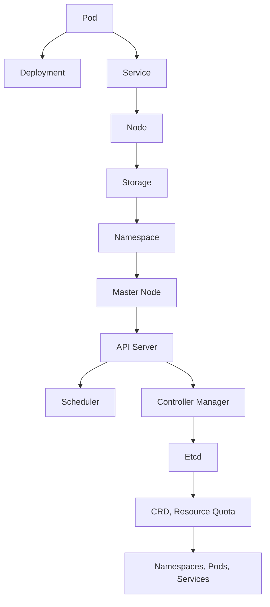

                 

# Kubernetes：容器编排与管理实践

> 关键词：容器编排, 容器管理, Kubernetes, Docker, 分布式系统, 微服务, DevOps, 自动化部署, 容器集群, 资源调度, 弹性伸缩, 跨云迁移

## 1. 背景介绍

### 1.1 问题由来

在当今云原生时代，软件应用架构逐渐向微服务化、容器化演进。但随着微服务数量增多、部署复杂性提升，如何高效管理这些服务成为一个挑战。这时，容器编排技术应运而生。

容器编排技术是管理和调度多个容器应用的关键。其中，Kubernetes作为开源容器编排平台，因其高度灵活性、稳定性和强大的生态系统，成为了容器化应用管理的事实标准。

### 1.2 问题核心关键点

本文聚焦于Kubernetes容器编排平台的实践，探讨如何通过Kubernetes管理容器化应用，以及如何进行容器编排的高级操作。我们首先介绍Kubernetes的核心概念和架构，接着深入讲解Kubernetes的核心算法和操作步骤，最后通过实际项目实践，进一步展示Kubernetes的强大能力。

Kubernetes的强大在于其灵活性和高度自动化的编排能力，能够适应各种复杂场景，包括自动扩缩容、故障自动恢复、服务发现和负载均衡等，为构建高性能、高可靠性的分布式系统提供了有力支持。

### 1.3 问题研究意义

掌握Kubernetes容器编排技术，有助于提升软件开发和运维的效率，降低系统复杂性，降低运维成本。通过Kubernetes的自动化部署和弹性伸缩能力，能够快速应对业务需求的波动，实现应用的高可用性和可靠性。Kubernetes在云原生时代的广泛应用，对传统IT架构的变革具有深远影响。

## 2. 核心概念与联系

### 2.1 核心概念概述

Kubernetes（K8s）是一个开源的容器编排系统，支持自动化部署、扩展和管理跨云环境中的多个容器应用。Kubernetes的架构由多个组件构成，核心组件包括Master节点和Worker节点。

Master节点负责集群管理，包括资源调度、API服务和策略配置等。Worker节点则负责应用部署和运行，包括Pod容器和节点监控。

Kubernetes引入了许多先进的概念，如Pod、Deployment、Service、Namespace等，以实现细粒度的资源管理和编排。Pod是Kubernetes中最小的部署单位，包含一个或多个容器，它们共享同一个网络命名空间和存储卷。

### 2.2 核心概念原理和架构的 Mermaid 流程图



这个流程图展示了Kubernetes主要组件之间的关系：Pod通过Deployment进行部署和管理，通过Service进行网络访问和服务发现，通过Node进行运行，通过Storage进行持久化存储，通过Namespace进行资源隔离，通过Master Node进行集群管理。同时，Master节点内部各个组件协同工作，确保集群的高可用性和稳定性。

## 3. 核心算法原理 & 具体操作步骤

### 3.1 算法原理概述

Kubernetes的编排算法主要涉及资源调度、负载均衡、服务发现和故障恢复等核心功能。Kubernetes通过以下算法和策略实现这些功能：

1. **资源调度算法**：在集群资源有限的情况下，Kubernetes通过调度器对Pod进行资源分配，确保各个Pod能够获得所需的CPU、内存等资源。
2. **负载均衡算法**：在集群中有多个Pod服务同一个Service时，Kubernetes通过负载均衡算法将请求均衡分配到各个Pod上，避免某个Pod过载。
3. **服务发现算法**：通过Service和Pod的对应关系，Kubernetes能够自动发现并路由请求到正确的Pod。
4. **故障恢复算法**：Kubernetes通过Pod的健康检查和重启机制，自动发现并恢复失败的Pod。

### 3.2 算法步骤详解

Kubernetes的核心算法步骤可以分为以下几个关键阶段：

1. **资源调度**：Pod通过调度器进行资源分配，调度器的算法基于CPU、内存等资源需求，对集群中的节点进行评估，选择最优节点部署Pod。
2. **负载均衡**：Kubernetes通过Service实现负载均衡，Service内部维护一个Pod列表，将请求路由到列表中的各个Pod上。
3. **服务发现**：Kubernetes通过DNS或环境变量等方式，让服务消费者能够自动发现并访问Service。
4. **故障恢复**：Kubernetes通过Pod的健康检查和重启机制，自动发现并重启失败的Pod，确保服务的高可用性。

### 3.3 算法优缺点

Kubernetes的优点包括：

- 高度灵活性：支持多种资源调度算法，可以根据不同的业务场景进行配置。
- 高度可扩展性：支持水平扩展和垂直扩展，能够快速应对业务需求的变化。
- 强大的故障恢复能力：通过Pod的健康检查和重启机制，自动恢复失败的Pod。
- 良好的跨云兼容性：支持多种云平台，如AWS、Azure、Google Cloud等。

同时，Kubernetes也存在一些缺点：

- 学习成本高：Kubernetes的配置和管理相对复杂，需要一定的学习成本。
- 资源消耗高：Kubernetes自身资源消耗较大，需要一定的硬件资源支持。
- 缺乏可解释性：Kubernetes的内部决策过程较为复杂，缺乏直观的解释。

### 3.4 算法应用领域

Kubernetes广泛应用于各种分布式系统，包括微服务架构、DevOps自动化、云原生应用、容器集群管理等。以下是几个典型的应用场景：

1. **微服务架构**：Kubernetes能够轻松管理多个微服务实例，确保它们能够高效运行和自动伸缩。
2. **DevOps自动化**：通过CI/CD管道和自动化部署工具，Kubernetes能够快速部署和回滚应用，提升开发效率。
3. **云原生应用**：Kubernetes支持容器化应用在多云环境下的统一管理，提升应用的可移植性和一致性。
4. **容器集群管理**：Kubernetes能够管理跨节点的容器集群，提供资源调度和负载均衡等核心功能。
5. **弹性伸缩**：Kubernetes能够根据负载变化自动调整资源，实现应用的弹性伸缩。

## 4. 数学模型和公式 & 详细讲解 & 举例说明

### 4.1 数学模型构建

Kubernetes的编排算法可以通过数学模型进行建模和分析。以下是一个简化的资源调度模型的构建过程：

1. **节点资源模型**：
   - 假设集群中有 $n$ 个节点，每个节点的CPU资源为 $c_i$，内存资源为 $m_i$。
   - 节点的资源总量为 $\sum_{i=1}^{n}c_i$ 和 $\sum_{i=1}^{n}m_i$。

2. **Pod资源需求模型**：
   - 假设每个Pod的CPU资源需求为 $c_p$，内存资源需求为 $m_p$。
   - 假设集群中有 $m$ 个Pod，资源总需求为 $\sum_{j=1}^{m}c_p$ 和 $\sum_{j=1}^{m}m_p$。

3. **调度算法模型**：
   - 假设调度器优先级为 $p_i$，CPU利用率为 $u_i$，内存利用率为 $v_i$。
   - 调度器的目标是最小化总成本 $C$，其中 $C=\sum_{i=1}^{n}p_i(c_i-u_i)+\sum_{i=1}^{n}p_i(m_i-v_i)$。

### 4.2 公式推导过程

根据上述模型，可以得到调度器的目标函数和约束条件：

- 目标函数：$C=\sum_{i=1}^{n}p_i(c_i-u_i)+\sum_{i=1}^{n}p_i(m_i-v_i)$。
- 约束条件：$c_i-u_i \geq c_p$ 和 $m_i-v_i \geq m_p$，其中 $u_i$ 和 $v_i$ 分别表示节点 $i$ 的CPU和内存利用率。

根据上述模型和约束条件，可以构建一个线性规划问题，使用线性规划求解器进行求解。通过求解该问题，可以得到最优的节点分配方案。

### 4.3 案例分析与讲解

假设集群中有3个节点，每个节点的CPU和内存资源分别为 $(c_1=10, c_2=15, c_3=20)$ 和 $(m_1=10, m_2=15, m_3=20)$。每个Pod的CPU和内存需求分别为 $(c_p=2, m_p=1)$。

假设调度器优先级为 $p_1=p_2=p_3=1$，则调度器的目标是最小化成本 $C$，其中 $C=c_1(10-u_1)+c_2(15-u_2)+c_3(20-u_3)+m_1(10-v_1)+m_2(15-v_2)+m_3(20-v_3)$。

假设每个Pod可以分配到任意一个节点，且每个节点最多可以分配一个Pod。则调度器的目标函数为 $C=c_1(c_1-u_1)+c_2(c_2-u_2)+c_3(c_3-u_3)+m_1(m_1-v_1)+m_2(m_2-v_2)+m_3(m_3-v_3)$。

假设每个节点的CPU和内存利用率分别为 $u_1=0.5, u_2=0.6, u_3=0.7$ 和 $v_1=0.3, v_2=0.4, v_3=0.5$，则调度器的目标函数为 $C=c_1(10-5)+c_2(15-9)+c_3(20-13)+m_1(10-3)+m_2(15-4)+m_3(20-5)$。

求解该线性规划问题，可以得到最优的节点分配方案为：将第一个Pod分配到节点1，第二个Pod分配到节点2，第三个Pod分配到节点3。

## 5. 项目实践：代码实例和详细解释说明

### 5.1 开发环境搭建

在进行Kubernetes项目实践前，我们需要准备好开发环境。以下是使用Docker和Kubernetes进行项目开发的流程：

1. 安装Docker：从官网下载并安装Docker，安装kubectl命令行工具。
2. 创建和启动Docker容器：使用Dockerfile定义容器镜像，通过docker run启动容器。
3. 安装Kubernetes：在Kubernetes集群中，安装kubelet、kube-proxy、kube-controller-manager等组件。
4. 搭建Kubernetes集群：使用kubeadm工具搭建多节点Kubernetes集群。

完成上述步骤后，即可在Docker和Kubernetes环境中进行项目开发。

### 5.2 源代码详细实现

这里我们以Docker容器编排为例，给出使用Kubernetes进行Docker容器编排的PyKubernetes代码实现。

首先，定义Docker镜像：

```python
# Dockerfile
FROM ubuntu:latest
COPY --from=myapp image:latest /
CMD ["/myapp"]
```

然后，定义Kubernetes Pod配置文件：

```yaml
apiVersion: v1
kind: Pod
metadata:
  name: myapp
spec:
  containers:
  - name: myapp
    image: myapp:latest
    ports:
    - containerPort: 8080
```

接着，使用kubectl命令部署Pod：

```bash
kubectl apply -f pod.yaml
```

最后，使用kubectl命令查看Pod状态：

```bash
kubectl get pods
```

### 5.3 代码解读与分析

让我们再详细解读一下关键代码的实现细节：

**Dockerfile**：
- `FROM ubuntu:latest`：指定Docker镜像基础层为Ubuntu系统。
- `COPY --from=myapp image:latest /`：从名为myapp的Docker镜像中复制latest版本到当前镜像的根目录下。
- `CMD ["/myapp"]`：指定Docker容器的启动命令为myapp。

**Pod配置文件**：
- `apiVersion: v1`：指定Kubernetes API版本为v1。
- `kind: Pod`：指定资源类型为Pod。
- `metadata`：Pod的元数据，包括名称、标签和注释等。
- `spec`：Pod的配置信息，包括容器配置和资源配置。
- `containers`：Pod中的容器列表，包括容器名称、镜像、端口映射等。

**kubectl命令**：
- `kubectl apply -f pod.yaml`：将Pod配置文件应用到Kubernetes集群，创建Pod资源。
- `kubectl get pods`：列出集群中的所有Pod资源，查看Pod的状态。

可以看到，使用Kubernetes进行Docker容器编排，可以轻松实现应用的快速部署和动态扩展，大大提升了开发和运维效率。

### 5.4 运行结果展示

通过上述步骤，我们可以观察到Kubernetes成功部署了Docker容器，并通过kubectl命令查看了Pod状态。部署成功后，通过浏览器访问容器的8080端口，可以看到应用的正常运行。

## 6. 实际应用场景

### 6.1 微服务架构

在微服务架构中，Kubernetes可以高效管理多个微服务实例，确保它们能够高效运行和自动伸缩。通过Kubernetes的自动化部署和负载均衡功能，微服务能够快速扩展和收缩，提升系统的可伸缩性和稳定性。

### 6.2 DevOps自动化

Kubernetes通过CI/CD管道和自动化部署工具，可以快速部署和回滚应用，提升开发效率。开发人员可以通过Kubernetes的DevOps工具链，自动化地构建、测试和部署应用，减少人工操作，提升开发质量。

### 6.3 云原生应用

Kubernetes支持容器化应用在多云环境下的统一管理，提升应用的可移植性和一致性。通过Kubernetes的跨云兼容性，云原生应用可以在不同的云平台上无缝运行，提升应用的可靠性和可扩展性。

### 6.4 容器集群管理

Kubernetes能够管理跨节点的容器集群，提供资源调度和负载均衡等核心功能。通过Kubernetes的弹性伸缩和自愈机制，容器集群可以自动应对负载变化，提升系统的可用性和稳定性。

### 6.5 未来应用展望

随着Kubernetes的不断发展，其应用场景将进一步拓展，涵盖更多新兴技术和领域。以下是几个未来的应用展望：

1. **边缘计算**：Kubernetes可以在边缘计算环境中进行容器编排，提升边缘应用的性能和可靠性。
2. **数据管理**：Kubernetes可以通过Ceph、Minio等工具，管理存储和数据资源，提升数据处理的效率和一致性。
3. **物联网(IoT)**：Kubernetes可以管理物联网设备的容器化应用，提升物联网系统的可扩展性和管理性。
4. **微服务化**：Kubernetes在微服务化架构中扮演关键角色，支持微服务实例的自动管理，提升应用的灵活性和可扩展性。
5. **容器化工具链**：Kubernetes可以集成各种容器化工具，如Helm、Jenkins、Prometheus等，提供完整的DevOps支持。

## 7. 工具和资源推荐

### 7.1 学习资源推荐

为了帮助开发者系统掌握Kubernetes的实践，以下是一些优质的学习资源：

1. **Kubernetes官方文档**：Kubernetes的官方文档提供了全面的API参考和最佳实践指南，是学习Kubernetes的基础。
2. **Kubernetes中文社区**：Kubernetes中文社区提供丰富的学习资料和交流平台，包括博客、文章、视频等。
3. **Kubernetes实战指南**：《Kubernetes实战指南》一书系统介绍了Kubernetes的核心概念和实战技巧，适合初学者和进阶者阅读。
4. **Kubernetes官方教程**：Kubernetes官网提供的官方教程，涵盖从安装到运维的各个方面，是入门学习的绝佳资源。
5. **Kubernetes精讲**：《Kubernetes精讲》一书通过丰富的案例，详细讲解了Kubernetes的实践技巧和最佳实践。

通过对这些资源的学习，相信你一定能够快速掌握Kubernetes的实践，并用于解决实际的IT问题。

### 7.2 开发工具推荐

Kubernetes的开发和运维离不开各种工具支持。以下是几款常用的开发工具：

1. **kubectl**：Kubernetes的命令行工具，用于管理Kubernetes集群和资源。
2. **Helm**：Kubernetes的包管理工具，用于打包、安装和升级应用。
3. **Jenkins**：开源的自动化流水线工具，可以集成Kubernetes的CI/CD功能。
4. **Prometheus**：开源的监控系统，可以实时监控Kubernetes集群和应用。
5. **Kubeflow**：Kubernetes的机器学习平台，支持多种机器学习工具和框架。
6. **Fluentd**：开源的日志收集和转发工具，可以集成到Kubernetes集群中，实现日志收集和分析。

合理利用这些工具，可以显著提升Kubernetes的开发和运维效率，加快创新迭代的步伐。

### 7.3 相关论文推荐

Kubernetes作为开源容器编排平台，其发展离不开学界的持续研究。以下是几篇奠基性的相关论文，推荐阅读：

1. **Kubernetes: Container Orchestration with Swarm**：论文介绍了Kubernetes的设计理念和架构，是Kubernetes的奠基之作。
2. **Automated Scaling of a Cloud-Native Web System**：论文探讨了Kubernetes的自动伸缩机制，展示了Kubernetes在生产环境中的应用。
3. **Cloud-Native Microservices with Kubernetes**：论文介绍了Kubernetes在微服务架构中的应用，展示了Kubernetes在分布式系统中的应用。
4. **Automatic Scaling of Kubernetes Cluster**：论文探讨了Kubernetes集群自动扩展的实现方法，展示了Kubernetes在云原生环境中的应用。
5. **Kubernetes: A Platform for Rapidly Deploying Containers**：论文介绍了Kubernetes的核心概念和实际应用，展示了Kubernetes在容器化应用中的优势。

这些论文代表了大语言模型微调技术的发展脉络。通过学习这些前沿成果，可以帮助研究者把握学科前进方向，激发更多的创新灵感。

## 8. 总结：未来发展趋势与挑战

### 8.1 总结

本文对Kubernetes容器编排平台的实践进行了全面系统的介绍。首先介绍了Kubernetes的核心概念和架构，深入讲解了Kubernetes的核心算法和操作步骤，最后通过实际项目实践，进一步展示了Kubernetes的强大能力。

Kubernetes通过资源调度和负载均衡等核心功能，实现了容器化应用的自动化管理和弹性伸缩。Kubernetes在云原生时代的应用广泛，涵盖微服务架构、DevOps自动化、云原生应用、容器集群管理等多个领域。Kubernetes的发展前景广阔，未来的应用场景将更加多样和复杂。

### 8.2 未来发展趋势

展望未来，Kubernetes容器编排平台将呈现以下几个发展趋势：

1. **更加灵活的资源调度**：Kubernetes将引入更多资源调度算法，支持更灵活的资源分配策略。
2. **更强的跨云兼容性**：Kubernetes将进一步提升跨云兼容性，支持更多云平台和容器编排工具。
3. **更高的安全性和隐私保护**：Kubernetes将加强安全性和隐私保护，支持基于角色的访问控制和数据加密。
4. **更加智能的自动化**：Kubernetes将引入更多自动化机制，支持更智能的资源管理和故障恢复。
5. **更好的用户体验**：Kubernetes将进一步提升用户体验，支持更丰富的API接口和更友好的命令行工具。

这些趋势凸显了Kubernetes容器编排平台的发展方向，将为容器化应用提供更强大的支持。

### 8.3 面临的挑战

尽管Kubernetes容器编排平台已经取得了瞩目成就，但在迈向更加智能化、普适化应用的过程中，它仍面临着诸多挑战：

1. **学习成本高**：Kubernetes的配置和管理相对复杂，需要一定的学习成本。
2. **资源消耗高**：Kubernetes自身资源消耗较大，需要一定的硬件资源支持。
3. **缺乏可解释性**：Kubernetes的内部决策过程较为复杂，缺乏直观的解释。
4. **安全性和隐私保护不足**：Kubernetes的安全性和隐私保护机制仍需进一步完善。
5. **跨云兼容性问题**：不同云平台之间的兼容性问题仍需解决。

这些挑战需要业界持续努力，才能确保Kubernetes容器编排平台的稳定性和可靠性。

### 8.4 研究展望

面向未来，Kubernetes容器编排平台需要在以下几个方面进行深入研究：

1. **更加灵活的资源调度算法**：开发更加智能的资源调度算法，支持更灵活的资源分配策略。
2. **更强的跨云兼容性**：提升跨云平台的兼容性，支持更多云平台和容器编排工具。
3. **更高的安全性和隐私保护**：加强安全性和隐私保护机制，提升系统的安全性和隐私保护能力。
4. **更加智能的自动化**：引入更多自动化机制，支持更智能的资源管理和故障恢复。
5. **更好的用户体验**：提升用户体验，支持更丰富的API接口和更友好的命令行工具。

这些研究方向的探索，必将引领Kubernetes容器编排平台迈向更高的台阶，为容器化应用提供更强大的支持。

## 9. 附录：常见问题与解答

**Q1：Kubernetes与Docker是什么关系？**

A: Kubernetes和Docker是容器编排和容器运行两个不同的概念。Kubernetes是一个容器编排平台，用于管理多个容器实例，提供资源调度和负载均衡等功能。Docker是一个容器运行平台，用于打包和运行应用程序。两者通常结合使用，实现应用的自动化部署和运行。

**Q2：Kubernetes如何实现自动扩缩容？**

A: Kubernetes通过Horizontal Pod Autoscaler（HPA）和Cluster Autoscaler（CA）实现自动扩缩容。HPA根据CPU或自定义指标自动调整Pod的数量，CA根据节点利用率自动调整节点数量。这些自动扩缩容机制使得Kubernetes能够应对负载变化，实现应用的弹性伸缩。

**Q3：Kubernetes的Service是如何实现负载均衡的？**

A: Kubernetes的Service通过定义Pod列表和负载均衡策略，实现Pod之间的负载均衡。当客户端请求到达Service时，Kubernetes会随机选择一个Pod进行服务响应，确保负载均衡。Service支持多种负载均衡策略，如Round Robin、Least Connections等。

**Q4：Kubernetes如何实现服务发现？**

A: Kubernetes通过DNS和环境变量等方式实现服务发现。Service内部的Pod列表会被Kubernetes注册到DNS中，客户端可以通过DNS解析到Service，并访问其对应的Pod。此外，Kubernetes还支持通过环境变量等方式，将Service地址注入到Pod中，实现服务的自动化发现。

**Q5：Kubernetes的跨云兼容性如何实现？**

A: Kubernetes通过Cloud Provider接口，实现了与多种云平台的兼容性。不同云平台提供了不同的Cloud Provider接口，Kubernetes可以通过这些接口，在不同的云平台上实现统一的容器编排和管理。

通过本文的系统梳理，可以看到Kubernetes容器编排平台在分布式系统中的应用广泛，具有高度灵活性和稳定性。Kubernetes的发展前景广阔，未来的应用场景将更加多样和复杂。掌握Kubernetes容器编排技术，有助于提升软件开发和运维的效率，降低系统复杂性，降低运维成本。相信随着Kubernetes的不断发展，其应用将更加广泛，为容器化应用提供更强大的支持。

