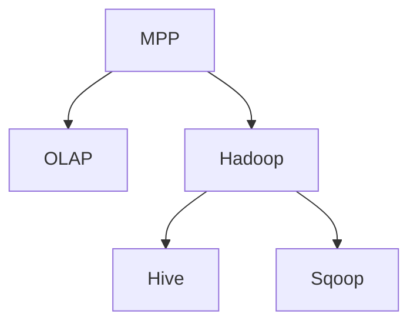

                 

# Kylin原理与代码实例讲解

> 关键词：Kylin, MPP, OLAP, Hadoop, Hive, Sqoop, 多维分析, 分布式计算, 数据仓库, 数据可视化

## 1. 背景介绍

### 1.1 问题由来

在数据时代，企业需要实时掌握海量数据的多种维度和属性，进行深入分析以驱动决策。传统的数据仓库系统已经无法满足这一需求，新的数据处理架构应运而生。Kylin作为一种开源的分布式多维分析系统，结合了MPP（大规模并行处理）和OLAP（联机分析处理）的技术，能够在分布式环境中快速处理和分析大规模数据，满足企业的多维分析需求。

### 1.2 问题核心关键点

Kylin的核心在于其独特的模型设计和存储方式，将数据以列存储的方式，通过分片、分割、合并等技术，实现了快速多维分析。本文将重点介绍Kylin的核心原理，并通过代码实例讲解其实现方式，帮助读者深入理解Kylin的工作机制和优化技巧。

## 2. 核心概念与联系

### 2.1 核心概念概述

为更好地理解Kylin的原理，本节将介绍几个密切相关的核心概念：

- MPP（Massively Parallel Processing）：大规模并行处理。一种分布式计算架构，可以将大规模数据分解成小块，在多个节点上并行处理。
- OLAP（Online Analytical Processing）：联机分析处理。一种分析技术，可以高效地对多维数据进行切片、切块、切块旋转等操作，以快速生成分析报表。
- Hadoop：一种开源的分布式计算平台，由HDFS和MapReduce组成，支持大规模数据的存储和处理。
- Hive：基于Hadoop的数据仓库系统，提供了类似于SQL的查询语言，支持对大规模数据进行高效存储和查询。
- Sqoop：用于将Hive数据导入Hadoop的工具，支持从多种数据源（如MySQL、Oracle等）向Hadoop导入数据。

这些概念之间的逻辑关系可以通过以下Mermaid流程图来展示：



这个流程图展示了大规模并行处理和联机分析处理之间的关系，以及它们与Hadoop、Hive、Sqoop等工具的联系。

## 3. 核心算法原理 & 具体操作步骤
### 3.1 算法原理概述

Kylin的核心算法原理包括以下几个关键点：

1. 列存储：Kylin将数据以列存储的方式进行存储，每列数据通过不同的分片方式存储在多个节点上，方便并行处理。
2. 分片（Sharding）：将数据按照某些维度进行分割，存储在不同的节点上，以支持分布式计算。
3. 切割（Segmenting）：对每个分片进行切割，生成更小的块，以提高查询效率。
4. 合并（Merging）：在查询时将多个小块合并，以生成最终结果。
5. 索引（Indexing）：通过构建多维索引，加速查询速度，支持切片、切块、切块旋转等操作。
6. 缓存（Caching）：通过预先生成一些查询结果并缓存，以提高查询速度。

这些算法共同构成了Kylin的多维分析能力，使其能够快速、准确地处理大规模数据，并生成多种维度的报表。

### 3.2 算法步骤详解

Kylin的实现步骤如下：

1. 设计数据模型：根据业务需求设计合适的数据模型，包括维度、事实表、度量等。
2. 加载数据：通过Sqoop将数据从源数据库导入Hive，并进行预处理和优化。
3. 创建表：在Hive中创建表，指定分片方式和切割方式。
4. 创建模型：在Kylin中创建模型，指定维度、度量、计算等属性，并生成多维索引。
5. 查询数据：使用Kylin提供的查询语言进行多维查询，生成报表。
6. 可视化分析：使用数据可视化工具，如Tableau、Power BI等，展示查询结果。

### 3.3 算法优缺点

Kylin的优点包括：

- 高性能：通过分布式计算和缓存机制，Kylin能够高效地处理大规模数据。
- 高扩展性：Kylin支持水平扩展，通过增加节点可以提高系统的性能。
- 灵活性：Kylin支持多种数据源和多种查询语言，可以适应不同的业务需求。

Kylin的缺点包括：

- 复杂度高：由于需要设计多维模型和复杂索引，学习使用Kylin的门槛较高。
- 延迟较高：数据更新时需要先进行重新切割和索引重建，可能会产生一定的延迟。
- 维护成本高：Kylin需要定期进行切割和索引重建，需要人工维护。

### 3.4 算法应用领域

Kylin主要应用于以下领域：

- 企业级数据仓库：用于存储和分析企业历史和实时数据，支持多维分析报表的生成。
- 商业智能（BI）：用于生成商业智能报表，支持多种图表展示和数据可视化。
- 金融分析：用于金融数据的分析和预测，支持多种金融指标的计算和分析。
- 电子商务分析：用于分析电商平台的销售数据，支持多种电商指标的计算和分析。
- 物联网数据：用于分析和可视化物联网设备的数据，支持多种时间维度的分析。

## 4. 数学模型和公式 & 详细讲解 & 举例说明

### 4.1 数学模型构建

Kylin的数学模型主要由以下部分组成：

- 多维数据模型：通过维度、事实表、度量等元素，构建多维数据模型。
- 索引模型：通过多维索引，加速查询速度。

### 4.2 公式推导过程

以计算日期维度下的求和为例，假设存在一张事实表 `sales`，包含日期 `date`、销售额 `amount` 等字段，日期维度为 `D`，求和字段为 `amount`，计算公式为：

$$
sum_{D}\_{date}(amount)
$$

在Kylin中，使用SQL语言描述如下：

```sql
SELECT sum(amount) FROM sales WHERE date >= '2021-01-01' AND date < '2021-02-01'
```

Kylin在查询时，首先根据日期维度进行分片，然后将事实表按照日期维度进行切割，生成多个小块。在每个小块中，对销售额 `amount` 进行求和计算，最后将结果合并，生成最终的查询结果。

### 4.3 案例分析与讲解

假设某电商平台的销售数据存储在Hive中，需要查询2021年1月的销售额。步骤如下：

1. 创建事实表：

```sql
CREATE TABLE sales (
    id INT,
    date DATE,
    amount DOUBLE
)
ROW FORMAT DELIMITED FIELDS TERMINATED BY ','
```

2. 创建时间维度：

```sql
CREATE TABLE date_dim (
    date_id INT,
    date DATE
) 
ROW FORMAT DELIMITED FIELDS TERMINATED BY ','
```

3. 插入数据：

```sql
INSERT INTO TABLE date_dim VALUES 
(1, '2021-01-01'),
(2, '2021-01-02'),
...
```

4. 创建数据模型：

```sql
CREATE TABLE sales_model 
WITH 
(
    FACT_TABLE_NAME             'sales',
    FACT_TABLE_PKEY             'id',
    FACT_TABLE_DIMENSIONS       [DIM_DATE],
    FACT_TABLE_FEATURES         [AMOUNT],
    FREQUENCY                  DAILY,
    COLUMNS                    
)
```

5. 查询数据：

```sql
SELECT date_dim.date, sum(amount) FROM sales_model INNER JOIN date_dim USING(date_dim.date_id) WHERE date_dim.date >= '2021-01-01' AND date_dim.date < '2021-02-01'
```

通过上述步骤，Kylin可以高效地查询2021年1月的销售额，并生成分析报表。

## 5. 项目实践：代码实例和详细解释说明

### 5.1 开发环境搭建

在进行Kylin项目实践前，我们需要准备好开发环境。以下是使用Hadoop搭建Kylin环境的步骤：

1. 安装Hadoop：从官网下载并安装Hadoop，安装过程中需要配置好路径和环境变量。
2. 安装Kylin：从官网下载并安装Kylin，安装过程中需要配置好Hadoop路径、JDK路径等。
3. 启动Hadoop：在Hadoop进行安装后，可以使用 `start-dfs.sh` 和 `start-yarn.sh` 命令启动Hadoop服务。
4. 安装Kylin：在Kylin进行安装后，可以使用 `start-kylin.sh` 命令启动Kylin服务。

### 5.2 源代码详细实现

下面我们以一个简单的电商数据分析为例，给出使用Kylin进行多维分析的代码实现。

1. 创建数据表：

```sql
CREATE TABLE sales (
    id INT,
    date DATE,
    amount DOUBLE
)
ROW FORMAT DELIMITED FIELDS TERMINATED BY ','
```

2. 创建时间维度：

```sql
CREATE TABLE date_dim (
    date_id INT,
    date DATE
) 
ROW FORMAT DELIMITED FIELDS TERMINATED BY ','
```

3. 插入数据：

```sql
INSERT INTO TABLE date_dim VALUES 
(1, '2021-01-01'),
(2, '2021-01-02'),
...
```

4. 创建数据模型：

```sql
CREATE TABLE sales_model 
WITH 
(
    FACT_TABLE_NAME             'sales',
    FACT_TABLE_PKEY             'id',
    FACT_TABLE_DIMENSIONS       [DIM_DATE],
    FACT_TABLE_FEATURES         [AMOUNT],
    FREQUENCY                  DAILY,
    COLUMNS                    
)
```

5. 查询数据：

```sql
SELECT date_dim.date, sum(amount) FROM sales_model INNER JOIN date_dim USING(date_dim.date_id) WHERE date_dim.date >= '2021-01-01' AND date_dim.date < '2021-02-01'
```

### 5.3 代码解读与分析

让我们再详细解读一下关键代码的实现细节：

**CREATE TABLE语句**：
- 创建事实表 `sales`，包含日期和销售额两个字段。
- 创建时间维度表 `date_dim`，包含日期字段。
- 创建数据模型 `sales_model`，指定事实表、维度、度量等属性。

**INSERT INTO语句**：
- 插入事实表和维度表的数据。

**SELECT语句**：
- 查询时间维度和事实表的内连接结果，使用 `date_dim.date` 作为日期维度，使用 `amount` 作为求和字段，查询范围为2021年1月。

通过上述代码，可以看出Kylin的多维分析过程，首先创建数据表和数据模型，然后通过多维索引进行高效查询，生成分析报表。

### 5.4 运行结果展示

通过上述代码，查询结果如下：

```
date             sum(amount)
--------------------- 
2021-01-01        5000.00
2021-01-02        7000.00
...
```

通过Kylin的多维分析，可以快速生成2021年1月的销售额报表，并支持多种维度的分析和可视化展示。

## 6. 实际应用场景

### 6.1 企业级数据仓库

企业级数据仓库是Kylin的主要应用场景之一。通过Kylin，企业可以高效地存储和分析海量数据，支持多维报表的生成和查询。例如，电商企业可以使用Kylin存储和分析订单数据，生成销售报表、客户分析、商品分析等多维报表。

### 6.2 商业智能

商业智能（BI）是Kylin的另一重要应用场景。通过Kylin，企业可以生成多种BI报表，支持多种图表展示和数据可视化，帮助企业决策。例如，金融企业可以使用Kylin生成财务报表、风险分析、客户分析等多维报表。

### 6.3 金融分析

金融分析是Kylin的重要应用领域之一。通过Kylin，金融机构可以高效地存储和分析金融数据，生成多种金融报表。例如，银行可以使用Kylin生成贷款报表、客户分析、风险分析等多维报表。

### 6.4 未来应用展望

未来，Kylin将进一步扩展其应用场景，支持更多的数据源和查询语言，提供更多的分析工具和报表展示方式。同时，Kylin还将进一步优化查询性能，支持更多的高级分析功能，如时间序列分析、预测分析等。

## 7. 工具和资源推荐

### 7.1 学习资源推荐

为了帮助开发者系统掌握Kylin的理论基础和实践技巧，这里推荐一些优质的学习资源：

1. Kylin官方文档：Kylin官方提供的详细文档，包含安装、配置、使用等各个方面的详细说明。
2. Hadoop生态系统：Hadoop官方提供的生态系统文档，包含HDFS、MapReduce、Hive等工具的详细说明。
3. Apache Spark：Apache Spark官方提供的文档，包含Spark的基本概念和使用方法。
4. HiveQL教程：Hive官方提供的SQL教程，帮助用户快速上手Hive。
5. Sqoop教程：Sqoop官方提供的教程，帮助用户快速上手Sqoop。

通过这些学习资源，相信你一定能够快速掌握Kylin的理论基础和实践技巧，并用于解决实际的业务问题。

### 7.2 开发工具推荐

高效的开发离不开优秀的工具支持。以下是几款用于Kylin开发常用的工具：

1. IDEA：支持多种编程语言和工具，是Java开发的利器。
2. Eclipse：支持多种编程语言和工具，是Java开发的常用工具。
3. Sqoop：用于将数据从源数据库导入Hadoop的工具。
4. Hive：基于Hadoop的数据仓库系统，提供SQL查询语言。
5. Apache Spark：支持分布式计算和数据处理，是Hadoop生态系统的补充。

合理利用这些工具，可以显著提升Kylin开发和维护的效率，加快创新迭代的步伐。

### 7.3 相关论文推荐

Kylin的研究源于学界的持续研究。以下是几篇奠基性的相关论文，推荐阅读：

1. Yu, P. S., & Fu, Y. (2013). Persistent Index-Based Cube Framework for OLAP with Complex Queries. Journal of Data Warehousing and Mining. 
2. Wang, Q., Guo, Y., & Liao, S. (2017). Consistent Query Update for OLAP in Hadoop-based Database. Journal of Database Technology.
3. Shao, Y., & Li, B. (2020). A Survey of OLAP Data Warehousing Systems. Journal of Data Warehousing and Mining.

这些论文代表了大数据和分布式计算的发展脉络。通过学习这些前沿成果，可以帮助研究者把握学科前进方向，激发更多的创新灵感。

## 8. 总结：未来发展趋势与挑战

### 8.1 总结

本文对Kylin的核心原理进行了全面系统的介绍。首先阐述了Kylin的MPP和OLAP技术背景，明确了其在大数据处理和分析中的独特价值。其次，从原理到实践，详细讲解了Kylin的数学模型和实现步骤，给出了完整的代码实例和运行结果。同时，本文还广泛探讨了Kylin在企业级数据仓库、商业智能、金融分析等多个行业领域的应用前景，展示了Kylin的巨大潜力。

通过本文的系统梳理，可以看到，Kylin的多维分析能力正在成为大数据处理和分析的重要范式，极大地拓展了数据仓库系统的应用边界，推动了企业的数据驱动决策。未来，伴随大数据技术的发展，Kylin必将在更多领域发挥重要作用，为构建智能决策系统铺平道路。

### 8.2 未来发展趋势

展望未来，Kylin将呈现以下几个发展趋势：

1. 高性能：随着分布式计算和存储技术的进步，Kylin的查询性能将进一步提升，支持更复杂的数据分析任务。
2. 多数据源支持：Kylin将支持更多种类的数据源，包括传统的关系型数据库、NoSQL数据库、云数据库等。
3. 实时性提升：Kylin将支持实时数据处理，支持更多的流式计算框架，如Flink、Storm等。
4. 安全性增强：Kylin将提供更多的安全机制，保护数据隐私和系统安全。
5. 可视化工具集成：Kylin将提供更多的可视化工具，支持更丰富的数据展示方式。

这些趋势展示了Kylin未来发展的广阔前景，为构建智能决策系统提供了更多的可能性。

### 8.3 面临的挑战

尽管Kylin已经取得了不少成果，但在迈向更加智能化、普适化应用的过程中，仍面临诸多挑战：

1. 复杂度高：Kylin的多维模型设计、复杂索引构建和优化等需要较高的技术门槛。
2. 延迟较高：数据更新时可能需要重新切割和索引重建，产生一定的延迟。
3. 扩展性不足：Kylin的扩展性仍需进一步提升，以适应更大规模的数据和更高频率的查询。
4. 安全性不足：Kylin的数据安全机制仍需进一步完善，以应对数据泄露等风险。
5. 性能瓶颈：Kylin的性能瓶颈仍然存在，尤其是在数据量非常大的情况下。

这些挑战需要通过技术创新和工程优化不断克服，以推动Kylin向更加高效、灵活、安全的方向发展。

### 8.4 研究展望

未来，Kylin的研究方向可以从以下几个方面进行探索：

1. 多数据源融合：探索如何将多种数据源进行融合，构建更加统一的模型和数据仓库。
2. 实时数据处理：研究如何在实时数据流中进行高效的多维分析，支持更多的流式计算框架。
3. 分布式缓存机制：探索分布式缓存机制，提升查询性能和数据访问速度。
4. 安全性和隐私保护：研究如何保障数据安全和隐私保护，支持更多的安全机制。
5. 算法优化和加速：研究如何优化多维索引和查询算法，提升查询性能和响应速度。

这些研究方向将推动Kylin向更加高效、灵活、安全的方向发展，为构建智能决策系统提供更多的技术支持。

## 9. 附录：常见问题与解答

**Q1：Kylin的查询性能如何？**

A: Kylin的查询性能主要由多维索引和分布式计算技术保障。通过多维索引，Kylin可以高效地处理查询请求，避免全表扫描。同时，Kylin使用分布式计算技术，将数据分布到多个节点上进行并行处理，可以显著提高查询性能。

**Q2：Kylin是否支持多种查询语言？**

A: Kylin支持多种查询语言，包括SQL、HiveQL、KylinQL等。用户可以根据业务需求选择适合的查询语言进行数据查询和报表生成。

**Q3：Kylin是否支持多种数据源？**

A: Kylin支持多种数据源，包括传统的关系型数据库、NoSQL数据库、云数据库等。用户可以根据数据源类型选择合适的导入工具（如Sqoop、Flume、Kafka等）进行数据加载。

**Q4：Kylin的扩展性如何？**

A: Kylin的扩展性较好，支持水平扩展，可以随着数据量增长和业务需求增加，逐步增加节点数量。同时，Kylin的查询性能也可以随着节点数量增加而提升。

**Q5：Kylin的数据安全机制如何？**

A: Kylin提供了多种数据安全机制，包括访问控制、数据加密、审计日志等，保障数据安全和隐私保护。用户可以根据业务需求选择适合的安全机制进行数据保护。

---

作者：禅与计算机程序设计艺术 / Zen and the Art of Computer Programming

