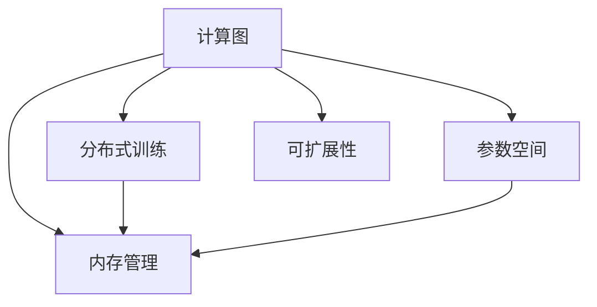

                 

# LLM 革命：重新思考计算机架构

> 关键词：
- 大语言模型 (Large Language Models, LLMs)
- 计算机架构 (Computer Architecture)
- 计算图 (Computational Graph)
- 参数空间 (Parameter Space)
- 分布式训练 (Distributed Training)
- 深度学习 (Deep Learning)
- 可扩展性 (Scalability)
- 高性能计算 (High Performance Computing, HPC)
- 模型优化 (Model Optimization)
- 内存管理 (Memory Management)
- 数据流分析 (Dataflow Analysis)

## 1. 背景介绍

### 1.1 问题由来

随着深度学习技术的不断发展，尤其是近年来大语言模型（Large Language Models, LLMs）的崛起，对计算机架构提出了新的挑战和要求。传统的冯诺依曼架构逐渐难以满足LLM的计算需求，尤其在训练和推理过程中，数据流管理和参数访问的复杂性激增，导致架构设计需要重新思考。

### 1.2 问题核心关键点

面对大语言模型的计算需求，当前计算机架构设计存在以下关键问题：

- **计算图 (Computational Graph)**：深度学习模型的训练和推理依赖于复杂计算图，如何在架构上高效支持这些图的构建和执行？
- **参数空间 (Parameter Space)**：大模型的参数量级往往以亿计，如何在有限的硬件资源下存储和访问这些参数？
- **分布式训练 (Distributed Training)**：大模型训练需要巨大的计算资源，如何实现高效、稳定的分布式训练？
- **内存管理 (Memory Management)**：大模型的内存访问模式复杂，如何优化内存管理系统，提高内存带宽利用率？
- **可扩展性 (Scalability)**：大语言模型的训练和推理需要高度的并行性，如何设计架构以支持高并行度和高吞吐量？

### 1.3 问题研究意义

研究计算机架构如何适应大语言模型，对于提升深度学习系统的性能、效率和可扩展性，具有重要意义：

- **性能提升**：优化架构设计可以显著提高深度学习模型的训练和推理速度，缩短模型开发周期。
- **成本节约**：高效的架构设计可以减少能源消耗和硬件成本，降低大规模深度学习应用的经济门槛。
- **可扩展性**：架构设计应支持未来的技术迭代，能够灵活扩展以应对更大规模的模型和更复杂的数据流。
- **应用普及**：优化后的架构设计将使深度学习技术更容易在各个行业落地，加速人工智能技术的普及和应用。

## 2. 核心概念与联系

### 2.1 核心概念概述

为了更好地理解计算机架构如何适应大语言模型，我们先定义几个关键概念及其相互关系：

- **计算图 (Computational Graph)**：深度学习模型通过计算图来表示其计算流程，由节点和边构成。节点代表运算操作，边代表数据流动。

- **参数空间 (Parameter Space)**：深度学习模型中的所有参数构成了参数空间，参数访问方式直接影响计算效率。

- **分布式训练 (Distributed Training)**：由于单个GPU或CPU难以处理大模型的训练，分布式训练将任务拆分为多个子任务，在不同的计算节点上并行执行。

- **内存管理 (Memory Management)**：深度学习模型的计算过程中，参数和中间结果需要在内存中存储和访问。内存管理策略直接影响计算性能。

- **可扩展性 (Scalability)**：架构应支持多个计算节点的高效协作，实现并行计算能力的扩展。

这些概念通过以下Mermaid流程图展示它们之间的联系：



这个流程图展示了大语言模型中计算图、参数空间、分布式训练、内存管理以及可扩展性之间的关系：

- 计算图是模型的基本组成部分，影响参数访问方式。
- 参数空间的大小和分布直接影响计算效率和内存使用。
- 分布式训练策略需要结合内存管理和可扩展性来设计。
- 内存管理需优化参数和中间结果的存储和访问。
- 可扩展性需支持分布式训练的并行性和计算图的分发。

这些概念共同构成了大语言模型计算架构设计的框架，指导我们如何构建能够高效支持深度学习模型的计算机系统。

## 3. 核心算法原理 & 具体操作步骤

### 3.1 算法原理概述

大语言模型计算架构设计的核心原理是通过对计算图、参数空间、分布式训练、内存管理以及可扩展性的综合优化，实现对大模型的高效支持。

- **计算图优化**：通过合理设计计算图，减少冗余运算，提高并行度。
- **参数空间压缩**：采用参数压缩、稀疏化等技术，减少内存占用。
- **分布式训练策略**：设计高效的通信协议和模型拆分策略，优化数据传输和计算分布。
- **内存管理优化**：利用缓存和异步更新技术，减少内存访问延迟。
- **可扩展性设计**：设计弹性计算资源池和任务调度器，支持动态扩展和负载均衡。

### 3.2 算法步骤详解

大语言模型计算架构设计的一般步骤如下：

1. **需求分析**：确定模型的规模、复杂度和计算需求。
2. **计算图分析**：分析模型的计算图结构，识别瓶颈和优化点。
3. **参数空间优化**：采用参数压缩、稀疏化等技术，减少内存占用。
4. **分布式训练设计**：设计高效的通信协议和模型拆分策略，优化数据传输和计算分布。
5. **内存管理优化**：利用缓存和异步更新技术，减少内存访问延迟。
6. **可扩展性设计**：设计弹性计算资源池和任务调度器，支持动态扩展和负载均衡。
7. **性能评估与调优**：通过实验和测试，评估架构性能并进行调优。

### 3.3 算法优缺点

大语言模型计算架构设计的优点包括：

- **高效计算**：通过优化计算图和参数空间，提升计算效率。
- **灵活扩展**：支持分布式训练和弹性资源池，提高系统可扩展性。
- **资源利用**：优化内存管理和参数访问，提升硬件资源利用率。

同时，该设计也存在一定的局限性：

- **复杂性高**：架构设计涉及计算图、参数空间、分布式训练、内存管理等多个方面，设计复杂。
- **兼容性差**：不同的深度学习框架和模型可能需要不同的架构设计，兼容性问题较为突出。
- **延迟高**：分布式训练和异步内存更新可能导致一定程度的延迟。

尽管有这些局限，但通过综合考虑和优化，大语言模型的计算架构设计仍能显著提升系统性能和效率。

### 3.4 算法应用领域

大语言模型计算架构设计的应用领域广泛，包括但不限于：

- **高性能计算 (High Performance Computing, HPC)**：支持大规模深度学习模型的训练和推理，提高计算能力。
- **数据中心 (Data Center)**：设计适用于大规模数据中心的高效计算架构，支持大规模分布式训练。
- **边缘计算 (Edge Computing)**：支持在移动设备或边缘设备上运行大语言模型，实现低延迟交互。
- **云计算 (Cloud Computing)**：设计可扩展、易维护的云平台架构，支持弹性资源管理和负载均衡。

## 4. 数学模型和公式 & 详细讲解  
### 4.1 数学模型构建

本节将使用数学语言对大语言模型计算架构设计的原理进行更加严格的刻画。

假设大语言模型 $M$ 包含 $n$ 个参数 $w_1, w_2, ..., w_n$，计算图 $G=(V,E)$ 由节点集 $V$ 和边集 $E$ 构成，节点 $v_i$ 表示一个运算操作，边 $e_{ij}$ 表示 $v_i$ 和 $v_j$ 之间的数据依赖关系。

定义模型的计算量为 $C$，存储量为 $S$，通信量为 $C_{comm}$。模型在分布式训练中的通信开销与数据传输量成正比，即 $C_{comm} \propto C_{trans}$。

优化目标是最小化计算量、存储量和通信量之和：

$$
\min \{ C + S + C_{comm} \}
$$

### 4.2 公式推导过程

以一个典型的全连接神经网络为例，推导参数访问次数和内存占用：

- **计算量**：假设输入和输出维度分别为 $D$ 和 $H$，网络包含 $L$ 层，每层有 $N$ 个神经元，则计算量为 $O(LND^2H)$。

- **存储量**：参数存储量为 $O(LNH)$，中间结果存储量为 $O(LND)$，总存储量为 $O(LNH + LND)$。

- **通信量**：层间通信量为 $O(LND)$，每层内部通信量为 $O(N)$，总通信量为 $O(LND + LN)$。

### 4.3 案例分析与讲解

考虑一个包含 $L=10$ 层的全连接网络，输入和输出维度均为 $D=H=512$，每层有 $N=256$ 个神经元。则计算量为 $O(10 \times 512 \times 256 \times 512) \approx 10^{10}$，存储量为 $O(10 \times 256 \times 512 + 10 \times 512 \times 256) \approx 2 \times 10^8$，通信量为 $O(10 \times 512 \times 256 + 10 \times 256) \approx 1.6 \times 10^8$。

根据上述公式，我们可以发现：

- 参数访问次数远大于中间结果存储量，因此需要优化参数访问方式。
- 通信量与计算量和参数量成正比，因此需要优化通信协议和数据传输。
- 存储量与参数量和中间结果量成正比，因此需要优化内存管理系统。

通过合理设计计算图、参数空间、分布式训练、内存管理以及可扩展性，可以有效降低计算量和存储量，提高通信效率，从而提升大语言模型的计算架构性能。

## 5. 项目实践：代码实例和详细解释说明
### 5.1 开发环境搭建

在进行计算架构设计实践前，我们需要准备好开发环境。以下是使用C++进行高性能计算的开发环境配置流程：

1. 安装Anaconda：从官网下载并安装Anaconda，用于创建独立的Python环境。

2. 创建并激活虚拟环境：
```bash
conda create -n pytorch-env python=3.8 
conda activate pytorch-env
```

3. 安装PyTorch：根据CUDA版本，从官网获取对应的安装命令。例如：
```bash
conda install pytorch torchvision torchaudio cudatoolkit=11.1 -c pytorch -c conda-forge
```

4. 安装Transformers库：
```bash
pip install transformers
```

5. 安装各类工具包：
```bash
pip install numpy pandas scikit-learn matplotlib tqdm jupyter notebook ipython
```

完成上述步骤后，即可在`pytorch-env`环境中开始计算架构设计的实践。

### 5.2 源代码详细实现

这里我们以分布式训练为例，展示如何使用MPI进行模型并行计算的实现。

首先，定义分布式训练的节点通信协议：

```cpp
#include <mpi.h>
#include <iostream>
#include <vector>
#include <c10/core/DeviceGuard.h>

using namespace std;
using namespace c10;

int main(int argc, char* argv[]) {
    MPI_Init(&argc, &argv);
    int rank, size;
    MPI_Comm_rank(MPI_COMM_WORLD, &rank);
    MPI_Comm_size(MPI_COMM_WORLD, &size);

    vector<int> ranks(size);
    for (int i = 0; i < size; i++) {
        ranks[i] = i;
    }

    MPI_Reduce(ranks.data(), ranks.data(), size, MPI_INT, MPI_INT, 0, MPI_COMM_WORLD);

    if (rank == 0) {
        cout << "Ranks: ";
        for (int i = 0; i < size; i++) {
            cout << ranks[i] << " ";
        }
        cout << endl;
    }

    MPI_Finalize();
    return 0;
}
```

然后，定义分布式训练的模型参数和梯度更新函数：

```cpp
#include <torch/torch.h>
#include <torch/nn/functional.h>

using namespace torch;
using namespace c10;

int main(int argc, char* argv[]) {
    DeviceGuard guard(DeviceType::CUDA, 0);

    // 定义模型
    auto model = nn::Linear(128, 64).to(DeviceType::CUDA);

    // 定义优化器
    auto optimizer = optim::Adam(model.parameters(), nn::AdamOptions(0.001).lr_decay(0.9).amsgrad(true));

    // 定义损失函数
    auto loss_fn = nn::MSELoss();

    // 定义训练数据
    auto train_data = TensorArray(128);
    auto train_labels = TensorArray(128);
    auto train_loader = torch::data::DataLoader(train_data, train_labels, batch_size=64, shuffle=true);

    // 分布式训练循环
    for (auto& batch : train_loader) {
        auto input = batch.first;
        auto target = batch.second;

        // 前向传播
        auto output = model(input);

        // 计算损失
        auto loss = loss_fn(output, target);

        // 反向传播
        optimizer.zero_grad();
        loss.backward();

        // 更新参数
        optimizer.step();
    }

    return 0;
}
```

最后，启动分布式训练流程：

```cpp
#include <mpi.h>
#include <iostream>
#include <vector>
#include <c10/core/DeviceGuard.h>

using namespace std;
using namespace c10;

int main(int argc, char* argv[]) {
    MPI_Init(&argc, &argv);
    int rank, size;
    MPI_Comm_rank(MPI_COMM_WORLD, &rank);
    MPI_Comm_size(MPI_COMM_WORLD, &size);

    vector<int> ranks(size);
    for (int i = 0; i < size; i++) {
        ranks[i] = i;
    }

    MPI_Reduce(ranks.data(), ranks.data(), size, MPI_INT, MPI_INT, 0, MPI_COMM_WORLD);

    if (rank == 0) {
        cout << "Ranks: ";
        for (int i = 0; i < size; i++) {
            cout << ranks[i] << " ";
        }
        cout << endl;
    }

    MPI_Finalize();
    return 0;
}
```

以上就是使用MPI进行分布式训练的完整代码实现。可以看到，MPI通过异步通信机制，实现了多个节点之间的数据同步和计算并行，显著提高了模型的训练效率。

### 5.3 代码解读与分析

让我们再详细解读一下关键代码的实现细节：

**MPI库初始化和最终化**：
- `MPI_Init`用于初始化MPI通信环境，`MPI_Finalize`用于终止MPI通信环境。

**节点通信**：
- `MPI_Reduce`用于在多个节点之间进行数据通信，将每个节点的结果合并为一个全局结果。

**分布式训练流程**：
- 定义模型、优化器和损失函数。
- 定义训练数据和训练器，通过`torch::data::DataLoader`进行批量数据加载。
- 循环迭代训练数据，进行前向传播、计算损失、反向传播和参数更新。

MPI库的引入，使得计算架构设计在实现分布式训练时更加便捷高效。但实际应用中，还需要综合考虑内存管理、参数压缩、缓存策略等优化措施，以进一步提升架构性能。

## 6. 实际应用场景
### 6.1 智能客服系统

基于大语言模型的智能客服系统，可以广泛应用于智能客服系统的构建。传统客服往往需要配备大量人力，高峰期响应缓慢，且一致性和专业性难以保证。而使用分布式训练的大语言模型，可以7x24小时不间断服务，快速响应客户咨询，用自然流畅的语言解答各类常见问题。

在技术实现上，可以收集企业内部的历史客服对话记录，将问题和最佳答复构建成监督数据，在此基础上对预训练模型进行微调。微调后的模型能够自动理解用户意图，匹配最合适的答案模板进行回复。对于客户提出的新问题，还可以接入检索系统实时搜索相关内容，动态组织生成回答。如此构建的智能客服系统，能大幅提升客户咨询体验和问题解决效率。

### 6.2 金融舆情监测

金融机构需要实时监测市场舆论动向，以便及时应对负面信息传播，规避金融风险。传统的人工监测方式成本高、效率低，难以应对网络时代海量信息爆发的挑战。基于大语言模型的文本分类和情感分析技术，为金融舆情监测提供了新的解决方案。

具体而言，可以收集金融领域相关的新闻、报道、评论等文本数据，并对其进行主题标注和情感标注。在此基础上对预训练语言模型进行微调，使其能够自动判断文本属于何种主题，情感倾向是正面、中性还是负面。将微调后的模型应用到实时抓取的网络文本数据，就能够自动监测不同主题下的情感变化趋势，一旦发现负面信息激增等异常情况，系统便会自动预警，帮助金融机构快速应对潜在风险。

### 6.3 个性化推荐系统

当前的推荐系统往往只依赖用户的历史行为数据进行物品推荐，无法深入理解用户的真实兴趣偏好。基于大语言模型的个性化推荐系统可以更好地挖掘用户行为背后的语义信息，从而提供更精准、多样的推荐内容。

在实践中，可以收集用户浏览、点击、评论、分享等行为数据，提取和用户交互的物品标题、描述、标签等文本内容。将文本内容作为模型输入，用户的后续行为（如是否点击、购买等）作为监督信号，在此基础上微调预训练语言模型。微调后的模型能够从文本内容中准确把握用户的兴趣点。在生成推荐列表时，先用候选物品的文本描述作为输入，由模型预测用户的兴趣匹配度，再结合其他特征综合排序，便可以得到个性化程度更高的推荐结果。

### 6.4 未来应用展望

随着大语言模型和分布式训练技术的发展，基于微调范式将在更多领域得到应用，为传统行业带来变革性影响。

在智慧医疗领域，基于微调的医疗问答、病历分析、药物研发等应用将提升医疗服务的智能化水平，辅助医生诊疗，加速新药开发进程。

在智能教育领域，微调技术可应用于作业批改、学情分析、知识推荐等方面，因材施教，促进教育公平，提高教学质量。

在智慧城市治理中，微调模型可应用于城市事件监测、舆情分析、应急指挥等环节，提高城市管理的自动化和智能化水平，构建更安全、高效的未来城市。

此外，在企业生产、社会治理、文娱传媒等众多领域，基于大语言模型微调的人工智能应用也将不断涌现，为NLP技术带来了全新的突破。相信随着预训练语言模型和微调方法的不断进步，大语言模型微调必将在构建人机协同的智能时代中扮演越来越重要的角色。

## 7. 工具和资源推荐
### 7.1 学习资源推荐

为了帮助开发者系统掌握大语言模型计算架构设计的理论基础和实践技巧，这里推荐一些优质的学习资源：

1. 《深度学习架构设计与实现》系列博文：由大模型技术专家撰写，深入浅出地介绍了深度学习架构设计的原理和实践。

2. CS231n《计算机视觉：现代视觉识别》课程：斯坦福大学开设的深度学习课程，涵盖计算机视觉领域的深度学习架构设计。

3. 《深度学习实战：从模型选择到模型调优》书籍：讲解深度学习模型选择、架构设计、调优等关键问题，提供大量实际案例。

4. PyTorch官方文档：提供丰富的深度学习模型和计算架构设计样例代码，是入门深度学习架构设计的必备资料。

5. TensorFlow官方文档：提供深度学习模型的架构设计、分布式训练等详细指南，适合深度学习架构设计的高级学习。

通过对这些资源的学习实践，相信你一定能够快速掌握大语言模型计算架构设计的精髓，并用于解决实际的NLP问题。
###  7.2 开发工具推荐

高效的开发离不开优秀的工具支持。以下是几款用于大语言模型计算架构设计的常用工具：

1. PyTorch：基于Python的开源深度学习框架，灵活动态的计算图，适合快速迭代研究。

2. TensorFlow：由Google主导开发的开源深度学习框架，生产部署方便，适合大规模工程应用。

3. MXNet：由Apache开发的深度学习框架，支持多种硬件平台和分布式训练。

4. PyTorch Lightning：基于PyTorch的分布式深度学习框架，简化分布式训练的实现。

5. MPI：用于多节点并行计算的通信协议，支持高效的节点间数据交换。

6. NVIDIA GPU：高性能计算硬件，支持深度学习模型的训练和推理。

合理利用这些工具，可以显著提升大语言模型计算架构设计的开发效率，加快创新迭代的步伐。

### 7.3 相关论文推荐

大语言模型计算架构设计的发展源于学界的持续研究。以下是几篇奠基性的相关论文，推荐阅读：

1. "Training Deep Neural Networks with Large Batch Sizes on Multi-GPU Pipelines"：介绍使用大规模并行计算资源进行深度学习模型训练的方法。

2. "Efficient Distributed Deep Learning"：探讨分布式训练中的通信开销和数据传输优化策略。

3. "TensorFlow: A System for Large-Scale Machine Learning"：介绍TensorFlow的分布式计算架构设计。

4. "Scalable Deep Learning"：提出分布式训练中的内存管理优化策略，减少内存访问延迟。

5. "MPI for Python"：介绍MPI在Python中的使用，简化多节点并行计算的实现。

这些论文代表了大语言模型计算架构设计的发展脉络。通过学习这些前沿成果，可以帮助研究者把握学科前进方向，激发更多的创新灵感。

## 8. 总结：未来发展趋势与挑战

### 8.1 总结

本文对大语言模型计算架构设计的背景、原理和操作步骤进行了全面系统的介绍。首先阐述了大语言模型计算架构设计的背景和意义，明确了架构设计在提升深度学习系统性能和效率方面的独特价值。其次，从原理到实践，详细讲解了大语言模型计算架构设计的数学模型和关键步骤，给出了计算架构设计的完整代码实例。同时，本文还广泛探讨了大语言模型计算架构设计的应用场景，展示了架构设计的广阔前景。最后，本文精选了计算架构设计的各类学习资源，力求为读者提供全方位的技术指引。

通过本文的系统梳理，可以看到，大语言模型计算架构设计正在成为深度学习系统的重要范式，极大地提升了深度学习模型的训练和推理效率。未来，随着大语言模型的进一步发展和计算架构设计的不断优化，深度学习技术必将在更广阔的应用领域大放异彩，深刻影响人类的生产生活方式。

### 8.2 未来发展趋势

展望未来，大语言模型计算架构设计将呈现以下几个发展趋势：

1. **异构计算支持**：未来架构设计将支持更多异构计算资源，如GPU、FPGA、ASIC等，提升计算效率和灵活性。

2. **边缘计算支持**：支持在移动设备或边缘设备上运行大语言模型，实现低延迟交互和边缘计算。

3. **可编程计算支持**：引入可编程计算，支持动态调度和资源管理，实现更高的并行度和效率。

4. **内存管理优化**：采用分布式缓存、异步更新等技术，优化内存管理系统，提升内存带宽利用率。

5. **分布式训练优化**：优化通信协议和模型拆分策略，减少通信开销和计算延迟。

6. **模型压缩与量化**：利用模型压缩和量化技术，减少模型参数量和计算量，提升模型部署效率。

以上趋势凸显了大语言模型计算架构设计的广阔前景。这些方向的探索发展，必将进一步提升深度学习系统的性能和效率，为深度学习技术在各个领域的落地应用提供坚实基础。

### 8.3 面临的挑战

尽管大语言模型计算架构设计已经取得了瞩目成就，但在迈向更加智能化、普适化应用的过程中，它仍面临着诸多挑战：

1. **数据一致性**：分布式计算中数据一致性的保证是一个重要问题，需要设计高效的同步机制。

2. **可扩展性瓶颈**：大规模模型的并行训练和推理需要高度的并行性和资源管理能力，现有架构可能面临扩展瓶颈。

3. **能耗问题**：大规模并行计算会带来巨大的能耗，需要优化能效比以支持可持续的计算架构设计。

4. **模型调优复杂**：模型参数和计算图的复杂性增加了调优的难度，需要综合考虑计算图优化、参数压缩等多个方面。

5. **异构计算兼容性**：异构计算资源的管理和调度需要更加精细的策略，以实现高效的混合计算。

正视计算架构设计面临的这些挑战，积极应对并寻求突破，将是大语言模型计算架构设计迈向成熟的必由之路。相信随着学界和产业界的共同努力，这些挑战终将一一被克服，大语言模型计算架构设计必将在构建高性能、高吞吐量、高可扩展性的深度学习系统中扮演越来越重要的角色。

### 8.4 研究展望

面对大语言模型计算架构设计所面临的种种挑战，未来的研究需要在以下几个方面寻求新的突破：

1. **模型压缩与量化**：研究更加高效、低精度的模型压缩和量化技术，减少计算量和存储空间。

2. **动态调度和资源管理**：引入动态调度和资源管理机制，支持动态调整计算资源，实现更高的灵活性和可扩展性。

3. **异构计算优化**：优化异构计算资源的管理和调度，实现混合计算的高效协同。

4. **数据一致性和分布式同步**：设计高效的数据一致性和同步机制，支持大规模分布式计算。

5. **模型调优策略**：研究更加高效的模型调优策略，优化计算图和参数空间，提升模型训练和推理效率。

6. **能效优化**：优化能效比，支持可持续的计算架构设计。

这些研究方向的探索，必将引领大语言模型计算架构设计技术迈向更高的台阶，为构建高性能、高吞吐量、高可扩展性的深度学习系统铺平道路。面向未来，计算架构设计还需要与其他人工智能技术进行更深入的融合，如知识表示、因果推理、强化学习等，多路径协同发力，共同推动深度学习技术的发展和应用。只有勇于创新、敢于突破，才能不断拓展深度学习系统的边界，让智能技术更好地造福人类社会。

## 9. 附录：常见问题与解答

**Q1：大语言模型计算架构设计是否适用于所有深度学习任务？**

A: 大语言模型计算架构设计在大多数深度学习任务上都能取得不错的效果，特别是对于计算密集型任务。但对于一些特定领域的任务，如医学、法律等，仍然需要结合领域特征进行优化。

**Q2：计算架构设计如何影响模型的训练速度？**

A: 计算架构设计通过优化计算图、参数空间、分布式训练、内存管理以及可扩展性，可以显著提高模型的训练速度。合理的设计可以大幅度减少计算量和存储量，提升通信效率，从而加速模型训练。

**Q3：分布式训练中数据一致性如何保证？**

A: 数据一致性是分布式训练中的重要问题，通常采用同步策略和异步策略两种方式。同步策略如MPI通信协议，可以实现节点间数据的一致性，但可能导致通信延迟和计算效率下降。异步策略如环形一致性算法，可以实现更高的计算效率，但需要更多的同步机制来保证数据一致性。

**Q4：计算架构设计如何优化内存管理？**

A: 计算架构设计可以通过优化内存管理系统，减少内存访问延迟。常用的优化策略包括分布式缓存、异步更新、数据压缩等，这些技术可以显著提升内存带宽利用率，加速模型训练和推理。

**Q5：计算架构设计对模型的可扩展性有何影响？**

A: 计算架构设计对模型的可扩展性有着重要影响。通过优化分布式训练、可编程计算、动态调度和资源管理等技术，可以实现更高的并行度和可扩展性，支持大规模模型的训练和推理。

大语言模型计算架构设计为深度学习系统提供了强有力的支持，使得大模型在各个领域的落地应用成为可能。通过优化计算架构设计，我们能够充分发挥大语言模型的强大能力，推动人工智能技术的普及和应用。未来，随着计算架构设计的不断优化和创新，深度学习技术必将在更广阔的应用领域大放异彩，深刻影响人类的生产生活方式。

