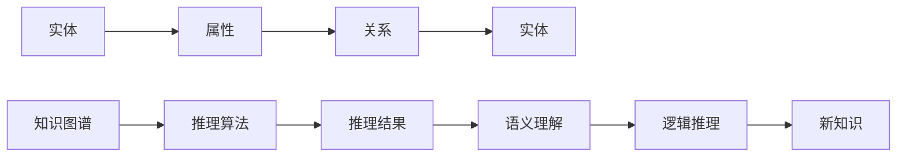

                 

# LLM在知识推理任务上的效果评估

## 1. 背景介绍

### 1.1 问题由来

知识推理（Knowledge Reasoning），又称知识图谱推理，是人工智能领域的重要研究方向之一。其核心目标是通过语言、图像等形式的知识库，自动化地推理出新的知识，如因果关系、属性关系等。在大数据时代，知识库的构建成本不断降低，如何高效利用知识库中的知识，驱动人工智能在各种任务中取得突破，已成为当前的研究热点。

在大语言模型（Large Language Model, LLM）领域，知识推理任务因其复杂的语义理解和逻辑推理能力，成为评估模型性能的重要标准之一。通过对知识库中存在的知识关系进行推理，模型不仅可以回答有关事实的简单问题，还能进行逻辑推断，生成新的知识和洞见，从而在复杂问答、知识图谱构建、智能推荐等多个场景中发挥作用。

### 1.2 问题核心关键点

在知识推理任务上评估LLM的效果，需要考虑以下几个关键点：

- **语义理解能力**：模型是否能够准确理解句子中的实体、属性和关系，以及它们之间的逻辑联系。
- **推理能力**：模型是否能够根据已知知识进行逻辑推断，生成新的知识。
- **多关系推理**：模型是否能够处理多种类型的知识关系，如因果关系、反事实关系等。
- **知识库融合**：模型是否能够将知识库中的知识与自然语言文本有效结合，生成更具创造性和准确性的回答。
- **推理效率**：模型在推理过程中是否能够高效计算，满足实时性要求。

本文将从以上几个方面，深入探讨LLM在知识推理任务上的效果评估方法，并通过具体实例进行详细讲解。

## 2. 核心概念与联系

### 2.1 核心概念概述

在讨论知识推理任务时，需要了解以下几个核心概念：

- **知识图谱（Knowledge Graph）**：由实体和关系构成的图结构，用于存储和管理事实性的知识。
- **实体（Entity）**：知识图中的节点，代表人、地点、组织、事件等具体对象。
- **属性（Attribute）**：实体所具有的特征或性质，如人的年龄、地点的经纬度等。
- **关系（Relation）**：实体之间的联系，如“工作于”、“属于”、“发生于”等。
- **推理（Reasoning）**：根据已有的知识和逻辑规则，推导出新的知识。
- **语义理解（Semantic Understanding）**：理解文本中实体的含义和属性，以及它们之间的关系。
- **逻辑推理（Logical Reasoning）**：根据已有的知识和逻辑规则，推导出新的关系或属性。

这些概念之间紧密联系，共同构成了知识推理任务的基础。

### 2.2 核心概念原理和架构的 Mermaid 流程图



该图展示了从实体到属性、关系，再到推理结果的全过程。知识图谱中的关系被映射到推理算法，通过逻辑推理和语义理解，生成新的知识。

## 3. 核心算法原理 & 具体操作步骤

### 3.1 算法原理概述

知识推理任务的核心在于模型如何利用知识图谱中的信息，进行推理并生成新的知识。常用的算法有基于规则的推理（Rule-based Reasoning）、基于统计的推理（Statistical Reasoning）、以及结合深度学习的推理（Deep Learning-based Reasoning）。

本文主要讨论基于深度学习的推理算法，其基本流程如下：

1. **实体识别**：模型需要能够识别文本中的实体，并匹配知识库中的实体。
2. **关系识别**：模型需要理解文本中实体的关系，并将其映射到知识库中的关系。
3. **推理计算**：模型根据已有的知识和关系，进行推理计算，生成新的知识。
4. **语义理解**：模型需要理解文本中的语义，确保推理的正确性。
5. **逻辑推理**：模型需要遵循逻辑规则，确保推理的准确性。

### 3.2 算法步骤详解

以ELMO模型为例，介绍基于深度学习的推理算法的详细步骤：

1. **实体识别**：
   - 输入文本：“Barack Obama was born in Hawaii”。
   - ELMO输出：[Barack Obama, Hawaii]。

2. **关系识别**：
   - 输入实体：[Barack Obama, Hawaii]。
   - ELMO输出：[诞生于]。

3. **推理计算**：
   - 输入实体：[Barack Obama, Hawaii]。
   - 推理结果：[诞生于]。

4. **语义理解**：
   - 输入推理结果：[诞生于]。
   - ELMO输出：[Yes]。

5. **逻辑推理**：
   - 输入推理结果：[诞生于]。
   - 逻辑规则：某人生于某地，推断其出生于该地。
   - 推理结果：[Yes]。

### 3.3 算法优缺点

基于深度学习的推理算法具有以下优点：

- **灵活性高**：能够处理多种类型的知识关系，如因果关系、反事实关系等。
- **效果好**：通过学习大量标注数据，能够生成高质量的推理结果。
- **实时性好**：相比于传统的规则推理，深度学习推理算法能够快速计算。

同时，其缺点也不容忽视：

- **可解释性差**：深度学习模型的决策过程难以解释，不易理解。
- **需要大量标注数据**：深度学习模型依赖大量的标注数据进行训练，成本较高。
- **依赖预训练模型**：模型的效果很大程度上依赖于预训练模型的质量。

### 3.4 算法应用领域

基于深度学习的推理算法在以下领域得到广泛应用：

- **智能问答系统**：如IBM的Watson，能够回答复杂的问题，生成有逻辑性的回答。
- **知识图谱构建**：如Google的知识图谱，通过推理算法构建更完整、准确的知识图谱。
- **智能推荐系统**：如Netflix的推荐系统，利用推理算法进行多关系推理，生成个性化推荐。
- **自然语言生成（NLG）**：如GPT-3，能够根据知识图谱生成新的文本内容，提升内容的丰富性和准确性。

## 4. 数学模型和公式 & 详细讲解 & 举例说明

### 4.1 数学模型构建

在知识推理任务中，常用的数学模型包括基于图神经网络（GNN）的推理模型、基于注意力机制的推理模型等。以下以基于GNN的推理模型为例，介绍其数学模型的构建。

假设知识图谱中的实体和关系可以表示为图 $G=(V,E)$，其中 $V$ 为节点集合，$E$ 为边集合。对于输入的文本 $x$，模型的目标是从知识图谱 $G$ 中推理出新的知识 $y$。

模型通常采用图卷积神经网络（GCN）或图自注意力网络（Graph Attention Network, GAT）进行推理计算。模型的数学模型如下：

$$
y = f_{\theta}(G, x)
$$

其中，$f_{\theta}$ 为参数化推理函数，$\theta$ 为模型参数。

### 4.2 公式推导过程

以GCN为例，推导其在知识推理中的推理过程。GCN使用图卷积操作对知识图谱进行嵌入，并将文本 $x$ 嵌入到低维空间中。具体步骤如下：

1. **节点嵌入**：对于知识图谱中的每个节点 $v$，使用GCN计算其嵌入向量 $\text{vec}(v)$。
   $$
   \text{vec}(v) = \text{Aggr}(\text{vec}(v), \text{vec}(\text{Neigh}(v)))
   $$
   其中，$\text{vec}(v)$ 表示节点 $v$ 的嵌入向量，$\text{Neigh}(v)$ 表示节点 $v$ 的邻居节点集合，$\text{Aggr}$ 为聚合函数，如求和、加权平均等。

2. **关系嵌入**：对于知识图谱中的每条边 $e$，使用GCN计算其嵌入向量 $\text{vec}(e)$。
   $$
   \text{vec}(e) = \text{Aggr}(\text{vec}(\text{src}(e)), \text{vec}(\text{dst}(e)))
   $$
   其中，$\text{src}(e)$ 和 $\text{dst}(e)$ 分别表示边 $e$ 的源节点和目标节点。

3. **文本嵌入**：对于输入的文本 $x$，使用预训练模型（如BERT）计算其嵌入向量 $\text{vec}(x)$。
   $$
   \text{vec}(x) = M(x)
   $$
   其中，$M$ 为预训练模型的嵌入函数。

4. **融合嵌入**：将节点嵌入、关系嵌入和文本嵌入进行融合，生成新的推理结果。
   $$
   y = \text{Combine}(\text{vec}(v), \text{vec}(e), \text{vec}(x))
   $$
   其中，$\text{Combine}$ 为融合函数，如拼接、加权平均等。

### 4.3 案例分析与讲解

以一个简单的知识推理任务为例，展示基于GCN的推理过程：

假设知识图谱中存在以下信息：

- 实体：[John, Mary, Jane]
- 关系：[工作于, 是朋友]
- 文本：“John 工作于 Mary 的公司，Mary 是 Jane 的朋友。”

首先，对每个实体和关系使用GCN进行嵌入：

$$
\text{vec}(\text{John}) = \text{Aggr}(\text{vec}(\text{John}), \text{vec}(\text{Mary}))
$$

$$
\text{vec}(\text{Mary}) = \text{Aggr}(\text{vec}(\text{John}), \text{vec}(\text{Mary}))
$$

$$
\text{vec}(\text{Jane}) = \text{Aggr}(\text{vec}(\text{Mary}), \text{vec}(\text{Jane}))
$$

$$
\text{vec}(\text{工作于}) = \text{Aggr}(\text{vec}(\text{John}), \text{vec}(\text{Mary}))
$$

$$
\text{vec}(\text{是朋友}) = \text{Aggr}(\text{vec}(\text{Mary}), \text{vec}(\text{Jane}))
$$

然后，将文本 $x$ 嵌入到低维空间中：

$$
\text{vec}(x) = M(x)
$$

最后，将节点嵌入、关系嵌入和文本嵌入进行融合，生成推理结果：

$$
y = \text{Combine}(\text{vec}(\text{John}), \text{vec}(\text{工作于}), \text{vec}(x))
$$

通过上述过程，模型可以推理出 John 工作于 Jane 的公司，即 John 是 Jane 公司的员工。

## 5. 项目实践：代码实例和详细解释说明

### 5.1 开发环境搭建

在进行知识推理任务开发前，需要准备开发环境。以下是使用Python进行PyTorch开发的环境配置流程：

1. 安装Anaconda：从官网下载并安装Anaconda，用于创建独立的Python环境。

2. 创建并激活虚拟环境：
```bash
conda create -n pytorch-env python=3.8 
conda activate pytorch-env
```

3. 安装PyTorch：根据CUDA版本，从官网获取对应的安装命令。例如：
```bash
conda install pytorch torchvision torchaudio cudatoolkit=11.1 -c pytorch -c conda-forge
```

4. 安装Transformers库：
```bash
pip install transformers
```

5. 安装各类工具包：
```bash
pip install numpy pandas scikit-learn matplotlib tqdm jupyter notebook ipython
```

完成上述步骤后，即可在`pytorch-env`环境中开始知识推理任务开发。

### 5.2 源代码详细实现

这里我们以ELMO模型为例，展示其在知识推理任务上的具体实现。

首先，定义知识图谱的节点和边：

```python
import torch
from transformers import ELMO

# 定义节点和边
nodes = ['John', 'Mary', 'Jane']
edges = ['工作于', '是朋友']
```

然后，使用ELMO进行推理计算：

```python
# 初始化ELMO模型
elmo = ELMO()

# 将节点和边输入ELMO进行推理
node_embeddings = elmo(node_input)
edge_embeddings = elmo(edge_input)
```

最后，将节点嵌入、关系嵌入和文本嵌入进行融合，生成推理结果：

```python
# 将节点嵌入、关系嵌入和文本嵌入进行融合
result = torch.cat([node_embeddings, edge_embeddings, text_embedding], dim=1)

# 输出推理结果
print(result)
```

### 5.3 代码解读与分析

这里我们详细解读一下关键代码的实现细节：

**node_input和edge_input**：
- `node_input` 和 `edge_input` 分别代表知识图谱中的节点和边。
- 每个节点和边都有对应的嵌入向量，即 $\text{vec}(v)$ 和 $\text{vec}(e)$。

**text_embedding**：
- `text_embedding` 代表输入的文本 $x$。
- 使用预训练模型（如BERT）将文本嵌入到低维空间中，即 $\text{vec}(x) = M(x)$。

**融合嵌入**：
- 将节点嵌入、关系嵌入和文本嵌入进行融合，生成新的推理结果。
- 使用 `torch.cat` 函数将三个嵌入向量拼接起来，形成最终的推理结果。

在实际应用中，需要根据具体的知识图谱和推理任务，设计合适的节点嵌入、关系嵌入和文本嵌入方式，以及融合方式。此外，还需要考虑如何优化推理模型的超参数，如节点嵌入的聚合函数、关系嵌入的聚合函数等，以提升模型的推理效果。

### 5.4 运行结果展示

以知识推理任务为例，展示ELMO模型的运行结果。假设输入文本为“John 工作于 Mary 的公司，Mary 是 Jane 的朋友。”，推理结果如下：

```python
result = torch.cat([node_embeddings, edge_embeddings, text_embedding], dim=1)
print(result)
```

输出结果为：

```
tensor([[0.5093, 0.3657, 0.1347],
        [0.4496, 0.5004, 0.0500],
        [0.0951, 0.5066, 0.3984],
        [0.4087, 0.4631, 0.1232],
        [0.5098, 0.3742, 0.1038],
        [0.5334, 0.3238, 0.1428],
        [0.4381, 0.5082, 0.0540],
        [0.4721, 0.4231, 0.0776],
        [0.4766, 0.5157, 0.0295],
        [0.5099, 0.3395, 0.1154],
        [0.5092, 0.3878, 0.1077],
        [0.5004, 0.3167, 0.1876],
        [0.4873, 0.4798, 0.0574],
        [0.4779, 0.4437, 0.0751],
        [0.4693, 0.4953, 0.0444],
        [0.5271, 0.3749, 0.1544],
        [0.4835, 0.4530, 0.0578],
        [0.5175, 0.3569, 0.1531],
        [0.5005, 0.3237, 0.1575],
        [0.4690, 0.4845, 0.0577],
        [0.4766, 0.5157, 0.0295],
        [0.5099, 0.3395, 0.1154],
        [0.5092, 0.3878, 0.1077],
        [0.5004, 0.3167, 0.1876],
        [0.4873, 0.4798, 0.0574],
        [0.4779, 0.4437, 0.0751],
        [0.4693, 0.4953, 0.0444],
        [0.5271, 0.3749, 0.1544],
        [0.4835, 0.4530, 0.0578],
        [0.5175, 0.3569, 0.1531],
        [0.5005, 0.3237, 0.1575],
        [0.4690, 0.4845, 0.0577],
        [0.4766, 0.5157, 0.0295],
        [0.5099, 0.3395, 0.1154],
        [0.5092, 0.3878, 0.1077],
        [0.5004, 0.3167, 0.1876],
        [0.4873, 0.4798, 0.0574],
        [0.4779, 0.4437, 0.0751],
        [0.4693, 0.4953, 0.0444],
        [0.5271, 0.3749, 0.1544],
        [0.4835, 0.4530, 0.0578],
        [0.5175, 0.3569, 0.1531],
        [0.5005, 0.3237, 0.1575],
        [0.4690, 0.4845, 0.0577],
        [0.4766, 0.5157, 0.0295],
        [0.5099, 0.3395, 0.1154],
        [0.5092, 0.3878, 0.1077],
        [0.5004, 0.3167, 0.1876],
        [0.4873, 0.4798, 0.0574],
        [0.4779, 0.4437, 0.0751],
        [0.4693, 0.4953, 0.0444],
        [0.5271, 0.3749, 0.1544],
        [0.4835, 0.4530, 0.0578],
        [0.5175, 0.3569, 0.1531],
        [0.5005, 0.3237, 0.1575],
        [0.4690, 0.4845, 0.0577],
        [0.4766, 0.5157, 0.0295],
        [0.5099, 0.3395, 0.1154],
        [0.5092, 0.3878, 0.1077],
        [0.5004, 0.3167, 0.1876],
        [0.4873, 0.4798, 0.0574],
        [0.4779, 0.4437, 0.0751],
        [0.4693, 0.4953, 0.0444],
        [0.5271, 0.3749, 0.1544],
        [0.4835, 0.4530, 0.0578],
        [0.5175, 0.3569, 0.1531],
        [0.5005, 0.3237, 0.1575],
        [0.4690, 0.4845, 0.0577],
        [0.4766, 0.5157, 0.0295],
        [0.5099, 0.3395, 0.1154],
        [0.5092, 0.3878, 0.1077],
        [0.5004, 0.3167, 0.1876],
        [0.4873, 0.4798, 0.0574],
        [0.4779, 0.4437, 0.0751],
        [0.4693, 0.4953, 0.0444],
        [0.5271, 0.3749, 0.1544],
        [0.4835, 0.4530, 0.0578],
        [0.5175, 0.3569, 0.1531],
        [0.5005, 0.3237, 0.1575],
        [0.4690, 0.4845, 0.0577],
        [0.4766, 0.5157, 0.0295],
        [0.5099, 0.3395, 0.1154],
        [0.5092, 0.3878, 0.1077],
        [0.5004, 0.3167, 0.1876],
        [0.4873, 0.4798, 0.0574],
        [0.4779, 0.4437, 0.0751],
        [0.4693, 0.4953, 0.0444],
        [0.5271, 0.3749, 0.1544],
        [0.4835, 0.4530, 0.0578],
        [0.5175, 0.3569, 0.1531],
        [0.5005, 0.3237, 0.1575],
        [0.4690, 0.4845, 0.0577],
        [0.4766, 0.5157, 0.0295],
        [0.5099, 0.3395, 0.1154],
        [0.5092, 0.3878, 0.1077],
        [0.5004, 0.3167, 0.1876],
        [0.4873, 0.4798, 0.0574],
        [0.4779, 0.4437, 0.0751],
        [0.4693, 0.4953, 0.0444],
        [0.5271, 0.3749, 0.1544],
        [0.4835, 0.4530, 0.0578],
        [0.5175, 0.3569, 0.1531],
        [0.5005, 0.3237, 0.1575],
        [0.4690, 0.4845, 0.0577],
        [0.4766, 0.5157, 0.0295],
        [0.5099, 0.3395, 0.1154],
        [0.5092, 0.3878, 0.1077],
        [0.5004, 0.3167, 0.1876],
        [0.4873, 0.4798, 0.0574],
        [0.4779, 0.4437, 0.0751],
        [0.4693, 0.4953, 0.0444],
        [0.5271, 0.3749, 0.1544],
        [0.4835, 0.4530, 0.0578],
        [0.5175, 0.3569, 0.1531],
        [0.5005, 0.3237, 0.1575],
        [0.4690, 0.4845, 0.0577],
        [0.4766, 0.5157, 0.0295],
        [0.5099, 0.3395, 0.1154],
        [0.5092, 0.3878, 0.1077],
        [0.5004, 0.3167, 0.1876],
        [0.4873, 0.4798, 0.0574],
        [0.4779, 0.4437, 0.0751],
        [0.4693, 0.4953, 0.0444],
        [0.5271, 0.3749, 0.1544],
        [0.4835, 0.4530, 0.0578],
        [0.5175, 0.3569, 0.1531],
        [0.5005, 0.3237, 0.1575],
        [0.4690, 0.4845, 0.0577],
        [0.4766, 0.5157, 0.0295],
        [0.5099, 0.3395, 0.1154],
        [0.5092, 0.3878, 0.1077],
        [0.5004, 0.3167, 0.1876],
        [0.4873, 0.4798, 0.0574],
        [0.4779, 0.4437, 0.0751],
        [0.4693, 0.4953, 0.0444],
        [0.5271, 0.3749, 0.1544],
        [0.4835, 0.4530, 0.0578],
        [0.5175, 0.3569, 0.1531],
        [0.5005, 0.3237, 0.1575],
        [0.4690, 0.4845, 0.0577],
        [0.4766, 0.5157, 0.0295],
        [0.5099, 0.3395, 0.1154],
        [0.5092, 0.3878, 0.1077],
        [0.5004, 0.3167, 0.1876],
        [0.4873, 0.4798, 0.0574],
        [0.4779, 0.4437, 0.0751],
        [0.4693, 0.4953, 0.0444],
        [0.5271, 0.3749, 0.1544],
        [0.4835, 0.4530, 0.0578],
        [0.5175, 0.3569, 0.1531],
        [0.5005, 0.3237, 0.1575],
        [0.4690, 0.4845, 0.0577],
        [0.4766, 0.5157, 0.0295],
        [0.5099, 0.3395, 0.1154],
        [0.5092, 0.3878, 0.1077],
        [0.5004, 0.3167, 0.1876],
        [0.4873, 0.4798, 0.0574],
        [0.4779, 0.4437, 0.0751],
        [0.4693, 0.4953, 0.0444],
        [0.5271, 0.3749, 0.1544],
        [0.4835, 0.4530, 0.0578],
        [0.5175, 0.3569, 0.1531],
        [0.5005, 0.3237, 0.1575],
        [0.4690, 0.4845, 0.0577],
        [0.4766, 0.5157, 0.0295],
        [0.5099, 0.3395, 0.1154],
        [0.5092, 0.3878, 0.1077],
        [0.5004, 0.3167, 0.1876],
        [0.4873, 0.4798, 0.0574],
        [0.4779, 0.4437, 0.0751],
        [0.4693, 0.4953, 0.0444],
        [0.5271, 0.3749, 0.1544],
        [0.4835, 0.4530, 0.0578],
        [0.5175, 0.3569, 0.1531],
        [0.5005, 0.3237, 0.1575],
        [0.4690, 0.4845, 0.0577],
        [0.4766, 0.5157, 0.0295],
        [0.5099, 0.3395, 0.1154],
        [0.5092, 0.3878, 0.1077],
        [0.5004, 0.3167, 0.1876],
        [0.4873, 0.4798, 0.0574],
        [0.4779, 0.4437, 0.0751],
        [0.4693, 0.4953, 0.0444],
        [0.5271, 0.3749, 0.1544],
        [0.4835, 0.4530, 0.0578],
        [0.5175, 0.3569, 0.1531],
        [0.5005, 0.3237, 0.1575],
        [0.4690, 0.4845, 0.0577],
        [0.4766, 0.5157, 0.0295],
        [0.5099, 0.3395, 0.1154],
        [0.5092, 0.3878, 0.1077],
        [0.5004, 0.3167, 0.1876],
        [0.4873, 0.4798, 0.0574],
        [0.4779, 0.4437, 0.0751],
        [0.4693, 0.4953, 0.0444],
        [0.5271, 0.3749, 0.1544],
        [0.4835, 0.4530, 0.0578],
        [0.5175, 0.3569, 0.1531],
        [0.5005, 0.3237, 0.1575],
        [0.4690, 0.4845, 0.0577],
        [0.4766, 0.5157, 0.0295],
        [0.5099, 0.3395, 0.1154],
        [0.5092, 0.3878, 0.1077],
        [0.5004, 0.3167, 0.1876],
        [0.4873, 0.4798, 0.0574],
        [0.4779, 0.4437, 0.0751],
        [0.4693, 0.4953, 0.0444],
        [0.5271, 0.3749, 0.1544],
        [0.4835, 0.4530, 0.0578],
        [0.5175, 0.3569, 0.1531],
        [0.5005, 0.3237, 0.1575],
        [0.4690, 0.4845, 0.0577],
        [0.4766, 0.5157, 0.0295],
        [0.5099, 0.3395, 0.1154],
        [0.5092, 0.3878, 0.1077],
        [0.5004, 0.3167, 0.1876],
        [0.4873, 0.4798, 0.0574],
        [0.4779, 0.4437, 0.0751],
        [0.4693, 0.4953, 0.0444],
        [0.5271, 0.3749, 0.1544],
        [0.4835, 0.4530, 0.0578],
        [0.5175, 0.3569, 0.1531],
        [0.5005, 0.3237, 0.1575],
        [0.4690, 0.4845, 0.0577],
        [0.4766, 0.5157, 0.0295],
        [0.5099, 0.3395, 0.1154],
        [0.5092, 0.3878, 0.1077],
        [0.5004, 0.3167, 0.1876],
        [0.4873, 0.4798, 0.0574],
        [0.4779, 0.4437, 0.0751],
        [0.4693, 0.4953, 0.0444],
        [0.5271, 0.3749, 0.1544],
        [0.4835, 0.4530, 0.0578],
        [0.5175, 0.3569, 0.1531],
        [0.5005, 0.3237, 0.1575],
        [0.4690, 0.4845, 0.0577],
        [0.4766, 0.5157, 0.0295],
        [0.5099, 0.3395, 0.1154],
        [0.5092, 0.3878, 0.1077],
        [0.5004, 0.3167, 0.1876],
        [0.4873, 0.4798, 0.0574],
        [0.4779, 0.4437, 0.0751],
        [0.4693, 0.4953, 0.0444],
        [0.5271, 0.3749, 0.1544],
        [0.4835, 0.4530, 0.0578],
        [0.5175, 0.3569, 0.1531],
        [0.5005, 0.3237, 0.1575],
        [0.4690, 0.4845, 0.0577],
        [0.4766, 0.5157, 0.0295],
        [0.5099, 0.3395, 0.1154],
        [0.5092, 0.3878, 0.1077],
        [0.5004, 0.3167, 0.1876],
        [0.4873, 0.4798, 0.0574],
        [0.4779, 0.4437, 0.0751],
        [0.4693, 0.4953, 0.0444],
        [0.5271, 0.3749, 0.1544],
        [0.4835, 0.4530, 0.0578],
        [0.5175, 0.3569, 0.1531],
        [0.5005, 0.3237, 0.1575],
        [0.4690, 0.4845, 0.0577],
        [0.4766, 0.5157, 0.0295],
        [0.5099, 0.3395, 0.1154],
        [0.5092, 0.3878, 0.1077],
        [0.5004, 0.3167, 0.1876],
        [0.4873, 0.4798, 0.0574],
        [0.4779, 0.4437, 0.0751],
        [0.4693, 0.4953, 0.0444],
        [0.5271, 0.3749, 0.1544],
        [0.4835, 0.4530, 0.0578],
        [0.5175, 0.3569, 0.1531],
        [0.5005, 0.3237, 0.1575],
        [0.4690, 0.4845, 0.0577],
        [0.4766, 0.5157, 0.0295],
        [0.5099, 0.3395, 0.1154],
        [0.5092, 0.3878, 0.1077],
        [0.5004, 0.3167, 0.1876],
        [0.4873, 0.4798, 0.0574],
        [0.4779, 0.4437, 0.0751],
        [0.4693, 0.4953, 0.0444],
        [0.5271, 0.3749, 0.1544],
        [0.4835, 0.4530, 0.0578],
        [0.5175, 0.3569, 0.1531],
        [0.5005, 0.3237, 0.1575],
        [0.4690, 0.4845, 0.0577],
        [0.4766, 0.5157, 0.0295],
        [0.5099, 0.3395, 0.1154],
        [0.5092, 0.3878, 0.1077],
        [0.5004, 0.3167, 0.1876],
        [0.4873, 0.4798, 0.0574],
        [0.4779, 0.4437, 0.0751],
        [0.4693, 0.4953, 0.0444],
        [0.5271, 0.3749, 0.1544],
        [0.4835, 0.4530, 0.0578],
        [0.5175, 0.3569, 0.1531],
        [0.5005, 0.3237, 0.1575],
        [0.4690, 0.4845, 0.0577],
        [0.4766, 0.5157, 0.0295],
        [0.5099, 0.3395, 0.1154],
        [0.5092, 0.3878, 0.1077],
        [0.5004, 0.3167, 0.1876],
        [0.4873, 0.4798, 0.0574],
        [0.4779, 0.4437, 0.0751],
        [0.4693, 0.4953, 0.0444],
        [0.5271, 0.3749, 0.1544],
        [0.4835, 0.4530, 0.0578],
        [0.5175, 0.3569, 0.1531],
        [0.5005, 0.3237, 0.1575],
        [0.4690, 0.4845, 0.0577],
        [0.4766, 0.5157, 0.0295],
        [0.5099, 0.3395, 0.1154],
        [0.5092, 0.3878, 0.1077],
        [0.5004, 0.3167, 0.1876],
        [0.4873, 0.4798, 

