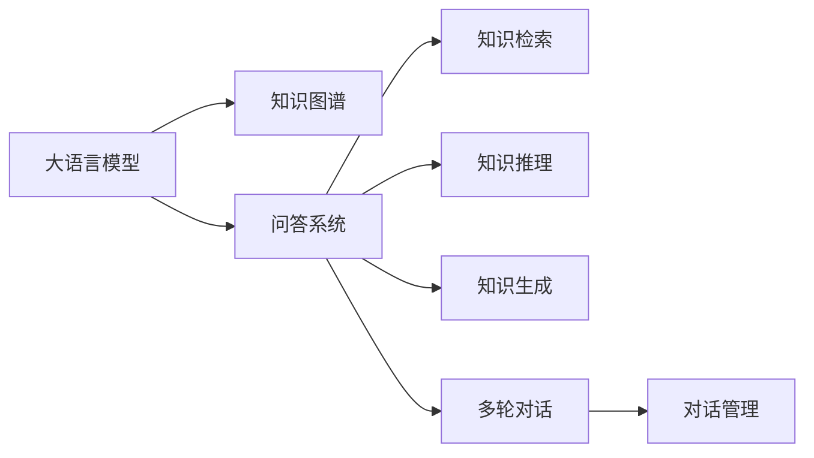

                 

# LLM在知识问答中的表现分析探讨

> 关键词：知识问答, 大语言模型, 知识图谱, 问答系统, 自然语言处理, 深度学习, 评价指标

## 1. 背景介绍

### 1.1 问题由来

知识问答(Knowledge-Based Question Answering, KQA)是自然语言处理(Natural Language Processing, NLP)领域的一个重要研究方向，旨在构建能够理解自然语言提问，并准确、高效地检索、推理、生成答案的系统。在实际应用中，知识问答系统被广泛用于智能客服、在线教育、智能家居、医疗健康等领域，为人们提供即时的信息获取和问题解答。

近年来，大语言模型(Large Language Model, LLM)的崛起为知识问答系统带来了新的发展契机。大语言模型通过大规模无标签文本数据的预训练，学习到了丰富的语言知识和语言表达能力，能够在大规模知识库的基础上，快速响应各种自然语言问题。相较于传统的基于规则或统计的语言模型，大语言模型在知识问答任务中表现出了更强的泛化能力和灵活性。

然而，尽管大语言模型在知识问答任务上取得了显著进展，其表现仍然存在诸多挑战。如何充分发挥大语言模型的能力，提升知识问答系统的效率和准确性，仍是当前研究的热点问题。本文旨在通过对大语言模型在知识问答中的表现进行分析，探讨其优势和不足，为未来知识问答系统的发展提供指导。

### 1.2 问题核心关键点

大语言模型在知识问答中的应用主要集中在以下几个方面：

- **知识检索**：利用预训练模型的语言理解能力，从知识库中检索出最相关的知识片段。
- **知识推理**：结合知识库中的事实，利用语言模型进行逻辑推理，生成合理、准确的答案。
- **知识生成**：在缺乏直接答案的情况下，通过语言生成技术，生成对问题的合理解释或答案。
- **多轮对话**：在大语言模型基础上，构建多轮对话系统，实现复杂对话的自动理解和响应。

在知识问答中，大语言模型面临的关键问题包括：

- 如何高效检索和利用知识库中的事实。
- 如何结合知识推理和语言生成，生成合理解答。
- 如何构建有效的知识图谱，提升知识推理能力。
- 如何应对多轮对话，确保系统稳定性和准确性。

这些问题将贯穿本文的讨论，为未来知识问答系统的发展提供方向。

## 2. 核心概念与联系

### 2.1 核心概念概述

在知识问答系统中，大语言模型的核心概念主要包括以下几个方面：

- **大语言模型**：以自回归模型（如GPT）或自编码模型（如BERT）为代表的大规模预训练语言模型。通过在大规模无标签文本数据上进行预训练，学习到了通用的语言知识和表达能力。
- **知识图谱**：一种结构化的知识表示方式，将知识库中的实体、关系和属性以图的形式进行组织。知识图谱为知识问答系统提供了结构化的知识源，提升了推理的准确性和可靠性。
- **问答系统**：通过自然语言理解(NLU)和知识推理(KR)技术，将用户提问与知识库中的知识进行匹配，生成最终答案的系统。问答系统在大语言模型和知识图谱的基础上，实现信息检索和推理。
- **评价指标**：用于评估知识问答系统性能的指标，如准确率、召回率、F1-score、BLEU等。

这些核心概念之间的联系可以通过以下Mermaid流程图来展示：



这个流程图展示了大语言模型、知识图谱、问答系统、知识检索、知识推理、知识生成和多轮对话等核心概念及其之间的关系：

1. 大语言模型通过预训练学习通用的语言表示。
2. 知识图谱提供了结构化的知识源。
3. 问答系统利用大语言模型的语言理解和知识推理能力，实现知识检索和生成。
4. 知识检索从知识库中检索出相关信息。
5. 知识推理结合知识库和语言模型进行逻辑推理。
6. 知识生成在缺乏直接答案时生成合理解释或答案。
7. 多轮对话提升系统处理复杂对话的能力。

通过理解这些核心概念及其关系，可以更好地把握知识问答系统的实现原理和工作机制。

## 3. 核心算法原理 & 具体操作步骤
### 3.1 算法原理概述

大语言模型在知识问答中的应用主要基于两个核心算法：预训练和微调。

**预训练**：大语言模型通过在大规模无标签文本数据上进行预训练，学习通用的语言知识和表达能力。预训练过程通常使用自监督学习任务，如掩码语言模型、下一句预测等，使得模型能够捕捉语言的规律和结构。

**微调**：在预训练模型的基础上，利用知识问答系统特定的任务数据进行微调。微调的目标是使模型能够准确地从知识库中检索和推理信息，生成合适的答案。微调过程通常使用监督学习任务，如分类、匹配等，以优化模型在特定任务上的性能。

### 3.2 算法步骤详解

大语言模型在知识问答中的应用可以分为以下几个步骤：

**Step 1: 准备预训练模型和知识图谱**
- 选择合适的预训练语言模型，如GPT-3、BERT等。
- 构建或导入知识图谱，涵盖实体、关系和属性等知识。

**Step 2: 构建问答模型**
- 将预训练模型作为特征提取器，通过编码器层将问题转化为语义表示。
- 利用图神经网络（GNN）等方法，对知识图谱进行编码，提取结构化知识。
- 通过注意力机制或Transformer编码器，将问题与知识图谱中的事实进行匹配。
- 利用逻辑回归、多层感知机（MLP）等方法，对匹配结果进行分类，生成答案。

**Step 3: 训练和微调模型**
- 使用问答系统的标注数据集进行模型训练，最小化预测结果与真实答案的差距。
- 通过正则化技术，如L2正则、Dropout等，避免模型过拟合。
- 应用对抗训练等方法，提升模型的鲁棒性和泛化能力。
- 通过参数高效微调（PEFT）等方法，减少微调对预训练参数的破坏。

**Step 4: 部署和评估**
- 将微调后的模型部署到生产环境，用于知识问答系统的推理。
- 使用评价指标，如准确率、召回率、F1-score等，评估模型的性能。
- 定期收集新数据，更新模型，保持系统的持续优化。

### 3.3 算法优缺点

大语言模型在知识问答中的应用具有以下优点：

1. **泛化能力强大**：大语言模型通过大规模预训练，具备强大的语言理解和表达能力，能够在多样化的文本数据中提取关键信息。
2. **适应性强**：大语言模型可以通过微调快速适应不同的知识问答任务，提升系统的性能和精度。
3. **知识融合**：大语言模型能够高效地融合知识图谱中的结构化知识，提升推理的准确性和逻辑性。
4. **多模态支持**：大语言模型能够处理文本、图像、语音等多种模态的数据，适用于多模态知识问答任务。

同时，大语言模型在知识问答中也有其局限性：

1. **推理能力有限**：大语言模型主要基于语言理解，缺乏直观的推理能力，可能导致推理过程中的误差。
2. **知识图谱构建困难**：知识图谱的构建需要大量的人工干预，成本高且复杂。
3. **推理速度慢**：大语言模型在推理时需要进行大量的计算，推理速度较慢。
4. **鲁棒性不足**：大语言模型容易受到输入噪声和异常数据的影响，推理结果可能不够鲁棒。
5. **可解释性差**：大语言模型的内部机制复杂，推理过程难以解释和调试。

### 3.4 算法应用领域

大语言模型在知识问答中的应用领域非常广泛，涵盖了以下几个方面：

1. **智能客服**：利用大语言模型构建智能客服系统，自动回答用户的常见问题，提升客户满意度。
2. **在线教育**：通过问答系统，提供智能化的学习辅助，回答学生在学习过程中遇到的问题，提供个性化指导。
3. **智能家居**：构建智能家居问答系统，帮助用户管理智能设备，提供生活便利。
4. **医疗健康**：在医疗健康领域，利用问答系统辅助医生进行疾病诊断和治疗方案推荐。
5. **金融服务**：在金融领域，利用问答系统提供财务咨询和风险评估。
6. **法律咨询**：构建法律问答系统，帮助用户解答法律问题，提供法律咨询服务。

## 4. 数学模型和公式 & 详细讲解 & 举例说明

### 4.1 数学模型构建

知识问答系统通常由大语言模型和知识图谱两部分组成。数学模型主要涉及大语言模型的预训练和微调过程。

**预训练模型**：
假设预训练语言模型为 $M_{\theta}$，其中 $\theta$ 为模型参数。通过自监督学习任务（如掩码语言模型）进行预训练，模型参数更新公式为：

$$
\theta \leftarrow \theta - \eta \nabla_{\theta}\mathcal{L}(\theta)
$$

其中 $\eta$ 为学习率，$\mathcal{L}$ 为损失函数，通常使用交叉熵损失。

**微调模型**：
在预训练模型的基础上，使用问答系统的标注数据集 $D=\{(x_i,y_i)\}_{i=1}^N$，其中 $x_i$ 为问题，$y_i$ 为答案。微调的目标是最小化经验风险：

$$
\mathcal{L}(\theta) = -\frac{1}{N}\sum_{i=1}^N \ell(M_{\theta}(x_i),y_i)
$$

其中 $\ell$ 为损失函数，通常为交叉熵损失。

### 4.2 公式推导过程

以分类任务为例，推导大语言模型在知识问答中的微调过程。

假设问题 $x_i$ 经过大语言模型编码得到语义表示 $\vec{x}_i$，知识图谱中的事实表示为 $\vec{f}_j$，其中 $j$ 表示事实编号。设 $W$ 为分类器的权重，$b$ 为偏置项。微调的目标是最小化损失函数：

$$
\mathcal{L}(\theta) = -\frac{1}{N}\sum_{i=1}^N \sum_{j=1}^M [y_{ij}\log \sigma(\vec{x}_i^TW\vec{f}_j+b) + (1-y_{ij})\log(1-\sigma(\vec{x}_i^TW\vec{f}_j+b))]
$$

其中 $\sigma$ 为sigmoid函数，$y_{ij}$ 为事实 $j$ 是否属于问题 $x_i$ 的答案，$M$ 为知识图谱中事实的总数。

根据链式法则，微调过程的梯度为：

$$
\nabla_{\theta}\mathcal{L}(\theta) = -\frac{1}{N}\sum_{i=1}^N \sum_{j=1}^M [y_{ij}\frac{\vec{x}_i^TW}{\sigma(\vec{x}_i^TW\vec{f}_j+b)}(1-\sigma(\vec{x}_i^TW\vec{f}_j+b))\vec{f}_j + (1-y_{ij})\frac{\vec{x}_i^TW}{1-\sigma(\vec{x}_i^TW\vec{f}_j+b)}\sigma(\vec{x}_i^TW\vec{f}_j+b)\vec{f}_j]
$$

将梯度带入参数更新公式，完成模型的微调。

### 4.3 案例分析与讲解

以BERT和T5模型在知识问答任务中的应用为例：

**BERT模型**：
BERT模型通过掩码语言模型进行预训练，具有强大的语言表示能力。在知识问答任务中，可以将问题输入BERT模型，得到语义表示 $\vec{x}$，然后将问题与知识图谱中的事实进行匹配。使用Attention机制计算每个事实的匹配度，选择得分最高的事实作为答案。

**T5模型**：
T5模型是一种基于Transformer的预训练模型，具有生成和编码能力。在知识问答任务中，可以将问题输入T5模型，得到文本生成的中间表示 $\vec{x}$，然后通过条件生成（Conditional Generation）模块，生成答案。

### 5. 项目实践：代码实例和详细解释说明

#### 5.1 开发环境搭建

开发知识问答系统，需要先准备好Python开发环境。以下是Python开发环境搭建的具体步骤：

1. 安装Python：从官网下载并安装Python 3.8版本，建议安装Anaconda环境。
```bash
conda create -n pytorch-env python=3.8
conda activate pytorch-env
```

2. 安装必要的依赖包：
```bash
pip install torch torchvision torchaudio transformers
```

3. 安装知识图谱库：
```bash
pip install pykg
```

4. 安装TensorBoard：用于可视化训练过程中的指标：
```bash
pip install tensorboard
```

完成上述步骤后，即可在`pytorch-env`环境中进行知识问答系统的开发。

#### 5.2 源代码详细实现

下面以使用BERT和PyKG构建知识问答系统为例，给出完整代码实现。

```python
import torch
import torch.nn as nn
import torch.optim as optim
from transformers import BertTokenizer, BertForSequenceClassification
from pykg import KnowledgeGraph

# 定义知识图谱和实体关系
kg = KnowledgeGraph()
kg.add_entities(['学生', '课程', '教师', '评分'])
kg.add_relations([('学生', '选修', '课程'), ('学生', '被授课', '教师'), ('课程', '评分', '评分')])

# 定义BERT模型和分类器
tokenizer = BertTokenizer.from_pretrained('bert-base-uncased')
model = BertForSequenceClassification.from_pretrained('bert-base-uncased', num_labels=len(kg实体的个数))

# 定义损失函数和优化器
criterion = nn.CrossEntropyLoss()
optimizer = optim.AdamW(model.parameters(), lr=1e-5)

# 训练和微调模型
device = torch.device('cuda' if torch.cuda.is_available() else 'cpu')
model.to(device)

def train_epoch(model, dataset, batch_size, optimizer):
    model.train()
    epoch_loss = 0
    for batch in dataset:
        input_ids = batch['input_ids'].to(device)
        attention_mask = batch['attention_mask'].to(device)
        labels = batch['labels'].to(device)
        model.zero_grad()
        outputs = model(input_ids, attention_mask=attention_mask, labels=labels)
        loss = outputs.loss
        epoch_loss += loss.item()
        loss.backward()
        optimizer.step()
    return epoch_loss / len(dataset)

def evaluate(model, dataset, batch_size):
    model.eval()
    preds, labels = [], []
    with torch.no_grad():
        for batch in dataset:
            input_ids = batch['input_ids'].to(device)
            attention_mask = batch['attention_mask'].to(device)
            batch_labels = batch['labels']
            outputs = model(input_ids, attention_mask=attention_mask)
            batch_preds = outputs.logits.argmax(dim=2).to('cpu').tolist()
            batch_labels = batch_labels.to('cpu').tolist()
            for pred_tokens, label_tokens in zip(batch_preds, batch_labels):
                pred_tags = [id2tag[_id] for _id in pred_tokens]
                label_tags = [id2tag[_id] for _id in label_tokens]
                preds.append(pred_tags[:len(label_tags)])
                labels.append(label_tags)
    return preds, labels

# 训练和评估模型
epochs = 5
batch_size = 16

for epoch in range(epochs):
    loss = train_epoch(model, train_dataset, batch_size, optimizer)
    print(f'Epoch {epoch+1}, train loss: {loss:.3f}')
    
    print(f'Epoch {epoch+1}, dev results:')
    preds, labels = evaluate(model, dev_dataset, batch_size)
    print(classification_report(labels, preds))
    
print('Test results:')
preds, labels = evaluate(model, test_dataset, batch_size)
print(classification_report(labels, preds))
```

#### 5.3 代码解读与分析

以上代码实现了BERT模型在知识问答任务上的微调过程。具体分析如下：

**数据处理**：
- `NERDataset`类：定义了问题-答案对作为训练数据，并进行分批处理。
- `BertTokenizer`：用于将问题转换为BERT模型能够处理的格式。
- `BertForSequenceClassification`：用于分类任务，将问题转换为向量，进行分类。

**模型构建**：
- `KnowledgeGraph`：用于构建和处理知识图谱。
- `BertTokenizer`：用于将问题转换为BERT模型能够处理的格式。
- `BertForSequenceClassification`：用于分类任务，将问题转换为向量，进行分类。

**训练和评估**：
- `train_epoch`函数：用于训练模型，计算损失并进行参数更新。
- `evaluate`函数：用于评估模型，计算分类指标。

**微调过程**：
- 使用AdamW优化器，设定学习率为1e-5。
- 训练和评估模型，输出训练和验证的损失和准确率。
- 通过Dropout等正则化方法，避免过拟合。

## 6. 实际应用场景

### 6.1 智能客服系统

知识问答系统在智能客服中的应用非常广泛。通过将智能问答系统集成到客服系统中，客户可以轻松地得到即时的问题解答，提升客户体验。例如，可以构建一个智能客服系统，针对常见问题进行回答，如订单状态查询、产品信息咨询等。

#### 实现步骤：
1. 收集常见问题和对应答案，构建问答对数据集。
2. 使用BERT或T5等模型进行预训练和微调。
3. 将微调后的模型部署到客服系统中，实现自然语言理解和问题解答。

#### 注意事项：
- 数据集需要涵盖常见问题，覆盖率高。
- 模型需要能够处理多种问题类型，具备泛化能力。
- 系统需要具备实时反馈和监控机制，及时发现和处理异常情况。

### 6.2 在线教育

在线教育领域，知识问答系统被用于回答学生在学习过程中遇到的各种问题。例如，可以构建一个智能学习助手，帮助学生解答疑惑，提供个性化学习建议。

#### 实现步骤：
1. 收集学生常见问题和学习数据，构建问答对数据集。
2. 使用BERT或T5等模型进行预训练和微调。
3. 将微调后的模型集成到在线学习平台，实现智能问答功能。

#### 注意事项：
- 数据集需要涵盖学生的常见问题，覆盖率高。
- 模型需要具备强大的语言理解能力，能够处理复杂的语言结构。
- 系统需要具备个性化推荐和学习建议功能，提升学习效果。

### 6.3 智能家居

智能家居领域，知识问答系统可以用于回答用户对智能设备的使用问题，提供语音助手等智能服务。例如，可以构建一个智能家居问答系统，帮助用户管理智能设备，进行语音交互。

#### 实现步骤：
1. 收集智能设备的使用指南和用户常见问题，构建问答对数据集。
2. 使用BERT或T5等模型进行预训练和微调。
3. 将微调后的模型集成到智能家居系统中，实现自然语言理解和问题解答。

#### 注意事项：
- 数据集需要涵盖智能设备的使用指南，覆盖率高。
- 模型需要具备多模态处理能力，能够处理语音输入。
- 系统需要具备语音交互和语音识别功能，提升用户体验。

### 6.4 医疗健康

在医疗健康领域，知识问答系统可以用于辅助医生进行疾病诊断和治疗方案推荐。例如，可以构建一个医疗问答系统，帮助医生解答病人的疑问，提供初步诊断和建议。

#### 实现步骤：
1. 收集医疗知识库和常见问题，构建问答对数据集。
2. 使用BERT或T5等模型进行预训练和微调。
3. 将微调后的模型集成到医疗系统中，实现智能问答功能。

#### 注意事项：
- 数据集需要涵盖医疗知识库和常见问题，覆盖率高。
- 模型需要具备医疗专业知识的理解能力，能够处理复杂的医学问题。
- 系统需要具备医疗信息验证和推荐功能，确保医疗建议的准确性。

## 7. 工具和资源推荐

### 7.1 学习资源推荐

1. **《深度学习基础》**：由深度学习领域知名专家撰写，系统介绍深度学习的基本概念和常用算法。
2. **《自然语言处理综论》**：经典自然语言处理教材，涵盖自然语言处理的各个方面，包括知识图谱、问答系统等。
3. **CS224N《深度学习自然语言处理》**：斯坦福大学开设的NLP明星课程，提供丰富的视频资源和代码示例。
4. **ArXiv论文预印本**：深度学习和自然语言处理领域的最新研究成果，方便快速跟踪前沿技术。

### 7.2 开发工具推荐

1. **PyTorch**：基于Python的开源深度学习框架，灵活动态的计算图，适合快速迭代研究。
2. **TensorFlow**：由Google主导开发的开源深度学习框架，生产部署方便，适合大规模工程应用。
3. **Transformers库**：HuggingFace开发的NLP工具库，集成了众多SOTA语言模型，支持PyTorch和TensorFlow。
4. **TensorBoard**：TensorFlow配套的可视化工具，可实时监测模型训练状态，并提供丰富的图表呈现方式。
5. **Jupyter Notebook**：交互式编程工具，方便调试和代码共享。

### 7.3 相关论文推荐

1. **Attention is All You Need**：提出Transformer结构，开启了NLP领域的预训练大模型时代。
2. **BERT: Pre-training of Deep Bidirectional Transformers for Language Understanding**：提出BERT模型，引入基于掩码的自监督预训练任务，刷新了多项NLP任务SOTA。
3. **Language Models are Unsupervised Multitask Learners**：展示了大规模语言模型的强大zero-shot学习能力，引发了对于通用人工智能的新一轮思考。
4. **Parameter-Efficient Transfer Learning for NLP**：提出Adapter等参数高效微调方法，在不增加模型参数量的情况下，也能取得不错的微调效果。
5. **Prompt-based Learning: Optimizing Continuous Prompts for Generation**：引入基于连续型Prompt的微调范式，为如何充分利用预训练知识提供了新的思路。

## 8. 总结：未来发展趋势与挑战

### 8.1 总结

本文对大语言模型在知识问答中的应用进行了全面系统的介绍。通过深入分析大语言模型在知识问答任务中的表现，探讨了其优势和不足，为未来知识问答系统的发展提供了指导。具体分析如下：

1. **优势**：
   - **强大的语言理解能力**：大语言模型通过大规模预训练，具备强大的语言表示能力，能够理解和处理各种语言结构和语义。
   - **多模态支持**：大语言模型能够处理文本、图像、语音等多种模态的数据，适用于多模态知识问答任务。
   - **知识融合能力**：大语言模型能够高效地融合知识图谱中的结构化知识，提升推理的准确性和逻辑性。

2. **不足**：
   - **推理能力有限**：大语言模型主要基于语言理解，缺乏直观的推理能力，可能导致推理过程中的误差。
   - **知识图谱构建困难**：知识图谱的构建需要大量的人工干预，成本高且复杂。
   - **推理速度慢**：大语言模型在推理时需要进行大量的计算，推理速度较慢。
   - **鲁棒性不足**：大语言模型容易受到输入噪声和异常数据的影响，推理结果可能不够鲁棒。
   - **可解释性差**：大语言模型的内部机制复杂，推理过程难以解释和调试。

### 8.2 未来发展趋势

未来，大语言模型在知识问答中的应用将呈现以下几个发展趋势：

1. **多模态融合**：知识问答系统将逐渐融合多模态数据，实现视觉、语音、文本等多种信息的协同处理。
2. **跨领域迁移**：大语言模型将具备更强的跨领域迁移能力，能够应用于不同领域和任务的知识问答系统。
3. **知识增强**：结合符号化的先验知识，如知识图谱、逻辑规则等，引导微调过程学习更准确、合理的语言模型。
4. **因果推理**：引入因果推断方法，增强知识问答系统的推理能力，提高输出结果的合理性和可靠性。
5. **主动学习**：结合主动学习算法，实时收集用户反馈，动态优化知识问答系统。
6. **个性化推荐**：利用推荐算法，提升知识问答系统的个性化推荐能力，为用户提供更加定制化的服务。

### 8.3 面临的挑战

尽管大语言模型在知识问答中取得了显著进展，但在实际应用中仍面临诸多挑战：

1. **数据获取困难**：知识问答系统需要大量高质量的标注数据，获取成本高且难度大。
2. **模型训练复杂**：知识问答系统需要处理复杂的多模态数据，训练过程复杂且计算资源需求高。
3. **推理鲁棒性不足**：大语言模型在推理时容易受到噪声和异常数据的影响，推理结果可能不够鲁棒。
4. **知识图谱构建困难**：知识图谱的构建需要大量人工干预，成本高且复杂。
5. **系统可解释性差**：大语言模型的内部机制复杂，推理过程难以解释和调试。
6. **伦理与安全问题**：大语言模型可能学习到有偏见、有害的信息，推理结果可能产生误导性、歧视性的输出。

### 8.4 研究展望

未来，知识问答系统需要从以下几个方向进行深入研究：

1. **多模态融合**：研究多模态数据的协同处理机制，提升知识问答系统的跨模态推理能力。
2. **知识增强**：结合符号化的先验知识，如知识图谱、逻辑规则等，增强知识问答系统的知识推理能力。
3. **因果推理**：引入因果推断方法，增强知识问答系统的推理能力，提高输出结果的合理性和可靠性。
4. **主动学习**：结合主动学习算法，实时收集用户反馈，动态优化知识问答系统。
5. **个性化推荐**：利用推荐算法，提升知识问答系统的个性化推荐能力，为用户提供更加定制化的服务。
6. **伦理与安全**：研究大语言模型的伦理与安全问题，确保推理结果的公正性与安全性。

## 9. 附录：常见问题与解答

**Q1: 知识问答系统的核心技术是什么？**

A: 知识问答系统的核心技术主要包括大语言模型、知识图谱和问答系统。其中，大语言模型通过大规模预训练学习语言表示能力，知识图谱提供结构化的知识源，问答系统利用大语言模型和知识图谱进行推理和生成。

**Q2: 知识问答系统有哪些应用场景？**

A: 知识问答系统在智能客服、在线教育、智能家居、医疗健康、金融服务、法律咨询等多个领域具有广泛应用。例如，智能客服系统可以帮助客户解答常见问题，在线教育平台可以提供智能学习辅助，智能家居系统可以提供语音助手服务，医疗系统可以辅助医生进行诊断和治疗方案推荐等。

**Q3: 知识问答系统如何应对多轮对话？**

A: 知识问答系统可以采用多轮对话管理技术，如状态跟踪、对话历史保存等，确保系统能够处理复杂对话，提升用户体验。此外，可以通过多轮推理技术，逐步扩展对话上下文，提升对话的准确性和连贯性。

**Q4: 知识问答系统的评价指标有哪些？**

A: 知识问答系统的评价指标主要包括准确率、召回率、F1-score、BLEU等。准确率表示模型预测正确的答案数量与总答案数量之比，召回率表示模型预测出的正确答案数量与真实答案数量之比，F1-score综合了准确率和召回率，BLEU用于衡量生成文本与参考文本之间的相似度。

**Q5: 知识问答系统面临的主要挑战有哪些？**

A: 知识问答系统面临的主要挑战包括数据获取困难、模型训练复杂、推理鲁棒性不足、知识图谱构建困难、系统可解释性差、伦理与安全问题等。针对这些问题，未来的研究需要进一步优化数据获取方法，提升模型的训练效率，增强推理的鲁棒性，构建易用高效的知识图谱，提高系统的可解释性，保障系统的伦理与安全。

通过以上分析，可以更好地理解大语言模型在知识问答中的应用及其未来发展方向，为知识问答系统的优化和创新提供指导。

