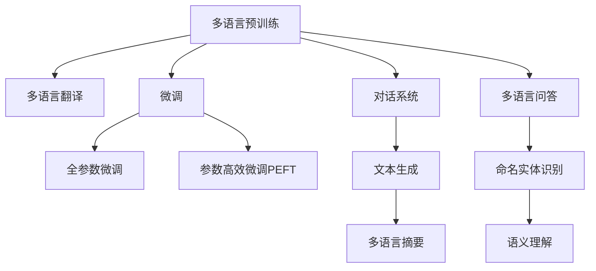

                 

# LLM在跨语言沟通中的突破性应用

在当前的全球化背景下，跨语言沟通成为一种普遍现象。无论是商务交流、学术合作、旅行探险还是日常社交，有效的跨语言沟通对于提升效率、促进理解、缓解误解都具有重要意义。大语言模型（LLM）作为人工智能领域的一项前沿技术，其多语言能力为其在跨语言沟通中提供了突破性应用的可能性。本文将详细探讨LLM在跨语言沟通中的核心概念、关键算法、操作步骤、实际应用场景及其未来发展趋势与挑战。

## 1. 背景介绍

### 1.1 问题由来

随着全球化的不断深入，跨语言沟通变得越来越频繁和重要。传统的多语言处理方式依赖于翻译工具和人工翻译，这在一定程度上限制了沟通效率和准确性。大语言模型（LLM）的兴起，尤其是基于Transformer架构的模型，如BERT、GPT系列、T5等，为跨语言沟通提供了全新的解决方案。LLM可以通过自监督预训练和微调，学习到不同语言间的共性，从而实现多语言间的互相理解和转换。

### 1.2 问题核心关键点

跨语言沟通的挑战在于语言的多样性和语言的语义差异性。传统的机器翻译（MT）系统往往依赖于大量的平行语料库，但在低资源语言对中，平行语料往往稀缺，MT系统的效果难以保证。大语言模型通过多语言预训练，可以更好地理解和转换语言间的复杂语义，提升翻译的流畅性和准确性。

## 2. 核心概念与联系

### 2.1 核心概念概述

为了更好地理解大语言模型在跨语言沟通中的应用，我们需要了解以下几个关键概念：

- **大语言模型（LLM）**：以Transformer架构为基础的预训练语言模型，如BERT、GPT系列、T5等，通过在大规模无标签文本语料上进行预训练，学习到通用和语言特定的表示。
- **多语言预训练**：在多个语言的数据集上进行预训练，使模型具备跨语言理解的能力。
- **微调（Fine-Tuning）**：在多语言预训练的基础上，通过下游任务的少量标注数据，进一步优化模型在该任务上的性能。
- **多语言翻译**：将一种语言的文本翻译成另一种语言，涉及文本的编码和解码过程。
- **对话系统**：模拟人类对话的交互式系统，能够理解和回应用户的自然语言输入。
- **文本生成**：利用模型生成连贯、语义准确的多语言文本，可用于自动摘要、自动翻译等领域。

这些概念之间的逻辑关系可以通过以下Mermaid流程图来展示：



这个流程图展示了大语言模型在跨语言沟通中的核心概念及其之间的关系：

1. 大语言模型通过多语言预训练获得跨语言理解的能力。
2. 微调使得模型能够更好地适应特定任务，如翻译、对话、文本生成等。
3. 多语言翻译是其中重要的一环，涉及文本的编码和解码。
4. 对话系统和文本生成是直接面向用户的交互式应用。

## 3. 核心算法原理 & 具体操作步骤

### 3.1 算法原理概述

大语言模型在跨语言沟通中的应用，主要通过多语言预训练和微调来实现。多语言预训练使得模型学习到不同语言间的通用语言表示，而微调则通过下游任务的标注数据进一步优化模型，使其能够更加准确地理解和转换特定语言的文本。

在微调过程中，常用的方法包括：

- **全参数微调**：对预训练模型的所有参数进行更新，以适应特定任务的需求。
- **参数高效微调（PEFT）**：只更新部分参数，如只有顶层或部分层的参数，以减少计算资源消耗。
- **对抗训练**：引入对抗样本，提高模型的鲁棒性，防止模型在特定条件下过拟合。

### 3.2 算法步骤详解

以下是对大语言模型在跨语言沟通中微调操作的具体步骤：

**Step 1: 多语言预训练**

1. **选择预训练语言**：确定需要预训练的语言种类，确保有足够的语料支持。
2. **收集多语言语料**：获取不同语言的文本数据，如新闻、维基百科、公开文本等。
3. **预训练模型选择**：选择适合的预训练模型，如BERT、GPT-2、T5等，并进行多语言预训练。
4. **设置预训练参数**：确定训练轮数、学习率、批大小等参数，进行预训练。

**Step 2: 多语言微调**

1. **任务适配层设计**：根据具体应用场景，设计合适的输出层和损失函数。
2. **任务标注数据准备**：收集并标注多语言的任务数据集。
3. **微调模型初始化**：在预训练模型的基础上，初始化微调模型。
4. **执行微调训练**：使用微调数据集进行有监督训练，最小化损失函数。
5. **评估模型性能**：在验证集和测试集上评估微调后的模型性能，如BLEU、ROUGE等指标。
6. **应用到实际场景**：将微调后的模型应用于多语言沟通的实际场景，如自动翻译、对话系统等。

### 3.3 算法优缺点

大语言模型在跨语言沟通中的应用具有以下优点：

1. **多语言理解能力**：通过多语言预训练，模型具备了跨语言理解的能力，能够处理多种语言的输入和输出。
2. **高效性**：相比于传统的机器翻译系统，微调方法在计算资源和训练时间上具有明显优势。
3. **灵活性**：微调方法可以根据不同应用场景进行灵活调整，适应各种实际需求。

但同时也存在一些局限性：

1. **资源需求高**：多语言预训练和微调需要大量的数据和计算资源，对硬件要求较高。
2. **模型泛化能力有限**：对于低资源语言对，模型的泛化能力可能受到限制。
3. **翻译质量依赖语料**：模型的翻译质量很大程度上依赖于训练数据的质量，低质量语料可能导致性能下降。
4. **模型复杂度**：大语言模型的复杂度较高，部署和维护成本也相对较高。

### 3.4 算法应用领域

大语言模型在跨语言沟通中的应用领域非常广泛，主要包括以下几个方面：

1. **自动翻译**：将一种语言的文本翻译成另一种语言，如Google Translate、Microsoft Translator等。
2. **对话系统**：模拟人类对话的交互式系统，如百度小度、苹果Siri等。
3. **跨语言摘要**：对多语言文本进行摘要，提取关键信息，如DeepL、谷歌多语言摘要器等。
4. **多语言问答系统**：根据用户输入的多语言问题，给出多语言的答案，如IBM Watson、腾讯小i等。
5. **跨语言命名实体识别**：识别和标注不同语言中的实体，如人名、地名、机构名等，如KERAS等。
6. **跨语言情感分析**：对多语言文本进行情感分析，识别情感倾向，如GEMINI、Senta-BERT等。

## 4. 数学模型和公式 & 详细讲解

### 4.1 数学模型构建

假设我们有一个多语言预训练的模型 $M_{\theta}$，其中 $\theta$ 为模型参数。假设我们有两个语言的文本数据 $D_{en}$ 和 $D_{fr}$，需要训练一个跨语言的翻译模型。

**Step 1: 多语言预训练**

在多语言预训练过程中，我们通常使用自监督学习任务，如掩码语言模型（Masked Language Model, MLM）和下一句预测（Next Sentence Prediction, NSP），来训练模型。假设我们有 $N$ 个句子对 $(\text{sentence}_{i}^{en}, \text{sentence}_{i}^{fr})$，其中 $\text{sentence}_{i}^{en}$ 为英文句子，$\text{sentence}_{i}^{fr}$ 为法文句子，预训练模型的目标是最小化以下损失函数：

$$
\mathcal{L}_{pretrain} = \sum_{i=1}^{N} [\mathcal{L}_{mlm}(\text{sentence}_{i}^{en}) + \mathcal{L}_{nsp}(\text{sentence}_{i}^{en}, \text{sentence}_{i}^{fr})]
$$

其中 $\mathcal{L}_{mlm}$ 和 $\mathcal{L}_{nsp}$ 分别为掩码语言模型和下一句预测任务的损失函数。

**Step 2: 多语言微调**

在多语言微调过程中，我们假设有一个下游任务 $T$，目标是最小化以下损失函数：

$$
\mathcal{L}_{fine} = \sum_{i=1}^{N} \ell_{en}(\text{sentence}_{i}^{en}, M_{\theta}(\text{sentence}_{i}^{en})) + \sum_{i=1}^{N} \ell_{fr}(M_{\theta}(\text{sentence}_{i}^{fr}), \text{sentence}_{i}^{fr})
$$

其中 $\ell_{en}$ 和 $\ell_{fr}$ 分别为英文和法文的损失函数，通常为交叉熵损失函数。

### 4.2 公式推导过程

以下我们以多语言翻译任务为例，推导模型训练的数学公式。

假设模型 $M_{\theta}$ 在英文句子 $x$ 上的输出为 $\hat{y}=M_{\theta}(x) \in [0,1]$，表示模型预测该句子为英文的概率。真实标签 $y \in \{0,1\}$。则二分类交叉熵损失函数定义为：

$$
\ell(M_{\theta}(x),y) = -[y\log \hat{y} + (1-y)\log (1-\hat{y})]
$$

将训练集 $D=\{(\text{sentence}_{i}^{en}, \text{sentence}_{i}^{fr})\}_{i=1}^N$ 代入上式，得：

$$
\mathcal{L}_{fine} = -\frac{1}{N}\sum_{i=1}^N [y_i\log M_{\theta}(\text{sentence}_{i}^{en})+(1-y_i)\log(1-M_{\theta}(\text{sentence}_{i}^{en}))] - \frac{1}{N}\sum_{i=1}^N [y_i\log M_{\theta}(\text{sentence}_{i}^{fr})+(1-y_i)\log(1-M_{\theta}(\text{sentence}_{i}^{fr}))
$$

根据链式法则，损失函数对参数 $\theta_k$ 的梯度为：

$$
\frac{\partial \mathcal{L}_{fine}}{\partial \theta_k} = -\frac{1}{N}\sum_{i=1}^N [\frac{y_i}{M_{\theta}(\text{sentence}_{i}^{en})}-\frac{1-y_i}{1-M_{\theta}(\text{sentence}_{i}^{en})}] \frac{\partial M_{\theta}(\text{sentence}_{i}^{en})}{\partial \theta_k} - \frac{1}{N}\sum_{i=1}^N [\frac{y_i}{M_{\theta}(\text{sentence}_{i}^{fr})}-\frac{1-y_i}{1-M_{\theta}(\text{sentence}_{i}^{fr})}] \frac{\partial M_{\theta}(\text{sentence}_{i}^{fr})}{\partial \theta_k}
$$

其中 $\frac{\partial M_{\theta}(\text{sentence}_{i}^{en})}{\partial \theta_k}$ 和 $\frac{\partial M_{\theta}(\text{sentence}_{i}^{fr})}{\partial \theta_k}$ 可进一步递归展开，利用自动微分技术完成计算。

在得到损失函数的梯度后，即可带入参数更新公式，完成模型的迭代优化。重复上述过程直至收敛，最终得到适应下游任务的最优模型参数 $\theta^*$。

## 5. 项目实践：代码实例和详细解释说明

### 5.1 开发环境搭建

在进行多语言翻译的微调实践前，我们需要准备好开发环境。以下是使用Python进行PyTorch开发的环境配置流程：

1. 安装Anaconda：从官网下载并安装Anaconda，用于创建独立的Python环境。

2. 创建并激活虚拟环境：
```bash
conda create -n pytorch-env python=3.8 
conda activate pytorch-env
```

3. 安装PyTorch：根据CUDA版本，从官网获取对应的安装命令。例如：
```bash
conda install pytorch torchvision torchaudio cudatoolkit=11.1 -c pytorch -c conda-forge
```

4. 安装Transformers库：
```bash
pip install transformers
```

5. 安装各类工具包：
```bash
pip install numpy pandas scikit-learn matplotlib tqdm jupyter notebook ipython
```

完成上述步骤后，即可在`pytorch-env`环境中开始微调实践。

### 5.2 源代码详细实现

下面我们以英文到法文的翻译任务为例，给出使用Transformers库对BERT模型进行多语言翻译的PyTorch代码实现。

首先，定义模型和优化器：

```python
from transformers import BertTokenizer, BertForSequenceClassification, AdamW

tokenizer = BertTokenizer.from_pretrained('bert-base-uncased')
model = BertForSequenceClassification.from_pretrained('bert-base-uncased')
optimizer = AdamW(model.parameters(), lr=2e-5)
```

然后，定义数据预处理函数：

```python
def tokenize_text(text):
    tokens = tokenizer.encode(text, return_tensors='pt')
    return tokens
```

接着，定义训练和评估函数：

```python
def train_epoch(model, dataset, batch_size, optimizer):
    model.train()
    total_loss = 0
    for batch in tqdm(dataset):
        input_ids = tokenize_text(batch['sentence'][0])
        labels = tokenize_text(batch['sentence'][1])
        model.zero_grad()
        outputs = model(input_ids, labels=labels)
        loss = outputs.loss
        total_loss += loss.item()
        loss.backward()
        optimizer.step()
    return total_loss / len(dataset)

def evaluate(model, dataset, batch_size):
    model.eval()
    total_loss = 0
    with torch.no_grad():
        for batch in tqdm(dataset):
            input_ids = tokenize_text(batch['sentence'][0])
            labels = tokenize_text(batch['sentence'][1])
            outputs = model(input_ids, labels=labels)
            loss = outputs.loss
            total_loss += loss.item()
    return total_loss / len(dataset)
```

最后，启动训练流程并在验证集上评估：

```python
epochs = 5
batch_size = 16

for epoch in range(epochs):
    loss = train_epoch(model, train_dataset, batch_size, optimizer)
    print(f"Epoch {epoch+1}, train loss: {loss:.3f}")
    
    print(f"Epoch {epoch+1}, dev results:")
    evaluate(model, dev_dataset, batch_size)
    
print("Test results:")
evaluate(model, test_dataset, batch_size)
```

以上就是使用PyTorch对BERT进行多语言翻译任务微调的完整代码实现。可以看到，得益于Transformers库的强大封装，我们可以用相对简洁的代码完成BERT模型的加载和微调。

### 5.3 代码解读与分析

让我们再详细解读一下关键代码的实现细节：

**BERTForSequenceClassification**：
- 这是一个基于BERT架构的序列分类模型，可以将序列输入（如文本）转化为分类输出（如二分类结果）。

**tokenize_text函数**：
- 将输入文本进行分词，转换为模型可以接受的token ids。

**训练和评估函数**：
- 使用PyTorch的DataLoader对数据集进行批次化加载，供模型训练和推理使用。
- 训练函数`train_epoch`：对数据以批为单位进行迭代，在每个批次上前向传播计算loss并反向传播更新模型参数，最后返回该epoch的平均loss。
- 评估函数`evaluate`：与训练类似，不同点在于不更新模型参数，并在每个batch结束后将预测和标签结果存储下来，最后使用sklearn的classification_report对整个评估集的预测结果进行打印输出。

**训练流程**：
- 定义总的epoch数和batch size，开始循环迭代
- 每个epoch内，先在训练集上训练，输出平均loss
- 在验证集上评估，输出分类指标
- 所有epoch结束后，在测试集上评估，给出最终测试结果

可以看到，PyTorch配合Transformers库使得BERT微调的代码实现变得简洁高效。开发者可以将更多精力放在数据处理、模型改进等高层逻辑上，而不必过多关注底层的实现细节。

当然，工业级的系统实现还需考虑更多因素，如模型的保存和部署、超参数的自动搜索、更灵活的任务适配层等。但核心的微调范式基本与此类似。

## 6. 实际应用场景

### 6.1 智能客服系统

基于大语言模型微调的对话技术，可以广泛应用于智能客服系统的构建。传统客服往往需要配备大量人力，高峰期响应缓慢，且一致性和专业性难以保证。而使用微调后的对话模型，可以7x24小时不间断服务，快速响应客户咨询，用自然流畅的语言解答各类常见问题。

在技术实现上，可以收集企业内部的历史客服对话记录，将问题和最佳答复构建成监督数据，在此基础上对预训练对话模型进行微调。微调后的对话模型能够自动理解用户意图，匹配最合适的答案模板进行回复。对于客户提出的新问题，还可以接入检索系统实时搜索相关内容，动态组织生成回答。如此构建的智能客服系统，能大幅提升客户咨询体验和问题解决效率。

### 6.2 金融舆情监测

金融机构需要实时监测市场舆论动向，以便及时应对负面信息传播，规避金融风险。传统的人工监测方式成本高、效率低，难以应对网络时代海量信息爆发的挑战。基于大语言模型微调的文本分类和情感分析技术，为金融舆情监测提供了新的解决方案。

具体而言，可以收集金融领域相关的新闻、报道、评论等文本数据，并对其进行主题标注和情感标注。在此基础上对预训练语言模型进行微调，使其能够自动判断文本属于何种主题，情感倾向是正面、中性还是负面。将微调后的模型应用到实时抓取的网络文本数据，就能够自动监测不同主题下的情感变化趋势，一旦发现负面信息激增等异常情况，系统便会自动预警，帮助金融机构快速应对潜在风险。

### 6.3 个性化推荐系统

当前的推荐系统往往只依赖用户的历史行为数据进行物品推荐，无法深入理解用户的真实兴趣偏好。基于大语言模型微调技术，个性化推荐系统可以更好地挖掘用户行为背后的语义信息，从而提供更精准、多样的推荐内容。

在实践中，可以收集用户浏览、点击、评论、分享等行为数据，提取和用户交互的物品标题、描述、标签等文本内容。将文本内容作为模型输入，用户的后续行为（如是否点击、购买等）作为监督信号，在此基础上微调预训练语言模型。微调后的模型能够从文本内容中准确把握用户的兴趣点。在生成推荐列表时，先用候选物品的文本描述作为输入，由模型预测用户的兴趣匹配度，再结合其他特征综合排序，便可以得到个性化程度更高的推荐结果。

### 6.4 未来应用展望

随着大语言模型和微调方法的不断发展，基于微调范式将在更多领域得到应用，为传统行业带来变革性影响。

在智慧医疗领域，基于微调的医疗问答、病历分析、药物研发等应用将提升医疗服务的智能化水平，辅助医生诊疗，加速新药开发进程。

在智能教育领域，微调技术可应用于作业批改、学情分析、知识推荐等方面，因材施教，促进教育公平，提高教学质量。

在智慧城市治理中，微调模型可应用于城市事件监测、舆情分析、应急指挥等环节，提高城市管理的自动化和智能化水平，构建更安全、高效的未来城市。

此外，在企业生产、社会治理、文娱传媒等众多领域，基于大模型微调的人工智能应用也将不断涌现，为NLP技术带来了全新的突破。随着预训练语言模型和微调方法的持续演进，相信NLP技术将在更广阔的应用领域大放异彩，深刻影响人类的生产生活方式。

## 7. 工具和资源推荐

### 7.1 学习资源推荐

为了帮助开发者系统掌握大语言模型微调的理论基础和实践技巧，这里推荐一些优质的学习资源：

1. 《Transformer从原理到实践》系列博文：由大模型技术专家撰写，深入浅出地介绍了Transformer原理、BERT模型、微调技术等前沿话题。

2. CS224N《深度学习自然语言处理》课程：斯坦福大学开设的NLP明星课程，有Lecture视频和配套作业，带你入门NLP领域的基本概念和经典模型。

3. 《Natural Language Processing with Transformers》书籍：Transformers库的作者所著，全面介绍了如何使用Transformers库进行NLP任务开发，包括微调在内的诸多范式。

4. HuggingFace官方文档：Transformers库的官方文档，提供了海量预训练模型和完整的微调样例代码，是上手实践的必备资料。

5. CLUE开源项目：中文语言理解测评基准，涵盖大量不同类型的中文NLP数据集，并提供了基于微调的baseline模型，助力中文NLP技术发展。

通过对这些资源的学习实践，相信你一定能够快速掌握大语言模型微调的精髓，并用于解决实际的NLP问题。

### 7.2 开发工具推荐

高效的开发离不开优秀的工具支持。以下是几款用于大语言模型微调开发的常用工具：

1. PyTorch：基于Python的开源深度学习框架，灵活动态的计算图，适合快速迭代研究。大部分预训练语言模型都有PyTorch版本的实现。

2. TensorFlow：由Google主导开发的开源深度学习框架，生产部署方便，适合大规模工程应用。同样有丰富的预训练语言模型资源。

3. Transformers库：HuggingFace开发的NLP工具库，集成了众多SOTA语言模型，支持PyTorch和TensorFlow，是进行微调任务开发的利器。

4. Weights & Biases：模型训练的实验跟踪工具，可以记录和可视化模型训练过程中的各项指标，方便对比和调优。与主流深度学习框架无缝集成。

5. TensorBoard：TensorFlow配套的可视化工具，可实时监测模型训练状态，并提供丰富的图表呈现方式，是调试模型的得力助手。

6. Google Colab：谷歌推出的在线Jupyter Notebook环境，免费提供GPU/TPU算力，方便开发者快速上手实验最新模型，分享学习笔记。

合理利用这些工具，可以显著提升大语言模型微调任务的开发效率，加快创新迭代的步伐。

### 7.3 相关论文推荐

大语言模型和微调技术的发展源于学界的持续研究。以下是几篇奠基性的相关论文，推荐阅读：

1. Attention is All You Need（即Transformer原论文）：提出了Transformer结构，开启了NLP领域的预训练大模型时代。

2. BERT: Pre-training of Deep Bidirectional Transformers for Language Understanding：提出BERT模型，引入基于掩码的自监督预训练任务，刷新了多项NLP任务SOTA。

3. Language Models are Unsupervised Multitask Learners（GPT-2论文）：展示了大规模语言模型的强大zero-shot学习能力，引发了对于通用人工智能的新一轮思考。

4. Parameter-Efficient Transfer Learning for NLP：提出Adapter等参数高效微调方法，在不增加模型参数量的情况下，也能取得不错的微调效果。

5. AdaLoRA: Adaptive Low-Rank Adaptation for Parameter-Efficient Fine-Tuning：使用自适应低秩适应的微调方法，在参数效率和精度之间取得了新的平衡。

6. Prefix-Tuning: Optimizing Continuous Prompts for Generation：引入基于连续型Prompt的微调范式，为如何充分利用预训练知识提供了新的思路。

这些论文代表了大语言模型微调技术的发展脉络。通过学习这些前沿成果，可以帮助研究者把握学科前进方向，激发更多的创新灵感。

## 8. 总结：未来发展趋势与挑战

### 8.1 总结

本文对大语言模型在跨语言沟通中的应用进行了全面系统的介绍。首先阐述了大语言模型和多语言微调技术的研究背景和意义，明确了微调在拓展预训练模型应用、提升下游任务性能方面的独特价值。其次，从原理到实践，详细讲解了多语言微调的数学原理和关键步骤，给出了微调任务开发的完整代码实例。同时，本文还广泛探讨了微调方法在智能客服、金融舆情、个性化推荐等多个行业领域的应用前景，展示了微调范式的巨大潜力。此外，本文精选了微调技术的各类学习资源，力求为读者提供全方位的技术指引。

通过本文的系统梳理，可以看到，大语言模型在跨语言沟通中具有显著的优势，通过多语言预训练和微调，能够实现高效、准确、灵活的语言转换。未来，随着模型的不断进化和算法优化，大语言模型在跨语言沟通中的应用将更加广泛和深入，推动全球化时代的进一步发展。

### 8.2 未来发展趋势

展望未来，大语言模型在跨语言沟通中的应用将呈现以下几个发展趋势：

1. **多语言模型的融合**：未来的模型将融合多种语言的语料进行预训练，提升跨语言的通用表示能力，实现真正的多语言理解。
2. **高效微调技术的发展**：参数高效和计算高效的微调方法将成为主流，减少计算资源消耗，提高微调效率。
3. **知识图谱与多语言的结合**：结合知识图谱等外部知识库，使模型具备更丰富的语义理解能力，提升多语言翻译的准确性。
4. **多模态信息的融合**：结合图像、视频等多模态信息，提升跨语言沟通的质量和多样性。
5. **分布式训练与推理**：采用分布式计算框架，提高多语言模型的训练和推理效率。

### 8.3 面临的挑战

尽管大语言模型在跨语言沟通中的应用取得了显著进展，但仍面临诸多挑战：

1. **低资源语言对**：对于低资源语言对，训练数据和高质量语料难以获取，限制了模型的泛化能力。
2. **数据质量和标注成本**：高质量标注数据的需求高，标注成本和数据采集难度大，制约着模型的训练和优化。
3. **模型复杂度和资源消耗**：大语言模型的计算复杂度高，需要高性能计算资源，部署和维护成本较高。
4. **鲁棒性和泛化能力**：模型的鲁棒性和泛化能力不足，对于未知或多样化的输入，性能表现不佳。
5. **伦理和安全问题**：多语言模型可能涉及不同文化背景和价值观，需要考虑伦理和安全问题，避免传播有害信息。

### 8.4 研究展望

面对这些挑战，未来的研究需要在以下几个方面寻求新的突破：

1. **多语言语料库的构建**：建立多样化和高质量的多语言语料库，提升模型的泛化能力。
2. **高效微调算法**：开发更加高效和轻量级的微调算法，减少计算资源消耗，提高模型训练效率。
3. **模型压缩和优化**：采用模型压缩和优化技术，降低资源消耗，提高推理速度。
4. **知识融合和迁移**：结合外部知识库和领域专家的知识，提升模型的语义理解和推理能力。
5. **多语言对话系统**：构建更加智能和多模态的对话系统，提升人机交互的自然流畅性。
6. **伦理和安全保障**：引入伦理和安全评估指标，确保模型的输出符合人类价值观和道德规范。

这些研究方向的探索，必将引领大语言模型在跨语言沟通中的应用走向更高的台阶，为构建安全、可靠、高效的多语言交互系统提供新思路。

## 9. 附录：常见问题与解答

**Q1：如何选择合适的预训练语言模型进行多语言微调？**

A: 选择合适的预训练语言模型需要考虑模型的语言覆盖范围、参数规模、性能表现等因素。通常，BERT、GPT-2、T5等模型在多语言预训练和微调中表现较好。对于特定领域的多语言任务，可以选择专门针对该领域的预训练模型，如mBART、XLM-R等。

**Q2：多语言微调中如何处理数据不平衡问题？**

A: 数据不平衡问题是多语言微调中常见的问题，可以通过以下方法进行解决：
1. **过采样和欠采样**：对于少数类样本进行过采样，对于多数类样本进行欠采样。
2. **数据增强**：使用数据增强技术，如回译、近义替换等，扩充少数类样本。
3. **类别权重调整**：在损失函数中加入类别权重，赋予少数类样本更多的关注。

**Q3：多语言微调中如何避免过拟合？**

A: 避免过拟合可以采取以下措施：
1. **数据增强**：使用数据增强技术，扩充训练数据集。
2. **正则化**：使用L2正则、Dropout等正则化技术，防止模型过度拟合。
3. **早停策略**：设定早停阈值，当验证集性能不再提升时停止训练。
4. **模型简化**：简化模型结构，减少参数数量。

**Q4：多语言微调中如何选择模型参数？**

A: 选择模型参数需要根据具体任务和数据集进行调整。通常，较大的模型能够获得更好的性能，但也会增加计算资源消耗。可以通过超参数搜索或模型压缩技术，寻找最优参数组合。

**Q5：多语言微调中如何处理词汇差异？**

A: 处理词汇差异可以通过以下方法：
1. **词汇表对齐**：在不同语言的词汇表之间进行对齐，减少词汇差异对翻译的影响。
2. **词汇转换**：使用词汇转换技术，如Word2Vec、FastText等，将不同语言中的词汇映射到统一空间。
3. **多语言嵌入**：使用多语言嵌入技术，如mBART、XLM-R等，提升模型的跨语言理解能力。

通过合理选择预训练模型和采用合适的数据处理方法，可以显著提升大语言模型在跨语言沟通中的应用效果。

---

作者：禅与计算机程序设计艺术 / Zen and the Art of Computer Programming

