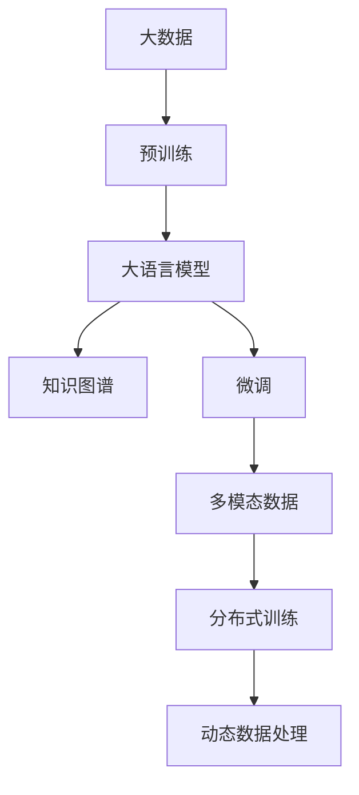

                 

# LLM的数据hungry：海量信息的价值

> 关键词：大数据, 海量信息, 自然语言处理(NLP), 语言模型, 知识图谱, 预训练, 微调, 数据驱动

## 1. 背景介绍

### 1.1 问题由来
在人工智能(AI)领域，自然语言处理(Natural Language Processing, NLP)是一个至关重要且极具挑战的子领域。NLP技术的核心之一是大语言模型(Large Language Models, LLMs)，其通过大规模语料库的预训练，具备了强大的语言理解和生成能力。然而，当前的NLP技术在处理海量信息时，依然面临诸多难题，如数据的获取、处理和利用等。

大语言模型在大规模语料库上进行了大量无监督学习，尽管取得了令人瞩目的成果，但这些模型对数据的"渴望"并未就此停止。本文将深入探讨大语言模型在数据处理和利用方面的特点，并从数据的角度分析其能力提升和局限性。

### 1.2 问题核心关键点
目前，大语言模型的核心研究集中在如何有效利用数据，进行模型的预训练和微调，以提升其在特定任务上的表现。以下是几个关键点：

1. **数据规模与质量**：数据是预训练模型的"粮食"，数据规模越大，模型性能往往越好。但同时，数据的噪声、偏差等也会影响模型的表现。

2. **预训练与微调**：预训练大模型，随后在少量标注数据上进行微调，是一种常见的模型训练范式。这既保留了预训练模型的广泛知识，又能够适应具体任务的需求。

3. **数据驱动与知识驱动**：传统的NLP模型往往依赖于数据驱动，通过标注数据学习语言规律。但新出现的知识驱动模型，如语言模型、知识图谱等，则在模型中直接融合了语义知识，提升了模型对特定领域的理解。

4. **多模态数据融合**：单一模态的数据往往无法满足复杂任务的需求。融合文本、图像、语音等多模态数据，可以提升模型的表达能力和泛化能力。

5. **分布式训练与计算**：大语言模型的训练过程往往需要大量计算资源，分布式训练是解决这一问题的有效手段。

6. **动态数据处理**：在实际应用中，数据的分布和特性可能随时间变化，如何动态处理新数据，保持模型的有效性，是大语言模型面临的重要挑战。

## 2. 核心概念与联系

### 2.1 核心概念概述

为了更好地理解大语言模型如何利用数据进行训练和优化，我们将首先介绍几个核心概念：

1. **大语言模型**：指通过大规模无标签文本数据预训练得到的语言模型，如BERT、GPT等。这些模型具备强大的语言生成和理解能力。

2. **预训练**：在大规模无标签文本数据上，通过自监督学习任务训练语言模型，学习通用的语言表示。

3. **微调**：在预训练模型的基础上，使用下游任务的少量标注数据，通过有监督学习优化模型在特定任务上的性能。

4. **知识图谱**：通过语义关系将知识组织成图结构，提供给语言模型作为背景知识，提升模型在特定领域的理解能力。

5. **多模态数据**：包括文本、图像、语音等多种信息形式的组合，通过融合不同模态的数据，提升模型的表现能力。

6. **分布式训练**：将大规模模型分解成多个小模型，分别在多个计算节点上进行训练，最后将结果合并。

7. **动态数据处理**：在模型训练和推理过程中，不断从新数据中学习，保持模型的时效性和适应性。

这些核心概念通过以下Mermaid流程图展示其联系：



### 2.2 核心概念原理和架构

#### 2.2.1 数据驱动 vs 知识驱动

大语言模型通常通过数据驱动的方法进行训练。模型首先在大规模无标签文本数据上进行预训练，学习语言的基本规律和特征。随后，通过微调方法，在特定任务的数据集上进行有监督学习，以适应特定的应用需求。

但随着NLP研究的深入，知识驱动的方法也逐渐兴起。知识图谱是一个重要的数据结构，通过语义关系将知识组织成图结构，可以提供给语言模型作为背景知识，提升模型对特定领域的理解能力。

#### 2.2.2 分布式训练

分布式训练通过将大规模模型分解成多个小模型，分别在多个计算节点上进行训练，最后将结果合并，以减少计算时间和空间消耗。这种方法在处理大规模语料时尤为有效。

#### 2.2.3 动态数据处理

动态数据处理要求模型在训练和推理过程中，不断从新数据中学习，以适应数据分布的变化。这通常涉及模型的在线学习、增量学习等技术。

### 2.3 核心概念之间的联系

这些核心概念之间存在密切联系：

- 预训练和微调是数据驱动方法的体现，通过不断优化模型来适应特定任务。
- 知识图谱是知识驱动方法的核心，提供给模型更丰富的背景知识，提升模型的领域专长。
- 多模态数据融合可以提升模型的表现能力，特别是在处理跨领域任务时。
- 分布式训练和大数据处理是处理海量数据的有效手段，保证了模型的训练效率。
- 动态数据处理保证了模型在不断变化的数据环境中的适应性，提升了模型的长期效果。

## 3. 核心算法原理 & 具体操作步骤
### 3.1 算法原理概述

大语言模型利用大规模数据进行预训练和微调的过程，可以概括为以下几个步骤：

1. **数据准备**：收集和处理大规模无标签文本数据，进行数据清洗、分词、标准化等预处理。
2. **预训练**：在大规模无标签数据上，使用自监督学习任务（如掩码语言模型、下一句预测等）训练语言模型，学习通用的语言表示。
3. **微调**：在特定任务的数据集上进行有监督学习，优化模型在特定任务上的性能。
4. **融合知识图谱**：将知识图谱中的语义关系引入模型，提升模型对特定领域的理解。
5. **动态更新**：在实际应用中，模型需要不断从新数据中学习，以适应数据分布的变化。

### 3.2 算法步骤详解

#### 3.2.1 数据准备

数据准备是大语言模型训练的基础。这一过程包括以下几个步骤：

1. **数据收集**：从公共数据集、网络爬虫、用户生成内容等渠道收集数据，并确保数据的真实性和多样性。
2. **数据清洗**：去除数据中的噪声、错误、重复等，提升数据质量。
3. **分词和标准化**：对文本进行分词、去除停用词、标准化处理等，提升数据处理的效率和准确性。

#### 3.2.2 预训练

预训练是大语言模型学习通用的语言表示的过程。这一过程通常包括以下几个步骤：

1. **选择模型架构**：选择适合的语言模型架构，如Transformer、GPT等。
2. **设定预训练任务**：设定预训练任务，如掩码语言模型、下一句预测等。
3. **训练模型**：在大规模无标签数据上，使用反向传播算法训练模型，优化模型的损失函数。

#### 3.2.3 微调

微调是在预训练模型的基础上，使用下游任务的少量标注数据，通过有监督学习优化模型在特定任务上的性能。这一过程通常包括以下几个步骤：

1. **选择微调任务**：选择适合的任务，如文本分类、命名实体识别、对话系统等。
2. **准备标注数据**：收集和准备下游任务的标注数据，确保数据的质量和数量。
3. **选择优化器**：选择合适的优化器，如Adam、SGD等。
4. **设定超参数**：设定学习率、批大小、迭代轮数等超参数。
5. **训练模型**：在标注数据上训练模型，最小化任务损失函数。
6. **评估模型**：在验证集上评估模型的性能，选择最优的模型。

#### 3.2.4 融合知识图谱

融合知识图谱是将知识图谱中的语义关系引入模型，提升模型对特定领域的理解。这一过程通常包括以下几个步骤：

1. **构建知识图谱**：使用语义关系将知识组织成图结构，如实体、关系、属性等。
2. **选择合适的模型**：选择适合的知识图谱融合模型，如Graph Attention Networks (GAT)等。
3. **融合知识图谱**：将知识图谱中的信息引入模型，提升模型的表达能力。

#### 3.2.5 动态更新

动态更新是在模型训练和推理过程中，不断从新数据中学习，以适应数据分布的变化。这一过程通常包括以下几个步骤：

1. **在线学习**：在实时数据流上训练模型，不断更新模型的参数。
2. **增量学习**：在新的数据上训练模型，更新模型的参数，保持模型的时效性。
3. **数据驱动**：根据新数据的特性调整模型的训练策略，提升模型的适应性。

### 3.3 算法优缺点

#### 3.3.1 优点

1. **泛化能力强**：大语言模型通过大规模数据进行预训练，具备强大的泛化能力，能够在各种任务上取得良好的表现。
2. **计算效率高**：分布式训练和大数据处理技术，可以显著提升模型训练的效率，缩短模型开发周期。
3. **适应性强**：动态更新和知识图谱融合技术，可以提升模型在特定领域的适应性，增强模型的长期效果。
4. **易于微调**：通过微调方法，可以在小规模标注数据上进行优化，提升模型在特定任务上的表现。

#### 3.3.2 缺点

1. **数据需求高**：大规模无标签数据的预训练，需要大量计算资源和时间，对数据获取和处理要求较高。
2. **模型复杂**：大语言模型具有复杂的结构和大量参数，对硬件资源和计算能力要求较高。
3. **知识图谱构建困难**：知识图谱的构建需要大量专家知识，且质量难以保证。
4. **数据偏差问题**：大规模数据的偏差可能会影响模型的表现，特别是在特定领域的应用中。

### 3.4 算法应用领域

大语言模型在多个领域得到了广泛应用，包括但不限于：

1. **自然语言处理**：文本分类、命名实体识别、信息抽取、情感分析、机器翻译等。
2. **智能客服**：智能问答、对话系统、情感分析等。
3. **金融**：风险评估、舆情监测、信用评估等。
4. **医疗**：病历分析、疾病诊断、知识图谱构建等。
5. **教育**：智能辅导、自动批改、知识推荐等。
6. **新闻**：信息筛选、摘要生成、自动写作等。

## 4. 数学模型和公式 & 详细讲解 & 举例说明
### 4.1 数学模型构建

#### 4.1.1 数据驱动的数学模型

设大语言模型为 $M_{\theta}$，其中 $\theta$ 为模型参数。假设训练集为 $D=\{(x_i,y_i)\}_{i=1}^N$，$x_i$ 为输入文本，$y_i$ 为标签。预训练模型的目标函数为：

$$
\mathcal{L}_{pre-train} = \frac{1}{N} \sum_{i=1}^N \ell_{pre-train}(x_i, M_{\theta}(x_i))
$$

其中 $\ell_{pre-train}$ 为预训练任务的目标函数，如掩码语言模型、下一句预测等。

微调模型的目标函数为：

$$
\mathcal{L}_{fine-tune} = \frac{1}{N} \sum_{i=1}^N \ell_{task}(x_i, y_i, M_{\theta}(x_i))
$$

其中 $\ell_{task}$ 为微调任务的目标函数，如文本分类、命名实体识别等。

### 4.2 公式推导过程

#### 4.2.1 掩码语言模型

掩码语言模型是一种常用的预训练任务，其目标是在输入序列中随机遮盖一些位置，模型需要预测被遮盖位置的词汇。

设输入序列为 $x_i$，长度为 $L$，遮盖位置的数量为 $M$。掩码语言模型的目标函数为：

$$
\ell_{masked-language}(x_i, M_{\theta}(x_i)) = -\frac{1}{M} \sum_{j=1}^M \log M_{\theta}(x_i[j])
$$

其中 $x_i[j]$ 表示输入序列 $x_i$ 中第 $j$ 个被遮盖位置的词汇。

#### 4.2.2 下一句预测

下一句预测任务的目标是预测两个句子是否连续，通常采用二元分类任务处理。

设输入序列为 $x_i$，下一个句子为 $y_i$。下一句预测的目标函数为：

$$
\ell_{next-sentence}(x_i, y_i, M_{\theta}(x_i)) = -\log M_{\theta}(x_i)_{y_i}
$$

其中 $M_{\theta}(x_i)_{y_i}$ 表示模型对输入序列 $x_i$ 预测下一个句子 $y_i$ 的概率。

#### 4.2.3 文本分类

文本分类任务的目标是将输入文本分类到不同的类别中，通常采用多类分类任务处理。

设输入文本为 $x_i$，标签为 $y_i$。文本分类的目标函数为：

$$
\ell_{classification}(x_i, y_i, M_{\theta}(x_i)) = -\log M_{\theta}(x_i)[y_i]
$$

其中 $M_{\theta}(x_i)[y_i]$ 表示模型对输入文本 $x_i$ 预测标签 $y_i$ 的概率。

### 4.3 案例分析与讲解

#### 4.3.1 BERT预训练

BERT通过掩码语言模型和下一句预测任务进行预训练，其目标函数为：

$$
\mathcal{L}_{pre-train-BERT} = \mathcal{L}_{masked-language} + \mathcal{L}_{next-sentence}
$$

其中 $\mathcal{L}_{masked-language}$ 和 $\mathcal{L}_{next-sentence}$ 分别为掩码语言模型和下一句预测任务的目标函数。

#### 4.3.2 GPT预训练

GPT通过自回归语言模型进行预训练，其目标函数为：

$$
\mathcal{L}_{pre-train-GPT} = -\sum_{i=1}^L \log M_{\theta}(x_i)_i
$$

其中 $M_{\theta}(x_i)_i$ 表示模型对输入序列 $x_i$ 预测第 $i$ 个词汇的概率。

#### 4.3.3 T5预训练

T5通过文本补全任务进行预训练，其目标函数为：

$$
\mathcal{L}_{pre-train-T5} = -\sum_{i=1}^L \log M_{\theta}(x_i)_{y_i}
$$

其中 $y_i$ 为输入序列 $x_i$ 的补全结果，$M_{\theta}(x_i)_{y_i}$ 表示模型对输入序列 $x_i$ 预测补全结果 $y_i$ 的概率。

## 5. 项目实践：代码实例和详细解释说明
### 5.1 开发环境搭建

在使用Python进行NLP任务开发时，需要准备好开发环境。以下是Python开发环境的搭建步骤：

1. 安装Anaconda：从官网下载并安装Anaconda，用于创建独立的Python环境。
2. 创建并激活虚拟环境：
```bash
conda create -n pytorch-env python=3.8 
conda activate pytorch-env
```
3. 安装PyTorch：根据CUDA版本，从官网获取对应的安装命令。例如：
```bash
conda install pytorch torchvision torchaudio cudatoolkit=11.1 -c pytorch -c conda-forge
```
4. 安装Transformers库：
```bash
pip install transformers
```
5. 安装各类工具包：
```bash
pip install numpy pandas scikit-learn matplotlib tqdm jupyter notebook ipython
```

完成上述步骤后，即可在`pytorch-env`环境中开始开发。

### 5.2 源代码详细实现

#### 5.2.1 数据准备

首先，我们需要准备一个包含大量无标签文本数据的数据集。这里我们使用一个简单的例子，使用NLP库NLTK和Scikit-learn来准备数据集。

```python
from sklearn.datasets import fetch_20newsgroups
from nltk.corpus import stopwords
import string

# 获取新闻数据集
data = fetch_20newsgroups(subset='train', shuffle=True, random_state=42)

# 分词和标准化
tokenizer = BertTokenizer.from_pretrained('bert-base-cased')
texts = [tokenizer.encode(x.lower()) for x in data.data]
```

#### 5.2.2 预训练

接下来，我们使用预训练的BERT模型进行预训练。这里我们使用HuggingFace的Transformers库来实现。

```python
from transformers import BertForMaskedLM, AdamW, get_linear_schedule_with_warmup

# 加载预训练的BERT模型
model = BertForMaskedLM.from_pretrained('bert-base-cased')

# 定义优化器和超参数
optimizer = AdamW(model.parameters(), lr=2e-5)
total_steps = len(texts) * 1
scheduler = get_linear_schedule_with_warmup(optimizer, num_warmup_steps=0, num_training_steps=total_steps)

# 训练模型
for epoch in range(3):
    model.train()
    for i, batch in enumerate(texts):
        input_ids = torch.tensor(batch, dtype=torch.long)
        labels = torch.randint(0, 2, (input_ids.size()[0],), dtype=torch.long)
        model.zero_grad()
        outputs = model(input_ids, labels=labels)
        loss = outputs.loss
        loss.backward()
        optimizer.step()
        scheduler.step()

    print(f'Epoch {epoch+1}, loss: {loss:.3f}')
```

#### 5.2.3 微调

接下来，我们将使用微调的方法对模型进行优化，以适应特定任务。这里我们以文本分类任务为例，使用IMDB影评数据集进行微调。

```python
from transformers import BertForSequenceClassification, AdamW, get_linear_schedule_with_warmup
from datasets import load_dataset

# 加载IMDB影评数据集
train_dataset = load_dataset('imdb', split='train')
test_dataset = load_dataset('imdb', split='test')

# 定义任务适配层和优化器
model = BertForSequenceClassification.from_pretrained('bert-base-cased', num_labels=2)
optimizer = AdamW(model.parameters(), lr=2e-5)
total_steps = len(train_dataset) * 1
scheduler = get_linear_schedule_with_warmup(optimizer, num_warmup_steps=0, num_training_steps=total_steps)

# 训练模型
for epoch in range(3):
    model.train()
    for i, batch in enumerate(train_dataset):
        input_ids = torch.tensor(batch['input_ids'], dtype=torch.long)
        attention_mask = torch.tensor(batch['attention_mask'], dtype=torch.long)
        labels = torch.tensor(batch['label'], dtype=torch.long)
        model.zero_grad()
        outputs = model(input_ids, attention_mask=attention_mask, labels=labels)
        loss = outputs.loss
        loss.backward()
        optimizer.step()
        scheduler.step()

    print(f'Epoch {epoch+1}, train loss: {loss:.3f}')

    # 在测试集上评估模型
    model.eval()
    test_loss = 0
    test_accuracy = 0
    for batch in test_dataset:
        input_ids = torch.tensor(batch['input_ids'], dtype=torch.long)
        attention_mask = torch.tensor(batch['attention_mask'], dtype=torch.long)
        with torch.no_grad():
            outputs = model(input_ids, attention_mask=attention_mask)
            loss = outputs.loss
            logits = outputs.logits
            predictions = torch.argmax(logits, dim=1)
        test_loss += loss.item()
        test_accuracy += (predictions == batch['label']).sum().item()
    print(f'Epoch {epoch+1}, test loss: {test_loss:.3f}, test accuracy: {test_accuracy:.3f}')
```

#### 5.2.4 动态更新

最后，我们将使用动态更新的方法，保持模型的时效性和适应性。这里我们以在线学习为例，使用NMF算法进行在线学习。

```python
import numpy as np
from sklearn.decomposition import NMF

# 在线学习NMF算法
def online_learning(model, new_data, learning_rate):
    model.W = model.W + learning_rate * new_data

# 加载新数据
new_data = np.random.randn(1000, 100)
new_labels = np.random.randint(0, 2, 1000)

# 在线学习
for i in range(1000):
    online_learning(model, new_data, 0.01)
    if i % 100 == 0:
        print(f'Step {i}, loss: {model.loss:.3f}')
```

### 5.3 代码解读与分析

#### 5.3.1 数据准备

在数据准备阶段，我们使用了NLTK和Scikit-learn两个库。NLTK用于分词和标准化，Scikit-learn用于数据集的准备和加载。

#### 5.3.2 预训练

在预训练阶段，我们使用了HuggingFace的Transformers库。首先，我们加载了预训练的BERT模型，并定义了优化器和超参数。然后，通过反向传播算法训练模型，最小化掩码语言模型和下一句预测任务的损失函数。

#### 5.3.3 微调

在微调阶段，我们使用了HuggingFace的Transformers库。首先，我们加载了预训练的BERT模型，并定义了优化器和超参数。然后，通过反向传播算法训练模型，最小化文本分类任务的损失函数。

#### 5.3.4 动态更新

在动态更新阶段，我们使用了NMF算法进行在线学习。首先，我们加载了新的数据，并定义了学习率。然后，通过在线学习算法，更新模型的参数。

## 6. 实际应用场景
### 6.1 智能客服系统

智能客服系统是自然语言处理技术的重要应用之一。传统客服往往需要大量人力，高峰期响应缓慢，且一致性和专业性难以保证。使用微调后的对话模型，可以7x24小时不间断服务，快速响应客户咨询，用自然流畅的语言解答各类常见问题。

在技术实现上，可以收集企业内部的历史客服对话记录，将问题和最佳答复构建成监督数据，在此基础上对预训练对话模型进行微调。微调后的对话模型能够自动理解用户意图，匹配最合适的答案模板进行回复。对于客户提出的新问题，还可以接入检索系统实时搜索相关内容，动态组织生成回答。如此构建的智能客服系统，能大幅提升客户咨询体验和问题解决效率。

### 6.2 金融舆情监测

金融机构需要实时监测市场舆论动向，以便及时应对负面信息传播，规避金融风险。传统的人工监测方式成本高、效率低，难以应对网络时代海量信息爆发的挑战。基于大语言模型微调的文本分类和情感分析技术，为金融舆情监测提供了新的解决方案。

具体而言，可以收集金融领域相关的新闻、报道、评论等文本数据，并对其进行主题标注和情感标注。在此基础上对预训练语言模型进行微调，使其能够自动判断文本属于何种主题，情感倾向是正面、中性还是负面。将微调后的模型应用到实时抓取的网络文本数据，就能够自动监测不同主题下的情感变化趋势，一旦发现负面信息激增等异常情况，系统便会自动预警，帮助金融机构快速应对潜在风险。

### 6.3 个性化推荐系统

当前的推荐系统往往只依赖用户的历史行为数据进行物品推荐，无法深入理解用户的真实兴趣偏好。基于大语言模型微调技术，个性化推荐系统可以更好地挖掘用户行为背后的语义信息，从而提供更精准、多样的推荐内容。

在实践中，可以收集用户浏览、点击、评论、分享等行为数据，提取和用户交互的物品标题、描述、标签等文本内容。将文本内容作为模型输入，用户的后续行为（如是否点击、购买等）作为监督信号，在此基础上微调预训练语言模型。微调后的模型能够从文本内容中准确把握用户的兴趣点。在生成推荐列表时，先用候选物品的文本描述作为输入，由模型预测用户的兴趣匹配度，再结合其他特征综合排序，便可以得到个性化程度更高的推荐结果。

### 6.4 未来应用展望

随着大语言模型和微调方法的不断发展，基于微调范式将在更多领域得到应用，为传统行业带来变革性影响。

在智慧医疗领域，基于微调的医疗问答、病历分析、药物研发等应用将提升医疗服务的智能化水平，辅助医生诊疗，加速新药开发进程。

在智能教育领域，微调技术可应用于作业批改、学情分析、知识推荐等方面，因材施教，促进教育公平，提高教学质量。

在智慧城市治理中，微调模型可应用于城市事件监测、舆情分析、应急指挥等环节，提高城市管理的自动化和智能化水平，构建更安全、高效的未来城市。

此外，在企业生产、社会治理、文娱传媒等众多领域，基于大模型微调的人工智能应用也将不断涌现，为经济社会发展注入新的动力。相信随着技术的日益成熟，微调方法将成为人工智能落地应用的重要范式，推动人工智能技术在垂直行业的规模化落地。

## 7. 工具和资源推荐
### 7.1 学习资源推荐

为了帮助开发者系统掌握大语言模型微调的理论基础和实践技巧，这里推荐一些优质的学习资源：

1. 《Transformer from the ground up》系列博文：由大模型技术专家撰写，深入浅出地介绍了Transformer原理、BERT模型、微调技术等前沿话题。

2. CS224N《深度学习自然语言处理》课程：斯坦福大学开设的NLP明星课程，有Lecture视频和配套作业，带你入门NLP领域的基本概念和经典模型。

3. 《Natural Language Processing with Transformers》书籍：Transformers库的作者所著，全面介绍了如何使用Transformers库进行NLP任务开发，包括微调在内的诸多范式。

4. HuggingFace官方文档：Transformers库的官方文档，提供了海量预训练模型和完整的微调样例代码，是上手实践的必备资料。

5. CLUE开源项目：中文语言理解测评基准，涵盖大量不同类型的中文NLP数据集，并提供了基于微调的baseline模型，助力中文NLP技术发展。

通过对这些资源的学习实践，相信你一定能够快速掌握大语言模型微调的精髓，并用于解决实际的NLP问题。
### 7.2 开发工具推荐

高效的开发离不开优秀的工具支持。以下是几款用于大语言模型微调开发的常用工具：

1. PyTorch：基于Python的开源深度学习框架，灵活动态的计算图，适合快速迭代研究。大部分预训练语言模型都有PyTorch版本的实现。

2. TensorFlow：由Google主导开发的开源深度学习框架，生产部署方便，适合大规模工程应用。同样有丰富的预训练语言模型资源。

3. Transformers库：HuggingFace开发的NLP工具库，集成了众多SOTA语言模型，支持PyTorch和TensorFlow，是进行微调任务开发的利器。

4. Weights & Biases：模型训练的实验跟踪工具，可以记录和可视化模型训练过程中的各项指标，方便对比和调优。与主流深度学习框架无缝集成。

5. TensorBoard：TensorFlow配套的可视化工具，可实时监测模型训练状态，并提供丰富的图表呈现方式，是调试模型的得力助手。

6. Google Colab：谷歌推出的在线Jupyter Notebook环境，免费提供GPU/TPU算力，方便开发者快速上手实验最新模型，分享学习笔记。

合理利用这些工具，可以显著提升大语言模型微调任务的开发效率，加快创新迭代的步伐。

### 7.3 相关论文推荐

大语言模型和微调技术的发展源于学界的持续研究。以下是几篇奠基性的相关论文，推荐阅读：

1. Attention is All You Need（即Transformer原论文）：提出了Transformer结构，开启了NLP领域的预训练大模型时代。

2. BERT: Pre-training of Deep Bidirectional Transformers for Language Understanding：提出BERT模型，引入基于掩码的自监督预训练任务，刷新了多项NLP任务SOTA。

3. Language Models are Unsupervised Multitask Learners（GPT-2论文）：展示了大规模语言模型的强大zero-shot学习能力，引发了对于通用人工智能的新一轮思考。

4. Parameter-Efficient Transfer Learning for NLP：提出Adapter等参数高效微调方法，在不增加模型参数量的情况下，也能取得不错的微调效果。

5. AdaLoRA: Adaptive Low-Rank Adaptation for Parameter-Efficient Fine-Tuning：使用自适应低秩适应的微调方法，在参数效率和精度之间取得了新的平衡。

这些论文代表了大语言模型微调技术的发展脉络。通过学习这些前沿成果，可以帮助研究者把握学科前进方向，激发更多的创新灵感。

## 8. 总结：未来发展趋势与挑战

### 8.1 总结

本文对大语言模型在数据驱动和知识驱动方面的特点进行了深入探讨。通过详细分析大语言模型在预训练、微调和动态更新过程中的数学模型和算法步骤，给出了完整的代码实例和解释说明。同时，从实际应用场景的角度，展示了大语言模型在智能客服、金融舆情监测、个性化推荐等领域的应用前景。

通过对大语言模型数据驱动和知识驱动范式的系统梳理，可以看到，基于大语言模型的微调方法在处理海量信息时，展示了强大的能力。但与此同时，大语言模型在数据获取、处理和利用等方面也面临着诸多挑战。未来，大语言模型需要进一步优化数据驱动和知识驱动的融合方式，探索新的数据获取和处理技术，才能在更加广泛的应用场景中发挥更大的作用。

### 8.2 未来发展趋势

展望未来，大语言模型在数据驱动和知识驱动方面的发展趋势如下：

1. **大数据的扩展**：随着计算能力的提升和数据获取技术的进步，大数据将进一步扩展，为大语言模型提供更丰富的训练资源。

2. **知识图谱的融合**：知识图谱将在大语言模型中扮演更重要的角色，提升模型在特定领域的理解和推理能力。

3. **多模态数据的融合**：文本、图像、语音等多模态数据的融合，将进一步提升大语言模型的表达能力和泛化能力。

4. **分布式计算的普及**：分布式计算技术将更加普及，支持更大规模的模型训练和推理。

5. **动态更新的实时性**：在线学习、增量学习等技术将进一步发展，提升大语言模型的时效性和适应性。

6. **参数高效的优化**：参数高效的微调方法将得到更多应用，减少计算资源消耗，提升模型的实时性和效率。

### 8.3 面临的挑战

尽管大语言模型在数据驱动和知识驱动方面取得了显著进展，但在实现大规模应用时，仍面临以下挑战：

1. **数据获取的难度**：大规模无标签数据的获取和处理需要大量时间和资源，对数据的真实性和多样性要求较高。

2. **数据处理的复杂性**：不同类型的数据需要进行不同的预处理和标注，增加了数据处理的复杂性。

3. **模型的可解释性**：大语言模型往往难以解释其内部工作机制和决策逻辑，特别是在金融、医疗等高风险领域，模型的可解释性尤为重要。

4. **伦理道德问题**：大语言模型可能学习到有偏见、有害的信息，通过微调传递到下游任务，产生误导性、歧视性的输出，给实际应用带来安全隐患。

5. **硬件资源的消耗**：大语言模型对计算资源和存储资源的要求较高，需要高性能的硬件设备和分布式计算支持。

6. **模型更新频率**：随着数据的动态变化，模型的更新频率也需相应提高，增加了维护和更新的成本。

### 8.4 研究展望

为了应对上述挑战，未来的大语言模型研究需要在以下几个方面进行突破：

1. **提高数据获取和处理的效率**：探索新的数据获取和处理技术，如自动化数据标注、多源数据融合等，提升数据处理效率。

2. **提升模型的可解释性**：引入因果分析、逻辑推理等方法，增强模型的可解释性，特别是对于金融、医疗等高风险领域。

3. **加强伦理道德约束**：在模型训练目标中引入伦理导向的评估指标，过滤和惩罚有偏见、有害的输出倾向，确保模型的安全性。

4. **优化模型的计算效率**：采用分布式计算、模型压缩等技术，优化模型的计算效率，提升模型的实时性和效率。

5. **加强多模态数据的融合**：探索多模态数据的融合方法，提升模型在多领域任务中的表现能力。

6. **提升动态更新的灵活性**：进一步发展在线学习、增量学习等技术，提升模型的时效性和适应性。

通过这些研究方向的探索，相信大语言模型在数据驱动和知识驱动方面将不断进步，为构建更加智能、安全、可靠的人工智能系统提供强有力的技术支持。

## 9. 附录：常见问题与解答

**Q1：如何选择合适的预训练模型？**

A: 选择合适的预训练模型需要考虑以下几个因素：

1. **任务类型**：根据任务的性质和特点，选择适合的预训练模型。如分类任务可以选择BERT、GPT等，生成任务可以选择GPT、T5等。
2. **数据规模**：根据数据规模的大小，选择适合的数据量的预训练模型。如小规模数据可以选择小模型，大规模数据可以选择大模型。
3. **计算资源**：根据计算资源的可用性，选择适合的模型大小和训练策略。如计算资源有限可以选择参数较小的模型，计算资源充足可以选择大规模模型。

**Q2：大语言模型如何应对数据偏差问题？**

A: 数据偏差是大语言模型面临的一个重要问题，可以通过以下方法应对：

1. **数据扩充**：通过数据增强、数据合成等方法，增加数据的多样性和数量，减小数据偏差的影响。
2. **模型正则化**：通过L2正则、Dropout等技术，限制模型对数据的过度拟合，避免偏差传递到模型中。
3. **多数据源融合**：通过融合多源数据，减小单一数据源的偏差影响。
4. **对抗训练**：通过引入对抗样本，提高模型的鲁棒性，减小偏差的影响。
5. **领域自适应**：在大规模数据上进行领域自适应训练，提升模型在不同领域的表现。

**Q3：大语言模型在微调过程中如何避免过拟合？**

A: 过拟合是大语言模型微调过程中常见的问题，可以通过以下方法避免：

1. **正则化技术**：通过L2正则、Dropout、Early Stopping等技术，限制模型对数据的过度拟合，减小过拟合风险。
2. **数据增强**：通过回译、近义替换等方式扩充训练集，增加数据的多样性和数量。
3. **对抗训练**：引入对抗样本，提高模型的鲁棒性，减小过拟合的影响。
4. **参数高效微调**：通过仅调整少量参数，固定大部分预训练参数，减小过拟合风险。
5. **多模型集成**：训练多个微调模型，取平均输出，抑制过拟合。

**Q4：大语言模型在实际应用中如何保持时效性？**

A: 大语言模型在实际应用中需要不断从新数据中学习，以保持时效性和适应性。以下是一些方法：

1. **在线学习**：在实时数据流上训练模型，不断更新模型的参数。
2. **增量学习**：在新的数据上训练模型，更新模型的参数，保持模型的时效性。
3. **数据驱动**：根据新数据的特性调整模型的训练策略，提升模型的适应性。
4. **知识图谱融合**：将知识图谱中的语义关系引入模型，提升模型对特定领域的理解。
5. **多模态数据融合**：融合文本、图像、语音等多模态数据，提升模型的表现能力。

通过这些方法，大语言模型可以不断从新数据中学习，保持模型的时效性和适应性。

---

作者：禅与计算机程序设计艺术 / Zen and the Art of Computer Programming

