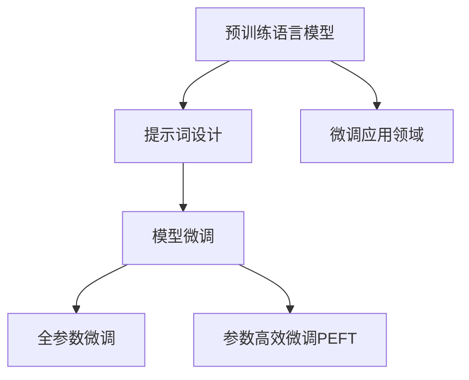

                 

# LangGPT 提示词框架的规划过程

## 1. 背景介绍

随着人工智能技术的不断进步，大语言模型（Large Language Model, LLM）在自然语言处理（NLP）领域取得了显著的成就。这些模型能够在广泛的自然语言理解和生成任务中展现出色的性能。然而，大语言模型的泛化能力仍受限于其训练数据和模型架构。提示词框架（Prompt-based Framework）作为一种新兴的微调方法，能够在大模型基础上通过精心设计的提示词（Prompt）引导模型进行特定任务的处理，从而实现高效且精准的微调。本文旨在详细阐述LangGPT提示词框架的规划过程，包括其核心概念、算法原理、具体操作步骤以及实际应用场景。

## 2. 核心概念与联系

### 2.1 核心概念概述

LangGPT提示词框架（LangGPT Prompt Framework）是一种基于预训练语言模型（Pre-trained Language Model, PLM）的微调方法，通过设计合适的提示词，引导模型在特定任务上完成微调。核心概念包括：

- **预训练语言模型（PLM）**：如BERT、GPT等，通过大规模无标签数据训练，获得通用的语言知识。
- **提示词（Prompt）**：用于指导模型进行特定任务处理的文字序列，可以设计为模板、句子或段落形式。
- **微调（Fine-Tuning）**：在预训练模型的基础上，通过有监督学习优化模型在特定任务上的性能。
- **参数高效微调（Parameter-Efficient Fine-Tuning, PEFT）**：仅微调预训练模型中的一部分参数，如顶层分类器，减少微调过程中对资源的需求。

### 2.2 核心概念原理和架构的 Mermaid 流程图



## 3. 核心算法原理 & 具体操作步骤

### 3.1 算法原理概述

LangGPT提示词框架的算法原理基于监督学习微调。其核心思想是，通过精心设计的提示词，将预训练模型引导到特定的下游任务上，通过有监督的微调过程，优化模型在该任务上的性能。

在LangGPT中，微调的目标函数为：

$$
\min_{\theta} \mathcal{L}(\mathcal{D}, M_{\theta})
$$

其中，$\mathcal{D}$ 是下游任务的标注数据集，$M_{\theta}$ 是微调后的模型，$\mathcal{L}$ 是损失函数。

### 3.2 算法步骤详解

LangGPT提示词框架的微调过程包括以下步骤：

1. **准备数据集**：选择下游任务的标注数据集，划分为训练集、验证集和测试集。
2. **设计提示词**：根据任务类型，设计合适的提示词。
3. **模型初始化**：使用预训练语言模型作为初始模型。
4. **微调模型**：通过反向传播算法，最小化损失函数，更新模型参数。
5. **评估模型**：在测试集上评估微调后的模型性能。
6. **部署应用**：将微调后的模型部署到实际应用中。

### 3.3 算法优缺点

**优点**：
- 高效性：提示词框架通过精心设计的提示词，能够显著提高微调的效率和效果。
- 灵活性：提示词框架适用于各种NLP任务，可以通过调整提示词设计，适应不同任务需求。
- 可解释性：提示词框架的设计和调整过程透明，易于理解和调试。

**缺点**：
- 对提示词设计依赖性高：提示词的设计需要经验和知识，对设计者要求较高。
- 部分任务效果不理想：某些任务可能需要更复杂的提示词设计，才能获得满意效果。
- 潜在过度拟合风险：提示词设计不当可能导致模型在训练集上表现优秀，但在测试集上泛化性能不佳。

### 3.4 算法应用领域

LangGPT提示词框架可以应用于以下领域：

- **文本分类**：如情感分析、主题分类等。
- **命名实体识别**：识别文本中的人名、地名、机构名等特定实体。
- **问答系统**：回答自然语言问题。
- **摘要生成**：自动生成文本摘要。
- **机器翻译**：将源语言文本翻译成目标语言。
- **对话系统**：实现人机对话交互。

## 4. 数学模型和公式 & 详细讲解

### 4.1 数学模型构建

LangGPT提示词框架的数学模型构建主要包括以下步骤：

1. **定义提示词**：设提示词为 $P$，输入文本为 $X$。
2. **定义损失函数**：设标注数据为 $Y$，定义损失函数 $\mathcal{L}$。
3. **定义优化目标**：最小化损失函数，即 $\min_{\theta} \mathcal{L}(X, P, Y)$。

### 4.2 公式推导过程

假设模型 $M_{\theta}$ 在输入 $X$ 和提示词 $P$ 上的输出为 $M_{\theta}(X, P)$，则微调的优化目标为：

$$
\min_{\theta} \frac{1}{N} \sum_{i=1}^N \mathcal{L}(M_{\theta}(X_i, P), Y_i)
$$

其中 $N$ 为数据集大小。

### 4.3 案例分析与讲解

以文本分类任务为例，假设提示词为：

```
"请判断以下文本属于哪个类别："

text = "这是一个示例文本，用于测试分类模型。"
```

则模型输出为：

```python
import transformers

model = transformers.BertForSequenceClassification.from_pretrained('bert-base-uncased')
tokenizer = transformers.BertTokenizer.from_pretrained('bert-base-uncased')
prompt = "请判断以下文本属于哪个类别："
text = "这是一个示例文本，用于测试分类模型。"

inputs = tokenizer(prompt, text, padding=True, truncation=True, return_tensors='pt')
with torch.no_grad():
    outputs = model(**inputs)
    logits = outputs.logits

# 获取预测类别
predicted_label = torch.argmax(logits, dim=1).item()
```

## 5. 项目实践：代码实例和详细解释说明

### 5.1 开发环境搭建

LangGPT提示词框架的开发环境搭建主要包括以下步骤：

1. **安装依赖包**：
```bash
pip install transformers torch torchtext sklearn
```

2. **下载预训练模型和提示词模板**：
```bash
wget https://huggingface.co/bert-base-uncased
```

### 5.2 源代码详细实现

以文本分类任务为例，代码实现如下：

```python
import torch
import torch.nn as nn
from transformers import BertTokenizer, BertForSequenceClassification
from torchtext import datasets, data
from sklearn.model_selection import train_test_split

# 加载数据集
train_data, test_data = datasets.IMDB.splits()

# 定义数据处理
TEXT = data.Field(tokenize='spacy', tokenizer_language='en_core_web_sm')
LABEL = data.LabelField(dtype=torch.int64)
train_data, test_data = train_test_split(train_data, test_size=0.8)
TEXT.build_vocab(train_data, min_freq=2)
LABEL.build_vocab(train_data)

# 加载模型和分词器
model = BertForSequenceClassification.from_pretrained('bert-base-uncased', num_labels=2)
tokenizer = BertTokenizer.from_pretrained('bert-base-uncased')

# 定义提示词
prompt = "请判断以下文本属于哪个类别："

# 定义模型微调函数
def fine_tune(model, data, prompt):
    device = torch.device('cuda' if torch.cuda.is_available() else 'cpu')
    model.to(device)
    
    # 加载训练数据
    train_iterator, test_iterator = data.splits(TEXT, LABEL)
    
    # 定义优化器
    optimizer = torch.optim.Adam(model.parameters(), lr=1e-5)
    
    # 定义损失函数
    criterion = nn.CrossEntropyLoss()
    
    # 定义训练函数
    def train_epoch(model, iterator, optimizer, criterion):
        model.train()
        total_loss = 0
        for batch in iterator:
            inputs, labels = batch.text, batch.label
            inputs = tokenizer(prompt, inputs, padding=True, truncation=True, return_tensors='pt')
            inputs = {k: v.to(device) for k, v in inputs.items()}
            labels = labels.to(device)
            outputs = model(**inputs)
            loss = criterion(outputs.logits, labels)
            optimizer.zero_grad()
            loss.backward()
            optimizer.step()
            total_loss += loss.item()
        return total_loss / len(iterator)
    
    # 训练模型
    for epoch in range(10):
        train_loss = train_epoch(model, train_iterator, optimizer, criterion)
        test_loss = test_epoch(model, test_iterator, criterion)
        print(f'Epoch: {epoch+1}, Train Loss: {train_loss:.3f}, Test Loss: {test_loss:.3f}')
    
    # 评估模型
    test_loss = test_epoch(model, test_iterator, criterion)
    print(f'Test Loss: {test_loss:.3f}')
```

### 5.3 代码解读与分析

**提示词设计**：
- 提示词的作用是引导模型关注特定的任务细节，如文本分类任务中的类别信息。
- 提示词可以设计为简单的模板，也可以包含详细的说明和示例。

**模型微调**：
- 在微调过程中，使用Adam优化器进行参数更新。
- 定义损失函数为交叉熵损失函数。
- 通过迭代训练和验证集，不断优化模型参数。

**结果展示**：
- 输出训练和验证集的损失函数值，评估模型性能。
- 通过测试集进一步验证模型的泛化能力。

## 6. 实际应用场景

LangGPT提示词框架可以应用于各种NLP任务，如文本分类、命名实体识别、问答系统、摘要生成等。以下是几个实际应用场景：

### 6.1 智能客服系统

智能客服系统可以通过提示词框架，将预训练模型微调到特定的客服任务上，如自动回答常见问题、识别客户情感等。这能够显著提高客服系统的效率和响应速度。

### 6.2 金融舆情监测

金融舆情监测系统可以通过提示词框架，将预训练模型微调到情感分析任务上，自动识别市场舆情变化，及时预警金融风险。

### 6.3 个性化推荐系统

个性化推荐系统可以通过提示词框架，将预训练模型微调到推荐任务上，根据用户历史行为和文本信息，生成个性化推荐结果。

## 7. 工具和资源推荐

### 7.1 学习资源推荐

1. **《自然语言处理与深度学习》**：介绍了自然语言处理的基本概念和深度学习模型的设计原理。
2. **HuggingFace官方文档**：提供了大量的预训练模型和提示词框架的使用说明。
3. **PyTorch官方文档**：详细介绍了PyTorch框架的使用方法。
4. **Kaggle数据集**：提供了丰富的NLP数据集，用于训练和测试提示词框架。

### 7.2 开发工具推荐

1. **PyTorch**：强大的深度学习框架，支持动态计算图。
2. **Transformers**：由HuggingFace开发的NLP工具库，包含多种预训练模型和提示词框架。
3. **TensorBoard**：TensorFlow配套的可视化工具，用于监测和调试提示词框架的训练过程。
4. **Weights & Biases**：实验跟踪工具，记录和可视化模型训练过程中的各项指标。

### 7.3 相关论文推荐

1. **Prompt Engineering for Pre-trained Language Models**：介绍了提示词框架的设计和应用。
2. **Parameter-Efficient Fine-Tuning of Pre-trained Language Models**：讨论了参数高效微调方法，如Adapter、Prefix等。
3. **Exploring the Limits of Transfer Learning with a Unified Text-to-Text Transformer**：探讨了Unified Text-to-Text Transformer（UTT）在提示词框架中的应用。

## 8. 总结：未来发展趋势与挑战

### 8.1 研究成果总结

LangGPT提示词框架通过设计合适的提示词，实现高效且精准的微调，已经在NLP领域展现出了显著的优势。其核心在于提示词的设计，能够有效引导模型在特定任务上发挥最佳性能。

### 8.2 未来发展趋势

1. **提示词设计自动化**：通过自动化工具和算法，设计更优的提示词。
2. **多模态提示词框架**：将视觉、音频等多模态数据引入提示词框架，增强模型的泛化能力。
3. **参数高效微调技术**：开发更高效的参数调整方法，进一步减少微调过程对资源的需求。
4. **知识图谱和逻辑规则结合**：将符号化的先验知识与神经网络模型结合，增强模型的知识和推理能力。

### 8.3 面临的挑战

1. **提示词设计复杂性**：提示词设计需要经验和知识，对设计者要求较高。
2. **模型鲁棒性不足**：提示词框架对数据和模型分布的变化敏感，需要进一步提升模型的鲁棒性。
3. **计算资源消耗**：提示词框架需要大量的计算资源，如何优化计算过程，提高训练和推理效率，是一个重要挑战。

### 8.4 研究展望

未来的研究可以从以下几个方面展开：

1. **自动化提示词设计**：开发自动化的提示词生成工具，降低提示词设计的复杂性。
2. **多模态融合**：将视觉、音频等多模态信息与文本信息结合，构建更全面的语言模型。
3. **知识图谱融合**：将知识图谱与神经网络模型结合，增强模型的知识推理能力。
4. **参数高效微调技术**：开发更高效的参数调整方法，减少微调过程对资源的需求。

## 9. 附录：常见问题与解答

**Q1：提示词框架是否适用于所有NLP任务？**

A：提示词框架适用于大多数NLP任务，特别是数据量较小的任务。但对于一些特定领域的任务，如医学、法律等，可能需要进一步的预训练和微调。

**Q2：提示词框架的效率和效果如何？**

A：提示词框架的效率和效果取决于提示词的设计。合适的提示词设计能够显著提高微调的效率和效果，但设计不当可能导致过拟合或性能下降。

**Q3：提示词框架的计算资源消耗如何？**

A：提示词框架需要大量的计算资源，尤其是在大规模数据集和复杂提示词设计的情况下。需要优化计算过程，提高训练和推理效率。

**Q4：提示词框架的鲁棒性如何？**

A：提示词框架对数据和模型分布的变化敏感，需要进一步提升模型的鲁棒性。可以通过引入对抗训练和数据增强等方法，增强模型的泛化能力。

**Q5：提示词框架的实际应用效果如何？**

A：提示词框架在许多实际应用中已经展示了出色的效果。但具体的应用效果依赖于任务类型和提示词设计。

---

作者：禅与计算机程序设计艺术 / Zen and the Art of Computer Programming

