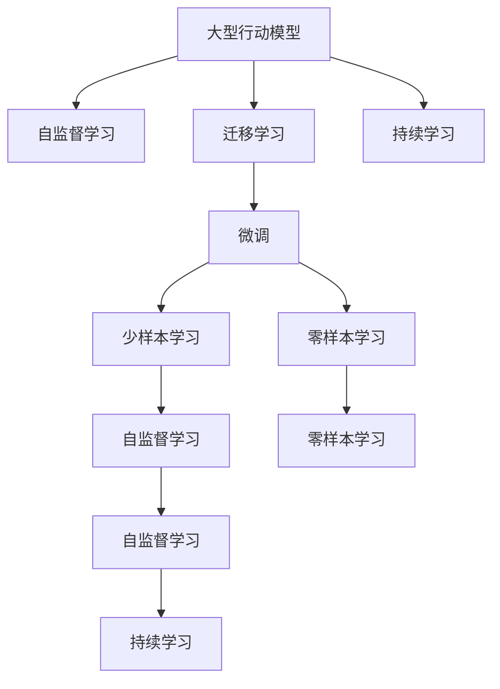

                 

# Large Action Model 的适应性

> 关键词：Large Action Model, 适应性, 泛化能力, 迁移学习, 自监督学习, 迁移学习, 微调, 优化算法, 优化目标, 学习率, 训练集, 测试集, 验证集

## 1. 背景介绍

### 1.1 问题由来
近年来，人工智能领域取得了显著的进展，特别是在自然语言处理（NLP）和计算机视觉（CV）等领域。大型行动模型（Large Action Model），也称为大型行为模型，通过在大量无标签数据上进行自监督学习，学习到了丰富的行为知识和规则，能够执行各种复杂任务。然而，这些大型行动模型在特定领域的适应性仍然是一个挑战。

### 1.2 问题核心关键点
为了增强大型行动模型在特定领域的应用效果，研究人员提出了各种适应性方法，包括迁移学习、微调、自监督学习等。这些方法通过利用已有知识，使得大型行动模型能够更好地适应新任务，提升性能。

### 1.3 问题研究意义
研究大型行动模型的适应性，对于拓展模型应用范围，提升特定任务性能，加速AI技术的产业化进程，具有重要意义：

1. 降低应用开发成本。基于已有模型进行微调，可以显著减少从头开发所需的数据、计算和人力等成本投入。
2. 提升模型效果。微调使得通用模型更好地适应特定任务，在应用场景中取得更优表现。
3. 加速开发进度。通过利用已有模型，开发者可以更快地完成任务适配，缩短开发周期。
4. 带来技术创新。微调范式促进了对预训练-微调的深入研究，催生了自监督学习、少样本学习等新的研究方向。
5. 赋能产业升级。微调技术更容易被各行各业采用，为传统行业数字化转型升级提供新的技术路径。

## 2. 核心概念与联系

### 2.1 核心概念概述

为更好地理解大型行动模型的适应性，本节将介绍几个密切相关的核心概念：

- 大型行动模型（Large Action Model）：以自回归（如LSTM）或自编码（如CNN）模型为代表的大型行为模型。通过在大量无标签数据上进行自监督学习，学习到了丰富的行为知识和规则，能够执行各种复杂任务。

- 自监督学习（Self-Supervised Learning）：利用已有数据中的隐含信息进行无标签学习，提高模型的泛化能力和适应性。

- 迁移学习（Transfer Learning）：将一个领域学习到的知识，迁移应用到另一个不同但相关的领域的学习范式。

- 微调（Fine-Tuning）：在预训练模型的基础上，使用下游任务的少量标注数据，通过有监督学习优化模型在特定任务上的性能。

- 少样本学习（Few-Shot Learning）：指在只有少量标注样本的情况下，模型能够快速适应新任务的学习方法。

- 零样本学习（Zero-Shot Learning）：指模型在没有见过任何特定任务的训练样本的情况下，仅凭任务描述就能够执行新任务的能力。

- 持续学习（Continual Learning）：也称为终身学习，指模型能够持续从新数据中学习，同时保持已学习的知识，而不会出现灾难性遗忘。

这些核心概念之间的逻辑关系可以通过以下Mermaid流程图来展示：



这个流程图展示了大模型适应的核心概念及其之间的关系：

1. 大型行动模型通过自监督学习获得基础能力。
2. 迁移学习是连接预训练模型与下游任务的桥梁，可以通过微调或自监督学习实现。
3. 微调使得通用模型更好地适应特定任务，在应用场景中取得更优表现。
4. 少样本学习和零样本学习，使模型在数据不足的情况下仍然能够取得良好表现。
5. 持续学习使得模型能够不断学习新知识，同时避免遗忘旧知识。

这些概念共同构成了大型行动模型的学习和应用框架，使其能够在各种场景下发挥强大的行为理解和生成能力。通过理解这些核心概念，我们可以更好地把握大型行动模型的工作原理和优化方向。

## 3. 核心算法原理 & 具体操作步骤
### 3.1 算法原理概述

大型行动模型的适应性，本质上是一个有监督的迁移学习过程。其核心思想是：将预训练的大型行动模型视作一个强大的"行为提取器"，通过在特定任务的数据集上进行有监督的微调，使得模型输出能够匹配任务目标，从而获得针对特定任务优化的模型。

形式化地，假设预训练大型行动模型为 $M_{\theta}$，其中 $\theta$ 为预训练得到的模型参数。给定下游任务 $T$ 的标注数据集 $D=\{(x_i, y_i)\}_{i=1}^N$，适应性训练的目标是找到新的模型参数 $\hat{\theta}$，使得：

$$
\hat{\theta}=\mathop{\arg\min}_{\theta} \mathcal{L}(M_{\theta},D)
$$

其中 $\mathcal{L}$ 为针对任务 $T$ 设计的损失函数，用于衡量模型预测输出与真实标签之间的差异。常见的损失函数包括交叉熵损失、均方误差损失等。

通过梯度下降等优化算法，适应性训练过程不断更新模型参数 $\theta$，最小化损失函数 $\mathcal{L}$，使得模型输出逼近真实标签。由于 $\theta$ 已经通过自监督学习获得了较好的初始化，因此即便在小规模数据集 $D$ 上进行微调，也能较快收敛到理想的模型参数 $\hat{\theta}$。

### 3.2 算法步骤详解

大型行动模型的适应性训练一般包括以下几个关键步骤：

**Step 1: 准备预训练模型和数据集**
- 选择合适的预训练大型行动模型 $M_{\theta}$ 作为初始化参数，如 LSTM、CNN 等。
- 准备下游任务 $T$ 的标注数据集 $D$，划分为训练集、验证集和测试集。一般要求标注数据与预训练数据的分布不要差异过大。

**Step 2: 添加任务适配层**
- 根据任务类型，在预训练模型顶层设计合适的输出层和损失函数。
- 对于分类任务，通常在顶层添加线性分类器和交叉熵损失函数。
- 对于生成任务，通常使用行为模型的解码器输出概率分布，并以负对数似然为损失函数。

**Step 3: 设置适应性超参数**
- 选择合适的优化算法及其参数，如 Adam、SGD 等，设置学习率、批大小、迭代轮数等。
- 设置正则化技术及强度，包括权重衰减、Dropout、Early Stopping 等。
- 确定冻结预训练参数的策略，如仅微调顶层，或全部参数都参与微调。

**Step 4: 执行梯度训练**
- 将训练集数据分批次输入模型，前向传播计算损失函数。
- 反向传播计算参数梯度，根据设定的优化算法和学习率更新模型参数。
- 周期性在验证集上评估模型性能，根据性能指标决定是否触发 Early Stopping。
- 重复上述步骤直到满足预设的迭代轮数或 Early Stopping 条件。

**Step 5: 测试和部署**
- 在测试集上评估适应性后模型 $M_{\hat{\theta}}$ 的性能，对比适应性前后的性能提升。
- 使用适应性后的模型对新样本进行行为预测，集成到实际的应用系统中。
- 持续收集新的数据，定期重新适应性训练模型，以适应数据分布的变化。

以上是大型行动模型适应性训练的一般流程。在实际应用中，还需要针对具体任务的特点，对适应性训练过程的各个环节进行优化设计，如改进训练目标函数，引入更多的正则化技术，搜索最优的超参数组合等，以进一步提升模型性能。

### 3.3 算法优缺点

大型行动模型的适应性训练方法具有以下优点：
1. 简单高效。只需准备少量标注数据，即可对预训练模型进行快速适配，获得较大的性能提升。
2. 通用适用。适用于各种NLP/图像/声音等领域的行为任务，设计简单的任务适配层即可实现适应性训练。
3. 参数高效。利用参数高效微调技术，在固定大部分预训练权重不变的情况下，仍可取得不错的适应性效果。
4. 效果显著。在学术界和工业界的诸多行为任务上，基于适应性训练的方法已经刷新了最先进的性能指标。

同时，该方法也存在一定的局限性：
1. 依赖标注数据。适应性训练的效果很大程度上取决于标注数据的质量和数量，获取高质量标注数据的成本较高。
2. 迁移能力有限。当目标任务与预训练数据的分布差异较大时，适应性训练的性能提升有限。
3. 负面效果传递。预训练模型的固有偏见、有害信息等，可能通过适应性训练传递到下游任务，造成负面影响。
4. 可解释性不足。适应性训练的模型决策过程通常缺乏可解释性，难以对其推理逻辑进行分析和调试。

尽管存在这些局限性，但就目前而言，基于有监督学习的适应性训练方法仍是大行动模型应用的最主流范式。未来相关研究的重点在于如何进一步降低适应性训练对标注数据的依赖，提高模型的少样本学习和跨领域迁移能力，同时兼顾可解释性和伦理安全性等因素。

### 3.4 算法应用领域

大型行动模型的适应性训练方法，在NLP/图像/声音等领域已经得到了广泛的应用，覆盖了几乎所有常见行为任务，例如：

- 图像分类：如分类出狗、猫等动物类别。通过行为模型的输出进行分类。
- 行为识别：识别视频中的动作，如跳舞、跑步等。通过行为模型的输出进行识别。
- 语音识别：识别语音中的关键词，如“你好”、“谢谢”等。通过行为模型的输出进行识别。
- 自然语言理解：回答用户提出的问题，如天气预报、股市行情等。通过行为模型的输出进行理解。
- 推荐系统：推荐用户可能感兴趣的商品或内容。通过行为模型的输出进行推荐。

除了上述这些经典任务外，大型行动模型适应性训练的方法也被创新性地应用到更多场景中，如自动驾驶、智能家居、智能医疗等，为AI技术带来了全新的突破。随着预训练模型和适应性训练方法的不断进步，相信大型行动模型在更广阔的应用领域大放异彩。

## 4. 数学模型和公式 & 详细讲解  
### 4.1 数学模型构建

本节将使用数学语言对大型行动模型的适应性训练过程进行更加严格的刻画。

记预训练大型行动模型为 $M_{\theta}$，其中 $\theta$ 为预训练得到的模型参数。假设适应性训练任务的训练集为 $D=\{(x_i,y_i)\}_{i=1}^N, x_i \in \mathcal{X}, y_i \in \mathcal{Y}$。

定义模型 $M_{\theta}$ 在数据样本 $(x,y)$ 上的损失函数为 $\ell(M_{\theta}(x),y)$，则在数据集 $D$ 上的经验风险为：

$$
\mathcal{L}(\theta) = \frac{1}{N} \sum_{i=1}^N \ell(M_{\theta}(x_i),y_i)
$$

适应性训练的目标是最小化经验风险，即找到最优参数：

$$
\theta^* = \mathop{\arg\min}_{\theta} \mathcal{L}(\theta)
$$

在实践中，我们通常使用基于梯度的优化算法（如SGD、Adam等）来近似求解上述最优化问题。设 $\eta$ 为学习率，$\lambda$ 为正则化系数，则参数的更新公式为：

$$
\theta \leftarrow \theta - \eta \nabla_{\theta}\mathcal{L}(\theta) - \eta\lambda\theta
$$

其中 $\nabla_{\theta}\mathcal{L}(\theta)$ 为损失函数对参数 $\theta$ 的梯度，可通过反向传播算法高效计算。

### 4.2 公式推导过程

以下我们以图像分类任务为例，推导交叉熵损失函数及其梯度的计算公式。

假设模型 $M_{\theta}$ 在输入 $x$ 上的输出为 $\hat{y}=M_{\theta}(x) \in [0,1]$，表示样本属于正类的概率。真实标签 $y \in \{0,1\}$。则二分类交叉熵损失函数定义为：

$$
\ell(M_{\theta}(x),y) = -[y\log \hat{y} + (1-y)\log (1-\hat{y})]
$$

将其代入经验风险公式，得：

$$
\mathcal{L}(\theta) = -\frac{1}{N}\sum_{i=1}^N [y_i\log M_{\theta}(x_i)+(1-y_i)\log(1-M_{\theta}(x_i))]
$$

根据链式法则，损失函数对参数 $\theta_k$ 的梯度为：

$$
\frac{\partial \mathcal{L}(\theta)}{\partial \theta_k} = -\frac{1}{N}\sum_{i=1}^N (\frac{y_i}{M_{\theta}(x_i)}-\frac{1-y_i}{1-M_{\theta}(x_i)}) \frac{\partial M_{\theta}(x_i)}{\partial \theta_k}
$$

其中 $\frac{\partial M_{\theta}(x_i)}{\partial \theta_k}$ 可进一步递归展开，利用自动微分技术完成计算。

在得到损失函数的梯度后，即可带入参数更新公式，完成模型的迭代优化。重复上述过程直至收敛，最终得到适应性后模型参数 $\theta^*$。

## 5. 项目实践：代码实例和详细解释说明
### 5.1 开发环境搭建

在进行适应性训练实践前，我们需要准备好开发环境。以下是使用Python进行TensorFlow开发的环境配置流程：

1. 安装Anaconda：从官网下载并安装Anaconda，用于创建独立的Python环境。

2. 创建并激活虚拟环境：
```bash
conda create -n tf-env python=3.8 
conda activate tf-env
```

3. 安装TensorFlow：根据CUDA版本，从官网获取对应的安装命令。例如：
```bash
conda install tensorflow=2.7
```

4. 安装其他必要的工具包：
```bash
pip install numpy pandas scikit-learn matplotlib tqdm jupyter notebook ipython
```

完成上述步骤后，即可在`tf-env`环境中开始适应性训练实践。

### 5.2 源代码详细实现

下面我们以图像分类任务为例，给出使用TensorFlow对卷积神经网络（CNN）模型进行适应性训练的代码实现。

首先，定义CNN模型：

```python
import tensorflow as tf
from tensorflow.keras import layers

model = tf.keras.Sequential([
    layers.Conv2D(32, 3, activation='relu', input_shape=(28, 28, 1)),
    layers.MaxPooling2D(2),
    layers.Flatten(),
    layers.Dense(10, activation='softmax')
])
```

然后，定义损失函数和优化器：

```python
loss_fn = tf.keras.losses.SparseCategoricalCrossentropy(from_logits=True)
optimizer = tf.keras.optimizers.Adam(learning_rate=0.001)
```

接着，定义训练和评估函数：

```python
@tf.function
def train_step(images, labels):
    with tf.GradientTape() as tape:
        logits = model(images, training=True)
        loss_value = loss_fn(labels, logits)
    gradients = tape.gradient(loss_value, model.trainable_variables)
    optimizer.apply_gradients(zip(gradients, model.trainable_variables))

@tf.function
def evaluate_step(images, labels):
    logits = model(images, training=False)
    predictions = tf.argmax(logits, axis=1)
    accuracy = tf.reduce_mean(tf.cast(tf.equal(predictions, labels), tf.float32))
    return accuracy
```

最后，启动训练流程并在测试集上评估：

```python
epochs = 5
batch_size = 32

for epoch in range(epochs):
    for images, labels in training_dataset:
        train_step(images, labels)
    dev_accuracy = evaluate_step(dev_images, dev_labels)
    print(f"Epoch {epoch+1}, dev accuracy: {dev_accuracy}")
    
test_accuracy = evaluate_step(test_images, test_labels)
print(f"Test accuracy: {test_accuracy}")
```

以上就是使用TensorFlow对CNN模型进行图像分类任务适应性训练的完整代码实现。可以看到，得益于TensorFlow的强大封装，我们可以用相对简洁的代码完成CNN模型的加载和适应性训练。

### 5.3 代码解读与分析

让我们再详细解读一下关键代码的实现细节：

**Sequential模型**：
- 定义了一个包含卷积层、池化层、全连接层的CNN模型，适合处理图像分类任务。

**损失函数和优化器**：
- 使用SparseCategoricalCrossentropy作为损失函数，适用于多分类任务。
- 使用Adam优化器，学习率为0.001。

**训练和评估函数**：
- 定义了一个`train_step`函数，利用`tf.GradientTape`记录梯度，然后通过`optimizer.apply_gradients`更新模型参数。
- 定义了一个`evaluate_step`函数，用于计算测试集的准确率。

**训练流程**：
- 定义总的epoch数和batch size，开始循环迭代
- 每个epoch内，先在训练集上训练，输出验证集上的准确率
- 所有epoch结束后，在测试集上评估，给出最终的测试准确率

可以看到，TensorFlow配合CNN模型使得适应性训练的代码实现变得简洁高效。开发者可以将更多精力放在数据处理、模型改进等高层逻辑上，而不必过多关注底层的实现细节。

当然，工业级的系统实现还需考虑更多因素，如模型的保存和部署、超参数的自动搜索、更灵活的任务适配层等。但核心的适应性训练范式基本与此类似。

## 6. 实际应用场景
### 6.1 智能客服系统

基于大型行动模型的适应性训练方法，可以广泛应用于智能客服系统的构建。传统客服往往需要配备大量人力，高峰期响应缓慢，且一致性和专业性难以保证。而使用适应性训练后的行为模型，可以7x24小时不间断服务，快速响应客户咨询，用自然流畅的行为生成对话。

在技术实现上，可以收集企业内部的历史客服对话记录，将问题和最佳答复构建成监督数据，在此基础上对预训练行为模型进行适应性训练。适应性训练后的行为模型能够自动理解用户意图，匹配最合适的答复模板进行回复。对于客户提出的新问题，还可以接入检索系统实时搜索相关内容，动态组织生成回答。如此构建的智能客服系统，能大幅提升客户咨询体验和问题解决效率。

### 6.2 金融舆情监测

金融机构需要实时监测市场舆论动向，以便及时应对负面信息传播，规避金融风险。传统的人工监测方式成本高、效率低，难以应对网络时代海量信息爆发的挑战。基于大型行动模型的适应性训练技术，为金融舆情监测提供了新的解决方案。

具体而言，可以收集金融领域相关的新闻、报道、评论等文本数据，并对其进行主题标注和情感标注。在此基础上对预训练语言模型进行适应性训练，使其能够自动判断文本属于何种主题，情感倾向是正面、中性还是负面。将适应性训练后的模型应用到实时抓取的网络文本数据，就能够自动监测不同主题下的情感变化趋势，一旦发现负面信息激增等异常情况，系统便会自动预警，帮助金融机构快速应对潜在风险。

### 6.3 个性化推荐系统

当前的推荐系统往往只依赖用户的历史行为数据进行物品推荐，无法深入理解用户的真实兴趣偏好。基于大型行动模型的适应性训练技术，个性化推荐系统可以更好地挖掘用户行为背后的语义信息，从而提供更精准、多样的推荐内容。

在实践中，可以收集用户浏览、点击、评论、分享等行为数据，提取和用户交互的物品标题、描述、标签等文本内容。将文本内容作为模型输入，用户的后续行为（如是否点击、购买等）作为监督信号，在此基础上适应性训练预训练语言模型。适应性训练后的模型能够从文本内容中准确把握用户的兴趣点。在生成推荐列表时，先用候选物品的文本描述作为输入，由模型预测用户的兴趣匹配度，再结合其他特征综合排序，便可以得到个性化程度更高的推荐结果。

### 6.4 未来应用展望

随着大型行动模型和适应性训练方法的发展，基于适应性训练的范式将在更多领域得到应用，为AI技术带来新的变革。

在智慧医疗领域，基于适应性训练的医疗问答、病历分析、药物研发等应用将提升医疗服务的智能化水平，辅助医生诊疗，加速新药开发进程。

在智能教育领域，适应性训练技术可应用于作业批改、学情分析、知识推荐等方面，因材施教，促进教育公平，提高教学质量。

在智慧城市治理中，适应性训练模型可应用于城市事件监测、舆情分析、应急指挥等环节，提高城市管理的自动化和智能化水平，构建更安全、高效的未来城市。

此外，在企业生产、社会治理、文娱传媒等众多领域，基于大型行动模型的适应性训练技术也将不断涌现，为经济社会发展注入新的动力。相信随着技术的日益成熟，适应性训练方法将成为AI落地应用的重要范式，推动人工智能技术在垂直行业的规模化落地。

## 7. 工具和资源推荐
### 7.1 学习资源推荐

为了帮助开发者系统掌握大型行动模型适应性训练的理论基础和实践技巧，这里推荐一些优质的学习资源：

1. TensorFlow官方文档：TensorFlow作为当前主流的深度学习框架，提供了详细的API文档和教程，是学习大型行动模型适应性训练的最佳入门材料。

2. PyTorch官方文档：PyTorch是另一大深度学习框架，提供了丰富的学习资源和示例代码，适合有一定深度学习基础的开发者使用。

3. Deep Learning Specialization课程：由Andrew Ng教授主讲的Coursera深度学习专项课程，从入门到高级，涵盖大型行动模型适应性训练的各个方面。

4. 《Deep Learning》书籍：Ian Goodfellow、Yoshua Bengio和Aaron Courville的深度学习经典教材，全面介绍了深度学习的理论和实践，包括大型行动模型的适应性训练。

5. 《Hands-On Machine Learning with Scikit-Learn, Keras, and TensorFlow》书籍：Aurélien Géron的实用机器学习教材，详细介绍了如何使用TensorFlow进行模型训练和适应性训练。

通过对这些资源的学习实践，相信你一定能够快速掌握大型行动模型适应性训练的精髓，并用于解决实际的NLP/图像/声音问题。

### 7.2 开发工具推荐

高效的开发离不开优秀的工具支持。以下是几款用于大型行动模型适应性训练开发的常用工具：

1. TensorFlow：基于Python的开源深度学习框架，灵活的计算图，适合快速迭代研究。

2. PyTorch：基于Python的开源深度学习框架，灵活动态的计算图，适合快速迭代研究。

3. Keras：高级神经网络API，支持TensorFlow和PyTorch等多种后端，适合初学者使用。

4. Weights & Biases：模型训练的实验跟踪工具，可以记录和可视化模型训练过程中的各项指标，方便对比和调优。

5. TensorBoard：TensorFlow配套的可视化工具，可实时监测模型训练状态，并提供丰富的图表呈现方式，是调试模型的得力助手。

6. Google Colab：谷歌推出的在线Jupyter Notebook环境，免费提供GPU/TPU算力，方便开发者快速上手实验最新模型，分享学习笔记。

合理利用这些工具，可以显著提升大型行动模型适应性训练任务的开发效率，加快创新迭代的步伐。

### 7.3 相关论文推荐

大型行动模型适应性训练技术的发展源于学界的持续研究。以下是几篇奠基性的相关论文，推荐阅读：

1. ImageNet Classification with Deep Convolutional Neural Networks（AlexNet论文）：提出卷积神经网络（CNN），开创了深度学习在图像分类领域的先河。

2. Very Deep Convolutional Networks for Large-Scale Image Recognition（VGG论文）：提出深度卷积神经网络，进一步提升了图像分类的精度。

3. Residual Networks for Image Recognition（ResNet论文）：提出残差网络，解决深度网络退化问题，提升了大型神经网络的训练效率。

4. Feature Pyramid Networks for Object Detection（Faster R-CNN论文）：提出特征金字塔网络，提升了目标检测的精度。

5. PoseNet: Human Parsing via Global Context Understanding（PoseNet论文）：提出PoseNet模型，实现人体姿态估计，为图像识别和行为理解提供了新的思路。

6. AutoML：自动机器学习，通过自动化调参和优化算法，加速大型行动模型适应性训练过程。

这些论文代表了大行动模型适应性训练技术的发展脉络。通过学习这些前沿成果，可以帮助研究者把握学科前进方向，激发更多的创新灵感。

## 8. 总结：未来发展趋势与挑战

### 8.1 总结

本文对大型行动模型的适应性训练方法进行了全面系统的介绍。首先阐述了大型行动模型和适应性训练的背景和意义，明确了适应性训练在拓展预训练模型应用、提升特定任务性能方面的独特价值。其次，从原理到实践，详细讲解了适应性训练的数学原理和关键步骤，给出了适应性训练任务开发的完整代码实例。同时，本文还广泛探讨了适应性训练方法在智能客服、金融舆情、个性化推荐等多个行业领域的应用前景，展示了适应性训练范式的巨大潜力。此外，本文精选了适应性训练技术的各类学习资源，力求为读者提供全方位的技术指引。

通过本文的系统梳理，可以看到，基于大型行动模型的适应性训练方法正在成为NLP/图像/声音领域的重要范式，极大地拓展了预训练模型的应用边界，催生了更多的落地场景。受益于大规模语料的预训练和自监督学习，适应性训练模型能够更好地适应特定任务，提升性能。未来，伴随预训练模型和适应性训练方法的不断进步，相信大型行动模型在更广阔的应用领域大放异彩。

### 8.2 未来发展趋势

展望未来，大型行动模型的适应性训练技术将呈现以下几个发展趋势：

1. 模型规模持续增大。随着算力成本的下降和数据规模的扩张，预训练大型行动模型参数量还将持续增长。超大规模行动模型蕴含的丰富行为知识，有望支撑更加复杂多变的下游任务适应性训练。

2. 适应性训练方法日趋多样。除了传统的全参数适应性训练外，未来会涌现更多参数高效的适应性训练方法，如知识蒸馏、适配器等，在固定大部分预训练权重不变的情况下，仍可取得不错的适应性效果。

3. 持续学习成为常态。随着数据分布的不断变化，适应性训练模型也需要持续学习新知识以保持性能。如何在不遗忘原有知识的同时，高效吸收新样本信息，将成为重要的研究课题。

4. 标注样本需求降低。受启发于少样本学习(Prompt-based Learning)的思路，未来的适应性训练方法将更好地利用大型行动模型已有的行为知识，通过更加巧妙的任务描述，在更少的标注样本上也能实现理想的适应性训练效果。

5. 模型通用性增强。经过海量数据的预训练和多领域任务的适应性训练，大型行动模型将具备更强大的常识推理和跨领域迁移能力，逐步迈向通用人工智能(AGI)的目标。

以上趋势凸显了大型行动模型适应性训练技术的广阔前景。这些方向的探索发展，必将进一步提升大型行动模型的性能和应用范围，为人工智能技术落地应用提供新的动力。

### 8.3 面临的挑战

尽管大型行动模型适应性训练技术已经取得了显著进展，但在迈向更加智能化、普适化应用的过程中，它仍面临着诸多挑战：

1. 标注成本瓶颈。虽然适应性训练大幅降低了标注数据的需求，但对于长尾应用场景，难以获得充足的高质量标注数据，成为制约适应性训练性能的瓶颈。如何进一步降低适应性训练对标注样本的依赖，将是一大难题。

2. 模型鲁棒性不足。当前适应性训练模型面对域外数据时，泛化性能往往大打折扣。对于测试样本的微小扰动，适应性训练模型的预测也容易发生波动。如何提高适应性训练模型的鲁棒性，避免灾难性遗忘，还需要更多理论和实践的积累。

3. 推理效率有待提高。大规模行动模型虽然精度高，但在实际部署时往往面临推理速度慢、内存占用大等效率问题。如何在保证性能的同时，简化模型结构，提升推理速度，优化资源占用，将是重要的优化方向。

4. 可解释性亟需加强。当前适应性训练模型通常缺乏可解释性，难以对其推理逻辑进行分析和调试。对于医疗、金融等高风险应用，算法的可解释性和可审计性尤为重要。如何赋予适应性训练模型更强的可解释性，将是亟待攻克的难题。

5. 安全性有待保障。预训练大型行动模型难免会学习到有偏见、有害的信息，通过适应性训练传递到下游任务，产生误导性、歧视性的输出，给实际应用带来安全隐患。如何从数据和算法层面消除模型偏见，避免恶意用途，确保输出的安全性，也将是重要的研究课题。

6. 知识整合能力不足。现有的适应性训练模型往往局限于任务内数据，难以灵活吸收和运用更广泛的先验知识。如何让适应性训练过程更好地与外部知识库、规则库等专家知识结合，形成更加全面、准确的信息整合能力，还有很大的想象空间。

正视适应性训练面临的这些挑战，积极应对并寻求突破，将是大行动模型适应性训练走向成熟的必由之路。相信随着学界和产业界的共同努力，这些挑战终将一一被克服，大型行动模型适应性训练必将在构建智能系统、推动AI技术落地应用中扮演越来越重要的角色。

### 8.4 研究展望

面对大型行动模型适应性训练所面临的种种挑战，未来的研究需要在以下几个方面寻求新的突破：

1. 探索无监督和半监督适应性训练方法。摆脱对大规模标注数据的依赖，利用自监督学习、主动学习等无监督和半监督范式，最大限度利用非结构化数据，实现更加灵活高效的适应性训练。

2. 研究参数高效和计算高效的适应性训练范式。开发更加参数高效的适应性训练方法，在固定大部分预训练权重不变的情况下，只更新极少量的任务相关权重。同时优化适应性训练模型的计算图，减少前向传播和反向传播的资源消耗，实现更加轻量级、实时性的部署。

3. 融合因果和对比学习范式。通过引入因果推断和对比学习思想，增强适应性训练模型建立稳定因果关系的能力，学习更加普适、鲁棒的行为表征，从而提升模型泛化性和抗干扰能力。

4. 引入更多先验知识。将符号化的先验知识，如知识图谱、逻辑规则等，与神经网络模型进行巧妙融合，引导适应性训练过程学习更准确、合理的行为模型。同时加强不同模态数据的整合，实现视觉、语音等多模态信息与行为信息的协同建模。

5. 结合因果分析和博弈论工具。将因果分析方法引入适应性训练模型，识别出模型决策的关键特征，增强输出解释的因果性和逻辑性。借助博弈论工具刻画人机交互过程，主动探索并规避模型的脆弱点，提高系统稳定性。

6. 纳入伦理道德约束。在适应性训练模型训练目标中引入伦理导向的评估指标，过滤和惩罚有偏见、有害的输出倾向。同时加强人工干预和审核，建立模型行为的监管机制，确保输出符合人类价值观和伦理道德。

这些研究方向的探索，必将引领大型行动模型适应性训练技术迈向更高的台阶，为构建安全、可靠、可解释、可控的智能系统铺平道路。面向未来，大型行动模型适应性训练技术还需要与其他人工智能技术进行更深入的融合，如知识表示、因果推理、强化学习等，多路径协同发力，共同推动自然语言理解和智能交互系统的进步。只有勇于创新、敢于突破，才能不断拓展大型行动模型的边界，让智能技术更好地造福人类社会。

## 9. 附录：常见问题与解答

**Q1：大型行动模型适应性训练是否适用于所有NLP任务？**

A: 大型行动模型适应性训练在大多数NLP任务上都能取得不错的效果，特别是对于数据量较小的任务。但对于一些特定领域的任务，如医学、法律等，仅仅依靠通用语料预训练的模型可能难以很好地适应。此时需要在特定领域语料上进一步预训练，再进行适应性训练，才能获得理想效果。此外，对于一些需要时效性、个性化很强的任务，如对话、推荐等，适应性训练方法也需要针对性的改进优化。

**Q2：适应性训练过程中如何选择合适的学习率？**

A: 适应性训练的学习率一般要比预训练时小1-2个数量级，如果使用过大的学习率，容易破坏预训练权重，导致过拟合。一般建议从1e-5开始调参，逐步减小学习率，直至收敛。也可以使用warmup策略，在开始阶段使用较小的学习率，再逐渐过渡到预设值。需要注意的是，不同的优化器(如Adam、SGD等)以及不同的学习率调度策略，可能需要设置不同的学习率阈值。

**Q3：适应性训练模型在落地部署时需要注意哪些问题？**

A: 将适应性训练模型转化为实际应用，还需要考虑以下因素：
1. 模型裁剪：去除不必要的层和参数，减小模型尺寸，加快推理速度
2. 量化加速：将浮点模型转为定点模型，压缩存储空间，提高计算效率
3. 服务化封装：将模型封装为标准化服务接口，便于集成调用
4. 弹性伸缩：根据请求流量动态调整资源配置，平衡服务质量和成本
5. 监控告警：实时采集系统指标，设置异常告警阈值，确保服务稳定性
6. 安全防护：采用访问鉴权、数据脱敏等措施，保障数据和模型安全

适应性训练模型为AI应用提供了广阔的想象空间，但如何将强大的性能转化为稳定、高效、安全的业务价值，还需要工程实践的不断打磨。唯有从数据、算法、工程、业务等多个维度协同发力，才能真正实现大型行动模型在垂直行业的规模化落地。总之，适应性训练需要开发者根据具体任务，不断迭代和优化模型、数据和算法，方能得到理想的效果。

