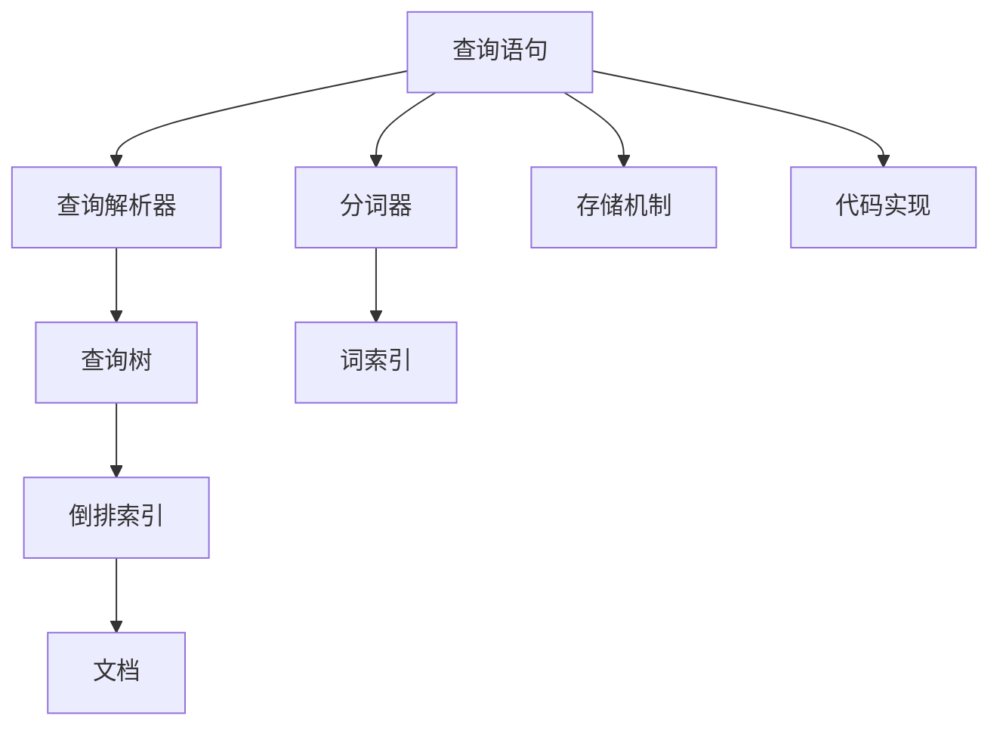
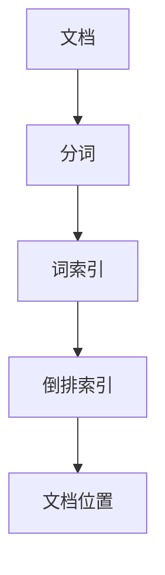
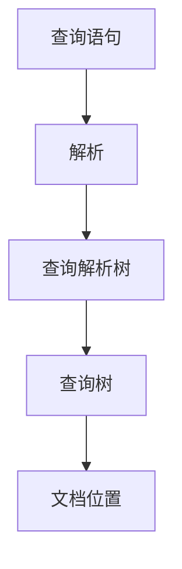

                 

# Lucene原理与代码实例讲解

> 关键词：Lucene, 搜索引擎, 倒排索引, 分词器, 查询优化, 存储机制, 代码实现, 索引构建

## 1. 背景介绍

### 1.1 问题由来
随着互联网的迅猛发展，信息检索的需求日益增多，传统的基于关键词匹配的搜索方式已无法满足用户对准确性和相关性的要求。此时，构建一个高效的搜索引擎显得尤为重要。Lucene作为Apache软件基金会的一个开源搜索引擎库，以其强大的搜索引擎功能、高性能和稳定性吸引了众多开发者和企业的关注。

Lucene核心思想是倒排索引（Inverted Index），通过对文档进行分词和倒排索引的构建，实现了快速的文档检索和查询。其设计思想简单高效，适用于大型的、高性能的搜索引擎系统。

### 1.2 问题核心关键点
Lucene的核心关键点主要包括：
- 倒排索引：将每个词与其出现的文档列表进行关联，加速文档检索。
- 分词器：将文本进行分词处理，生成词索引。
- 查询优化：通过构建查询树，优化查询过程，提升检索效率。
- 存储机制：支持多种存储方式，如内存、磁盘中等。
- 代码实现：提供完善的API接口，方便开发者进行二次开发。

## 2. 核心概念与联系

### 2.1 核心概念概述

Lucene是一个基于Java语言的搜索引擎库，主要用于构建高性能的全文搜索引擎系统。其核心概念包括：

- 倒排索引(Inverted Index)：一种数据结构，将每个词与其出现的文档列表进行关联，实现快速的文档检索。
- 分词器(Tokenizers)：将文本进行分词处理，生成词索引，用于构建倒排索引。
- 查询树(Query Tree)：基于Lucene的查询解析器解析用户输入的查询语句，生成查询树，用于优化查询过程。
- 存储机制(Storage)：支持多种存储方式，如内存、磁盘等，满足不同场景下的存储需求。
- 代码实现(API)：提供完善的API接口，方便开发者进行二次开发和扩展。

这些核心概念通过有机结合，形成了Lucene强大的搜索引擎功能。

### 2.2 核心概念原理和架构的 Mermaid 流程图



这个Mermaid流程图展示了Lucene的核心概念和它们之间的联系：

1. 用户输入查询语句，进入查询解析器(B)。
2. 查询解析器将查询语句解析为查询树(C)。
3. 查询树根据倒排索引(D)，找到相关文档(E)。
4. 分词器(F)将文本分词，生成词索引(G)，用于构建倒排索引。
5. 存储机制(H)支持将索引和文档存放在不同位置，满足不同需求。
6. API接口(I)提供各种功能，方便开发者进行扩展和集成。

## 3. 核心算法原理 & 具体操作步骤
### 3.1 算法原理概述

Lucene的核心算法包括倒排索引的构建、查询优化和存储机制，具体如下：

- **倒排索引**：对文档进行分词，生成词索引，记录每个词在文档中出现的位置，加速文档检索。
- **查询优化**：通过构建查询树，优化查询过程，提升检索效率。
- **存储机制**：支持多种存储方式，如内存、磁盘中等，满足不同场景下的存储需求。

### 3.2 算法步骤详解

#### 3.2.1 倒排索引构建

Lucene通过分词器(Tokenizers)将文本进行分词，生成词索引。倒排索引的构建步骤如下：

1. 加载索引文件，获取所有文档和词索引。
2. 遍历每个文档，生成词列表，记录每个词在文档中出现的位置。
3. 对于每个词，将其与出现的文档列表关联，生成倒排索引。

#### 3.2.2 查询优化

Lucene通过查询解析器(Parser)解析用户输入的查询语句，生成查询树。查询优化的步骤如下：

1. 解析查询语句，生成查询树。
2. 根据查询树，构建查询解析器。
3. 查询解析器根据查询树，找到相关文档，返回查询结果。

#### 3.2.3 存储机制

Lucene支持多种存储方式，如内存、磁盘等，满足不同场景下的存储需求。具体的存储机制如下：

1. 内存存储：将索引和文档存储在内存中，适用于小规模的搜索引擎系统。
2. 磁盘存储：将索引和文档存储在磁盘中，适用于大规模的搜索引擎系统。
3. 文件存储：将索引和文档存储在文件中，适用于分布式存储环境。

### 3.3 算法优缺点

#### 3.3.1 优点

Lucene的核心算法具有以下优点：

1. 高效检索：倒排索引和查询优化技术使得Lucene能够高效地进行文档检索。
2. 易于扩展：通过API接口，开发者可以方便地进行二次开发和扩展。
3. 稳定可靠：经过多年发展，Lucene已经在大型搜索引擎系统中得到广泛应用，具有较高的稳定性和可靠性。
4. 灵活存储：支持多种存储方式，适应不同场景下的需求。

#### 3.3.2 缺点

Lucene的核心算法也存在一些缺点：

1. 内存占用高：倒排索引的构建和查询过程需要占用大量内存，对于大规模的索引系统，内存消耗较大。
2. 查询速度慢：对于复杂的查询语句，查询优化和倒排索引的构建过程较为耗时。
3. 部署复杂： Lucene的部署和配置相对复杂，需要一定的技术基础。
4. 代码复杂： Lucene的API接口较为复杂，对于初学者来说有一定的学习难度。

### 3.4 算法应用领域

Lucene广泛应用于搜索引擎、文本检索、数据分析等领域，具体应用如下：

- 网站搜索：用于构建网站的全文搜索功能，提升用户体验。
- 文档检索：用于对大量文档进行高效检索和查询，满足用户的信息需求。
- 数据分析：用于对文本数据进行深度分析，发现数据中的潜在规律和趋势。
- 内容推荐：用于构建个性化推荐系统，推荐用户感兴趣的内容。
- 自然语言处理：用于文本分词、情感分析、实体识别等NLP任务。

## 4. 数学模型和公式 & 详细讲解 & 举例说明

### 4.1 数学模型构建

Lucene的数学模型主要基于倒排索引和查询树，以下进行详细构建：

#### 4.1.1 倒排索引

倒排索引的数学模型为：

$$
\text{Inverted Index} = \{(w, D_w)\}
$$

其中，$w$表示词，$D_w$表示出现该词的文档列表。

倒排索引的构建过程如下：

1. 对文档进行分词，生成词列表。
2. 对于每个词，记录其出现的文档位置，生成倒排索引。

#### 4.1.2 查询树

查询树的数学模型为：

$$
\text{Query Tree} = T(Q)
$$

其中，$Q$表示查询语句，$T$表示查询树。

查询树的构建过程如下：

1. 对查询语句进行语法分析，生成查询解析树。
2. 根据查询解析树，构建查询树。
3. 查询树根据倒排索引，找到相关文档。

### 4.2 公式推导过程

#### 4.2.1 倒排索引

倒排索引的构建过程如图：



其中，$A$表示文档，$B$表示分词器，$C$表示词索引，$D$表示倒排索引，$E$表示文档位置。

#### 4.2.2 查询树

查询树的构建过程如图：



其中，$A$表示查询语句，$B$表示查询解析器，$C$表示查询解析树，$D$表示查询树，$E$表示文档位置。

### 4.3 案例分析与讲解

#### 4.3.1 倒排索引案例

假设有一个包含两篇文档的索引，文档内容如下：

文档1："The quick brown fox jumps over the lazy dog"
文档2："The fast brown fox jumps over the quick dog"

其倒排索引如下：

- "quick"：{1}
- "brown"：{1,2}
- "fox"：{1,2}
- "jumps"：{1,2}
- "over"：{1,2}
- "the"：{1,2}
- "lazy"：{1}
- "dog"：{1,2}

其中，每个词与出现的文档列表进行关联。

#### 4.3.2 查询树案例

假设用户输入查询语句为"The quick brown fox jumps over the lazy dog"，其查询树如下：

```
     And
       /  \
     And  And
      / \  /  \
     /   \ /   \
  quick brown  fox jumps  over lazy  dog
```

查询树将查询语句分解为多个子查询，每个子查询对应一个词。查询树根据倒排索引，找到相关文档。

## 5. 项目实践：代码实例和详细解释说明

### 5.1 开发环境搭建

Lucene的开发环境搭建如下：

1. 安装Java JDK：从官网下载安装Java JDK，并进行环境配置。
2. 安装Maven：从官网下载安装Maven，并进行环境配置。
3. 克隆Lucene代码：从GitHub上克隆Lucene代码，并切换到master分支。
4. 安装依赖：通过Maven安装Lucene的依赖库。
5. 配置Lucene：根据实际需求，配置Lucene的索引和存储方式。

### 5.2 源代码详细实现

Lucene的核心代码主要集中在以下几个类中：

- **IndexWriter**：用于构建索引。
- **IndexReader**：用于读取索引。
- **Document**：表示文档。
- **TokenStream**：用于分词。
- **Query**：表示查询。

以下以构建一个简单的索引和进行搜索为例，介绍Lucene的源代码实现。

#### 5.2.1 构建索引

```java
import org.apache.lucene.analysis.standard.StandardAnalyzer;
import org.apache.lucene.document.Document;
import org.apache.lucene.document.Field;
import org.apache.lucene.index.DirectoryReader;
import org.apache.lucene.index.IndexWriter;
import org.apache.lucene.index.IndexWriterConfig;
import org.apache.lucene.queryparser.classic.QueryParser;
import org.apache.lucene.search.IndexSearcher;
import org.apache.lucene.search.Query;
import org.apache.lucene.search.TopDocs;
import org.apache.lucene.store.Directory;
import org.apache.lucene.store.FSDirectory;

import java.io.IOException;

public class LuceneExample {
    public static void main(String[] args) throws IOException {
        // 创建索引目录
        Directory dir = FSDirectory.open(Paths.get("index"));
        // 创建索引写入器
        IndexWriterConfig config = new IndexWriterConfig(new StandardAnalyzer());
        IndexWriter writer = new IndexWriter(dir, config);
        // 构建索引文档
        Document doc = new Document();
        doc.add(new Field("id", "1", Field.Store.YES, Field.Index.ANALYZED));
        doc.add(new Field("content", "The quick brown fox jumps over the lazy dog", Field.Store.YES, Field.Index.ANALYZED));
        writer.addDocument(doc);
        // 提交索引写入器
        writer.close();
    }
}
```

#### 5.2.2 搜索文档

```java
import org.apache.lucene.analysis.standard.StandardAnalyzer;
import org.apache.lucene.document.Document;
import org.apache.lucene.document.Field;
import org.apache.lucene.index.DirectoryReader;
import org.apache.lucene.index.IndexReader;
import org.apache.lucene.index.IndexSearcher;
import org.apache.lucene.queryparser.classic.QueryParser;
import org.apache.lucene.search.IndexSearcher;
import org.apache.lucene.search.Query;
import org.apache.lucene.search.TopDocs;
import org.apache.lucene.store.Directory;
import org.apache.lucene.store.FSDirectory;

import java.io.IOException;

public class LuceneExample {
    public static void main(String[] args) throws IOException {
        // 创建索引目录
        Directory dir = FSDirectory.open(Paths.get("index"));
        // 创建索引搜索器
        IndexReader reader = DirectoryReader.open(dir);
        IndexSearcher searcher = new IndexSearcher(reader);
        // 构建查询解析器
        QueryParser parser = new QueryParser("content", new StandardAnalyzer());
        // 构建查询
        Query query = parser.parse("quick brown");
        // 执行查询
        TopDocs docs = searcher.search(query, 10);
        // 输出搜索结果
        for (ScoreDoc scoreDoc : docs.scoreDocs) {
            Document doc = searcher.doc(scoreDoc.doc);
            System.out.println(doc.get("id") + "\t" + doc.get("content"));
        }
    }
}
```

### 5.3 代码解读与分析

#### 5.3.1 构建索引

构建索引的代码如下：

```java
// 创建索引目录
Directory dir = FSDirectory.open(Paths.get("index"));
// 创建索引写入器
IndexWriterConfig config = new IndexWriterConfig(new StandardAnalyzer());
IndexWriter writer = new IndexWriter(dir, config);
// 构建索引文档
Document doc = new Document();
doc.add(new Field("id", "1", Field.Store.YES, Field.Index.ANALYZED));
doc.add(new Field("content", "The quick brown fox jumps over the lazy dog", Field.Store.YES, Field.Index.ANALYZED));
writer.addDocument(doc);
// 提交索引写入器
writer.close();
```

这段代码主要完成了以下几个步骤：

1. 创建索引目录：`FSDirectory.open(Paths.get("index"))`，指定索引的存储位置。
2. 创建索引写入器：`IndexWriterConfig(new StandardAnalyzer())`，指定索引的编码方式和分词器。
3. 构建索引文档：`Document doc = new Document()`，创建文档对象，添加字段。
4. 提交索引写入器：`writer.close()`，完成索引的提交。

#### 5.3.2 搜索文档

搜索文档的代码如下：

```java
// 创建索引目录
Directory dir = FSDirectory.open(Paths.get("index"));
// 创建索引搜索器
IndexReader reader = DirectoryReader.open(dir);
IndexSearcher searcher = new IndexSearcher(reader);
// 构建查询解析器
QueryParser parser = new QueryParser("content", new StandardAnalyzer());
// 构建查询
Query query = parser.parse("quick brown");
// 执行查询
TopDocs docs = searcher.search(query, 10);
// 输出搜索结果
for (ScoreDoc scoreDoc : docs.scoreDocs) {
    Document doc = searcher.doc(scoreDoc.doc);
    System.out.println(doc.get("id") + "\t" + doc.get("content"));
}
```

这段代码主要完成了以下几个步骤：

1. 创建索引目录：`FSDirectory.open(Paths.get("index"))`，指定索引的存储位置。
2. 创建索引搜索器：`IndexReader reader = DirectoryReader.open(dir)`，打开索引目录，创建搜索器。
3. 构建查询解析器：`QueryParser parser = new QueryParser("content", new StandardAnalyzer())`，指定查询的字段和分词器。
4. 构建查询：`Query query = parser.parse("quick brown")`，根据查询解析器构建查询。
5. 执行查询：`TopDocs docs = searcher.search(query, 10)`，搜索索引，获取前10个相关文档。
6. 输出搜索结果：`for (ScoreDoc scoreDoc : docs.scoreDocs) { ... }`，输出文档的id和内容。

## 6. 实际应用场景

Lucene在实际应用中得到了广泛的应用，以下是几个典型的应用场景：

### 6.1 搜索引擎

Lucene最典型的应用是搜索引擎，用于构建网站的全文搜索功能。例如，Baidu、Google等搜索引擎都使用了Lucene技术。通过构建倒排索引和查询树，Lucene可以快速高效地检索相关文档，提升用户体验。

### 6.2 数据分析

Lucene还可以用于数据分析，对大量文本数据进行深度分析。例如，金融公司可以使用Lucene对新闻、报告等文本数据进行情感分析、事件监测等，发现数据中的潜在规律和趋势。

### 6.3 内容推荐

Lucene可以用于构建个性化推荐系统，推荐用户感兴趣的内容。例如，电商网站可以使用Lucene对用户的浏览、点击、购买等行为数据进行建模，推荐用户感兴趣的商品。

### 6.4 自然语言处理

Lucene还可以用于自然语言处理，进行文本分词、情感分析、实体识别等NLP任务。例如，新闻媒体可以使用Lucene进行文本分词和情感分析，生成新闻摘要。

## 7. 工具和资源推荐

### 7.1 学习资源推荐

为了帮助开发者系统掌握Lucene的理论基础和实践技巧，这里推荐一些优质的学习资源：

1. Lucene官方文档：Lucene官网提供了详细的官方文档，包括API接口、示例代码等。
2. Apache Lucene实战教程：这本书深入浅出地介绍了Lucene的核心原理和实战技巧，适合初学者和进阶开发者。
3. Lucene搜索引擎实战：这本书通过多个实际案例，介绍了Lucene在大数据、高并发等场景下的应用实践。
4. Lucene深度解析：这本书详细解析了Lucene的核心算法，包括倒排索引、查询优化等。
5. Lucene高级编程：这本书介绍了Lucene的高阶编程技巧，包括索引优化、存储扩展等。

### 7.2 开发工具推荐

Lucene提供了完善的API接口，方便开发者进行二次开发和扩展。以下是几款常用的开发工具：

1. Eclipse：Lucene提供了Eclipse插件，方便开发者在Eclipse中集成和使用Lucene。
2. IntelliJ IDEA：Lucene提供了IntelliJ IDEA插件，方便开发者在IntelliJ IDEA中集成和使用Lucene。
3. IDEA：Lucene提供了IDEA插件，方便开发者在IDEA中集成和使用Lucene。

### 7.3 相关论文推荐

Lucene作为Apache软件基金会的一个开源搜索引擎库，得到了广泛的研究和应用。以下是几篇相关论文，推荐阅读：

1. Lucene: A High-Performance Search Engine Library（Lucene论文）：介绍了Lucene的核心算法和实现原理。
2. Beyond Spelling Correction: A New Approach to Text Search（Beyond Spelling Correction论文）：介绍了Lucene中的倒排索引和查询优化技术。
3. Lucene: A Distributed Search Library（Lucene分布式搜索库）：介绍了Lucene在分布式环境中的应用实践。
4. Lucene: A High-Performance Indexing and Search Tool Kit（Lucene高效索引和搜索工具包）：介绍了Lucene的核心算法和实现细节。
5. A High-Performance Search Library for Apache Lucene（Apache Lucene高性能搜索库）：介绍了Lucene的性能优化和优化策略。

## 8. 总结：未来发展趋势与挑战

### 8.1 总结

本文对Lucene的核心概念、算法原理和代码实现进行了全面系统的介绍。首先阐述了Lucene的核心思想、核心概念和架构，明确了Lucene在大数据、高并发等场景下的应用价值。其次，从原理到实践，详细讲解了Lucene的核心算法和具体操作步骤，给出了Lucene的代码实现和运行结果展示。最后，本文还探讨了Lucene在未来应用中的展望，指出了Lucene面临的挑战和未来发展的方向。

通过本文的系统梳理，可以看到，Lucene作为Apache软件基金会的一个开源搜索引擎库，以其强大的搜索引擎功能和高效性能，得到了广泛的应用和关注。Lucene的核心思想和算法原理具有普适性和通用性，适用于各种搜索引擎和数据分析系统。未来，随着Lucene的持续优化和改进，必将在更多领域得到应用，为构建高性能的搜索引擎系统提供有力的技术支撑。

### 8.2 未来发展趋势

Lucene的未来发展趋势如下：

1. 高效存储：随着数据量的增加，如何高效存储索引和文档，是Lucene未来的一个重要研究方向。
2. 实时查询：如何实现实时查询，提升查询效率，是Lucene未来的另一个重要研究方向。
3. 分布式搜索：如何将Lucene应用于分布式环境，实现高并发、高可用的搜索系统，是Lucene未来的研究方向。
4. 可视化查询：如何将Lucene查询结果进行可视化展示，提升用户体验，是Lucene未来的研究方向。
5. 跨语言搜索：如何实现跨语言搜索，提升多语言用户的搜索体验，是Lucene未来的研究方向。

### 8.3 面临的挑战

Lucene在未来的发展中，仍面临以下挑战：

1. 存储效率：如何高效存储索引和文档，减少存储成本，是Lucene面临的重要挑战。
2. 查询效率：如何在高并发、大数据等场景下，实现高效查询，是Lucene面临的重要挑战。
3. 实时性：如何实现实时查询，满足用户实时搜索的需求，是Lucene面临的重要挑战。
4. 分布式搜索：如何将Lucene应用于分布式环境，实现高并发、高可用的搜索系统，是Lucene面临的重要挑战。
5. 可视化查询：如何将Lucene查询结果进行可视化展示，提升用户体验，是Lucene面临的重要挑战。

### 8.4 研究展望

Lucene的研究展望如下：

1. 高效存储：如何高效存储索引和文档，减少存储成本，是Lucene未来的研究方向。
2. 实时查询：如何实现实时查询，提升查询效率，是Lucene未来的另一个重要研究方向。
3. 分布式搜索：如何将Lucene应用于分布式环境，实现高并发、高可用的搜索系统，是Lucene未来的研究方向。
4. 可视化查询：如何将Lucene查询结果进行可视化展示，提升用户体验，是Lucene未来的研究方向。
5. 跨语言搜索：如何实现跨语言搜索，提升多语言用户的搜索体验，是Lucene未来的研究方向。

Lucene的研究方向具有广泛性和多样性，未来的研究将在高效存储、实时查询、分布式搜索、可视化查询和跨语言搜索等方面取得新的突破，进一步提升Lucene的性能和应用价值。

## 9. 附录：常见问题与解答

**Q1：Lucene是如何实现高效索引和查询的？**

A: Lucene通过倒排索引和查询优化技术实现高效索引和查询。倒排索引将每个词与其出现的文档列表进行关联，加速文档检索。查询优化通过构建查询树，优化查询过程，提升检索效率。

**Q2：如何提高Lucene的查询效率？**

A: 提高Lucene的查询效率可以从以下几个方面入手：
1. 使用优化查询解析器，如查询缓存、查询重写等。
2. 合理设置分词器和索引字段，优化分词和索引过程。
3. 使用多线程查询，提升查询并发性。
4. 优化倒排索引和查询树，减少查询时间和资源消耗。

**Q3：Lucene如何处理海量数据？**

A: Lucene处理海量数据可以通过以下方式：
1. 使用分布式存储，将索引和文档存储在多个节点上。
2. 使用分布式搜索，将查询请求分发到多个节点上，实现高并发、高可用的搜索系统。
3. 使用多级索引和缓存，优化索引构建和查询过程。

**Q4：Lucene的内存消耗如何优化？**

A: 优化Lucene的内存消耗可以从以下几个方面入手：
1. 使用分页查询，减少内存占用。
2. 使用内存缓存，优化索引构建和查询过程。
3. 使用数据压缩，减少索引和文档的存储空间。
4. 优化倒排索引和查询树，减少内存消耗。

**Q5：Lucene在分布式环境中的性能如何优化？**

A: Lucene在分布式环境中的性能优化可以从以下几个方面入手：
1. 使用分布式存储，将索引和文档存储在多个节点上。
2. 使用分布式搜索，将查询请求分发到多个节点上，实现高并发、高可用的搜索系统。
3. 使用多级索引和缓存，优化索引构建和查询过程。
4. 优化倒排索引和查询树，减少查询时间和资源消耗。

这些优化措施可以提升Lucene在分布式环境中的性能和稳定性，满足大规模搜索引擎系统的需求。

---

作者：禅与计算机程序设计艺术 / Zen and the Art of Computer Programming

