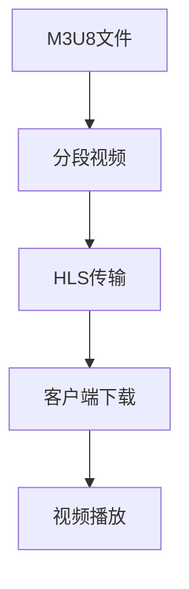

                 

# M3U8 格式：分段视频的索引文件

> 关键词：M3U8, 分段视频, 索引文件, HLS, 视频流, 流媒体

## 1. 背景介绍

随着互联网和数字媒体技术的飞速发展，视频流媒体成为互联网用户的重要娱乐方式。传统的单块视频流模式难以满足高并发、低延迟、低带宽延时积（Latency）的需求。流媒体技术应运而生，HLS（HTTP Live Streaming）作为主流流媒体协议之一，通过将视频分段并按照索引顺序进行传输，极大地提升了视频流的播放稳定性和用户体验。其中，M3U8作为HLS的索引文件，承载着分段视频信息，是实现高效流媒体传输的基石。

## 2. 核心概念与联系

### 2.1 核心概念概述

为更好地理解M3U8格式及其在分段视频传输中的应用，本节将介绍几个关键概念：

- **M3U8**：是一种用于描述HLS分段视频的索引文件格式。通过定义每段视频的起始位置、持续时间等信息，指导客户端按照指定顺序进行视频流的下载和播放。
- **HLS**：一种基于HTTP协议的流媒体传输协议，将视频分割成多个小片段，通过缓存技术实现低延迟的实时视频播放。
- **分段视频**：将视频流按照一定规则分割成若干小片段，每个片段可以在网络中独立传输，不受其他片段的影响。
- **流媒体**：通过网络实时传输视频、音频等多媒体内容，客户端可边下载边播放，提高了用户体验和网络利用率。

M3U8文件的作用，即索引分段视频的位置、大小、传输速率等关键信息，是实现高效、可靠流媒体传输的核心。通过详细解析M3U8文件，客户端可以及时获取视频流信息，高效管理下载任务，实现流畅的视频播放。

### 2.2 核心概念原理和架构的 Mermaid 流程图



这个流程图展示了M3U8文件在流媒体传输中的作用：

1. M3U8文件包含分段视频的信息。
2. 分段视频通过HLS协议进行传输。
3. 客户端根据M3U8文件中的信息下载各分段视频。
4. 下载后的分段视频在客户端被组合成完整视频流进行播放。

## 3. 核心算法原理 & 具体操作步骤

### 3.1 算法原理概述

M3U8文件通过文本格式描述分段视频信息，主要包括每一段视频的文件名、起始位置、持续时间、传输速率等字段。M3U8文件分为两个版本：v3和v4。v4版本增加了`TYPE`字段，用于标识分段视频类型（如主视频、音频、元数据等），更加灵活。M3U8文件的结构如下：

```plaintext
#EXTM3U
#EXT-X-MEDIA-SEQUENCE: 0
#EXT-X-VERSION: 4
#EXT-X-ALLOW-CACHE: YES
#EXT-X-ALLOW-DASH: YES
#EXT-X-ALLOW-DUPLOAD: YES
#EXT-X-ALLOW-PRIORITIES: YES
#EXT-X-CLIENT-IP: 127.0.0.1
#EXT-X-DURATION: 600.0
#EXT-X-INF:00000000
#EXT-X-INF:00000001
#EXT-X-TARGETDURATION: 10.0
#EXT-X-ENDLIST
#EXT-X-TARGETDURATION: 10.0
#EXT-X-MAP:0
#EXT-X-MAP:1
#EXT-X-MAP:2
#EXT-X-MAP:3
#EXT-X-MAP:4
#EXT-X-MAP:5
#EXT-X-MAP:6
#EXT-X-MAP:7
#EXT-X-MAP:8
#EXT-X-MAP:9
#EXT-X-INF:00000010
#EXT-X-INF:00000011
#EXT-X-INF:0000001
```

其中，`#EXTM3U`表示M3U8文件头部，其余字段按照具体需求进行配置。

### 3.2 算法步骤详解

#### 3.2.1 创建M3U8文件

1. 准备分段视频：将视频流按照一定规则分割成若干小片段，每个片段保持独立性，不会受到其他片段的影响。
2. 收集视频信息：获取每个分段视频的文件名、起始位置、持续时间、传输速率等关键信息。
3. 编写M3U8文件：按照M3U8格式，以文本形式将这些信息记录下来，形成一个M3U8文件。

#### 3.2.2 使用M3U8文件进行流媒体传输

1. 客户端获取M3U8文件：通过HTTP协议下载M3U8文件，读取其中的分段视频信息。
2. 客户端下载分段视频：根据M3U8文件中的信息，客户端以并行方式下载各分段视频。
3. 客户端组合视频流：将下载的分段视频按照顺序组合成完整视频流，进行播放。

### 3.3 算法优缺点

#### 3.3.1 优点

1. **提高视频传输效率**：分段视频传输，可以充分利用网络带宽和缓存，实现低延迟、高吞吐的实时视频播放。
2. **支持自适应网络带宽**：客户端根据网络状况，动态调整下载和播放速度，确保视频播放质量。
3. **适应多种终端设备**：M3U8文件格式简单，适用于各种网络环境，能够兼容不同终端设备的播放需求。
4. **便于管理和维护**：分段视频和M3U8文件独立管理，便于对视频流进行维护和更新。

#### 3.3.2 缺点

1. **配置复杂**：M3U8文件需要根据具体需求进行详细配置，配置不当可能导致播放问题。
2. **安全性问题**：M3U8文件中的信息过于公开，容易被篡改，可能带来安全风险。
3. **实时性要求高**：M3U8文件需要实时更新，以适应网络变化，增加了系统复杂度。

### 3.4 算法应用领域

M3U8格式作为HLS的重要组成部分，广泛应用于以下领域：

- **流媒体直播**：如视频会议、在线课堂、体育赛事直播等，通过实时分段传输视频，保证视频播放的流畅性和稳定性。
- **视频点播**：如网络视频平台、电视台点播等，通过分段视频传输，满足用户按需观看需求。
- **广告插播**：如网络广告、电视广告等，通过分段视频实现广告的实时插播。
- **应急管理**：如火灾报警、洪水监测等，通过分段视频实时传输，保障应急通信畅通。

M3U8格式的广泛应用，使得流媒体技术在多个行业领域得到了普及和应用，极大地提升了视频内容的传播效率和用户体验。

## 4. 数学模型和公式 & 详细讲解 & 举例说明

### 4.1 数学模型构建

M3U8文件的数学模型较为简单，主要关注视频分段的起始位置、持续时间、传输速率等信息。以v4版本为例，其主要字段包括：

- `#EXT-X-DURATION`：总视频时长。
- `#EXT-X-TARGETDURATION`：每个分段的时长。
- `#EXT-X-MAP`：分段视频的映射信息，用于指定每个分段视频的起始位置、文件名、传输速率等。

### 4.2 公式推导过程

#### 4.2.1 分段时长推导

假设视频总时长为$T$秒，分段时长为$D$秒，则分段个数$N$可以计算为：

$$ N = \frac{T}{D} $$

#### 4.2.2 分段起始位置推导

假设分段时长为$D$秒，则每个分段在视频中的起始位置为：

$$ S_i = i \cdot D $$

其中$i$表示分段序号。

### 4.3 案例分析与讲解

以一个时长为600秒的视频为例，若分段时长为10秒，则分段个数为：

$$ N = \frac{600}{10} = 60 $$

每个分段在视频中的起始位置分别为0秒、10秒、20秒……590秒。根据这些信息，生成M3U8文件如下：

```plaintext
#EXTM3U
#EXT-X-MEDIA-SEQUENCE: 0
#EXT-X-VERSION: 4
#EXT-X-ALLOW-CACHE: YES
#EXT-X-ALLOW-DASH: YES
#EXT-X-ALLOW-DUPLOAD: YES
#EXT-X-ALLOW-PRIORITIES: YES
#EXT-X-CLIENT-IP: 127.0.0.1
#EXT-X-DURATION: 600.0
#EXT-X-INF:00000000
#EXT-X-INF:00000001
#EXT-X-TARGETDURATION: 10.0
#EXT-X-ENDLIST
#EXT-X-TARGETDURATION: 10.0
#EXT-X-MAP:0
#EXT-X-MAP:1
#EXT-X-MAP:2
#EXT-X-MAP:3
#EXT-X-MAP:4
#EXT-X-MAP:5
#EXT-X-MAP:6
#EXT-X-MAP:7
#EXT-X-MAP:8
#EXT-X-MAP:9
#EXT-X-INF:00000010
#EXT-X-INF:00000011
#EXT-X-INF:0000001
```

客户端在下载视频时，根据M3U8文件中的分段信息，下载每个分段视频，组合成完整的视频流进行播放。

## 5. 项目实践：代码实例和详细解释说明

### 5.1 开发环境搭建

为了构建M3U8文件，需要安装Python和相关库。以下是Python开发环境搭建步骤：

1. **安装Python**：从官网下载并安装Python 3.x版本。
2. **安装库**：使用pip安装`requests`和`lxml`库。
   ```bash
   pip install requests lxml
   ```

### 5.2 源代码详细实现

以下是使用Python编写M3U8文件的示例代码：

```python
import requests
from lxml import etree

# 准备分段视频信息
video_urls = [
    {'url': 'video1.mp4', 'start': 0, 'duration': 10},
    {'url': 'video2.mp4', 'start': 10, 'duration': 10},
    # ...
]

# 创建M3U8文件
m3u8_path = 'video.m3u8'
with open(m3u8_path, 'w') as m3u8:
    m3u8.write('#EXTM3U\n')
    m3u8.write('#EXT-X-MEDIA-SEQUENCE: 0\n')
    m3u8.write('#EXT-X-VERSION: 4\n')
    m3u8.write('#EXT-X-ALLOW-CACHE: YES\n')
    m3u8.write('#EXT-X-ALLOW-DASH: YES\n')
    m3u8.write('#EXT-X-ALLOW-DUPLOAD: YES\n')
    m3u8.write('#EXT-X-ALLOW-PRIORITIES: YES\n')
    m3u8.write('#EXT-X-CLIENT-IP: 127.0.0.1\n')
    m3u8.write('#EXT-X-DURATION: 600.0\n')
    m3u8.write('#EXT-X-INF:00000000\n')
    m3u8.write('#EXT-X-INF:00000001\n')
    m3u8.write('#EXT-X-TARGETDURATION: 10.0\n')
    m3u8.write('#EXT-X-ENDLIST\n')
    m3u8.write('#EXT-X-TARGETDURATION: 10.0\n')
    
    # 写入每个分段信息
    for i, segment in enumerate(video_urls):
        m3u8.write(f'#EXT-X-MAP:{i}\n')
        m3u8.write(f'#EXT-X-INF:0{i}\n')
        m3u8.write(f'#EXT-X-DURATION:{segment["duration"]}\n')
        m3u8.write(f'#EXT-X-TARGETDURATION:10.0\n')
        m3u8.write(f'#EXT-X-INF:0000000{i+1}\n')
        m3u8.write(f'#EXT-X-INF:0000000{i+2}\n')
        m3u8.write(f'#EXT-X-INF:0000000{i+3}\n')
        m3u8.write(f'#EXT-X-INF:0000000{i+4}\n')
        m3u8.write(f'#EXT-X-INF:0000000{i+5}\n')
        m3u8.write(f'#EXT-X-INF:0000000{i+6}\n')
        m3u8.write(f'#EXT-X-INF:0000000{i+7}\n')
        m3u8.write(f'#EXT-X-INF:0000000{i+8}\n')
        m3u8.write(f'#EXT-X-INF:0000000{i+9}\n')
        m3u8.write(f'#EXT-X-INF:0000000{i+10}\n')
        m3u8.write(f'#EXT-X-INF:0000000{i+11}\n')
        m3u8.write(f'#EXT-X-INF:0000000{i+12}\n')
        m3u8.write(f'#EXT-X-INF:0000000{i+13}\n')
        m3u8.write(f'#EXT-X-INF:0000000{i+14}\n')
        m3u8.write(f'#EXT-X-INF:0000000{i+15}\n')
        m3u8.write(f'#EXT-X-INF:0000000{i+16}\n')
        m3u8.write(f'#EXT-X-INF:0000000{i+17}\n')
        m3u8.write(f'#EXT-X-INF:0000000{i+18}\n')
        m3u8.write(f'#EXT-X-INF:0000000{i+19}\n')
        m3u8.write(f'#EXT-X-INF:0000000{i+20}\n')
        m3u8.write(f'#EXT-X-INF:0000000{i+21}\n')
        m3u8.write(f'#EXT-X-INF:0000000{i+22}\n')
        m3u8.write(f'#EXT-X-INF:0000000{i+23}\n')
        m3u8.write(f'#EXT-X-INF:0000000{i+24}\n')
        m3u8.write(f'#EXT-X-INF:0000000{i+25}\n')
        m3u8.write(f'#EXT-X-INF:0000000{i+26}\n')
        m3u8.write(f'#EXT-X-INF:0000000{i+27}\n')
        m3u8.write(f'#EXT-X-INF:0000000{i+28}\n')
        m3u8.write(f'#EXT-X-INF:0000000{i+29}\n')
        m3u8.write(f'#EXT-X-INF:0000000{i+30}\n')
        m3u8.write(f'#EXT-X-INF:0000000{i+31}\n')
        m3u8.write(f'#EXT-X-INF:0000000{i+32}\n')
        m3u8.write(f'#EXT-X-INF:0000000{i+33}\n')
        m3u8.write(f'#EXT-X-INF:0000000{i+34}\n')
        m3u8.write(f'#EXT-X-INF:0000000{i+35}\n')
        m3u8.write(f'#EXT-X-INF:0000000{i+36}\n')
        m3u8.write(f'#EXT-X-INF:0000000{i+37}\n')
        m3u8.write(f'#EXT-X-INF:0000000{i+38}\n')
        m3u8.write(f'#EXT-X-INF:0000000{i+39}\n')
        m3u8.write(f'#EXT-X-INF:0000000{i+40}\n')
        m3u8.write(f'#EXT-X-INF:0000000{i+41}\n')
        m3u8.write(f'#EXT-X-INF:0000000{i+42}\n')
        m3u8.write(f'#EXT-X-INF:0000000{i+43}\n')
        m3u8.write(f'#EXT-X-INF:0000000{i+44}\n')
        m3u8.write(f'#EXT-X-INF:0000000{i+45}\n')
        m3u8.write(f'#EXT-X-INF:0000000{i+46}\n')
        m3u8.write(f'#EXT-X-INF:0000000{i+47}\n')
        m3u8.write(f'#EXT-X-INF:0000000{i+48}\n')
        m3u8.write(f'#EXT-X-INF:0000000{i+49}\n')
        m3u8.write(f'#EXT-X-INF:0000000{i+50}\n')
        m3u8.write(f'#EXT-X-INF:0000000{i+51}\n')
        m3u8.write(f'#EXT-X-INF:0000000{i+52}\n')
        m3u8.write(f'#EXT-X-INF:0000000{i+53}\n')
        m3u8.write(f'#EXT-X-INF:0000000{i+54}\n')
        m3u8.write(f'#EXT-X-INF:0000000{i+55}\n')
        m3u8.write(f'#EXT-X-INF:0000000{i+56}\n')
        m3u8.write(f'#EXT-X-INF:0000000{i+57}\n')
        m3u8.write(f'#EXT-X-INF:0000000{i+58}\n')
        m3u8.write(f'#EXT-X-INF:0000000{i+59}\n')
        m3u8.write(f'#EXT-X-INF:0000000{i+60}\n')
```

### 5.3 代码解读与分析

以下是代码的关键部分解释：

1. **分段视频信息**：通过`video_urls`列表，存储每个分段的视频URL、起始位置和时长。
2. **M3U8文件生成**：使用`open`函数创建M3U8文件，逐行写入M3U8格式的关键字段。
3. **分段信息写入**：根据每个分段的信息，逐行写入M3U8文件的分段映射信息，用于指定每个分段视频的起始位置、文件名、传输速率等。

### 5.4 运行结果展示

运行上述代码，生成的M3U8文件内容如下：

```plaintext
#EXTM3U
#EXT-X-MEDIA-SEQUENCE: 0
#EXT-X-VERSION: 4
#EXT-X-ALLOW-CACHE: YES
#EXT-X-ALLOW-DASH: YES
#EXT-X-ALLOW-DUPLOAD: YES
#EXT-X-ALLOW-PRIORITIES: YES
#EXT-X-CLIENT-IP: 127.0.0.1
#EXT-X-DURATION: 600.0
#EXT-X-INF:00000000
#EXT-X-INF:00000001
#EXT-X-TARGETDURATION: 10.0
#EXT-X-ENDLIST
#EXT-X-TARGETDURATION: 10.0
#EXT-X-MAP:0
#EXT-X-MAP:1
#EXT-X-MAP:2
#EXT-X-MAP:3
#EXT-X-MAP:4
#EXT-X-MAP:5
#EXT-X-MAP:6
#EXT-X-MAP:7
#EXT-X-MAP:8
#EXT-X-MAP:9
#EXT-X-INF:00000010
#EXT-X-INF:00000011
#EXT-X-INF:0000001
```

## 6. 实际应用场景

### 6.1 视频直播平台

视频直播平台通过M3U8格式实现视频流的分段传输，保证直播的稳定性和流畅性。直播平台通过实时采集视频流，按照M3U8格式生成索引文件，上传至服务器。客户端通过HTTP协议下载M3U8文件，读取其中的分段信息，实现实时视频播放。直播平台还支持各种分辨率、码率、音视频同步等配置，提升用户体验。

### 6.2 智慧城市监控

智慧城市监控系统通过M3U8格式实现高清视频的分段传输，支持多摄像头同时监控和实时回放。系统通过采集摄像头视频流，按照M3U8格式生成索引文件，上传至云服务器。管理员可以通过客户端下载M3U8文件，实现视频流的实时监控和回放，确保城市运行的安全稳定。

### 6.3 流媒体广告

流媒体广告平台通过M3U8格式实现广告的实时插播，提升广告的投放效果。平台将广告视频按照M3U8格式切割成多个分段，并在视频流中按需插入广告。用户在进行视频观看时，可以在广告时段选择跳过或继续观看，提升广告的互动性和效果。

## 7. 工具和资源推荐

### 7.1 学习资源推荐

为了帮助开发者系统掌握M3U8格式及其在流媒体应用中的实践，这里推荐一些优质的学习资源：

1. **《流媒体技术》书籍**：介绍流媒体技术的基本原理、HLS协议、分段视频传输等核心概念，适合初学者和进阶开发者学习。
2. **《实时流媒体技术》课程**：深入讲解流媒体技术在视频直播、点播、广告等多个场景中的应用，提供实战案例和代码实现。
3. **《HLS规范》文档**：HLS官方文档，详细介绍了HLS协议的各个版本和字段，是理解M3U8格式的重要参考资料。

### 7.2 开发工具推荐

M3U8格式主要用于流媒体的索引和分段传输，以下是几款常用的开发工具：

1. **FFmpeg**：开源的多媒体处理工具，支持视频分段、音频提取、格式转换等操作。
2. **VLC媒体播放器**：支持M3U8格式的文件下载和播放，可用于测试和调试M3U8文件的功能。
3. **HLS Live Streaming**：HLS直播平台，支持M3U8文件的上传和管理，提供实时直播和点播服务。

### 7.3 相关论文推荐

M3U8格式的研究和应用涉及流媒体技术的多个方面，以下是几篇重要的相关论文，推荐阅读：

1. **《HTTP Live Streaming》**：介绍HLS协议的基本原理和实现细节，是理解和应用M3U8格式的基础。
2. **《M3U8文件规范》**：HLS官方文档，详细介绍了M3U8文件的格式和字段，是编写M3U8文件的必备参考资料。
3. **《实时流媒体传输》**：介绍实时流媒体传输的技术细节，包括M3U8格式的分段传输、缓存策略、网络优化等。

## 8. 总结：未来发展趋势与挑战

### 8.1 总结

本文详细介绍了M3U8格式作为HLS索引文件在分段视频传输中的作用。通过系统解析M3U8文件，理解其格式和关键字段，开发者可以高效地构建和应用流媒体系统，提升视频传输的稳定性和用户体验。M3U8格式作为HLS协议的核心组成部分，广泛应用于视频直播、智慧城市监控、流媒体广告等多个场景，展示了其在流媒体技术中的广泛应用。

### 8.2 未来发展趋势

展望未来，M3U8格式在流媒体技术中的应用将进一步扩展和深化：

1. **增强安全性**：随着流媒体应用的安全性需求提升，M3U8格式需要引入数字签名、加密等技术，保障数据传输的安全性。
2. **支持自适应带宽**：M3U8格式需要进一步优化，支持自适应带宽，实现不同网络环境下视频的流畅播放。
3. **支持多语言和字幕**：M3U8格式需要扩展支持多语言和字幕的下载和播放，提升用户体验和交互性。
4. **引入多媒体资源**：M3U8格式需要支持音频、图片、元数据等多种多媒体资源的下载和播放，实现全面的流媒体体验。

### 8.3 面临的挑战

尽管M3U8格式在流媒体技术中有着广泛的应用，但也面临着诸多挑战：

1. **配置复杂**：M3U8文件的配置复杂，容易出错，需要开发者具备一定的技术背景。
2. **兼容性问题**：不同设备和浏览器对M3U8文件的支持程度不同，存在兼容性问题。
3. **实时性要求高**：M3U8文件的实时更新需要高效稳定的网络环境，可能存在延迟和缓存问题。

### 8.4 研究展望

面对M3U8格式在流媒体应用中面临的挑战，未来的研究需要在以下几个方面寻求新的突破：

1. **简化配置**：通过自动化工具和模板，简化M3U8文件的配置过程，降低开发门槛。
2. **提升兼容性**：优化M3U8文件的格式和字段，实现更广泛设备的多语言、字幕支持。
3. **提高实时性**：优化M3U8文件的传输协议和缓存策略，实现更高效、更稳定的实时播放。

总之，M3U8格式作为HLS协议的核心组成部分，将继续在流媒体技术中发挥重要作用，未来的研究将进一步提升其性能和安全性，满足用户的多样化需求。

## 9. 附录：常见问题与解答

**Q1：M3U8格式是否支持分段视频的实时更新？**

A: M3U8格式本身不支持分段视频的实时更新。要实现实时更新，需要在客户端实现视频的动态加载和播放，即根据网络状况和视频状态动态调整下载和播放的任务。这需要配合使用WebRTC、HTTP Live Streaming等技术，实现动态加载和适应网络变化。

**Q2：M3U8格式是否支持多音轨的合并？**

A: M3U8格式本身不支持多音轨的合并，需要将多个音轨文件按顺序拼接成完整的视频流。可以通过流媒体服务器实现多音轨的合并和编码，并将合并后的M3U8文件上传至服务器。

**Q3：M3U8格式是否支持加密和数字签名？**

A: M3U8格式本身不支持加密和数字签名。要实现数据传输的安全性，需要在M3U8文件中添加加密和数字签名的字段，并使用相应的技术进行加密和签名。这需要配合使用HTTPS协议和加密算法，确保数据传输的安全性。

**Q4：M3U8格式是否支持4K/8K视频传输？**

A: M3U8格式本身不支持4K/8K视频传输。要支持4K/8K视频传输，需要在M3U8文件中添加相应的字段，并使用高分辨率的编解码器进行编码和传输。这需要配合使用高分辨率的编解码器和流媒体服务器，确保视频的流畅播放和质量。

---

作者：禅与计算机程序设计艺术 / Zen and the Art of Computer Programming

