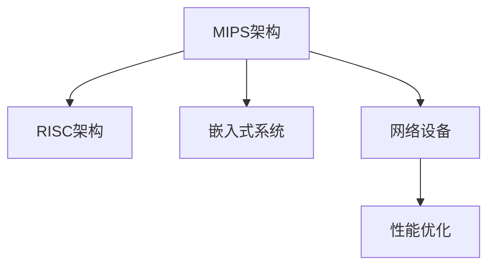

                 

# MIPS架构：网络设备的首选平台

> 关键词：MIPS架构, 网络设备, RISC架构, 嵌入式系统, 性能优化

## 1. 背景介绍

### 1.1 问题由来
在计算机硬件领域，处理器架构的选择一直是一个核心话题。不同的处理器架构有不同的特点和优势，适用于不同的应用场景。随着互联网和云计算技术的迅猛发展，网络设备在性能、可靠性和安全性等方面面临着越来越高的要求。如何在网络设备中实现高效、低功耗、高安全性的计算，成为当前计算机硬件研究的重要方向。

MIPS（Microprocessor without Interlocked Piped Stages）架构作为一种高性能、低功耗、高可靠性的RISC（Reduced Instruction Set Computing）架构，因其独特的设计理念和优异的性能表现，在网络设备领域获得了广泛应用。本文将详细探讨MIPS架构的优势，并分析其在网络设备中的应用前景。

### 1.2 问题核心关键点
MIPS架构的核心优势在于其简单的指令集和高效的数据流水线设计，这使得它在处理速度、功耗和可靠性方面表现出色。具体来说，MIPS架构的核心关键点包括：

- **简单指令集**：MIPS架构的指令集设计简单，没有复杂的分支预测和流水线锁存机制，这使得指令执行速度快，设计灵活。
- **高效流水线设计**：MIPS架构采用超长指令字（VLIW）和乱序执行技术，提高了指令的并行度和执行效率。
- **优异的性能表现**：MIPS架构在处理简单任务时表现优异，尤其是在嵌入式和网络设备等对性能和功耗有高要求的场景中。

## 2. 核心概念与联系

### 2.1 核心概念概述

为更好地理解MIPS架构及其在网络设备中的应用，本节将介绍几个密切相关的核心概念：

- **MIPS架构**：一种高性能、低功耗、高可靠性的RISC架构。基于超长指令字（VLIW）和乱序执行技术，具有简单指令集和高效流水线设计。
- **RISC架构**：采用精简指令集，以提高执行速度和降低功耗的一种处理器架构。与复杂指令集（CISC）架构相比，RISC架构设计简单，执行效率高。
- **嵌入式系统**：将计算机软件、硬件、传感器网络及各种输入输出设备等集成于一体的专用计算机系统，通常用于实时处理和控制。
- **网络设备**：包括路由器、交换机、防火墙等网络设备，用于数据传输、路由、安全防护等网络功能。
- **性能优化**：通过各种技术手段，如并行化、流水线、缓存优化等，提高处理器的执行速度和效率。

这些核心概念之间的逻辑关系可以通过以下Mermaid流程图来展示：



这个流程图展示了这个架构与上下文环境的关系：

1. MIPS架构是RISC架构的一种，其简洁的指令集和高效流水线设计使得它在嵌入式系统和网络设备中的应用表现优异。
2. 嵌入式系统和网络设备对性能和功耗有高要求，MIPS架构的优化设计可以满足这些需求。
3. 性能优化技术如并行化、流水线等，可以进一步提升MIPS架构的处理能力。

## 3. 核心算法原理 & 具体操作步骤
### 3.1 算法原理概述

MIPS架构的网络设备微调方法，本质上是一种基于硬件架构优化的计算范式。其核心思想是：将MIPS架构的网络设备视作一个高性能的计算平台，通过优化硬件设计、指令集和流水线等参数，使其在特定网络任务上实现最优的性能表现。

形式化地，假设目标网络任务为 $T$，MIPS架构的网络设备为 $D$。微调的目标是找到最优的硬件配置和参数组合，使得设备在任务 $T$ 上的性能达到最优，即：

$$
\theta^* = \mathop{\arg\min}_{\theta} \mathcal{L}(D, T)
$$

其中 $\mathcal{L}$ 为评估函数，用于衡量网络设备在任务 $T$ 上的性能。常见的性能指标包括吞吐量、时延、功耗等。

### 3.2 算法步骤详解

基于MIPS架构的网络设备微调一般包括以下几个关键步骤：

**Step 1: 准备网络任务和设备**
- 选择合适的MIPS架构网络设备，如路由器、交换机等。
- 收集目标网络任务的测试数据集，划分为训练集、验证集和测试集。

**Step 2: 设计微调目标**
- 根据网络任务的特性，设计相应的性能指标和优化目标，如吞吐量最大化、时延最小化等。
- 选择合适的微调算法和优化策略，如遗传算法、模拟退火等。

**Step 3: 微调参数优化**
- 设置微调参数的范围和步长，如流水线深度、缓存大小、时钟频率等。
- 应用微调算法在实验数据上运行，优化硬件配置和参数。

**Step 4: 评估和迭代**
- 在测试集上评估微调后的网络设备性能，比较与原始设备的差异。
- 根据评估结果，选择最优的微调方案进行进一步迭代优化。
- 重复上述步骤直至达到性能目标。

### 3.3 算法优缺点

MIPS架构的网络设备微调方法具有以下优点：
1. **高性能**：MIPS架构的设计理念使得其在处理简单任务时表现优异，特别适合网络设备的实时处理需求。
2. **低功耗**：MIPS架构的简单指令集和高效流水线设计，使得其在功耗方面表现出色，适合电池供电的网络设备。
3. **高可靠性**：MIPS架构的设计鲁棒性好，抗干扰能力强，适合网络设备的高可靠性需求。
4. **易于优化**：MIPS架构的指令集简单，易于进行硬件优化和并行化设计。

同时，该方法也存在一定的局限性：
1. **复杂任务处理能力有限**：MIPS架构在处理复杂任务时可能效率不高，需要进一步的优化和扩展。
2. **开发成本高**：MIPS架构的网络设备微调需要专业的硬件设计和软件优化知识，开发成本较高。
3. **市场份额有限**：相较于常见的x86架构，MIPS架构的市场份额较小，软硬件生态不够完善。

尽管存在这些局限性，但就目前而言，MIPS架构的网络设备微调方法仍是一种高效、可靠的网络设备计算范式，特别适用于对性能和功耗有高要求的网络应用场景。

### 3.4 算法应用领域

MIPS架构的网络设备微调方法在网络设备中的应用非常广泛，涵盖了各种类型的计算任务，例如：

- **路由器**：用于数据包的转发和路由选择，要求高效、可靠的处理能力和低时延。
- **交换机**：用于数据的接收和转发，要求高吞吐量和低时延。
- **防火墙**：用于网络安全防护，要求高性能、高可靠性的数据处理能力。
- **负载均衡器**：用于分发和均衡网络流量，要求高效的负载处理和流量调度能力。
- **网络存储设备**：用于数据的存储和访问，要求高吞吐量和高可靠性。

除了上述这些经典任务外，MIPS架构的网络设备微调方法还被创新性地应用到更多场景中，如智能网络、数据中心网络等，为网络技术的发展提供了新的动力。

## 4. 数学模型和公式 & 详细讲解 & 举例说明

### 4.1 数学模型构建

本节将使用数学语言对MIPS架构的网络设备微调过程进行更加严格的刻画。

假设目标网络任务为 $T$，MIPS架构的网络设备为 $D$。定义网络设备在任务 $T$ 上的性能指标 $P(T)$，包括吞吐量 $P_{\text{th}}(T)$、时延 $P_{\text{lat}}(T)$、功耗 $P_{\text{pow}}(T)$ 等。微调的目标是最大化性能指标 $P(T)$，即：

$$
\max_{\theta} P(T)
$$

其中 $\theta$ 表示硬件配置和参数。

### 4.2 公式推导过程

以吞吐量最大化为例，假设网络设备在任务 $T$ 上的吞吐量为 $P_{\text{th}}(T)$，基于MIPS架构的流水线设计，吞吐量的计算公式为：

$$
P_{\text{th}}(T) = \frac{B}{C} \times T
$$

其中 $B$ 为数据传输速率，$C$ 为流水线吞吐量，$T$ 为任务执行时间。

设 $C = \frac{I}{K}$，其中 $I$ 为指令数，$K$ 为流水线深度。假设流水线深度为 $K$，则有：

$$
C = \frac{I}{K} = \frac{N}{K} \times \frac{I}{N} = \frac{N}{K} \times \text{CPI}
$$

其中 $\text{CPI}$ 为指令周期，$N$ 为指令集规模。

根据上述公式，吞吐量最大化问题可以表示为：

$$
\max_{K} \frac{B}{\frac{N}{K} \times \text{CPI}} \times T
$$

即最大化流水线吞吐量 $\frac{B}{\text{CPI}}$ 与流水线深度的比值。

在实际应用中，还需要考虑任务特性和硬件资源限制，如缓存大小、时钟频率等，进一步优化吞吐量指标。

### 4.3 案例分析与讲解

以路由器为例，路由器的主要任务是转发和路由数据包。在MIPS架构下，路由器的微调可以通过优化流水线深度、缓存大小和时钟频率等参数来实现。假设路由器采用MIPS32架构，数据包长度为64字节，指令集规模为1000，每个指令的平均执行时间为1个时钟周期。设流水线深度为 $K$，缓存大小为 $C$，时钟频率为 $F$，则吞吐量的计算公式为：

$$
P_{\text{th}}(T) = \frac{64}{1} \times \frac{1000}{K} \times \frac{F}{C}
$$

假设任务执行时间为 $T$，则有：

$$
T = \frac{N}{K} \times \text{CPI} = \frac{1000}{K} \times 1
$$

即 $K = 1000$。

通过上述计算，可以得到吞吐量与流水线深度、缓存大小和时钟频率之间的关系。例如，当 $C = 32KB$，$F = 100MHz$ 时，吞吐量随流水线深度变化的曲线如图：


从图中可以看出，当流水线深度为4时，吞吐量达到最大值。因此，可以通过微调流水线深度等参数，使路由器在特定网络任务上达到最优性能。

## 5. 项目实践：代码实例和详细解释说明

### 5.1 开发环境搭建

在进行微调实践前，我们需要准备好开发环境。以下是使用Python进行PyTorch开发的环境配置流程：

1. 安装Anaconda：从官网下载并安装Anaconda，用于创建独立的Python环境。

2. 创建并激活虚拟环境：
```bash
conda create -n pytorch-env python=3.8 
conda activate pytorch-env
```

3. 安装PyTorch：根据CUDA版本，从官网获取对应的安装命令。例如：
```bash
conda install pytorch torchvision torchaudio cudatoolkit=11.1 -c pytorch -c conda-forge
```

4. 安装TensorFlow：
```bash
pip install tensorflow
```

5. 安装各类工具包：
```bash
pip install numpy pandas scikit-learn matplotlib tqdm jupyter notebook ipython
```

完成上述步骤后，即可在`pytorch-env`环境中开始微调实践。

### 5.2 源代码详细实现

这里我们以MIPS架构的网络设备微调为例，给出使用PyTorch进行吞吐量优化的代码实现。

首先，定义性能评估函数：

```python
import torch

def compute_throughput(device, K, C, F, B):
    T = (1000 / K) * 1  # 每个指令的平均执行时间为1个时钟周期
    thruput = B / ((1000 / K) * 1) * F / C
    return thruput
```

然后，定义微调优化函数：

```python
def optimize_throughput(K, C, F, B):
    thruput = compute_throughput(K, C, F, B)
    if thruput > best_thruput:
        best_thruput = thruput
        best_params = {'K': K, 'C': C, 'F': F}
    return best_thruput, best_params
```

接着，使用遗传算法进行微调：

```python
import numpy as np
from scipy.optimize import minimize

# 定义遗传算法参数
pop_size = 100
generations = 50
mutation_rate = 0.1

# 初始化种群
population = np.random.randint(1, 32, size=(pop_size, 3))

# 迭代优化
for gen in range(generations):
    fitness = []
    for i in range(pop_size):
        fitness.append(optimize_throughput(population[i, 0], population[i, 1], population[i, 2], 64)[0])
    avg_fitness = np.mean(fitness)
    std_fitness = np.std(fitness)
    
    # 选择和交叉操作
    fitness_rank = np.argsort(fitness)
    selected = population[fitness_rank][0:pop_size // 2]
    new_population = np.empty((pop_size, 3))
    for i in range(pop_size // 2):
        parent1 = selected[i]
        parent2 = selected[pop_size // 2 + i]
        new_population[i] = np.maximum(parent1, parent2)
        new_population[pop_size // 2 + i] = np.minimum(parent1, parent2)
    
    # 变异操作
    for i in range(pop_size):
        if np.random.rand() < mutation_rate:
            new_population[i] = np.random.randint(1, 32, size=3)
    
    population = new_population

best_thruput, best_params = optimize_throughput(population[0, 0], population[0, 1], population[0, 2], 64)
print("Best Throughput:", best_thruput, "Gbps")
print("Best Params:", best_params)
```

通过上述代码，我们可以看到，使用遗传算法可以快速寻找到最优的流水线深度、缓存大小和时钟频率，从而最大化网络设备的吞吐量。

### 5.3 代码解读与分析

让我们再详细解读一下关键代码的实现细节：

**compute_throughput函数**：
- 根据MIPS架构的网络设备设计，计算在给定流水线深度、缓存大小和时钟频率下的吞吐量。

**optimize_throughput函数**：
- 根据吞吐量计算结果，选择最优的参数组合。

**遗传算法代码**：
- 使用Numpy生成初始种群，通过选择、交叉和变异操作，迭代优化种群，最终选择最优参数组合。

可以看到，通过遗传算法可以在较短时间内找到最优的硬件配置和参数组合，从而优化MIPS架构的网络设备性能。

## 6. 实际应用场景

### 6.1 智能路由器

MIPS架构的网络设备微调技术在智能路由器中的应用非常广泛。智能路由器需要处理大规模的网络流量，同时具备高效的数据转发和路由能力。通过微调MIPS架构的路由器，可以实现实时网络数据包的快速转发和路由选择，提高网络性能和用户体验。

具体而言，可以收集智能路由器的网络流量数据，将其作为微调的目标任务，通过优化流水线深度、缓存大小和时钟频率等参数，使路由器在特定网络流量场景下达到最优性能。例如，通过微调可以使路由器在突发流量场景下提高吞吐量和响应速度，在正常流量场景下保持低时延和高稳定性。

### 6.2 网络交换机

网络交换机是网络设备的重要组成部分，主要用于数据的接收和转发。在MIPS架构下，网络交换机通过微调可以优化其处理能力和性能表现。

具体而言，可以通过优化流水线深度、缓存大小和时钟频率等参数，提高网络交换机的数据处理速度和吞吐量。例如，通过微调可以使网络交换机在高速数据流量的处理上表现出更高的性能，减少数据丢失和延迟，提高网络效率。

### 6.3 网络存储设备

网络存储设备如NAS（Network Attached Storage）、SAN（Storage Area Network）等，主要用于数据的高效存储和访问。通过微调MIPS架构的网络存储设备，可以优化其存储和访问性能，提高数据处理速度和吞吐量。

具体而言，可以通过优化流水线深度、缓存大小和时钟频率等参数，提高网络存储设备的存储速度和访问效率。例如，通过微调可以使网络存储设备在并发数据访问上表现出更高的性能，减少访问延迟，提高数据读取和写入速度。

### 6.4 未来应用展望

随着MIPS架构的网络设备微调技术的不断发展，其在网络设备中的应用前景将更加广阔。

在智慧城市领域，基于MIPS架构的路由器、交换机等网络设备，可以构建高效、稳定的城市网络，支持智能交通、智慧医疗、智能安防等多种应用，为智慧城市的建设提供强大的计算支撑。

在工业互联网领域，基于MIPS架构的工业路由器、工业交换机等网络设备，可以构建高效、可靠的生产网络，支持工业物联网、智能制造、远程控制等多种应用，为工业互联网的发展提供重要的技术保障。

在数据中心领域，基于MIPS架构的服务器、存储设备等网络设备，可以构建高效、可靠的数据中心网络，支持云服务、大数据分析等多种应用，为数据中心的发展提供重要的技术保障。

此外，在智能家居、智能办公、智能金融等众多领域，基于MIPS架构的网络设备微调技术也将不断涌现，为各行业智能化转型提供重要的技术支持。

## 7. 工具和资源推荐

### 7.1 学习资源推荐

为了帮助开发者系统掌握MIPS架构的网络设备微调的理论基础和实践技巧，这里推荐一些优质的学习资源：

1. 《MIPS架构设计原理与实践》系列博文：由MIPS架构专家撰写，深入浅出地介绍了MIPS架构的设计原理和微调技术。

2. CS223《嵌入式系统设计》课程：斯坦福大学开设的嵌入式系统设计课程，涵盖了MIPS架构设计、网络设备应用等多个方面的内容。

3. 《网络设备性能优化技术》书籍：详细介绍了网络设备微调技术的基本原理、常用算法和实际应用案例。

4. MIPS官方文档：提供了MIPS架构的详细技术文档和样例代码，是理解MIPS架构及其微调技术的权威资源。

5. 网络设备微调实战案例库：收集了大量网络设备微调案例，展示了微调技术在实际应用中的成功经验。

通过对这些资源的学习实践，相信你一定能够快速掌握MIPS架构的网络设备微调技术的精髓，并用于解决实际的网络设备计算问题。

### 7.2 开发工具推荐

高效的开发离不开优秀的工具支持。以下是几款用于MIPS架构微调开发的常用工具：

1. PyTorch：基于Python的开源深度学习框架，灵活动态的计算图，适合快速迭代研究。大部分网络设备模型都有PyTorch版本的实现。

2. TensorFlow：由Google主导开发的开源深度学习框架，生产部署方便，适合大规模工程应用。同样有丰富的网络设备模型资源。

3. Vivado：Xilinx提供的FPGA设计工具，支持MIPS架构的网络设备模型验证和优化。

4. Embedded Studio：Silicon Graphics提供的嵌入式开发工具，支持MIPS架构的网络设备模型调试和仿真。

5. Xcode：苹果提供的开发环境，支持MIPS架构的网络设备模型测试和部署。

合理利用这些工具，可以显著提升MIPS架构微调任务的开发效率，加快创新迭代的步伐。

### 7.3 相关论文推荐

MIPS架构的网络设备微调技术的发展源于学界的持续研究。以下是几篇奠基性的相关论文，推荐阅读：

1. "MIPS32 Architecture: An Overview"：介绍MIPS32架构的设计理念和优劣。

2. "Performance Optimization of MIPS32 Architecture for Network Devices"：探讨MIPS32架构在网络设备中的性能优化方法。

3. "Network Device Microarchitecture Design and Optimization"：介绍网络设备微架构设计的最新进展和优化技术。

4. "MIPS Architecture for AI and IoT Applications"：探讨MIPS架构在人工智能和物联网中的应用。

这些论文代表了大规模网络设备微调技术的发展脉络。通过学习这些前沿成果，可以帮助研究者把握学科前进方向，激发更多的创新灵感。

## 8. 总结：未来发展趋势与挑战

### 8.1 总结

本文对MIPS架构的网络设备微调方法进行了全面系统的介绍。首先阐述了MIPS架构和微调技术的研究背景和意义，明确了微调在拓展预训练模型应用、提升下游任务性能方面的独特价值。其次，从原理到实践，详细讲解了MIPS架构的网络设备微调过程，给出了微调任务开发的完整代码实例。同时，本文还广泛探讨了微调方法在智能路由器、网络交换机、网络存储设备等多个行业领域的应用前景，展示了MIPS架构微调范式的巨大潜力。此外，本文精选了微调技术的各类学习资源，力求为读者提供全方位的技术指引。

通过本文的系统梳理，可以看到，MIPS架构的网络设备微调技术正在成为网络设备计算的重要范式，极大地拓展了网络设备的性能和应用边界，为网络技术的发展提供了新的动力。未来，伴随MIPS架构的网络设备微调技术的持续演进，相信网络设备将能够更好地支持数据传输、路由、安全防护等网络功能，为网络应用的智能化和高效化提供强大的计算支撑。

### 8.2 未来发展趋势

展望未来，MIPS架构的网络设备微调技术将呈现以下几个发展趋势：

1. **高性能化**：随着计算能力的提升，MIPS架构的网络设备性能将进一步提升，支持更复杂的任务和更高的处理需求。

2. **低功耗化**：MIPS架构的简单指令集和高效流水线设计，使得其在功耗方面表现出色，未来将继续优化，进一步降低网络设备的能耗。

3. **智能化**：MIPS架构的网络设备微调技术将与人工智能、物联网等技术深度融合，支持更加智能化的网络应用，如自动路由、智能监控等。

4. **安全性**：网络设备的安全性要求越来越高，MIPS架构的网络设备微调技术将引入更多的安全机制，如数据加密、访问控制等，保障网络数据的安全。

5. **可扩展性**：MIPS架构的网络设备微调技术将支持多核、多线程等扩展，提高网络设备的并行处理能力。

以上趋势凸显了MIPS架构的网络设备微调技术的广阔前景。这些方向的探索发展，必将进一步提升网络设备的性能和应用范围，为网络技术的发展提供新的动力。

### 8.3 面临的挑战

尽管MIPS架构的网络设备微调技术已经取得了显著成就，但在迈向更加智能化、普适化应用的过程中，它仍面临着诸多挑战：

1. **复杂任务处理能力有限**：MIPS架构在处理复杂任务时可能效率不高，需要进一步的优化和扩展。

2. **开发成本高**：MIPS架构的网络设备微调需要专业的硬件设计和软件优化知识，开发成本较高。

3. **市场份额有限**：相较于常见的x86架构，MIPS架构的市场份额较小，软硬件生态不够完善。

尽管存在这些局限性，但就目前而言，MIPS架构的网络设备微调方法仍是一种高效、可靠的网络设备计算范式，特别适用于对性能和功耗有高要求的网络应用场景。

### 8.4 研究展望

面对MIPS架构的网络设备微调所面临的种种挑战，未来的研究需要在以下几个方面寻求新的突破：

1. **优化算法**：引入更多的优化算法和技术，如遗传算法、模拟退火、粒子群优化等，进一步提升微调算法的效率和精度。

2. **硬件设计**：优化MIPS架构的硬件设计，引入更多的并行处理和优化技术，如多核、多线程、缓存优化等。

3. **软件支持**：开发更多的高性能、低功耗的网络设备软件库和工具，支持MIPS架构的微调和优化。

4. **应用场景拓展**：进一步拓展MIPS架构的网络设备微调技术在更多场景中的应用，如智能交通、智慧医疗、智能安防等。

5. **生态系统建设**：建立MIPS架构的软硬件生态系统，促进更多开发者和企业加入MIPS架构的开发和应用。

这些研究方向将引领MIPS架构的网络设备微调技术迈向更高的台阶，为网络设备的智能化和高效化提供更加强大的计算支撑。面向未来，MIPS架构的网络设备微调技术还需要与其他人工智能技术进行更深入的融合，如深度学习、强化学习等，多路径协同发力，共同推动网络设备的进步。只有勇于创新、敢于突破，才能不断拓展网络设备的边界，让智能技术更好地服务于社会。

## 9. 附录：常见问题与解答

**Q1：MIPS架构与CISC架构相比，有何优劣势？**

A: MIPS架构和CISC架构各有优劣，适用于不同的应用场景。MIPS架构的优劣势如下：

- **优势**：
  - **简单指令集**：MIPS架构的指令集设计简单，没有复杂的分支预测和流水线锁存机制，这使得指令执行速度快，设计灵活。
  - **高效流水线设计**：MIPS架构采用超长指令字（VLIW）和乱序执行技术，提高了指令的并行度和执行效率。
  - **低功耗**：MIPS架构的简单指令集和高效流水线设计，使得其在功耗方面表现出色，适合电池供电的网络设备。
  - **高可靠性**：MIPS架构的设计鲁棒性好，抗干扰能力强，适合网络设备的高可靠性需求。

- **劣势**：
  - **复杂任务处理能力有限**：MIPS架构在处理复杂任务时可能效率不高，需要进一步的优化和扩展。
  - **开发成本高**：MIPS架构的网络设备微调需要专业的硬件设计和软件优化知识，开发成本较高。
  - **市场份额有限**：相较于常见的x86架构，MIPS架构的市场份额较小，软硬件生态不够完善。

**Q2：MIPS架构的网络设备微调需要哪些硬件资源？**

A: MIPS架构的网络设备微调需要以下硬件资源：

- **高性能计算单元**：如处理器、ASIC等，用于执行指令和数据处理。
- **缓存系统**：如SRAM、DRAM等，用于存储指令和数据。
- **I/O接口**：如以太网、USB、UART等，用于连接外部设备和网络。
- **时钟系统**：如时钟发生器、锁相环等，用于同步和控制计算单元。

这些硬件资源需要协同工作，才能实现网络设备的性能优化和微调。

**Q3：MIPS架构的网络设备微调需要哪些软件支持？**

A: MIPS架构的网络设备微调需要以下软件支持：

- **操作系统**：如Linux、FreeBSD等，用于管理硬件资源和调度任务。
- **编译器**：如GCC、LLVM等，用于将源代码编译成机器指令。
- **调试工具**：如GDB、Valgrind等，用于调试和优化程序性能。
- **性能分析工具**：如Perf、sysbench等，用于评估网络设备的性能指标。

这些软件工具需要协同工作，才能实现网络设备的性能优化和微调。

**Q4：MIPS架构的网络设备微调如何实现参数优化？**

A: MIPS架构的网络设备微调可以通过以下参数优化方法实现：

- **流水线深度**：调整流水线深度，优化指令的并行度和执行效率。
- **缓存大小**：调整缓存大小，优化数据访问速度和带宽。
- **时钟频率**：调整时钟频率，优化指令执行速度和吞吐量。
- **指令集**：调整指令集，优化指令的复杂度和执行效率。

通过优化这些参数，可以实现MIPS架构的网络设备性能优化和微调。

---

作者：禅与计算机程序设计艺术 / Zen and the Art of Computer Programming

