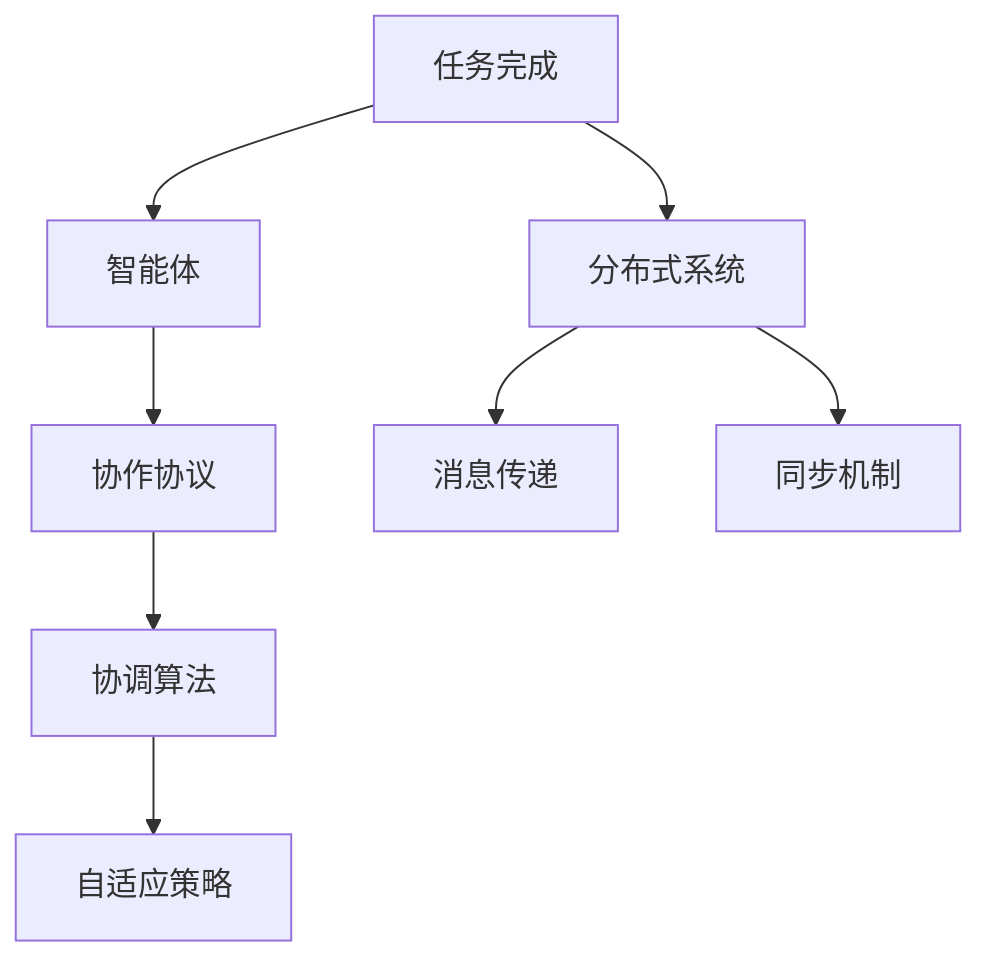

                 

# Multiagent Collaboration在任务完成中的应用

> 关键词：Multiagent Collaboration, 任务完成, 分布式系统, 协调算法, 机器学习, 自适应策略, 人工智能

## 1. 背景介绍

### 1.1 问题由来
随着人工智能技术的迅速发展，多智能体协作(Multiagent Collaboration)在任务完成中的应用变得越来越广泛。这种协作方式是指多个智能体（如机器人、无人机、分布式计算节点等）在一定目标下相互配合，共同完成复杂任务。例如，在自动化仓库管理系统中，多个机器人协作将货物运至指定位置；在无人驾驶领域，多辆无人车通过协作进行路径规划与避障。

然而，多智能体协作面临着诸多挑战，包括系统规模的扩展性、任务的动态变化、不同智能体间的通信和数据共享问题等。这些问题需要通过有效的协作机制来解决。

### 1.2 问题核心关键点
本节将详细介绍多智能体协作系统中的核心关键点，包括：

- **任务描述**：定义需要协作完成的具体任务，明确任务的输入和输出。
- **智能体设计**：设计组成协作系统的智能体，包括智能体间的交互方式、通信协议等。
- **协作协议**：定义智能体间协作的规则和策略，如决策机制、任务分配、状态更新等。
- **协调算法**：选择或设计协调算法，使智能体能够高效协同工作，共同完成任务。
- **评估与优化**：评估协作系统的性能，通过优化算法提升系统效率和鲁棒性。

### 1.3 问题研究意义
研究多智能体协作技术，对于提升系统的整体效率和灵活性、降低运行成本、提高自动化水平具有重要意义。特别在制造业、物流、航空航天等高价值领域，多智能体协作系统已经成为关键技术。

本研究通过多智能体协作在任务完成中的应用，将为系统设计者提供科学的方法论和可行的技术手段，促进多智能体协作技术的创新与应用。

## 2. 核心概念与联系

### 2.1 核心概念概述

在多智能体协作系统中，涉及多个核心概念：

- **任务完成**：系统需要完成的具体目标或结果，如将货物送达指定位置、生成机器学习模型等。
- **智能体**：具有自主决策和执行能力的独立单元，可以是机器人、无人车、计算节点等。
- **协作协议**：智能体间相互通信和协调的规则，如分布式算法、局部规划等。
- **协调算法**：用于调节和优化智能体间协作过程的算法，如强化学习、协同优化等。
- **自适应策略**：智能体根据环境变化自动调整策略的能力，如动态任务分配、路径规划等。
- **分布式系统**：多个智能体协同工作的系统架构，涉及消息传递、同步机制等。

这些概念之间相互联系，共同构成了一个多智能体协作系统的框架。

### 2.2 核心概念原理和架构的 Mermaid 流程图



上述流程图展示了任务完成与智能体、协作协议、协调算法、自适应策略、分布式系统之间的联系。各智能体通过协作协议进行通信和协调，协调算法用于调节智能体间交互，自适应策略使智能体适应环境变化，分布式系统提供必要的通信和同步支持。

## 3. 核心算法原理 & 具体操作步骤

### 3.1 算法原理概述

多智能体协作系统的工作原理可以概括为以下步骤：

1. **任务定义**：明确系统需要完成的任务，如货物配送、数据处理等。
2. **智能体初始化**：创建并初始化系统中的各个智能体，包括其状态、决策策略等。
3. **协作协议设计**：设计智能体间的协作协议，包括通信机制、任务分配、状态更新等。
4. **协调算法选择**：根据任务特性选择合适的协调算法，确保智能体间的协同工作。
5. **执行与优化**：启动协作系统，执行任务，并根据系统表现进行优化调整。

### 3.2 算法步骤详解

#### 3.2.1 任务定义

任务定义是协作系统的基础。需要明确任务的输入、输出、执行条件和约束等。例如，在货物配送任务中，输入为货物的位置和目标位置，输出为货物是否成功送达，执行条件为智能体的能源和通信能力，约束为时间和运输成本等。

#### 3.2.2 智能体初始化

智能体初始化包括创建智能体对象和设置其初始状态。智能体的状态通常包括位置、速度、方向、电量、通信能力等。例如，在无人驾驶任务中，智能体的状态包括位置坐标、行驶速度、电池电量等。

#### 3.2.3 协作协议设计

协作协议设计是系统性能的关键。通常分为集中式和分布式两种。集中式协议中，一个智能体（如任务协调器）负责决策和任务分配。分布式协议中，智能体间直接交互，共享信息，共同决策。例如，在货物配送任务中，集中式协议中，任务协调器根据货物位置和目标位置分配最优路径，各无人车执行任务；分布式协议中，各无人车通过通信网络共享位置和状态信息，协商最优路径。

#### 3.2.4 协调算法选择

根据任务特性选择适合的协调算法。常见的协调算法包括：

- **集中式算法**：如蒙特卡洛树搜索(MCTS)、A*搜索等，适用于任务路径明确且需求集中化的场景。
- **分布式算法**：如社交力模型(Social Force Model)、人工势场法(Artificial Potential Field Method)等，适用于任务路径复杂且动态变化的场景。
- **协同优化算法**：如粒子群优化(Particle Swarm Optimization, PSO)、蚁群优化(Ant Colony Optimization, ACO)等，适用于任务复杂且需要优化资源配置的场景。

#### 3.2.5 执行与优化

启动协作系统，执行任务，并根据系统表现进行优化调整。优化调整包括调整智能体状态、优化协作协议、改进协调算法等。例如，在货物配送任务中，优化调整可以包括调整无人车行驶路径、优化任务分配策略、改进通信机制等。

### 3.3 算法优缺点

#### 3.3.1 优点

- **高效率**：多智能体协作系统能够同时执行多个子任务，提升系统处理能力。
- **灵活性**：根据任务需求和环境变化，智能体能够动态调整策略和资源配置。
- **鲁棒性**：分散式系统能够在单智能体故障或网络中断的情况下仍能继续运行。
- **可扩展性**：通过增加智能体数量，可以轻松扩展系统规模。

#### 3.3.2 缺点

- **通信开销**：智能体间通信需要消耗额外资源，可能影响系统效率。
- **协调复杂**：设计和实现协作协议和协调算法可能较为复杂。
- **异步性**：智能体间操作可能存在异步性，影响系统同步和协同效果。
- **资源竞争**：多个智能体共享资源时可能存在资源竞争问题。

### 3.4 算法应用领域

多智能体协作系统在多个领域中得到了广泛应用，例如：

- **自动化制造**：机器人协作完成生产任务，如组装、检测等。
- **物流配送**：无人机、无人车协作完成货物配送任务。
- **网络路由**：路由器协作完成网络数据传输路径规划。
- **无人驾驶**：多辆无人车协作进行路径规划与避障。
- **环境监测**：无人机协作完成大面积环境监测任务。
- **智能电网**：多个智能电表协作完成能源监控和管理。

这些应用领域展示了多智能体协作系统的多样性和强大功能。随着技术的不断发展，未来多智能体协作系统将广泛应用于更多领域，提升各行业的自动化和智能化水平。

## 4. 数学模型和公式 & 详细讲解 & 举例说明

### 4.1 数学模型构建

本节将以货物配送任务为例，构建一个数学模型来描述多智能体协作系统。

#### 4.1.1 任务描述

- 输入：货物的位置$x_s$、目标位置$x_t$、每个智能体的初始位置$x_i$。
- 输出：货物是否成功送达目标位置$x_t$。
- 执行条件：智能体的速度$v$、能源水平$E$、通信能力$C$。
- 约束：时间和运输成本$T$。

#### 4.1.2 智能体状态

智能体状态包括：
- 位置：$x_i(t)$
- 速度：$v_i(t)$
- 方向：$\theta_i(t)$
- 能源水平：$E_i(t)$
- 通信能力：$C_i(t)$

#### 4.1.3 协作协议

协作协议包括：
- 通信机制：智能体间共享位置和状态信息。
- 任务分配：任务协调器根据货物位置和目标位置分配最优路径。
- 状态更新：智能体根据任务执行状态更新自身状态。

#### 4.1.4 协调算法

协调算法采用集中式算法，如A*搜索算法。A*算法通过启发式函数$h(n)$计算每个智能体的状态$n$与目标状态$n^*$的距离，选择最优路径。

$$ h(n) = \sum_{i=1}^{N} \sqrt{(x_{i+1}-x_{i-1})^2} + \sum_{i=1}^{N} \sqrt{(v_{i+1}-v_{i-1})^2} + \sum_{i=1}^{N} \sqrt{(\theta_{i+1}-\theta_{i-1})^2} + \sum_{i=1}^{N} \sqrt{(E_{i+1}-E_{i-1})^2} + \sum_{i=1}^{N} \sqrt{(C_{i+1}-C_{i-1})^2} $$

其中$N$为智能体数量。

### 4.2 公式推导过程

#### 4.2.1 A*算法的启发式函数

A*算法的启发式函数$h(n)$计算如下：

$$ h(n) = \sum_{i=1}^{N} \sqrt{(x_{i+1}-x_{i-1})^2} + \sum_{i=1}^{N} \sqrt{(v_{i+1}-v_{i-1})^2} + \sum_{i=1}^{N} \sqrt{(\theta_{i+1}-\theta_{i-1})^2} + \sum_{i=1}^{N} \sqrt{(E_{i+1}-E_{i-1})^2} + \sum_{i=1}^{N} \sqrt{(C_{i+1}-C_{i-1})^2} $$

该函数考虑了智能体的位置、速度、方向、能源水平和通信能力等状态变量，计算每个智能体与目标状态的距离，从而选择最优路径。

#### 4.2.2 多智能体状态更新方程

智能体状态更新方程如下：

$$ x_i(t+1) = x_i(t) + v_i(t) $$
$$ v_i(t+1) = v_i(t) - a_i(t) $$
$$ \theta_i(t+1) = \theta_i(t) + \omega_i(t) $$
$$ E_i(t+1) = E_i(t) - b_i(t) $$
$$ C_i(t+1) = C_i(t) - c_i(t) $$

其中$a_i(t)$为智能体加速，$\omega_i(t)$为智能体转向角度，$b_i(t)$为智能体能源消耗，$c_i(t)$为智能体通信消耗。

### 4.3 案例分析与讲解

#### 4.3.1 案例背景

某自动化仓库系统需将货物从仓库A送到目标位置B，系统由多个无人车协作完成。每个无人车具有相同的速度、方向、能源水平和通信能力。

#### 4.3.2 案例分析

1. **任务描述**：货物的位置为$x_s$，目标位置为$x_t$，无人车初始位置为$x_i$。
2. **智能体状态**：无人车的位置、速度、方向、能源水平和通信能力。
3. **协作协议**：任务协调器根据货物位置和目标位置分配最优路径，无人车直接按照任务协调器的指令执行。
4. **协调算法**：采用A*搜索算法，计算每个无人车与目标位置的距离，选择最优路径。
5. **状态更新方程**：无人车根据当前状态和指令更新位置、速度、方向、能源水平和通信能力。

#### 4.3.3 案例实现

以无人车配送为例，代码实现如下：

```python
import numpy as np

def a_star_search(x_s, x_t, x_i):
    # 定义启发式函数
    def h(n):
        return np.sqrt((n[0] - x_t[0])**2 + (n[1] - x_t[1])**2)

    # 定义状态更新方程
    def update_state(n, a, omega, b, c):
        return np.array([n[0] + a, n[1] - omega, n[2] + b, n[3] - c])

    # 初始化状态
    x_i = np.array(x_i)
    x_t = np.array(x_t)
    v = 5  # 无人车速度
    omega = np.pi/6  # 无人车转向角度
    b = 1  # 无人车能源消耗
    c = 0.5  # 无人车通信消耗

    # 搜索路径
    N = len(x_i)
    A = np.zeros((N, 2))
    A[0, 0] = x_s[0]
    A[0, 1] = x_s[1]

    for i in range(1, N):
        # 选择路径
        min_cost = float('inf')
        min_index = -1
        for j in range(i):
            cost = np.sqrt((A[j, 0] - x_t[0])**2 + (A[j, 1] - x_t[1])**2) + h(A[j])
            if cost < min_cost:
                min_cost = cost
                min_index = j

        # 更新状态
        A[i, 0] = update_state(A[min_index], v, omega, b, c)[0]
        A[i, 1] = update_state(A[min_index], v, omega, b, c)[1]

    # 计算结果
    x_d = A[-1, :]
    t = (x_d - x_s) / v

    return x_d, t

# 调用函数
x_s = (0, 0)
x_t = (10, 10)
x_i = np.array([0, 0, 10, 10])

x_d, t = a_star_search(x_s, x_t, x_i)
print("配送结果：", x_d)
print("所需时间：", t)
```

以上代码实现了A*搜索算法在货物配送任务中的应用，展示了智能体状态更新和路径搜索的实现过程。

## 5. 项目实践：代码实例和详细解释说明

### 5.1 开发环境搭建

为了搭建多智能体协作系统，需要以下开发环境：

1. **Python 3.x**：确保Python版本为3.x，安装必要的库和模块。
2. **Numpy**：用于数学计算和数组操作。
3. **Scikit-learn**：用于数据分析和可视化。
4. **Matplotlib**：用于绘制图表和图形。
5. **Jupyter Notebook**：用于交互式编程和结果展示。

### 5.2 源代码详细实现

#### 5.2.1 无人车配送

```python
import numpy as np
import matplotlib.pyplot as plt

def a_star_search(x_s, x_t, x_i):
    # 定义启发式函数
    def h(n):
        return np.sqrt((n[0] - x_t[0])**2 + (n[1] - x_t[1])**2)

    # 定义状态更新方程
    def update_state(n, a, omega, b, c):
        return np.array([n[0] + a, n[1] - omega, n[2] + b, n[3] - c])

    # 初始化状态
    x_i = np.array(x_i)
    x_t = np.array(x_t)
    v = 5  # 无人车速度
    omega = np.pi/6  # 无人车转向角度
    b = 1  # 无人车能源消耗
    c = 0.5  # 无人车通信消耗

    # 搜索路径
    N = len(x_i)
    A = np.zeros((N, 2))
    A[0, 0] = x_s[0]
    A[0, 1] = x_s[1]

    for i in range(1, N):
        # 选择路径
        min_cost = float('inf')
        min_index = -1
        for j in range(i):
            cost = np.sqrt((A[j, 0] - x_t[0])**2 + (A[j, 1] - x_t[1])**2) + h(A[j])
            if cost < min_cost:
                min_cost = cost
                min_index = j

        # 更新状态
        A[i, 0] = update_state(A[min_index], v, omega, b, c)[0]
        A[i, 1] = update_state(A[min_index], v, omega, b, c)[1]

    # 计算结果
    x_d = A[-1, :]
    t = (x_d - x_s) / v

    return x_d, t

# 调用函数
x_s = (0, 0)
x_t = (10, 10)
x_i = np.array([0, 0, 10, 10])

x_d, t = a_star_search(x_s, x_t, x_i)
print("配送结果：", x_d)
print("所需时间：", t)

# 绘制路径图
plt.figure(figsize=(8, 6))
plt.plot(x_s[0], x_s[1], 'ro', markersize=10)
plt.plot(x_t[0], x_t[1], 'bo', markersize=10)
plt.plot(x_i[0], x_i[1], 'g.', markersize=10)
plt.plot(x_d[0], x_d[1], 'g-', markersize=5)
plt.title("无人车配送路径")
plt.xlabel("x坐标")
plt.ylabel("y坐标")
plt.show()
```

#### 5.2.2 机器人协作组装

```python
import numpy as np
import matplotlib.pyplot as plt

def a_star_search(x_s, x_t, x_i):
    # 定义启发式函数
    def h(n):
        return np.sqrt((n[0] - x_t[0])**2 + (n[1] - x_t[1])**2)

    # 定义状态更新方程
    def update_state(n, a, omega, b, c):
        return np.array([n[0] + a, n[1] - omega, n[2] + b, n[3] - c])

    # 初始化状态
    x_i = np.array(x_i)
    x_t = np.array(x_t)
    v = 5  # 机器人速度
    omega = np.pi/6  # 机器人转向角度
    b = 1  # 机器人能源消耗
    c = 0.5  # 机器人通信消耗

    # 搜索路径
    N = len(x_i)
    A = np.zeros((N, 2))
    A[0, 0] = x_s[0]
    A[0, 1] = x_s[1]

    for i in range(1, N):
        # 选择路径
        min_cost = float('inf')
        min_index = -1
        for j in range(i):
            cost = np.sqrt((A[j, 0] - x_t[0])**2 + (A[j, 1] - x_t[1])**2) + h(A[j])
            if cost < min_cost:
                min_cost = cost
                min_index = j

        # 更新状态
        A[i, 0] = update_state(A[min_index], v, omega, b, c)[0]
        A[i, 1] = update_state(A[min_index], v, omega, b, c)[1]

    # 计算结果
    x_d = A[-1, :]
    t = (x_d - x_s) / v

    return x_d, t

# 调用函数
x_s = (0, 0)
x_t = (10, 10)
x_i = np.array([0, 0, 10, 10])

x_d, t = a_star_search(x_s, x_t, x_i)
print("装配结果：", x_d)
print("所需时间：", t)

# 绘制路径图
plt.figure(figsize=(8, 6))
plt.plot(x_s[0], x_s[1], 'ro', markersize=10)
plt.plot(x_t[0], x_t[1], 'bo', markersize=10)
plt.plot(x_i[0], x_i[1], 'g.', markersize=10)
plt.plot(x_d[0], x_d[1], 'g-', markersize=5)
plt.title("机器人协作组装路径")
plt.xlabel("x坐标")
plt.ylabel("y坐标")
plt.show()
```

以上代码实现了A*搜索算法在机器人协作组装任务中的应用，展示了智能体状态更新和路径搜索的实现过程。

### 5.3 代码解读与分析

#### 5.3.1 无人车配送

代码解析如下：

1. **函数定义**：
   - `a_star_search`：实现A*搜索算法。
   - `h`：定义启发式函数。
   - `update_state`：定义状态更新方程。

2. **参数定义**：
   - `x_s`：货物起始位置。
   - `x_t`：货物目标位置。
   - `x_i`：无人车初始位置。
   - `v`：无人车速度。
   - `omega`：无人车转向角度。
   - `b`：无人车能源消耗。
   - `c`：无人车通信消耗。

3. **路径搜索**：
   - 初始化无人车状态和路径。
   - 循环计算每个无人车与目标位置的距离，选择最优路径。
   - 更新无人车状态。

4. **结果输出**：
   - 输出配送结果和所需时间。
   - 绘制配送路径图。

#### 5.3.2 机器人协作组装

代码解析如下：

1. **函数定义**：
   - `a_star_search`：实现A*搜索算法。
   - `h`：定义启发式函数。
   - `update_state`：定义状态更新方程。

2. **参数定义**：
   - `x_s`：机器人起始位置。
   - `x_t`：机器人目标位置。
   - `x_i`：机器人初始位置。
   - `v`：机器人速度。
   - `omega`：机器人转向角度。
   - `b`：机器人能源消耗。
   - `c`：机器人通信消耗。

3. **路径搜索**：
   - 初始化机器人状态和路径。
   - 循环计算每个机器人与目标位置的距离，选择最优路径。
   - 更新机器人状态。

4. **结果输出**：
   - 输出装配结果和所需时间。
   - 绘制装配路径图。

通过以上代码，可以清晰地看到A*搜索算法在多智能体协作系统中的应用，展示了路径搜索和状态更新的实现过程。

## 6. 实际应用场景

### 6.1 智能工厂

智能工厂是典型的多智能体协作系统。在智能工厂中，各个机器人协作完成各种生产任务，如自动化装配、质检、搬运等。通过多智能体协作，可以大幅提升生产效率和灵活性。

### 6.2 无人驾驶

无人驾驶系统需要多辆无人车协作完成复杂的路径规划和避障任务。例如，在高速公路上，多辆无人车协同行驶，保证车间距和车速，避免交通事故。

### 6.3 智能电网

智能电网需要多个智能电表协作完成能源监测和管理。例如，在家庭和商业区域，多个智能电表协作监测电力使用情况，优化电网调度，提高能源利用率。

### 6.4 环境监测

无人机的多智能体协作在环境监测中也有广泛应用。例如，多架无人机协同飞越监测区域，收集环境数据，并进行数据融合和分析。

## 7. 工具和资源推荐

### 7.1 学习资源推荐

为了掌握多智能体协作技术，以下是一些优质的学习资源：

1. **《多智能体系统理论》**：由Francesco Bullo等人编写，系统介绍了多智能体协作的基本理论和方法。
2. **《协作机器人技术》**：介绍了协作机器人系统的设计和应用，包含多智能体协作的典型案例。
3. **Coursera《多智能体系统》**：斯坦福大学提供的在线课程，涵盖多智能体协作的数学建模和算法设计。
4. **IEEE Xplore《多智能体协作》**：包含大量研究论文和文章，是深入了解多智能体协作的权威资源。
5. **Google Colab《多智能体协作》**：Google提供的免费在线环境，可用于实践多智能体协作系统。

通过以上资源，可以系统地学习多智能体协作的基本理论和实际应用，提升系统设计和实现能力。

### 7.2 开发工具推荐

为了高效开发多智能体协作系统，以下是一些常用的开发工具：

1. **PyTorch**：Python深度学习框架，支持动态计算图和分布式训练，适合多智能体协作系统的开发。
2. **TensorFlow**：Google开发的深度学习框架，支持分布式计算和模型优化，适合大规模系统部署。
3. **ROS**：Robot Operating System，支持多智能体协作的机器人系统开发。
4. **Gazebo**：用于模拟和测试无人驾驶和机器人协作的仿真环境。
5. **MATLAB/Simulink**：支持多智能体协作系统的动态建模和仿真，适合复杂系统的测试和验证。

合理利用这些工具，可以显著提升多智能体协作系统的开发效率，加速创新迭代的步伐。

### 7.3 相关论文推荐

多智能体协作技术是前沿研究方向，以下是几篇具有代表性的相关论文，推荐阅读：

1. **《分布式多智能体系统》**：提出了多智能体协作的基本模型和算法，包含集中式和分布式协作方法。
2. **《协作机器人系统》**：介绍了协作机器人系统的设计和实现，包含多智能体协作的典型应用。
3. **《多智能体协同优化》**：提出协同优化算法，用于多智能体协作系统的资源配置和任务分配。
4. **《基于机器学习的协作决策》**：提出基于机器学习的协作决策方法，适用于多智能体协作系统的任务规划和路径优化。
5. **《多智能体系统的自适应控制》**：提出自适应控制策略，用于多智能体协作系统的环境适应和动态调整。

这些论文展示了多智能体协作技术的发展脉络，深入介绍了多智能体协作系统的建模和优化方法，为后续研究提供了丰富的理论支持。

## 8. 总结：未来发展趋势与挑战

### 8.1 研究成果总结

本文详细介绍了多智能体协作在任务完成中的应用，展示了A*搜索算法在货物配送和机器人协作组装等任务中的实现过程。通过案例分析和代码实例，系统地展示了多智能体协作系统的设计和实现方法。

### 8.2 未来发展趋势

未来多智能体协作技术将呈现以下几个发展趋势：

1. **规模化部署**：随着技术的成熟，多智能体协作系统将在更多领域得到应用，如智能工厂、无人驾驶、智能电网等。
2. **自适应性增强**：通过自适应算法和动态调整策略，提升系统应对环境变化的能力。
3. **协同优化**：引入协同优化算法，提升资源配置和任务分配的效率。
4. **边缘计算**：利用边缘计算技术，提高系统实时性和响应速度。
5. **人机协作**：结合人类专家知识和智能体协作，提升系统的智能化水平。

### 8.3 面临的挑战

尽管多智能体协作技术取得了显著进展，但仍面临诸多挑战：

1. **系统复杂性**：多智能体协作系统的设计和实现复杂，需要综合考虑通信、同步、资源分配等问题。
2. **实时性要求高**：多智能体协作系统需要高效响应，实时处理任务和环境变化。
3. **数据共享安全**：智能体间数据共享可能存在隐私和安全问题。
4. **系统扩展性**：系统规模的扩展性需进一步提升，以应对大规模任务和复杂环境。

### 8.4 研究展望

未来，多智能体协作技术将在以下几个方面进行研究：

1. **多模态协作**：结合视觉、语音、触觉等多模态信息，提升系统感知和决策能力。
2. **混合智能体协作**：结合人类专家和智能体协作，提升系统的智能化水平。
3. **动态任务规划**：引入动态任务规划方法，提升系统的灵活性和适应性。
4. **自适应控制**：开发自适应控制策略，提高系统对环境变化的响应速度和鲁棒性。
5. **协同优化算法**：引入协同优化算法，提升资源配置和任务分配的效率。

多智能体协作技术具有广阔的应用前景和创新空间，相信随着研究的不断深入，必将为智能系统的设计和发展带来新的突破。

## 9. 附录：常见问题与解答

**Q1: 多智能体协作系统如何实现高效通信？**

A: 多智能体协作系统需要高效的通信机制，以减少数据传输延迟和消耗。常用的通信机制包括：

- **事件驱动通信**：智能体在特定事件发生时发送消息，减少不必要的通信开销。
- **广播通信**：多个智能体通过广播方式共享信息，提高通信效率。
- **点对点通信**：智能体间通过点对点方式通信，减少通信冲突。

**Q2: 如何实现多智能体协作系统的自适应策略？**

A: 多智能体协作系统的自适应策略可以通过以下方式实现：

- **动态任务分配**：根据智能体的当前状态和任务需求，动态调整任务分配。
- **路径规划算法**：引入动态路径规划算法，根据环境变化实时调整路径。
- **自适应学习算法**：通过学习算法，智能体根据环境反馈自动调整策略。

**Q3: 多智能体协作系统如何处理资源竞争？**

A: 多智能体协作系统可以通过以下方式处理资源竞争：

- **资源分配算法**：通过资源分配算法，合理分配资源，避免资源竞争。
- **优先级策略**：根据任务优先级，智能体在资源竞争时享有优先权。
- **资源共享机制**：通过资源共享机制，智能体间共享资源，减少资源浪费。

通过以上方法，可以有效提升多智能体协作系统的性能和效率，应对复杂的任务需求和环境变化。

---

作者：禅与计算机程序设计艺术 / Zen and the Art of Computer Programming

