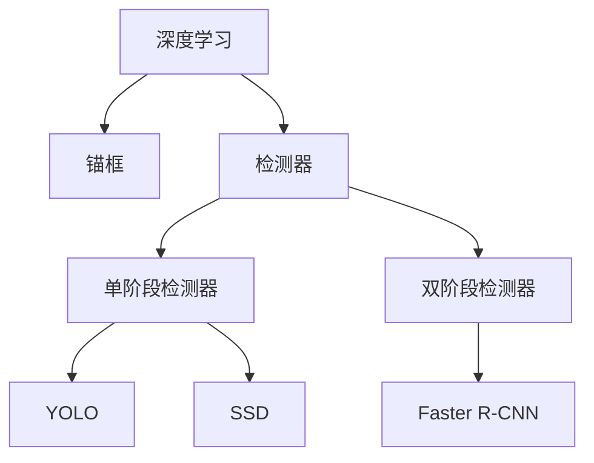

                 

# Object Detection原理与代码实例讲解

> 关键词：对象检测, 目标检测, 深度学习, Faster R-CNN, YOLO, SSD, 检测器, 锚框, 训练, 推理

## 1. 背景介绍

### 1.1 问题由来
对象检测（Object Detection）是计算机视觉领域的重要任务之一，旨在自动识别和定位图像或视频中的目标对象，并对它们进行分类。这个任务在自动驾驶、机器人视觉、医学影像分析、安防监控等多个领域有着广泛的应用。随着深度学习技术的发展，基于深度神经网络的对象检测算法已经成为主流方法，在准确性和速度上都有显著提升。

## 2. 核心概念与联系

### 2.1 核心概念概述

为了更好地理解对象检测的原理，本节将介绍几个核心概念及其之间的关系。

- **深度学习（Deep Learning）**：基于神经网络的机器学习技术，通过多层非线性变换，自动学习数据的特征表示。在对象检测中，深度学习模型通常用于提取图像特征和分类。
- **锚框（Anchor）**：检测算法通常使用多个不同尺度和长宽比的锚框来生成候选区域。这些锚框在图像上生成的位置和大小是预先定义的，以便捕捉目标对象的不同尺度。
- **检测器（Detector）**：检测器是对每个候选区域进行分类和回归的过程，用于预测该区域是否包含目标对象，以及目标对象的位置和大小。
- **单阶段（One-Stage）和双阶段（Two-Stage）检测器**：根据生成候选区域的方式不同，检测器可以分为单阶段和双阶段两类。单阶段检测器直接在图像上生成目标框，如YOLO和SSD；双阶段检测器首先生成候选区域，然后在每个区域上进行目标检测，如Faster R-CNN。

这些概念之间的关系可以通过以下Mermaid流程图来展示：



这个流程图展示了深度学习在对象检测中的核心作用，以及锚框和检测器之间的关系。单阶段和双阶段检测器是两种不同的生成候选区域的方法，分别对应YOLO和SSD以及Faster R-CNN等算法。

## 3. 核心算法原理 & 具体操作步骤

### 3.1 算法原理概述

对象检测的深度学习算法主要分为单阶段和双阶段两类。单阶段检测器如YOLO和SSD，直接在图像上生成目标框，并预测目标类别；双阶段检测器如Faster R-CNN，首先生成候选区域，然后在每个区域上进行目标检测。

以Faster R-CNN为例，其核心算法原理包括以下步骤：

1. 使用预先训练的特征提取器（如VGG、ResNet等）对输入图像进行特征提取。
2. 在特征图上生成候选区域（RoI池化）。
3. 对每个候选区域进行目标检测（分类和回归）。
4. 综合多尺度特征进行最终的目标检测。

### 3.2 算法步骤详解

以Faster R-CNN为例，下面详细介绍其具体的实现步骤：

**步骤1：特征提取**

在输入图像上使用预训练的特征提取器（如VGG、ResNet等）进行特征提取。特征提取器的输出是一个高维特征图，表示图像的语义特征。

**步骤2：RoI池化**

在特征图上生成候选区域（RoI, Region of Interest）。RoI池化是一种将不同大小的特征区域转换成固定大小特征向量的方法，以便后续进行目标检测。

**步骤3：区域提议**

使用选择性搜索（Selective Search）等方法在图像上生成候选区域，并对这些区域进行RoI池化，得到固定大小的特征向量。

**步骤4：目标检测**

对每个RoI池化后的特征向量进行目标检测，包括分类和回归两个过程。分类过程用于判断该RoI是否包含目标对象，回归过程用于预测目标对象的位置和大小。

**步骤5：综合多尺度特征**

将不同尺度特征图上的目标检测结果进行综合，得到最终的目标检测结果。

### 3.3 算法优缺点

Faster R-CNN算法的主要优点包括：

- 精度高：双阶段检测器可以在多个尺度上提取特征，提高检测精度。
- 可扩展性强：可以在不同尺度上生成候选区域，适应不同大小的目标对象。
- 可扩展性强：适用于不同目标分类任务。

其主要缺点包括：

- 计算量大：生成候选区域和RoI池化需要大量的计算资源。
- 速度慢：双阶段检测器的整体速度较慢，不适合实时应用。

### 3.4 算法应用领域

对象检测技术在多个领域有着广泛的应用，如：

- 自动驾驶：检测道路上的车辆、行人、交通标志等。
- 安防监控：检测监控视频中的异常行为、犯罪嫌疑人等。
- 医疗影像：检测医学影像中的肿瘤、病变等。
- 零售行业：检测顾客行为，提高商品推荐精度。

## 4. 数学模型和公式 & 详细讲解 & 举例说明

### 4.1 数学模型构建

在对象检测中，常用的数学模型包括：

- **损失函数**：用于衡量模型预测结果与真实标签之间的差异。
- **目标检测的分类损失函数**：如交叉熵损失、Focal Loss等。
- **目标检测的回归损失函数**：如平滑L1损失、平方差损失等。

以Faster R-CNN为例，其目标检测的损失函数包括分类损失和回归损失两部分：

$$
L = L_{cls} + \lambda L_{reg}
$$

其中，$L_{cls}$为分类损失，$L_{reg}$为回归损失，$\lambda$为分类损失与回归损失的权重。

### 4.2 公式推导过程

以Faster R-CNN为例，下面推导其目标检测损失函数的计算过程：

**分类损失（交叉熵损失）**：

$$
L_{cls} = -\sum_{i=1}^{N}(y_i \log p_i + (1-y_i) \log(1-p_i))
$$

其中，$y_i$为真实标签，$p_i$为模型预测的概率，$N$为样本数量。

**回归损失（平滑L1损失）**：

$$
L_{reg} = \frac{1}{N} \sum_{i=1}^{N} \sum_{j=1}^{4} (r_{j,i} - t_{j,i})^2 \mathbb{I}(|r_{j,i} - t_{j,i}| < \epsilon) + (|r_{j,i} - t_{j,i}| - \frac{1}{2} \epsilon)^2 \mathbb{I}(|r_{j,i} - t_{j,i}| \geq \epsilon)
$$

其中，$r_{j,i}$为模型预测的位置和大小，$t_{j,i}$为真实标签的位置和大小，$\epsilon$为平滑因子，$\mathbb{I}$为示性函数。

### 4.3 案例分析与讲解

以Faster R-CNN为例，下面通过一个简单的案例来说明其目标检测的过程。

假设有一张包含目标对象的图片，使用Faster R-CNN进行检测：

1. 首先，在图像上使用VGG-16作为特征提取器，生成高维特征图。
2. 在特征图上生成候选区域，并进行RoI池化。
3. 对每个RoI进行分类和回归，得到目标检测结果。
4. 综合不同尺度特征进行最终的目标检测。

通过这个案例，可以看到Faster R-CNN如何进行特征提取、候选区域生成和目标检测，并最终输出目标检测结果。

## 5. 项目实践：代码实例和详细解释说明

### 5.1 开发环境搭建

在进行对象检测的代码实现前，需要准备好开发环境。以下是使用Python进行TensorFlow开发的环境配置流程：

1. 安装Anaconda：从官网下载并安装Anaconda，用于创建独立的Python环境。

2. 创建并激活虚拟环境：
```bash
conda create -n tensorflow-env python=3.8 
conda activate tensorflow-env
```

3. 安装TensorFlow：根据CUDA版本，从官网获取对应的安装命令。例如：
```bash
conda install tensorflow -c tf -c conda-forge
```

4. 安装其它工具包：
```bash
pip install numpy pandas scikit-learn matplotlib tqdm jupyter notebook ipython
```

完成上述步骤后，即可在`tensorflow-env`环境中开始对象检测的代码实现。

### 5.2 源代码详细实现

下面以Faster R-CNN为例，给出使用TensorFlow进行对象检测的代码实现。

首先，定义特征提取器：

```python
import tensorflow as tf
from tensorflow.keras.applications import vgg16

model = vgg16.VGG16(weights='imagenet', include_top=False, input_shape=(224, 224, 3))
```

然后，定义目标检测模型：

```python
class FasterRCNN(tf.keras.Model):
    def __init__(self, num_classes):
        super(FasterRCNN, self).__init__()
        self.num_classes = num_classes
        self.roi_pooling = tf.keras.layers.MaxPooling2D(pool_size=(7, 7), strides=(2, 2), padding='valid')
        self.fc1 = tf.keras.layers.Dense(4096, activation='relu')
        self.fc2 = tf.keras.layers.Dense(4096, activation='relu')
        self.fc3 = tf.keras.layers.Dense(num_classes + 4, activation='linear')

    def call(self, inputs):
        x = model(inputs)
        x = self.roi_pooling(x)
        x = tf.keras.layers.Flatten()(x)
        x = self.fc1(x)
        x = self.fc2(x)
        x = self.fc3(x)
        return x
```

接着，定义损失函数：

```python
def compute_loss(labels, preds):
    cls_loss = tf.keras.losses.categorical_crossentropy(labels[:, 0:1], preds[:, 0:1])
    reg_loss = tf.keras.losses.mean_squared_error(labels[:, 1:5], preds[:, 1:5])
    return cls_loss + 0.5 * reg_loss
```

最后，定义训练函数：

```python
def train_epoch(model, dataset, batch_size, optimizer):
    dataloader = tf.data.Dataset.from_tensor_slices((dataset.x_train, dataset.y_train)).batch(batch_size)
    model.train()
    epoch_loss = 0
    for batch in dataloader:
        inputs, labels = batch
        preds = model(inputs)
        loss = compute_loss(labels, preds)
        epoch_loss += loss.numpy()
        optimizer.minimize(loss)
    return epoch_loss / len(dataset)
```

以上就是使用TensorFlow对Faster R-CNN进行对象检测的完整代码实现。可以看到，TensorFlow提供了强大的模型构建和优化工具，使得对象检测模型的实现变得简洁高效。

### 5.3 代码解读与分析

让我们再详细解读一下关键代码的实现细节：

**FasterRCNN类**：
- `__init__`方法：初始化模型参数，包括特征提取器、全连接层等。
- `call`方法：前向传播计算，包括RoI池化和全连接层。

**compute_loss函数**：
- 定义了分类损失和回归损失，并返回总损失。

**train_epoch函数**：
- 使用TensorFlow的Dataset API加载训练数据，按批次进行训练。
- 计算并优化损失函数。
- 返回每个epoch的平均损失。

## 6. 实际应用场景

### 6.1 智能安防

对象检测技术在智能安防领域有着广泛的应用。通过部署摄像头和对象检测模型，可以实时监控监控视频，检测异常行为和犯罪嫌疑人，提高安全防范能力。

在技术实现上，可以将Faster R-CNN模型部署到GPU服务器上，实时处理监控视频，检测并报警异常行为。同时，还可以结合视频分析和人脸识别技术，实现更精准的安全监测。

### 6.2 自动驾驶

自动驾驶是另一个重要的应用场景，对象检测技术在其中扮演着重要的角色。通过在车辆上安装摄像头和对象检测模型，可以实时检测道路上的车辆、行人、交通标志等，帮助自动驾驶系统做出安全决策。

在技术实现上，可以将Faster R-CNN模型部署到嵌入式设备上，实时处理相机图像，检测并识别道路上的障碍物，为自动驾驶系统提供决策支持。

### 6.3 医疗影像

在医疗影像领域，对象检测技术可以用于检测医学影像中的肿瘤、病变等。通过在影像上运行Faster R-CNN模型，可以自动识别和标注异常区域，辅助医生进行诊断和治疗。

在技术实现上，可以将Faster R-CNN模型部署到医疗影像分析系统中，实时处理医学影像，检测并标记异常区域，提升诊疗效率和准确性。

### 6.4 未来应用展望

随着深度学习技术的发展，对象检测技术在未来将有更广阔的应用前景。以下是一些可能的应用方向：

- **3D对象检测**：结合三维点云数据和深度学习模型，实现三维空间中的对象检测。
- **跨模态对象检测**：结合视觉、语音、文本等多种模态数据，实现跨模态的对象检测。
- **实时目标跟踪**：通过在视频流中实时检测目标，实现目标跟踪和行为分析。
- **可解释性对象检测**：通过可解释性模型，解释对象检测结果的推理过程，提高系统可信度。
- **联邦学习**：在分布式环境中，通过联邦学习技术，在保护隐私的前提下，实现跨机构的目标检测模型共享。

这些方向的应用将进一步拓展对象检测技术的应用边界，为人工智能技术在垂直行业的落地提供更多的可能性。

## 7. 工具和资源推荐

### 7.1 学习资源推荐

为了帮助开发者系统掌握对象检测的理论基础和实践技巧，这里推荐一些优质的学习资源：

1. 《Object Detection with TensorFlow》系列博文：由TensorFlow官方博客作者撰写，详细介绍了TensorFlow在对象检测中的应用。

2. 《Single-Shot MultiBox Detector: Efficient Detection with Deep Neural Networks》论文：YOLO的论文，介绍了YOLO模型的原理和实现。

3. 《Faster R-CNN: Towards Real-Time Object Detection with Region Proposal Networks》论文：Faster R-CNN的论文，介绍了Faster R-CNN模型的原理和实现。

4. 《SSD: Single Shot MultiBox Detector》论文：SSD的论文，介绍了SSD模型的原理和实现。

5. 《Hands-On Object Detection with TensorFlow》书籍：全面介绍了TensorFlow在对象检测中的应用，包括模型构建、训练和推理等。

通过学习这些资源，相信你一定能够快速掌握对象检测的核心算法和技术细节，并用于解决实际的计算机视觉问题。

### 7.2 开发工具推荐

高效的开发离不开优秀的工具支持。以下是几款用于对象检测开发的常用工具：

1. TensorFlow：基于Python的开源深度学习框架，灵活动态的计算图，适合快速迭代研究。

2. PyTorch：基于Python的开源深度学习框架，动态计算图，适合科研和生产部署。

3. OpenCV：计算机视觉库，提供了丰富的图像处理和分析功能，支持对象检测任务的实现。

4. Darknet：YOLO的实现，提供了简单的命令行工具和预训练模型，适合快速实验。

5. GluonCV：深度学习模型库，提供了多种目标检测模型的实现和接口，适合快速应用。

合理利用这些工具，可以显著提升对象检测任务的开发效率，加快创新迭代的步伐。

### 7.3 相关论文推荐

对象检测技术的发展源于学界的持续研究。以下是几篇奠基性的相关论文，推荐阅读：

1. R-CNN: Rich Feature Hierarchies for Accurate Object Detection and Semantic Segmentation：介绍R-CNN模型，是目标检测领域的基础。

2. Fast R-CNN: Towards Real-Time Object Detection with Region Proposal Networks：介绍Faster R-CNN模型，是双阶段检测器。

3. Faster R-CNN: Towards Real-Time Object Detection with Region Proposal Networks：介绍Faster R-CNN模型，是双阶段检测器。

4. SSD: Single Shot MultiBox Detector：介绍SSD模型，是单阶段检测器。

5. YOLO: Real-Time Object Detection：介绍YOLO模型，是单阶段检测器。

这些论文代表了大模型微调技术的发展脉络。通过学习这些前沿成果，可以帮助研究者把握学科前进方向，激发更多的创新灵感。

## 8. 总结：未来发展趋势与挑战

### 8.1 总结

本文对基于深度学习的大语言模型微调方法进行了全面系统的介绍。首先阐述了对象检测的背景和意义，明确了其在计算机视觉领域的重要性。其次，从原理到实践，详细讲解了对象检测的数学模型和核心算法，给出了对象检测任务的完整代码实现。同时，本文还广泛探讨了对象检测技术在智能安防、自动驾驶、医疗影像等领域的实际应用，展示了对象检测技术的巨大潜力。此外，本文精选了对象检测技术的各类学习资源，力求为读者提供全方位的技术指引。

通过本文的系统梳理，可以看到，基于深度学习的对象检测方法已经成为计算机视觉领域的重要工具，其高效、准确、鲁棒的特性使其在多个领域中得到了广泛应用。未来，随着深度学习技术的进一步发展，对象检测技术必将迎来更大的突破，为人类认知智能的进化带来深远影响。

### 8.2 未来发展趋势

展望未来，对象检测技术将呈现以下几个发展趋势：

1. **高精度和鲁棒性**：随着深度学习技术的进一步发展，对象检测算法的精度和鲁棒性将不断提高，能够适应更复杂的场景和任务。

2. **实时性**：随着模型压缩和优化技术的进步，对象检测算法的实时性将进一步提升，能够满足实时应用的需求。

3. **可解释性**：随着模型解释性技术的进步，对象检测算法的可解释性将进一步增强，能够提供更可信的推理过程。

4. **跨模态融合**：随着跨模态学习技术的进步，对象检测算法将能够结合视觉、语音、文本等多种模态数据，实现跨模态的对象检测。

5. **联邦学习**：随着联邦学习技术的进步，对象检测算法将能够在不泄露隐私的前提下，在分布式环境中进行模型共享和优化。

这些趋势凸显了对象检测技术的广阔前景，这些方向的探索发展，必将进一步提升对象检测系统的性能和应用范围，为人类认知智能的进化带来深远影响。

### 8.3 面临的挑战

尽管深度学习在对象检测中取得了显著进展，但在迈向更加智能化、普适化应用的过程中，仍面临诸多挑战：

1. **标注成本高**：高质量的标注数据对于深度学习算法的训练至关重要，但标注数据的获取成本较高。如何降低标注成本，是一个亟待解决的问题。

2. **模型过大**：深度学习模型往往需要大量的参数，计算资源消耗大。如何降低模型规模，提高推理速度，是一个重要的研究方向。

3. **可解释性差**：深度学习模型通常被视为"黑盒"，难以解释其内部工作机制。如何提高模型的可解释性，是一个重要的研究方向。

4. **鲁棒性不足**：深度学习模型往往对输入数据的变化敏感，鲁棒性较差。如何提高模型的鲁棒性，是一个重要的研究方向。

5. **数据不平衡**：训练数据中不同类别的数据数量不平衡，会导致模型对少数类别的检测效果较差。如何处理数据不平衡问题，是一个重要的研究方向。

6. **计算资源消耗大**：深度学习模型的训练和推理需要大量的计算资源，如何降低资源消耗，是一个重要的研究方向。

正视这些挑战，积极应对并寻求突破，将是大模型微调技术走向成熟的必由之路。相信随着学界和产业界的共同努力，这些挑战终将一一被克服，对象检测技术必将在构建人机协同的智能时代中扮演越来越重要的角色。

### 8.4 研究展望

面向未来，对象检测技术需要在以下几个方面寻求新的突破：

1. **小样本学习和零样本学习**：如何在大规模数据集有限的场景下，利用迁移学习和少样本学习技术，提升对象的检测性能。

2. **跨模态对象检测**：如何结合视觉、语音、文本等多种模态数据，实现跨模态的对象检测，提高系统的泛化能力。

3. **联邦学习和隐私保护**：如何在保护隐私的前提下，通过联邦学习技术，实现跨机构的目标检测模型共享和优化。

4. **可解释性模型**：如何设计可解释性模型，提高模型的透明度和可信度，解决"黑盒"问题。

5. **动态检测**：如何结合动态场景和多源数据，实现动态的目标检测，提高系统的实时性和鲁棒性。

这些研究方向将引领对象检测技术迈向更高的台阶，为构建安全、可靠、可解释、可控的智能系统铺平道路。面向未来，对象检测技术还需要与其他人工智能技术进行更深入的融合，如知识表示、因果推理、强化学习等，多路径协同发力，共同推动自然语言理解和智能交互系统的进步。只有勇于创新、敢于突破，才能不断拓展语言模型的边界，让智能技术更好地造福人类社会。

## 9. 附录：常见问题与解答

**Q1：对象检测是否适用于所有计算机视觉任务？**

A: 对象检测在大多数计算机视觉任务上都能取得不错的效果，特别是对于数据量较大的任务。但对于一些需要高精度、鲁棒性强的任务，如医学影像分析，还需要进一步优化模型和算法。

**Q2：如何选择合适的损失函数？**

A: 对象检测的损失函数包括分类损失和回归损失。通常情况下，交叉熵损失适用于分类任务，平滑L1损失适用于回归任务。在选择损失函数时，需要根据具体任务和数据特点进行灵活调整。

**Q3：对象检测在实际应用中需要注意哪些问题？**

A: 在实际应用中，对象检测需要考虑以下问题：
1. 数据增强：通过回译、近义替换等方式扩充训练集。
2. 正则化：使用L2正则、Dropout、Early Stopping等避免过拟合。
3. 对抗训练：引入对抗样本，提高模型鲁棒性。
4. 参数高效微调：只调整少量参数，固定大部分预训练权重。
5. 动态检测：结合动态场景和多源数据，实现动态的目标检测。

这些措施可以进一步提升对象检测系统的性能和鲁棒性，提高系统的实时性和可解释性。

**Q4：对象检测的部署和优化有哪些建议？**

A: 在对象检测的部署和优化方面，有以下建议：
1. 模型裁剪：去除不必要的层和参数，减小模型尺寸，加快推理速度。
2. 量化加速：将浮点模型转为定点模型，压缩存储空间，提高计算效率。
3. 服务化封装：将模型封装为标准化服务接口，便于集成调用。
4. 弹性伸缩：根据请求流量动态调整资源配置，平衡服务质量和成本。
5. 监控告警：实时采集系统指标，设置异常告警阈值，确保服务稳定性。

这些措施可以提高对象检测系统的性能和稳定性，确保系统在实际应用中的可靠性和高效性。

**Q5：对象检测的未来发展方向有哪些？**

A: 对象检测的未来发展方向包括：
1. 高精度和鲁棒性：提升对象的检测精度和鲁棒性，适应更复杂的场景和任务。
2. 实时性：提高模型的推理速度，满足实时应用的需求。
3. 可解释性：提高模型的透明度和可信度，解决"黑盒"问题。
4. 跨模态融合：结合视觉、语音、文本等多种模态数据，实现跨模态的对象检测。
5. 联邦学习：在不泄露隐私的前提下，实现跨机构的目标检测模型共享和优化。

这些方向的应用将进一步拓展对象检测技术的应用边界，为人工智能技术在垂直行业的落地提供更多的可能性。

---

作者：禅与计算机程序设计艺术 / Zen and the Art of Computer Programming

