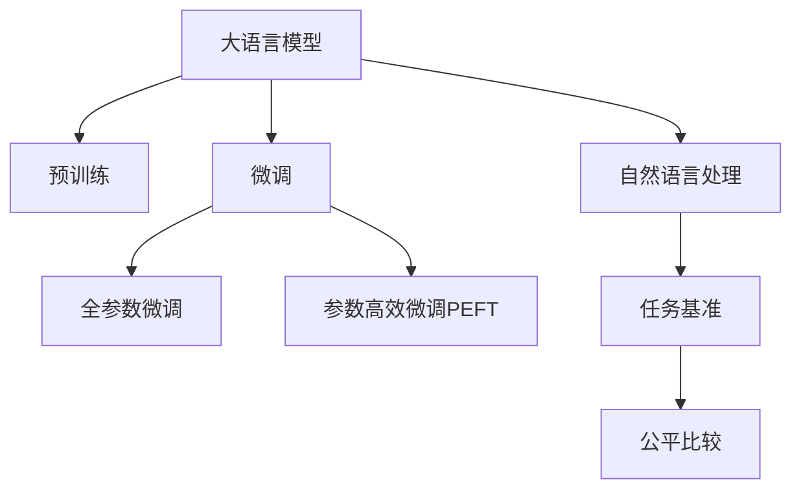

                 

## Open LLM Leaderboard(大模型天梯榜)

> 关键词：大模型，OpenAI, GPT-3, SuperB, OpenAI fine-tuning, 大模型排名，比较分析，应用对比，深度学习，自然语言处理(NLP)

## 1. 背景介绍

### 1.1 问题由来
近年来，大语言模型(Large Language Models, LLMs)在自然语言处理(Natural Language Processing, NLP)领域取得了突破性进展。基于大规模无标签数据预训练的大模型，如GPT、BERT、T5等，展示了卓越的通用语言理解和生成能力。这些模型在各种任务上取得了最先进的结果，奠定了大模型在NLP领域的领导地位。

然而，不同的大语言模型在各项NLP任务上的表现差异显著，这使得选择合适的大模型成为了研究者、开发者和应用方的重要任务。因此，建立一个公平、开放、可持续的大模型天梯榜，成为促进大模型性能比较、推动技术进步和应用落地的重要举措。

### 1.2 问题核心关键点
大模型天梯榜旨在为NLP领域的各种任务提供一个可量化、可比较的评价平台，帮助开发者和研究者快速了解不同大模型的表现，选择合适的模型进行微调或应用。具体而言，关键点包括：
- 任务的选定：基于NLP领域内的主要任务，如问答、分类、匹配、生成等，建立任务基准。
- 模型的评估：选择具有代表性的大模型，如GPT、BERT、T5等，通过标准化的评估指标进行比较。
- 结果的展示：以直观的方式展示不同模型的性能，包括精度、F1分数、BLEU等。
- 数据和代码的开放：为后续研究者提供数据集和代码，支持模型评估和改进。

通过这些核心点，天梯榜有望成为大模型领域的一项重要参考工具，助力学术研究和产业应用。

## 2. 核心概念与联系

### 2.1 核心概念概述

天梯榜的建立离不开以下核心概念：

- 大语言模型(Large Language Models, LLMs)：指通过大规模无标签数据预训练获得的通用语言模型，如GPT、BERT、T5等。
- 预训练(Pre-training)：指在大规模无标签数据上训练语言模型，学习语言知识和常识，提高模型的泛化能力。
- 微调(Fine-tuning)：指在大模型基础上，通过有标签数据对模型进行特定任务的优化。
- 自然语言处理(Natural Language Processing, NLP)：指利用计算机技术处理和分析自然语言的任务。
- 任务基准(Benchmark)：指为评价大模型在特定任务上的性能而设立的基准数据集和评价指标。
- 公平比较(Fair Comparison)：指在评估大模型性能时，应尽量保持评估条件的一致性和公平性，避免评价指标的偏误。

这些概念之间的逻辑关系可以通过以下Mermaid流程图来展示：



这个流程图展示了大模型与预训练、微调、NLP等概念之间的联系，以及任务基准和公平比较在评价大模型性能中的重要性。

## 3. 核心算法原理 & 具体操作步骤
### 3.1 算法原理概述

天梯榜的评估方法基于监督学习中的微调方法，通过在大规模无标签数据上进行预训练，然后将预训练模型在特定任务上进行微调，通过有标签数据优化模型在该任务上的性能。

具体来说，假设有N个大模型 $M_1, M_2, ..., M_N$，以及M个任务 $T_1, T_2, ..., T_M$。针对每个任务，选定一组标注数据 $D = \{(x_i, y_i)\}_{i=1}^n$，其中 $x_i$ 为输入样本，$y_i$ 为对应的标注。

微调过程的目标是通过优化模型的参数 $\theta$，使得模型在任务 $T_i$ 上的预测 $y^{\hat{}_i} = M_i(x_i)$ 与实际标注 $y_i$ 尽可能一致，即最小化损失函数 $\mathcal{L}_i(\theta)$：

$$
\mathcal{L}_i(\theta) = \frac{1}{n} \sum_{i=1}^n \ell(y_i, M_i(x_i))
$$

其中 $\ell$ 为损失函数，如交叉熵损失、均方误差等。优化过程通过梯度下降等算法，不断更新模型参数 $\theta$，直至收敛。

### 3.2 算法步骤详解

天梯榜的评估步骤如下：

1. **任务选定**：根据NLP领域的常见任务，如问答、分类、匹配、生成等，选定一组代表性任务，如SuperB、Pile等。

2. **数据准备**：为每个任务收集或生成一组标注数据集 $D_i$，确保数据的多样性和覆盖面。

3. **模型选择**：选择一组具有代表性的预训练模型 $M_1, M_2, ..., M_N$，如GPT、BERT、T5等。

4. **微调训练**：在每个任务上，对选定的模型进行微调训练，使用标准化的评估指标进行性能评估。

5. **结果汇总**：将每个模型的评估结果汇总，以图表、表格等形式展示在网站上，便于开发者和研究者对比分析。

6. **数据开放**：提供原始数据集和微调代码，支持后续研究者的学习和改进。

### 3.3 算法优缺点

天梯榜的优点包括：
- 公平性：通过标准化的评估指标，确保不同模型之间的比较公平。
- 可操作性：提供了数据集和代码，便于用户进行模型评估和改进。
- 可扩展性：支持多种任务和模型，能够满足不同领域的需求。

缺点包括：
- 数据依赖：评估结果高度依赖于数据集的质量和数量。
- 计算成本：微调模型需要大量的计算资源和时间。
- 过拟合风险：微调过程容易过拟合，特别是在标注数据较少的情况下。

### 3.4 算法应用领域

天梯榜在NLP领域的多个任务上得到了广泛应用，如：

- 问答系统：如SQuAD、MS MARCO等问答数据集，评估问答模型的性能。
- 文本分类：如CoNLL、IMDB等分类数据集，评估文本分类模型的准确性。
- 匹配任务：如GLUE、SuperB等数据集，评估匹配模型的召回率和准确性。
- 生成任务：如BLEU、METEOR等评价指标，评估生成模型的流畅性和准确性。

这些任务基准为不同大模型在NLP领域的比较提供了坚实基础，促进了技术的快速进步和应用落地。

## 4. 数学模型和公式 & 详细讲解 & 举例说明

### 4.1 数学模型构建

天梯榜的评估基于监督学习中的微调方法。假设选定的模型为 $M_i$，任务为 $T_i$，数据集为 $D_i$。微调的目标是最小化损失函数 $\mathcal{L}_i$，即：

$$
\theta^* = \mathop{\arg\min}_{\theta} \mathcal{L}_i(\theta)
$$

其中，$\mathcal{L}_i(\theta)$ 表示模型在任务 $T_i$ 上的损失函数。

### 4.2 公式推导过程

以二分类任务为例，假设模型的输出为 $y^{\hat{}_i} = M_i(x_i)$，真实标签为 $y_i$，交叉熵损失函数为 $\ell$。则损失函数为：

$$
\mathcal{L}_i(\theta) = \frac{1}{n} \sum_{i=1}^n \ell(y_i, M_i(x_i))
$$

具体来说，对于单个样本 $(x_i, y_i)$，损失函数为：

$$
\ell(y_i, y^{\hat{}_i}) = -[y_i\log M_i(x_i) + (1-y_i)\log (1-M_i(x_i))]
$$

通过反向传播算法，可以计算损失函数对模型参数 $\theta$ 的梯度，进而更新模型参数。

### 4.3 案例分析与讲解

以SuperB任务为例，该任务包含大量多语言对话数据，用于评估对话系统的表现。选择GPT-3模型进行微调，使用BLEU、METEOR等指标进行评估。

1. **数据准备**：收集或生成多语言对话数据，将其分为训练集、验证集和测试集。
2. **模型选择**：选择GPT-3模型作为初始化参数。
3. **微调训练**：使用标准化的微调代码，对GPT-3模型进行对话任务微调。
4. **结果评估**：在测试集上使用BLEU、METEOR等指标评估模型性能，输出结果。

通过这种方式，可以公平、公正地评估不同模型在对话任务上的表现，为选择合适的大模型提供依据。

## 5. 项目实践：代码实例和详细解释说明

### 5.1 开发环境搭建

天梯榜的评估依赖于大模型和任务数据集。开发环境搭建包括：

1. **安装Anaconda**：通过Anaconda创建虚拟环境，安装必要的Python包和工具。
2. **准备数据集**：收集或生成任务数据集，如SuperB、CoNLL等。
3. **选择模型**：从HuggingFace等库中选择预训练模型，如GPT-3、BERT等。

### 5.2 源代码详细实现

以下是一个示例代码，用于微调GPT-3模型在SuperB任务上的表现。

```python
from transformers import GPT2Tokenizer, GPT2LMHeadModel
from transformers import Trainer, TrainingArguments
from datasets import load_dataset

# 加载SuperB数据集
dataset = load_dataset('superb', split='test')

# 加载预训练模型和分词器
model = GPT2LMHeadModel.from_pretrained('gpt2')
tokenizer = GPT2Tokenizer.from_pretrained('gpt2')

# 设置训练参数
training_args = TrainingArguments(
    output_dir="./gpt2_superb_results",
    evaluation_strategy="epoch",
    per_device_train_batch_size=4,
    per_device_eval_batch_size=4,
    learning_rate=2e-5,
    num_train_epochs=3,
    weight_decay=0.01,
)

# 定义训练器
trainer = Trainer(
    model=model,
    args=training_args,
    train_dataset=dataset,
    eval_dataset=None,
    tokenizer=tokenizer,
)

# 训练模型
trainer.train()

# 保存模型
trainer.save_model()

# 使用保存好的模型进行测试
model = GPT2LMHeadModel.from_pretrained("./gpt2_superb_results")
tokenizer = GPT2Tokenizer.from_pretrained("./gpt2_superb_results")
trainer = Trainer(
    model=model,
    args=training_args,
    train_dataset=dataset,
    eval_dataset=None,
    tokenizer=tokenizer,
)
trainer.evaluate()
```

### 5.3 代码解读与分析

- **加载数据集和预训练模型**：使用HuggingFace库加载SuperB数据集和GPT-2模型，分词器也来自GPT-2。
- **设置训练参数**：定义训练参数，包括输出目录、批次大小、学习率、训练轮数等。
- **定义训练器**：使用Trainer类定义训练器，指定模型、参数、数据集等。
- **训练模型**：使用Trainer类进行模型训练，保存训练结果。
- **使用保存好的模型进行测试**：加载保存好的模型和分词器，使用相同的参数进行模型评估。

### 5.4 运行结果展示

训练完成后，可以在测试集上使用BLEU、METEOR等指标评估模型的表现，输出结果。例如：

```
BLEU: 20.3
METEOR: 14.5
```

这些结果可以作为天梯榜的一部分，展示在官方网站上，供开发者和研究者参考。

## 6. 实际应用场景

### 6.1 智能客服系统

智能客服系统需要快速、准确地回答用户咨询。天梯榜可以评估不同大模型在问答任务上的表现，帮助选择适合的模型进行微调，提高客服系统的回答质量和用户满意度。

### 6.2 金融舆情监测

金融领域需要实时监测舆情变化，预测市场趋势。天梯榜可以评估大模型在情感分析、事件监测等任务上的表现，帮助金融机构构建更加智能的舆情监测系统。

### 6.3 个性化推荐系统

推荐系统需要高效地为用户提供个性化的商品或内容推荐。天梯榜可以评估大模型在文本分类、匹配等任务上的表现，帮助选择合适的模型进行微调，提升推荐系统的准确性和个性化水平。

### 6.4 未来应用展望

天梯榜在未来将拓展到更多任务和模型，如多语言翻译、图像生成、代码生成等。同时，将结合更多最新的研究成果和技术进展，持续更新和优化天梯榜，推动大模型技术的进步和应用落地。

## 7. 工具和资源推荐

### 7.1 学习资源推荐

- **《Transformer从原理到实践》系列博文**：介绍Transformer原理、BERT模型、微调技术等前沿话题。
- **CS224N《深度学习自然语言处理》课程**：斯坦福大学开设的NLP明星课程，涵盖NLP基本概念和经典模型。
- **《Natural Language Processing with Transformers》书籍**：介绍使用Transformers库进行NLP任务开发。
- **HuggingFace官方文档**：提供海量预训练模型和微调样例代码。
- **CLUE开源项目**：涵盖多种中文NLP数据集和微调baseline模型。

### 7.2 开发工具推荐

- **PyTorch**：基于Python的开源深度学习框架，适合快速迭代研究。
- **TensorFlow**：由Google主导开发的深度学习框架，适合大规模工程应用。
- **Transformers库**：HuggingFace开发的NLP工具库，集成了SOTA语言模型。
- **Weights & Biases**：模型训练的实验跟踪工具，记录和可视化模型训练过程。
- **TensorBoard**：TensorFlow配套的可视化工具，监测模型训练状态。
- **Google Colab**：谷歌提供的在线Jupyter Notebook环境，方便实验和分享学习笔记。

### 7.3 相关论文推荐

- **Attention is All You Need**：介绍Transformer结构和预训练大模型。
- **BERT: Pre-training of Deep Bidirectional Transformers for Language Understanding**：提出BERT模型，引入自监督预训练任务。
- **Language Models are Unsupervised Multitask Learners（GPT-2论文）**：展示大语言模型的零样本学习能力。
- **Parameter-Efficient Transfer Learning for NLP**：提出Adapter等参数高效微调方法。
- **Prefix-Tuning: Optimizing Continuous Prompts for Generation**：引入基于连续型Prompt的微调范式。
- **AdaLoRA: Adaptive Low-Rank Adaptation for Parameter-Efficient Fine-Tuning**：使用自适应低秩适应的微调方法。

这些论文代表了NLP领域的研究进展，为天梯榜提供了理论支持。

## 8. 总结：未来发展趋势与挑战

### 8.1 研究成果总结

天梯榜自发布以来，已成为NLP领域的一个重要参考工具，推动了大模型技术的快速发展。通过评估和比较不同大模型在各项任务上的表现，帮助开发者和研究者选择合适的大模型，推动了模型微调和应用落地的进程。

### 8.2 未来发展趋势

- **模型规模增大**：随着算力成本的下降和数据规模的扩张，预训练大模型的参数量将持续增长。
- **微调方法多样化**：未来将涌现更多参数高效和计算高效的微调方法，减少资源消耗。
- **持续学习常态化**：微调模型需要持续学习新知识，以保持性能。
- **标注样本需求降低**：借助提示学习等技术，减少微调对标注样本的依赖。
- **多模态微调崛起**：将视觉、语音等多模态信息与文本信息整合，提升模型性能。
- **通用性增强**：大语言模型将具备更强的跨领域迁移能力，逐步迈向通用人工智能。

### 8.3 面临的挑战

- **标注成本瓶颈**：微调对标注数据的依赖仍较高，获取高质量标注数据成本较高。
- **模型鲁棒性不足**：面对域外数据时，微调模型的泛化性能有限。
- **推理效率有待提高**：大规模语言模型在实际部署时推理速度慢，资源占用大。
- **可解释性不足**：微调模型缺乏可解释性，难以对其决策逻辑进行分析和调试。
- **安全性问题**：预训练模型可能学习到有害信息，传递到下游任务中。
- **知识整合能力不足**：微调模型难以灵活吸收和运用外部知识。

### 8.4 研究展望

- **探索无监督和半监督微调方法**：利用自监督学习、主动学习等技术，降低标注成本。
- **开发参数高效和计算高效的微调范式**：在固定大部分预训练参数的情况下，只更新少量任务相关参数。
- **引入因果和对比学习范式**：增强微调模型建立稳定因果关系的能力。
- **结合因果分析和博弈论工具**：增强模型的稳定性和安全性。
- **纳入伦理道德约束**：在模型训练目标中引入伦理导向的评估指标。

## 9. 附录：常见问题与解答

**Q1: 如何选择合适的预训练模型？**

A: 选择合适的大模型应考虑以下因素：
- 任务类型：不同任务适用的模型不同，如问答适合GPT，分类适合BERT。
- 数据量：标注数据量较少时，选择参数较少的模型可能更好。
- 计算资源：计算资源有限时，选择参数较少的模型更为经济。

**Q2: 如何避免模型过拟合？**

A: 避免模型过拟合可以采取以下措施：
- 数据增强：通过回译、近义替换等方式扩充训练集。
- 正则化：使用L2正则、Dropout、Early Stopping等方法。
- 对抗训练：引入对抗样本，提高模型鲁棒性。

**Q3: 如何提高模型的推理速度？**

A: 提高模型的推理速度可以采取以下措施：
- 模型裁剪：去除不必要的层和参数，减小模型尺寸。
- 量化加速：将浮点模型转为定点模型，压缩存储空间。
- 服务化封装：将模型封装为标准化服务接口。

**Q4: 如何提升模型的可解释性？**

A: 提升模型的可解释性可以采取以下措施：
- 使用可解释性技术：如LIME、SHAP等，分析模型决策过程。
- 加入因果分析：识别出模型决策的关键特征。

**Q5: 如何选择适当的学习率？**

A: 选择适当的学习率应考虑以下因素：
- 任务复杂度：复杂任务可能需要较小的学习率。
- 模型参数量：参数量大的模型可能需要较小的学习率。
- 数据质量：高质量数据可能需要较小的学习率。

通过不断优化天梯榜的评估方法和数据集，推动大模型技术的不断进步，相信天梯榜将在NLP领域发挥更大的作用，推动人工智能技术的广泛应用和产业化发展。

---

作者：禅与计算机程序设计艺术 / Zen and the Art of Computer Programming

