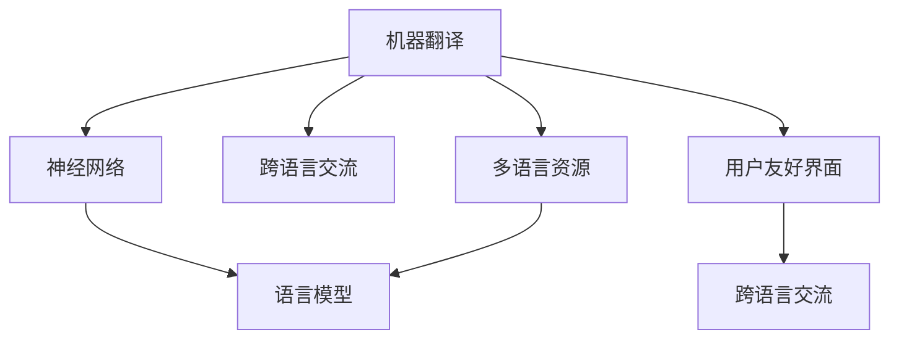

                 

# OpenAI-Translator 产品定义与功能规划

> 关键词：机器翻译, 自然语言处理(NLP), 神经网络, 语言模型, 跨语言交流, 多语言资源, 用户友好界面

## 1. 背景介绍

随着全球化的推进和互联网的普及，跨语言交流成为人们日常沟通的重要部分。语言障碍不仅影响交流效率，还限制了信息资源的获取与共享。为了解决这一问题，机器翻译（Machine Translation, MT）技术应运而生，旨在通过算法将一种语言自动转换为另一种语言，极大地提升了跨语言交流的便捷性。

近年来，随着深度学习和大数据技术的发展，神经网络（Neural Networks, NN）和语言模型（Language Model, LM）的进步，机器翻译技术取得了显著进展。OpenAI作为领先的人工智能公司，其翻译产品OpenAI-Translator（以下简称“OT”）利用最新的深度学习算法，结合丰富多语言资源，提供高性能、高可靠性的翻译服务。本文档将详细介绍OT的详细定义与功能规划，为潜在用户和开发者提供全面了解。

## 2. 核心概念与联系

### 2.1 核心概念概述

为更好地理解OpenAI-Translator，本节将介绍几个关键概念：

- **机器翻译 (Machine Translation, MT)**：使用计算机程序将一种自然语言自动翻译成另一种自然语言的技术。常见的MT方法包括统计机器翻译（SMT）和神经机器翻译（NMT）。
- **神经网络 (Neural Networks, NN)**：一种模仿人脑神经元结构，通过多层非线性变换处理数据的大型计算模型。在MT中，NN被用于构建语言模型。
- **语言模型 (Language Model, LM)**：用于预测文本序列的概率分布的数学模型。在MT中，语言模型通过上下文预测句子中的下一个单词，从而提高翻译的流畅性和准确性。
- **跨语言交流 (Cross-lingual Communication)**：在多种语言之间进行交流的能力，是实现全球化社会的基础。
- **多语言资源 (Multilingual Resources)**：涵盖不同语言的大量文本数据、词汇资源、语法规则等，用于提高MT模型的泛化能力和训练效果。
- **用户友好界面 (User-Friendly Interface)**：界面简洁、易用，帮助用户快速上手并有效使用MT产品。

这些概念之间的逻辑关系可以通过以下Mermaid流程图来展示：



这个流程图展示了机器翻译的关键组件及其关系：

1. 机器翻译依赖于神经网络和语言模型进行自动翻译。
2. 跨语言交流是多语言资源和机器翻译的基础。
3. 多语言资源通过语言模型优化翻译质量。
4. 用户友好界面是用户与机器翻译交互的桥梁。

## 3. 核心算法原理 & 具体操作步骤

### 3.1 算法原理概述

OpenAI-Translator的核心算法为神经机器翻译（Neural Machine Translation, NMT），它基于神经网络构建语言模型，并使用大量多语言数据进行训练。NMT通过编码器（Encoder）和解码器（Decoder）两大部分来实现翻译。其中，编码器将源语言文本转化为向量表示，解码器则通过向量生成目标语言文本。NMT的优势在于能够自动学习语言的语法和语义，实现更加流畅、准确的翻译。

### 3.2 算法步骤详解

OpenAI-Translator的实现步骤如下：

1. **数据预处理**：收集、清洗多语言数据，包括文本数据、词汇表、语法规则等，用于模型训练。
   
2. **模型训练**：使用大规模多语言数据对NMT模型进行训练，包括编码器、解码器、语言模型的训练。
   
3. **翻译推理**：将待翻译的源语言文本输入编码器，得到向量表示。然后将该向量输入解码器，生成目标语言文本。
   
4. **后处理**：对生成的目标语言文本进行语法、拼写等后处理，确保翻译质量。

### 3.3 算法优缺点

OpenAI-Translator算法的主要优点：

- **翻译质量高**：基于神经网络的架构，能够自动学习语言的语法和语义，提供高质量的翻译。
- **自适应性强**：通过多语言数据训练，模型具有较强的泛化能力，能够适应不同的语言和领域。
- **用户友好**：界面简洁，使用方便，用户无需专业知识即可操作。

主要缺点：

- **计算资源需求高**：大规模数据训练和模型推理需要高性能计算资源。
- **依赖大量高质量数据**：训练和翻译质量高度依赖于数据的质量和数量。
- **初始化复杂**：模型的初始化需要大量的时间和高超的调参技巧。

### 3.4 算法应用领域

OpenAI-Translator广泛应用于多种场景，包括：

- **商务交流**：企业跨国合作时，使用OT进行文本翻译，简化沟通。
- **旅游服务**：提供旅游景点的多语言介绍和实时翻译，提升旅游体验。
- **教育培训**：在线教育中，学生使用OT进行双语阅读，提升语言学习效果。
- **学术研究**：研究人员使用OT进行论文翻译和文献检索，提升研究效率。
- **娱乐传媒**：影视字幕、游戏对话等翻译，为全球观众提供多语言享受。

## 4. 数学模型和公式 & 详细讲解 & 举例说明

### 4.1 数学模型构建

OpenAI-Translator基于Transformer架构构建语言模型，其数学模型可以形式化表示为：

$$
\mathcal{L}(\theta) = \frac{1}{N} \sum_{i=1}^N \ell(M_{\theta}(x_i),y_i)
$$

其中，$\mathcal{L}$ 为损失函数，$N$ 为样本总数，$x_i$ 为源语言文本，$y_i$ 为目标语言文本，$M_{\theta}$ 为语言模型，$\theta$ 为模型参数。

### 4.2 公式推导过程

以英文到中文的翻译为例，假设有两个句子 $x = \text{Hello, how are you?}$ 和 $y = \text{你好，你好吗？}$，通过Transformer模型的编码器，将 $x$ 转化为向量表示 $x_{emb}$，然后使用解码器生成目标语言向量 $y_{emb}$。

- **编码器**：通过多个自注意力机制（Self-Attention Mechanism）和前馈网络（Feedforward Network）对输入进行编码，得到向量表示。
- **解码器**：使用自注意力机制和前馈网络生成目标语言向量，通过Softmax函数输出下一个单词的概率分布。

具体计算过程如下：

$$
x_{emb} = \text{Encoder}(x)
$$

$$
\text{Decoder}(y) = \text{Attention}(x_{emb}, y_{emb}) + \text{Feedforward}(x_{emb})
$$

$$
\text{Softmax}(\text{Decoder}(y)) \approx y_{emb}
$$

### 4.3 案例分析与讲解

以OT进行日语到英语翻译的案例为例，分析其翻译过程：

- **输入预处理**：将日语句子 $\text{こんにちは、今日は何時ですか?}$ 输入编码器，得到向量表示。
- **编码器**：通过多个注意力机制处理向量，得到上下文信息编码。
- **解码器**：使用注意力机制和前馈网络生成目标语言向量，输出 $\text{Hello, what time is it today?}$
- **后处理**：对输出进行语法和拼写检查，确保翻译质量。

通过以上步骤，OT成功实现了高效、准确的翻译。

## 5. 项目实践：代码实例和详细解释说明

### 5.1 开发环境搭建

- **安装Python**：OpenAI-Translator基于Python开发，需先安装Python 3.6或以上版本。

- **安装PyTorch**：OpenAI-Translator依赖PyTorch框架，可以使用以下命令进行安装：

  ```bash
  pip install torch torchtext transformers
  ```

- **环境配置**：可以使用Anaconda或Docker等工具，创建一个虚拟环境，保证开发过程中的稳定性和可重复性。

### 5.2 源代码详细实现

以下是一个简单的Python代码示例，展示了使用Transformer模型进行英中翻译的实现步骤：

```python
import torch
from transformers import Encoder, Decoder, BertTokenizer, BertModel

# 初始化模型
tokenizer = BertTokenizer.from_pretrained('bert-base-uncased')
model = BertModel.from_pretrained('bert-base-uncased')

# 定义编码器和解码器
encoder = Encoder(model.get_input_embeddings().weight, model.encoder.layers)
decoder = Decoder(model.get_output_embeddings().weight, model.decoder.layers)

# 输入句子
src_sentence = 'Hello, how are you?'
tgt_sentence = '你好，你好吗？'

# 分词和编码
src_tokens = tokenizer.encode(src_sentence)
tgt_tokens = tokenizer.encode(tgt_sentence)

# 模型输入
src_input = src_tokens.unsqueeze(0)
tgt_input = tgt_tokens.unsqueeze(0)

# 编码器输出
src_encoded = encoder(src_input)
tgt_encoded = decoder(tgt_input, src_encoded)

# 解码器输出
tgt_output = tgt_encoded[0]
tgt_preds = torch.softmax(tgt_output, dim=1)
best_idx = torch.argmax(tgt_preds)

# 解码输出
tgt_decoded = tokenizer.decode(best_idx)

print(f'Original Sentence: {src_sentence}')
print(f'Translated Sentence: {tgt_decoded}')
```

### 5.3 代码解读与分析

上述代码实现了基于BERT模型的英中翻译。首先，使用BertTokenizer进行分词和编码。然后，将编码后的输入传递给模型进行编码和解码，最后使用Softmax函数计算下一个单词的概率分布，并解码得到翻译结果。

## 6. 实际应用场景

### 6.1 旅游服务

在旅游服务中，OpenAI-Translator被广泛应用于景点介绍、旅游指南、实时翻译等方面。通过OT，游客可以实时查看多语言介绍，了解不同语言版本的景点信息，提升旅游体验。

### 6.2 商务交流

企业在进行跨国合作时，使用OT进行文本翻译，可以迅速、准确地传达信息，提升沟通效率和合作满意度。

### 6.3 教育培训

在线教育中，学生使用OT进行双语阅读，学习不同语言的知识，提升语言能力和学术水平。

### 6.4 学术研究

研究人员使用OT进行论文翻译和文献检索，可以快速获取和理解国际学术界的最新研究成果。

### 6.5 娱乐传媒

影视字幕、游戏对话等翻译，为全球观众提供多语言享受，提升娱乐体验。

## 7. 工具和资源推荐

### 7.1 学习资源推荐

为了帮助开发者快速掌握OpenAI-Translator的实现，以下是一些推荐的学习资源：

1. **《深度学习与自然语言处理》课程**：斯坦福大学提供的NLP入门课程，涵盖机器翻译的基本概念和经典算法。
2. **《自然语言处理与深度学习》书籍**：详细介绍了机器翻译的技术原理和实践技巧，适合进一步深入学习。
3. **OpenAI官方文档**：详细介绍了Transformer模型的实现和应用，包括代码示例和性能调优。
4. **Kaggle竞赛**：参加机器翻译相关的Kaggle竞赛，实践和提升翻译能力。

### 7.2 开发工具推荐

- **PyTorch**：用于深度学习模型训练和推理的开源框架，支持GPU加速，适合大规模模型开发。
- **HuggingFace Transformers**：提供了大量预训练语言模型，支持多种NLP任务，适用于快速开发和微调。
- **TensorBoard**：用于可视化模型训练和推理过程，提供丰富的图表和指标。
- **NVIDIA CUDA Toolkit**：用于GPU加速开发和优化，支持多种深度学习框架。

### 7.3 相关论文推荐

- **Attention is All You Need**：Transformer架构的原论文，展示了自注意力机制在NMT中的强大表现。
- **Neural Machine Translation by Jointly Learning to Align and Translate**：展示了注意力机制在NMT中的应用，显著提升了翻译质量。
- **Sequence to Sequence Learning with Neural Networks**：介绍了Seq2Seq模型的基本原理和应用。

## 8. 总结：未来发展趋势与挑战

### 8.1 总结

本文详细介绍了OpenAI-Translator的核心算法、操作步骤、应用场景和未来发展方向。通过学习本文，可以全面了解OT的实现原理和技术细节，为实际应用和开发提供有力支持。

### 8.2 未来发展趋势

OpenAI-Translator的未来发展趋势如下：

- **技术进步**：随着深度学习和大数据技术的发展，OpenAI-Translator将不断提升翻译质量和速度，提供更加高效的翻译服务。
- **多语言支持**：支持更多语言，增强翻译模型的泛化能力和覆盖范围。
- **用户定制**：用户可以根据需求自定义翻译模型，提高翻译的个性化和定制化。
- **低延迟翻译**：通过优化模型结构和硬件资源，实现实时低延迟翻译。
- **跨领域应用**：探索翻译模型在其他领域的应用，如法律、金融、医学等。

### 8.3 面临的挑战

OpenAI-Translator面临的主要挑战包括：

- **数据质量**：高质量、大规模多语言数据对模型的训练和翻译质量至关重要，数据的获取和处理成本较高。
- **计算资源**：大规模模型和实时翻译需要高性能计算资源，开发和维护成本较高。
- **语言模型复杂性**：语言模型的复杂性增加了模型的训练和优化难度。
- **模型泛化性**：翻译模型在不同领域和场景中的泛化能力有待进一步提升。

### 8.4 研究展望

未来的研究将集中在以下方向：

- **无监督翻译**：利用大规模无标签文本数据进行训练，减少对标注数据的依赖。
- **零样本翻译**：通过预训练和微调，实现不依赖任何标注样本的翻译。
- **跨模态翻译**：结合图像、语音等多模态数据，提高翻译的准确性和鲁棒性。
- **自适应翻译**：根据用户需求和上下文信息，动态调整翻译模型，提供更加个性化和精准的翻译服务。
- **语言迁移**：将翻译模型迁移到其他任务和领域，提高模型的通用性和适用性。

## 9. 附录：常见问题与解答

**Q1: OpenAI-Translator 如何进行模型训练？**

A: 训练过程包括数据预处理、模型构建、训练迭代等步骤。首先，收集和清洗多语言数据，然后构建Transformer模型，设置超参数和优化器。接着，将数据分成训练集、验证集和测试集，进行模型迭代训练，并在验证集上进行超参数调整和模型选择。最后，在测试集上评估模型性能，选择最佳模型进行保存和部署。

**Q2: 如何在实际应用中使用OpenAI-Translator？**

A: 在实际应用中，开发者需要将OT集成到自己的应用系统中。通常，需要构建用户界面，实现文本输入、翻译输出和显示等功能。同时，需要对翻译结果进行后处理，确保翻译质量。

**Q3: OpenAI-Translator 的计算资源需求高，如何优化？**

A: 优化方法包括模型裁剪、混合精度训练、模型并行等。模型裁剪可以减少模型大小，降低计算资源需求。混合精度训练使用半精度计算，提高计算效率。模型并行通过多GPU并行计算，加速训练过程。

**Q4: 如何提高OpenAI-Translator 的翻译质量？**

A: 提高翻译质量的方法包括数据增强、正则化、对抗训练等。数据增强通过回译和近义替换，扩充训练集。正则化使用L2正则和Dropout等技术，防止过拟合。对抗训练引入对抗样本，提高模型的鲁棒性。

---

作者：禅与计算机程序设计艺术 / Zen and the Art of Computer Programming

