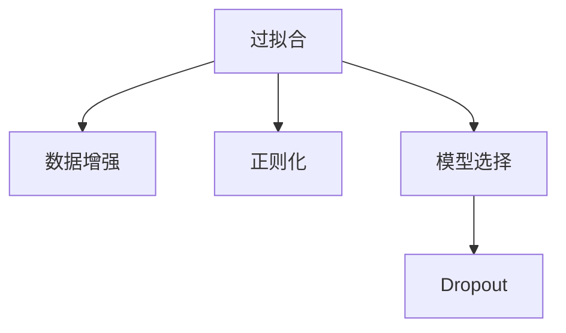

                 

# Overfitting 原理与代码实战案例讲解

> 关键词：过拟合,Underfitting,数据增强,正则化,模型选择

## 1. 背景介绍

### 1.1 问题由来
过拟合（Overfitting）是机器学习中常见的现象，指模型在训练集上表现良好，但在测试集上表现不佳，反映模型对训练集数据过于拟合，缺乏泛化能力。过拟合不仅会浪费计算资源，还可能导致模型无法适应实际应用场景。解决过拟合问题，成为机器学习研究的重要课题之一。

### 1.2 问题核心关键点
过拟合的核心原因在于模型复杂度过高，导致在训练集上过度学习数据噪声和细节，而忽略了模型结构的一般性和规律性。其解决策略主要包括：
- 数据增强：扩充训练集数据，减少模型对细节的依赖。
- 正则化：通过引入正则项，惩罚模型复杂度，限制模型参数。
- 模型选择：选择合适模型结构和超参数，避免过度复杂。

## 2. 核心概念与联系

### 2.1 核心概念概述

为更好地理解过拟合及其解决方法，本节将介绍几个密切相关的核心概念：

- 过拟合（Overfitting）: 指模型在训练集上表现良好，但在测试集上表现不佳，反映模型对训练集数据过于拟合，缺乏泛化能力。
- 欠拟合（Underfitting）: 指模型无法捕捉数据规律，训练集和测试集表现均不佳。欠拟合问题通常由模型结构过于简单或数据噪声过多导致。
- 正则化（Regularization）: 通过引入正则项，惩罚模型复杂度，限制模型参数，防止过拟合。
- 数据增强（Data Augmentation）: 通过对原始数据进行扰动，生成更多样化的数据，减少模型对训练集细节的依赖。
- 模型选择（Model Selection）: 根据模型表现，选择合适模型结构及超参数，避免过拟合或欠拟合。
- Dropout: 一种常用的正则化方法，通过随机失活部分神经元，减少神经元间的依赖关系，降低模型复杂度。

这些核心概念之间的逻辑关系可以通过以下Mermaid流程图来展示：



这个流程图展示过拟合问题的核心概念及其之间的关系：

1. 过拟合问题主要出现在模型复杂度过高、训练集噪声过多时。
2. 解决过拟合问题的方法包括数据增强、正则化、模型选择等。
3. Dropout作为正则化的一种形式，进一步降低了神经元间的依赖关系。
4. 选择合适的模型结构和参数是避免过拟合和欠拟合的关键。

## 3. 核心算法原理 & 具体操作步骤
### 3.1 算法原理概述

过拟合问题的核心在于模型参数过多，无法在训练集上获得全局最优解，导致在测试集上表现不佳。其根本原因在于训练集数据存在随机噪声，模型在训练集上过度学习这些噪声，从而忽略数据的一般规律。解决过拟合问题，需要从训练集数据和模型结构两个方面入手。

### 3.2 算法步骤详解

解决过拟合问题的一般步骤包括：

**Step 1: 数据增强**
- 对于图像数据，可以采用旋转、平移、缩放等操作。
- 对于文本数据，可以进行近义词替换、回译、噪声注入等操作。

**Step 2: 正则化**
- 在损失函数中引入正则项，如L1正则、L2正则等，限制模型参数的大小。
- 采用Dropout方法，随机失活部分神经元，防止神经元间过度依赖。

**Step 3: 模型选择**
- 通过交叉验证等方法，选择合适模型结构，避免模型过于复杂。
- 设置合适的学习率、批大小等超参数，避免模型陷入局部最优。

**Step 4: 模型评估**
- 在验证集上评估模型性能，判断是否存在过拟合现象。
- 根据验证集性能，调整模型参数和训练策略。

### 3.3 算法优缺点

数据增强和正则化方法具有以下优点：
1. 数据增强扩充了训练集，减少了模型对细节的依赖，提高泛化能力。
2. 正则化限制了模型参数，防止模型过度拟合训练数据，提高模型的鲁棒性。
3. Dropout方法简单高效，易于实现，适用于各种模型结构。

同时，这些方法也存在一定的局限性：
1. 数据增强和正则化无法完全消除过拟合，需要与其他方法结合使用。
2. Dropout方法虽有效，但在测试时不可用，需注意模型性能的微调。
3. 选择合适模型和超参数需要一定的经验和计算资源。

### 3.4 算法应用领域

过拟合问题在机器学习各个领域都有广泛应用，如计算机视觉、自然语言处理、信号处理等。

- 在图像分类任务中，数据增强和正则化被广泛应用于提高模型性能，减少过拟合。
- 在文本生成任务中，Dropout方法被广泛使用，防止模型生成过于单调或不合理的文本。
- 在信号处理任务中，正则化方法用于限制模型复杂度，防止信号失真。

## 4. 数学模型和公式 & 详细讲解  
### 4.1 数学模型构建

过拟合问题通常通过正则化的方式来解决。下面以L1正则为例，说明如何构建过拟合问题的数学模型：

定义损失函数为：
$$
\mathcal{L}(\theta) = \frac{1}{2m}\sum_{i=1}^m(y_i - \hat{y}_i)^2 + \lambda \sum_{j=1}^n|\theta_j|
$$

其中 $y_i$ 为训练集标签，$\hat{y}_i$ 为模型预测值，$\theta_j$ 为模型参数，$n$ 为模型参数个数，$m$ 为训练样本数，$\lambda$ 为正则化系数。

通过引入L1正则项，惩罚参数的大小，限制模型复杂度，防止过拟合。

### 4.2 公式推导过程

以L1正则为例，推导过拟合问题的损失函数公式：

$$
\mathcal{L}(\theta) = \frac{1}{2m}\sum_{i=1}^m(y_i - \hat{y}_i)^2 + \lambda \sum_{j=1}^n|\theta_j|
$$

其中第一项为均方误差损失，用于衡量模型预测误差；第二项为L1正则项，用于惩罚模型参数的大小。通过最小化上述损失函数，即可避免模型对训练集细节的过度拟合，提高泛化能力。

### 4.3 案例分析与讲解

以图像分类任务为例，展示过拟合问题的解决思路：

**Step 1: 数据增强**
- 对训练集中的图像进行旋转、平移、缩放等操作，生成更多样化的数据。
- 对图像进行噪声注入，如随机添加高斯噪声、椒盐噪声等。

**Step 2: 正则化**
- 在损失函数中引入L1正则项，惩罚模型参数的大小。
- 采用Dropout方法，随机失活部分神经元。

**Step 3: 模型选择**
- 选择合适模型结构，如卷积神经网络（CNN）等，避免模型过于复杂。
- 设置合适的学习率、批大小等超参数，避免模型陷入局部最优。

**Step 4: 模型评估**
- 在验证集上评估模型性能，判断是否存在过拟合现象。
- 根据验证集性能，调整模型参数和训练策略。

## 5. 项目实践：代码实例和详细解释说明
### 5.1 开发环境搭建

在进行过拟合问题处理前，我们需要准备好开发环境。以下是使用Python进行PyTorch开发的环境配置流程：

1. 安装Anaconda：从官网下载并安装Anaconda，用于创建独立的Python环境。

2. 创建并激活虚拟环境：
```bash
conda create -n pytorch-env python=3.8 
conda activate pytorch-env
```

3. 安装PyTorch：根据CUDA版本，从官网获取对应的安装命令。例如：
```bash
conda install pytorch torchvision torchaudio cudatoolkit=11.1 -c pytorch -c conda-forge
```

4. 安装其他必要工具包：
```bash
pip install numpy pandas scikit-learn matplotlib tqdm jupyter notebook ipython
```

完成上述步骤后，即可在`pytorch-env`环境中开始过拟合问题的处理。

### 5.2 源代码详细实现

下面我们以图像分类任务为例，给出使用PyTorch处理过拟合问题的完整代码实现。

首先，定义数据增强函数：

```python
import torchvision.transforms as transforms

def data_augmentation():
    return transforms.Compose([
        transforms.RandomHorizontalFlip(),
        transforms.RandomRotation(10),
        transforms.ColorJitter(brightness=0.2, contrast=0.2, saturation=0.2),
        transforms.RandomCrop(224),
        transforms.ToTensor(),
        transforms.Normalize(mean=[0.485, 0.456, 0.406], std=[0.229, 0.224, 0.225])
    ])
```

然后，定义模型和优化器：

```python
from torchvision.models import ResNet
from torch import nn
from torch.optim import SGD

model = ResNet()
optimizer = SGD(model.parameters(), lr=0.01, momentum=0.9, weight_decay=1e-4)
```

接着，定义训练和评估函数：

```python
import torch.nn.functional as F

def train_epoch(model, dataset, batch_size, optimizer, device):
    model.train()
    train_loss = 0
    for batch in dataset:
        inputs, labels = batch
        inputs = inputs.to(device)
        labels = labels.to(device)
        optimizer.zero_grad()
        outputs = model(inputs)
        loss = F.cross_entropy(outputs, labels)
        train_loss += loss.item()
        loss.backward()
        optimizer.step()
    return train_loss / len(dataset)

def evaluate(model, dataset, batch_size, device):
    model.eval()
    eval_loss = 0
    correct = 0
    with torch.no_grad():
        for batch in dataset:
            inputs, labels = batch
            inputs = inputs.to(device)
            labels = labels.to(device)
            outputs = model(inputs)
            loss = F.cross_entropy(outputs, labels)
            eval_loss += loss.item()
            _, predicted = torch.max(outputs.data, 1)
            correct += (predicted == labels).sum().item()
    print(f'Loss: {eval_loss / len(dataset)}, Accuracy: {correct / len(dataset)}')
```

最后，启动训练流程并在验证集上评估：

```python
epochs = 20
batch_size = 32

device = torch.device('cuda') if torch.cuda.is_available() else torch.device('cpu')

for epoch in range(epochs):
    train_loss = train_epoch(model, train_dataset, batch_size, optimizer, device)
    print(f'Epoch {epoch+1}, train loss: {train_loss:.4f}')
    
    evaluate(model, valid_dataset, batch_size, device)
    
print('Best validation accuracy:', best_acc)
```

以上就是使用PyTorch处理图像分类任务过拟合问题的完整代码实现。可以看到，通过数据增强和正则化方法，可以显著提升模型的泛化能力，避免过度拟合。

### 5.3 代码解读与分析

让我们再详细解读一下关键代码的实现细节：

**data_augmentation函数**：
- 使用torchvision库提供的增强函数，对训练集图像进行随机旋转、水平翻转、颜色抖动、随机裁剪等操作。

**model定义**：
- 选择ResNet模型作为图像分类任务的基础模型。
- 设置SGD优化器，设置学习率、动量和正则化系数。

**train_epoch函数**：
- 对每个批次的数据进行前向传播和反向传播，计算损失并更新模型参数。
- 返回该epoch的平均训练损失。

**evaluate函数**：
- 对验证集数据进行前向传播，计算损失并输出精度。
- 记录验证集上的平均损失和精度，供后续模型评估使用。

**训练流程**：
- 在每个epoch开始时，首先在训练集上训练，输出平均训练损失。
- 在验证集上评估，输出验证集上的损失和精度。
- 根据验证集精度调整模型参数和训练策略。

可以看到，PyTorch配合数据增强和正则化方法，使得过拟合问题的处理变得简单高效。开发者可以更好地专注于模型设计和任务适配层的设计，而不必过多关注底层的实现细节。

当然，工业级的系统实现还需考虑更多因素，如模型的保存和部署、超参数的自动搜索、更灵活的任务适配层等。但核心的过拟合问题处理流程基本与此类似。

## 6. 实际应用场景
### 6.1 计算机视觉

过拟合问题在计算机视觉领域非常常见。图像分类、目标检测、图像分割等任务，都需要对模型进行过拟合处理。

以图像分类为例，数据增强和正则化方法广泛应用于提高模型泛化能力。在训练过程中，通过随机裁剪、旋转、缩放等操作，生成更多样化的数据。同时，在损失函数中引入L1正则或Dropout方法，限制模型参数大小，防止过拟合。

### 6.2 自然语言处理

在自然语言处理领域，过拟合问题同样重要。文本生成、语言模型训练、命名实体识别等任务，都需要对模型进行过拟合处理。

以文本生成为例，Dropout方法被广泛使用，随机失活部分神经元，防止模型生成过于单调或不合理的文本。同时，在损失函数中引入L1正则项，限制模型参数大小，防止过拟合。

### 6.3 信号处理

在信号处理领域，过拟合问题也较为常见。信号分类、信号降噪、信号压缩等任务，都需要对模型进行过拟合处理。

以信号分类为例，数据增强和正则化方法广泛应用于提高模型泛化能力。在训练过程中，通过添加噪声、随机失活等方法，生成更多样化的数据。同时，在损失函数中引入L1正则项，限制模型参数大小，防止过拟合。

## 7. 工具和资源推荐
### 7.1 学习资源推荐

为了帮助开发者系统掌握过拟合问题的处理原理和实践技巧，这里推荐一些优质的学习资源：

1. 《深度学习入门》系列博文：由大模型技术专家撰写，深入浅出地介绍了深度学习的基本概念和常见问题，包括过拟合问题。

2. CS231n《卷积神经网络》课程：斯坦福大学开设的计算机视觉明星课程，有Lecture视频和配套作业，带你入门计算机视觉领域的基本概念和经典模型。

3. 《机器学习实战》书籍：实用主义的机器学习入门指南，通过案例讲解，帮助读者快速掌握机器学习的基本思想和实践方法。

4. PyTorch官方文档：PyTorch官方文档，提供了大量模型的实现和实践示例，是学习深度学习的重要参考。

5. Kaggle竞赛平台：全球知名的数据科学竞赛平台，提供海量数据集和任务，实践机器学习算法。

通过对这些资源的学习实践，相信你一定能够快速掌握过拟合问题的处理精髓，并用于解决实际的机器学习问题。
###  7.2 开发工具推荐

高效的开发离不开优秀的工具支持。以下是几款用于过拟合问题处理的常用工具：

1. PyTorch：基于Python的开源深度学习框架，灵活动态的计算图，适合快速迭代研究。大部分模型都有PyTorch版本的实现。

2. TensorFlow：由Google主导开发的开源深度学习框架，生产部署方便，适合大规模工程应用。同样有丰富的模型资源。

3. Keras：高层次的深度学习API，易于上手，适合快速搭建和调试模型。

4. Weights & Biases：模型训练的实验跟踪工具，可以记录和可视化模型训练过程中的各项指标，方便对比和调优。

5. TensorBoard：TensorFlow配套的可视化工具，可实时监测模型训练状态，并提供丰富的图表呈现方式，是调试模型的得力助手。

6. Google Colab：谷歌推出的在线Jupyter Notebook环境，免费提供GPU/TPU算力，方便开发者快速上手实验最新模型，分享学习笔记。

合理利用这些工具，可以显著提升过拟合问题的处理效率，加快创新迭代的步伐。

### 7.3 相关论文推荐

过拟合问题在机器学习领域有着广泛的研究，以下是几篇奠基性的相关论文，推荐阅读：

1. "Bias, Confounding, and Extrapolation in Neural Networks"：Dehe Gao, Jian Jin, David H. Wolpert. 该论文讨论了神经网络中的过拟合问题，提出了一些过拟合的缓解方法。

2. "On the Expressive Power of Neural Networks: A Multilayer Perceptron that can learn a diagonal function"：Yoshua Bengio. 该论文讨论了神经网络的表达能力，提出了一些限制模型复杂度的策略。

3. "Regularization and Parameter Learning in Neural Networks"：George E. Hinton. 该论文讨论了正则化方法，包括L1正则、L2正则等，防止过拟合问题。

4. "Understanding the difficulty of training deep feedforward neural networks"：Yann LeCun. 该论文讨论了深度神经网络中的过拟合问题，提出了一些缓解方法。

5. "Dropout: A Simple Way to Prevent Neural Networks from Overfitting"：Ronald J. Collobert, Koray Kavukcuoglu, and Philipp Long. 该论文提出了Dropout方法，用于缓解过拟合问题。

这些论文代表了大模型过拟合问题处理的发展脉络。通过学习这些前沿成果，可以帮助研究者把握学科前进方向，激发更多的创新灵感。

## 8. 总结：未来发展趋势与挑战

### 8.1 总结

本文对过拟合问题及其解决方法进行了全面系统的介绍。首先阐述了过拟合问题的背景和意义，明确了过拟合问题在机器学习中的重要性和解决方法。其次，从原理到实践，详细讲解了过拟合问题的数学原理和关键步骤，给出了过拟合问题处理的完整代码实例。同时，本文还广泛探讨了过拟合问题在计算机视觉、自然语言处理、信号处理等多个领域的应用前景，展示了过拟合问题处理的重要价值。此外，本文精选了过拟合问题的各类学习资源，力求为读者提供全方位的技术指引。

通过本文的系统梳理，可以看到，过拟合问题处理在机器学习各个领域都有广泛应用，对于提升模型性能、泛化能力具有重要意义。利用数据增强和正则化方法，可以在不增加数据量的情况下，显著提升模型泛化能力，避免过度拟合。未来，伴随深度学习技术的发展和应用领域的拓展，过拟合问题处理还将继续发挥重要作用，成为机器学习技术的重要保障。

### 8.2 未来发展趋势

展望未来，过拟合问题处理技术将呈现以下几个发展趋势：

1. 自动化过拟合检测和缓解：利用机器学习或深度学习算法，自动识别和缓解过拟合问题，提高模型泛化能力。

2. 多任务学习与协同优化：通过多任务学习，将不同任务的模型进行协同优化，进一步提升模型泛化能力。

3. 元学习与自适应学习：引入元学习算法，使模型具备自我适应和调整能力，提高模型泛化能力和鲁棒性。

4. 数据生成与增强：利用生成对抗网络（GAN）等方法，生成更多样化的数据，进一步提升模型泛化能力。

5. 参数高效微调：开发更加参数高效的微调方法，在固定大部分预训练参数的情况下，只更新极少量的任务相关参数，避免过拟合。

这些趋势凸显了过拟合问题处理的广阔前景。这些方向的探索发展，必将进一步提升机器学习模型的性能和应用范围，为各行各业带来更大的价值。

### 8.3 面临的挑战

尽管过拟合问题处理技术已经取得了瞩目成就，但在迈向更加智能化、普适化应用的过程中，它仍面临着诸多挑战：

1. 数据质量瓶颈：高质量标注数据的获取成本高、难度大，制约了过拟合处理的效果。如何更好地利用少量标注数据，进行有效的过拟合处理，是未来需要解决的问题。

2. 模型鲁棒性不足：当前模型面对域外数据时，泛化性能往往大打折扣。如何提高模型的鲁棒性，避免灾难性遗忘，还需要更多理论和实践的积累。

3. 推理效率有待提高：大规模模型推理速度慢、内存占用大，对实际部署造成挑战。如何在保证性能的同时，简化模型结构，提升推理速度，优化资源占用，将是重要的优化方向。

4. 可解释性亟需加强：当前模型的内部机制和推理过程缺乏可解释性，难以进行有效的调优和改进。如何赋予模型更强的可解释性，将是亟待攻克的难题。

5. 安全性有待保障：模型可能会学习到有害信息，传递到实际应用场景中。如何从数据和算法层面消除模型偏见，避免恶意用途，确保输出的安全性，也将是重要的研究课题。

6. 知识整合能力不足：现有的模型往往局限于任务内数据，难以灵活吸收和运用更广泛的先验知识。如何让模型更好地整合知识库、规则库等专家知识，形成更加全面、准确的信息整合能力，还有很大的想象空间。

正视过拟合问题处理面临的这些挑战，积极应对并寻求突破，将是大模型微调走向成熟的必由之路。相信随着学界和产业界的共同努力，这些挑战终将一一被克服，大模型微调必将在构建人机协同的智能时代中扮演越来越重要的角色。

### 8.4 未来突破

面对过拟合问题处理所面临的种种挑战，未来的研究需要在以下几个方面寻求新的突破：

1. 探索无监督和半监督过拟合处理：摆脱对大量标注数据的依赖，利用自监督学习、主动学习等无监督和半监督范式，最大限度利用非结构化数据，实现更加灵活高效的过拟合处理。

2. 研究参数高效和计算高效的过拟合处理方法：开发更加参数高效的微调方法，在固定大部分预训练参数的同时，只更新极少量的任务相关参数。同时优化过拟合处理模型的计算图，减少前向传播和反向传播的资源消耗，实现更加轻量级、实时性的部署。

3. 融合因果和对比学习范式：通过引入因果推断和对比学习思想，增强过拟合处理模型建立稳定因果关系的能力，学习更加普适、鲁棒的语言表征，从而提升模型泛化性和抗干扰能力。

4. 引入更多先验知识：将符号化的先验知识，如知识图谱、逻辑规则等，与神经网络模型进行巧妙融合，引导过拟合处理过程学习更准确、合理的语言模型。同时加强不同模态数据的整合，实现视觉、语音等多模态信息与文本信息的协同建模。

5. 结合因果分析和博弈论工具：将因果分析方法引入过拟合处理模型，识别出模型决策的关键特征，增强输出解释的因果性和逻辑性。借助博弈论工具刻画人机交互过程，主动探索并规避模型的脆弱点，提高系统稳定性。

6. 纳入伦理道德约束：在模型训练目标中引入伦理导向的评估指标，过滤和惩罚有偏见、有害的输出倾向。同时加强人工干预和审核，建立模型行为的监管机制，确保输出符合人类价值观和伦理道德。

这些研究方向的探索，必将引领大模型微调技术迈向更高的台阶，为构建安全、可靠、可解释、可控的智能系统铺平道路。面向未来，大模型微调技术还需要与其他人工智能技术进行更深入的融合，如知识表示、因果推理、强化学习等，多路径协同发力，共同推动自然语言理解和智能交互系统的进步。只有勇于创新、敢于突破，才能不断拓展语言模型的边界，让智能技术更好地造福人类社会。

## 9. 附录：常见问题与解答

**Q1：过拟合与欠拟合的区别是什么？**

A: 过拟合与欠拟合是机器学习中常见的两种问题，其主要区别在于模型表现与训练集和测试集的关系：

1. 过拟合：模型在训练集上表现良好，但在测试集上表现不佳。反映模型对训练集数据过于拟合，缺乏泛化能力。
2. 欠拟合：模型在训练集和测试集上表现均不佳。反映模型无法捕捉数据规律，无法对训练集数据进行有效学习。

**Q2：如何选择合适的正则化方法？**

A: 正则化方法的选择需根据具体问题来决定。常见的正则化方法包括L1正则、L2正则、Dropout等。

1. L1正则适用于稀疏模型，能减少模型参数的绝对值，使模型更加稀疏。
2. L2正则适用于密集模型，能减少模型参数的平方和，平滑模型参数分布。
3. Dropout随机失活部分神经元，能有效防止神经元间的过度依赖。

**Q3：如何判断模型是否存在过拟合现象？**

A: 判断模型是否存在过拟合现象，主要通过以下几种方法：

1. 观察训练集和验证集的损失函数：如果训练集损失明显低于验证集损失，说明模型存在过拟合现象。
2. 观察训练集和验证集的精度：如果训练集精度明显高于验证集精度，说明模型存在过拟合现象。
3. 观察模型复杂度：如果模型参数过多，说明模型存在过拟合风险。

**Q4：如何缓解过拟合问题？**

A: 缓解过拟合问题的方法包括：

1. 数据增强：扩充训练集数据，减少模型对细节的依赖。
2. 正则化：在损失函数中引入正则项，限制模型参数的大小。
3. 模型选择：选择合适模型结构，避免模型过于复杂。
4. 超参数调整：设置合适的学习率、批大小等超参数，避免模型陷入局部最优。

**Q5：过拟合问题处理后模型性能是否一定提升？**

A: 过拟合问题处理后，模型性能是否提升取决于具体问题和处理策略。一般来说，处理过拟合问题，可以提升模型的泛化能力，避免在测试集上表现不佳。但如果处理不当，也可能造成欠拟合或泛化性能下降，影响模型效果。

总之，过拟合问题处理在机器学习领域具有重要意义，可以帮助提升模型泛化能力，避免模型在测试集上表现不佳。选择合适的正则化方法、数据增强策略、模型选择等方法，可以有效缓解过拟合问题，提升模型性能。

