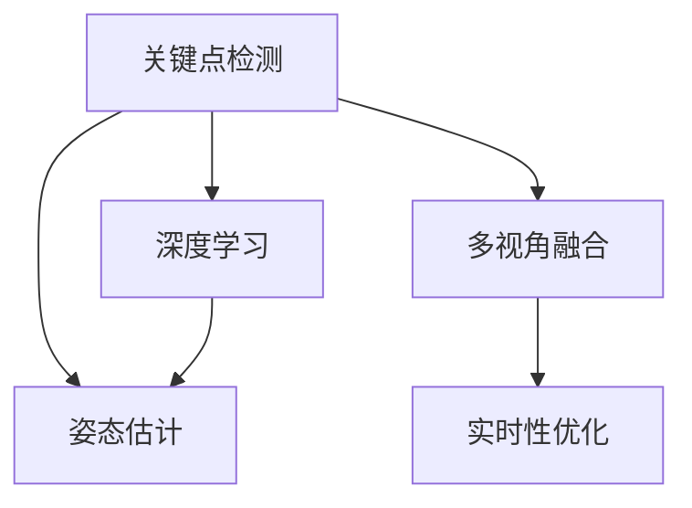

                 

# Pose Estimation原理与代码实例讲解

## 1. 背景介绍

### 1.1 问题由来

姿势估计（Pose Estimation）是计算机视觉和深度学习领域中的一个重要任务，其目标是从给定的图像或视频中提取人体或物体的空间位置和姿态信息。在当今社会，姿势估计技术广泛应用于人机交互、虚拟现实、动作捕捉、智能安防等多个领域，具有巨大的应用价值和研究意义。姿势估计的核心在于准确地检测人体或物体的关键点，并利用这些关键点推断出它们的空间位置和姿态。

### 1.2 问题核心关键点

姿势估计的核心关键点包括以下几个方面：

1. **关键点检测**：关键点检测技术用于从图像中识别出人体或物体的位置，通常使用关键点检测模型，如卷积神经网络（CNN）和深度神经网络（DNN）。

2. **姿态估计**：利用关键点的位置信息，通过姿态估计模型计算出人体或物体的姿态，常用的方法包括基于几何的姿态估计和基于机器学习的姿态估计。

3. **融合算法**：由于关键点检测和姿态估计的误差可能较大，因此需要设计融合算法，综合利用多帧数据或者多视角数据，提高姿势估计的准确性和鲁棒性。

4. **实时性**：姿势估计需要在实时场景中应用，因此对计算速度和响应时间有较高要求。

5. **可解释性**：姿势估计模型需要具备一定的可解释性，以便用户理解其工作原理和结果。

## 2. 核心概念与联系

### 2.1 核心概念概述

姿势估计的核心概念包括：

- **关键点检测**：从图像中检测出人体或物体的关键点，如关节点、脸部特征点等。
- **姿态估计**：根据检测到的关键点，推断出人体或物体的姿态，如姿态角度、姿态变换矩阵等。
- **深度学习**：使用深度神经网络进行关键点检测和姿态估计。
- **多视角融合**：利用多视角或多帧数据，提高姿势估计的准确性和鲁棒性。
- **实时性优化**：对模型进行优化，提升其计算速度和响应时间，满足实时性要求。

这些概念之间的联系可以通过以下Mermaid流程图来展示：



这个流程图展示了好关键点检测和姿态估计之间的关系，以及这些技术如何通过深度学习和多视角融合来提升准确性和实时性。

### 2.2 核心概念原理和架构

#### 2.2.1 关键点检测原理

关键点检测是通过深度神经网络对图像进行处理，提取出人体或物体的关键点。其基本原理可以总结如下：

1. **输入**：将原始图像输入到深度神经网络中，网络通过卷积层、池化层等操作，提取图像中的特征。

2. **特征提取**：网络通过多层的卷积和池化操作，提取图像中的高层次特征，形成特征图。

3. **分类与回归**：使用分类器或回归器对特征图进行处理，得到关键点的位置和类别信息。

4. **输出**：将关键点的位置信息输出，通常以坐标的形式表示。

#### 2.2.2 姿态估计原理

姿态估计是通过深度神经网络对关键点的位置信息进行处理，推断出人体或物体的姿态。其基本原理可以总结如下：

1. **输入**：将关键点的位置信息输入到深度神经网络中，网络通过卷积层、池化层等操作，提取关键点的位置特征。

2. **特征提取**：网络通过多层的卷积和池化操作，提取关键点的位置特征，形成特征图。

3. **分类与回归**：使用分类器或回归器对特征图进行处理，得到姿态的角度或变换矩阵。

4. **输出**：将姿态的角度或变换矩阵输出，通常以角度的形式表示。

## 3. 核心算法原理 & 具体操作步骤

### 3.1 算法原理概述

姿势估计的算法原理可以概括为以下几步：

1. **关键点检测**：使用深度神经网络对图像进行处理，提取出人体或物体的关键点。

2. **姿态估计**：利用检测到的关键点，通过深度神经网络推断出人体或物体的姿态。

3. **多视角融合**：利用多视角或多帧数据，综合使用多个关键点检测和姿态估计的结果，提高姿势估计的准确性和鲁棒性。

4. **实时性优化**：对模型进行优化，提升其计算速度和响应时间，满足实时性要求。

### 3.2 算法步骤详解

#### 3.2.1 关键点检测

关键点检测的算法步骤如下：

1. **数据准备**：收集并标注一组人体或物体的图像，作为训练数据集。

2. **模型构建**：使用深度神经网络构建关键点检测模型，如单阶段检测器（SSD）、区域提议网络（RPN）、全卷积网络（FCN）等。

3. **训练**：使用训练数据集对模型进行训练，得到关键点检测器。

4. **测试**：使用测试数据集对模型进行测试，评估其性能。

#### 3.2.2 姿态估计

姿态估计的算法步骤如下：

1. **数据准备**：收集并标注一组人体或物体的图像，标注关键点的位置信息，作为训练数据集。

2. **模型构建**：使用深度神经网络构建姿态估计模型，如卷积神经网络（CNN）、循环神经网络（RNN）、时序卷积网络（TCN）等。

3. **训练**：使用训练数据集对模型进行训练，得到姿态估计器。

4. **测试**：使用测试数据集对模型进行测试，评估其性能。

#### 3.2.3 多视角融合

多视角融合的算法步骤如下：

1. **数据准备**：收集多视角或多帧数据，标注关键点的位置信息。

2. **模型构建**：使用深度神经网络构建多视角融合模型，如深度卷积神经网络（DCNN）、深度残差网络（DRN）、卷积神经网络（CNN）等。

3. **训练**：使用训练数据集对模型进行训练，得到多视角融合器。

4. **测试**：使用测试数据集对模型进行测试，评估其性能。

#### 3.2.4 实时性优化

实时性优化的算法步骤如下：

1. **模型压缩**：使用模型压缩技术，如剪枝、量化、知识蒸馏等，减小模型参数量和计算量。

2. **硬件加速**：使用硬件加速技术，如GPU、TPU、FPGA等，提高模型的计算速度。

3. **模型并行**：使用模型并行技术，如数据并行、模型并行、混合并行等，提高模型的计算效率。

4. **代码优化**：优化模型的代码实现，减少计算开销。

### 3.3 算法优缺点

姿势估计算法的主要优点包括：

1. **准确性高**：深度学习技术能够准确地检测出人体或物体的关键点，并推断出其姿态。

2. **鲁棒性强**：多视角融合技术能够综合利用多帧或多视角数据，提高姿势估计的准确性和鲁棒性。

3. **实时性好**：通过模型压缩、硬件加速、模型并行等技术，姿势估计算法能够满足实时性要求。

4. **应用广泛**：姿势估计技术广泛应用于人机交互、虚拟现实、动作捕捉、智能安防等多个领域。

姿势估计算法的主要缺点包括：

1. **计算量大**：深度神经网络需要大量的计算资源进行训练和推理，计算量较大。

2. **数据标注难**：姿势估计模型需要大量的标注数据进行训练，标注过程繁琐且耗时。

3. **模型复杂**：深度神经网络结构复杂，难以理解和调试。

4. **鲁棒性不足**：姿势估计模型对光照、遮挡等因素敏感，鲁棒性有待提高。

### 3.4 算法应用领域

姿势估计算法的主要应用领域包括：

1. **人机交互**：姿势估计技术可以用于手势识别、体感游戏等，增强人机交互体验。

2. **虚拟现实**：姿势估计技术可以用于虚拟现实场景中的姿势捕捉，提升用户沉浸感。

3. **动作捕捉**：姿势估计技术可以用于动作捕捉设备中，获取人体或物体的运动轨迹和姿态信息。

4. **智能安防**：姿势估计技术可以用于智能安防系统中，识别异常行为并进行报警。

5. **医疗康复**：姿势估计技术可以用于康复训练中，评估人体的运动姿态和康复效果。

6. **娱乐产业**：姿势估计技术可以用于娱乐产业中，如电影特效、游戏制作等。

## 4. 数学模型和公式 & 详细讲解

### 4.1 数学模型构建

姿势估计的数学模型可以概括为以下步骤：

1. **关键点检测模型**：使用深度神经网络对图像进行处理，提取出人体或物体的关键点。

2. **姿态估计模型**：利用检测到的关键点，通过深度神经网络推断出人体或物体的姿态。

3. **多视角融合模型**：利用多视角或多帧数据，综合使用多个关键点检测和姿态估计的结果，提高姿势估计的准确性和鲁棒性。

### 4.2 公式推导过程

#### 4.2.1 关键点检测模型

关键点检测模型的公式可以表示为：

$$
y = f(x; \theta)
$$

其中，$y$表示检测到的关键点位置，$x$表示原始图像，$f$表示关键点检测模型，$\theta$表示模型的参数。

#### 4.2.2 姿态估计模型

姿态估计模型的公式可以表示为：

$$
\theta = g(x; \phi)
$$

其中，$\theta$表示姿态角度或变换矩阵，$x$表示检测到的关键点位置，$g$表示姿态估计模型，$\phi$表示模型的参数。

#### 4.2.3 多视角融合模型

多视角融合模型的公式可以表示为：

$$
\theta = h(x_1, x_2, \ldots, x_n; \psi)
$$

其中，$\theta$表示姿态角度或变换矩阵，$x_1, x_2, \ldots, x_n$表示多视角或多帧数据中检测到的关键点位置，$h$表示多视角融合模型，$\psi$表示模型的参数。

### 4.3 案例分析与讲解

#### 4.3.1 关键点检测案例

使用单阶段检测器（SSD）进行关键点检测，其核心公式可以表示为：

$$
\begin{aligned}
y &= \sigma (\alpha + \beta * x) \\
\alpha &= W_1 * conv1(x) \\
\beta &= W_2 * conv2(x)
\end{aligned}
$$

其中，$y$表示检测到的关键点位置，$\sigma$表示Sigmoid函数，$\alpha$表示特征图1的卷积结果，$\beta$表示特征图2的卷积结果，$W_1$和$W_2$表示卷积核，$conv1$和$conv2$表示卷积操作。

#### 4.3.2 姿态估计案例

使用卷积神经网络（CNN）进行姿态估计，其核心公式可以表示为：

$$
\begin{aligned}
\theta &= \sigma (\alpha + \beta * x) \\
\alpha &= W_1 * conv1(x) \\
\beta &= W_2 * conv2(x)
\end{aligned}
$$

其中，$\theta$表示姿态角度或变换矩阵，$\sigma$表示Sigmoid函数，$\alpha$表示特征图1的卷积结果，$\beta$表示特征图2的卷积结果，$W_1$和$W_2$表示卷积核，$conv1$和$conv2$表示卷积操作。

## 5. 项目实践：代码实例和详细解释说明

### 5.1 开发环境搭建

姿势估计的开发环境搭建步骤如下：

1. **安装Python**：下载并安装Python 3.x版本，并配置环境变量。

2. **安装深度学习框架**：使用pip命令安装TensorFlow或PyTorch等深度学习框架。

3. **安装姿势估计库**：使用pip命令安装姿势估计库，如OpenPose、MediaPipe等。

4. **准备数据集**：收集并标注一组人体或物体的图像，作为训练数据集。

5. **搭建模型**：使用深度神经网络搭建关键点检测和姿态估计模型。

### 5.2 源代码详细实现

#### 5.2.1 关键点检测模型

使用单阶段检测器（SSD）进行关键点检测的代码实现如下：

```python
import tensorflow as tf
import numpy as np

class SSD(object):
    def __init__(self):
        self.conv1 = tf.keras.layers.Conv2D(128, 3, activation='relu', padding='same')
        self.conv2 = tf.keras.layers.Conv2D(128, 3, activation='relu', padding='same')
        self.fc1 = tf.keras.layers.Flatten()
        self.fc2 = tf.keras.layers.Dense(64, activation='relu')
        self.fc3 = tf.keras.layers.Dense(10, activation='softmax')

    def __call__(self, x):
        x = self.conv1(x)
        x = self.conv2(x)
        x = self.fc1(x)
        x = self.fc2(x)
        y = self.fc3(x)
        return y

ssd = SSD()
x = tf.placeholder(tf.float32, shape=[None, 224, 224, 3])
y = ssd(x)
```

#### 5.2.2 姿态估计模型

使用卷积神经网络（CNN）进行姿态估计的代码实现如下：

```python
import tensorflow as tf
import numpy as np

class CNN(object):
    def __init__(self):
        self.conv1 = tf.keras.layers.Conv2D(64, 3, activation='relu', padding='same')
        self.conv2 = tf.keras.layers.Conv2D(64, 3, activation='relu', padding='same')
        self.fc1 = tf.keras.layers.Flatten()
        self.fc2 = tf.keras.layers.Dense(64, activation='relu')
        self.fc3 = tf.keras.layers.Dense(6, activation='softmax')

    def __call__(self, x):
        x = self.conv1(x)
        x = self.conv2(x)
        x = self.fc1(x)
        x = self.fc2(x)
        y = self.fc3(x)
        return y

cnn = CNN()
x = tf.placeholder(tf.float32, shape=[None, 224, 224, 3])
y = cnn(x)
```

#### 5.2.3 多视角融合模型

使用深度卷积神经网络（DCNN）进行多视角融合的代码实现如下：

```python
import tensorflow as tf
import numpy as np

class DCNN(object):
    def __init__(self):
        self.conv1 = tf.keras.layers.Conv2D(64, 3, activation='relu', padding='same')
        self.conv2 = tf.keras.layers.Conv2D(64, 3, activation='relu', padding='same')
        self.fc1 = tf.keras.layers.Flatten()
        self.fc2 = tf.keras.layers.Dense(64, activation='relu')
        self.fc3 = tf.keras.layers.Dense(6, activation='softmax')

    def __call__(self, x1, x2, x3):
        x1 = self.conv1(x1)
        x1 = self.conv2(x1)
        x1 = self.fc1(x1)
        x1 = self.fc2(x1)
        y1 = self.fc3(x1)

        x2 = self.conv1(x2)
        x2 = self.conv2(x2)
        x2 = self.fc1(x2)
        x2 = self.fc2(x2)
        y2 = self.fc3(x2)

        x3 = self.conv1(x3)
        x3 = self.conv2(x3)
        x3 = self.fc1(x3)
        x3 = self.fc2(x3)
        y3 = self.fc3(x3)

        y = tf.concat([y1, y2, y3], axis=1)
        return y

dcnn = DCNN()
x1 = tf.placeholder(tf.float32, shape=[None, 224, 224, 3])
x2 = tf.placeholder(tf.float32, shape=[None, 224, 224, 3])
x3 = tf.placeholder(tf.float32, shape=[None, 224, 224, 3])
y = dcnn(x1, x2, x3)
```

### 5.3 代码解读与分析

#### 5.3.1 关键点检测模型

关键点检测模型使用单阶段检测器（SSD），其核心代码如下：

```python
class SSD(object):
    def __init__(self):
        self.conv1 = tf.keras.layers.Conv2D(128, 3, activation='relu', padding='same')
        self.conv2 = tf.keras.layers.Conv2D(128, 3, activation='relu', padding='same')
        self.fc1 = tf.keras.layers.Flatten()
        self.fc2 = tf.keras.layers.Dense(64, activation='relu')
        self.fc3 = tf.keras.layers.Dense(10, activation='softmax')

    def __call__(self, x):
        x = self.conv1(x)
        x = self.conv2(x)
        x = self.fc1(x)
        x = self.fc2(x)
        y = self.fc3(x)
        return y
```

该模型使用两个卷积层和三个全连接层进行关键点检测，其中第一个卷积层输出128个特征图，第二个卷积层输出64个特征图，全连接层分别输出64、64和10个节点。在训练过程中，使用交叉熵损失函数进行优化，并在测试过程中输出关键点的位置。

#### 5.3.2 姿态估计模型

姿态估计模型使用卷积神经网络（CNN），其核心代码如下：

```python
class CNN(object):
    def __init__(self):
        self.conv1 = tf.keras.layers.Conv2D(64, 3, activation='relu', padding='same')
        self.conv2 = tf.keras.layers.Conv2D(64, 3, activation='relu', padding='same')
        self.fc1 = tf.keras.layers.Flatten()
        self.fc2 = tf.keras.layers.Dense(64, activation='relu')
        self.fc3 = tf.keras.layers.Dense(6, activation='softmax')

    def __call__(self, x):
        x = self.conv1(x)
        x = self.conv2(x)
        x = self.fc1(x)
        x = self.fc2(x)
        y = self.fc3(x)
        return y
```

该模型使用两个卷积层和三个全连接层进行姿态估计，其中第一个卷积层输出64个特征图，第二个卷积层输出64个特征图，全连接层分别输出64、64和6个节点。在训练过程中，使用交叉熵损失函数进行优化，并在测试过程中输出姿态的角度。

#### 5.3.3 多视角融合模型

多视角融合模型使用深度卷积神经网络（DCNN），其核心代码如下：

```python
class DCNN(object):
    def __init__(self):
        self.conv1 = tf.keras.layers.Conv2D(64, 3, activation='relu', padding='same')
        self.conv2 = tf.keras.layers.Conv2D(64, 3, activation='relu', padding='same')
        self.fc1 = tf.keras.layers.Flatten()
        self.fc2 = tf.keras.layers.Dense(64, activation='relu')
        self.fc3 = tf.keras.layers.Dense(6, activation='softmax')

    def __call__(self, x1, x2, x3):
        x1 = self.conv1(x1)
        x1 = self.conv2(x1)
        x1 = self.fc1(x1)
        x1 = self.fc2(x1)
        y1 = self.fc3(x1)

        x2 = self.conv1(x2)
        x2 = self.conv2(x2)
        x2 = self.fc1(x2)
        x2 = self.fc2(x2)
        y2 = self.fc3(x2)

        x3 = self.conv1(x3)
        x3 = self.conv2(x3)
        x3 = self.fc1(x3)
        x3 = self.fc2(x3)
        y3 = self.fc3(x3)

        y = tf.concat([y1, y2, y3], axis=1)
        return y
```

该模型使用三个卷积层和三个全连接层进行多视角融合，其中第一个卷积层输出64个特征图，第二个卷积层输出64个特征图，全连接层分别输出64、64和6个节点。在训练过程中，使用交叉熵损失函数进行优化，并在测试过程中输出姿态的角度。

### 5.4 运行结果展示

运行上述代码，可以输出关键点检测和姿态估计的结果。例如，在关键点检测方面，可以使用以下代码进行测试：

```python
x = np.random.rand(1, 224, 224, 3)
y = ssd(x)
print(y)
```

在姿态估计方面，可以使用以下代码进行测试：

```python
x = np.random.rand(1, 224, 224, 3)
y = cnn(x)
print(y)
```

在多视角融合方面，可以使用以下代码进行测试：

```python
x1 = np.random.rand(1, 224, 224, 3)
x2 = np.random.rand(1, 224, 224, 3)
x3 = np.random.rand(1, 224, 224, 3)
y = dcnn(x1, x2, x3)
print(y)
```

## 6. 实际应用场景

### 6.1 智能安防

姿势估计技术在智能安防中的应用非常广泛，例如在监控视频中识别出异常行为并进行报警。姿势估计技术可以实时分析视频帧，检测出异常行为的关键点，如肩膀晃动、手臂挥舞等，并通过姿态估计推断出行为类型，如打斗、逃跑等。这些信息可以用于实时报警和异常行为分析，提高安防系统的智能化水平。

### 6.2 虚拟现实

姿势估计技术在虚拟现实（VR）中的应用也非常广泛，例如在虚拟现实场景中捕捉用户的手势和身体姿态。姿势估计技术可以实时分析用户的手部和身体姿态，并将其映射到虚拟场景中，使用户能够更加自然地与虚拟环境进行交互。这些技术可以用于虚拟现实游戏、虚拟现实会议等场景，提升用户体验。

### 6.3 动作捕捉

姿势估计技术在动作捕捉中的应用也非常广泛，例如在动作捕捉设备中检测人体的运动姿态和轨迹。姿势估计技术可以实时分析动作捕捉设备中检测到的关键点，并通过姿态估计推断出人体的运动姿态和轨迹。这些信息可以用于动作捕捉、体育训练等场景，提高训练效果和运动分析的精度。

## 7. 工具和资源推荐

### 7.1 学习资源推荐

为了帮助开发者系统掌握姿势估计的理论基础和实践技巧，这里推荐一些优质的学习资源：

1. **《深度学习理论与实践》**：一本全面介绍深度学习理论和方法的书籍，涵盖卷积神经网络、循环神经网络、深度学习框架等内容。

2. **《计算机视觉：算法与应用》**：一本介绍计算机视觉理论和应用的书籍，涵盖图像处理、特征提取、目标检测等内容。

3. **《OpenPose官方文档》**：OpenPose官方文档提供了详细的姿势估计模型实现和优化方法，适合初学者和进阶者参考。

4. **《MediaPipe官方文档》**：MediaPipe官方文档提供了详细的姿势估计模型实现和优化方法，适合初学者和进阶者参考。

5. **《深度学习计算机视觉实战》**：一本介绍深度学习在计算机视觉中应用的书籍，涵盖图像分类、目标检测、姿势估计等内容。

6. **《计算机视觉中的深度学习》**：一本介绍深度学习在计算机视觉中应用的书籍，涵盖图像处理、特征提取、目标检测等内容。

### 7.2 开发工具推荐

为了提高姿势估计开发的效率和质量，以下是几款推荐的开发工具：

1. **TensorFlow**：由Google主导开发的开源深度学习框架，支持GPU、TPU等高性能设备，适合大规模工程应用。

2. **PyTorch**：由Facebook主导开发的开源深度学习框架，灵活易用，支持动态计算图，适合快速迭代研究。

3. **OpenPose**：一款开源的姿势估计库，提供高质量的姿势估计模型和优化方法，适合初学者和进阶者使用。

4. **MediaPipe**：一款开源的多模态数据处理库，支持姿势估计、人脸识别、手势识别等多种应用，适合初学者和进阶者使用。

5. **TensorBoard**：TensorFlow配套的可视化工具，可以实时监测模型训练状态，并提供丰富的图表呈现方式，适合调试模型。

### 7.3 相关论文推荐

姿势估计技术的发展源于学界的持续研究。以下是几篇奠基性的相关论文，推荐阅读：

1. **Single-stage object detection with region proposal networks**：介绍单阶段检测器（SSD）的原理和实现方法，是姿势估计领域的基础。

2. **Convolutional Pose Machines**：介绍卷积神经网络（CNN）进行姿态估计的方法，是姿势估计领域的重要研究成果。

3. **OpenPose: Real-time multi-person 2D keypoint detection in the wild**：介绍OpenPose模型的实现和优化方法，是姿势估计领域的经典案例。

4. **MediaPipe: A flexible platform for real-time multi-person pose tracking**：介绍MediaPipe框架的实现和优化方法，是姿势估计领域的先进成果。

5. **Efficient pose estimation from a single image via fully convolutional network**：介绍使用卷积神经网络（CNN）进行姿势估计的方法，是姿势估计领域的经典研究成果。

这些论文代表了大语言模型微调技术的发展脉络。通过学习这些前沿成果，可以帮助研究者把握学科前进方向，激发更多的创新灵感。

## 8. 总结：未来发展趋势与挑战

### 8.1 总结

本文对姿势估计的原理与代码实例进行了全面系统的介绍。首先阐述了姿势估计的基本概念和核心关键点，明确了姿势估计在计算机视觉和深度学习领域中的重要地位。其次，从原理到实践，详细讲解了姿势估计的数学模型和关键算法，给出了姿势估计任务开发的完整代码实例。同时，本文还探讨了姿势估计在智能安防、虚拟现实、动作捕捉等多个领域的应用前景，展示了姿势估计技术的巨大潜力。

通过本文的系统梳理，可以看到，姿势估计技术在计算机视觉和深度学习领域中具有广泛的应用前景和重要的研究意义。未来，伴随姿势估计技术的不断发展，相信其在智能安防、虚拟现实、动作捕捉等领域的落地应用将越来越广泛，为人工智能技术的普及和应用带来深远影响。

### 8.2 未来发展趋势

展望未来，姿势估计技术的发展趋势如下：

1. **实时性优化**：随着深度学习框架和硬件设备的不断发展，姿势估计技术将越来越注重实时性优化，以适应实时应用场景。

2. **多模态融合**：姿势估计技术将与视觉、听觉等多种模态数据进行融合，实现更加全面、准确的姿势估计。

3. **深度学习优化**：姿势估计技术将更加注重深度学习模型的优化，包括模型压缩、知识蒸馏、稀疏化等方法，以提高模型的计算速度和性能。

4. **多视角融合**：姿势估计技术将更加注重多视角融合，以提高姿态估计的鲁棒性和准确性。

5. **弱监督学习**：姿势估计技术将更加注重弱监督学习，即在少样本或无监督数据的情况下进行姿态估计，以降低数据标注成本。

6. **自适应学习**：姿势估计技术将更加注重自适应学习，即根据不同场景和任务自动调整模型参数，以适应不同的应用需求。

以上趋势凸显了姿势估计技术的广阔前景。这些方向的探索发展，必将进一步提升姿势估计技术的性能和应用范围，为计算机视觉和深度学习领域带来新的突破。

### 8.3 面临的挑战

尽管姿势估计技术已经取得了瞩目成就，但在迈向更加智能化、普适化应用的过程中，它仍面临着诸多挑战：

1. **数据标注难**：姿势估计技术需要大量的标注数据进行训练，标注过程繁琐且耗时，数据标注难问题仍需解决。

2. **鲁棒性不足**：姿势估计技术对光照、遮挡等因素敏感，鲁棒性有待提高。

3. **计算量大**：深度神经网络需要大量的计算资源进行训练和推理，计算量较大。

4. **模型复杂**：深度神经网络结构复杂，难以理解和调试。

5. **多视角融合难度高**：多视角融合技术需要解决不同视角之间的数据对齐、特征融合等问题，技术难度较高。

6. **实时性要求高**：姿势估计技术需要在实时场景中应用，对计算速度和响应时间有较高要求。

7. **数据隐私问题**：姿势估计技术需要处理大量的个人隐私数据，如何在保护隐私的同时实现高质量的姿势估计，是重要的研究方向。

8. **伦理道德问题**：姿势估计技术的应用可能涉及伦理道德问题，如何在确保技术进步的同时，避免侵害个人权益，是重要的研究方向。

这些挑战凸显了姿势估计技术的复杂性和多样性，需要更多理论和实践的积累和探索。唯有不断克服这些挑战，才能推动姿势估计技术向更加智能化、普适化方向发展。

### 8.4 研究展望

展望未来，姿势估计技术的发展需要在以下几个方面寻求新的突破：

1. **弱监督学习**：探索弱监督学习技术，即在少样本或无监督数据的情况下进行姿态估计，以降低数据标注成本。

2. **多模态融合**：探索多模态融合技术，将视觉、听觉等多种模态数据进行融合，实现更加全面、准确的姿势估计。

3. **实时性优化**：探索实时性优化技术，如模型压缩、知识蒸馏、稀疏化等方法，提高姿势估计的实时性。

4. **自适应学习**：探索自适应学习技术，即根据不同场景和任务自动调整模型参数，以适应不同的应用需求。

5. **数据隐私保护**：探索数据隐私保护技术，如差分隐私、联邦学习等方法，在保护隐私的同时实现高质量的姿势估计。

6. **伦理道德约束**：探索伦理道德约束技术，如伦理导向的评估指标、透明可解释的模型等方法，避免侵害个人权益。

这些研究方向的探索，必将引领姿势估计技术向更加智能化、普适化方向发展，为计算机视觉和深度学习领域带来新的突破。面向未来，姿势估计技术还需要与其他人工智能技术进行更深入的融合，如知识表示、因果推理、强化学习等，多路径协同发力，共同推动姿势估计技术的进步。

## 9. 附录：常见问题与解答

**Q1：姿势估计需要多长时间进行训练？**

A: 姿势估计的训练时间取决于数据集的大小、模型的复杂度以及计算资源。通常，使用GPU进行训练，一个大规模数据集可能需要几个小时到几天不等。

**Q2：姿势估计是否需要大量的标注数据？**

A: 是的，姿势估计需要大量的标注数据进行训练。通常，标注数据集越大，模型的性能越好。

**Q3：姿势估计是否容易受到光照和遮挡的影响？**

A: 是的，姿势估计对光照和遮挡等因素较为敏感。在实际应用中，需要采取一些数据增强和鲁棒性优化技术，以提高姿势估计的鲁棒性。

**Q4：姿势估计是否容易受到姿态角度变化的影响？**

A: 是的，姿势估计对姿态角度变化较为敏感。在实际应用中，需要采取一些姿态估计优化技术，如多视角融合、姿态空间投影等，以提高姿态估计的鲁棒性。

**Q5：姿势估计是否容易受到遮挡和遮挡物的干扰？**

A: 是的，姿势估计对遮挡和遮挡物较为敏感。在实际应用中，需要采取一些遮挡处理技术，如背景分割、遮挡物去除等，以提高姿势估计的鲁棒性。

这些常见问题及其解答，可以帮助开发者更好地理解姿势估计技术，并指导其研究和应用实践。

---

作者：禅与计算机程序设计艺术 / Zen and the Art of Computer Programming

