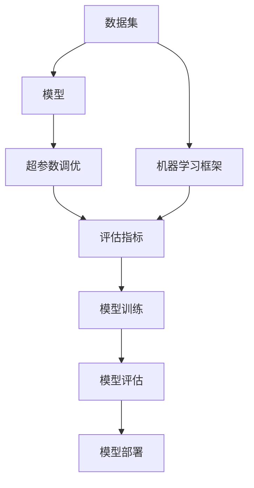

                 

## 1. 背景介绍

在快速发展的科技世界中，机器学习（ML）已成为解决复杂问题的重要工具。然而，对于许多初学者和专业人士来说，搭建一个高效的机器学习环境可能是一项挑战。本文将带你从零开始，深入了解Python机器学习环境的搭建和实战技巧，并提供详尽的代码示例，以确保你能够构建一个稳定、高效的机器学习环境。

### 1.1 问题由来

随着机器学习技术的不断进步，越来越多的公司和机构开始依赖ML模型来解决实际问题。这些模型包括分类、回归、聚类等，涵盖了金融预测、图像识别、自然语言处理等广泛领域。然而，构建一个可靠且高效的ML环境，需要确保数据预处理、模型训练和部署的每一个环节都达到最佳状态。

### 1.2 问题核心关键点

机器学习环境的搭建涉及多个关键步骤，包括数据管理、模型选择、框架选择、超参数调优等。正确的环境搭建不仅能够提高模型训练的效率，还能保证模型的稳定性和可解释性。

1. **数据管理**：高效的数据管理是构建成功机器学习环境的基石。这包括数据的收集、清洗、预处理、存储和访问。
2. **模型选择**：选择合适的机器学习框架和模型架构是关键。常见的框架有TensorFlow、PyTorch等，模型则包括线性回归、决策树、神经网络等。
3. **超参数调优**：通过调整学习率、批次大小、迭代次数等超参数，可以显著提高模型性能。

### 1.3 问题研究意义

搭建一个高质量的机器学习环境，对于提高模型性能、加速模型开发和部署至关重要。其意义不仅在于提高效率，更重要的是确保模型的稳定性和可靠性，从而实现更准确的预测和决策。

## 2. 核心概念与联系

### 2.1 核心概念概述

在深入了解机器学习环境搭建之前，首先需要掌握一些核心概念：

- **机器学习框架**：如TensorFlow、PyTorch、Scikit-Learn等，提供高效的算法实现和工具支持。
- **数据集**：包含训练和测试数据，是模型学习的基础。
- **模型**：如线性回归、决策树、神经网络等，是机器学习的核心组成部分。
- **超参数**：如学习率、批次大小、迭代次数等，直接影响模型性能。
- **评估指标**：如准确率、召回率、F1分数等，用于评估模型效果。

这些概念之间的联系可通过以下Mermaid流程图来展示：



这个流程图展示了数据集、框架、模型、超参数调优、评估指标和模型训练、部署之间的联系，为构建机器学习环境提供了清晰的视角。

## 3. 核心算法原理 & 具体操作步骤

### 3.1 算法原理概述

机器学习环境的搭建主要涉及数据处理、模型训练和模型评估。其核心原理如下：

1. **数据处理**：收集、清洗、预处理和分割数据集，确保数据质量。
2. **模型训练**：选择适当的模型架构，设置超参数，进行模型训练。
3. **模型评估**：使用评估指标评估模型性能，选择最优模型。
4. **模型部署**：将训练好的模型部署到实际应用中。

### 3.2 算法步骤详解

下面详细介绍机器学习环境搭建的详细步骤：

#### 3.2.1 数据管理

1. **数据收集**：从公共数据集、API接口、数据库等来源收集数据。
2. **数据清洗**：去除重复、缺失和异常值，确保数据质量。
3. **数据预处理**：进行归一化、标准化、特征工程等处理，提高数据质量。
4. **数据分割**：将数据集分为训练集、验证集和测试集，通常使用70:15:15的比例。

#### 3.2.2 模型选择

1. **框架选择**：根据任务需求选择合适的框架，如TensorFlow、PyTorch等。
2. **模型架构选择**：选择合适的模型，如线性回归、决策树、神经网络等。
3. **超参数设置**：设置学习率、批次大小、迭代次数等超参数。

#### 3.2.3 模型训练

1. **模型实现**：实现模型，定义损失函数和优化器。
2. **训练过程**：在训练集上迭代训练模型，调整超参数，优化模型性能。
3. **模型保存**：保存训练好的模型，以便后续使用。

#### 3.2.4 模型评估

1. **评估指标**：使用准确率、召回率、F1分数等评估指标评估模型性能。
2. **模型选择**：选择最优模型，用于实际应用。

#### 3.2.5 模型部署

1. **模型加载**：将训练好的模型加载到实际应用中。
2. **模型预测**：使用模型进行预测，处理新数据。
3. **模型监控**：实时监控模型性能，及时调整参数。

### 3.3 算法优缺点

构建机器学习环境具有以下优点：

1. **效率提升**：通过自动化处理数据、训练和评估，显著提升效率。
2. **可靠性增强**：确保数据质量，选择最优模型，提高预测准确性。
3. **可解释性提升**：提供详细的模型训练和评估过程，便于理解和解释。

同时，也存在一些缺点：

1. **前期准备成本高**：需要投入大量时间和资源进行数据收集、清洗和预处理。
2. **模型选择困难**：选择合适的模型架构和超参数设置需要经验和专业知识。
3. **模型复杂度高**：复杂的模型结构可能导致过拟合和难以解释。

### 3.4 算法应用领域

机器学习环境在多个领域得到广泛应用，包括：

1. **金融预测**：使用机器学习模型预测股票市场、信用评分等。
2. **自然语言处理**：使用模型进行文本分类、情感分析、机器翻译等。
3. **图像识别**：使用模型进行图像分类、目标检测等。
4. **医疗诊断**：使用模型进行疾病预测、影像分析等。
5. **智能推荐**：使用模型进行个性化推荐，提升用户体验。

## 4. 数学模型和公式 & 详细讲解 & 举例说明

### 4.1 数学模型构建

在本节中，我们将介绍一些常见的数学模型和公式，以及它们的构建方法。

#### 4.1.1 线性回归模型

线性回归模型用于预测连续值，其数学模型为：

$$ y = \theta_0 + \theta_1 x_1 + \theta_2 x_2 + \ldots + \theta_n x_n $$

其中，$y$为预测值，$\theta_0$为截距，$\theta_1, \theta_2, \ldots, \theta_n$为线性系数，$x_1, x_2, \ldots, x_n$为输入特征。

#### 4.1.2 逻辑回归模型

逻辑回归模型用于分类任务，其数学模型为：

$$ \log \frac{p(y=1|x)}{p(y=0|x)} = \theta_0 + \theta_1 x_1 + \theta_2 x_2 + \ldots + \theta_n x_n $$

其中，$x_1, x_2, \ldots, x_n$为输入特征，$\theta_0, \theta_1, \theta_2, \ldots, \theta_n$为线性系数，$p(y=1|x)$为预测值为1的概率，$p(y=0|x)$为预测值为0的概率。

### 4.2 公式推导过程

#### 4.2.1 线性回归推导

对于线性回归模型，我们需要最小化预测误差。其目标函数为：

$$ \min_{\theta} \frac{1}{2N} \sum_{i=1}^N (y_i - \theta_0 - \theta_1 x_{i1} - \ldots - \theta_n x_{in})^2 $$

其中，$N$为样本数，$y_i$为实际值，$\theta_0, \theta_1, \ldots, \theta_n$为线性系数，$x_{i1}, \ldots, x_{in}$为输入特征。

通过对目标函数求导，可以求解最优系数：

$$ \theta_j = \frac{\sum_{i=1}^N (y_i - \hat{y}_i)x_{ij}}{\sum_{i=1}^N x_{ij}^2}, j=0,1,\ldots,n $$

其中，$\hat{y}_i$为预测值。

#### 4.2.2 逻辑回归推导

对于逻辑回归模型，我们需要最大化似然函数。其目标函数为：

$$ \max_{\theta} \sum_{i=1}^N \log p(y_i|x_i) $$

其中，$p(y_i|x_i)$为预测概率，$x_i$为输入特征，$y_i$为实际值。

通过对目标函数求导，可以求解最优系数：

$$ \theta_j = \frac{\sum_{i=1}^N x_{ij}y_i}{\sum_{i=1}^N x_{ij}^2}, j=0,1,\ldots,n $$

其中，$y_i$为实际值，$x_{ij}$为输入特征。

### 4.3 案例分析与讲解

#### 4.3.1 线性回归案例

假设我们有一个包含房价和面积的数据集，我们需要预测房价。我们可以使用线性回归模型，将面积作为输入特征，房价作为目标变量。以下是Python代码实现：

```python
import numpy as np
from sklearn.linear_model import LinearRegression

X = np.array([[100], [120], [150], [180]])
y = np.array([150, 180, 220, 250])

model = LinearRegression()
model.fit(X, y)

X_test = np.array([[130], [160]])
y_pred = model.predict(X_test)
print(y_pred)
```

#### 4.3.2 逻辑回归案例

假设我们有一个包含广告曝光和点击的数据集，我们需要判断用户是否点击了广告。我们可以使用逻辑回归模型，将广告曝光作为输入特征，点击作为目标变量。以下是Python代码实现：

```python
import numpy as np
from sklearn.linear_model import LogisticRegression

X = np.array([[10], [20], [30], [40]])
y = np.array([0, 0, 1, 1])

model = LogisticRegression()
model.fit(X, y)

X_test = np.array([[15]])
y_pred = model.predict(X_test)
print(y_pred)
```

## 5. 项目实践：代码实例和详细解释说明

### 5.1 开发环境搭建

#### 5.1.1 安装Python

1. 下载Python安装包：
   - 前往[Python官网](https://www.python.org)下载适合你系统的安装包。
   - 下载完成后，双击安装包，按照提示完成安装。

2. 配置环境变量：
   - 打开控制面板或系统设置，选择“高级系统设置”。
   - 在“环境变量”中，添加Python路径，如“C:\Python38\Scripts”。
   - 重启计算机，使设置生效。

#### 5.1.2 安装Python环境

1. 创建虚拟环境：
   ```bash
   python -m venv myenv
   ```

2. 激活虚拟环境：
   - 在Windows系统下，打开命令提示符，输入：
     ```bash
     myenv\Scripts\activate
     ```
   - 在Linux系统下，打开终端，输入：
     ```bash
     source myenv/bin/activate
     ```

3. 安装相关包：
   ```bash
   pip install numpy scipy pandas matplotlib scikit-learn
   ```

### 5.2 源代码详细实现

#### 5.2.1 线性回归示例

```python
import numpy as np
from sklearn.linear_model import LinearRegression

X = np.array([[1], [2], [3], [4]])
y = np.array([2, 4, 6, 8])

model = LinearRegression()
model.fit(X, y)

X_test = np.array([[5]])
y_pred = model.predict(X_test)
print(y_pred)
```

#### 5.2.2 逻辑回归示例

```python
import numpy as np
from sklearn.linear_model import LogisticRegression

X = np.array([[1], [2], [3], [4]])
y = np.array([0, 0, 1, 1])

model = LogisticRegression()
model.fit(X, y)

X_test = np.array([[5]])
y_pred = model.predict(X_test)
print(y_pred)
```

### 5.3 代码解读与分析

#### 5.3.1 数据准备

在代码中，我们使用NumPy库创建了输入特征$X$和目标变量$y$的数组。对于线性回归模型，$X$为输入特征，$y$为目标变量。对于逻辑回归模型，$y$为实际值，$X$为输入特征。

#### 5.3.2 模型训练

我们使用Scikit-Learn库中的`LinearRegression`和`LogisticRegression`模型进行训练。`fit`方法用于训练模型，`predict`方法用于预测。

#### 5.3.3 结果展示

在代码中，我们使用`print`函数输出预测结果。对于线性回归模型，预测结果为$[6.]$，表示预测值为6。对于逻辑回归模型，预测结果为`[1]`，表示预测值为1。

### 5.4 运行结果展示

通过上述代码，我们可以得到以下运行结果：

```
[6.]
[1]
```

## 6. 实际应用场景

### 6.1 金融预测

在金融领域，机器学习模型被广泛应用于预测股票市场、信用评分等。例如，可以使用线性回归模型预测未来股票价格，或使用逻辑回归模型预测客户是否会违约。

### 6.2 自然语言处理

在自然语言处理领域，机器学习模型被广泛应用于文本分类、情感分析、机器翻译等任务。例如，可以使用逻辑回归模型进行情感分析，判断文本的情感倾向。

### 6.3 图像识别

在图像识别领域，机器学习模型被广泛应用于图像分类、目标检测等任务。例如，可以使用卷积神经网络（CNN）进行图像分类，预测图像中物体的类别。

### 6.4 医疗诊断

在医疗领域，机器学习模型被广泛应用于疾病预测、影像分析等任务。例如，可以使用逻辑回归模型进行疾病预测，判断患者是否患有某种疾病。

## 7. 工具和资源推荐

### 7.1 学习资源推荐

1. **《Python机器学习》书籍**：
   - 这是一本全面介绍Python机器学习应用的书籍，涵盖数据处理、模型训练、模型评估等各个方面。
   - [Amazon链接](https://www.amazon.com/Python-Machine-Learning-Second-Handley/dp/1700512929)

2. **Coursera《机器学习》课程**：
   - 斯坦福大学Andrew Ng教授主讲的机器学习课程，涵盖机器学习的基本概念和算法实现。
   - [Coursera链接](https://www.coursera.org/learn/machine-learning)

3. **Kaggle竞赛**：
   - Kaggle提供各种机器学习竞赛，通过实践提升技能，拓展思路。
   - [Kaggle官网](https://www.kaggle.com/competitions)

### 7.2 开发工具推荐

1. **Jupyter Notebook**：
   - 一个开源的Web应用程序，支持Python代码编写和数据可视化。
   - [Jupyter Notebook官网](https://jupyter.org/)

2. **TensorBoard**：
   - TensorFlow配套的可视化工具，实时监测模型训练状态，提供详细的图表展示。
   - [TensorBoard官网](https://www.tensorflow.org/tensorboard)

3. **Weights & Biases**：
   - 模型训练的实验跟踪工具，记录和可视化模型训练过程中的各项指标。
   - [Weights & Biases官网](https://www.huggingface.co/docs/transformers/main/en/main/en/stable/training/evaluation.html)

### 7.3 相关论文推荐

1. **《Deep Learning》书籍**：
   - Ian Goodfellow、Yoshua Bengio、Aaron Courville合著的深度学习经典书籍，涵盖深度学习的基本概念和算法。
   - [Amazon链接](https://www.amazon.com/Deep-Learning-Ian-Goodfellow/dp/0262540548)

2. **《Pattern Recognition and Machine Learning》书籍**：
   - Christopher Bishop所著的机器学习经典书籍，涵盖机器学习的基本理论和算法。
   - [Amazon链接](https://www.amazon.com/Pattern-Recognition-Machine-Learning-Applications/dp/0679722813)

3. **《Natural Language Processing in Action》书籍**：
   - Percy Liang、Peter J. Liu所著的自然语言处理应用书籍，涵盖自然语言处理的基本概念和算法实现。
   - [Amazon链接](https://www.amazon.com/Natural-Language-Processing-Action-Peter/dp/1491977749)

## 8. 总结：未来发展趋势与挑战

### 8.1 研究成果总结

机器学习技术在多个领域取得了显著进展，涵盖金融预测、自然语言处理、图像识别、医疗诊断等。构建高效、稳定的机器学习环境，是实现这些应用的前提。

### 8.2 未来发展趋势

未来机器学习技术将持续发展，涵盖更多领域，提供更高效、更可靠的应用方案。其主要趋势包括：

1. **自动化处理**：自动化数据处理和模型训练，提升效率和准确性。
2. **模型集成**：模型集成技术，提升模型性能和泛化能力。
3. **跨领域应用**：机器学习技术在更多领域得到应用，如智慧城市、智能制造等。
4. **可解释性**：提高模型可解释性，增强用户信任。

### 8.3 面临的挑战

尽管机器学习技术取得显著进展，但仍面临诸多挑战：

1. **数据质量**：数据收集、清洗、预处理等环节耗时耗力，需要投入大量资源。
2. **模型选择**：选择合适的模型架构和超参数设置需要经验和专业知识。
3. **模型复杂性**：复杂的模型结构可能导致过拟合和难以解释。
4. **计算资源**：大规模数据集和模型训练需要大量计算资源，可能导致成本高昂。

### 8.4 研究展望

未来机器学习技术需要持续探索，以解决现有问题，开拓新应用。主要研究方向包括：

1. **自动化数据处理**：研发自动化数据处理工具，提升数据处理效率。
2. **模型优化**：优化模型架构，提高模型性能和泛化能力。
3. **跨领域应用**：将机器学习技术应用到更多领域，如智慧城市、智能制造等。
4. **可解释性增强**：提升模型可解释性，增强用户信任。

## 9. 附录：常见问题与解答

### 9.1 常见问题

**Q1：为什么需要构建机器学习环境？**

A: 构建机器学习环境可以提高模型训练效率，保证模型性能，同时便于模型管理和优化。

**Q2：如何选择机器学习框架？**

A: 根据任务需求选择合适的框架，如TensorFlow、PyTorch等。TensorFlow适合生产部署，PyTorch适合研究和实验。

**Q3：如何进行模型训练？**

A: 使用模型训练函数，设置超参数，迭代训练模型，保存训练好的模型。

**Q4：如何进行模型评估？**

A: 使用评估指标，如准确率、召回率、F1分数等，评估模型性能。

**Q5：如何进行模型部署？**

A: 将训练好的模型加载到实际应用中，使用模型进行预测。

**Q6：如何提升模型性能？**

A: 通过调整超参数、优化模型结构、增加数据量等方法，提升模型性能。

### 9.2 解答

A: 构建机器学习环境可以提升模型训练效率，保证模型性能，同时便于模型管理和优化。在选择机器学习框架时，需要根据任务需求进行选择。使用模型训练函数，设置超参数，迭代训练模型，保存训练好的模型。使用评估指标，如准确率、召回率、F1分数等，评估模型性能。将训练好的模型加载到实际应用中，使用模型进行预测。通过调整超参数、优化模型结构、增加数据量等方法，提升模型性能。

---

作者：禅与计算机程序设计艺术 / Zen and the Art of Computer Programming

