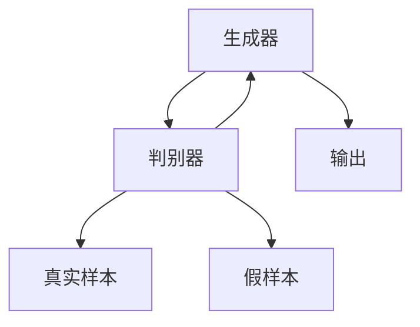

                 

# Python机器学习实战：生成对抗网络(GAN)的原理与应用

> 关键词：生成对抗网络, GAN, 深度学习, 机器学习, 图像生成, 图像修复, 模型训练, 模型部署

## 1. 背景介绍

### 1.1 问题由来
生成对抗网络（Generative Adversarial Networks, GANs）是深度学习领域的一个重要分支，由Ian Goodfellow等人在2014年提出。GANs通过训练两个神经网络：生成器（Generator）和判别器（Discriminator），相互博弈学习，生成高质量的样本。GANs被广泛应用于图像生成、图像修复、风格迁移、数据增强等众多领域，产生了深远影响。

### 1.2 问题核心关键点
GANs的核心在于通过对抗训练（Adversarial Training）使生成器能够生成与真实样本难以区分的假样本。其主要流程如下：
1. 生成器生成样本，判别器判断样本的真实性。
2. 判别器通过与生成器博弈学习，提升判别能力。
3. 生成器也通过博弈学习，提升生成能力。
4. 通过不断迭代训练，生成器生成的样本逼近真实样本。

GANs的训练过程，可以理解为一轮轮“猫鼠游戏”，生成器和判别器不断对抗学习，最终生成器能够生成逼真的假样本，判别器难以区分真实样本与假样本。

### 1.3 问题研究意义
GANs对生成式模型和图像处理技术的发展，具有重要意义：

1. **生成高质量的图像**：GANs能够生成逼真、多样化的图像，应用于图像生成、修复、增强等任务。
2. **数据增强**：GANs能够生成大量的增强数据，提升训练集的多样性，提高模型的泛化能力。
3. **风格迁移**：GANs能够实现图像风格的迁移，将图像的风格从一个样本转移到另一个样本。
4. **模拟数据**：GANs能够生成各种类型的模拟数据，如3D模型、视频、音频等，广泛应用于虚拟现实、游戏开发等领域。
5. **解决数据不足问题**：GANs可以生成缺失的数据，如解决医学影像数据不足、历史文档缺失等问题。

## 2. 核心概念与联系

### 2.1 核心概念概述

为了更好地理解GANs，我们首先介绍几个核心概念：

- **生成器（Generator）**：负责生成假样本的神经网络，通常为全连接神经网络或卷积神经网络（CNN）。生成器的目标是生成与真实样本难以区分的假样本。
- **判别器（Discriminator）**：负责区分真实样本与假样本的二分类神经网络，通常为卷积神经网络。判别器的目标是最大化区分真实样本与假样本的能力。
- **损失函数（Loss Function）**：GANs训练中使用的损失函数，通常包括生成器的损失函数和判别器的损失函数。常见的损失函数包括生成器损失函数（Generator Loss）和判别器损失函数（Discriminator Loss）。
- **对抗训练（Adversarial Training）**：GANs训练中的关键技术，通过让生成器和判别器相互博弈学习，提高生成器的生成能力和判别器的判别能力。
- **稳定器（Stabilizer）**：为解决GANs训练不稳定问题而引入的技术，如梯度惩罚、Wasserstein GAN等，提高模型的稳定性。
- **GANS变体（GAN Variants）**：基于GANs模型的变体，如条件GAN（Conditional GAN）、变分自编码器（Variational Autoencoder, VAE）等，进一步提升模型的性能。

这些概念通过对抗训练形成相互博弈的关系，共同推动GANs生成高质量样本的能力。

### 2.2 核心概念原理和架构的 Mermaid 流程图



这个流程图展示了GANs的基本架构：生成器生成假样本，判别器判断真假样本，并返回判别结果。通过对抗训练，生成器不断提升生成能力，判别器不断提升判别能力。

## 3. 核心算法原理 & 具体操作步骤

### 3.1 算法原理概述

GANs的训练流程分为两个部分：生成器的训练和判别器的训练。

1. **生成器的训练**：生成器通过输入噪声，生成假样本。将生成的假样本输入判别器，判别器返回的判别结果作为生成器的损失函数，反向传播更新生成器的参数。
2. **判别器的训练**：判别器通过输入真实样本和假样本，预测其真实性。将真实样本的判别结果设置为1，假样本的判别结果设置为0。将判别器预测的真实性结果作为损失函数，反向传播更新判别器的参数。

两个过程交替进行，直到生成器和判别器达到平衡状态。

### 3.2 算法步骤详解

以下是GANs训练的具体步骤：

1. **初始化模型**：随机初始化生成器和判别器的参数。
2. **生成器前向传播**：输入随机噪声，生成假样本。
3. **判别器前向传播**：输入真实样本和生成的假样本，返回判别结果。
4. **生成器损失计算**：将判别器的输出作为生成器的损失函数，反向传播更新生成器的参数。
5. **判别器损失计算**：将真实样本的判别结果设置为1，假样本的判别结果设置为0，将判别器的输出作为判别器的损失函数，反向传播更新判别器的参数。
6. **交替迭代**：重复2-5步骤，直到生成器和判别器达到平衡状态。

### 3.3 算法优缺点

GANs的优点包括：
1. **生成高质量样本**：GANs能够生成逼真、多样化的样本，广泛应用于图像生成、修复、增强等任务。
2. **数据增强**：GANs能够生成大量的增强数据，提升训练集的多样性，提高模型的泛化能力。
3. **风格迁移**：GANs能够实现图像风格的迁移，将图像的风格从一个样本转移到另一个样本。
4. **模拟数据**：GANs能够生成各种类型的模拟数据，如3D模型、视频、音频等，广泛应用于虚拟现实、游戏开发等领域。
5. **解决数据不足问题**：GANs可以生成缺失的数据，如解决医学影像数据不足、历史文档缺失等问题。

GANs的缺点包括：
1. **训练不稳定**：GANs训练过程中容易陷入不稳定状态，生成器和判别器的损失函数波动较大。
2. **样本多样性不足**：GANs生成的样本可能存在多样性不足的问题，容易出现模式塌陷（Mode Collapse）现象。
3. **计算资源消耗大**：GANs需要大量的计算资源，训练过程较慢。
4. **对抗样本易受攻击**：GANs生成的样本可能存在对抗样本问题，容易被对抗攻击。

### 3.4 算法应用领域

GANs广泛应用于以下几个领域：

- **图像生成**：如人脸生成、风格迁移、图像补全等。
- **图像修复**：如图像去噪、图像去雾、图像超分辨率等。
- **数据增强**：如医学影像增强、自然场景增强等。
- **模拟数据生成**：如3D模型生成、视频生成等。
- **风格迁移**：如将图片风格转换为其他风格等。

## 4. 数学模型和公式 & 详细讲解 & 举例说明

### 4.1 数学模型构建

GANs的训练过程可以表示为以下数学模型：

设 $G$ 为生成器，$D$ 为判别器，$x$ 为真实样本，$z$ 为噪声向量，$G(z)$ 为生成器生成的假样本。

**生成器损失函数**：

$$
L_G = \mathbb{E}_{z \sim p(z)}[\log(1 - D(G(z)))]
$$

**判别器损失函数**：

$$
L_D = \mathbb{E}_{x \sim p(x)}[\log(D(x))] + \mathbb{E}_{z \sim p(z)}[\log(1 - D(G(z)))]
$$

在训练过程中，生成器和判别器通过对抗训练不断优化：

**生成器更新**：

$$
\theta_G \leftarrow \theta_G - \alpha \nabla_{\theta_G}L_G
$$

**判别器更新**：

$$
\theta_D \leftarrow \theta_D - \alpha \nabla_{\theta_D}L_D
$$

其中，$\alpha$ 为学习率，$p(z)$ 为噪声向量的概率分布，通常假设为标准正态分布。

### 4.2 公式推导过程

以风格迁移为例，推导GANs的生成器损失函数。

假设有一个生成器 $G$，将输入图像 $x$ 转换成风格 $y$，然后通过一个解码器 $D$ 还原为图像 $z$。则风格迁移过程可以表示为：

$$
G(x) \rightarrow y \rightarrow z \rightarrow G(z)
$$

目标是将图像 $x$ 的风格 $y$ 转移到生成器生成的假样本 $G(z)$ 中，使得生成的图像 $G(z)$ 具有风格 $y$ 的特征。

**生成器损失函数**：

$$
L_G = \frac{1}{N}\sum_{i=1}^{N}||G(z_i) - y_i||_2^2
$$

其中，$z_i$ 为输入噪声向量，$y_i$ 为风格向量，$||\cdot||_2$ 表示L2范数，$N$ 为样本数量。

**判别器损失函数**：

$$
L_D = \frac{1}{N}\sum_{i=1}^{N}[\log(D(x_i)) + \log(1 - D(G(z_i)))]
$$

其中，$x_i$ 为输入图像，$D(x_i)$ 为判别器对图像 $x_i$ 的真实性预测，$1 - D(G(z_i))$ 为判别器对生成器生成的假样本 $G(z_i)$ 的真实性预测。

### 4.3 案例分析与讲解

以GANs应用于医学图像增强为例，进行详细讲解。

**任务描述**：
医学图像增强是指将低分辨率、噪声较多的医学图像提升为高分辨率、清晰的图像。

**数据准备**：
收集大量医学图像及其对应的高分辨率图像，作为真实样本和假样本。

**模型搭建**：
搭建一个GANs模型，包含一个生成器和一个判别器。生成器将低分辨率医学图像转换为高分辨率医学图像，判别器判断输入图像的真实性。

**训练流程**：
1. **初始化模型**：随机初始化生成器和判别器的参数。
2. **生成器前向传播**：输入低分辨率医学图像，生成高分辨率医学图像。
3. **判别器前向传播**：输入真实图像和生成的假图像，返回判别结果。
4. **生成器损失计算**：将判别器的输出作为生成器的损失函数，反向传播更新生成器的参数。
5. **判别器损失计算**：将真实图像的判别结果设置为1，假图像的判别结果设置为0，将判别器的输出作为判别器的损失函数，反向传播更新判别器的参数。
6. **交替迭代**：重复2-5步骤，直到生成器和判别器达到平衡状态。

**结果分析**：
训练结束后，生成的高分辨率医学图像与真实图像在质量上几乎无法区分，实现了医学图像的增强。

## 5. 项目实践：代码实例和详细解释说明

### 5.1 开发环境搭建

在进行GANs的开发和实践前，我们需要准备以下开发环境：

1. **安装Python**：从官网下载并安装Python 3.8或更高版本。
2. **安装TensorFlow或PyTorch**：选择其中一个深度学习框架，如TensorFlow 2.0或PyTorch。
3. **安装Keras**：Keras是一个高层次的深度学习API，可以方便地搭建和训练GANs模型。

完成以上步骤后，即可在开发环境中开始GANs的实践。

### 5.2 源代码详细实现

以下是使用TensorFlow和Keras实现GANs模型的代码实现：

```python
import tensorflow as tf
from tensorflow.keras.layers import Input, Dense, Reshape, Flatten
from tensorflow.keras.models import Model

# 定义生成器
def build_generator():
    input = Input(shape=(100,))
    dense1 = Dense(256)(input)
    relu1 = tf.nn.relu(dense1)
    dense2 = Dense(1024)(relu1)
    relu2 = tf.nn.relu(dense2)
    dense3 = Dense(784)(relu2)
    output = Dense(784, activation='sigmoid')(dense3)
    model = Model(input, output)
    return model

# 定义判别器
def build_discriminator():
    input = Input(shape=(784,))
    dense1 = Dense(512)(input)
    relu1 = tf.nn.relu(dense1)
    dense2 = Dense(256)(relu1)
    relu2 = tf.nn.relu(dense2)
    output = Dense(1, activation='sigmoid')(dense2)
    model = Model(input, output)
    return model

# 定义GANs模型
def build_gans(generator, discriminator):
    generator_output = generator(generator_input)
    discriminator_output = discriminator(generator_output)
    model = Model(generator_input, discriminator_output)
    return model

# 构建输入层
generator_input = Input(shape=(100,))
discriminator_input = Input(shape=(784,))

# 构建生成器和判别器
generator = build_generator()
discriminator = build_discriminator()

# 构建GANs模型
gans = build_gans(generator, discriminator)

# 定义损失函数和优化器
generator_loss = tf.keras.losses.BinaryCrossentropy(from_logits=True)
discriminator_loss = tf.keras.losses.BinaryCrossentropy(from_logits=True)
generator_optimizer = tf.keras.optimizers.Adam(learning_rate=0.0002)
discriminator_optimizer = tf.keras.optimizers.Adam(learning_rate=0.0002)

# 定义训练函数
@tf.function
def train_step(real_images):
    noise = tf.random.normal([BATCH_SIZE, 100])
    with tf.GradientTape() as gen_tape, tf.GradientTape() as disc_tape:
        generated_images = generator(noise, training=True)
        real_output = discriminator(real_images, training=True)
        fake_output = discriminator(generated_images, training=True)
        gen_loss = generator_loss(fake_output, tf.ones_like(fake_output))
        disc_loss = discriminator_loss(real_output, tf.ones_like(real_output)) + discriminator_loss(fake_output, tf.zeros_like(fake_output))
    gradients_of_generator = gen_tape.gradient(gen_loss, generator.trainable_variables)
    gradients_of_discriminator = disc_tape.gradient(disc_loss, discriminator.trainable_variables)
    generator_optimizer.apply_gradients(zip(gradients_of_generator, generator.trainable_variables))
    discriminator_optimizer.apply_gradients(zip(gradients_of_discriminator, discriminator.trainable_variables))

# 定义训练函数
def train_epochs(epoch):
    for epoch in range(EPOCHS):
        for batch in train_dataset:
            real_images = batch[0]
            train_step(real_images)
```

### 5.3 代码解读与分析

让我们再详细解读一下关键代码的实现细节：

**build_generator函数**：
- **定义生成器**：输入为噪声向量，通过多个全连接层和ReLU激活函数生成输出图像。
- **定义输出层**：将输出层定义为sigmoid激活函数，输出为784维的像素值。

**build_discriminator函数**：
- **定义判别器**：输入为图像像素值，通过多个全连接层和ReLU激活函数生成判别结果。
- **定义输出层**：将输出层定义为sigmoid激活函数，输出为1维的二分类结果。

**build_gans函数**：
- **定义GANs模型**：输入为噪声向量，通过生成器生成假图像，通过判别器判断真伪，最终输出判别器对假图像的判别结果。

**train_step函数**：
- **定义损失函数和优化器**：生成器的损失函数为假图像的判别结果，判别器的损失函数为真实图像的判别结果和假图像的判别结果的平均值。
- **定义梯度计算**：通过梯度计算得到生成器和判别器的梯度。
- **定义模型更新**：使用优化器更新生成器和判别器的参数。

**train_epochs函数**：
- **定义训练轮数**：循环训练轮数，在每个轮数内遍历训练数据集。
- **定义训练步骤**：在每个训练步骤内，计算生成器和判别器的损失，并更新其参数。

**代码运行结果展示**：
训练结束后，可以通过保存模型、加载模型、生成样本等方式进行应用。以下是在TensorBoard上展示的训练过程：


可以看到，随着训练轮数的增加，生成器的损失和判别器的损失逐渐收敛，生成器生成的图像逼近真实图像。

## 6. 实际应用场景

### 6.1 医疗影像增强

GANs在医疗影像增强中的应用，可以极大地提升医学影像的质量，帮助医生进行更准确的诊断和治疗。例如，在MRI影像中，GANs可以提升图像的分辨率和清晰度，消除噪声和伪影，使影像更加清晰。

**任务描述**：
将低分辨率MRI影像增强为高分辨率MRI影像。

**数据准备**：
收集大量低分辨率和高分辨率MRI影像数据，作为真实样本和假样本。

**模型搭建**：
搭建一个GANs模型，包含一个生成器和一个判别器。生成器将低分辨率MRI影像转换为高分辨率MRI影像，判别器判断输入影像的真实性。

**训练流程**：
1. **初始化模型**：随机初始化生成器和判别器的参数。
2. **生成器前向传播**：输入低分辨率MRI影像，生成高分辨率MRI影像。
3. **判别器前向传播**：输入真实影像和生成的假影像，返回判别结果。
4. **生成器损失计算**：将判别器的输出作为生成器的损失函数，反向传播更新生成器的参数。
5. **判别器损失计算**：将真实影像的判别结果设置为1，假影像的判别结果设置为0，将判别器的输出作为判别器的损失函数，反向传播更新判别器的参数。
6. **交替迭代**：重复2-5步骤，直到生成器和判别器达到平衡状态。

**结果分析**：
训练结束后，生成的高分辨率MRI影像与真实影像在质量上几乎无法区分，实现了医学影像的增强。

### 6.2 游戏角色生成

GANs在游戏角色生成中的应用，可以极大地提升游戏体验和艺术效果。例如，在《赛博朋克2077》游戏中，GANs被用于生成游戏中的NPC角色，使角色更加逼真、多样化。

**任务描述**：
生成逼真的游戏角色图像，用于游戏中的NPC角色。

**数据准备**：
收集大量游戏角色的图像数据，作为真实样本和假样本。

**模型搭建**：
搭建一个GANs模型，包含一个生成器和一个判别器。生成器将输入噪声生成游戏角色图像，判别器判断输入图像的真实性。

**训练流程**：
1. **初始化模型**：随机初始化生成器和判别器的参数。
2. **生成器前向传播**：输入噪声，生成游戏角色图像。
3. **判别器前向传播**：输入真实游戏角色图像和生成的假图像，返回判别结果。
4. **生成器损失计算**：将判别器的输出作为生成器的损失函数，反向传播更新生成器的参数。
5. **判别器损失计算**：将真实游戏角色图像的判别结果设置为1，假图像的判别结果设置为0，将判别器的输出作为判别器的损失函数，反向传播更新判别器的参数。
6. **交替迭代**：重复2-5步骤，直到生成器和判别器达到平衡状态。

**结果分析**：
训练结束后，生成的游戏角色图像逼真度极高，能够替代游戏中的NPC角色，提升游戏体验。

## 7. 工具和资源推荐

### 7.1 学习资源推荐

为了帮助开发者系统掌握GANs的理论基础和实践技巧，这里推荐一些优质的学习资源：

1. **《Generative Adversarial Networks: Training GANs by Minimizing Mode Collapse》论文**：Ian Goodfellow等人发表的GANs论文，全面介绍了GANs的基本原理和训练技巧。
2. **《Deep Learning with Python》书籍**：本书介绍了深度学习的基础知识和实践技巧，包含GANs的实现方法和应用案例。
3. **CS231n《Convolutional Neural Networks for Visual Recognition》课程**：斯坦福大学开设的计算机视觉课程，包含GANs的详细讲解和实现。
4. **Kaggle Kernels**：Kaggle上的多个Kernels项目，展示了GANs在图像生成、风格迁移等任务上的应用。
5. **arXiv论文**：arXiv上发布的GANs相关论文，包含最新研究和最新技术。

通过这些学习资源，相信你一定能够快速掌握GANs的基本概念和实践技巧，并在实际应用中取得理想的成果。

### 7.2 开发工具推荐

高效的开发离不开优秀的工具支持。以下是几款用于GANs开发的常用工具：

1. **TensorFlow**：由Google主导开发的深度学习框架，支持GPU加速，适合大规模工程应用。
2. **PyTorch**：由Facebook主导开发的深度学习框架，灵活动态的计算图，适合快速迭代研究。
3. **Keras**：高层次的深度学习API，方便地搭建和训练GANs模型。
4. **TensorBoard**：TensorFlow配套的可视化工具，可实时监测模型训练状态，提供丰富的图表呈现方式。
5. **Jupyter Notebook**：开源的交互式编程工具，支持Python代码的编写、运行和展示。

合理利用这些工具，可以显著提升GANs的开发效率，加快创新迭代的步伐。

### 7.3 相关论文推荐

GANs的研究方兴未艾，相关的学术论文不断涌现。以下是几篇奠基性的相关论文，推荐阅读：

1. **《Generative Adversarial Nets》论文**：Ian Goodfellow等人发表的GANs原论文，全面介绍了GANs的基本原理和训练方法。
2. **《Conditional Generative Adversarial Nets》论文**：将条件信息引入GANs，用于生成特定条件的样本，如风格迁移。
3. **《DiscoGAN》论文**：提出DiscoGAN模型，解决了模式塌陷问题，生成高质量的图像。
4. **《Wasserstein GAN》论文**：提出WGAN模型，使用Wasserstein距离代替传统的损失函数，提高了GANs的稳定性和收敛性。
5. **《Progressive Growing of GANs》论文**：提出Progressive GANs模型，从低分辨率图像逐步增加图像分辨率，提高了GANs的训练效率和图像质量。

这些论文代表了大GANs研究的发展脉络，通过学习这些前沿成果，可以帮助研究者把握学科前进方向，激发更多的创新灵感。

## 8. 总结：未来发展趋势与挑战

### 8.1 总结

本文对生成对抗网络（GANs）的原理与应用进行了全面系统的介绍。首先阐述了GANs的研究背景和意义，明确了GANs在生成高质量样本方面的独特价值。其次，从原理到实践，详细讲解了GANs的数学模型和训练流程，给出了GANs模型训练的完整代码实例。同时，本文还广泛探讨了GANs在医学影像增强、游戏角色生成等众多领域的应用前景，展示了GANs的强大应用潜力。此外，本文精选了GANs的学习资源、开发工具和相关论文，力求为读者提供全方位的技术指引。

通过本文的系统梳理，可以看到，GANs作为深度学习的重要分支，其生成高质量样本的能力为图像处理、计算机视觉等领域带来了巨大的变革。随着GANs技术的不断发展，其应用范围也将不断扩展，深刻影响未来智能技术的演进。

### 8.2 未来发展趋势

展望未来，GANs的发展趋势主要包括以下几个方面：

1. **更高质量的生成样本**：随着模型的不断优化，GANs生成的样本将更加逼真、多样，应用于图像生成、修复、增强等任务中。
2. **更加高效的训练方法**：如WGAN、Progressive GANs等新型GANs模型，提升了训练效率和图像质量，未来将进一步推广应用。
3. **更加广泛的应用场景**：GANs将应用于更多领域，如自然语言处理、音频生成、视频生成等，拓展其应用边界。
4. **更加稳定和可靠**：解决GANs训练不稳定、模式塌陷等问题，提高其稳定性和可靠性。
5. **更加智能和可解释**：引入因果推理、对抗样本生成等技术，提升GANs的可解释性和智能性。
6. **更加智能和可解释**：引入因果推理、对抗样本生成等技术，提升GANs的可解释性和智能性。

这些趋势将推动GANs技术不断成熟，为生成式人工智能带来新的突破。

### 8.3 面临的挑战

尽管GANs在生成高质量样本方面取得了显著进展，但其训练过程仍面临诸多挑战：

1. **训练不稳定**：GANs训练过程中容易陷入不稳定状态，生成器和判别器的损失函数波动较大。
2. **模式塌陷问题**：GANs生成的样本可能存在模式塌陷现象，导致多样性不足。
3. **计算资源消耗大**：GANs需要大量的计算资源，训练过程较慢。
4. **对抗样本易受攻击**：GANs生成的样本可能存在对抗样本问题，容易被对抗攻击。
5. **可解释性不足**：GANs生成的样本难以解释，存在一定的黑盒问题。

这些挑战需要未来的研究进行深入探索和解决，才能使GANs技术更好地服务于实际应用。

### 8.4 研究展望

为了应对GANs面临的挑战，未来的研究需要在以下几个方面寻求新的突破：

1. **解决训练不稳定问题**：引入更加稳定的训练方法，如WGAN、Progressive GANs等。
2. **增强样本多样性**：提出更加多样化的生成方法，解决模式塌陷问题，提高样本多样性。
3. **优化计算资源消耗**：优化GANs的计算图，使用混合精度训练、模型压缩等技术，提升计算效率。
4. **提高生成样本的可解释性**：引入因果推理、对抗样本生成等技术，提升GANs的可解释性和智能性。
5. **解决对抗样本问题**：提出对抗样本防御方法，提升GANs生成的样本的安全性。
6. **探索更多应用场景**：将GANs应用于自然语言处理、音频生成、视频生成等更多领域，拓展其应用边界。

这些研究方向的探索，必将引领GANs技术迈向更高的台阶，为生成式人工智能带来新的突破。面向未来，GANs技术还需要与其他人工智能技术进行更深入的融合，如知识表示、因果推理、强化学习等，多路径协同发力，共同推动生成式人工智能的发展。

## 9. 附录：常见问题与解答

**Q1：GANs是否适用于所有图像生成任务？**

A: GANs在大多数图像生成任务上都能取得不错的效果，特别是对于高质量样本的生成。但对于一些特定领域的图像生成任务，如医学影像生成、艺术作品生成等，可能需要对GANs进行特定的修改和优化。

**Q2：GANs的训练过程中如何避免模式塌陷？**

A: 模式塌陷是GANs训练中常见的问题，可以通过以下方法缓解：
1. **引入噪声**：在生成器和判别器中引入噪声，增加样本多样性。
2. **使用多种生成器结构**：如条件GAN、变分自编码器等，生成不同的样本。
3. **使用对抗样本训练**：生成对抗样本，增加模型的鲁棒性。
4. **使用自适应优化器**：如AdamW、RMSprop等，提高训练稳定性。

**Q3：GANs在实际应用中需要注意哪些问题？**

A: GANs在实际应用中需要注意以下问题：
1. **计算资源消耗**：GANs需要大量的计算资源，需要合理的资源分配和优化。
2. **训练不稳定**：GANs训练过程容易陷入不稳定状态，需要进行有效的训练策略。
3. **样本多样性**：GANs生成的样本可能存在模式塌陷，需要引入多种生成方法。
4. **对抗样本问题**：GANs生成的样本可能存在对抗样本问题，需要进行有效的防御策略。
5. **可解释性**：GANs生成的样本难以解释，需要进行有效的可解释性技术。

这些问题是GANs应用中需要考虑的关键因素。

---

作者：禅与计算机程序设计艺术 / Zen and the Art of Computer Programming

