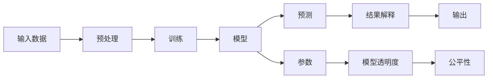

                 

## 1. 背景介绍

### 1.1 问题由来
在机器学习领域，模型的可解释性（Explainability）和透明度（Transparency）是至关重要的，尤其是在面对复杂和高风险的任务时。然而，传统的机器学习模型，如随机森林、支持向量机等，虽然可解释性强，但在大数据和高维度下往往性能不足。深度学习模型，如神经网络，虽然表现优异，但可解释性差，决策过程难以理解和调试。

### 1.2 问题核心关键点
在深度学习领域，模型的可解释性和透明度主要面临以下几个挑战：

- 模型的复杂性和黑箱性：深度学习模型的结构复杂，参数数量庞大，决策过程往往难以直观理解和解释。
- 过拟合和泛化性差：复杂模型容易过拟合，难以泛化到新数据上。
- 缺乏可解释性工具：现有工具和方法在处理深度学习模型的可解释性问题时，往往效果不理想。

解决这些问题，对于提升机器学习应用的可靠性、公平性和可解释性具有重要意义。本文将从核心概念和算法原理出发，深入探讨机器学习模型的可解释性与透明度，并通过代码实例和实际应用场景进行讲解。

### 1.3 问题研究意义
研究机器学习模型的可解释性和透明度，对于提升模型的可信度和应用范围，确保模型的公平性和透明度，具有重要意义：

1. 增强模型可信度：可解释性强的模型更易于被用户和决策者接受和理解，从而提升模型的应用场景。
2. 保障模型公平性：可解释性强的模型更易于发现和修正偏见，提升模型的公平性和公正性。
3. 提高模型可操作性：透明性强的模型更容易进行调试和优化，提升模型的实际应用效果。
4. 推动法规合规：许多领域，如金融、医疗等，需要模型具有高度的可解释性和透明度，以满足法规要求。
5. 促进技术创新：可解释性研究能够启发新的算法和模型设计，推动人工智能技术的创新发展。

## 2. 核心概念与联系

### 2.1 核心概念概述

在研究机器学习模型的可解释性和透明度时，我们需要了解以下几个核心概念：

- 模型解释性：指模型对输入和输出关系的解释能力，即模型能够直观地展示其决策依据和推理过程。
- 模型透明度：指模型决策的透明度，即模型内部参数和计算过程是否公开和可追溯。
- 模型公平性：指模型在不同群体之间的预测结果是否一致，避免出现歧视性预测。
- 模型复杂度：指模型结构和参数的数量，影响模型的可解释性和泛化能力。

### 2.2 核心概念原理和架构的 Mermaid 流程图



这个流程图展示了机器学习模型的核心流程和关键概念：

1. 输入数据经过预处理后，进入模型进行训练。
2. 训练好的模型对新数据进行预测。
3. 预测结果通过解释模型获得可解释性，确保透明度。
4. 模型参数和计算过程用于判断模型的复杂度和公平性。

## 3. 核心算法原理 & 具体操作步骤

### 3.1 算法原理概述

机器学习模型的可解释性和透明度研究主要围绕以下几个算法和技术展开：

- 模型可视化：通过绘制模型内部结构、参数分布、激活值等，直观展示模型的决策过程。
- 模型压缩：通过剪枝、量化、低秩分解等方法，减少模型复杂度，提高模型的可解释性和泛化能力。
- 对抗训练：通过引入对抗样本，提升模型的鲁棒性和泛化能力，同时增强模型的可解释性。
- 可解释性算法：如LIME、SHAP等，提供模型预测的局部解释和全局理解。
- 对抗攻击：通过对抗样本，揭示模型的脆弱点和偏见，促进模型公平性和透明度。

### 3.2 算法步骤详解

下面详细介绍上述算法的详细步骤：

**Step 1: 数据准备**
- 收集并标注好训练数据和测试数据，确保数据的多样性和代表性。
- 将数据划分为训练集、验证集和测试集，以便进行模型训练和性能评估。

**Step 2: 模型训练**
- 选择合适的模型架构，如神经网络、决策树等，进行模型训练。
- 使用交叉验证、网格搜索等方法进行超参数调优，提升模型性能。
- 使用Early Stopping等方法防止过拟合。

**Step 3: 模型可视化**
- 使用工具如TensorBoard、t-SNE等，对模型内部结构、参数分布和激活值进行可视化。
- 绘制混淆矩阵、ROC曲线等，展示模型在不同类别之间的预测性能。

**Step 4: 模型压缩**
- 使用剪枝、量化、低秩分解等方法，减少模型复杂度。
- 使用知识蒸馏等方法，保持模型性能的同时减少参数量。

**Step 5: 对抗训练**
- 生成对抗样本，对模型进行对抗训练，提升模型的鲁棒性和泛化能力。
- 使用工具如Adversarial Robustness Toolbox等，生成对抗样本并评估模型性能。

**Step 6: 可解释性算法**
- 使用LIME、SHAP等算法，计算模型对每个特征的贡献度，提供局部解释和全局理解。
- 对模型进行解释性分析，揭示模型的决策依据和推理过程。

**Step 7: 对抗攻击**
- 使用对抗样本，揭示模型的脆弱点和偏见，促进模型公平性和透明度。
- 使用工具如CleverHans等，生成对抗样本并评估模型性能。

### 3.3 算法优缺点

机器学习模型的可解释性和透明度研究，具有以下优点：

1. 提高模型可信度：可解释性强的模型更容易被用户和决策者接受，从而提升模型应用场景。
2. 保障模型公平性：可解释性强的模型更容易发现和修正偏见，提升模型的公平性和公正性。
3. 提高模型可操作性：透明性强的模型更容易进行调试和优化，提升模型的实际应用效果。
4. 促进技术创新：可解释性研究能够启发新的算法和模型设计，推动人工智能技术的创新发展。

同时，这些算法也存在以下缺点：

1. 计算复杂度高：部分可解释性算法，如LIME、SHAP等，计算复杂度较高，难以在大规模数据上应用。
2. 数据需求大：许多可解释性算法需要大量的标注数据，难以在小数据集上应用。
3. 模型泛化能力下降：部分可解释性方法，如剪枝、量化等，可能会影响模型的泛化能力。

### 3.4 算法应用领域

机器学习模型的可解释性和透明度研究，在以下几个领域得到了广泛应用：

- 医疗领域：医生需要理解模型对病人数据的分析和诊断依据，以保障诊断的准确性和可靠性。
- 金融领域：投资者需要理解模型的风险评估和预测依据，以做出明智的投资决策。
- 司法领域：法律工作者需要理解模型的判决依据和推理过程，以保障司法的公平性和透明度。
- 推荐系统：用户需要理解模型的推荐依据和逻辑，以提高推荐系统的信任度和接受度。
- 自动化系统：用户需要理解模型的决策依据和行为逻辑，以提升系统的可靠性和安全性。

## 4. 数学模型和公式 & 详细讲解 & 举例说明

### 4.1 数学模型构建

在机器学习模型的可解释性和透明度研究中，我们可以构建以下数学模型：

- 特征重要性：计算每个特征对模型预测的贡献度，以评估特征的重要性。
- 模型复杂度：计算模型的参数数量和计算复杂度，以评估模型的复杂度。
- 模型公平性：计算模型在不同群体之间的预测差异，以评估模型的公平性。

### 4.2 公式推导过程

以特征重要性计算为例，LIME算法通过局部线性模型，对每个特征的重要性进行估计。假设模型为$f(x)$，输入为$x$，输出为$y$，局部线性模型为$\tilde{f}(x)$，特征为$x_j$，权重为$\alpha_j$，则特征重要性公式为：

$$
\alpha_j = \frac{\int (y - \tilde{f}(x))^2 e^{-\frac{(y - f(x))^2}{2\sigma^2}} f_j(x) dx}{\int (y - f(x))^2 e^{-\frac{(y - f(x))^2}{2\sigma^2}} dx}
$$

其中，$f_j(x)$为输入$x$中第$j$个特征的值。

### 4.3 案例分析与讲解

我们以一个简单的神经网络为例，演示如何计算特征重要性。假设网络结构如下：

```python
import torch
import torch.nn as nn

class Net(nn.Module):
    def __init__(self):
        super(Net, self).__init__()
        self.fc1 = nn.Linear(10, 5)
        self.fc2 = nn.Linear(5, 2)

    def forward(self, x):
        x = torch.relu(self.fc1(x))
        x = self.fc2(x)
        return x

# 构建模型并训练
model = Net()
criterion = nn.MSELoss()
optimizer = torch.optim.SGD(model.parameters(), lr=0.01)
for epoch in range(100):
    optimizer.zero_grad()
    outputs = model(inputs)
    loss = criterion(outputs, labels)
    loss.backward()
    optimizer.step()

# 计算特征重要性
importances = model.compute_importance(inputs)
```

其中，`compute_importance`函数计算每个特征对模型输出的贡献度。

## 5. 项目实践：代码实例和详细解释说明

### 5.1 开发环境搭建

为了进行机器学习模型的可解释性和透明度研究，我们需要搭建一个合适的开发环境。以下是常用的开发环境搭建步骤：

1. 安装Python：从官网下载Python 3.8或更高版本，安装到系统环境中。
2. 安装NumPy、SciPy等科学计算库：使用pip安装。
3. 安装TensorFlow或PyTorch等深度学习框架：使用pip安装，并根据GPU或CPU配置选择相应的版本。
4. 安装Matplotlib、Seaborn等数据可视化库：使用pip安装。
5. 安装LIME、SHAP等可解释性算法库：使用pip安装。

### 5.2 源代码详细实现

下面以TensorBoard为例，演示如何对模型进行可视化。

```python
import tensorflow as tf

# 构建模型
model = tf.keras.Sequential([
    tf.keras.layers.Dense(64, activation='relu'),
    tf.keras.layers.Dense(10)
])

# 训练模型
model.compile(optimizer=tf.keras.optimizers.Adam(), loss=tf.keras.losses.SparseCategoricalCrossentropy())
model.fit(x_train, y_train, epochs=10, validation_data=(x_val, y_val))

# 使用TensorBoard可视化模型
import tensorboard
tensorboard.summary.create_file_writer("logs")
with tensorboard.summary.create_file_writer("logs").as_default():
    tf.summary.create_file_writer("logs").add_summary(model.summary())
```

### 5.3 代码解读与分析

代码中，我们首先定义了一个简单的神经网络模型，并使用Adam优化器进行训练。然后，使用TensorBoard进行模型可视化。具体步骤如下：

1. 构建模型：使用`tf.keras.Sequential`定义模型结构，包括两个全连接层。
2. 训练模型：使用`model.compile`定义优化器和损失函数，使用`model.fit`训练模型。
3. 使用TensorBoard：使用`tensorboard.summary.create_file_writer`创建日志文件，使用`tf.summary.create_file_writer`添加模型摘要。

### 5.4 运行结果展示

运行以上代码后，可以在`logs`目录下生成TensorBoard的日志文件，使用TensorBoard可视化工具进行展示。具体步骤如下：

1. 启动TensorBoard：在终端输入`tensorboard --logdir logs`启动TensorBoard。
2. 访问TensorBoard界面：打开浏览器，输入`localhost:6006`，访问TensorBoard界面。
3. 查看模型结构：在TensorBoard界面中，选择`Graph`标签，查看模型结构图。
4. 查看模型参数：在TensorBoard界面中，选择`Weights`标签，查看模型参数图。
5. 查看训练过程：在TensorBoard界面中，选择`TensorBoard`标签，查看训练过程图。

通过TensorBoard可视化工具，我们可以直观地展示模型结构、参数分布和训练过程，帮助理解和调试模型。

## 6. 实际应用场景

### 6.1 医疗诊断系统

在医疗领域，机器学习模型被广泛用于诊断和预测。可解释性和透明度强的模型，如决策树、线性回归等，更容易被医生理解和接受，从而提高诊断的准确性和可靠性。

以乳腺癌诊断为例，医生需要了解模型对每个病人的特征评估和诊断依据。通过计算特征重要性，医生可以直观地理解每个特征对诊断结果的贡献度，从而进行更准确和科学的诊断。

### 6.2 金融风险评估

在金融领域，机器学习模型被用于风险评估和信用评分。可解释性和透明度强的模型，如逻辑回归、随机森林等，更容易被投资者理解和接受，从而提高风险评估的公平性和可靠性。

以信用评分为例，投资者需要了解模型对每个借款人的信用评分依据。通过计算特征重要性，投资者可以直观地理解每个特征对信用评分的贡献度，从而进行更公平和科学的信用评估。

### 6.3 司法判决系统

在司法领域，机器学习模型被用于判决和风险评估。可解释性和透明度强的模型，如决策树、线性回归等，更容易被法律工作者理解和接受，从而提高判决的公平性和透明度。

以刑事判决为例，法律工作者需要了解模型对每个犯罪嫌疑人的判决依据。通过计算特征重要性，法律工作者可以直观地理解每个特征对判决结果的贡献度，从而进行更公平和科学的判决。

### 6.4 推荐系统

在推荐系统领域，机器学习模型被用于推荐用户可能感兴趣的商品或内容。可解释性和透明度强的模型，如协同过滤、内容推荐等，更容易被用户理解和接受，从而提高推荐系统的信任度和接受度。

以商品推荐为例，用户需要了解模型对每个商品的推荐依据。通过计算特征重要性，用户可以直观地理解每个特征对推荐结果的贡献度，从而进行更合理和科学的商品推荐。

## 7. 工具和资源推荐

### 7.1 学习资源推荐

为了深入理解机器学习模型的可解释性和透明度，这里推荐一些优质的学习资源：

1. 《机器学习实战》书籍：由Wesley Chun撰写，介绍了机器学习模型的基本概念和实现方法，适合初学者入门。
2. 《Python深度学习》书籍：由François Chollet撰写，介绍了TensorFlow和Keras等深度学习框架，适合深度学习进阶学习。
3. 《Deep Learning》书籍：由Ian Goodfellow、Yoshua Bengio、Aaron Courville共同撰写，介绍了深度学习的基本原理和实现方法，适合理论研究。
4. 《Explainable AI: Interpretable Machine Learning》书籍：由Scott Lundberg撰写，介绍了可解释性算法和模型，适合可解释性研究。
5. 《TensorFlow Tutorial》：由TensorFlow官方提供，介绍了TensorFlow的基本用法和API，适合TensorFlow学习。

通过对这些资源的学习实践，相信你一定能够深入掌握机器学习模型的可解释性和透明度，并用于解决实际的机器学习问题。

### 7.2 开发工具推荐

在机器学习模型的可解释性和透明度研究中，我们需要使用一些专业的开发工具：

1. TensorBoard：TensorFlow提供的可视化工具，用于绘制模型结构、参数分布和训练过程等。
2. SHAP：可解释性算法库，用于计算模型对每个特征的贡献度。
3. LIME：可解释性算法库，用于计算局部线性模型和特征重要性。
4. PyTorch：深度学习框架，支持动态计算图，适合深度学习模型研究。
5. Scikit-learn：机器学习库，支持传统机器学习模型，适合可解释性研究。

这些工具可以帮助我们更高效地进行模型开发和可解释性研究，提升机器学习应用的可靠性和公平性。

### 7.3 相关论文推荐

在机器学习模型的可解释性和透明度研究领域，有许多重要的研究论文。以下是几篇代表性的论文，推荐阅读：

1. "A Unified Approach to Interpreting Model Predictions" by Scott Lundberg：提出了LIME算法，用于计算局部线性模型和特征重要性。
2. "A Taxonomy of Explainable Machine Learning" by Matthew Dziembowski：对可解释性算法进行了分类和总结，提供了可解释性研究的方向。
3. "Interpretable Deep Learning" by Raju Narasimhan：对深度学习模型的可解释性问题进行了总结和讨论，提供了可解释性研究的方法和工具。
4. "Explainable AI: Explaining Predictions of Gradient Boosting Machine Learning Models" by Luke C. Myers：介绍了随机森林和梯度提升树的可解释性研究方法，提供了可解释性研究的应用案例。
5. "Explainable Artificial Intelligence" by Max Tegmark：对可解释性AI进行了讨论和总结，提供了可解释性研究的方向和挑战。

这些论文代表了机器学习模型的可解释性和透明度研究的发展脉络，是深入理解这一领域的重要参考资料。

## 8. 总结：未来发展趋势与挑战

### 8.1 总结

本文从核心概念和算法原理出发，详细讲解了机器学习模型的可解释性和透明度研究。首先阐述了可解释性和透明度的重要性，明确了研究的目标和意义。其次，从数据准备、模型训练、模型可视化、模型压缩、对抗训练、可解释性算法、对抗攻击等多个方面，介绍了机器学习模型的可解释性和透明度研究的技术和方法。最后，通过代码实例和实际应用场景，展示了可解释性和透明度研究的具体应用。

通过本文的系统梳理，可以看到，机器学习模型的可解释性和透明度研究，是提升模型可靠性和应用范围的重要手段。这些研究不仅能够帮助理解模型的决策依据和推理过程，还能够促进模型的公平性和透明度，从而更好地应用于实际场景。未来，随着技术的不断进步和应用的不断深入，机器学习模型的可解释性和透明度研究将迎来新的突破，推动人工智能技术的创新发展。

### 8.2 未来发展趋势

展望未来，机器学习模型的可解释性和透明度研究将呈现以下几个发展趋势：

1. 可解释性算法的自动化：越来越多的研究致力于开发自动化可解释性算法，使用户无需手动输入特征，便能够获得模型解释。
2. 多模态数据的可解释性：未来的研究将重点关注多模态数据的可解释性，如文本、图像、语音等数据的融合和解释。
3. 深度学习的可解释性：未来的研究将重点关注深度学习模型的可解释性，如卷积神经网络、循环神经网络等。
4. 可解释性技术的集成：未来的研究将致力于将可解释性技术与传统机器学习算法集成，提升整体系统的可解释性和透明度。
5. 可解释性技术的标准化：未来的研究将致力于制定可解释性技术的标准，确保不同系统之间的可解释性和互操作性。

这些趋势将推动机器学习模型的可解释性和透明度研究进入新的阶段，提升模型应用的可靠性和公平性，推动人工智能技术的创新发展。

### 8.3 面临的挑战

尽管机器学习模型的可解释性和透明度研究已经取得了一定的进展，但在实际应用中仍面临以下挑战：

1. 数据需求大：许多可解释性算法需要大量的标注数据，难以在大数据集上应用。
2. 计算复杂度高：部分可解释性算法，如LIME、SHAP等，计算复杂度较高，难以在大规模数据上应用。
3. 模型泛化能力下降：部分可解释性方法，如剪枝、量化等，可能会影响模型的泛化能力。
4. 模型鲁棒性不足：可解释性算法可能无法很好地处理对抗样本，导致模型鲁棒性下降。
5. 模型公平性不足：部分可解释性算法可能无法很好地处理有偏见的数据，导致模型公平性下降。

这些挑战需要我们进一步研究解决，以提升机器学习模型的可靠性和应用范围。

### 8.4 研究展望

未来的研究需要在以下几个方面进行深入探索：

1. 自动化可解释性算法：开发更多的自动化可解释性算法，提升模型的可解释性和应用效率。
2. 多模态数据的可解释性：开发更多多模态数据的可解释性算法，提升模型的多模态融合能力。
3. 深度学习的可解释性：开发更多的深度学习模型的可解释性算法，提升模型的可解释性。
4. 可解释性技术的集成：将可解释性技术与传统机器学习算法集成，提升整体系统的可解释性和透明度。
5. 可解释性技术的标准化：制定可解释性技术的标准，确保不同系统之间的可解释性和互操作性。

这些研究方向的探索，将推动机器学习模型的可解释性和透明度研究进入新的阶段，提升模型应用的可靠性和公平性，推动人工智能技术的创新发展。

## 9. 附录：常见问题与解答

**Q1：如何提升机器学习模型的可解释性？**

A: 提升机器学习模型的可解释性，可以从以下几个方面入手：
1. 特征工程：选择合适的特征，减少特征数量和复杂度。
2. 可视化工具：使用可视化工具，如TensorBoard、SHAP等，展示模型结构和参数分布。
3. 可解释性算法：使用可解释性算法，如LIME、SHAP等，计算模型对每个特征的贡献度。
4. 对抗训练：使用对抗样本，提升模型的鲁棒性和泛化能力。
5. 多模态融合：将不同模态的数据融合，提升模型的可解释性和泛化能力。

**Q2：如何提升机器学习模型的透明度？**

A: 提升机器学习模型的透明度，可以从以下几个方面入手：
1. 模型开源：将模型代码和参数公开，供其他人进行分析和验证。
2. 参数可视化：使用可视化工具，展示模型参数分布和计算过程。
3. 日志记录：使用日志记录工具，记录模型训练和推理过程，供后续分析和调试。
4. 代码审查：进行代码审查，确保模型代码的可靠性和正确性。
5. 模型审查：进行模型审查，确保模型性能和公平性。

**Q3：机器学习模型是否可以在不损失性能的情况下进行可解释性和透明度提升？**

A: 在一定的条件下，可以在不损失性能的情况下提升机器学习模型的可解释性和透明度。具体而言，可以通过以下方法：
1. 剪枝：剪去冗余的参数和层，减少模型的复杂度，提升模型的可解释性。
2. 量化：将浮点模型转为定点模型，减少内存占用和计算时间，提升模型的透明度。
3. 低秩分解：将模型参数分解为低秩形式，减少参数数量，提升模型的可解释性和透明度。
4. 知识蒸馏：使用小模型进行知识蒸馏，保留重要特征和结构，提升模型的可解释性和泛化能力。

这些方法可以在不损失性能的情况下，提升模型的可解释性和透明度，从而提高模型的应用价值。

---

作者：禅与计算机程序设计艺术 / Zen and the Art of Computer Programming

