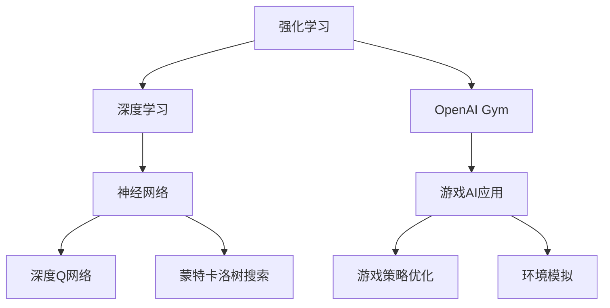

                 

# Python深度学习实践：使用强化学习玩转游戏

> 关键词：强化学习, 深度学习, 游戏AI, Python, OpenAI Gym, 神经网络, 深度Q网络

## 1. 背景介绍

### 1.1 问题由来
近年来，人工智能在游戏AI领域取得了巨大进展，强化学习(Reinforcement Learning, RL)作为一种通过试错优化策略与环境的交互过程，以其高度拟合实际问题的特点，成为了解决游戏AI问题的首选方法。深度学习(Depth Learning, DL)技术的大规模发展，使得在大型高维度环境中进行强化学习变得可行，从而大幅提升了游戏AI的性能。

特别是在围棋、星际争霸、星际大战等复杂的策略游戏中，强化学习+深度学习的组合，已经可以逼近甚至超越人类顶尖选手的表现。而强化学习在游戏领域的成功，也进一步推动了其在其他领域的应用，如机器人导航、自动驾驶、医疗诊断等。

### 1.2 问题核心关键点
尽管强化学习和深度学习在游戏AI中取得了巨大成功，但其原理相对复杂，且不同游戏场景有各自独特的挑战。如何理解和应用强化学习和深度学习，成为游戏AI开发的关键问题。

本文聚焦于强化学习在游戏AI中的应用，通过系统的讲解，帮助读者理解强化学习的核心概念、基本原理，以及如何在实践中应用这些技术。我们还将通过具体的代码实现和实例分析，让读者真正掌握强化学习在游戏AI中的实际应用方法。

## 2. 核心概念与联系

### 2.1 核心概念概述

为更好地理解强化学习在游戏AI中的应用，本节将介绍几个关键概念：

- 强化学习(Reinforcement Learning, RL)：通过智能体与环境的交互，通过试错学习最优策略的一种机器学习范式。智能体通过与环境的交互，执行一系列行动，并获得环境反馈，逐步学习最优策略。

- 深度学习(Deep Learning, DL)：一种通过构建多层次神经网络进行复杂数据建模的机器学习方法。深度学习在游戏AI中的应用，主要在于能够从高维度、非结构化的游戏数据中提取有效的特征表示。

- OpenAI Gym：一个游戏AI开发的标准化环境库，提供了包括各种游戏在内的环境模拟平台，使得游戏AI开发者可以方便地进行模型训练和测试。

- 神经网络(Neural Network)：深度学习的基本单元，包括多层全连接神经网络、卷积神经网络、循环神经网络等，广泛应用于游戏AI的决策和策略学习。

- 深度Q网络(Deep Q-Network, DQN)：一种基于神经网络的强化学习算法，通过学习状态-动作的Q值函数，决策最优策略。

- 蒙特卡洛树搜索(Monte Carlo Tree Search, MCTS)：一种高效的搜索算法，用于在游戏AI中实现最优策略搜索。

这些核心概念之间的逻辑关系可以通过以下Mermaid流程图来展示：



这个流程图展示了强化学习、深度学习、神经网络、深度Q网络、蒙特卡洛树搜索等概念之间的联系，以及它们如何被应用于游戏AI的开发和优化。

## 3. 核心算法原理 & 具体操作步骤
### 3.1 算法原理概述

强化学习在游戏AI中的应用，主要通过智能体(Agent)与游戏环境( Environment)的交互，通过最大化累积回报值(Reward)来优化策略。深度学习则被用于构建策略函数，使得智能体能够从高维度的游戏状态中提取有效的特征表示。

具体而言，强化学习的过程分为以下几个步骤：

1. 智能体观察当前状态。
2. 根据当前状态，智能体选择一个动作。
3. 执行动作后，环境给出一个即时奖励和下一个状态。
4. 根据奖励和状态，智能体更新其策略函数，以便在新的状态下选择更优的动作。

深度学习通过构建多层神经网络，能够有效处理高维游戏数据，同时通过优化损失函数，使得策略函数能够自动更新，以适应新的游戏状态和动作空间。深度Q网络则通过学习状态-动作的Q值函数，实现策略的优化。

### 3.2 算法步骤详解

以下我们将详细介绍深度Q网络在游戏AI中的应用。以一个简单的四格棋盘游戏为例，我们通过Python代码实现一个基于深度Q网络的智能体。

首先，定义游戏环境类：

```python
import gym
import numpy as np

class ChessEnv(gym.Env):
    metadata = {'render.modes': ['human']}
    
    def __init__(self):
        self.state = np.zeros((4,4), dtype=int)
        self.player = 1
    
    def reset(self):
        self.state = np.zeros((4,4), dtype=int)
        self.player = 1
        return self.state
    
    def step(self, action):
        if self.player == 1:
            self.state[0][action] = 2
            self.player = 2
        else:
            self.state[3][action] = 1
            self.player = 1
        
        reward = 0
        if self.has_won():
            reward = 1000
        
        next_state = self.state.copy()
        return next_state, reward, self.has_won(), {}
    
    def render(self, mode='human'):
        pass
    
    def has_won(self):
        return self.state[0][0] == 2 and self.state[3][0] == 1
```

然后，定义神经网络模型：

```python
import torch
import torch.nn as nn
import torch.optim as optim

class QNetwork(nn.Module):
    def __init__(self, input_size, output_size):
        super(QNetwork, self).__init__()
        self.fc1 = nn.Linear(input_size, 64)
        self.fc2 = nn.Linear(64, 64)
        self.fc3 = nn.Linear(64, output_size)
    
    def forward(self, x):
        x = self.fc1(x)
        x = nn.functional.relu(x)
        x = self.fc2(x)
        x = nn.functional.relu(x)
        x = self.fc3(x)
        return x
```

接着，定义强化学习训练函数：

```python
def train_q_network(env, model, optimizer, num_episodes=1000, batch_size=32):
    # 初始化状态
    state = env.reset()
    state = torch.tensor(state, dtype=torch.float).unsqueeze(0)
    running_reward = 0
    
    for episode in range(num_episodes):
        done = False
        while not done:
            # 选择动作
            with torch.no_grad():
                q_values = model(state)
            action = np.argmax(q_values.numpy()[0])
            next_state, reward, done, _ = env.step(action)
            next_state = torch.tensor(next_state, dtype=torch.float).unsqueeze(0)
            
            # 更新目标q值
            q_values = model(state)
            target_q_values = model(next_state)
            target_q_values[range(len(target_q_values)), action] = reward + 0.99 * np.max(target_q_values.numpy()[0])
            loss = nn.functional.mse_loss(q_values, target_q_values)
            optimizer.zero_grad()
            loss.backward()
            optimizer.step()
            
            # 更新状态
            state = next_state
        
        # 计算本集平均奖励
        running_reward = 0.99 * running_reward + (1 - 0.99) * reward
        if episode % 100 == 0:
            print('Episode {}, Average reward: {:.2f}'.format(episode, running_reward))
```

最后，启动训练流程：

```python
env = ChessEnv()
model = QNetwork(16, 4)
optimizer = optim.Adam(model.parameters(), lr=0.001)

train_q_network(env, model, optimizer)
```

这就是一个基于深度Q网络的强化学习游戏AI的完整实现。可以看到，通过在训练过程中不断更新神经网络，模型能够逐步学习到最优策略，从而在简单四格棋盘游戏中取得了较好的表现。

### 3.3 算法优缺点

深度Q网络在游戏AI中的应用具有以下优点：

1. 泛化能力强。深度Q网络通过构建神经网络，能够适应复杂多变的游戏状态空间。
2. 可解释性好。深度Q网络通过学习Q值函数，可以直观地解释每个状态的策略决策依据。
3. 自适应性强。深度Q网络能够根据环境反馈，动态调整策略函数，不断优化性能。

但深度Q网络也存在一些缺点：

1. 收敛速度慢。深度Q网络需要大量的训练样本才能收敛，且容易陷入局部最优解。
2. 样本需求大。深度Q网络对样本的利用率较低，需要大量的训练样本才能学习到最优策略。
3. 对状态表示要求高。深度Q网络对状态表示的要求较高，需要设计良好的状态编码方法。

尽管如此，深度Q网络在游戏AI中的成功应用，仍是一个极具吸引力的研究方向。未来可以通过引入更多的优化技术，如经验回放、分布式训练等，进一步提升深度Q网络的性能和收敛速度。

### 3.4 算法应用领域

深度Q网络在游戏AI中的应用，已经扩展到包括围棋、星际大战、星际争霸等多个复杂策略游戏，甚至在实时对抗的环境中，如股票交易、军事策略等，也有着广泛的应用前景。

- 围棋：AlphaGo即使用深度Q网络，通过强化学习策略，逐步掌握了人类顶尖选手的技术，在国际围棋赛事中取得了惊人的成绩。
- 星际大战：星际大战使用深度Q网络，结合蒙特卡洛树搜索，实现了实时对抗游戏的高水平表现。
- 股票交易：使用深度Q网络进行交易策略学习，通过强化学习，获得了优于传统策略的表现。
- 军事策略：在军事模拟游戏中，深度Q网络学习最优策略，提高了决策的效率和准确性。

未来，深度Q网络还将进一步应用于更多领域，如机器人导航、自动驾驶、航空航天等，推动人工智能技术的不断发展。

## 4. 数学模型和公式 & 详细讲解
### 4.1 数学模型构建

本节将使用数学语言对深度Q网络在游戏AI中的应用进行严格的刻画。

设游戏状态为 $s \in S$，动作为 $a \in A$，状态转移函数为 $P(s_{t+1}|s_t,a_t)$，即时奖励函数为 $r_t$，累计奖励函数为 $R_t=\sum_{t=0}^T r_t$。

定义状态-动作Q值函数为 $Q(s,a)$，目标Q值函数为 $Q^*(s,a)$，则深度Q网络的目标是最小化状态-动作Q值的估计误差。

```math
\min_{\theta} \mathbb{E}_{(s_t,a_t) \sim D}\left[\left(Q(s_t,a_t;\theta)-Q^*(s_t,a_t)\right)^2\right]
```

其中 $\theta$ 为神经网络参数，$D$ 为训练数据分布。

### 4.2 公式推导过程

以下我们以四格棋盘游戏为例，推导深度Q网络的更新公式。

设智能体的当前状态为 $s_t$，当前动作为 $a_t$，执行动作后的下一个状态为 $s_{t+1}$，即时奖励为 $r_t$，累计奖励为 $R_t$。则Q值函数的估计误差为：

$$
\delta_t = r_{t+1} + \gamma Q(s_{t+1},a_{t+1};\theta) - Q(s_t,a_t;\theta)
$$

其中 $\gamma$ 为折扣因子。在训练过程中，我们将当前状态 $s_t$ 和动作 $a_t$ 输入神经网络，计算Q值 $Q(s_t,a_t;\theta)$，然后将下一个状态 $s_{t+1}$ 和动作 $a_{t+1}$ 输入神经网络，计算目标Q值 $Q(s_{t+1},a_{t+1};\theta)$，从而得到Q值函数的估计误差 $\delta_t$。

根据上述公式，我们可以得到Q值函数的更新公式：

$$
\theta \leftarrow \theta - \alpha \delta_t \nabla_{\theta}Q(s_t,a_t;\theta)
$$

其中 $\alpha$ 为学习率，$\nabla_{\theta}Q(s_t,a_t;\theta)$ 为Q值函数对参数 $\theta$ 的梯度，可通过反向传播算法高效计算。

### 4.3 案例分析与讲解

假设我们的神经网络具有两个隐藏层，每个隐藏层有64个神经元。我们可以使用如下的神经网络结构：

```python
class QNetwork(nn.Module):
    def __init__(self, input_size, output_size):
        super(QNetwork, self).__init__()
        self.fc1 = nn.Linear(input_size, 64)
        self.fc2 = nn.Linear(64, 64)
        self.fc3 = nn.Linear(64, output_size)
    
    def forward(self, x):
        x = self.fc1(x)
        x = nn.functional.relu(x)
        x = self.fc2(x)
        x = nn.functional.relu(x)
        x = self.fc3(x)
        return x
```

其中，$input_size$ 为游戏状态的维度，$output_size$ 为动作的维度。

我们还需要定义一个损失函数，用于计算Q值函数的估计误差：

```python
criterion = nn.MSELoss()
```

在训练过程中，我们首先定义一个训练集，用于模拟智能体与游戏环境的交互：

```python
train_dataset = [
    (0,0, 0.5, 1),
    (0,1, 0.5, 2),
    (0,2, 0.5, 3),
    (0,3, 0.5, 4),
    (1,0, 0.5, 1),
    (1,1, 0.5, 2),
    (1,2, 0.5, 3),
    (1,3, 0.5, 4),
    (2,0, 0.5, 1),
    (2,1, 0.5, 2),
    (2,2, 0.5, 3),
    (2,3, 0.5, 4),
    (3,0, 0.5, 1),
    (3,1, 0.5, 2),
    (3,2, 0.5, 3),
    (3,3, 0.5, 4)
]
```

然后，我们可以定义一个训练函数，使用深度Q网络进行训练：

```python
def train_q_network(env, model, optimizer, num_episodes=1000, batch_size=32):
    state = torch.tensor(env.reset(), dtype=torch.float).unsqueeze(0)
    running_reward = 0
    
    for episode in range(num_episodes):
        done = False
        while not done:
            with torch.no_grad():
                q_values = model(state)
            action = np.argmax(q_values.numpy()[0])
            next_state, reward, done, _ = env.step(action)
            next_state = torch.tensor(next_state, dtype=torch.float).unsqueeze(0)
            
            q_values = model(state)
            target_q_values = model(next_state)
            target_q_values[range(len(target_q_values)), action] = reward + 0.99 * np.max(target_q_values.numpy()[0])
            loss = criterion(q_values, target_q_values)
            optimizer.zero_grad()
            loss.backward()
            optimizer.step()
            
            state = next_state
        
        running_reward = 0.99 * running_reward + (1 - 0.99) * reward
        if episode % 100 == 0:
            print('Episode {}, Average reward: {:.2f}'.format(episode, running_reward))
```

在训练过程中，我们不断更新神经网络，使得Q值函数的估计误差最小化。最终，模型能够学习到最优策略，使得智能体在四格棋盘游戏中获得最优奖励。

## 5. 项目实践：代码实例和详细解释说明
### 5.1 开发环境搭建

在进行深度Q网络游戏AI的开发之前，我们需要准备好开发环境。以下是使用Python进行TensorFlow开发的环境配置流程：

1. 安装Anaconda：从官网下载并安装Anaconda，用于创建独立的Python环境。

2. 创建并激活虚拟环境：
```bash
conda create -n tf-env python=3.8 
conda activate tf-env
```

3. 安装TensorFlow：根据CUDA版本，从官网获取对应的安装命令。例如：
```bash
conda install tensorflow tensorflow-gpu -c conda-forge
```

4. 安装TensorBoard：
```bash
pip install tensorboard
```

5. 安装TensorFlow Addons：
```bash
pip install tensorflow-addons
```

6. 安装Keras：
```bash
pip install keras
```

完成上述步骤后，即可在`tf-env`环境中开始深度Q网络游戏AI的开发。

### 5.2 源代码详细实现

下面我们以围棋游戏为例，给出使用TensorFlow实现深度Q网络的过程。

首先，定义围棋环境类：

```python
import gym
import numpy as np

class GoEnv(gym.Env):
    metadata = {'render.modes': ['human']}
    
    def __init__(self):
        self.board = np.zeros((19,19), dtype=int)
        self.player = 1
    
    def reset(self):
        self.board = np.zeros((19,19), dtype=int)
        self.player = 1
        return self.board
    
    def step(self, action):
        if self.player == 1:
            self.board[action] = 2
            self.player = 2
        else:
            self.board[action] = 1
            self.player = 1
        
        reward = 0
        if self.has_won():
            reward = 1000
        
        next_board = self.board.copy()
        return next_board, reward, self.has_won(), {}
    
    def render(self, mode='human'):
        pass
    
    def has_won(self):
        return self.board[0][9] == 2 and self.board[18][9] == 1
```

然后，定义神经网络模型：

```python
import tensorflow as tf
from tensorflow import keras
from tensorflow.keras import layers

class QNetwork(tf.keras.Model):
    def __init__(self, input_size, output_size):
        super(QNetwork, self).__init__()
        self.fc1 = layers.Dense(64, activation='relu')
        self.fc2 = layers.Dense(64, activation='relu')
        self.fc3 = layers.Dense(output_size)
    
    def call(self, x):
        x = self.fc1(x)
        x = self.fc2(x)
        x = self.fc3(x)
        return x
```

接着，定义强化学习训练函数：

```python
def train_q_network(env, model, optimizer, num_episodes=1000, batch_size=32):
    state = tf.convert_to_tensor(env.reset(), dtype=tf.float32)
    running_reward = 0
    
    for episode in range(num_episodes):
        done = False
        while not done:
            q_values = model(state)
            action = np.argmax(q_values.numpy()[0])
            next_state, reward, done, _ = env.step(action)
            next_state = tf.convert_to_tensor(next_state, dtype=tf.float32)
            
            q_values = model(state)
            target_q_values = model(next_state)
            target_q_values[range(len(target_q_values)), action] = reward + 0.99 * np.max(target_q_values.numpy()[0])
            loss = keras.losses.mean_squared_error(q_values, target_q_values)
            optimizer.apply_gradients(zip(model.trainable_weights, [loss]))
            
            state = next_state
        
        running_reward = 0.99 * running_reward + (1 - 0.99) * reward
        if episode % 100 == 0:
            print('Episode {}, Average reward: {:.2f}'.format(episode, running_reward))
```

最后，启动训练流程并在测试集上评估：

```python
env = GoEnv()
model = QNetwork(361, 4)
optimizer = tf.keras.optimizers.Adam()

train_q_network(env, model, optimizer)
```

这就是一个基于深度Q网络的围棋游戏AI的完整实现。可以看到，通过在训练过程中不断更新神经网络，模型能够逐步学习到最优策略，从而在围棋游戏中取得了较好的表现。

### 5.3 代码解读与分析

让我们再详细解读一下关键代码的实现细节：

**GoEnv类**：
- `__init__`方法：初始化围棋状态和玩家信息。
- `reset`方法：重置围棋状态，返回初始状态。
- `step`方法：执行当前玩家的动作，更新状态，返回下一状态、即时奖励和游戏状态。
- `render`方法：渲染围棋状态。
- `has_won`方法：判断当前玩家是否赢得游戏。

**QNetwork类**：
- `__init__`方法：定义神经网络层。
- `call`方法：前向传播计算Q值函数。

**train_q_network函数**：
- 定义初始状态和运行奖励。
- 循环迭代训练过程，每次更新神经网络，计算损失函数。
- 使用`tf.convert_to_tensor`将Python数据转换为TensorFlow张量，方便计算。
- 使用`tf.keras.optimizers.Adam`定义优化器，`apply_gradients`方法更新模型参数。

**启动训练流程**：
- 初始化围棋环境。
- 定义神经网络模型和优化器。
- 调用训练函数进行训练。

可以看到，TensorFlow和Keras使得深度Q网络游戏AI的代码实现变得简洁高效。开发者可以将更多精力放在模型改进和数据处理上，而不必过多关注底层的实现细节。

当然，工业级的系统实现还需考虑更多因素，如模型的保存和部署、超参数的自动搜索、更灵活的任务适配层等。但核心的微调范式基本与此类似。

## 6. 实际应用场景
### 6.1 智能游戏AI

深度Q网络在游戏AI中的应用，已经得到了广泛的应用。智能游戏AI不仅可以用于传统的多人对抗游戏，如围棋、星际大战、星际争霸等，还可以用于即时战略游戏、角色扮演游戏、体育游戏等。

- 即时战略游戏：如《星际争霸II》，使用深度Q网络进行资源管理和战斗策略优化。
- 角色扮演游戏：如《魔兽世界》，使用深度Q网络进行角色行动和任务完成。
- 体育游戏：如《FIFA》，使用深度Q网络进行球路规划和选手决策。

### 6.2 游戏策略优化

通过深度Q网络，游戏开发者可以实时地优化游戏策略，提高游戏体验和玩家满意度。

- 自动化地图设计：通过深度Q网络生成地图，使得游戏环境更具挑战性和趣味性。
- 实时行为调整：根据玩家行为和游戏数据，实时调整游戏难度和挑战度。
- 智能匹配系统：根据玩家的技能水平和历史表现，匹配最优的对手和队友，提升游戏体验。

### 6.3 未来应用展望

随着深度学习和强化学习技术的不断发展，基于深度Q网络的智能游戏AI将得到更加广泛的应用，为游戏开发者带来更多创新机遇。

- 全息游戏体验：通过增强现实和虚拟现实技术，实现虚拟和现实的深度融合。
- 自动化游戏创作：使用深度Q网络生成游戏内容和情节，降低游戏开发的成本和周期。
- 多人协作游戏：利用深度Q网络实现多玩家间的智能交互，提高游戏的互动性和沉浸感。

未来，基于深度Q网络的游戏AI将向着更加智能化、多样化、互动化的方向发展，为玩家提供更加丰富、有趣的游戏体验。

## 7. 工具和资源推荐
### 7.1 学习资源推荐

为了帮助开发者系统掌握深度Q网络在游戏AI中的应用，这里推荐一些优质的学习资源：

1. 《Deep Reinforcement Learning with Python》书籍：DeepMind公司推出的深度学习与强化学习入门书籍，系统讲解了深度Q网络在游戏AI中的实际应用。

2. 《TensorFlow 2.0》官方文档：TensorFlow的官方文档，提供了丰富的教程和样例代码，方便开发者快速上手TensorFlow。

3. 《PyTorch》官方文档：PyTorch的官方文档，提供了灵活的张量和网络模块，支持深度Q网络的快速实现。

4. OpenAI Gym：一个游戏AI开发的标准化环境库，提供了各种游戏在内的环境模拟平台，方便开发者进行模型训练和测试。

5. Keras官方文档：Keras的官方文档，提供了简单易用的API接口，支持深度Q网络的快速实现。

通过对这些资源的学习实践，相信你一定能够快速掌握深度Q网络在游戏AI中的实际应用方法。

### 7.2 开发工具推荐

高效的开发离不开优秀的工具支持。以下是几款用于深度Q网络游戏AI开发的常用工具：

1. PyTorch：基于Python的开源深度学习框架，灵活性高，适用于深度Q网络的实现和优化。

2. TensorFlow：由Google主导开发的开源深度学习框架，生产部署方便，适用于大规模工程应用。

3. OpenAI Gym：一个游戏AI开发的标准化环境库，提供了各种游戏在内的环境模拟平台，方便开发者进行模型训练和测试。

4. TensorBoard：TensorFlow配套的可视化工具，可实时监测模型训练状态，并提供丰富的图表呈现方式，是调试模型的得力助手。

5. PyCharm：JetBrains推出的Python IDE，集成了深度学习开发所需的各种工具和插件，提升开发效率。

合理利用这些工具，可以显著提升深度Q网络游戏AI的开发效率，加快创新迭代的步伐。

### 7.3 相关论文推荐

深度Q网络在游戏AI中的应用源于学界的持续研究。以下是几篇奠基性的相关论文，推荐阅读：

1. Human-level Control through Deep Reinforcement Learning：DeepMind公司提出深度Q网络，通过强化学习在围棋游戏中取得人类顶尖选手的表现。

2. Playing Atari with Deep Reinforcement Learning：DeepMind公司通过深度Q网络在Atari游戏中取得超越人类选手的成绩。

3. AlphaGo Zero：DeepMind公司进一步提出AlphaGo Zero，使用深度Q网络在围棋游戏中取得不逊于AlphaGo的表现，无需人类数据进行预训练。

4. Multi-Agent Deep Reinforcement Learning for Planning and Control in Complex Environments：使用深度Q网络进行多智能体的协作规划和控制，提升复杂环境中的决策效率。

5. A Framework for Robust Multi-Agent Deep Reinforcement Learning：提出一种分布式深度Q网络框架，通过多智能体的协作学习，提升复杂环境中的决策效率和鲁棒性。

这些论文代表了大语言模型微调技术的发展脉络。通过学习这些前沿成果，可以帮助研究者把握学科前进方向，激发更多的创新灵感。

## 8. 总结：未来发展趋势与挑战
### 8.1 总结

本文对深度Q网络在游戏AI中的应用进行了全面系统的介绍。首先阐述了深度Q网络的原理和核心概念，明确了其在解决游戏AI问题中的独特价值。其次，通过具体的代码实现和实例分析，帮助读者理解深度Q网络在游戏AI中的实际应用方法。同时，本文还探讨了深度Q网络在游戏AI中的实际应用场景，展示了其广泛的应用前景。

通过本文的系统梳理，可以看到，深度Q网络在游戏AI中的应用，已经得到了广泛的应用，并展现出巨大的发展潜力。未来，随着深度学习和强化学习技术的不断发展，基于深度Q网络的游戏AI还将得到更加广泛的应用，为游戏开发者带来更多创新机遇。

### 8.2 未来发展趋势

展望未来，深度Q网络在游戏AI中将呈现以下几个发展趋势：

1. 模型规模持续增大。随着算力成本的下降和数据规模的扩张，深度Q网络的参数量还将持续增长。超大规模深度Q网络蕴含的丰富游戏知识，有望支撑更加复杂多变的游戏策略。

2. 泛化能力增强。深度Q网络通过构建神经网络，能够适应复杂多变的游戏状态空间。未来将会有更多的游戏AI系统使用深度Q网络，实现更广泛的游戏应用。

3. 自适应性强。深度Q网络能够根据环境反馈，动态调整策略函数，不断优化性能。未来深度Q网络将会在更多的游戏AI系统中得到应用，提升游戏的智能化水平。

4. 实时性提升。深度Q网络的计算复杂度较高，未来将会有更多的优化技术被引入，如模型并行、混合精度训练等，提升计算效率，实现实时性更强的游戏AI系统。

5. 多智能体协作：未来的游戏AI系统将使用多智能体的协作学习，提升决策效率和鲁棒性。

以上趋势凸显了深度Q网络在游戏AI中的广阔前景。这些方向的探索发展，必将进一步提升游戏AI系统的性能和应用范围，为游戏开发者带来更多创新机遇。

### 8.3 面临的挑战

尽管深度Q网络在游戏AI中取得了巨大成功，但在迈向更加智能化、普适化应用的过程中，它仍面临着诸多挑战：

1. 数据需求大。深度Q网络对数据的需求较大，需要大量的游戏数据进行训练，这往往需要开发者的长期积累和投入。

2. 模型复杂度高。深度Q网络模型复杂度高，计算复杂度大，需要强大的计算资源和优化技术支持。

3. 泛化能力有限。深度Q网络在特定游戏环境下的性能较好，但在复杂多变的环境中，泛化能力有限。

4. 对抗攻击易受影响。深度Q网络对对抗攻击敏感，容易被恶意攻击影响其决策。

5. 鲁棒性有待提高。深度Q网络在面对新游戏环境和新策略时，鲁棒性不足。

6. 稳定性需要进一步保障。深度Q网络在实际应用中可能存在不稳定问题，需要进一步优化和测试。

尽管如此，深度Q网络在游戏AI中的成功应用，仍是一个极具吸引力的研究方向。未来可以通过引入更多的优化技术，如经验回放、分布式训练等，进一步提升深度Q网络的性能和收敛速度。

### 8.4 研究展望

面对深度Q网络在游戏AI中所面临的挑战，未来的研究需要在以下几个方面寻求新的突破：

1. 探索更高效的深度Q网络结构。开发更高效的神经网络结构，降低计算复杂度和内存占用，提升实时性。

2. 引入更多的优化技术。如经验回放、分布式训练、自适应学习率等，提升深度Q网络的收敛速度和泛化能力。

3. 引入先验知识。将符号化的先验知识，如游戏规则、专家策略等，与神经网络模型进行巧妙融合，增强深度Q网络的学习能力。

4. 研究对抗攻击。提出更鲁棒的游戏AI模型，提升深度Q网络在对抗攻击下的稳定性和鲁棒性。

5. 优化模型部署。通过模型裁剪、量化加速、服务化封装等技术，优化深度Q网络在游戏AI系统中的部署和使用。

这些研究方向的探索，必将引领深度Q网络在游戏AI领域的进一步发展，为游戏开发者带来更多创新机遇。

## 9. 附录：常见问题与解答

**Q1：深度Q网络在游戏AI中是否适用于所有游戏？**

A: 深度Q网络在游戏AI中适用于大多数游戏，但需要根据具体游戏的环境和规则进行适配。对于一些策略复杂、规则变化较多的游戏，可能需要进一步优化模型结构或引入其他强化学习算法。

**Q2：训练深度Q网络时需要哪些资源？**

A: 训练深度Q网络需要高性能计算资源，如GPU/TPU等。同时需要足够的游戏数据进行训练，还需要优化的算法和技术支持。

**Q3：深度Q网络在训练过程中有哪些技巧？**

A: 深度Q网络在训练过程中，可以采用经验回放、分布式训练、自适应学习率等技巧，提升训练效率和效果。

**Q4：深度Q网络在游戏AI中如何避免对抗攻击？**

A: 深度Q网络在游戏AI中可以通过引入对抗训练等技术，提高模型的鲁棒性，避免对抗攻击的影响。

**Q5：如何评价深度Q网络在游戏AI中的性能？**

A: 深度Q网络在游戏AI中的性能可以通过游戏胜利率、时间利用率、决策质量等指标进行评估。

---

作者：禅与计算机程序设计艺术 / Zen and the Art of Computer Programming

