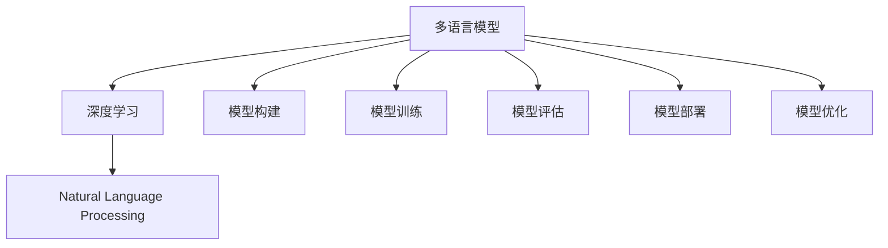

                 

# Python深度学习实践：构建多语言模型处理国际化需求

> 关键词：多语言模型, 深度学习, 国际化需求, Python, 自然语言处理(NLP), 模型构建, 数据处理, 模型训练, 模型评估, 模型部署, 模型优化

## 1. 背景介绍

### 1.1 问题由来
随着全球化的进程加速，企业需要处理来自不同国家和地区的客户数据，国际化的需求日益凸显。而现有的多语言处理技术往往集中在单一语言上，难以应对多语言场景的复杂性。因此，构建能处理多种语言的多语言模型成为当下热门研究方向。

### 1.2 问题核心关键点
构建多语言模型主要面临以下问题：
- 多语言数据预处理：不同语言字符集和编码方式不同，需要特殊处理。
- 多语言模型构建：需要同时训练多种语言的模型，并保证它们之间的互操作性。
- 多语言模型训练：需要兼顾多种语言的数据，确保模型能够处理多语言场景。
- 多语言模型评估：需要设计跨语言评估指标，全面评估模型性能。
- 多语言模型部署：需要将模型部署到多种语言环境中，保证性能一致性。

### 1.3 问题研究意义
构建多语言模型对于拓展多语言处理技术的边界，提高NLP系统的全球化适配能力，具有重要意义：

1. 提升国际化水平：多语言模型可以提供统一、高质量的全球服务，提升企业品牌形象和用户满意度。
2. 降低开发成本：多语言模型的构建和微调通常基于通用模型，可以减少从头开发所需的时间和人力成本。
3. 提高模型泛化能力：多语言模型通过跨语言迁移学习，能够适应更广泛的语言场景，提升模型泛化能力。
4. 增强技术竞争力：掌握多语言模型技术，可以在全球市场竞争中占据有利地位。
5. 推动产业发展：多语言模型的成熟应用，将加速人工智能技术在全球范围的落地和产业化进程。

## 2. 核心概念与联系

### 2.1 核心概念概述

为了更好地理解多语言模型，本节将介绍几个关键概念：

- 多语言模型(Multilingual Model)：能够同时处理多种语言的数据，支持多语言的编码、解码和推理的深度学习模型。
- 深度学习(Deep Learning)：一种基于神经网络的机器学习范式，通过多层非线性变换进行特征提取和分类。
- 自然语言处理(Natural Language Processing, NLP)：研究如何让计算机理解和生成自然语言的技术。
- 模型构建(Model Construction)：从数据预处理、模型设计、训练优化到模型评估的完整流程。
- 模型训练(Model Training)：通过大量训练数据，优化模型参数，使其能够准确预测输出。
- 模型评估(Model Evaluation)：通过评估指标，如准确率、召回率、F1分数等，衡量模型性能。
- 模型部署(Model Deployment)：将训练好的模型部署到生产环境，实现模型推理服务。
- 模型优化(Model Optimization)：通过算法改进、超参数调整等方式，提高模型性能和效率。

这些概念之间的逻辑关系可以通过以下Mermaid流程图来展示：



这个流程图展示了大语言模型的核心概念及其之间的关系：

1. 多语言模型基于深度学习，通过自然语言处理技术进行模型构建。
2. 模型构建过程包含数据预处理、模型设计、训练优化、评估和部署等多个环节。
3. 模型训练优化需要大量的训练数据和算法改进，确保模型能够准确预测输出。
4. 模型评估通过各种指标，衡量模型性能，指导模型优化。
5. 模型部署是将训练好的模型应用于实际生产环境，实现推理服务。
6. 模型优化通过不断迭代改进，提升模型性能和效率。

这些概念共同构成了多语言模型的完整应用框架，使得模型能够适应多语言环境的复杂需求。

## 3. 核心算法原理 & 具体操作步骤
### 3.1 算法原理概述

多语言模型的构建和训练遵循深度学习的原理，其核心思想是：通过多语言数据进行有监督学习，使模型能够同时处理多种语言，并在多语言场景中取得优异性能。

形式化地，假设有多语言数据集 $\{(x_i, y_i)\}_{i=1}^N$，其中 $x_i$ 为多语言文本，$y_i$ 为标签。多语言模型的训练目标是最小化损失函数 $\mathcal{L}(\theta)$，即：

$$
\theta^* = \mathop{\arg\min}_{\theta} \mathcal{L}(\theta)
$$

其中 $\theta$ 为模型参数，$\mathcal{L}$ 为损失函数。常见的损失函数包括交叉熵损失、均方误差损失等。

多语言模型的训练过程通常包括数据预处理、模型设计、训练优化、模型评估和部署等多个环节，通过这些步骤确保模型能够在多语言场景中取得优异表现。

### 3.2 算法步骤详解

以下是多语言模型构建和训练的详细步骤：

**Step 1: 数据预处理**

- 收集多语言数据：从不同语言的数据源获取文本数据，并将其进行标注，例如情感分析、文本分类、命名实体识别等。
- 文本标准化：对不同语言的文本进行标准化，例如统一字符集、去除特殊符号等。
- 分词和标记：将文本分割成单词或子词，并打上标签，例如词性标注、实体识别等。

**Step 2: 模型设计**

- 选择合适的网络结构：例如LSTM、GRU、Transformer等。
- 确定输入和输出维度：根据数据集的特点，设计合适的输入和输出维度。
- 设计多语言编码器：例如使用Transformer进行编码，并设计多语言编码器进行多语言输入。

**Step 3: 模型训练**

- 划分数据集：将数据集划分为训练集、验证集和测试集。
- 设置训练参数：例如学习率、批大小、迭代轮数等。
- 训练模型：使用训练数据进行模型训练，最小化损失函数。
- 模型优化：使用梯度下降等优化算法更新模型参数。

**Step 4: 模型评估**

- 在验证集上评估模型：计算模型在验证集上的各种评估指标，如准确率、召回率、F1分数等。
- 调整模型参数：根据评估结果，调整模型参数和超参数，优化模型性能。

**Step 5: 模型部署**

- 模型保存：将训练好的模型保存到本地或云存储中。
- 搭建推理环境：例如使用TensorFlow、PyTorch等深度学习框架搭建推理环境。
- 实现模型服务：将模型集成到实际的应用系统中，提供推理服务。

### 3.3 算法优缺点

多语言模型构建和训练具有以下优点：

1. 高效处理多语言数据：多语言模型能够同时处理多种语言的文本数据，显著提高数据处理效率。
2. 提高模型泛化能力：通过多语言数据的训练，模型能够适应更广泛的语言场景，提高模型的泛化能力。
3. 降低开发成本：多语言模型通常基于通用模型进行构建和微调，可以减少从头开发所需的时间和人力成本。
4. 增强技术竞争力：掌握多语言模型技术，可以在全球市场竞争中占据有利地位。
5. 推动产业发展：多语言模型的成熟应用，将加速人工智能技术在全球范围的落地和产业化进程。

同时，多语言模型构建和训练也存在一定的局限性：

1. 数据获取难度大：多语言数据通常需要大量标注，数据获取难度大。
2. 模型复杂度高：多语言模型通常结构复杂，参数量较大，训练和推理难度高。
3. 多语言数据不均衡：不同语言的数据量和质量可能存在差异，影响模型性能。
4. 多语言模型评估复杂：多语言模型的评估指标需要兼顾多种语言，设计复杂。
5. 多语言模型部署复杂：多语言模型需要适配多种语言环境，部署复杂。

尽管存在这些局限性，但多语言模型的构建和训练技术仍是大语言处理的重要研究方向，具有广阔的应用前景。

### 3.4 算法应用领域

多语言模型在多个领域中得到了广泛应用，例如：

- 多语言情感分析：通过多语言数据训练模型，对不同语言的文本进行情感分析，评估用户情绪。
- 多语言文本分类：对不同语言的文本进行分类，例如新闻分类、文本主题分类等。
- 多语言命名实体识别：识别不同语言中的实体，例如人名、地名、机构名等。
- 多语言问答系统：对多语言问题进行理解，并生成多语言回答。
- 多语言机器翻译：将一种语言的文本翻译成另一种语言的文本。
- 多语言文本摘要：对多语言文本进行摘要，提取关键信息。

除了上述这些经典任务外，多语言模型的应用还在不断拓展，例如可控文本生成、跨语言推理等，为多语言处理技术带来了新的突破。随着预训练语言模型和模型构建技术的持续演进，多语言模型的应用场景将更加丰富。

## 4. 数学模型和公式 & 详细讲解  
### 4.1 数学模型构建

本节将使用数学语言对多语言模型构建过程进行更加严格的刻画。

假设多语言数据集为 $\{(x_i, y_i)\}_{i=1}^N$，其中 $x_i$ 为多语言文本，$y_i$ 为标签。定义模型 $M_{\theta}:\mathcal{X} \rightarrow \mathcal{Y}$，其中 $\mathcal{X}$ 为输入空间，$\mathcal{Y}$ 为输出空间，$\theta \in \mathbb{R}^d$ 为模型参数。

定义模型 $M_{\theta}$ 在输入 $x_i$ 上的输出为 $\hat{y}=M_{\theta}(x_i) \in [0,1]$，表示样本属于正类的概率。真实标签 $y_i \in \{0,1\}$。则多语言模型的损失函数定义为：

$$
\ell(M_{\theta}(x_i),y_i) = -[y_i\log \hat{y} + (1-y_i)\log (1-\hat{y})]
$$

将其代入经验风险公式，得：

$$
\mathcal{L}(\theta) = -\frac{1}{N}\sum_{i=1}^N [y_i\log M_{\theta}(x_i)+(1-y_i)\log(1-M_{\theta}(x_i))]
$$

根据链式法则，损失函数对参数 $\theta_k$ 的梯度为：

$$
\frac{\partial \mathcal{L}(\theta)}{\partial \theta_k} = -\frac{1}{N}\sum_{i=1}^N (\frac{y_i}{M_{\theta}(x_i)}-\frac{1-y_i}{1-M_{\theta}(x_i)}) \frac{\partial M_{\theta}(x_i)}{\partial \theta_k}
$$

其中 $\frac{\partial M_{\theta}(x_i)}{\partial \theta_k}$ 可进一步递归展开，利用自动微分技术完成计算。

### 4.2 公式推导过程

以下我们以多语言情感分析任务为例，推导多语言情感分类器的损失函数及其梯度的计算公式。

假设模型 $M_{\theta}$ 在输入 $x_i$ 上的输出为 $\hat{y}=M_{\theta}(x_i) \in [0,1]$，表示样本属于正类的概率。真实标签 $y_i \in \{0,1\}$。则多语言情感分类器的损失函数定义为：

$$
\ell(M_{\theta}(x_i),y_i) = -[y_i\log \hat{y} + (1-y_i)\log (1-\hat{y})]
$$

将其代入经验风险公式，得：

$$
\mathcal{L}(\theta) = -\frac{1}{N}\sum_{i=1}^N [y_i\log M_{\theta}(x_i)+(1-y_i)\log(1-M_{\theta}(x_i))]
$$

根据链式法则，损失函数对参数 $\theta_k$ 的梯度为：

$$
\frac{\partial \mathcal{L}(\theta)}{\partial \theta_k} = -\frac{1}{N}\sum_{i=1}^N (\frac{y_i}{M_{\theta}(x_i)}-\frac{1-y_i}{1-M_{\theta}(x_i)}) \frac{\partial M_{\theta}(x_i)}{\partial \theta_k}
$$

在得到损失函数的梯度后，即可带入参数更新公式，完成模型的迭代优化。重复上述过程直至收敛，最终得到适应多语言情感分析任务的最优模型参数 $\theta^*$。

## 5. 项目实践：代码实例和详细解释说明
### 5.1 开发环境搭建

在进行多语言模型开发前，我们需要准备好开发环境。以下是使用Python进行PyTorch开发的环境配置流程：

1. 安装Anaconda：从官网下载并安装Anaconda，用于创建独立的Python环境。

2. 创建并激活虚拟环境：
```bash
conda create -n pytorch-env python=3.8 
conda activate pytorch-env
```

3. 安装PyTorch：根据CUDA版本，从官网获取对应的安装命令。例如：
```bash
conda install pytorch torchvision torchaudio cudatoolkit=11.1 -c pytorch -c conda-forge
```

4. 安装Transformers库：
```bash
pip install transformers
```

5. 安装各类工具包：
```bash
pip install numpy pandas scikit-learn matplotlib tqdm jupyter notebook ipython
```

完成上述步骤后，即可在`pytorch-env`环境中开始多语言模型开发。

### 5.2 源代码详细实现

下面以多语言情感分类器为例，给出使用Transformers库进行多语言模型构建的PyTorch代码实现。

首先，定义情感分类器的数据处理函数：

```python
from transformers import MultilingualBertTokenizer
from torch.utils.data import Dataset

class MultilingualSentimentDataset(Dataset):
    def __init__(self, texts, labels, tokenizer, max_len=128):
        self.texts = texts
        self.labels = labels
        self.tokenizer = tokenizer
        self.max_len = max_len
        
    def __len__(self):
        return len(self.texts)
    
    def __getitem__(self, item):
        text = self.texts[item]
        label = self.labels[item]
        
        encoding = self.tokenizer(text, return_tensors='pt', max_length=self.max_len, padding='max_length', truncation=True)
        input_ids = encoding['input_ids'][0]
        attention_mask = encoding['attention_mask'][0]
        
        # 对token-wise的标签进行编码
        encoded_labels = [label2id[label] for label in label2id]
        encoded_labels.extend([label2id['neutral']] * (self.max_len - len(encoded_labels)))
        labels = torch.tensor(encoded_labels, dtype=torch.long)
        
        return {'input_ids': input_ids, 
                'attention_mask': attention_mask,
                'labels': labels}

# 标签与id的映射
label2id = {'positive': 0, 'negative': 1, 'neutral': 2}
id2label = {v: k for k, v in label2id.items()}
```

然后，定义模型和优化器：

```python
from transformers import MultilingualBertForSequenceClassification, AdamW

model = MultilingualBertForSequenceClassification.from_pretrained('bert-base-multilingual-cased', num_labels=len(label2id))

optimizer = AdamW(model.parameters(), lr=2e-5)
```

接着，定义训练和评估函数：

```python
from torch.utils.data import DataLoader
from tqdm import tqdm
from sklearn.metrics import classification_report

device = torch.device('cuda') if torch.cuda.is_available() else torch.device('cpu')
model.to(device)

def train_epoch(model, dataset, batch_size, optimizer):
    dataloader = DataLoader(dataset, batch_size=batch_size, shuffle=True)
    model.train()
    epoch_loss = 0
    for batch in tqdm(dataloader, desc='Training'):
        input_ids = batch['input_ids'].to(device)
        attention_mask = batch['attention_mask'].to(device)
        labels = batch['labels'].to(device)
        model.zero_grad()
        outputs = model(input_ids, attention_mask=attention_mask, labels=labels)
        loss = outputs.loss
        epoch_loss += loss.item()
        loss.backward()
        optimizer.step()
    return epoch_loss / len(dataloader)

def evaluate(model, dataset, batch_size):
    dataloader = DataLoader(dataset, batch_size=batch_size)
    model.eval()
    preds, labels = [], []
    with torch.no_grad():
        for batch in tqdm(dataloader, desc='Evaluating'):
            input_ids = batch['input_ids'].to(device)
            attention_mask = batch['attention_mask'].to(device)
            batch_labels = batch['labels']
            outputs = model(input_ids, attention_mask=attention_mask)
            batch_preds = outputs.logits.argmax(dim=2).to('cpu').tolist()
            batch_labels = batch_labels.to('cpu').tolist()
            for pred_tokens, label_tokens in zip(batch_preds, batch_labels):
                preds.append(pred_tokens[:len(label_tokens)])
                labels.append(label_tokens)
                
    print(classification_report(labels, preds))
```

最后，启动训练流程并在测试集上评估：

```python
epochs = 5
batch_size = 16

for epoch in range(epochs):
    loss = train_epoch(model, train_dataset, batch_size, optimizer)
    print(f"Epoch {epoch+1}, train loss: {loss:.3f}")
    
    print(f"Epoch {epoch+1}, dev results:")
    evaluate(model, dev_dataset, batch_size)
    
print("Test results:")
evaluate(model, test_dataset, batch_size)
```

以上就是使用PyTorch对Multilingual BERT模型进行多语言情感分类器构建的完整代码实现。可以看到，得益于Transformers库的强大封装，我们可以用相对简洁的代码完成多语言情感分类器的构建。

### 5.3 代码解读与分析

让我们再详细解读一下关键代码的实现细节：

**MultilingualSentimentDataset类**：
- `__init__`方法：初始化文本、标签、分词器等关键组件。
- `__len__`方法：返回数据集的样本数量。
- `__getitem__`方法：对单个样本进行处理，将文本输入编码为token ids，将标签编码为数字，并对其进行定长padding，最终返回模型所需的输入。

**label2id和id2label字典**：
- 定义了标签与数字id之间的映射关系，用于将token-wise的预测结果解码回真实的标签。

**训练和评估函数**：
- 使用PyTorch的DataLoader对数据集进行批次化加载，供模型训练和推理使用。
- 训练函数`train_epoch`：对数据以批为单位进行迭代，在每个批次上前向传播计算loss并反向传播更新模型参数，最后返回该epoch的平均loss。
- 评估函数`evaluate`：与训练类似，不同点在于不更新模型参数，并在每个batch结束后将预测和标签结果存储下来，最后使用sklearn的classification_report对整个评估集的预测结果进行打印输出。

**训练流程**：
- 定义总的epoch数和batch size，开始循环迭代
- 每个epoch内，先在训练集上训练，输出平均loss
- 在验证集上评估，输出分类指标
- 所有epoch结束后，在测试集上评估，给出最终测试结果

可以看到，PyTorch配合Transformers库使得Multilingual BERT模型的构建过程变得简洁高效。开发者可以将更多精力放在数据处理、模型改进等高层逻辑上，而不必过多关注底层的实现细节。

当然，工业级的系统实现还需考虑更多因素，如模型的保存和部署、超参数的自动搜索、更灵活的任务适配层等。但核心的构建范式基本与此类似。

## 6. 实际应用场景
### 6.1 国际化客服系统

基于多语言模型的对话技术，可以广泛应用于国际化客服系统的构建。传统客服往往需要配备大量人力，高峰期响应缓慢，且一致性和专业性难以保证。而使用多语言模型的对话模型，可以7x24小时不间断服务，快速响应客户咨询，用自然流畅的语言解答各类常见问题。

在技术实现上，可以收集企业内部的历史客服对话记录，将问题和最佳答复构建成监督数据，在此基础上对预训练对话模型进行微调。微调后的对话模型能够自动理解用户意图，匹配最合适的答案模板进行回复。对于客户提出的新问题，还可以接入检索系统实时搜索相关内容，动态组织生成回答。如此构建的国际化客服系统，能大幅提升客户咨询体验和问题解决效率。

### 6.2 全球化营销分析

全球化营销分析是企业了解全球市场动向、评估品牌影响力和优化营销策略的重要手段。传统的数据分析方式依赖大量人工标注，成本高、效率低，难以实时获取分析结果。而使用多语言模型进行文本情感分析和舆情监测，可以大幅提升数据分析的效率和准确性。

具体而言，可以收集全球各地的新闻、评论、社交媒体等文本数据，并对其进行情感分析和舆情监测。多语言模型能够自动识别不同语言的情感倾向和舆情变化，帮助企业快速获取全球市场动态，优化营销策略，提升品牌影响力。

### 6.3 多语言知识图谱

知识图谱是一种将实体、关系、属性等结构化信息进行关联存储的知识表示方式，广泛应用于搜索引擎、推荐系统、问答系统等领域。构建多语言知识图谱，可以进一步拓展知识图谱的应用范围，实现多语言信息的协同处理。

在知识图谱的构建过程中，可以使用多语言模型进行实体抽取和关系推理，识别多语言文本中的实体关系，生成跨语言的实体-关系三元组，丰富知识图谱的语义信息。这样构建的多语言知识图谱，可以支持多种语言的信息查询和推理，提升知识图谱的实用性和普及度。

### 6.4 未来应用展望

随着多语言模型和模型构建技术的不断发展，基于多语言模型的应用场景将更加丰富。

在智慧医疗领域，基于多语言模型的医疗问答、病历分析、药物研发等应用将提升医疗服务的智能化水平，辅助医生诊疗，加速新药开发进程。

在智能教育领域，多语言模型可应用于作业批改、学情分析、知识推荐等方面，因材施教，促进教育公平，提高教学质量。

在智慧城市治理中，多语言模型可应用于城市事件监测、舆情分析、应急指挥等环节，提高城市管理的自动化和智能化水平，构建更安全、高效的未来城市。

此外，在企业生产、社会治理、文娱传媒等众多领域，基于多语言模型的多语言处理技术也将不断涌现，为经济社会发展注入新的动力。相信随着技术的日益成熟，多语言模型的应用将进一步拓展，为人工智能技术在全球范围的落地和产业化进程提供新的方向。

## 7. 工具和资源推荐
### 7.1 学习资源推荐

为了帮助开发者系统掌握多语言模型的理论基础和实践技巧，这里推荐一些优质的学习资源：

1. 《Natural Language Processing with PyTorch》系列博文：由多语言模型研究专家撰写，详细介绍了PyTorch在多语言NLP任务中的应用。

2. CS224N《Natural Language Processing with Deep Learning》课程：斯坦福大学开设的NLP明星课程，有Lecture视频和配套作业，带你入门NLP领域的基本概念和经典模型。

3. 《Multilingual NLP: A Guide》书籍：详细介绍多语言NLP技术，涵盖多语言文本预处理、多语言模型构建、多语言模型评估等诸多内容。

4. HuggingFace官方文档：Transformers库的官方文档，提供了海量预训练模型和多语言模型的详细使用说明，是上手实践的必备资料。

5. UMD-MALT开源项目：提供了丰富的多语言文本处理资源，包括数据集、模型和工具等，是进行多语言NLP实验的好帮手。

通过对这些资源的学习实践，相信你一定能够快速掌握多语言模型的精髓，并用于解决实际的NLP问题。
###  7.2 开发工具推荐

高效的开发离不开优秀的工具支持。以下是几款用于多语言模型开发常用的工具：

1. PyTorch：基于Python的开源深度学习框架，灵活动态的计算图，适合快速迭代研究。大部分预训练语言模型都有PyTorch版本的实现。

2. TensorFlow：由Google主导开发的开源深度学习框架，生产部署方便，适合大规模工程应用。同样有丰富的预训练语言模型资源。

3. Transformers库：HuggingFace开发的NLP工具库，集成了众多SOTA语言模型，支持PyTorch和TensorFlow，是进行多语言模型开发的利器。

4. Weights & Biases：模型训练的实验跟踪工具，可以记录和可视化模型训练过程中的各项指标，方便对比和调优。与主流深度学习框架无缝集成。

5. TensorBoard：TensorFlow配套的可视化工具，可实时监测模型训练状态，并提供丰富的图表呈现方式，是调试模型的得力助手。

6. Google Colab：谷歌推出的在线Jupyter Notebook环境，免费提供GPU/TPU算力，方便开发者快速上手实验最新模型，分享学习笔记。

合理利用这些工具，可以显著提升多语言模型开发的速度和质量，加速创新迭代的步伐。

### 7.3 相关论文推荐

多语言模型和模型构建的研究源于学界的持续研究。以下是几篇奠基性的相关论文，推荐阅读：

1. Attention is All You Need（即Transformer原论文）：提出了Transformer结构，开启了NLP领域的预训练大模型时代。

2. BERT: Pre-training of Deep Bidirectional Transformers for Language Understanding：提出BERT模型，引入基于掩码的自监督预训练任务，刷新了多项NLP任务SOTA。

3. Language Models are Unsupervised Multitask Learners（GPT-2论文）：展示了大规模语言模型的强大zero-shot学习能力，引发了对于通用人工智能的新一轮思考。

4. Multilingual NLP with Sparse Tensors: A Dense Approach：提出Sparse Transformer模型，支持高效的多语言文本处理。

5. Multilingual Transformer Language Modeling with Masked LM：提出多语言掩码语言模型，能够同时学习多种语言的词向量表示。

6. Adversarial Examples Are Not Always Adversarial to Multilingual Models：研究多语言模型的鲁棒性，探讨对抗样本对多语言模型的影响。

这些论文代表了大语言模型和模型构建技术的发展脉络。通过学习这些前沿成果，可以帮助研究者把握学科前进方向，激发更多的创新灵感。

## 8. 总结：未来发展趋势与挑战

### 8.1 总结

本文对基于深度学习的多语言模型构建过程进行了全面系统的介绍。首先阐述了多语言模型和模型构建的研究背景和意义，明确了多语言模型在多语言处理技术中的应用前景。其次，从原理到实践，详细讲解了多语言模型的构建和训练步骤，给出了多语言情感分类器的完整代码实现。同时，本文还探讨了多语言模型的实际应用场景，展示了多语言模型的广阔应用前景。

通过本文的系统梳理，可以看到，基于深度学习的多语言模型构建技术正在成为NLP领域的重要研究方向，极大地拓展了多语言处理技术的边界。多语言模型的成功构建和应用，将显著提升NLP系统的全球化适配能力，推动NLP技术的全球化产业化进程。

### 8.2 未来发展趋势

展望未来，多语言模型构建技术将呈现以下几个发展趋势：

1. 模型规模持续增大。随着算力成本的下降和数据规模的扩张，预训练语言模型的参数量还将持续增长。超大规模语言模型蕴含的丰富语言知识，有望支撑更加复杂多变的下游任务。

2. 多语言模型日趋多样化。未来将涌现更多参数高效的多语言模型，例如Multilingual BERT、XLM等，在保留多语言学习能力的同时，减小计算资源消耗。

3. 跨语言迁移学习成为常态。多语言模型能够通过迁移学习，快速适应新语言，减少多语言模型构建和微调的成本。

4. 多语言模型评估体系完善。未来将设计更加全面的跨语言评估指标，确保模型在不同语言环境中的性能一致性。

5. 多语言模型部署工具完善。未来的多语言模型将具备更好的跨语言部署和优化能力，支持更广泛的语言环境。

以上趋势凸显了多语言模型构建技术的广阔前景。这些方向的探索发展，必将进一步提升NLP系统的性能和应用范围，为人工智能技术在全球范围的落地和产业化进程提供新的方向。

### 8.3 面临的挑战

尽管多语言模型构建技术已经取得了瞩目成就，但在迈向更加智能化、普适化应用的过程中，它仍面临着诸多挑战：

1. 数据获取难度大。多语言数据通常需要大量标注，数据获取难度大。
2. 模型复杂度高。多语言模型通常结构复杂，参数量较大，训练和推理难度高。
3. 多语言数据不均衡。不同语言的数据量和质量可能存在差异，影响模型性能。
4. 多语言模型评估复杂。多语言模型的评估指标需要兼顾多种语言，设计复杂。
5. 多语言模型部署复杂。多语言模型需要适配多种语言环境，部署复杂。
6. 模型鲁棒性不足。当前多语言模型面对域外数据时，泛化性能往往大打折扣。
7. 模型可解释性不足。多语言模型通常具有复杂的内部结构，难以解释其内部工作机制和决策逻辑。
8. 模型安全性有待保障。多语言模型可能学习到有偏见、有害的信息，通过迁移学习传递到下游任务，产生误导性、歧视性的输出。

尽管存在这些挑战，但多语言模型构建技术仍是大语言处理的重要研究方向，具有广阔的应用前景。未来需要更多的研究突破和实践积累，以应对这些挑战。

### 8.4 研究展望

面对多语言模型构建所面临的种种挑战，未来的研究需要在以下几个方面寻求新的突破：

1. 探索无监督和半监督多语言模型。摆脱对大规模标注数据的依赖，利用自监督学习、主动学习等无监督和半监督范式，最大限度利用非结构化数据，实现更加灵活高效的多语言模型构建。

2. 研究参数高效和计算高效的多语言模型。开发更加参数高效的多语言模型，在固定大部分预训练参数的同时，只更新极少量的任务相关参数。同时优化多语言模型的计算图，减少前向传播和反向传播的资源消耗，实现更加轻量级、实时性的部署。

3. 引入更多先验知识。将符号化的先验知识，如知识图谱、逻辑规则等，与神经网络模型进行巧妙融合，引导多语言模型学习更准确、合理的语言表征。同时加强不同模态数据的整合，实现视觉、语音等多模态信息与文本信息的协同建模。

4. 结合因果分析和博弈论工具。将因果分析方法引入多语言模型，识别出模型决策的关键特征，增强输出解释的因果性和逻辑性。借助博弈论工具刻画人机交互过程，主动探索并规避模型的脆弱点，提高系统稳定性。

5. 纳入伦理道德约束。在模型训练目标中引入伦理导向的评估指标，过滤和惩罚有偏见、有害的输出倾向。同时加强人工干预和审核，建立模型行为的监管机制，确保输出符合人类价值观和伦理道德。

这些研究方向的探索，必将引领多语言模型构建技术迈向更高的台阶，为构建安全、可靠、可解释、可控的多语言智能系统铺平道路。面向未来，多语言模型构建技术还需要与其他人工智能技术进行更深入的融合，如知识表示、因果推理、强化学习等，多路径协同发力，共同推动自然语言理解和智能交互系统的进步。只有勇于创新、敢于突破，才能不断拓展多语言模型的边界，让智能技术更好地造福人类社会。

## 9. 附录：常见问题与解答

**Q1：多语言模型是否适用于所有NLP任务？**

A: 多语言模型在大多数NLP任务上都能取得不错的效果，特别是对于数据量较小的任务。但对于一些特定领域的任务，如医学、法律等，仅仅依靠通用语料预训练的模型可能难以很好地适应。此时需要在特定领域语料上进一步预训练，再进行多语言模型的微调。

**Q2：多语言模型构建过程中如何选择合适的学习率？**

A: 多语言模型构建的学习率一般要比预训练时小1-2个数量级，如果使用过大的学习率，容易破坏预训练权重，导致过拟合。一般建议从1e-5开始调参，逐步减小学习率，直至收敛。也可以使用warmup策略，在开始阶段使用较小的学习率，再逐渐过渡到预设值。需要注意的是，不同的优化器(如AdamW、Adafactor等)以及不同的学习率调度策略，可能需要设置不同的学习率阈值。

**Q3：多语言模型在实际部署时需要注意哪些问题？**

A: 将多语言模型转化为实际应用，还需要考虑以下因素：
1. 模型裁剪：去除不必要的层和参数，减小模型尺寸，加快推理速度
2. 量化加速：将浮点模型转为定点模型，压缩存储空间，提高计算效率
3. 服务化封装：将模型封装为标准化服务接口，便于集成调用
4. 弹性伸缩：根据请求流量动态调整资源配置，平衡服务质量和成本
5. 监控告警：实时采集系统指标，设置异常告警阈值，确保服务稳定性
6. 安全防护：采用访问鉴权、数据脱敏等措施，保障数据和模型安全

多语言模型构建的复杂性决定了其实际部署的挑战性，开发者需要综合考虑数据预处理、模型训练、模型评估和模型部署等多个环节，才能实现高效的多语言NLP应用。

---

作者：禅与计算机程序设计艺术 / Zen and the Art of Computer Programming

