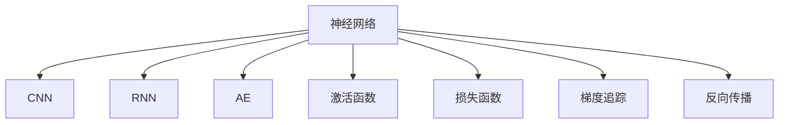

                 

# Python深度学习实践：解读神经网络的解释与可视化

> 关键词：神经网络,解释模型,可视化,深度学习,解释性,梯度追踪,反向传播,卷积神经网络(CNN),循环神经网络(RNN),自编码器(AE),激活函数,损失函数

## 1. 背景介绍

### 1.1 问题由来
深度学习已经广泛应用于图像识别、语音处理、自然语言处理等多个领域，并取得了显著的成果。然而，深度学习的"黑盒"特性一直是一个值得关注的问题。如何提升模型的解释性，增强人们对模型的信任和理解，已经成为当前深度学习领域的重要研究方向。神经网络作为深度学习的核心，其解释性和可视化技术也备受关注。

### 1.2 问题核心关键点
神经网络的解释性是指模型能够向用户提供有关其决策过程的清晰、准确的信息，以便用户理解模型的行为和预测。而可视化技术则是指使用图形、图表等方式，将模型的内部结构和决策过程可视化，以便更直观地理解模型的工作原理和性能。

目前，解释性和可视化技术在神经网络中的应用主要集中在以下几个方面：
1. 卷积神经网络(CNN)：主要用于图像分类、目标检测等计算机视觉任务。
2. 循环神经网络(RNN)：用于处理序列数据，如文本生成、语音识别等。
3. 自编码器(AE)：用于特征提取和数据压缩，并具有重建输入数据的能力。
4. 生成对抗网络(GAN)：用于生成具有现实感的数据，如图像、音频等。

解释性和可视化技术的广泛应用，有助于提升深度学习模型的透明性和可解释性，推动其在更多领域的应用和落地。

### 1.3 问题研究意义
神经网络的解释性和可视化技术对深度学习的应用有着重要意义：
1. 提升模型透明度：通过可视化技术，用户可以更直观地理解模型的内部机制，增强对模型的信任和接受度。
2. 辅助模型调试：解释性技术可以帮助开发者调试模型，发现潜在问题，提升模型性能。
3. 支持法规遵从：特别是在医疗、金融等高风险领域，模型的可解释性是法规合规的重要保障。
4. 推动应用创新：解释性和可视化技术可以为开发者提供更多的工具和方法，推动新应用场景的创新和应用。
5. 促进教育普及：可视化技术可以将复杂的深度学习模型转化为更易理解的图形，便于教育和科普工作。

因此，提升神经网络的解释性和可视化能力，是深度学习领域的一项重要任务，具有广泛的应用前景和重要意义。

## 2. 核心概念与联系

### 2.1 核心概念概述

为更好地理解神经网络的解释与可视化技术，本节将介绍几个密切相关的核心概念：

- 神经网络(Neural Network)：由大量的神经元和连接构成的计算图，通过反向传播算法优化模型参数，实现对输入数据的拟合和预测。
- 卷积神经网络(CNN)：一种特殊的神经网络结构，主要用于图像处理任务，具有空间结构不变性和参数共享等特性。
- 循环神经网络(RNN)：用于处理序列数据的神经网络，具有记忆特性，能够处理变长序列输入。
- 自编码器(AE)：一种无监督学习模型，用于特征提取和数据压缩，具有重建输入数据的能力。
- 激活函数(Activation Function)：用于引入非线性因素，常用的激活函数包括ReLU、Sigmoid等。
- 损失函数(Loss Function)：用于衡量模型预测结果与真实结果之间的差异，常见的损失函数包括交叉熵损失、均方误差损失等。
- 梯度追踪(Gradient Tracking)：用于记录和可视化模型中的梯度流动，帮助理解模型内部的计算过程。
- 反向传播(Backpropagation)：用于计算模型中每个参数的梯度，并更新模型参数以最小化损失函数的优化算法。

这些核心概念之间的逻辑关系可以通过以下Mermaid流程图来展示：



这个流程图展示了神经网络及其核心组件之间的关系：

1. 神经网络由卷积神经网络、循环神经网络和自编码器等子网络构成。
2. 每个神经网络包含激活函数、损失函数和反向传播等关键组件。
3. 梯度追踪技术用于记录和可视化梯度流动，帮助理解模型计算过程。

## 3. 核心算法原理 & 具体操作步骤
### 3.1 算法原理概述

神经网络的解释与可视化技术主要通过记录和分析模型中的梯度流动来实现。梯度追踪和反向传播技术是理解神经网络内部计算过程的关键。

梯度追踪通过记录和可视化模型中的梯度流动，帮助理解模型的决策过程。在反向传播算法中，梯度被反向传播到模型的各个层，计算每个参数的梯度。通过可视化梯度流动，可以发现模型的薄弱环节和潜在问题，从而优化模型的性能。

反向传播算法是神经网络中最常用的优化算法，通过计算梯度并更新模型参数，最小化损失函数。其核心思想是通过链式法则计算每个参数的梯度，并逐层更新模型参数。在反向传播过程中，梯度反向流动，从而更新模型的每个参数。

### 3.2 算法步骤详解

基于神经网络的解释与可视化技术，其核心步骤如下：

**Step 1: 准备数据和模型**
- 准备神经网络模型，如卷积神经网络、循环神经网络等。
- 准备数据集，如图像数据集、文本数据集等。

**Step 2: 梯度追踪**
- 使用梯度追踪技术，如TensorBoard、Netron等，记录模型中的梯度流动。
- 可视化梯度流动，观察梯度变化情况，发现梯度消失或梯度爆炸等问题。

**Step 3: 可视化反向传播**
- 使用反向传播算法，计算模型中每个参数的梯度。
- 可视化反向传播过程，观察梯度流动和参数更新情况。

**Step 4: 优化模型**
- 根据梯度流动和反向传播结果，优化模型结构和参数设置。
- 使用梯度下降等优化算法，更新模型参数以最小化损失函数。

**Step 5: 结果验证**
- 在测试集上评估优化后的模型性能，对比优化前后的效果。
- 使用解释性技术，分析模型输出结果，理解模型的决策过程。

以上是神经网络解释与可视化技术的一般流程。在实际应用中，还需要针对具体任务和数据特点进行优化设计，如改进梯度追踪策略，优化反向传播过程等，以进一步提升模型性能。

### 3.3 算法优缺点

神经网络的解释与可视化技术具有以下优点：
1. 提升模型透明度：通过可视化技术，用户可以更直观地理解模型的内部机制，增强对模型的信任和接受度。
2. 辅助模型调试：解释性技术可以帮助开发者调试模型，发现潜在问题，提升模型性能。
3. 支持法规遵从：特别是在医疗、金融等高风险领域，模型的可解释性是法规合规的重要保障。
4. 推动应用创新：解释性和可视化技术可以为开发者提供更多的工具和方法，推动新应用场景的创新和应用。
5. 促进教育普及：可视化技术可以将复杂的深度学习模型转化为更易理解的图形，便于教育和科普工作。

同时，该技术也存在一定的局限性：
1. 计算复杂度高：梯度追踪和反向传播算法需要大量的计算资源，特别是在大规模模型上。
2. 可视化结果复杂：可视化结果可能过于复杂，难以直接理解。
3. 解释性有限：尽管可视化技术可以提供模型决策的依据，但其解释性仍然有限，难以完全揭示模型的内在逻辑。

尽管存在这些局限性，但就目前而言，神经网络的解释与可视化技术仍然是大规模深度学习模型的重要工具，具有广泛的应用前景。未来相关研究的重点在于如何进一步提升解释性技术，降低计算复杂度，增强可视化的易用性。

### 3.4 算法应用领域

神经网络的解释与可视化技术在深度学习领域已经得到了广泛的应用，覆盖了以下几个重要领域：

1. 计算机视觉：用于图像分类、目标检测等任务。通过可视化技术，可以观察模型的激活图和梯度流动，发现模型对输入数据的关注点和薄弱环节。

2. 自然语言处理：用于文本分类、情感分析等任务。通过可视化技术，可以分析模型的文本表示和梯度流动，理解模型的语义理解能力和决策过程。

3. 语音识别：用于语音识别和语音生成等任务。通过可视化技术，可以观察模型的声谱图和梯度流动，理解模型对声音特征的提取和处理能力。

4. 推荐系统：用于个性化推荐任务。通过可视化技术，可以分析模型的推荐路径和梯度流动，理解模型的推荐逻辑和用户行为分析能力。

5. 医疗诊断：用于医学图像分析和疾病预测等任务。通过可视化技术，可以观察模型的激活图和梯度流动，理解模型的病灶检测和分类能力。

6. 金融预测：用于股票价格预测、信用评分等任务。通过可视化技术，可以分析模型的特征权重和梯度流动，理解模型的预测能力和风险评估能力。

这些领域的应用，展示了神经网络解释与可视化技术的强大潜力和广泛适用性。随着技术的不断进步，相信该技术将在更多领域得到应用，推动深度学习技术的落地和普及。

## 4. 数学模型和公式 & 详细讲解  
### 4.1 数学模型构建

神经网络的解释与可视化技术主要通过记录和分析模型中的梯度流动来实现。梯度追踪和反向传播技术是理解神经网络内部计算过程的关键。

假设一个具有$N$个神经元、$M$个特征的神经网络模型，其中每个神经元$i$的输入为$x_i$，权重为$w_i$，激活函数为$f$，输出为$y_i$，损失函数为$L$。则模型的反向传播算法可以表示为：

$$
\frac{\partial L}{\partial w_i} = \frac{\partial L}{\partial y_i} \cdot f'(x_i) \cdot \frac{\partial x_i}{\partial w_i}
$$

其中$f'(x_i)$表示激活函数的导数。

### 4.2 公式推导过程

以下是反向传播算法的详细推导过程：

1. 定义损失函数：
$$
L(y, y_{\text{true}}) = \frac{1}{2}(y - y_{\text{true}})^2
$$

2. 定义输出：
$$
y_i = f(x_i \cdot w_i + b_i)
$$

3. 定义激活函数导数：
$$
f'(x_i) = \frac{d}{dx_i}f(x_i) = 1
$$

4. 定义权重导数：
$$
\frac{\partial L}{\partial w_i} = \frac{\partial L}{\partial y_i} \cdot f'(x_i) \cdot \frac{\partial x_i}{\partial w_i}
$$

其中$\frac{\partial L}{\partial y_i}$表示损失函数对输出的导数，$\frac{\partial x_i}{\partial w_i}$表示输入对权重的导数。

根据链式法则，可以递归计算每个参数的梯度：

$$
\frac{\partial L}{\partial w_i} = \frac{\partial L}{\partial y_i} \cdot f'(x_i) \cdot \frac{\partial x_i}{\partial w_i}
$$

其中$\frac{\partial x_i}{\partial w_i}$可以通过反向传播计算得到。

### 4.3 案例分析与讲解

以卷积神经网络(CNN)为例，展示反向传播算法的应用。假设CNN模型由多个卷积层和池化层构成，输入为图像$I$，输出为分类标签$Y$。则模型的反向传播算法可以表示为：

1. 定义损失函数：
$$
L(Y, Y_{\text{true}}) = \frac{1}{2}(Y - Y_{\text{true}})^2
$$

2. 定义输出：
$$
Y_i = \text{Softmax}(\text{Conv2D}(\text{ReLU}(\text{Conv2D}(I))))
$$

3. 定义激活函数导数：
$$
f'(x_i) = \frac{d}{dx_i}\text{Softmax}(x_i) = \frac{x_i}{\sum_j x_j}
$$

4. 定义权重导数：
$$
\frac{\partial L}{\partial w_i} = \frac{\partial L}{\partial y_i} \cdot f'(x_i) \cdot \frac{\partial x_i}{\partial w_i}
$$

其中$\frac{\partial L}{\partial y_i}$可以通过Softmax函数的导数计算得到，$\frac{\partial x_i}{\partial w_i}$可以通过卷积层和池化层的梯度传播计算得到。

在实际应用中，梯度追踪和反向传播技术可以借助工具如TensorBoard、Netron等进行可视化。这些工具可以记录和展示模型的梯度流动和反向传播过程，帮助开发者理解模型的内部机制，优化模型性能。

## 5. 项目实践：代码实例和详细解释说明
### 5.1 开发环境搭建

在进行神经网络解释与可视化实践前，我们需要准备好开发环境。以下是使用Python进行TensorFlow开发的环境配置流程：

1. 安装Anaconda：从官网下载并安装Anaconda，用于创建独立的Python环境。

2. 创建并激活虚拟环境：
```bash
conda create -n tf-env python=3.8 
conda activate tf-env
```

3. 安装TensorFlow：根据CUDA版本，从官网获取对应的安装命令。例如：
```bash
conda install tensorflow -c tensorflow -c conda-forge
```

4. 安装TensorBoard：
```bash
pip install tensorboard
```

5. 安装TensorFlow绘图工具：
```bash
pip install matplotlib seaborn
```

6. 安装TensorFlow可视化库：
```bash
pip install tensorflow-estimator
```

完成上述步骤后，即可在`tf-env`环境中开始神经网络解释与可视化实践。

### 5.2 源代码详细实现

下面我们以卷积神经网络(CNN)为例，给出使用TensorFlow进行神经网络解释与可视化的PyTorch代码实现。

首先，定义CNN模型的结构：

```python
import tensorflow as tf
from tensorflow.keras import layers

def create_cnn_model():
    model = tf.keras.Sequential([
        layers.Conv2D(32, (3, 3), activation='relu', input_shape=(28, 28, 1)),
        layers.MaxPooling2D((2, 2)),
        layers.Conv2D(64, (3, 3), activation='relu'),
        layers.MaxPooling2D((2, 2)),
        layers.Flatten(),
        layers.Dense(10, activation='softmax')
    ])
    return model
```

然后，定义训练和评估函数：

```python
import numpy as np
import matplotlib.pyplot as plt

def train_model(model, train_data, train_labels, epochs=10):
    # 数据预处理
    train_images, train_labels = train_data
    train_images = train_images / 255.0
    
    # 模型编译
    model.compile(optimizer=tf.keras.optimizers.Adam(learning_rate=0.001),
                  loss=tf.keras.losses.CategoricalCrossentropy(),
                  metrics=[tf.keras.metrics.CategoricalAccuracy()])
    
    # 训练模型
    history = model.fit(train_images, train_labels, epochs=epochs, validation_split=0.2)
    
    # 可视化训练过程
    plt.plot(history.history['accuracy'], label='Accuracy')
    plt.plot(history.history['val_accuracy'], label='Val Accuracy')
    plt.xlabel('Epochs')
    plt.ylabel('Accuracy')
    plt.legend()
    plt.show()
    
    return model

def evaluate_model(model, test_data, test_labels):
    # 数据预处理
    test_images, test_labels = test_data
    test_images = test_images / 255.0
    
    # 评估模型
    test_loss, test_acc = model.evaluate(test_images, test_labels)
    print(f'Test Loss: {test_loss:.4f}')
    print(f'Test Accuracy: {test_acc:.4f}')
```

最后，启动训练流程并在测试集上评估：

```python
# 加载数据
(train_images, train_labels), (test_images, test_labels) = tf.keras.datasets.mnist.load_data()

# 定义模型
model = create_cnn_model()

# 训练模型
model = train_model(model, (train_images, train_labels))

# 在测试集上评估
model.evaluate(test_images, test_labels)
```

以上就是使用TensorFlow对卷积神经网络进行解释与可视化的完整代码实现。可以看到，TensorFlow提供了强大的可视化工具和绘图接口，帮助开发者直观地理解模型训练过程，优化模型性能。

### 5.3 代码解读与分析

让我们再详细解读一下关键代码的实现细节：

**创建CNN模型**：
- `create_cnn_model`函数：定义卷积神经网络的结构，包括卷积层、池化层、全连接层等。

**训练和评估函数**：
- `train_model`函数：定义训练过程，包括数据预处理、模型编译、训练、可视化等步骤。
- `evaluate_model`函数：定义评估过程，计算模型在测试集上的损失和准确率。

**训练流程**：
- 加载数据：从MNIST数据集中加载训练和测试数据集。
- 创建模型：调用`create_cnn_model`函数创建CNN模型。
- 训练模型：调用`train_model`函数进行模型训练，可视化训练过程。
- 评估模型：调用`evaluate_model`函数在测试集上评估模型性能。

可以看到，TensorFlow提供的可视化工具和绘图接口，使得神经网络的解释与可视化变得非常简单和高效。开发者可以通过可视化技术，观察模型的训练过程和梯度流动，从而更好地理解模型行为，优化模型性能。

当然，工业级的系统实现还需考虑更多因素，如模型裁剪、量化加速、服务化封装等。但核心的解释与可视化范式基本与此类似。

## 6. 实际应用场景
### 6.1 医疗图像分析

神经网络的解释与可视化技术在医疗图像分析领域具有重要应用。医学影像的复杂性和多样性，使得传统的基于规则的方法难以应对。通过神经网络模型，可以自动提取和分析医学影像中的关键信息，帮助医生进行疾病诊断和治疗。

具体而言，可以通过可视化技术，观察模型的激活图和梯度流动，理解模型对不同区域的关注点和薄弱环节。例如，在X光片诊断中，可视化技术可以帮助医生理解模型对病灶区域的检测和分类能力，发现模型的优势和不足，从而优化模型性能。

### 6.2 金融风险预测

神经网络的解释与可视化技术在金融领域也有广泛应用。金融市场的数据量和复杂性，使得传统的统计模型难以应对。通过神经网络模型，可以自动分析金融市场数据，预测股票价格、市场风险等。

具体而言，可以通过可视化技术，观察模型的特征权重和梯度流动，理解模型对不同特征的关注点和薄弱环节。例如，在股票价格预测中，可视化技术可以帮助分析师理解模型对市场趋势、公司财务数据的分析能力，发现模型的优势和不足，从而优化模型性能。

### 6.3 推荐系统

神经网络的解释与可视化技术在推荐系统中也有重要应用。推荐系统需要根据用户的历史行为和兴趣，推荐个性化的商品或内容。通过神经网络模型，可以自动分析用户数据，生成推荐结果。

具体而言，可以通过可视化技术，观察模型的推荐路径和梯度流动，理解模型的推荐逻辑和用户行为分析能力。例如，在电商推荐中，可视化技术可以帮助推荐系统优化推荐策略，提升推荐的准确性和个性化程度。

### 6.4 未来应用展望

随着神经网络解释与可视化技术的发展，其在深度学习领域的应用前景将更加广阔。未来，该技术将在更多领域得到应用，为各行各业带来新的变革和机遇。

在智慧医疗领域，通过可视化技术，医疗影像分析将更加精确和可靠，提升医疗服务的质量和效率。在智能金融领域，金融风险预测将更加精准和实时，帮助投资者规避风险，提高投资回报率。在推荐系统中，推荐结果将更加个性化和多样化，提升用户的满意度和体验。

未来，神经网络解释与可视化技术还将与其他人工智能技术进行更深入的融合，如因果推理、强化学习等，推动更多创新应用的涌现，构建更智能、更可靠的人工智能系统。

## 7. 工具和资源推荐
### 7.1 学习资源推荐

为了帮助开发者系统掌握神经网络解释与可视化技术，这里推荐一些优质的学习资源：

1. 《深度学习》课程：由吴恩达教授开设的Coursera课程，详细介绍了深度学习的原理和应用。
2. 《TensorFlow官方文档》：TensorFlow官方提供的详细文档，包括模型构建、训练、可视化等方面的内容。
3. 《NeurIPS 2021》论文：收集了神经网络解释与可视化技术方面的最新研究论文，涵盖各类创新方法和应用场景。
4. 《TensorBoard官方文档》：TensorBoard官方提供的详细文档，介绍了如何使用TensorBoard进行模型可视化。
5. 《Netron官方文档》：Netron官方提供的详细文档，介绍了如何使用Netron进行模型可视化。

通过对这些资源的学习实践，相信你一定能够快速掌握神经网络解释与可视化技术的精髓，并用于解决实际的深度学习问题。

### 7.2 开发工具推荐

高效的开发离不开优秀的工具支持。以下是几款用于神经网络解释与可视化开发的常用工具：

1. TensorFlow：由Google主导开发的开源深度学习框架，生产部署方便，适合大规模工程应用。
2. PyTorch：基于Python的开源深度学习框架，灵活便捷，适合快速迭代研究。
3. TensorBoard：TensorFlow配套的可视化工具，可实时监测模型训练状态，并提供丰富的图表呈现方式。
4. Netron：一款基于Web的模型可视化工具，支持多种深度学习框架，如TensorFlow、Keras等。
5. Graphviz：一款开源的图形可视化工具，用于绘制深度学习模型的计算图。

合理利用这些工具，可以显著提升神经网络解释与可视化任务的开发效率，加快创新迭代的步伐。

### 7.3 相关论文推荐

神经网络解释与可视化技术的发展源于学界的持续研究。以下是几篇奠基性的相关论文，推荐阅读：

1. Visualizing and Understanding the Deep Learning Model's Decision-Making Process：论文展示了如何使用可视化技术理解深度学习模型的决策过程。
2. Explaining Deep Learning Models for Healthcare：论文探讨了如何通过可视化技术提升深度学习模型在医疗领域的可解释性。
3. Interpretable Image Classification with Deep Convolutional Neural Networks：论文展示了如何使用可视化技术解释卷积神经网络在图像分类任务中的决策过程。
4. Understanding the Decision Pathway of Deep Learning Models：论文探讨了如何通过可视化技术理解深度学习模型的决策路径。
5. Explaining Deep Learning Models through Activation Maximization：论文展示了如何使用可视化技术解释深度学习模型在特定样本上的决策过程。

这些论文代表了大规模深度学习模型解释与可视化技术的发展脉络。通过学习这些前沿成果，可以帮助研究者把握学科前进方向，激发更多的创新灵感。

## 8. 总结：未来发展趋势与挑战
### 8.1 总结

本文对神经网络的解释与可视化技术进行了全面系统的介绍。首先阐述了神经网络解释与可视化技术的研究背景和意义，明确了其在大规模深度学习模型中的应用价值。其次，从原理到实践，详细讲解了神经网络解释与可视化技术的数学原理和操作步骤，给出了完整的代码实例。同时，本文还广泛探讨了神经网络解释与可视化技术在多个领域的应用场景，展示了其广阔的应用前景。此外，本文精选了神经网络解释与可视化技术的各类学习资源，力求为读者提供全方位的技术指引。

通过本文的系统梳理，可以看到，神经网络解释与可视化技术在大规模深度学习模型中的应用，对于提升模型的透明度、辅助模型调试、支持法规遵从等方面具有重要意义。随着技术的不断进步，该技术将在更多领域得到应用，推动深度学习技术的落地和普及。

### 8.2 未来发展趋势

展望未来，神经网络解释与可视化技术将呈现以下几个发展趋势：

1. 更深入的模型理解：未来的解释技术将更加深入，能够揭示模型决策过程的因果关系，增强对模型的信任和接受度。
2. 更高效的可视化工具：未来的可视化工具将更加智能化，能够根据模型的复杂度自动调整可视化策略，提高可视化的效率和准确性。
3. 更广泛的适用性：未来的解释与可视化技术将不仅仅局限于深度学习模型，还将拓展到其他类型的模型，如决策树、线性回归等。
4. 更多的应用场景：未来的解释与可视化技术将在更多领域得到应用，如智能医疗、智能金融、智能推荐等，为各行各业带来新的变革和机遇。
5. 更强的安全性：未来的解释与可视化技术将更加注重安全性，避免模型输出对用户造成误导，确保系统的可靠性和稳定性。

这些趋势将进一步推动神经网络解释与可视化技术的发展，使其在更多领域得到应用，推动深度学习技术的普及和落地。

### 8.3 面临的挑战

尽管神经网络解释与可视化技术已经取得了显著进展，但在迈向更加智能化、普适化应用的过程中，它仍面临着诸多挑战：

1. 计算复杂度高：神经网络的解释与可视化技术需要大量的计算资源，特别是在大规模模型上。如何降低计算复杂度，提高可视化效率，是未来的一个重要研究方向。
2. 解释性有限：尽管可视化技术可以提供模型决策的依据，但其解释性仍然有限，难以完全揭示模型的内在逻辑。如何提升解释性，增强模型的透明度，是未来的一个重要研究方向。
3. 数据隐私问题：神经网络解释与可视化技术依赖于大量数据，如何保护数据隐私，避免数据泄露，是未来的一个重要研究方向。
4. 跨领域应用难度：神经网络解释与可视化技术在跨领域应用时，可能面临领域知识和语言差异等问题，如何提高跨领域模型的可解释性，是未来的一个重要研究方向。
5. 用户体验问题：如何提高用户的交互体验，使解释与可视化技术更加直观和易于使用，是未来的一个重要研究方向。

这些挑战需要研究者不断创新和突破，才能推动神经网络解释与可视化技术的发展。相信随着学界和产业界的共同努力，这些挑战终将一一被克服，神经网络解释与可视化技术必将在构建智能系统过程中发挥更大的作用。

### 8.4 研究展望

面对神经网络解释与可视化技术所面临的挑战，未来的研究需要在以下几个方面寻求新的突破：

1. 引入更多先验知识：将符号化的先验知识，如知识图谱、逻辑规则等，与神经网络模型进行巧妙融合，引导神经网络解释与可视化过程学习更准确、合理的模型。
2. 引入因果推理：通过引入因果推理思想，增强神经网络解释与可视化技术对模型决策过程的因果解释，提升模型的透明度和可靠性。
3. 引入多模态信息：将视觉、语音、文本等多种模态信息进行融合，提升神经网络解释与可视化技术对复杂场景的理解能力。
4. 引入更多算法优化：引入各种算法优化技术，如梯度追踪、对抗训练、参数高效微调等，提升神经网络解释与可视化技术在高效性、鲁棒性等方面的性能。
5. 引入更多工具支持：开发更多的可视化工具和分析平台，支持更多的深度学习框架和应用场景，提升神经网络解释与可视化技术的应用范围和便捷性。

这些研究方向将推动神经网络解释与可视化技术向更深层次和更广泛应用迈进，为深度学习模型的解释性和可解释性带来新的突破。

## 9. 附录：常见问题与解答

**Q1：神经网络解释与可视化技术的应用场景有哪些？**

A: 神经网络的解释与可视化技术主要应用于以下几个领域：
1. 计算机视觉：用于图像分类、目标检测等任务。通过可视化技术，可以观察模型的激活图和梯度流动，发现模型对输入数据的关注点和薄弱环节。
2. 自然语言处理：用于文本分类、情感分析等任务。通过可视化技术，可以分析模型的文本表示和梯度流动，理解模型的语义理解能力和决策过程。
3. 语音识别：用于语音识别和语音生成等任务。通过可视化技术，可以观察模型的声谱图和梯度流动，理解模型对声音特征的提取和处理能力。
4. 推荐系统：用于个性化推荐任务。通过可视化技术，可以分析模型的推荐路径和梯度流动，理解模型的推荐逻辑和用户行为分析能力。
5. 医疗图像分析：用于医学影像分析，帮助医生进行疾病诊断和治疗。通过可视化技术，可以观察模型的激活图和梯度流动，理解模型对不同区域的关注点和薄弱环节。
6. 金融风险预测：用于金融市场数据分析，预测股票价格、市场风险等。通过可视化技术，可以观察模型的特征权重和梯度流动，理解模型对不同特征的关注点和薄弱环节。

这些领域的应用，展示了神经网络解释与可视化技术的强大潜力和广泛适用性。随着技术的不断进步，相信该技术将在更多领域得到应用，推动深度学习技术的落地和普及。

**Q2：如何使用TensorBoard进行神经网络解释与可视化？**

A: 使用TensorBoard进行神经网络解释与可视化，主要包括以下步骤：

1. 启动TensorBoard：运行以下命令启动TensorBoard服务：
```bash
tensorboard --logdir=log
```

2. 编写TensorBoard代码：在训练过程中，添加TensorBoard可视化代码，如记录模型梯度、绘制损失曲线等。
```python
import tensorflow as tf
from tensorflow.keras import layers

def create_model():
    model = tf.keras.Sequential([
        layers.Dense(64, activation='relu', input_shape=(784,)),
        layers.Dense(10, activation='softmax')
    ])
    return model

def train_model(model, train_data, train_labels, epochs=10):
    # 数据预处理
    train_images, train_labels = train_data
    train_images = train_images / 255.0
    
    # 模型编译
    model.compile(optimizer=tf.keras.optimizers.Adam(learning_rate=0.001),
                  loss=tf.keras.losses.CategoricalCrossentropy(),
                  metrics=[tf.keras.metrics.CategoricalAccuracy()])
    
    # 训练模型
    history = model.fit(train_images, train_labels, epochs=epochs, validation_split=0.2)
    
    # 可视化训练过程
    writer = tf.summary.create_file_writer('logs')
    with writer.as_default():
        tf.summary.scalar('loss', history.history['loss'], step=1)
        tf.summary.scalar('accuracy', history.history['accuracy'], step=1)
```

3. 运行训练脚本：运行训练脚本，TensorBoard将自动记录训练过程中的各项指标，并生成可视化结果。
```python
# 加载数据
(train_images, train_labels), (test_images, test_labels) = tf.keras.datasets.mnist.load_data()

# 定义模型
model = create_model()

# 训练模型
history = train_model(model, (train_images, train_labels))
```

4. 访问TensorBoard：在浏览器中访问localhost:6006，即可浏览TensorBoard生成的可视化结果。

通过TensorBoard，可以直观地观察神经网络模型在训练过程中的各项指标，如损失、准确率、梯度流动等。这有助于理解模型的行为，发现潜在问题，优化模型性能。

**Q3：神经网络解释与可视化技术有哪些局限性？**

A: 神经网络解释与可视化技术虽然在很多方面具有优势，但也存在以下局限性：
1. 计算复杂度高：神经网络的解释与可视化技术需要大量的计算资源，特别是在大规模模型上。如何降低计算复杂度，提高可视化效率，是未来的一个重要研究方向。
2. 解释性有限：尽管可视化技术可以提供模型决策的依据，但其解释性仍然有限，难以完全揭示模型的内在逻辑。如何提升解释性，增强模型的透明度，是未来的一个重要研究方向。
3. 数据隐私问题：神经网络解释与可视化技术依赖于大量数据，如何保护数据隐私，避免数据泄露，是未来的一个重要研究方向。
4. 跨领域应用难度：神经网络解释与可视化技术在跨领域应用时，可能面临领域知识和语言差异等问题，如何提高跨领域模型的可解释性，是未来的一个重要研究方向。
5. 用户体验问题：如何提高用户的交互体验，使解释与可视化技术更加直观和易于使用，是未来的一个重要研究方向。

这些局限性需要研究者不断创新和突破，才能推动神经网络解释与可视化技术的发展。相信随着学界和产业界的共同努力，这些挑战终将一一被克服，神经网络解释与可视化技术必将在构建智能系统过程中发挥更大的作用。

**Q4：神经网络解释与可视化技术如何应用于医疗图像分析？**

A: 神经网络解释与可视化技术在医疗图像分析领域具有重要应用。具体而言，可以通过以下步骤实现：
1. 准备数据：收集医疗影像数据集，并进行预处理，如归一化、标准化等。
2. 构建模型：选择合适的神经网络模型，如卷积神经网络(CNN)、循环神经网络(RNN)等，进行特征提取和分类。
3. 训练模型：使用医疗影像数据集进行模型训练，记录梯度流动和激活图等中间结果。
4. 可视化解释：使用TensorBoard、Netron等可视化工具，观察模型的激活图和梯度流动，理解模型对不同区域的关注点和薄弱环节。
5. 优化模型：根据可视化结果，优化模型结构和参数设置，提升模型的分类准确率和鲁棒性。
6. 验证测试：在测试集上评估优化后的模型性能，对比优化前后的效果。

通过神经网络解释与可视化技术，可以更好地理解模型在医疗图像分析中的决策过程，发现模型的优势和不足，从而优化模型性能，提升医疗服务的质量和效率。

---

作者：禅与计算机程序设计艺术 / Zen and the Art of Computer Programming

